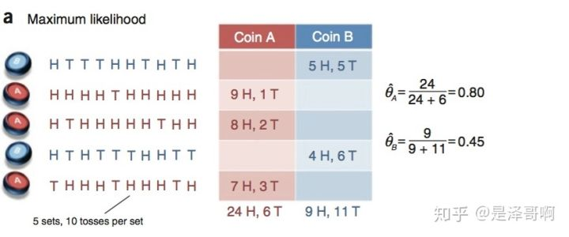
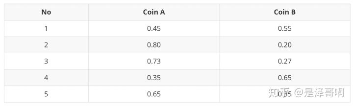
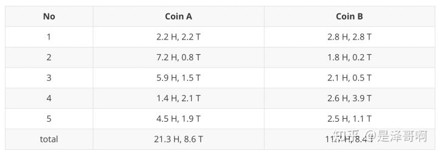
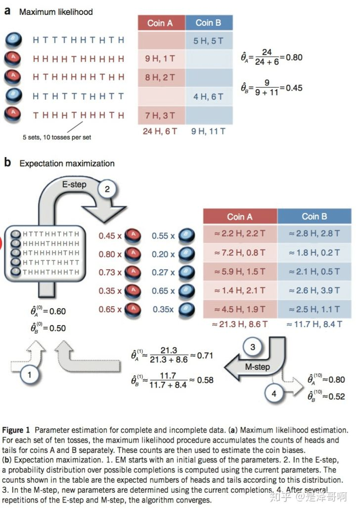
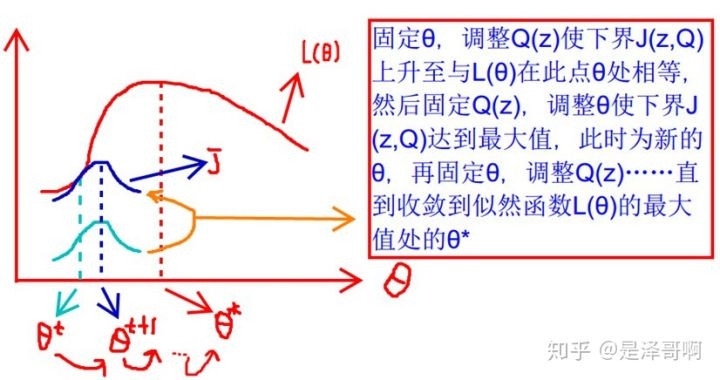
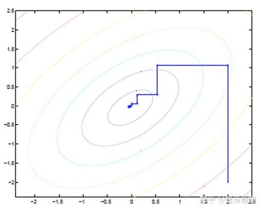

# EM——期望最大
`https://zhuanlan.zhihu.com/p/78311644`

EM 算法，全称 Expectation Maximization Algorithm。期望最大算法是一种迭代算法，用于含有隐变量（Hidden Variable）的概率参数模型的最大似然估计或极大后验概率估计。

本文思路大致如下：先简要介绍其思想，然后举两个例子帮助大家理解，有了感性的认识后再进行严格的数学公式推导。

## 1. 思想

EM 算法的核心思想非常简单，分为两步：Expection-Step 和 Maximization-Step。E-Step 主要通过观察数据和现有模型来估计参数，然后用这个估计的参数值来计算上述对数似然函数的期望值；而 M-Step 是寻找似然函数最大化时对应的参数。由于算法会保证在每次迭代之后似然函数都会增加，所以函数最终会收敛。

## 2. 举例

我们举两个例子来直观的感受下 EM 算法。

### 2.1 例子 A

第一个例子我们将引用 Nature Biotech 的 EM tutorial 文章中的例子。

**2.1.1 背景**

假设有两枚硬币 A 和 B，他们的随机抛掷的结果如下图所示：

我们很容易估计出两枚硬币抛出正面的概率：

$\theta_A = 24/30 =0.8 \\\theta_B = 9/20 =0.45  \\$

现在我们加入隐变量，抹去每轮投掷的硬币标记：

碰到这种情况，我们该如何估计$\theta_A$和$\theta_B$的值？

我们多了一个隐变量$Z=(z_1, z_2, z_3, z_4, z_5)$，代表每一轮所使用的硬币，我们需要知道每一轮抛掷所使用的硬币这样才能估计$\theta_A$和$\theta_B$的值，但是估计隐变量 Z 我们又需要知道$\theta_A$和$\theta_B$的值，才能用极大似然估计法去估计出 Z。这就陷入了一个鸡生蛋和蛋生鸡的问题。

其解决方法就是先随机初始化$\theta_A$和$\theta_B$，然后用去估计 Z， 然后基于 Z 按照最大似然概率去估计新的$\theta_A$和$\theta_B$，循环至收敛。

**2.1.2 计算**

随机初始化$\theta_A=0.6$和$\theta_B=0.5$

对于第一轮来说，如果是硬币 A，得出的 5 正 5 反的概率为：$0.6^5*0.4^5$；如果是硬币 B，得出的 5 正 5 反的概率为：$0.5^5*0.5^5$。我们可以算出使用是硬币 A 和硬币 B 的概率分别为：

$P_A=\frac{0.6^5 * 0.4^5}{(0.6^5 * 0.4^5) + (0.5^5 * 0.5^5)} = 0.45\\ P_B=\frac{0.5^5 * 0.5^5}{(0.6^5 * 0.4^5) + (0.5^5 * 0.5^5)} = 0.55 \\$

从期望的角度来看，对于第一轮抛掷，使用硬币 A 的概率是 0.45，使用硬币 B 的概率是  0.55。同理其他轮。这一步我们实际上是估计出了 Z 的概率分布，这部就是 E-Step。

结合硬币 A 的概率和上一张投掷结果，我们利用期望可以求出硬币 A 和硬币 B 的贡献。以第二轮硬币 A 为例子，计算方式为：

$H: 0.80*9 =7.2 \\ T: 0.80*1=0.8 \\$

于是我们可以得到：

然后用极大似然估计来估计新的$\theta_A$和$\theta_B$。

$\theta_A = \frac{21.3}{21.3+8.6} = 0.71 \\ \theta_B = \frac{11.7}{11.7 + 8.4} = 0.58 \\$

这步就对应了 M-Step，重新估计出了期望值。

如此反复迭代，我们就可以算出最终的参数值。

上述讲解对应下图：

### 2.2 例子 B

如果说例子 A 需要计算你可能没那么直观，那就举更一个简单的例子：

现在一个班里有 50 个男生和 50 个女生，且男女生分开。我们假定男生的身高服从正态分布：$N(\mu_1, \sigma^2_1 )$，女生的身高则服从另一个正态分布：$N(\mu_2, \sigma^2_2 )$。这时候我们可以用极大似然法（MLE），分别通过这 50 个男生和 50 个女生的样本来估计这两个正态分布的参数。

但现在我们让情况复杂一点，就是这 50 个男生和 50 个女生混在一起了。我们拥有 100 个人的身高数据，却不知道这 100 个人每一个是男生还是女生。

这时候情况就有点尴尬，因为通常来说，我们只有知道了精确的男女身高的正态分布参数我们才能知道每一个人更有可能是男生还是女生。但从另一方面去考量，我们只有知道了每个人是男生还是女生才能尽可能准确地估计男女各自身高的正态分布的参数。

这个时候有人就想到我们必须从某一点开始，并用迭代的办法去解决这个问题：我们先设定男生身高和女生身高分布的几个参数（初始值），然后根据这些参数去判断每一个样本（人）是男生还是女生，之后根据标注后的样本再反过来重新估计参数。之后再多次重复这个过程，直至稳定。这个算法也就是 EM 算法。

## 3. 推导

给定数据集，假设样本间相互独立，我们想要拟合模型$p(x;\theta)$到数据的参数。根据分布我们可以得到如下似然函数：

$$ L(\theta) = \sum_{i=1}^{n}log p(x_i;\theta)  \\ = \sum_{i=1}^{n}log \sum_{z}p(x_i, z;\theta)  \\$$

第一步是对极大似然函数取对数，第二步是对每个样本的每个可能的类别 z 求联合概率分布之和。如果这个 z 是已知的数，那么使用极大似然法会很容易。但如果 z 是隐变量，我们就需要用 EM 算法来求。

事实上，隐变量估计问题也可以通过梯度下降等优化算法，但事实由于求和项将随着隐变量的数目以指数级上升，会给梯度计算带来麻烦；而 EM 算法则可看作一种非梯度优化方法。

对于每个样本 i，我们用$Q_i (z)$表示样本 i 隐含变量 z 的某种分布，且$Q_i (z)$满足条件（$\sum_{z}^ZQ_{i}(z)=1, \quad Q_{i}(z) \geq 0$）。

我们将上面的式子做以下变化：

$$ \sum_{i}^{n} logp(x_i;\theta) = \sum_{i}^{n} log\sum_zp(x_i,z;\theta) \\ = \sum_{i}^{n} log\sum_z^Z Q_i(z) \frac{p(x_i,z;\theta)}{Q_i(z)} \\  \geq \sum_{i}^{n} \sum_z^Z Q_i(z) log \frac{p(x_i,z;\theta)}{Q_i(z)} \\  \\$$

上面式子中，第一步是求和每个样本的所有可能的类别 z 的联合概率密度函数，但是这一步直接求导非常困难，所以将其分母都乘以函数$Q_i(z)$，转换到第二步。从第二步到第三步是利用 Jensen 不等式。

我们来简单证明下：

Jensen 不等式给出：如果$f$是凹函数，X 是随机变量，则$E[f(X)] \leq f(E[X])$，当$f$严格是凹函数是，则$E[f(X)] < f(E[X])$，凸函数反之。当$X=E[X]$时，即为常数时等式成立。

我们把第一步中的$log$函数看成一个整体，由于$log(x)$的二阶导数小于 0，所以原函数为凹函数。我们把$Q_i(z)$看成一个概率$p_z$，把$\frac{p(x_i,z;\theta)}{Q_i(z)}$看成 z 的函数$g(z)$。根据期望公式有：

$E(z) = p_zg(z)=\sum_z^Z Q_i(z) [\frac{p(x_i,z;\theta)}{Q_i(z)}] \\$

根据 Jensen 不等式的性质：

$f\big(\sum_z^Z Q_i(z) [\frac{p(x_i,z;\theta)}{Q_i(z)}]\big)=f(E[z]) \geq E[f(z)] =\sum_z^Z Q_i(z)f\big( [\frac{p(x_i,z;\theta)}{Q_i(z)}]\big) \\$

证明结束。

通过上面我们得到了：$L(\theta) \geq J(z,Q)$的形式（z 为隐变量），那么我们就可以通过不断最大化$J(z, Q)$的下界来使得$L(\theta)$不断提高。下图更加形象：

这张图的意思就是：**首先我们固定**$\theta$**，调整**$Q(z)$**使下界**$J(z,Q)$**上升至与**$L(\theta)$**在此点**$\theta$**处相等（绿色曲线到蓝色曲线），然后固定**$Q(z)$**，调整**$\theta$**使下界**$J(z,Q)$**达到最大值（**$\theta_t$**到**$\theta_{t+1}$**），然后再固定**$\theta$**，调整**$Q(z)$**，一直到收敛到似然函数**$L(\theta)$**的最大值处的**$\theta$。

也就是说，EM 算法通过引入隐含变量，使用 MLE（极大似然估计）进行迭代求解参数。通常引入隐含变量后会有两个参数，EM 算法首先会固定其中的第一个参数，然后使用 MLE 计算第二个变量值；接着通过固定第二个变量，再使用 MLE 估测第一个变量值，依次迭代，直至收敛到局部最优解。

但是这里有两个问题：

* **什么时候下界**$J(z, Q)$**与**$L(\theta)$**相等？**    
* **为什么一定会收敛？**

首先第一个问题，当$X=E[X]$时，即为常数时等式成立：

$\frac{p(x_i,z;\theta)}{Q_i(z)} = c \\$

做个变换：

$\sum_zp(x_i,z;\theta) = \sum_zQ_i(z)c \\$

其中$\sum_zQ_i(z)=1$，所以可以推导出：

$\sum_zp(x_i,z;\theta) = c \\$

因此得到了：

$$ Q_i(z) = \frac{p(x_i,z;\theta)}{\sum_zp(x_i,z;\theta)}  \\ =\frac{p(x_i,z;\theta)}{p(x_i;\theta)} \\ = p(z | x_i;\theta)  \\$$

至此我们推出了在固定参数下，使下界拉升的$Q(z)$的计算公式就是后验概率，同时解决了$Q(z)$如何选择的问题。这就是我们刚刚说的 EM 算法中的 E-Step，目的是建立$L(\theta)$的下界。接下来得到 M-Step 目的是在给定$Q(z)$后调整$\theta$，从而极大化似然函数$L(\theta)$的下界$J(z, Q)$。

对于第二个问题，为什么一定会收敛？

这边简单说一下，因为每次$\theta$更新时（每次迭代时），都可以得到更大的似然函数，也就是说极大似然函数时单调递增，那么我们最终就会得到极大似然估计的最大值。

但是要注意，迭代一定会收敛，但不一定会收敛到真实的参数值，因为可能会陷入局部最优。所以 EM 算法的结果很受初始值的影响。

## 4. 另一种理解

坐标上升法（Coordinate ascent）：

途中直线为迭代优化路径，因为每次只优化一个变量，所以可以看到它没走一步都是平行与坐标轴的。

EM 算法类似于坐标上升法，E 步：固定参数，优化 Q；M 步：固定 Q，优化参数。交替将极值推向最大。

## 5. 应用

EM 的应用有很多，比如、混合高斯模型、聚类、HMM 等等。其中 EM 在 K-means 中的用处，我将在介绍 K-means 中的给出。

## 6. 参考

* 《机器学习》周志华    
* [怎么通俗易懂地解释 EM 算法并且举个例子?](https://www.zhihu.com/question/27976634 "怎么通俗易懂地解释 EM 算法并且举个例子?")    
* [从最大似然到 EM 算法浅解](https://blog.csdn.net/zouxy09/article/details/8537620 "从最大似然到 EM 算法浅解")    
* Do, C. B., & Batzoglou, S. (2008). What is the expectation maximization algorithm?. Nature biotechnology, 26(8), 897.

