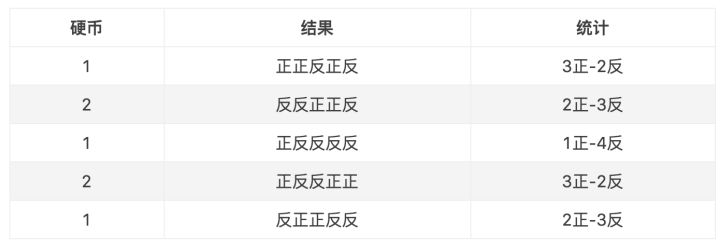
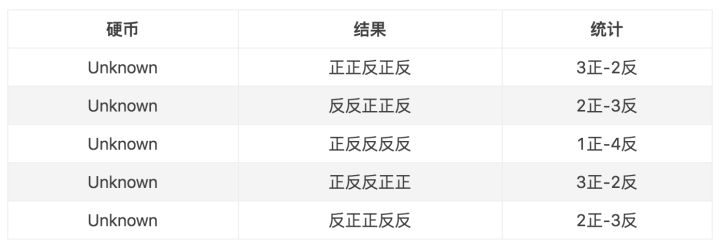
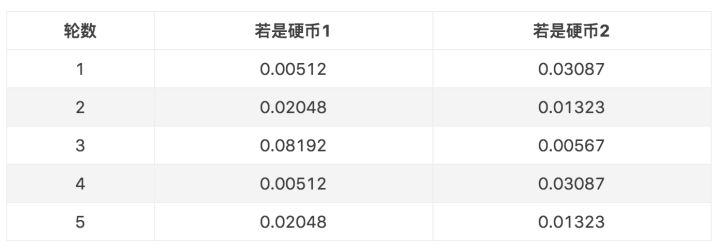
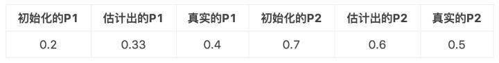
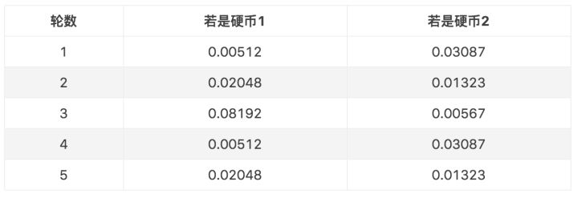
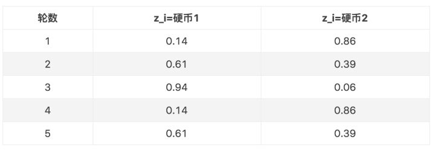
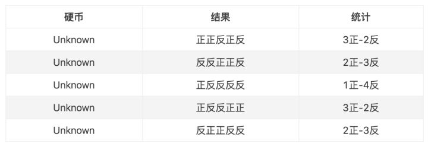
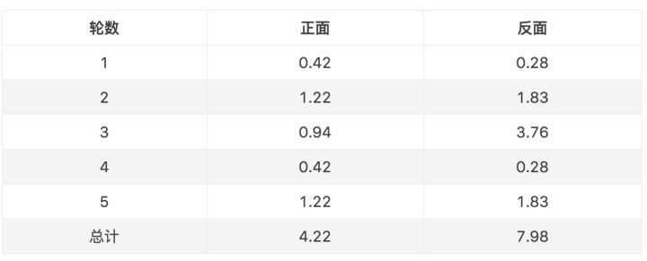

# 感性地理解EM算法
`https://zhuanlan.zhihu.com/p/102275054`

> 作者：milter
原文地址：[https://www.jianshu.com/p/1121509ac1dc](https://www.jianshu.com/p/1121509ac1dc "https://www.jianshu.com/p/1121509ac1dc")

如果使用基于最大似然估计的模型，模型中存在隐变量，就要用EM算法做参数估计。个人认为，理解EM算法背后的idea，远比看懂它的数学推导重要。idea会让你有一个直观的感受，从而明白算法的合理性，数学推导只是将这种合理性用更加严谨的语言表达出来而已。打个比方，一个梨很甜，用数学的语言可以表述为糖分含量90%，但只有亲自咬一口，你才能真正感觉到这个梨有多甜，也才能真正理解数学上的90%的糖分究竟是怎么样的。如果EM是个梨，本文的目的就是带领大家咬一口。

## 一个非常简单的例子

假设现在有两枚硬币1和2，,随机抛掷后正面朝上概率分别为P1，P2。为了估计这两个概率，做实验，每次取一枚硬币，连掷5下，记录下结果，如下：

可以很容易地估计出P1和P2，如下：

P1 = （3+1+2）/ 15 = 0.4

P2= （2+3）/10 = 0.5

到这里，一切似乎很美好，下面我们加大难度。

## 加入隐变量z

还是上面的问题，现在我们抹去每轮投掷时使用的硬币标记，如下：

好了，现在我们的目标没变，还是估计P1和P2，要怎么做呢？

显然，此时我们多了一个隐变量z，可以把它认为是一个5维的向量（z1,z2,z3,z4,z5)，代表每次投掷时所使用的硬币，比如z1，就代表第一轮投掷时使用的硬币是1还是2。但是，这个变量z不知道，就无法去估计P1和P2，所以，我们必须先估计出z，然后才能进一步估计P1和P2。

但要估计z，我们又得知道P1和P2，这样我们才能用最大似然概率法则去估计z，这不是鸡生蛋和蛋生鸡的问题吗，如何破？

答案就是先随机初始化一个P1和P2，用它来估计z，然后基于z，还是按照最大似然概率法则去估计新的P1和P2，如果新的P1和P2和我们初始化的P1和P2一样，请问这说明了什么？（此处思考1分钟）

这说明我们初始化的P1和P2是一个相当靠谱的估计！

就是说，我们初始化的P1和P2，按照最大似然概率就可以估计出z，然后基于z，按照最大似然概率可以反过来估计出P1和P2，当与我们初始化的P1和P2一样时，说明是P1和P2很有可能就是真实的值。这里面包含了两个交互的最大似然估计。

如果新估计出来的P1和P2和我们初始化的值差别很大，怎么办呢？就是继续用新的P1和P2迭代，直至收敛。

这就是下面的EM初级版。

## EM初级版

我们不妨这样，先随便给P1和P2赋一个值，比如：

P1 = 0.2

P2 = 0.7

然后，我们看看第一轮抛掷最可能是哪个硬币。

如果是硬币1，得出3正2反的概率为 0.2*0.2*0.2*0.8*0.8 = 0.00512

如果是硬币2，得出3正2反的概率为0.7*0.7*0.7*0.3*0.3=0.03087

然后依次求出其他4轮中的相应概率。做成表格如下：

按照最大似然法则：

第1轮中最有可能的是**硬币2**

第2轮中最有可能的是**硬币1**

第3轮中最有可能的是**硬币1**

第4轮中最有可能的是**硬币2**

第5轮中最有可能的是**硬币1**

我们就把上面的值作为z的估计值。然后按照最大似然概率法则来估计新的P1和P2。

P1 = （2+1+2）/15 = 0.33

P2=（3+3）/10 = 0.6

设想我们是全知的神，知道每轮抛掷时的硬币就是如本文第001部分标示的那样，那么，P1和P2的最大似然估计就是0.4和0.5（下文中将这两个值称为P1和P2的真实值）。那么对比下我们初始化的P1和P2和新估计出的P1和P2：

看到没？我们估计的P1和P2相比于它们的初始值，更接近它们的真实值了！

可以期待，我们继续按照上面的思路，用估计出的P1和P2再来估计z，再用z来估计新的P1和P2，反复迭代下去，就可以最终得到P1 = 0.4，P2=0.5，此时无论怎样迭代，P1和P2的值都会保持0.4和0.5不变，于是乎，我们就找到了P1和P2的最大似然估计。

这里有两个问题：

1、新估计出的P1和P2一定会更接近真实的P1和P2？

答案是：没错，一定会更接近真实的P1和P2，数学可以证明，但这超出了本文的主题，请参阅其他书籍或文章。

2、迭代一定会收敛到真实的P1和P2吗？

答案是：不一定，取决于P1和P2的初始化值，上面我们之所以能收敛到P1和P2，是因为我们幸运地找到了好的初始化值。

## EM进阶版

下面，我们思考下，上面的方法还有没有改进的余地？

我们是用最大似然概率法则估计出的z值，然后再用z值按照最大似然概率法则估计新的P1和P2。也就是说，我们使用了一个最可能的z值，而不是所有可能的z值。

如果考虑所有可能的z值，对每一个z值都估计出一个新的P1和P2，将每一个z值概率大小作为权重，将所有新的P1和P2分别加权相加，这样的P1和P2应该会更好一些。

所有的z值有多少个呢？显然，有2^5=32种，需要我们进行32次估值？？

不需要，我们可以用期望来简化运算。

利用上面这个表，我们可以算出每轮抛掷中使用硬币1或者使用硬币2的概率。比如第1轮，使用硬币1的概率是：

0.00512/(0.00512+0.03087)=0.14

使用硬币2的概率是1-0.14=0.86

依次可以算出其他4轮的概率，如下：

上表中的右两列表示期望值。看第一行，0.86表示，从期望的角度看，这轮抛掷使用硬币2的概率是0.86。相比于前面的方法，我们按照最大似然概率，直接将第1轮估计为用的硬币2，此时的我们更加谨慎，我们只说，有0.14的概率是硬币1，有0.86的概率是硬币2，不再是非此即彼。这样我们在估计P1或者P2时，就可以用上全部的数据，而不是部分的数据，显然这样会更好一些。

这一步，我们实际上是估计出了z的概率分布，这步被称作E步。

结合下表：

我们按照期望最大似然概率的法则来估计新的P1和P2：

以P1估计为例，第1轮的3正2反相当于

0.14*3=0.42正

0.14*2=0.28反

依次算出其他四轮，列表如下：

P1=4.22/(4.22+7.98)=0.35

可以看到，改变了z值的估计方法后，新估计出的P1要更加接近0.4。原因就是我们使用了所有抛掷的数据，而不是之前只使用了部分的数据。

这步中，我们根据E步中求出的z的概率分布，依据最大似然概率法则去估计P1和P2，被称作M步。

## 总结

以上，我们用一个实际的小例子，来实际演示了EM算法背后的idea，共性存于个性之中，通过这个例子，我们可以对EM算法究竟在干什么有一个深刻感性的认识，掌握EM算法的思想精髓。

