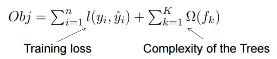
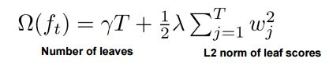
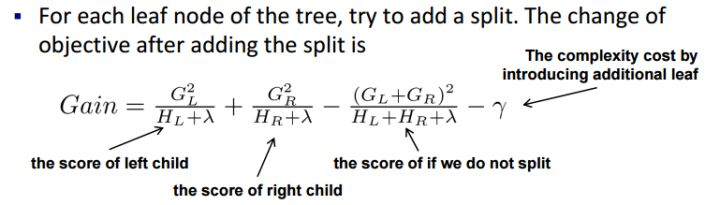

# GBDT和XGBOOST的区别有哪些

## 回答一
`https://www.zhihu.com/question/41354392`

2017.07.15更新：

最近赞忽然多了起来，我猜是校招季来了吧。但如果面试官问你这个问题，我建议不要按我的回答来，背答案不如自己理解透了，况且我这是十分得五分的答案。最初的GBDT发展到现在的XGBoost，改进是一点一滴来的，是一篇篇论文的积累，很多方法并非XGBoost第一次提出，当然也不是说XGBoost没改进，可以说XGBoost把算法和系统实现都做得淋漓尽致。所以如果不是为了速成，不是为了校招，建议把经典的论文拿出来读一读，相信对算法的理解能更进一层。
最近实习刚好在组内分享了GBDT，所以有了这番感悟，看了更多资料，发现自己理解还是有偏差，附上我做的ppt，若再有偏差，欢迎跟我邮件交流：[http://wepon.me/files/gbdt.pdf](http://wepon.me/files/gbdt.pdf "http://wepon.me/files/gbdt.pdf")

以下原答案：

-----------------------------------
**xgboost相比传统gbdt有何不同？xgboost为什么快？xgboost如何支持并行？**

看了陈天奇大神的文章和slides，略抒己见，没有面面俱到，不恰当的地方欢迎讨论：

* 传统GBDT以CART作为基分类器，xgboost还支持线性分类器，这个时候xgboost相当于带L1和L2正则化项的逻辑斯蒂回归（分类问题）或者线性回归（回归问题）。    
* 传统GBDT在优化时只用到一阶导数信息，xgboost则对代价函数进行了二阶泰勒展开，同时用到了一阶和二阶导数。顺便提一下，xgboost工具支持自定义代价函数，只要函数可一阶和二阶求导。    
* xgboost在代价函数里加入了正则项，用于控制模型的复杂度。正则项里包含了树的叶子节点个数、每个叶子节点上输出的score的L2模的平方和。从Bias-variance tradeoff角度来讲，正则项降低了模型的variance，使学习出来的模型更加简单，防止过拟合，这也是xgboost优于传统GBDT的一个特性。    
* Shrinkage（缩减），相当于学习速率（xgboost中的eta）。xgboost在进行完一次迭代后，会将叶子节点的权重乘上该系数，主要是为了削弱每棵树的影响，让后面有更大的学习空间。实际应用中，一般把eta设置得小一点，然后迭代次数设置得大一点。（补充：传统GBDT的实现也有学习速率）    
* 列抽样（column subsampling）。xgboost借鉴了随机森林的做法，支持列抽样，不仅能降低过拟合，还能减少计算，这也是xgboost异于传统gbdt的一个特性。

* 对缺失值的处理。对于特征的值有缺失的样本，xgboost可以自动学习出它的分裂方向。    
* xgboost工具支持并行。boosting不是一种串行的结构吗?怎么并行的？注意xgboost的并行不是tree粒度的并行，xgboost也是一次迭代完才能进行下一次迭代的（第t次迭代的代价函数里包含了前面t-1次迭代的预测值）。xgboost的并行是在特征粒度上的。我们知道，决策树的学习最耗时的一个步骤就是对特征的值进行排序（因为要确定最佳分割点），xgboost在训练之前，预先对数据进行了排序，然后保存为block结构，后面的迭代中重复地使用这个结构，大大减小计算量。这个block结构也使得并行成为了可能，在进行节点的分裂时，需要计算每个特征的增益，最终选增益最大的那个特征去做分裂，那么各个特征的增益计算就可以开多线程进行。

* 可并行的近似直方图算法。树节点在进行分裂时，我们需要计算每个特征的每个分割点对应的增益，即用贪心法枚举所有可能的分割点。当数据无法一次载入内存或者在分布式情况下，贪心算法效率就会变得很低，所以xgboost还提出了一种可并行的近似直方图算法，用于高效地生成候选的分割点。

=============
回复[@肖岩](//www.zhihu.com/people/9826559cf071f791628e5f033f94e8ca "@肖岩")在评论里的问题，因为有些公式放正文比较好。评论里讨论的问题的大意是 “xgboost代价函数里加入正则项，是否优于cart的剪枝”。其实陈天奇大神的slides里面也是有提到的，我当一下搬运工。

决策树的学习过程就是为了找出最优的决策树，然而从函数空间里所有的决策树中找出最优的决策树是NP-C问题，所以常采用启发式（Heuristic）的方法，如CART里面的优化GINI指数、剪枝、控制树的深度。这些启发式方法的背后往往隐含了一个目标函数，这也是大部分人经常忽视掉的。xgboost的目标函数如下：

其中正则项控制着模型的复杂度，包括了叶子节点数目T和leaf score的L2模的平方：

那这个跟剪枝有什么关系呢？？？
跳过一系列推导，我们直接来看xgboost中树节点分裂时所采用的公式：

这个公式形式上跟ID3算法（采用entropy计算增益） 、CART算法（采用gini指数计算增益） 是一致的，都是用分裂后的某种值 减去 分裂前的某种值，从而得到增益。为了限制树的生长，我们可以加入阈值，当增益大于阈值时才让节点分裂，上式中的gamma即阈值，它是正则项里叶子节点数T的系数，所以xgboost在优化目标函数的同时相当于做了预剪枝。另外，上式中还有一个系数lambda，是正则项里leaf score的L2模平方的系数，对leaf score做了平滑，也起到了防止过拟合的作用，这个是传统GBDT里不具备的特性。

