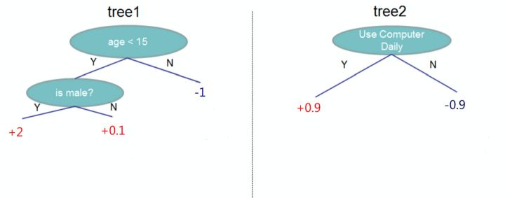
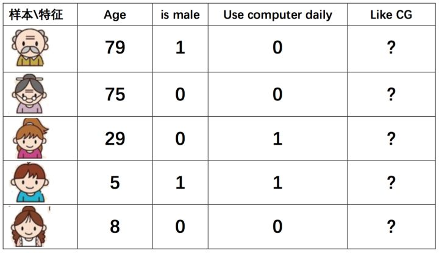
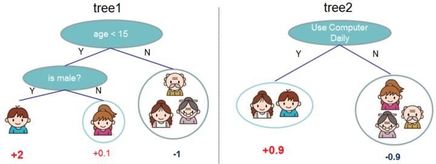
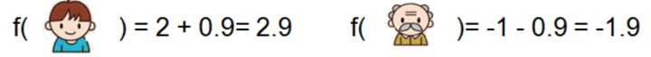
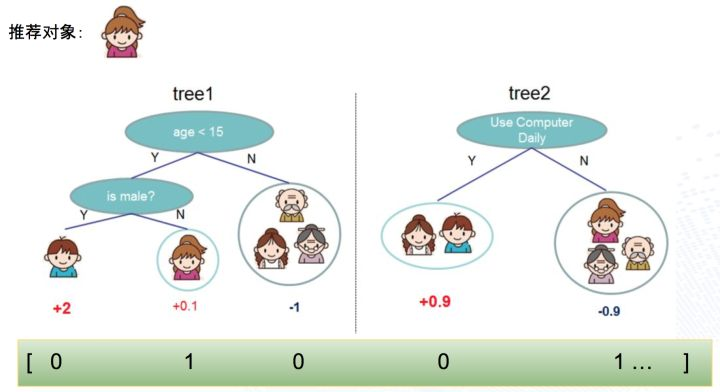
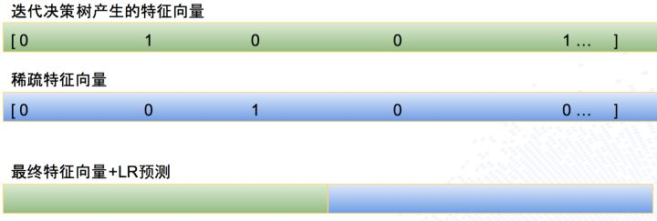
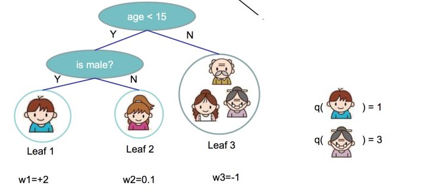
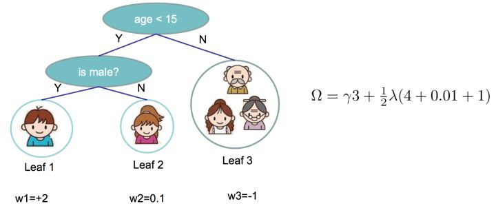
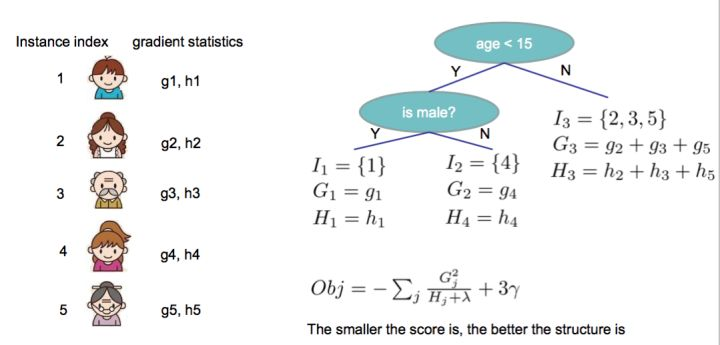
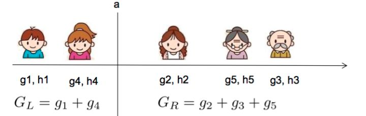

# GBDT的原理和应用
`https://zhuanlan.zhihu.com/p/20794583`

周二、周三参加了[QCon上海2017|全球软件开发大会](http://2017.qconshanghai.com/ "QCon上海2017|全球软件开发大会")，听了几场机器学习相关的 Session，多次提及 GBDT（Gradient Boost Decision Tree)，并且在模型演化历史中，都有很重要或者最重要的地位。

如《Pinterest如何利用机器学习实现两亿月活跃用户》提到的模型发展历史，GBDT带来过巨大的效果提升。

`迭代决策树（GBDT）`

《唯品金融机器学习实践》中也提到因为GBDT＋LR良好的表达能力和可解释性成为他们的最重要模型之一。笔者的工作实践中，饿了么的Rank系统中，GBDT＋FTRL，也是AUC最高的模型（不是之一，超过深度学习尝试）。
因为最近负责使用 GBDT模型做**竞价排名广告**的点击率预估（CTR），所以就从头学习了一下原理并涉猎了一些相关的应用场景，写一篇文章总结一下，希望可以表述清楚，读者会有所收获。

## 概述
DT－Decision Tree决策树，GB是Gradient Boosting，是一种学习策略，GBDT的含义就是用Gradient Boosting的策略训练出来的DT模型。模型的结果是一组回归分类树组合(CART Tree Ensemble)：$T_1...T_K$。其中$T_j$学习的是之前$j-1$棵树预测结果的残差，这种思想就像准备考试前的复习，先做一遍习题册，然后把做错的题目挑出来，在做一次，然后把做错的题目挑出来在做一次，经过反复多轮训练，取得最好的成绩。

而模型最后的输出，是一个样本在各个树中输出的结果的和：
$\bar{y} = \sum_{k=1}^{K}{f_k(x)}, f_k \subset\Gamma，f_k表示样本到树输出的映射$

假设我们要预测一个人是否会喜欢电脑游戏，特征包括年龄，性别是否为男，是否每天使用电脑。标记（label）为是否喜欢电脑游戏，假设训练出如下模型

该模型又两棵树组成，$T_1$使用 age < 15 和 is male 作为内节点，叶子节点是输出的分数。$T_2$使用是否每日使用电脑作为根节点。假设测试样本如下：

样本在两棵树中所在的叶节点如下：

最后对某样本累加它所在的叶子节点的输出值，例如：

## GBDT ＋ LR
单独的使用GBDT模型，容易出现过拟合，在实际应用中往往使用 GBDT＋LR的方式做模型训练，算法更多细节可以参考[Practical Lessons from Predicting Clicks on Ads at Facebook]。本文只介绍结论性的做法。

首先根据样本训练出GBDT树，对于每个叶子节点，回溯到根节点都可以得到一组组合特征，所以用叶子节点的标号可以代表一个新的组合特征。结合上面的图，用一个样本为例，直观的表达如下：

其中 0号 组合特征的含义是：ageLessThan15AndIsMale，该样本取值 0

其中 1号 组合特征的含义是：ageLessThan15AndIsNotMale，该样本取值 1

其中 2号 组合特征的含义是：ageLargerOrEqualThan15，该样本取值 0

其中 3号 组合特征的含义是：useComputerDaily，该样本取值 0

其中 4号 组合特征的含义是：notUseComputerDaily，该样本取值 1
这部分特征是GBDT生成的组合特征，再结合LR固有的稀疏特征，就组成了 GBDT ＋ LR 模型。生成样本向量阶段，样本首先过GBDT模型，生成组合特征部分的输入向量，再结合固有的稀疏特征向量，组成新的特征向量，示例如下：

在该例子中，第一行绿颜色是通过 GBDT 模型生成的特征向量，每个值都代表一个叶子节点的输出（样本在某棵树只在一个叶子节点有输出），第二行表示 LR 模型的稀疏特征向量，第三行表示把两部分特征向量拼接在一起，组成一个最终的特征向量，并使用该向量训练LR模型。

## 实践
XGBoost是GBDT最广为人知的一个实现。通过使用一定程度的近似，使得求解变得更高效。同时支持分布式和 GPU 优化，有着广泛的使用。在实践中，算法工程师使用 Spark 或者Python 的 XGBoost 库训练模型，并保存成文件，线上根据不同的语言采用相应的依赖包，将模型导入，执行决策。Java 中使用 xgboost4j 导入模型，完成特征变换后，调用$predict$方法，就可以得到当前样本的预测值。

需要注意的是，xgboost4j 需要链接到本地库，需要自己编译并打包。首先在本地编译 xgboost4j，生成平台相关的本地库文件，例如 linux 下生的[libxgboost4j.so](https://github.com/hopeztm7500/xgboost4jL/blob/master/src/main/resources/lib/libxgboost4j.so "libxgboost4j.so")。然后把这个文件连同xgboost4j 的源代码一起，发布成一个新的工程，供线上依赖。
[hopeztm7500/xgboost4jL](https://github.com/hopeztm7500/xgboost4jL "hopeztm7500/xgboost4jL")这个项目是我在实践中自己编译 xgboost4j 生成了一个平台相关xgboost4j 包。不过这个项目仅供参考，因为平台相关，所以不一定能被其他人使用。

## XGBoost算法原理
这部分内容比较便理论，对于没有兴趣的读者可以忽略掉。

还记得前文提到的 GBDT 可以用如下公式表示：
$\bar{y} = \sum_{k=1}^{K}{f_k(x)}, f_k \subset\Gamma$

优化目标如下：
$Obj = \sum_{i = 1}^{n}{l (y_i, \bar{y_i})} + \sum_{k = 1}^{K}{\Omega(f_k)} $

$n$样本数量，$y_i $表示样本真实 Label，$\bar{y}$是模型输出，所以前半部分代表模型的损失函数。

$K$表示树的个数，$f_k$表示第$k$棵树，形式化的来说它是一个样本到叶子节点值的映射（$x\rightarrow R$），$\Omega$是模型复杂度函数。模型越复杂，越容易出现过拟合，所以采用这样的目标函数，为了使得最终的模型既有很好的准确度也有不错的泛化能力。
那么如何找到一组树，使得$Obj$最小呢。

## 追加法训练（Additive Training、Boosting）
核心的思想是，已经训练好的树$T_1 \sim T_{t-1}$不再调整。根据目标函数最小原则，新增树$T_t$，表示如下：

$\bar{y}_{}^{0} = 0$算法初始化
$\bar{y}_{}^{(1)} = f_1(x) = \bar{y}_{}^{(0)} + f_1(x) $训练第$1$棵树$f_1(x)$

$\bar{y}_{}^{(2)} = f_1(x) + f_2(x) = \bar{y}_{}^{(1)} + f_2(x) $训练第二棵树$f_2(x)$，第$1$棵不再调整
$\bar{y}_{}^{(t)} = \sum_{k=1}^{t}{f_k(x)} = \bar{y}_{}^{(t-1)} + f_t(x) $训练第$t$棵树$f_t(x)$，前面$t-1$棵不再调整

假设此时对第$t$棵树训练，则目标函数表示为
$Obj^{(t)} = \sum_{i = 1}^{n}{l (y_i, \bar{y_i}^{(t)})} + \sum_{i = 1}^{t}{\Omega(f_i)} $

$=\sum_{i = 1}^{n}{l (y_i, \bar{y_i}^{(t-1)} + f_t(x_i))} + \Omega(f_t) + constant$
$constant$代表$\sum_{i＝1}^{t-1}{\Omega(f_i)}$，因为前面$t-1$棵树结构不再变化，所以他们的复杂度为常数。

回顾高等数学中的泰勒展开，它使用一个函数的高阶导数，用多项式的形式逼近原始函数。当展开到二阶导数的时候公式如下：
$f(x+\triangle x) \simeq f(x) + f'(x)\triangle x + (1/2)f''(x)\triangle x^2$

利用泰勒展开公式和上文推导的$Obj^{(t)}$，$Obj^{(t)}$式中，$\bar{y_i}^{(t-1)}$对应泰勒公式中的$x$，而$f_t(x)$是一棵待增加的新树，对应泰勒公式中的$\triangle x$，$l (y_i, \bar{y_i}^{(t-1)} )$对应泰勒公式中的$f(x)$，$l (y_i, \bar{y_i}^{(t-1)} + f_t(x))$对应泰勒公式中的$f(x+\triangle x)$。则对$l (y_i, \bar{y_i}^{(t-1)} + f_t(x))$做二阶泰勒展开后，得：

$Obj^{(t)} =\sum_{i = 1}^{n}{[ l (y_i, \bar{y_i}^{(t-1)} ) + g_if_t(x_i) + (\frac12)h_if_t^2(x_i)]} + \Omega(f_t) + constant$

其中

$g_i = \partial_{\bar{y_i}^{(t-1)}} l(y_i, \bar{y_i}^{(t-1)})$
$h_i = \partial_{\bar{y_i}^{(t-1)}}^{(2)} l(y_i, \bar{y_i}^{(t-1)})$

即对应泰勒公式中的一阶导数$f'(x)$和二阶导数$f''(x)$。因为我们求解的目标是使得$Obj^{(t)}$最小的$f_t(x)$。当前面$t-1$棵树都已经确定时，$\sum_{i = 1}^{n}{[ l (y_i, \bar{y_i}^{(t-1)} )}]$是一个常量，可以省略，$constant$常量也可以省略，简化得到新的目标函数：
$\bar{Obj}^{(t)} =\sum_{i = 1}^{n}{[g_if_t(x_i) + (1/2)h_if_t^2(x_i)]} + \Omega(f_t)$

## 复杂度函数$\Omega(f_t)$的引入
假设待训练的第$t$棵树有$T$个叶子节点，叶子节点的输出用向量表述为$[w_1,w_2,w_3...,w_T] $。那么$f_t(x)$可以表示为如下形式：

$f_t(x) = w_{q(x)}, w\in R^T, q: R^d\rightarrow{\{1,2,3...T\}}$
可以理解为$q$是树结构，把样本$x$带到某个叶子节点$j$，而这个节点的输出值是$w_j$。例如：

前文提到为了提高泛化能力，引入复杂度函数，定义复杂度函数的方式也可以有很多选择，XGBoost中定义如下：

$\Omega(f_t) ＝ \gamma T+({\frac{1}{2}})\lambda\sum_{j=1}^{T}{w_j^2}$
如前述$T$表示叶节点个数，$w_j$是叶子节点$j$的输出。例如：

则目标函数可以推导为如下：
$\bar{Obj}^{(t)} =\sum_{i = 1}^{n}{[g_if_t(x_i) + ({{\frac{1}{2}}})h_if_t^2(x_i)]} + \Omega(f_t)$$=\sum_{i = 1}^{n}{[g_iw_{q(x_i)} + (1/2)h_iw^2_{q(x_i)}]} + \gamma T + \lambda(1/2)\sum_{j=1}^Tw_j$

前半部分，$\sum_{i = 1}^{n}{[g_iw_{q(x_i)} + (1/2)h_iw^2_{q(x_i)}]}$，$\sum_{i=1}^{n}$选取是最直观的样本累加视角，我们可以把这个视角换一下。既然每个样本都会落到一个叶子节点，最外层的累加维度可以为叶节点。定义$I_j = \{i|q(x_i) = j\}$，含义是被映射到第$j$个叶子节点的样本，该叶子节点的输出为$w_j$，那么
$\sum_{i = 1}^{n}{[g_iw_{q(x_i)} + (1/2)h_iw^2_{q(x_i)}]} =\sum_{j=1}^T[\sum_{i\in I_j}g_iw_j + (1/2)\sum_{i\in I_j}h_iw_j^2 ]$

可以推导出
$\bar{Obj^{(t)}} =\sum_{j=1}^T[\sum_{i\in I_j}g_iw_j + (1/2)\sum_{i\in I_j}h_iw_j^2 ] + \gamma T + \lambda(1/2)\sum_{j=1}^Tw_j$$=\sum_{j=1}^T[(\sum_{i\in I_j}g_i)w_j + (1/2)(\sum_{i\in I_j}h_i +\lambda)w_j^2 ] + \gamma T $

定义$G_j = \sum_{i\in I_j}g_i$，$H_j = \sum_{i\in I_j}h_i$，则上式
$\bar{Obj^{(t)}} = \sum_{j=1}^{T}{[G_j w_j + (1/2)(H_j+\lambda)w_j^2]} +\gamma T$

**假设新树的结构不变**，上式是一个由$T$个相互独立的二次函数的累加，所以目标函数最小，等价于求对每个$j$最小。
回顾对于$y = ax^2 + bx +c$当$a > 0$，当$x = -(b/2a)$对称轴位置的时候，函数取得最小值，此时最小值为$(4ac - b^2) /4a$。

对$G_j w_j + (1/2)(H_j+\lambda)w_j^2$分别取极小值时，$w_j$取值如下
$w_j^* = - (G_i/(H_j + \lambda))$

$\bar{Obj^{(t)}}_{min} = -(1/2)\sum_{j=1}^{T}{G_j^2}/{{(H_j+\lambda)}} +\gamma T$
举个例子，假设要求解第一棵$T_1$树的结构如下，各个样本按照该树的结构，会被映射到相应的位置，得到每个样本$x_i$对应的$g_i, h_i$，就可以求得到对应$\bar{Obj^{(1)}}_{min}$

$g_i$，$h_i$前文定义为损失函数$l (y_i, \bar{y_i}^{(t-1)} )$对$\bar{y_i}^{(t-1)}$的一阶导数和二阶导数。如果把损失函数定义为平方损失（Square Loss），则可以得到如下等式:

$g_i = \partial_{\bar{y_i}^{(t-1)}} (y_i - \bar{y_i}^{(t-1)})^2 = 2(\bar{y_i}^{(t-1)}-y_i)$
$h_i = \partial^{(2)}_{\bar{y_i}^{(t-1)}} (y_i - \bar{y_i}^{(t-1)})^2 = 2$

所以根对于待训练的新树而言，$g_i, h_i$可以根据训练好的树预先计算好，枚举所有可能的新树的结构，选择目标函数最小的那棵树，同时使用$w_j^* = - (G_i/(H_j + \lambda))$求得该树每个叶子节点的输出值，不断求解下去，就可以训练出一组最优树。但是，枚举所有的树是不现实的，因为样本特征值可能是连续的，树的结构可能是无穷的。
## 贪心法求解树

在XGBoost使用贪心法求解树结构，算法描述如下：
* 初始化树深度 0（即只有一个叶子节点，所有样本都落在该节点）    
* 对于每个叶子节点，尝试分裂该节点，在分裂后得到的增益定义如下：$Gain = \frac12[{\frac{G_L^2}{H_L+\lambda}}+{\frac{G_R^2}{H_R+\lambda}} - {\frac{{(G_L+G_R)}^2}{H_L+H_R + \lambda}}] - \lambda$该公式定义了，分裂后左右子树的新增得分减去不分裂时候节点得分，再减去因为新增一个节点，增加的复杂度。

那么，如何定义最佳分裂。
* 对于每个叶子节点，枚举所有的特征    
* 对每个特征，把映射到该叶节点的样本按照该特征值排序    
* 使用线性扫描来决定最佳分裂点$O(ndK\log{n})$    
* 在所有枚举的特征中，选择最优的分裂

示例如下，假如当前枚举的特征是年龄，样本排序和分裂点如下所示：

在该分裂点计算分裂后的增益：
$Gain = \frac12[{\frac{G_L^2}{H_L+\lambda}}+{\frac{G_R^2}{H_R+\lambda}} - {\frac{{(G_L+G_R)}^2}{H_L+H_R + \lambda}}] - \lambda$

如果用$K$表示新增树的深度，那么该算法复杂度是$O(ndK\log{n}) $,$d$代表特征数，$n\log{n}$是对样本排序复杂度。如果缓存对样本在各个特征下对排序结果，算法还可以进一步在时间上优化。
总结算法流程如下：

* 迭代生成树$T_i$    
* 迭代初始，对每个样本计算$g_i, h_i$，该计算只依赖于训练好的树$T_1..T_{i-1}$    
* 使用$\bar{Obj^{(t)}}_{min} = -(1/2)\sum_{j=1}^{T}{{{G_j^2}}／{{(H_j+\lambda)}}} +\gamma T$为目标函数，采用贪心法求得树$T_i$    
* 新增树后，模型表示为$\bar{y}_{}^{(t)} = \bar{y}_{}^{(t-1)} + f_t(x) $，实践中使用$\bar{y}_{}^{(t)} = \bar{y}_{}^{(t-1)} + \epsilon f_t(x) $替代上面的迭代公式，$\epsilon$被称为步长（steps-size）或收缩率（shrinkage），通常设置为 0.1 附近的值。设置它的目的在于，不期望模型每一次迭代学习到所有残差，防止过拟合。
从XGBoost原理部分可以看出，XGBoost的实现中，采用了二阶泰勒展开公式展开来近似损失函数，同时在求解树的过程中，使用了贪心算法，并使用枚举特征，样本按照特征排序后，采用线性扫描找到最优分裂点。这种实现方法，是对GDBT思想的逼近，但是在工程上确非常有效。

## 总结
本文首先从应用出发，概括了GBDT的应用场景，介绍了如何使用GBDT和GBDT＋LR。然后对训练和上线的工程化给予简单阐述。然后用最长的篇幅，介绍了 XGBoost原理。希望读者有所收获。

