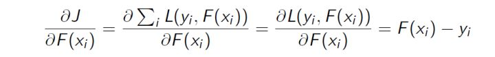
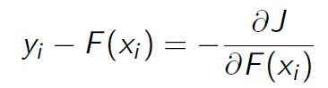
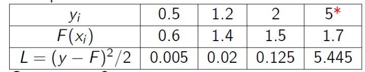
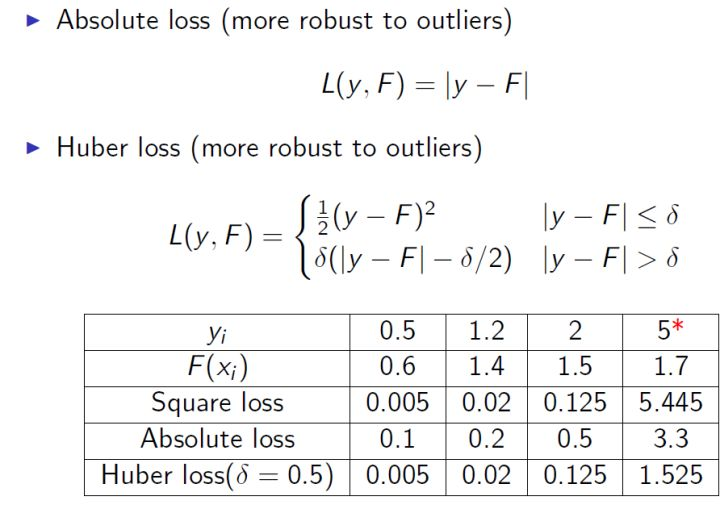

# 一文理解GBDT的原理
摘抄自：`https://zhuanlan.zhihu.com/p/29765582`

现在网上介绍gbdt算法的文章并不算少，但总体看下来，千篇一律的多，能直达精髓的少，有条理性的就更稀少了。我希望通过此篇文章，能抽丝剥茧般的向初学者介绍清楚这个算法的原理所在。如果仍不清楚可以在文后留言。

## 1、如何在不改变原有模型的结构上提升模型的拟合能力

假设现在你有样本集 $(x_{1},y_{1}),(x_{2},y_{2}),...(x_{n},y_{n})$ ，然后你用一个模型，如 $F(x)$ 去拟合这些数据，使得这批样本的平方损失函数（即 $\frac{1}{2}\sum_{0}^{n}{}(y_{i}-F(x_{i}))^{2}$ ）最小。但是你发现虽然模型的拟合效果很好，但仍然有一些差距，比如预测值 $F(x_{1})$ =0.8，而真实值 $y_{1}$ =0.9， $F(x_{2})$ =1.4， $y_{2}$ =1.3等等。另外你不允许更改原来模型 $F(x)$ 的参数，那么你有什么办法进一步来提高模型的拟合能力呢。

既然不能更改原来模型的参数，那么意味着必须在原来模型的基础之上做改善，那么直观的做法就是建立一个新的模型 $f(x)$ 来拟合 $F(x)$ 未完全拟合真实样本的残差，即 $y-F(X)$ 。所以对于每个样本来说，拟合的样本集就变成了： $(x_{1},y_{1}-F(x_{1})),(x_{2},y_{2}-F(x_{2})),...(x_{n},y_{n}-F(x_{n}))$ .

## 2、基于残差的gbdt

在第一部分， $y_{i}-F(x_{i})$ 被称为残差，这一部分也就是前一模型（ $F(x_{i})$ ）未能完全拟合的部分，所以交给新的模型来完成。

我们知道gbdt的全称是Gradient Boosting Decision Tree，其中gradient被称为梯度，更一般的理解，可以认为是一阶导，那么这里的残差与梯度是什么关系呢。在第一部分，我们提到了一个叫做平方损失函数的东西，具体形式可以写成 $\frac{1}{2}\sum_{0}^{n}{}(y_{i}-F(x_{i}))^{2}$ ，熟悉其他算法的原理应该知道，这个损失函数主要针对回归类型的问题，分类则是用熵值类的损失函数。具体到平方损失函数的式子，你可能已经发现它的一阶导其实就是残差的形式，所以基于残差的gbdt是一种特殊的gbdt模型，它的损失函数是平方损失函数，常用来处理回归类的问题。具体形式可以如下表示：

$损失函数：L(y,F(x)) = \frac{1}{2}(y-F(X))^{2}$

$所以我们想最小化J = \frac{1}{2}\sum_{0}^{n}{}(y_{i}-F(x_{i}))^{2}$

损失函数的一阶导：



正好残差就是负梯度：



## 3、为什么基于残差的gbdt不是一个好的选择

基于残差的gbdt在解决回归问题上不算是一个好的选择，一个比较明显的缺点就是对异常值过于敏感。我们来看一个例子：



很明显后续的模型会对第4个值关注过多，这不是一种好的现象，所以一般回归类的损失函数会用绝对损失或者huber损失函数来代替平方损失函数：



## 4、Boosting的加法模型

如前面所述，gbdt模型可以认为是是由k个基模型组成的一个加法运算式：

$$\hat{y}_i=\sum_{k=1}^K f_k(x_i), f_k \in F \tag 0$$


其中F是指所有基模型组成的函数空间。

那么一般化的损失函数是预测值 $\hat{y}$ 与 真实值$y$ 之间的关系，如我们前面的平方损失函数，那么对于n个样本来说，则可以写成：

$L=\sum_{i=1}^n l(y_i, \hat{y}_i) $

更一般的，我们知道一个好的模型，在偏差和方差上有一个较好的平衡，而算法的损失函数正是代表了模型的偏差面，最小化损失函数，就相当于最小化模型的偏差，但同时我们也需要兼顾模型的方差，所以目标函数还包括抑制模型复杂度的正则项，因此目标函数可以写成：

$Obj=\sum_{i=1}^n l(y_i, \hat{y}_i) + \sum_{k=1}^K \Omega(f_k)$

其中 $\Omega$ 代表了基模型的复杂度，若基模型是树模型，则树的深度、叶子节点数等指标可以反应树的复杂程度。

对于Boosting来说，它采用的是前向优化算法，即从前往后，逐渐建立基模型来优化逼近目标函数，具体过程如下：

$\hat{y}_i^0 = 0$
$\hat{y}_i^1 = f_1(x_i) = \hat{y}_i^0 + f_1(x_i)$ 
$\hat{y}_i^2 = f_1(x_i) + f_2(x_i) = \hat{y}_i^1 + f_2(x_i)$  
....
$\hat{y}_i^t = \sum_{k=1}^t f_k(x_i) = \hat{y}_i^{t-1} + f_t(x_i)$

那么，在每一步，如何学习一个新的模型呢，答案的关键还是在于gbdt的目标函数上，即新模型的加入总是以优化目标函数为目的的。

我们以第t步的模型拟合为例，在这一步，模型对第 $i$ 个样本 $x_{i}$ 的预测为：

$\hat{y}_i^t= \hat{y}_i^{t-1} + f_t(x_i)$

其中 $f_t(x_i)$ 就是我们这次需要加入的新模型，即需要拟合的模型，此时，目标函数就可以写成：


$$Obj^{(t)} = \sum_{i=1}^nl(y_i, \hat{y}_i^t) + \sum_{i=i}^t \Omega(f_i) \\ = \sum_{i=1}^n l\left(y_i, \hat{y}_i^{t-1} + f_t(x_i) \right) + \Omega(f_t) + constant \tag{1}$$

即此时最优化目标函数，就相当于求得了 $f_t(x_i)$ 。

## 5、什么是gbdt的目标函数

我们知道泰勒公式中，若 $\Delta x$ 很小时，我们只保留二阶导是合理的（gbdt是一阶导，xgboost是二阶导，我们以二阶导为例，一阶导可以自己去推，因为更简单），即：

$$f(x+\Delta x) \approx f(x) + f'(x)\Delta x + \frac12 f''(x)\Delta x^2 \tag{2}$$

那么在等式（1）中，我们把 $\hat{y}_i^{t-1}$ 看成是等式（2）中的x， $f_t(x_i)$ 看成是 $\Delta x$ ，因此等式（1）可以写成：

$Obj^{(t)} = \sum_{i=1}^n \left[ l(y_i, \hat{y}_i^{t-1}) + g_if_t(x_i) + \frac12h_if_t^2(x_i) \right] + \Omega(f_t) + constant \tag 3$

其中 $g_{i}$ 为损失函数的一阶导， $h_{i}$ 为损失函数的二阶导，注意这里的导是对 $\hat{y}_i^{t-1}$ 求导。我们以 平方损失函数为例$\sum_{i=1}^n \left(y_i - (\hat{y}_i^{t-1} + f_t(x_i)) \right)^2$ ，则 $g_i=\partial_{\hat{y}^{t-1}}(\hat{y}^{t-1} - y_i)^2 = 2(\hat{y}^{t-1} - y_i)$， $h_i=\partial_{\hat{y}^{t-1}}^2(\hat{y}^{t-1} - y_i)^2 = 2$ 。

由于在第t步 $\hat{y}_i^{t-1}$ 其实是一个已知的值，所以 $ l(y_i, \hat{y}_i^{t-1})$ 是一个常数，其对函数优化不会产生影响，因此，等式（3）可以写成：

$Obj^{(t)} \approx \sum_{i=1}^n \left[ g_if_t(x_i) + \frac12h_if_t^2(x_i) \right] + \Omega(f_t) \tag 4$

所以我么只要求出每一步损失函数的一阶和二阶导的值（由于前一步的 $\hat{y}^{t-1}$ 是已知的，所以这两个值就是常数）代入等式4，然后最优化目标函数，就可以得到每一步的 $f(x)$ ，最后根据加法模型得到一个整体模型。

## 6、如何用决策树来表示上一步的目标函数

假设我们boosting的基模型用决策树来实现，则一颗生成好的决策树，即结构确定，也就是说树的叶子结点其实是确定了的。假设这棵树的叶子结点有 $T$ 片叶子，而每片叶子对应的值 $w \in R^T$ 。熟悉决策树的同学应该清楚，每一片叶子结点中样本的预测值都会是一样的，在分类问题中，是某一类，在回归问题中，是某一个值（**在gbdt中都是回归树，即分类问题转化成对概率的回归了**），那么肯定存在这样一个函数 $q:R^d \to \{1,2,\cdots,T\}$ ，即将 $f_{t}(x)$ 中的每个样本映射到每一个叶子结点上，当然 $f_{t}(x)$ 和 $q$ 我们都是不知道的，但我们也不关心，这里只是说明一下决策树表达数据结构的方法是怎么样的，不理解也没有问题。

那么 $f_{t}(x)$ 就可以转成 $w_{q(x)}$ ，这里的 $q(x)$ 代表了每个样本在哪个叶子结点上，而 $w_{q}$ 则代表了哪个叶子结点取什么 $w$ 值，所以 $w_{q(x)}$ 就代表了每个样本的取值 $w$ （即预测值）。

如果决策树的复杂度可以由正则项来定义 $\Omega(f_t)=\gamma T + \frac12 \lambda \sum_{j=1}^T w_j^2$ ，即决策树模型的复杂度由生成的树的叶子节点数量和叶子节点对应的值向量的L2范数决定。

我们假设 $I_j=\{ i \vert q(x_i)=j \}$ 为第 $j$ 个叶子节点的样本集合，则等式4根据上面的一些变换可以写成：

$\begin{split} Obj^{(t)} &\approx \sum_{i=1}^n \left[ g_if_t(x_i) + \frac12h_if_t^2(x_i) \right] + \Omega(f_t) \\ &= \sum_{i=1}^n \left[ g_iw_{q(x_i)} + \frac12h_iw_{q(x_i)}^2 \right] + \gamma T + \frac12 \lambda \sum_{j=1}^T w_j^2 \\ &= \sum_{j=1}^T \left[(\sum_{i \in I_j}g_i)w_j + \frac12(\sum_{i \in I_j}h_i + \lambda)w_j^2 \right] + \gamma T \end{split}\tag 5$

即我们之前样本的集合，现在都改写成叶子结点的集合，由于一个叶子结点有多个样本存在，因此才有了 $\sum_{i \in I_j}g_i$ 和 $\sum_{i \in I_j}h_i$ 这两项。

定义 $G_j=\sum_{i \in I_j}g_i$ ， $H_j=\sum_{i \in I_j}h_i$ ，则等式5可以写成：

$Obj^{(t)} = \sum_{j=1}^T \left[G_jw_j + \frac12(H_j + \lambda)w_j^2 \right] + \gamma T$

如果树的结构是固定的，即 $q$ 是确定的，或者说我们已经知道了每个叶子结点有哪些样本，所以 $G_j$ 和 $H_j$ 是确定的，但 $w$ 不确定（ $w$ 其实就是我们需要预测的值），那么令目标函数一阶导为0，则可以求得叶子结点 $j$ 对应的值：

$w_j^*=-\frac{G_j}{H_j+\lambda} \tag 6$

目标函数的值可以化简为：

$Obj = -\frac12 \sum_{j=1}^T \frac{G_j^2}{H_j+\lambda} + \gamma T \tag 7$

## 7、如何最优化目标函数

那么对于单棵决策树，一种理想的优化状态就是枚举所有可能的树结构，因此过程如下：

a、首先枚举所有可能的树结构，即 $q$ ；

b、计算每种树结构下的目标函数值，即等式7的值；

c、取目标函数最小（大）值为最佳的数结构，根据等式6求得每个叶子节点的 $w$ 取值，即样本的预测值。

但上面的方法肯定是不可行的，因为树的结构千千万，所以一般用贪心策略来优化：

a、从深度为0的树开始，对每个叶节点枚举所有的可用特征

b、 针对每个特征，把属于该节点的训练样本根据该特征值升序排列，通过线性扫描的方式来决定该特征的最佳分裂点，并记录该特征的最大收益（采用最佳分裂点时的收益）

c、 选择收益最大的特征作为分裂特征，用该特征的最佳分裂点作为分裂位置，把该节点生长出左右两个新的叶节点，并为每个新节点关联对应的样本集

d、回到第1步，递归执行到满足特定条件为止

那么如何计算上面的收益呢，很简单，仍然紧扣目标函数就可以了。假设我们在某一节点上二分裂成两个节点，分别是左（L）右（R），则分列前的目标函数是 $-\frac12 [\frac{(G_L+G_R)^2}{H_L+H_R+\lambda}] + \gamma $ ，分裂后则是 $-\frac12 [ \frac{G_L^2}{H_L+\lambda} + \frac{G_R^2}{H_R+\lambda}] +2\gamma$ ，则对于目标函数来说，分裂后的收益是（这里假设是最小化目标函数，所以用分裂前-分裂后）：

$Gain=\frac12 \left[ \frac{G_L^2}{H_L+\lambda} + \frac{G_R^2}{H_R+\lambda} - \frac{(G_L+G_R)^2}{H_L+H_R+\lambda}\right] - \gamma \tag 8$

等式8计算出来的收益，也是作为变量重要度输出的重要依据。

所以gbdt的算法可以总结为：

a、算法在拟合的每一步都新生成一颗决策树；

b、在拟合这棵树之前，需要计算损失函数在每个样本上的一阶导和二阶导，即 $g_{i}$ 和 $h_{i}$ ；

c、通过上面的贪心策略生成一颗树，计算每个叶子结点的的 $G_{j}$ 和 $H_{j}$ ，利用等式6计算预测值 $w$ ；

d、把新生成的决策树 $f_t(x)$ 加入 $\hat{y}_i^t = \hat{y}_i^{t-1} + \epsilon f_t(x_i)$ ，其中 $\epsilon$ 为学习率，主要为了抑制模型的过拟合。

特别感谢这篇文章[作业部落 Cmd Markdown 编辑阅读器](https://www.zybuluo.com/yxd/note/611571 "作业部落 Cmd Markdown 编辑阅读器")带来的思路！


```
https://zhuanlan.zhihu.com/p/20794583
https://zhuanlan.zhihu.com/p/30339807
https://zhuanlan.zhihu.com/p/81368182
https://www.zhihu.com/question/41354392/answer/98658997
```


