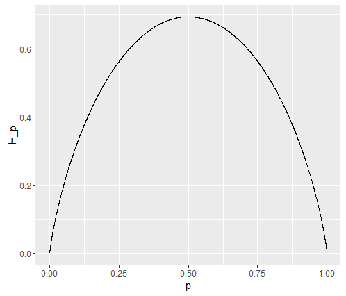
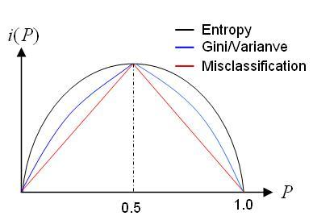

# 决策树算法的Python实现
`https://zhuanlan.zhihu.com/p/20794583`


## 一.决策树的基本思想

决策树是一种基本的分类与回归方法，它可以看作**if-then**规则的集合，也可以认为是定义在特征空间与类空间上的条件概率分布。

将决策树转换成if-then规则的过程如下：

* 由决策树的根节点到叶节点的每一条路径构建一条规则；    
* 路径内部结点的特征对应规则的条件；    
* 叶节点的类对应规则的结论.


决策树的路径具有一个重要的性质：**互斥且完备**,即每一个样本均被且只能被一条路径所覆盖。

决策树学习算法主要由三部分构成：

* 特征选择    
* 决策树生成    
* 决策树的剪枝

下面，从这三方面进行理论介绍，并提供相应的Python代码实现。

## 二. 决策树的特征选择

如果利用一个特征进行分类的结果与随机分类的结果无异，则可以认为这个特征是不具备分类能力的。把这样的特征去掉，对决策树的分类精度应该影响不大。


而我们应该基于什么准则来判定一个特征的分类能力呢？

这时候，需要引入一个概念：信息增益.


**信息增益**

在介绍信息增益之前，先了解一个概念：熵(entropy).

**熵(entropy)**

在信息论与概率论中，熵(entropy)用于表示**随机变量不确定性的度量**。

设X是一个有限状态的离散型随机变量，其概率分布为

$P(X = x_i) = p_i,\ i=1,2,\cdots,n$

则随机变量$X$的熵定义为

$H(X)= - \sum_{i=1}^{n} p_{i}log(p_i)$

熵越大，则随机变量的不确定性越大。

当随机变量只有0,1两种取值时，假设$P(X=1)=p$,则有

$H(X)=-plog(p)-(1-p)log(1-p)$

从而有，

$\frac{\partial H(X)}{\partial p} = -log(\frac{p}{1-p})$




(图1 概率P与熵的关系)

从而可知，当p=0.5时，熵取值最大，随机变量不确定性最大。


**条件熵(conditional entropy)**

随机变量$X$给定的条件下，随机变量$Y$的条件熵$H(Y|X)$定义为：

$H(Y|X) = \sum_{i=1}^{n}p_i H(Y|X=x_i)$

其中，$p_i = P(X = x_i)$。


**信息增益(information gain)**

信息增益表示的是：得知特征X的信息而使得类Y的信息的不确定性减少的程度。

具体定义如下。

特征A对训练数据集D的信息增益$g(D,A)$定义为集合D的经验熵$H(D)$与特征A给定条件下D的经验条件熵$H(D|A)$之差，即

$g(D,A)=H(D)-H(D|A)$

一般地，熵$H(Y)$与条件熵$H(Y|X)$之差称为互信息(mutual information).

根据信息增益准则进行特征选择的方法是：对训练数据集D，计算其每个特征的信息增益，并比它们的大小，从而选择信息增益最大的特征。

假设训练数据集为D，样本容量为|D|,有$k$个类别$C_k,|C_k|$为类别$C_k$的样本个数。某一特征$A$有n个不同的取值${a_1,a_2,\cdots,a_n}$。根据特征A的取值可将数据集D划分为n个子集$D_1,D_2,\cdots,D_n$,$|D_i|$为$D_i$的样本个数。并记子集$D_i$中属于类

$C_k$的样本的集合为$D_{ik},|D_{ik}|$为$D_{ik}$的样本个数。


则信息增益的算法如下：


- 输入：训练数据集D和特征A；

- 输出：特征A对训练数据集D的信息增益$g(D,A)$.


- (1) 计算数据集D的经验熵$H(D)$.


$H(D) = - \sum_{k=1}^{K}\frac{|C_k|}{|D|}log\frac{|C_k|}{|D|}$

- (2) 计算特征A对数据集D的经验条件熵$H(D|A).$.


$H(D|A) = \sum_{i=1}^{n}\frac{|D_i|}{|D|}H(D_i) = \sum_{i=1}^{n}\frac{|D_i|}{|D|}\sum_{k=1}^{K}\frac{|D_{ik}|}{D_i}log\frac{|D_{ik}|}{D_i}$

- (3) 计算信息增益


$g(D,A)=H(D)-H(D|A)$

**信息增益比(information gain ratio)**


以信息增益作为特征选择准则，会存在偏向于选择取值较多的特征的问题。可以采用信息增益比对这一问题进行校正。


特征A对训练数据集D的信息增益比定义为其信息增益与训练集D关于特征A的值的熵之比，即

$g_{R}(D|A) = \frac{g(D,A)}{H_{A}(D)}$

其中，$H_{A}(D)=-\sum_{i=1}^{n}\frac{|D_i|}{|D|}log\frac{|D_i|}{|D|}$.


```python
# 对y的各种可能的取值出现的个数进行计数.。其他函数利用该函数来计算数据集和的混杂程度
def uniquecounts(rows):
    results = {}
    for row in rows:
        #计数结果在最后一列
        r = row[len(row)-1]
        if r not in results:results[r] = 0
        results[r]+=1
    return results # 返回一个字典


# 熵


def entropy(rows):
    from math import log
    log2 = lambda x:log(x)/log(2)
    results = uniquecounts(rows)
    #开始计算熵的值
    ent = 0.0
    for r in results.keys():
        p = float(results[r])/len(rows)
        ent = ent - p*log2(p)
    return ent
```


## 三.决策树的生成


决策树的生成算法有很多变形，这里介绍几种经典的实现算法：ID3算法，C4.5算法和CART算法。这些算法的主要区别在于分类结点上特征选择的选取标准不同。下面详细了解一下算法的具体实现过程。


**ID3算法**


ID3算法的核心是在决策树的各个结点上应用信息增益准则进行特征选择。具体做法是：


* 从根节点开始，对结点计算所有可能特征的信息增益，选择信息增益最大的特征作为结点的特征，并由该特征的不同取值构建子节点；    
* 对子节点递归地调用以上方法，构建决策树；    
* 直到所有特征的信息增益均很小或者没有特征可选时为止。


**C4.5算法**


C4.5算法与ID3算法的区别主要在于它在生产决策树的过程中，使用信息增益比来进行特征选择。


**CART算法**


分类与回归树（classification and regression tree,CART）与C4.5算法一样，由ID3算法演化而来。CART假设决策树是一个二叉树，它通过递归地二分每个特征，将特征空间划分为有限个单元，并在这些单元上确定预测的概率分布。


CART算法中，对于回归树，采用的是平方误差最小化准则；对于分类树，采用基尼指数最小化准则。


**平方误差最小化**


假设已将输入空间划分为M个单元$R_1,R_2,...,R_M$,并且在每个单元$R_m$上有一个固定的输出值$c_m$，于是回归树可以表示为


$f(x)=\sum_{m=1}^{M}c_{m}I(x\in R_m)$


当输入空间的划分确定时，可以用平方误差$\sum_{x_i \in R_m}(y_i - f(x_i))^2$来表示回归树对于训练数据的预测误差。


**基尼指数**


分类问题中，假设有K个类别，样本点属于第$k$类的概率为$p_k$,则概率分布的基尼指数定义为

$Gini(p)=\sum_{k=1}^{K}p_{k}(1-p_k)=1-\sum_{k=1}^{K}p_{k}^{2}$





```python
#定义节点的属性
class decisionnode:
    def __init__(self,col = -1,value = None, results = None, tb = None,fb = None):
        self.col = col   # col是待检验的判断条件所对应的列索引值
        self.value = value # value对应于为了使结果为True，当前列必须匹配的值
        self.results = results #保存的是针对当前分支的结果，它是一个字典
        self.tb = tb ## desision node,对应于结果为true时，树上相对于当前节点的子树上的节点
        self.fb = fb ## desision node,对应于结果为true时，树上相对于当前节点的子树上的节点


# 基尼不纯度


# 随机放置的数据项出现于错误分类中的概率
def giniimpurity(rows):
    total = len(rows)
    counts = uniquecounts(rows)
    imp =0
    for k1 in counts:
        p1 = float(counts[k1])/total
        for k2 in counts: # 这个循环是否可以用（1-p1）替换？
            if k1 == k2: continue
            p2 = float(counts[k2])/total
            imp+=p1*p2
    return imp


# 改进giniimpurity


def giniimpurity_2(rows):
    total = len(rows)
    counts = uniquecounts(rows)
    imp = 0
    for k1 in counts.keys():
        p1 = float(counts[k1])/total
        imp+= p1*(1-p1)
    return imp


#在某一列上对数据集进行拆分。可应用于数值型或因子型变量
def divideset(rows,column,value):
    #定义一个函数，判断当前数据行属于第一组还是第二组
    split_function = None
    if isinstance(value,int) or isinstance(value,float):
        split_function = lambda row:row[column] >= value
    else:
        split_function = lambda row:row[column]==value
    # 将数据集拆分成两个集合，并返回
    set1 = [row for row in rows if split_function(row)]
    set2 = [row for row in rows if not split_function(row)]
    return(set1,set2)


# 以递归方式构造树

def buildtree(rows,scoref = entropy):
    if len(rows)==0 : return decisionnode()
    current_score = scoref(rows)
    
    # 定义一些变量以记录最佳拆分条件
    best_gain = 0.0
    best_criteria = None
    best_sets = None
    
    column_count = len(rows[0]) - 1
    for col in range(0,column_count):
        #在当前列中生成一个由不同值构成的序列
        column_values = {}
        for row in rows:
            column_values[row[col]] = 1 # 初始化
        #根据这一列中的每个值，尝试对数据集进行拆分
        for value in column_values.keys():
            (set1,set2) = divideset(rows,col,value)
            
            # 信息增益
            p = float(len(set1))/len(rows)
            gain = current_score - p*scoref(set1) - (1-p)*scoref(set2)
            if gain>best_gain and len(set1)>0 and len(set2)>0:
                best_gain = gain
                best_criteria = (col,value)
                best_sets = (set1,set2)
                
    #创建子分支
    if best_gain>0:
        trueBranch = buildtree(best_sets[0])  #递归调用
        falseBranch = buildtree(best_sets[1])
        return decisionnode(col = best_criteria[0],value = best_criteria[1],
                            tb = trueBranch,fb = falseBranch)
    else:
        return decisionnode(results = uniquecounts(rows))

# 决策树的显示
def printtree(tree,indent = ''):
    # 是否是叶节点
    if tree.results!=None:
        print str(tree.results)
    else:
        # 打印判断条件
        print str(tree.col)+":"+str(tree.value)+"? "
        #打印分支
        print indent+"T->",
        printtree(tree.tb,indent+" ")
        print indent+"F->",
        printtree(tree.fb,indent+" ")


# 对新的观测数据进行分类


def classify(observation,tree):
    if tree.results!= None:
        return tree.results
    else:
        v = observation[tree.col]
        branch = None
        if isinstance(v,int) or isinstance(v,float):
            if v>= tree.value: branch = tree.tb
            else: branch = tree.fb
        else:
            if v==tree.value : branch = tree.tb
            else: branch = tree.fb
        return classify(observation,branch)
```


```python
# test

my_data=[['slashdot','USA','yes',18,'None'],
        ['google','France','yes',23,'Premium'],
        ['digg','USA','yes',24,'Basic'],
        ['kiwitobes','France','yes',23,'Basic'],
        ['google','UK','no',21,'Premium'],
        ['(direct)','New Zealand','no',12,'None'],
        ['(direct)','UK','no',21,'Basic'],
        ['google','USA','no',24,'Premium'],
        ['slashdot','France','yes',19,'None'],
        ['digg','USA','no',18,'None'],
        ['google','UK','no',18,'None'],
        ['kiwitobes','UK','no',19,'None'],
        ['digg','New Zealand','yes',12,'Basic'],
        ['slashdot','UK','no',21,'None'],
        ['google','UK','yes',18,'Basic'],
        ['kiwitobes','France','yes',19,'Basic']]


divideset(my_data,2,'yes')


giniimpurity(my_data)


giniimpurity_2(my_data)


tree = buildtree(my_data)


printtree(tree = tree)


classify(['(direct)','USA','yes',5],tree)
```


0:google?

T-> 3:21?

T-> {'Premium': 3}

F-> 2:yes?

T-> {'Basic': 1}

F-> {'None': 1}

F-> 0:slashdot?

T-> {'None': 3}

F-> 2:yes?

T-> {'Basic': 4}

F-> 3:21?

T-> {'Basic': 1}

F-> {'None': 3}


Out[3]:

{'Basic': 4}


## 四.决策树的剪枝

如果对训练集建立完整的决策树，会使得模型过于针对训练数据，拟合了大部分的噪声，即出现过度拟合的现象。为了避免这个问题，有两种解决的办法：


当熵减少的数量小于某一个阈值时，就停止分支的创建。这是一种贪心算法。先创建完整的决策树，然后再尝试消除多余的节点，也就是采用减枝的方法。


方法1存在一个潜在的问题：有可能某一次分支的创建不会令熵有太大的下降，但是随后的子分支却有可能会使得熵大幅降低。因此，我们更倾向于采用剪枝的方法。


决策树的剪枝通过极小化决策树整体的损失函数来实现。在提高信息增益的基础上，通过对模型的复杂度T施加惩罚，便得到了损失函数的定义：


$C_{\alpha}(T) = \sum_{t=1}^{|T|}N_{t}H_{t}(T)+\alpha |T|$


$\alpha$的大小反映了对模型训练集拟合度和模型复杂度的折衷考虑。剪枝的过程就是当$\alpha$确定时，选择损失函数最小的模型。


具体的算法如下：


1. 计算每个节点的经验熵；

2. 递归地从树的叶节点向上回缩，如果将某一个父节点的所有叶节点合并，能够使得其损失函数减小，则进行剪枝，将父节点变成新的叶节点；

3. 返回2，直到不能继续合并。

```python


# 决策树的剪枝


def prune(tree,mingain):
    # 如果分支不是叶节点，则对其进行剪枝
    if tree.tb.results == None:
        prune(tree.tb,mingain)
    if tree.fb.results == None:
        prune(tree.fb,mingain)
    # 如果两个子分支都是叶节点，判断是否能够合并
    if tree.tb.results !=None and tree.fb.results !=None:
        #构造合并后的数据集
        tb,fb = [],[]
        for v,c in tree.tb.results.items():
            tb+=[[v]]*c
        for v,c in tree.fb.results.items():
            fb+=[[v]]*c
        #检查熵的减少量
        delta = entropy(tb+fb)-(entropy(tb)+entropy(fb)/2)
        if delta < mingain:
            # 合并分支
            tree.tb,tree.fb = None,None
            tree.results = uniquecounts(tb+fb)
# test
tree = buildtree(my_data,scoref = giniimpurity)
prune(tree,0.1)
printtree(tree)
```


{'None': 7, 'Premium': 3, 'Basic': 6}


## 五.决策树的优缺点分析

**优点**


* - 易于理解和解释，甚至比线性回归更直观；    
* - 与人类做决策思考的思维习惯契合；    
* - 模型可以通过树的形式进行可视化展示；    
* - 可以直接处理非数值型数据，不需要进行哑变量的转化，甚至可以直接处理含缺失值的数据；


**缺点**


* - 对于有大量数值型输入和输出的问题，决策树未必是一个好的选择；    
* - 特别是当数值型变量之间存在许多错综复杂的关系，如金融数据分析；    
* - 决定分类的因素取决于更多变量的复杂组合时；    
* - 模型不够稳健，某一个节点的小小变化可能导致整个树会有很大的不同。


## 六. 深入学习

* - Bagging    
* - 随机森林(Random Forest)    
* - Boosting


## 七. 参考文献


* - 『集体编程智慧』，第七章    
* - 『统计学习方法』，第五章    
* - 『Data Science from Scratch』，第17章    
* - 『An Introduction to Statistical Learning』，第八章

