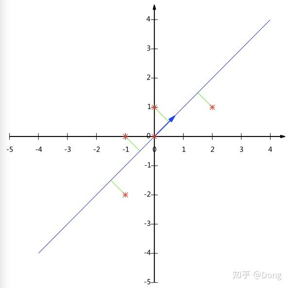

# PCA原理
`https://zhuanlan.zhihu.com/p/85198286`


## 大纲

* 相关背景    
* 数据降维    
* PCA的数学原理    
* PCA目标函数角度    
* PCA算法两种实现方法    
* PCA代码实现    
* 总结

## 相关背景

在许多领域的研究与应用中，通常需要对含有多个变量的数据进行观测，收集大量数据后进行分析寻找规律。多变量大数据集无疑会为研究和应用提供丰富的信息，但是也在一定程度上增加了数据采集的工作量。更重要的是在很多情形下，许多变量之间可能存在相关性，从而增加了问题分析的复杂性。如果分别对每个指标进行分析，分析往往是孤立的，不能完全利用数据中的信息，因此盲目减少指标会损失很多有用的信息，从而产生错误的结论。

因此需要找到一种合理的方法，在减少需要分析的指标同时，尽量减少原指标包含信息的损失，以达到对所收集数据进行全面分析的目的。由于各变量之间存在一定的相关关系，因此可以考虑将关系紧密的变量变成尽可能少的新变量，使这些新变量是两两不相关的，那么就可以用较少的综合指标分别代表存在于各个变量中的各类信息。主成分分析与因子分析就属于这类降维算法。

## 数据降维

降维就是一种对高维度特征数据预处理方法。**降维是将高维度的数据保留下最重要的一些特征，去除噪声和不重要的特征，从而实现提升数据处理速度的目的**。在实际的生产和应用中，降维在一定的信息损失范围内，可以为我们节省大量的时间和成本。降维也成为应用非常广泛的数据预处理方法。

降维具有如下一些优点：

* 使得数据集更易使用。    
* 降低算法的计算开销。    
* 去除噪声。    
* 使得结果容易理解

降维的算法有很多，比如奇异值分解(SVD)、主成分分析(PCA)、因子分析(FA)、独立成分分析(ICA)。

## PCA的数学原理

## 向量的表示及基变换

既然我们面对的数据被抽象为一组向量，那么下面有必要研究一些向量的数学性质。而这些数学性质将成为后续导出PCA的理论基础。

**内积与投影**

$(a_{1},a_{2},...,a_{n})\cdot{(b_{1},b_{2},...,b_{n})}=a_{1}b_{1} + a_{2}b_{2}+a_{3}b_{3}+...+a_{n}b_{n}$


在几何空间内如上图, 设向量B的模为1，则A与B的内积值等于A向B所在直线投影的矢量长度

为什么可以看成是投影呢


在如图的三角形中，利用余弦定理

$|\vec{c}|^{2} = |\vec{a}|^{2} + |\vec{b}|^{2} - 2cos\theta|\vec{a}||\vec{b}|$(1)

$(\vec{a} - \vec{b})(\vec{a} - \vec{b}) = |\vec{a}|^{2} + |\vec{b}|^{2} - 2\cdot{\vec{a}}\cdot{\vec{b}}$(2)

结合（1）和（2）

可以得出$\vec{a}\cdot{\vec{b}} = 2\cdot{cos\theta}\cdot{|\vec{a}|}\cdot{|\vec{b}|}$

当$|\vec{b}| = 1$时，$\vec{a}$和$\vec{b}$的点积可以看成$\vec{a}$在$\vec{b}$上投影的矢量长度$a_{0}$，如下图


在b站上3bule1grown的[点积与对偶性](https://www.bilibili.com/video/av44855426/?p=10 "点积与对偶性")章节对这方面也有一定的讲解

我是这样理解的


上图黑色线上在橙色线上的投影要比它在蓝色线上的投影要大，如果把它们看成特征的，黑色代表的特征和橙色线代表的特征的余弦相似度比黑色和蓝色的要大，说明它们的方向越接近，当它们重合时，它们的相似度为1。

**基**

下面我们继续在二维空间内讨论向量。上文说过，一个二维向量可以对应二维笛卡尔直角坐标系中从原点出发的一个有向线段。例如下面这个向量：


在代数表示方面，我们经常用线段终点的点坐标表示向量，例如上面的向量可以表示为(3,2)，这是我们再熟悉不过的向量表示。

不过我们常常忽略，**只有一个(3,2)本身是不能够精确表示一个向量的**。我们仔细看一下，这里的3实际表示的是向量在x轴上的投影值是3，在y轴上的投影值是2。也就是说我们其实隐式引入了一个定义：以x轴和y轴上正方向长度为1的向量为标准。那么一个向量(3,2)实际是说在x轴投影为3而y轴的投影为2。注意投影是一个矢量，所以可以为负。

更正式的说，向量(x,y)实际上表示线性组合：

$x(1,0)^{T} + y(0,1)^{T} \\$

此处(1,0)和(0,1)叫做二维空间中的一组基


所以，**要准确描述向量，首先要确定一组基，然后给出在基所在的各个直线上的投影值，就可以了**。只不过我们经常省略第一步，而默认以(1,0)和(0,1)为基。

我们之所以默认选择(1,0)和(0,1)为基，当然是比较方便，因为它们分别是x和y轴正方向上的单位向量，因此就使得二维平面上点坐标和向量一一对应，非常方便。但实际上任何两个线性无关的二维向量都可以成为一组基，所谓线性无关在二维平面内可以直观认为是两个不在一条直线上的向量。

例如，(1,1)和(-1,1)也可以成为一组基。一般来说，我们希望基的模是1，因为从内积的意义可以看到，如果基的模是1，那么就可以方便的用向量点乘基而直接获得其在新基上的坐标了！实际上，对应任何一个向量我们总可以找到其同方向上模为1的向量，只要让两个分量分别除以模就好了。例如，上面的基可以变为$(\frac{1}{\sqrt{2}},\frac{1}{\sqrt{2}})$和$(-\frac{1}{\sqrt{2}},\frac{1}{\sqrt{2}})$

现在，我们想获得(3,2)在新基上的坐标，即在两个方向上的投影矢量值，那么根据内积的几何意义，我们只要分别计算(3,2)和两个基的内积，不难得到新的坐标为$(\frac{5}{\sqrt{2}}, -\frac{1}{\sqrt{2}})$。下图给出了新的基以及(3,2)在新基上坐标值的示意图：


另外这里要注意的是，我们列举的例子中基是正交的（即内积为0，或直观说相互垂直），但可以成为一组基的唯一要求就是线性无关，非正交的基也是可以的。不过因为正交基有较好的性质，所以一般使用的基都是正交的。

**基变换的矩阵表示**

下面我们找一种简便的方式来表示基变换。还是拿上面的例子，想一下，将(3,2)变换为新基上的坐标，就是用(3,2)与第一个基做内积运算，作为第一个新的坐标分量，然后用(3,2)与第二个基做内积运算，作为第二个新坐标的分量。实际上，我们可以用矩阵相乘的形式简洁的表示这个变换：

$\begin{pmatrix}  \frac{1}{\sqrt{2}} &\frac{1}{\sqrt{2}} \\ -\frac{1}{\sqrt{2}} & \frac{1}{\sqrt{2}} \end{pmatrix} \times \begin{pmatrix}  3\\2 \end{pmatrix} =\begin{pmatrix} \frac{5}{\sqrt{2}} \\  -\frac{1}{\sqrt{2}} \end{pmatrix}$

一般的，如果我们有M个N维向量，想将其变换为由R个N维向量表示的新空间中，那么首先将R个基按行组成矩阵A，然后将向量按列组成矩阵B，那么两矩阵的乘积AB就是变换结果，其中AB的第m列为A中第m列变换后的结果。

数学表示为：

$\begin{pmatrix}  p_{1}\\p_{2}\\.\\.\\.\\p_{R} \end{pmatrix} \times \begin{pmatrix}  a_{1}&a_{2}&...&a_{M} \end{pmatrix} =\begin{pmatrix} p_{1}a_{1}&p_{1}a_{2}&...&p_{1}a_{M}\\p_{2}a_{1}&p_{2}a_{2}&...&p_{2}a_{M}\\...&...&...&...\\p_{R}a_{1}&p_{R}a_{2}&...&p_{R}a_{M}  \end{pmatrix}$

其中$p_{i}$是一个行向量，表示第i个基，$a_{j}$是一个列向量，表示第j个原始数据记录。

最后，上述分析同时给矩阵相乘找到了一种物理解释：**两个矩阵相乘的意义是将右边矩阵中的每一列列向量变换到左边矩阵中每一行行向量为基所表示的空间中去**。更抽象的说，一个矩阵可以表示一种线性变换。很多同学在学线性代数时对矩阵相乘的方法感到奇怪，但是如果明白了矩阵相乘的物理意义，其合理性就一目了然了。

**协方差矩阵及优化目标**

上面我们讨论了选择不同的基可以对同样一组数据给出不同的表示，而且如果基的数量少于向量本身的维数，则可以达到降维的效果。但是我们还没有回答一个最最关键的问题：如何选择基才是最优的。或者说，如果我们有一组N维向量，现在要将其降到K维（K小于N），那么我们应该如何选择K个基才能最大程度保留原有的信息？

要完全数学化这个问题非常繁杂，这里我们用一种非形式化的直观方法来看这个问题。

为了避免过于抽象的讨论，我们仍以一个具体的例子展开。假设我们的数据由五条记录组成，将它们表示成矩阵形式：

$\begin{pmatrix} 1&1&2&4&2 \\ 1&3&3&4&4   \end{pmatrix} \\$

中每一列为一条数据记录，而一行为一个字段。为了后续处理方便，我们首先将每个字段内所有值都减去字段均值，其结果是将每个字段都变为均值为0（这样做的道理和好处后面会看到）。

我们看上面的数据，第一个字段均值为$(1+1+2+4+2) / 5 = 2$，第二个字段均值为$(1+3+3+4+4) / 5 = 3$，所以变换后：

$\begin{pmatrix} -1&-1&0&2&0 \\ -2&0&0&1&1   \end{pmatrix} \\$

我们可以看下五条数据在平面直角坐标系内的样子：


现在问题来了：如果我们必须使用一维来表示这些数据，又希望尽量保留原始的信息，你要如何选择？

通过上一节对基变换的讨论我们知道，这个问题实际上是要在二维平面中选择一个方向，将所有数据都投影到这个方向所在直线上，用投影值表示原始记录。这是一个实际的二维降到一维的问题。

那么如何选择这个方向（或者说基）才能尽量**保留最多的原始信息**呢？一种直观的看法是：**希望投影后的投影值尽可能分散**。

以上图为例，可以看出如果向x轴投影，那么最左边的两个点会重叠在一起，中间的两个点也会重叠在一起，于是本身四个各不相同的二维点投影后只剩下两个不同的值了，这是一种严重的信息丢失，同理，如果向y轴投影最上面的两个点和分布在x轴上的两个点也会重叠。所以看来x和y轴都不是最好的投影选择。我们直观目测，如果向通过第一象限和第三象限的斜线投影，则五个点在投影后还是可以区分的。

下面，我们用数学方法表述这个问题。

**方差**

上文说到，我们希望投影后投影值尽可能分散，而这种分散程度，可以用数学上的方差来表述。此处，一个字段的方差可以看做是每个元素与字段均值的差的平方和的均值，即：

$Var(a) = \frac{1}{m}\sum_{i=1}^{m}{(a_{i} - u)^{2}}\\  $

由于上面我们已经将每个字段的均值都化为0了，因此方差可以直接用每个元素的平方和除以元素个数表示：

$Var(a) = \frac{1}{m}\sum_{i=1}^{m}{a_{i} ^{2}}\\ $

于是上面的问题被形式化表述为：寻找一个一维基，使得所有数据变换为这个基上的坐标表示后，方差值最大。

**协方差**

对于上面二维降成一维的问题来说，找到那个使得方差最大的方向就可以了。不过对于更高维，还有一个问题需要解决。考虑三维降到二维问题。与之前相同，首先我们希望找到一个方向使得投影后方差最大，这样就完成了第一个方向的选择，继而我们选择第二个投影方向。

如果我们还是单纯只选择方差最大的方向，很明显，这个方向与第一个方向应该是“几乎重合在一起”，显然这样的维度是没有用的，因此，应该有其他约束条件。从直观上说，**让两个字段尽可能表示更多的原始信息，我们是不希望它们之间存在（线性）相关性的**，因为相关性意味着两个字段不是完全独立，必然存在重复表示的信息。

数学上可以用两个字段的协方差表示其相关性，由于已经让每个字段均值为0，则：

$Cov(a,b) = \frac{1}{m}\sum_{i=1}^{m}{a_{i} b_{i}}\\ $

可以看到，在字段均值为0的情况下，两个字段的协方差简洁的表示为其内积除以元素数m。

当协方差为0时，表示两个字段完全独立。为了让协方差为0，我们选择第二个基时只能在与第一个基正交的方向上选择。因此最终选择的两个方向一定是正交的。

至此，我们得到了降维问题的优化目标：**将一组N维向量降为K维（K大于0，小于N），其目标是选择K个单位（模为1）正交基，使得原始数据变换到这组基上后，各字段两两间协方差为0，而字段的方差则尽可能大（在正交的约束下，取最大的K个方差）**


**协方差矩阵**

上面我们导出了优化目标，但是这个目标似乎不能直接作为操作指南（或者说算法），因为它只说要什么，但根本没有说怎么做。所以我们要继续在数学上研究计算方案。

我们看到，最终要达到的目的与字段内方差及字段间协方差有密切关系。因此我们希望能将两者统一表示，仔细观察发现，两者均可以表示为内积的形式，而内积又与矩阵相乘密切相关。于是我们来了灵感：

假设我们只有a和b两个字段，那么我们将它们按行组成矩阵X：

$X = \begin{pmatrix} a_{1}&a_{2}&...&a_{m} \\ b_{1}&b_{2}&...&b_{m}   \end{pmatrix} \\$

然后我们用X乘以X的转置，并乘上系数1/m：

$\frac{1}{m}XX^{T} = \begin{pmatrix}  \frac{1}{m}\sum_{i=1}^{m}{a_{i}^{2}}& \frac{1}{m}\sum_{i=1}^{m}{a_{i} b_{i}} \\ \frac{1}{m}\sum_{i=1}^{m}{a_{i} b_{i}} &   \frac{1}{m}\sum_{i=1}^{m}{b_{i}^{2}}   \end{pmatrix} \\$

奇迹出现了！这个矩阵对角线上的两个元素分别是两个字段的方差，而其它元素是a和b的协方差。两者被统一到了一个矩阵的。

根据矩阵相乘的运算法则，这个结论很容易被推广到一般情况：

**设我们有m个n维数据记录，将其按列排成n乘m的矩阵X，设**$\textbf {C} = \frac{1}{m} XX^{T} $**则C是一个对称矩阵，其对角线分别个各个字段的方差，而第i行j列和j行i列元素相同，表示i和j两个字段的协方差**。


**协方差矩阵对角化**

根据上述推导，我们发现要达到优化目前，等价于将协方差矩阵对角化：即除对角线外的其它元素化为0，并且在对角线上将元素按大小从上到下排列，这样我们就达到了优化目的。这样说可能还不是很明晰，我们进一步看下原矩阵与基变换后矩阵协方差矩阵的关系：

设原始数据矩阵X对应的协方差矩阵为C，而P是一组基按行组成的矩阵，设Y=PX，则Y为X对P做基变换后的数据。设Y的协方差矩阵为D，我们推导一下D与C的关系：

$D = \frac{1}{m}(PX)(PX)^{T}\\= \frac{1}{m}PXX^{T}P^{T}\\ \; =P(\frac{1}{m}XX^{T})P^{T}\\ =PCP^{T}\quad\quad\quad$

现在事情很明白了！我们要找的P不是别的，而是能让原始协方差矩阵对角化的P。换句话说，优化目标变成了**寻找一个矩阵P满足**$\textbf {PCP}^{\textbf{T}} $**是一个对角矩阵，并且对角元素按从大到小依次排列，那么P的前K行就是要寻找的基，用P的前K行组成的矩阵乘以X就使得X从N维降到了K维并满足上述优化条件**。

至此，我们离“发明”PCA还有仅一步之遥！

现在所有焦点都聚焦在了协方差矩阵对角化问题上，有时，我们真应该感谢数学家的先行，因为矩阵对角化在线性代数领域已经属于被玩烂了的东西，所以这在数学上根本不是问题。

由上文知道，协方差矩阵C是一个是对称矩阵，在线性代数上，实对称矩阵有一系列非常好的性质：

1）**实对称矩阵不同特征值对应的特征向量必然正交**。

2）设特征向量λ数为r，则必然存在r个线性无关的特征向量对应于λ，因此可以将这r个特征向量单位正交化。

由上面两条可知，一个n行n列的实对称矩阵一定可以找到n个单位正交特征向量，设这n个特征向量为$e_{1},e_{2}...e_{n}$,我们将其按列组成矩阵：

$E= (e_{1},e_{2}...e_{n})\\$

则对协方差矩阵C有如下结论：

$E^{T}CE = \Lambda = X = \begin{pmatrix} \lambda_{1}&   &  &  \\   &   \lambda_{2}&  & \\  &  & . &  \\  &  & &  \lambda_{n}\end{pmatrix} \\$

其中$\Lambda$为对角矩阵，其对角元素为各特征向量对应的特征值（可能有重复）。

以上结论不再给出严格的数学证明，对证明感兴趣的朋友可以参考线性代数书籍关于“实对称矩阵对角化”的内容。

到这里，我们发现我们已经找到了需要的矩阵P：

$P=E^{T}\\$

P是协方差矩阵的特征向量单位化后按行排列出的矩阵，其中每一行都是C的一个特征向量。

如果设P按照$\Lambda$中特征值的从大到小，将特征向量从上到下排列，则用P的前K行组成的矩阵乘以原始数据矩阵X，就得到了我们需要的降维后的数据矩阵Y

至此我们完成了整个PCA的数学原理讨论。在下面的一节，我们将给出PCA的一个实例。

## PCA目标函数

在前面的章节中，我们通过$D = \frac{1}{m}(PX)(PX)^{T}\\= \frac{1}{m}PXX^{T}P^{T}\\ \; =P(\frac{1}{m}XX^{T})P^{T}\\ =PCP^{T}\quad\quad\quad$

公式推导，我们的优化目标变成了寻找一个矩阵P满足$\textbf {PCP}^{\textbf{T}} $是一个对角矩阵，并且对角元素按从大到小依次排列，那么P的前K行就是要寻找的基，用P的前K行组成的矩阵乘以X就使得X从N维降到了K维并满足上述优化条件。

现在我们换一个角度，从构造目标函数出发:

$ C = \frac{1}{m} XX^{T} $

目的:we want to find a projection$u_1$such that projected variance is maximized(我们需要找到一个投影方向，使得我们的数据在这投影方向的值的总和最大);所有的方向两两正交，线性无关。

$x_i \stackrel{u_1}{\longrightarrow} u_1^T \cdot x_i$

Mean of projection:$\frac{1}{N} \sum_{i=1}^{n}{u_1^T \cdot x_i} = u_1^T\sum_{i=1}^{n}{\frac{x_i}{N}}= 0$

Variance of projection:$\frac{1}{N} \sum_{i=1}^{n}{(u_1^T \cdot xi)^2} = \frac{1}{N} \sum_{i=1}^{n}{(u_1^Tx_ix_i^Tu_1)} =  u_1^T \cdot \frac{1}{N} \sum_{i=1}^{n}{(x_ix_i^T)} \cdot u_1 =   u_1^T \cdot s \cdot  u_1$

目标函数变为:

$\max_{u_1} u_1^T \cdot s \cdot  u_1 $

$s.t.\;||u_1||_2^2 = 1$

加上限制条件是使问题变成well defined

用拉格朗日转换成$\Rightarrow  u_1^T \cdot s \cdot  u_1 + \lambda(1 -||u_1||_2^2 )$

对$u_1求导$

$2su_1+ \lambda(-2u_1) = 0 \Rightarrow su_1 = \lambda u_1$

$\Rightarrow \lambda 是s的特征值,u_1是s的特征向量$

$\max_{u_1} u_1^T \cdot s \cdot  u_1 \Rightarrow \max_{u_1} u_1^T \cdot \lambda \cdot  u_1 =  \max_{u_1}  \lambda \cdot u_1^T \cdot  u_1 =  \max_{u_1}  \lambda$

$u_1:针对的是特征值最大的$

$u_2:针对的是特征值第二大的$

$... $

$(\lambda_1\lambda_2\lambda_3\lambda_4,...\lambda_{10})$

问题需要选择多少个特征值?

$\frac{\lambda_1 + \lambda_2 + \lambda_3+... }{\lambda_1 + \lambda_2 + \lambda_3+\lambda_4 +...+ \lambda_{10}} \geq 95\%$


## PCA算法两种实现方法

**(1)基于特征值分解协方差矩阵实现PCA算法**

总结一下PCA的算法步骤：

设有m条n维数据。

1）将原始数据按列组成n行m列矩阵X

2）将X的每一行（代表一个属性字段）进行零均值化，即减去这一行的均值

3）求出协方差矩阵$\textbf {C} = \frac{1}{m} XX^{T} $

4）求出协方差矩阵的特征值及对应的特征向量

5）将特征向量按对应特征值大小从上到下按行排列成矩阵，取前k行组成矩阵P

6）$Y=PX$即为降维到k维后的数据

**实例**

这里以上文提到的

$\begin{pmatrix} -1&-1&0&2&0 \\ -2&0&0&1&1   \end{pmatrix} \\$

为例，我们用PCA方法将这组二维数据其降到一维。

因为这个矩阵的每行已经是零均值，这里我们直接求协方差矩阵：

$C = \frac{1}{5}\begin{pmatrix} -1&-1&0&2&0 \\ -2&0&0&1&1   \end{pmatrix} \begin{pmatrix} -1&-2\\ -1&0\\0&0\\2&1\\0&1  \end{pmatrix}  = \begin{pmatrix} \frac{6}{5}&\frac{4}{5}\\ \frac{4}{5}&\frac{6}{5} \end{pmatrix} \\$

然后求其特征值和特征向量，具体求解方法不再详述，可以参考相关资料。求解后特征值为：

$\lambda_{1} = 2,\lambda_{2} = \frac{2}{5}\\$

其对应的特征向量分别是：$c_{1} = \begin{pmatrix} 1\\1 \end{pmatrix}, c_{2} = \begin{pmatrix} -1\\1 \end{pmatrix}\\$

其中对应的特征向量分别是一个通解，$c_{1}$和$c_{2}$可取任意实数。那么标准化后的特征向量为：

$ \begin{pmatrix} 1/\sqrt{2}\\1/\sqrt{2} \end{pmatrix}, \begin{pmatrix} -1/\sqrt{2}\\1/\sqrt{2} \end{pmatrix}\\$

因此我们的矩阵P是:

$ P = \begin{pmatrix} 1/\sqrt{2} & 1/\sqrt{2} \\ - 1/\sqrt{2} & 1/\sqrt{2} \end{pmatrix}\\$

可以验证协方差矩阵C的对角化：

$PCP^{T} = \begin{pmatrix} 1/\sqrt{2} & 1/\sqrt{2} \\ - 1/\sqrt{2} & 1/\sqrt{2} \end{pmatrix}\begin{pmatrix} 6/5 & 4/5 \\ 4/5 & 6/5 \end{pmatrix} \begin{pmatrix} 1/\sqrt{2} & -1/\sqrt{2} \\ 1/\sqrt{2} & 1/\sqrt{2} \end{pmatrix} = \begin{pmatrix} 2 & 0 \\ 0 & 2/5 \end{pmatrix} $

最后我们用P的第一行乘以数据矩阵，就得到了降维后的表示：

$Y = \begin{pmatrix}  1/\sqrt{2}, 1/\sqrt{2}\end{pmatrix} \begin{pmatrix} -1&-1&0&2&0 \\ -2&0&0&1&1   \end{pmatrix}  = (-3/\sqrt{2}, -1/\sqrt{2}, 3/\sqrt{2},-1/\sqrt{2})$

降维投影结果如下图：



## (2) 基于SVD分解协方差矩阵实现PCA算法

输入：数据集$X=\left\{ x_{1},x_{2},x_{3},...,x_{n} \right\}$，需要降到k维。

1) 去平均值，即每一位特征减去各自的平均值。

2) 计算协方差矩阵。

3) 通过SVD计算协方差矩阵的特征值与特征向量。

4) 对特征值从大到小排序，选择其中最大的k个。然后将其对应的k个特征向量分别作为列向量组成特征向量矩阵。

5) 将数据转换到k个特征向量构建的新空间中。

在PCA降维中，我们需要找到样本协方差矩阵$XX^T$的最大k个特征向量，然后用这最大的k个特征向量组成的矩阵来做低维投影降维。可以看出，在这个过程中需要先求出协方差矩阵$XX^T$,当样本数多、样本特征数也多的时候，这个计算还是很大的。当我们用到SVD分解协方差矩阵的时候，SVD有两个好处：

1) 有一些SVD的实现算法可以先不求出协方差矩阵$XX^T$也能求出我们的右奇异矩阵V。也就是说，我们的PCA算法可以不用做特征分解而是通过SVD来完成，这个方法在样本量很大的时候很有效。实际上，scikit-learn的PCA算法的背后真正的实现就是用的SVD，而不是特征值分解。

2)注意到PCA仅仅使用了我们SVD的左奇异矩阵，没有使用到右奇异值矩阵，那么右奇异值矩阵有什么用呢？

假设我们的样本是m*n的矩阵X，如果我们通过SVD找到了矩阵$X^TX$最大的k个特征向量组成的k*n的矩阵$V^T$,则我们可以做如下处理：

$X_{m*k}^{'}=X_{m*n}V_{n*k}^{T}$

可以得到一个m*k的矩阵X',这个矩阵和我们原来m*n的矩阵X相比，列数从n减到了k，可见对列数进行了压缩。也就是说，左奇异矩阵可以用于对行数的压缩；右奇异矩阵可以用于对列(即特征维度)的压缩。这就是我们用SVD分解协方差矩阵实现PCA可以得到两个方向的PCA降维(即行和列两个方向)。

**PCA代码实现**

（1）PCA的Python实现：

```python
import numpy as np
def pca(X,k):#k is the components you want
  #mean of each feature
  n_samples, n_features = X.shape
  # mean=np.array([np.mean(X[:,i]) for i in range(n_features)])
  mean = np.mean(X, axis=0)
  #normalization
  norm_X=X-mean
  #scatter matrix
  scatter_matrix=np.dot(np.transpose(norm_X),norm_X) / n_samples
  #Calculate the eigenvectors and eigenvalues
  eig_val, eig_vec = np.linalg.eig(scatter_matrix)
  eig_pairs = [(np.abs(eig_val[i]), eig_vec[:,i]) for i in range(n_features)]
  # sort eig_vec based on eig_val from highest to lowest
  eig_pairs.sort(reverse=True)
  # select the top k eig_vec
  feature=np.array([ele[1] for ele in eig_pairs[:k]])
  #get new data
  data=np.dot(norm_X,np.transpose(feature))
  return data

X = np.array([[-1, 1], [-2, -1], [-3, -2], [1, 1], [2, 1], [3, 2]])
print(pca(X,1))
```

上面代码实现了对数据X进行特征的降维。结果如下：


2）用sklearn的PCA

```python
import numpy as np
X = np.array([[-1, 1], [-2, -1], [-3, -2], [1, 1], [2, 1], [3, 2]])
from sklearn.decomposition import PCA
pca=PCA(n_components=1)
pca.fit(X)
print(pca.transform(X))
```

结果如下：


结果好像取了相反数

sklearn中的PCA是通过svd_flip函数实现的，sklearn对奇异值分解结果进行了一个处理，因为$u_{i}*σ_{i}*v_{i}=(-u_{i})*σ_{i}*(-v_{i})$，也就是u和v同时取反得到的结果是一样的，而这会导致通过PCA降维得到不一样的结果（虽然都是正确的）。具体了解可以看参考文章(3)或者自己分析一下sklearn中关于PCA的源码。

## 总结

PCA本质上是将方差最大的方向作为主要特征，并且在各个正交方向上将数据“离相关”，也就是让它们在不同正交方向上没有相关性(确保特征之间没有相关性)。

因此，PCA也存在一些限制，例如它可以很好的解除线性相关，但是对于高阶相关性就没有办法了，对于存在高阶相关性的数据，可以考虑Kernel  PCA，通过Kernel函数将非线性相关转为线性相关，关于这点就不展开讨论了。另外，PCA假设数据各主特征是分布在正交方向上，如果在非正交方向上存在几个方差较大的方向，PCA的效果就大打折扣了。

最后需要说明的是，PCA是一种无参数技术，也就是说面对同样的数据，如果不考虑清洗，谁来做结果都一样，没有主观参数的介入，所以PCA便于通用实现，但是本身无法个性化的优化。


Reference:

(1)[主成分分析（PCA）原理详解](https://zhuanlan.zhihu.com/p/37777074 "主成分分析（PCA）原理详解")

(2)[CodingLabs - PCA的数学原理](http://blog.codinglabs.org/articles/pca-tutorial.html "CodingLabs - PCA的数学原理")

(3)[主成分分析PCA（Principal Component Analysis）在sklearn中的应用及部分源码分析](https://www.cnblogs.com/lochan/p/7001907.html "主成分分析PCA（Principal Component Analysis）在sklearn中的应用及部分源码分析")

(4)[3blue1brown线性代数的本质](https://www.bilibili.com/video/av44855426 "3blue1brown线性代数的本质")


