# 如何理解矩阵特征值？
`https://www.zhihu.com/question/21874816/answer/181864044`

（下面的回答只涉及实数范围）。

关于特征值、特征向量可以讲的确实很多，我这里希望可以给大家建立一个直观的印象。
先给一个简短的回答，如果把矩阵看作是运动，对于运动而言，最重要的当然就是运动的速度和方向，那么（我后面会说明一下限制条件）：

* 特征值就是运动的速度    
* 特征向量就是运动的方向
既然运动最重要的两方面都被描述了，特征值、特征向量自然可以称为运动（即矩阵）的特征。

注意，由于矩阵是数学概念，非常抽象，所以上面所谓的运动、运动的速度、运动的方向都是广义的，在现实不同的应用中有不同的指代。
下面是详细的回答，我会先从几何上简单讲解下特征值、特征向量的定义指的是什么，然后再来解释为什么特征值、特征向量会是运动的速度和方向。

**1 几何意义**
说明下，因为线性变换总是在各种基之间变来变去，所以我下面画图都会把作图所用的基和原点给画出来。

在$\vec{i_{}},\vec{j_{}}$下面有个$\vec{v_{}}$：
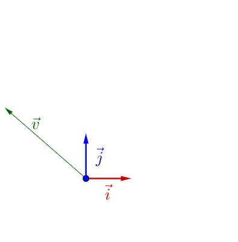

随便左乘一个矩阵$A$，图像看上去没有什么特殊的：
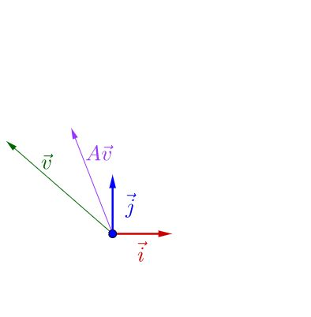

我调整下$\vec{v_{}}$的方向，图像看上去有点特殊了：
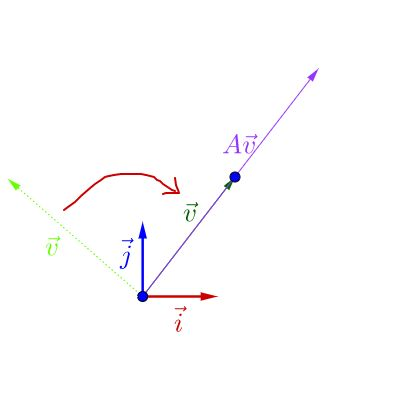

可以观察到，调整后的$\vec{v_{}}$和$A\vec{v_{}}$在同一根直线上，只是$A\vec{v_{}}$的长度相对$\vec{v_{}}$的长度变长了。
此时，我们就称$\vec{v_{}}$是$A$的特征向量，而$A\vec{v_{}}$的长度是$\vec{v_{}}$的长度的$\lambda$倍，$\lambda$就是特征值。

从而，特征值与特征向量的定义式就是这样的：
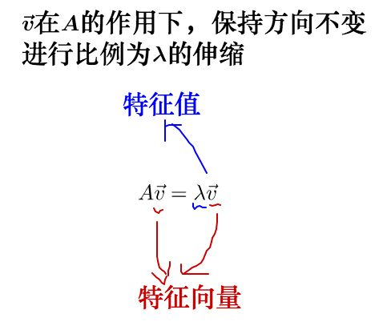

其实之前的$A$不止一个特征向量，还有一个特征向量：
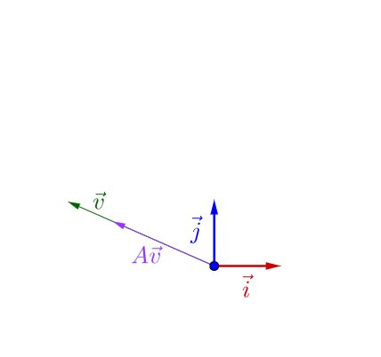

容易从$A\vec{v_{}}$相对于$\vec{v_{}}$是变长了还是缩短看出，这两个特征向量对应的特征$\lambda$值，一个大于1，一个小于1。
从特征向量和特征值的定义式还可以看出，特征向量所在直线上的向量都是特征向量：

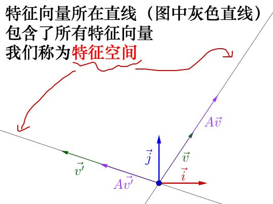
你可以自己动手试试，可以改变$\vec{v_{}}$的位置，以及矩阵$A$的值（特征空间会随着矩阵改变而改变）：

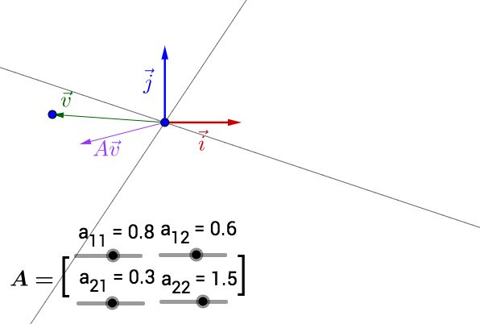
此处有互动内容，[点击此处前往操作。](http://www.matongxue.com/madocs/228.html "点击此处前往操作。")其中有些值构成的矩阵没有画出特征空间，可能是因为它的特征值、特征向量是复数，也可能是不存在。

下面就要说下，特征值、特征向量与运动的关系
**2 运动的速度与方向**

**2.1 从调色谈起**
我有一管不知道颜色的颜料，而且这管颜料有点特殊，我不能直接挤出来看颜色，只能通过调色来观察：

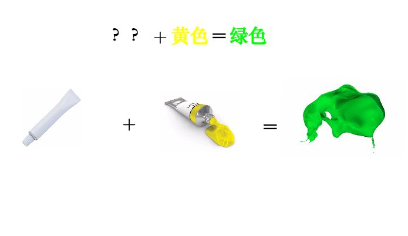
为了分辨出它是什么颜色（记得它只能通过调色来辨别）：

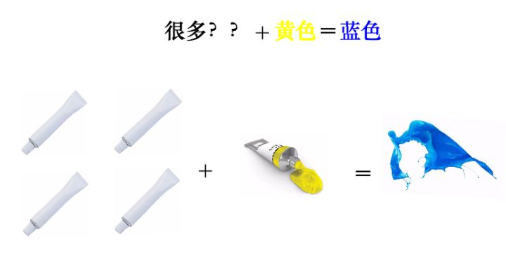
因为反复混合之后，这管颜料的**特征**就凸显了出来，所以我们判断，这管颜料应该是蓝色。

说这个干什么？矩阵也有类似的情况。
**2.2 矩阵的混合**

一般来说，矩阵我们可以看作某种运动，而二维向量可以看作平面上的一个点（或者说一个箭头）。对于点我们是可以观察的，但是运动我们是不能直接观察的。
就好像，跑步这个动作，我们不附加到具体的某个事物上是观察不到的，我们只能观察到：人跑步、猪跑步、老虎跑步、......，然后从中总结出跑步的特点。

就好像之前举的不能直接观察的颜料一样，要观察矩阵所代表的运动，需要把它附加到向量上才观察的出来：
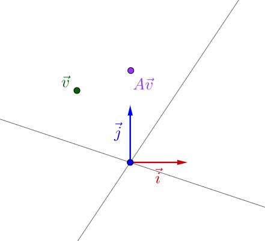

似乎还看不出什么。但是如果我反复运用矩阵乘法的话：
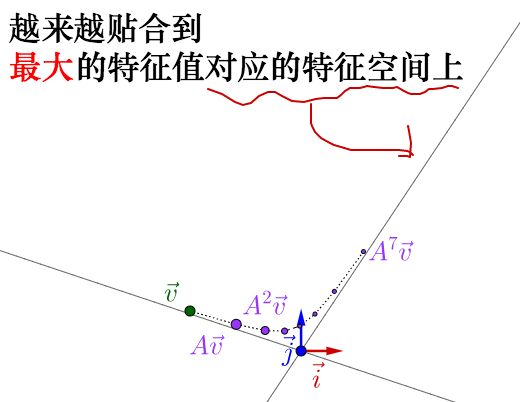

就像之前颜料混合一样，反复运用矩阵乘法，矩阵所代表的运动的最明显的特征，即速度最大的方向，就由最大特征值对应的特征向量展现了出来。
至于别的特征值对应的是什么速度，我后面会解释，这里先跳过。

可以自己动手试试，我把$\lambda$值也标注出来了，可以关注下最大$\lambda$值对于运动的影响：
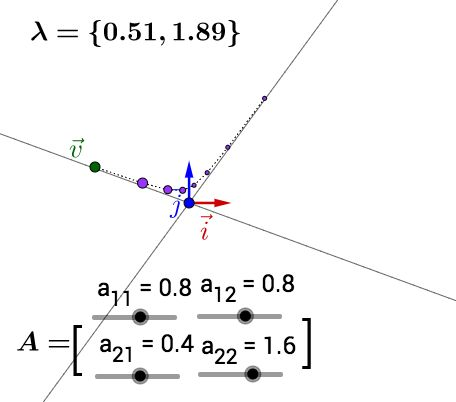

此处有互动内容，[点击此处前往操作。](http://www.matongxue.com/madocs/228.html "点击此处前往操作。")顺便说下，对于复数的特征值、特征向量，在上面就没有画出特征空间，但可以观察到反复运用矩阵乘法的结果是围绕着原点在旋转。关于复数特征值和特征向量这里就不展开来说了。

**2.3 烧一壶斐波那契的水**
上面说的运动太抽象了，我来举一个具体点的例子：烧水。

比如说我想烧一壶水，水的温度按照斐波那契数列升高，即下一秒的温度$T_{t+1}$与当前温度$T_{t}$以及上一秒的温度$T_{t-1}$的关系为：
$T_{t+1}=T_{t}+T_{t-1}\\$

要继续计算下去，我只需要$T_{t+1}$以及$T_{t}$就可以继续算下去。因此我可以写成下面的式子：
$\begin{bmatrix}T_{t+1}\\T_{t}\end{bmatrix}=\begin{bmatrix}1&1\\1&0\end{bmatrix}\begin{bmatrix}T_{t}\\T_{t-1}\end{bmatrix}\\$

因此烧水这个运动我们可以抽象为矩阵$A=\begin{bmatrix}1&1\\1&0\end{bmatrix}$，反复进行这个运动就可以烧开这壶水，根据斐波那契数列，让我们从$\begin{bmatrix}1\\1\end{bmatrix}$点开始（感兴趣的话，可以通过之前的互动调整下参数，可以得到下面的结果）：
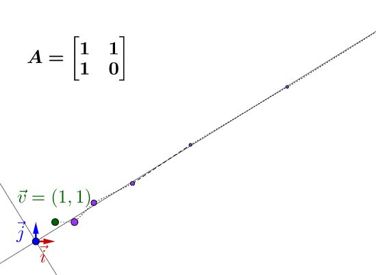

就可以看出，这壶水的温度会沿着$A$的特征值最大的特征向量方向飞快增长，我估计要不了多久，在理想的情况下，温度就会突破百万度、千万度、亿万度，然后地球说不定就爆炸了。我们就说这个矩阵不稳定。
所以说，不要烧斐波那契的水。

实际上历史也是这样，欧拉在研究刚体的运动时发现，有一个方向最为重要，后来拉格朗日发现，哦，原来就是特征向量的方向。
我们知道特征值、特征向量有什么特点之后，下一步就想知道，为什么会这样？

**3 特征值分解**
下面讲解要用到矩阵乘法和相似矩阵的知识，我就不啰嗦了，可以参看：“[从高斯消元法到矩阵乘法](https://www.matongxue.com/madocs/755.html "从高斯消元法到矩阵乘法")”、“[如何理解矩阵乘法？](https://www.matongxue.com/madocs/555.html "如何理解矩阵乘法？")”以及“[相似矩阵是什么？](https://www.matongxue.com/madocs/491.html "相似矩阵是什么？")”

我们知道，对于矩阵$A$可以对角化的话，可以通过相似矩阵进行下面这样的特征值分解：
$A=P\Lambda P^{-1}\\$

其中$\Lambda$为对角阵，$P$的列向量是单位化的特征向量。
说的有点抽象，我们拿个具体的例子来讲：

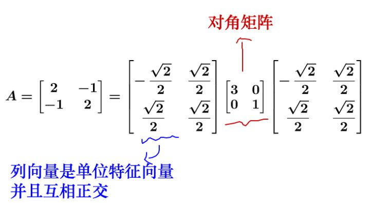
对于方阵而言，矩阵不会进行维度的升降，所以矩阵代表的运动实际上只有两种：

* 旋转    
* 拉伸
最后的运动结果就是这两种的合成。

我们再回头看下刚才的特征值分解，实际上把运动给分解开了：
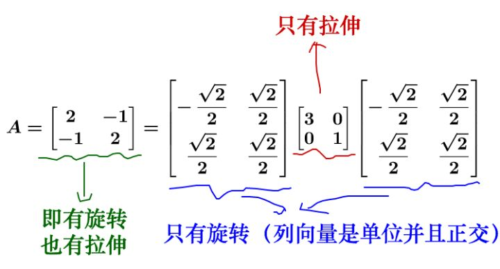

我们来看看在几何上的表现是什么，因此相似矩阵的讲解涉及到基的变换，所以大家注意观察基：
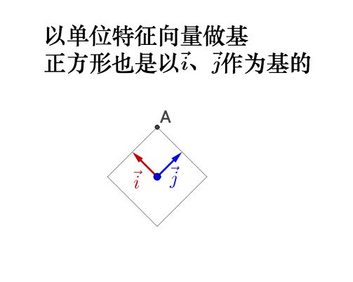

左乘$P=\begin{bmatrix}\frac{-\sqrt{2}}{2}&\frac{\sqrt{2}}{2}\\\frac{\sqrt{2}}{2}&\frac{\sqrt{2}}{2}\end{bmatrix}$：
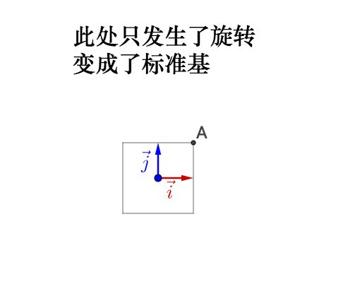

如果旋转前的基不正交，旋转之后变为了标准基，那么实际会产生伸缩，所以之前说的正交很重要。
继续左乘对角矩阵$\Lambda=\begin{bmatrix}3&0\\0&1\end{bmatrix}$：

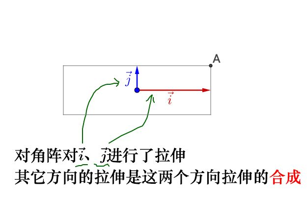
相当于，之前的旋转是指明了拉伸的方向，所以我们理解了：

* 特征值就是拉伸的大小    
* 特征向量指明了拉伸的方向
回到我们之前说的运动上去，特征值就是运动的速度，特征向量就是运动的方向，而其余方向的运动就由特征向量方向的运动合成。所以最大的特征值对应的特征向量指明了运动速度的最大方向。

但是，重申一下，上面的推论有一个**重要**的条件，特征向量正交，这样变换后才能保证变换最大的方向在基方向。如果特征向量不正交就有可能不是变化最大的方向，比如：
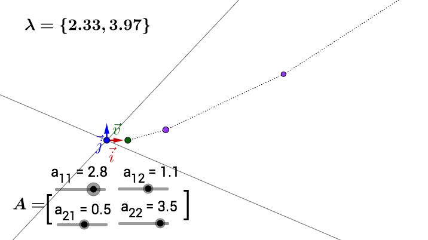

所以我们在实际应用中，都要去找正交基。但是特征向量很可能不是正交的，那么我们就需要奇异值分解了，这里就不展开了。
大家可以再回头去操作一下之前的动图，看看不正交的情况下有什么不一样。

左乘$P^{-1}=\begin{bmatrix}-\frac{\sqrt{2}}{2}&\frac{\sqrt{2}}{2}\\\frac{\sqrt{2}}{2}&\frac{\sqrt{2}}{2}\end{bmatrix}$：
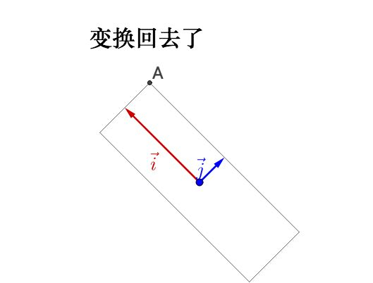

说明下，如果大家把这个文章和之前提到的我写的“相似矩阵”的文章参照来看的话，“相似矩阵”那篇文章里面我把图像的坐标系换了，所以看着图像没有变换（就好像直角坐标系到极坐标系下，图像是不会变换的）。而这里我把图像的坐标系给旋转、拉伸了，所以看着图像变换了（就好像换元，会导致图像变换）。这其实是看待矩阵乘法的两种视角，是等价的，但是显示到图像上就有所不同。
**4 特征值、特征向量的应用**

**4.1 控制系统**
之前的烧水系统是不稳定的。

$\lambda = 1$的，系统最终会趋于稳定：
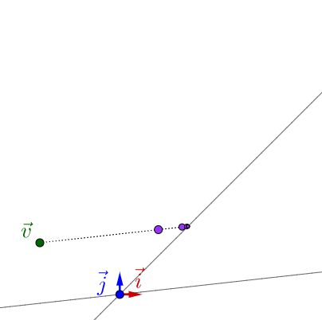

**4.2 图片压缩**
比如说，有下面这么一副$512\times512$的图片（方阵才有特征值，所以找了张正方形的图）：

这个图片可以放到一个矩阵里面去，就是把每个像素的颜色值填入到一个$512\times512$的$A$矩阵中。

根据之前描述的有：
$A=P\Lambda P^{-1}\\$

其中，$\Lambda$是对角阵，对角线上是从大到小排列的特征值。
我们在$A=P\Lambda P^{-1}$中只保留前面50个的特征值（也就是最大的50个，其实也只占了所有特征值的百分之十），其它的都填0，重新计算矩阵后，恢复为下面这样的图像：

效果还可以，其实一两百个特征值之和可能就占了所有特征值和的百分之九十了，其他的特征值都可以丢弃了。

文章最新版本在（有可能会有后续更新）：[如何理解特征值和特征向量？](https://www.matongxue.com/madocs/228.html "如何理解特征值和特征向量？")

