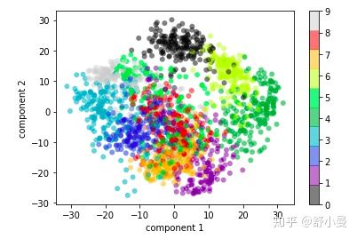
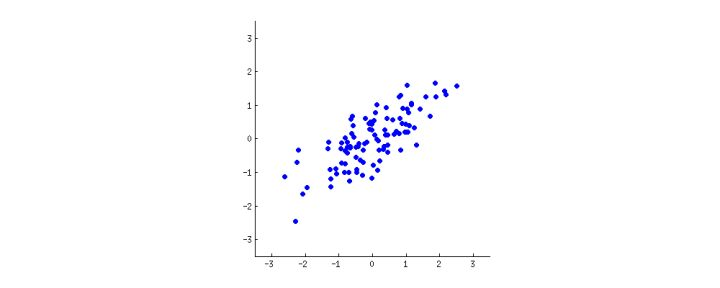
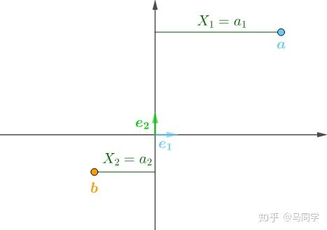

# 如何通俗易懂地讲解什么是 PCA 主成分分析
一下回答都来自`https://www.zhihu.com/question/41120789`

## 回答一

很多人对回归分析都很熟悉，它的数学形式是这样的：

$\hat{y_i} =  _0+ _1x_{1i}+ _2x_{2i}+...+ _jx_{ji}$

这意味着我们有一个标记好的变量y，它是我们的正确答案，而我们的目的就是要用其他变量或特征去预测新的变量y。预测值和“正确答案”之间可能存在误差。我们的模型要最小化这一误差。这被称为监督学习。

而对于没有标记的数据，我们也会想要挖掘数据中的模式和结构，这被称为无监督学习。最常见的操作就是数据降维，即把一个有很多列的表压缩成只有少数列的表。这样做虽然损失了部分信息，但在可理解性上则获得了回报。

假设我心里想到了一个运动员，让你来猜。你可以从各个特征来缩小可能运动员的范围，而我只能告诉你是或不是。

你可能会问这个运动员是不是男性？是不是中国人？是不是从事球类运动？等等。

不同的特征可能的范围各不相同。比如性别只有两种可能性，而国别则有上百种可能性（当然知名运动员可能的国别范围不一定有上百）。

* 可能性越多的特征包含的信息量越大。这意味着如果你得到了肯定回答，比如“这个人是中国人”，那么剩下的范围将会大大缩小，起码比性别更有区分度。    
* 不同特征之间存在一定的信息冗余。比如如果你知道了这个运动员打乒乓球很厉害，下一个问题再问国籍就有点不明智了（当然也有可能不是中国人，因为信息不一定是100%冗余的）。

**主成分分析的目的就是要从这些现有的特征中重建新的特征，新的特征剔除了原有特征的冗余信息，因此更有区分度**注意，主成分分析的结果是得到新的特征，而不是简单地舍弃原来的特征列表中的一些特征。

* 新的特征拥有更好的区分度，转换成数学语言就是变异或方差更大。    
* 新的特征基于原有特征，它能够重建原有特征。主成分分析要保留最有可能重建原有特征的新特征，从而达到数据降维的作用。

除了数据降维，主成分分析也可以作为特征提取或特征工程的一种方法。

要进行主成分分析，我们首先要观察数据中列之间的相关性有多大，看是否适合主成分分析。

### 认识协方差矩阵

假设我们的数据有两个维度：x, y。那么它的协方差矩阵如下：

$\begin{bmatrix}\sigma^2_x & \sigma(x, y)\\ \sigma(x, y) & \sigma^2_y\end{bmatrix}$

其中，$\sigma^2_x$是维度x的变异，$\sigma^2_y$是维度y的变异，$\sigma(x, y)$是维度x和y之间的协方差，代表x和y之间的共变程度或相关性。

$ \sigma^2_x = \frac{1}{n-1} \sum^{n}_{i=1}(x_i – \bar{x})^2 \\ $

$\sigma^2_y = \frac{1}{n-1} \sum^{n}_{i=1}(y_i – \bar{y})^2 \\ $

$ \sigma(x, y) = \frac{1}{n-1} \sum^{n}_{i=1}{(x_i-\bar{x})(y_i-\bar{y})}\\$

数据的全部信息包含在协方差矩阵所描述的全部变异中。其中$\sigma^2_x$代表数据点在维度x（下图x轴）上投影点的分散程度，它是通过所有点到数据中心点（即x的平均值）的平均平方和计算得到的，$\sigma^2_y$代表数据点在维度y（下图y轴）上投影点的分散程度；方差越大，数据越分散，也就意味着信息量越多，信号越强，该特征越有区分度。协方差代表维度x和维度y之间的相关程度，协方差越大，也就意味着噪声越大，信息的冗余程度越高。

主成分分析的目的就是要最小化噪声，最大化提取出数据中包含的信息。它可以帮助我们找到新的维度，从而剔除不同维度之间的冗余信息，即让不同维度之间的相关为0。因此，主成分分析在各个维度之间相关性很高时尤为有用。（注意：本文所说的维度、特征等是同一个东西）

在新的维度pc1和pc2上，数据的协方差矩阵如下：

$\begin{bmatrix}\sigma^{2}_{pc1} & 0\\0 &\sigma^{2}_{pc2}\end{bmatrix}$

对角线上的方差是新维度上的方差，非对角线代表维度之间的相关，它等于0意味着主成分分析得到的新维度完全剔除了特征之间的冗余信息。

### 直观理解主成分分析的目的

主成分分析的目的是：

* 找到变异最大的新维度，以最大程度地区分不同数据点    
* 这一新维度应该可以让我们预测和重建原始维度，重建或投影误差（reconstruction/projection error）应该最小化

回到上面的协方差矩阵，主成分分析的目的就是要找到新的维度（坐标系），让对角线上的变异最大，而维度之间的协方差最小。

假设我们有一堆二维的数据点，维度分别是a和b。从下图中我们可以看到两个维度是相关的。

我们在这些数据点中间画一条直线，然后将这些数据点投影到这条直线上，即通过数据点画一条垂直于这条直线的线，交点即是这个数据点在新的维度上的位置。新维度可以用$w_{1}a+w_{2}b$表示，也就意味着我们是在原有特征的基础上重建新特征的。下面是两条可能的直线：

`图1`

`图2`

如何找到最佳的直线呢？前面我们说过，主成分分析的目的是找到变异最大的新维度，以及投影误差要最小化，以最小化信息损失。实际上，这两个目的是同时达到的，即变异最大化时正好是投影误差最小时。

为什么？

数学上，红点的分布是用每个点到中心点的平均平方距离度量的，即新维度上的变异或方差。而重建误差则是用相应红线的平均平方长度度量的，它其实就是与变异最大的维度独立的另一新维度上的变异或方差；重建误差越小，我们在降维后所能保留的信息越多。

我们可以把下图中的B点想象成上图中的某个数据点，C点是B点在新维度上的投影点，A点是新维度的中心点。根据勾股定理：

$a^{2}+b^{2}=c^{2}$

由于每个点到新维度中心点的位置是确定的，即c的平方是固定的，那么，当新维度上点与点之间越分散，即b的平方最大时，a的平方也最小，即投影误差最小。

图2显然比图1更能满足我们的标准。实际上，上面图2描述的直线便是我们所要寻找的直线，这条直线即是我们的新维度，也即第一个主成分。而垂直于第一个主成分的维度则是第二个维度。两个维度保留了原数据的所有信息（原数据即是两个维度）。但在实践中，为了达到将高维数据降维的目的，我们可能会舍弃信息量很少的维度。比如上面的例子中，原数据点在第二个维度上的投影点变异就很小，即重建误差很小。

### 引入特征向量

相信读者在读完上面的介绍后又有了新的疑问，难道我们要手动找到数据点变异最大的新维度吗？

这是显然是不现实的。尤其对于更高维的数据，比如64个维度的数据，更不能通过“火眼金睛”来找到新的维度。

但特征向量可以做到。

从数学上讲，主成分分析实际上就是让原始数据的协方差矩阵对角化，即让原始矩阵转换成只有对角线上有数值，非对角线上为0的矩阵。而特征向量则是让矩阵对角化的工具：

* 一个nXn的矩阵有n个特征向量（如果特征向量存在）    
* 每个特征向量有相应的特征值    
* 一个特征向量就是一个方向，它是该方向上的单位向量，它实际上就是我们要找的新维度    
* 特征值告诉你数据点在新的方向上的方差有多大    
* 有最大特征值的特征向量就是我们的主成分

总之，**特征向量定义了新的坐标系，它将原始数据转换到相互独立的两个方向上，且在主成分上方差达到最大化**

假设我们有如下原始数据的协方差矩阵：

$\begin{bmatrix}1.07 & 0.63\\0.63&0.64\end{bmatrix}$

那么，特征向量满足以下的等式：

$协方差矩阵\times特征向量 = 特征值\times特征向量$

上面的协方差矩阵有两个特征向量。特征向量满足如下的等式：

$\begin{bmatrix}1.07 & 0.63\\0.63&0.64\end{bmatrix}\begin{bmatrix}1.81 \\ 0.58\end{bmatrix} = 1.52 \begin{bmatrix}1.81 \\ 0.58\end{bmatrix}$

$\begin{bmatrix}1.07 & 0.63\\0.63&0.64\end{bmatrix}\begin{bmatrix}-0.58 \\ 0.81\end{bmatrix} = 0.19 \begin{bmatrix}-0.58 \\ 0.81\end{bmatrix}$

在新的坐标系，数据的协方差矩阵如下（对角线上的数据是两个特征向量对应的特征值）：

$\begin{bmatrix}1.52 & 0\\0&0.19\end{bmatrix}$

这一协方差矩阵和原始数据的协方差矩阵实际上是等价的，只不过是从新的坐标系的角度来看的：

$A\vec{v}= \vec{v}$（即：协方差矩阵×特征向量=特征值×特征向量）

$A\vec{v}= I\vec{v}$（I为单位向量）

$A\vec{v}= \vec{v}$

$ =\vec{v}^{-1}A\vec{v}$

### 深入理解协方差矩阵和特征向量的关系

我们知道矩阵代表了线性变换。

例如，我们可以对矩阵进行缩放：

$\begin{bmatrix} 1.5 & 0  \\ 0 & 2  \end{bmatrix} \times \begin{bmatrix} 0 & 0 & 20 & 20\\ 0 & 20 & 20 & 0 \end{bmatrix} = \begin{bmatrix} 0 & 0 & 30 & 30\\ 0 & 40 & 40 & 0 \end{bmatrix}$

x轴上的点之间的距离扩大了1.5倍，y轴上的点之间的距离扩大了2倍。

我们也可以对矩阵进行旋转：

$\begin{bmatrix} 0.866 & 0.5  \\ -0.5 & 0.866  \end{bmatrix} \times \begin{bmatrix} 0 & 0 & 20 & 20\\ 0 & 20 & 20 & 0 \end{bmatrix} = \begin{bmatrix} 0 & 10 & 27.32 & 17.32\\ 0 & 17.72 & 7.72 & -10 \end{bmatrix}$

上面的矩阵对矩阵按顺时针方向旋转了30度，即：

$\begin{bmatrix} cos(-30^{o}) & sin(-30^{o})  \\ -sin(-30^{o}) & cos(-30^{o})  \end{bmatrix}$

假设我们有原始数据的协方差矩阵：

$\begin{bmatrix} 5.00 & -5.17  \\ -5.17 & 6.35  \end{bmatrix}$

我们可以将它看作是对原始数据进行缩放并旋转的线性变换。

首先，我们生成一些随机点，这些点在x轴和y轴上以0为均值，且方差为1，即$σ^{2}_{x}=σ^{2}_{y}=1$。这些随机点的协方差矩阵为单位矩阵，即：

$C = \begin{bmatrix} \sigma_x^2 & 0  \\ 0 & \sigma_y^2  \end{bmatrix} = \begin{bmatrix} 1 & 0  \\ 0 & 1  \end{bmatrix}$

然后，我们利用下面的缩放矩阵对原始数据进行缩放：

$S = \begin{bmatrix} s_x & 0  \\ 0 & s_y  \end{bmatrix} = \begin{bmatrix} 0.7 & 0  \\ 0 & 3.4  \end{bmatrix}$

我们使用缩放矩阵对原始数据进行了转换：

$Y = SX$

得到新的协方差矩阵：

$C = \begin{bmatrix} (s_x\sigma_x)^2 & 0  \\ 0 & (s_y\sigma_y)^2  \end{bmatrix} = \begin{bmatrix} 0.7^{2} & 0  \\ 0 & 3.4^{2}  \end{bmatrix} $

它实际上等于：

$C = SS$

最后，我们对缩放后的数据点进行旋转，利用下面的旋转矩阵：

$R = \begin{bmatrix} cos(0.77 ) & -sin(0.77 )  \\ sin(0.77 ) & cos(0.77 )  \end{bmatrix} = \begin{bmatrix} -0.75 & -0.66  \\ 0.66 & -0.75  \end{bmatrix}$

截止目前，我们对原始数据进行了两次转换，即缩放和旋转：

$Y = RSX$

得到新的协方差矩阵：

$\begin{bmatrix} 5.21 & -5.22  \\ -5.22 & 6.28  \end{bmatrix}$

它实际上等于：

$C = RSSR^{-1}$

我们已经知道，特征向量满足下面的条件：

$A\vec{v}=\lambda \vec{v}$

这意味着，特征向量$\vec{v}$在经过矩阵A的线性变换后，不会改变方向，而只是在原方向上进行了缩放。 为缩放比例，也即特征向量对应的特征值。

原始数据的协方差矩阵为：

$C = \begin{bmatrix} 5.00 & -5.17  \\ -5.17 & 6.35  \end{bmatrix}$

它的两个特征向量分别是：

$\vec{v}_1 = \begin{bmatrix} -0.75  \\ -0.66  \end{bmatrix}$

$\vec{v}_2 = \begin{bmatrix} 0.66  \\ -0.75  \end{bmatrix}$

$C \vec{v}_1 =  \lambda_1 \vec{v}_1$

$\begin{bmatrix} 5.00 & -5.17  \\ -5.17 & 6.35  \end{bmatrix} \begin{bmatrix} -0.75  \\ -0.66  \end{bmatrix} = 0.46 \begin{bmatrix} -0.75  \\ -0.66  \end{bmatrix}$

$C \vec{v}_2 =  \lambda_2 \vec{v}_2$

$\begin{bmatrix} 5.00 & -5.17  \\ -5.17 & 6.35  \end{bmatrix} \begin{bmatrix} 0.66  \\ -0.75  \end{bmatrix} = 10.89 \begin{bmatrix} 0.66  \\ -0.75  \end{bmatrix}$

如果我们将所有的特征向量都放入矩阵V的列中，将所有的特征值放入对角矩阵L，我们可以重写上面的等式：

$CV = VL$

$\begin{bmatrix} 5.00 & -5.17  \\ -5.17 & 6.35  \end{bmatrix} \begin{bmatrix} -0.75 & 0.66 \\ -0.66 & -0.75 \end{bmatrix} = \begin{bmatrix} 0.46 & 0  \\ 0 &10.89  \end{bmatrix} \begin{bmatrix} -0.75  \\ -0.66  \end{bmatrix}$

$C = VLV^{-1}$

对角线为特征值、非对角线为0的对角矩阵实际上就是原来的协方差矩阵，只不过它是从以特征向量为新的方向的坐标系来看的。

对比$C = RSSR^{-1}$，我们可以得到下面的结论：

* 特征向量重建了坐标系，相当于旋转矩阵：$R=V$    
* 缩放矩阵的平方等于对角线为特征值的对角矩阵：$S=\sqrt{L}$

### 一个计算机视觉的例子

假设有一个图像包含8×8个像素点，也就是说原始数据包含64个维度。

我们的图像是通过这64个像素点的信息构建的：

${\rm image}(x) = x_1 \cdot{\rm (pixel~1)} + x_2 \cdot{\rm (pixel~2)} + x_3 \cdot{\rm (pixel~3)} \cdots x_{64} \cdot{\rm (pixel~64)}$

我们可以利用主成分分析将这些维度的数据投射到两个维度上：

在介绍主成分分析时，我们说过，主成分分析并不是简单地舍弃一些特征，留下个别特征。而是从原来的特征中重新构建新的保留大部分信息的新特征。下面我们来看看两者的差别。

下图的第一行是每个像素点的数据，第二行是这些像素点在构建图像时的累计贡献。如果我们只是使用8个像素点，我们实际上丢弃了90%的信息，无法重构图像。

而如果我们使用的不是8个像素点的信息，而是8个主成分，那么我们就能在很大程度上重构我们的图像。

它重构图像的方式是这样的：

$image(x) = {\rm mean} + x_1 \cdot{\rm (pc~1)} + x_2 \cdot{\rm (pc~2)} + x_3 \cdot{\rm (pc~3)} \cdots$

主成分分析从原始数据的特征中重新构建了新的特征，并剔除了特征之间存在的冗余信息。它可以让我们仅仅使用少量的新特征，就可以最大程度地重构原始数据所包含的信息。

### 参考资料：

[Making sense of principal component analysis, eigenvectors & eigenvalues](https://stats.stackexchange.com/questions/2691/making-sense-of-principal-component-analysis-eigenvectors-eigenvalues "Making sense of principal component analysis, eigenvectors & eigenvalues")

[Python Data Science Handbook](https://jakevdp.github.io/PythonDataScienceHandbook/05.09-principal-component-analysis.html "Python Data Science Handbook")

[Principal Component Analysis Explained Visually](http://setosa.io/ev/principal-component-analysis/ "Principal Component Analysis Explained Visually")

[understanding principle component analysis](https://medium.com/@aptrishu/understanding-principle-component-analysis-e32be0253ef0 "understanding principle component analysis")

[Visualising Matrices and Affine Transformations With Python](https://alyssaq.github.io/2015/visualising-matrices-and-affine-transformations-with-python/ "Visualising Matrices and Affine Transformations With Python")

[Understanding the Covariance Matrix](https://datascienceplus.com/understanding-the-covariance-matrix/ "Understanding the Covariance Matrix")

如果想学习线性代数的相关背景知识，推荐：

[3Blue1Brown - 线性代数的本质](https://www.bilibili.com/video/av6731067/?p=14 "3Blue1Brown - 线性代数的本质")

[MIT - 线性代数](https://www.bilibili.com/video/av24368594/?p=21 "MIT - 线性代数")

[kehan - Linear algebra](https://www.khanacademy.org/math/linear-algebra/alternate-bases/eigen-everything/v/linear-algebra-introduction-to-eigenvalues-and-eigenvectors "kehan - Linear algebra")

## 回答二

对PCA的解释，目前我见到的最通俗易懂的解释，循序渐进，由浅入深：

amoeba设想了一个大家庭聚餐的场景，大家突然对PCA是怎么回事很感兴趣，于是你逐一向家庭成员解释，首先是曾祖母，接着是祖母，接着是母亲，然后是配偶，最后是女儿，每个人都比上一个人内行一点。

**曾祖母：我听说你正研究P……C……A。我想知道它是什么……**

**你：**呃，这只是一种总结某些数据的方法。看，桌子那边有一些红酒瓶。我们可以通过色泽、酒精度、年份等描述每瓶红酒。这样可以根据酒窖中每瓶红酒的不同特性编制一张完整的列表。但是其中很多属性是相关的，因此会出现一些冗余。因此我们可以通过更少的特性总结每瓶酒！这正是PCA做的。

`红酒色泽。图片来源：winefolly.com`

**祖母：很有趣！所以这PCA检查哪些特性是冗余的，然后丢弃它们？**

**你：**问得好，奶奶！不，PCA并没有选择一些特性然后丢弃其余。相反，它创建一些**新**特性，结果这些新特性能够很好地总结我们的红酒列表。当然，这些新特性是由旧特性构建的；例如，一个新特性可能通过计算年份减去酸度或其它类似的组合得出（我们称之为**线性组合**）。

事实上，PCA寻找最佳的可能特性，那些可能总结红酒列表的特性中最好的那些（在所有可能的线性组合中）。因此它才这么有用。

**母亲：嗯，听起来不错，但我不确定我理解它了。你说的“总结”红酒列表的新PCA特性具体指什么？**

**你：**对于这个问题，我猜我可以给出两个不同的答案。第一个答案是你寻找一些在所有红酒中很不相同的属性（特性）。事实上，想象你得到了一个对于大多数红酒而言都一样的特性。那不会很有用的，对不对？红酒和红酒很不一样，而你的新属性让它们看起来都差不多了！这肯定是一个错误的总结。相反，PCA寻找能尽可能体现红酒差异的属性。

第二个答案是你寻找一些属性，这些属性允许你预测，或者说“重建”原本的红酒特性。同样，想象你得出了一个和原本的特性没什么关系的属性；如果你仅仅使用这一新属性，你不可能重建原本的特性！这又将是一个不好的总结。所以PCA寻找能够尽可能好地重建原本特性的属性。

令人惊讶的是，结果这两个目标是等效的，所以PCA可以一箭双雕。

**配偶：但是，亲爱的，这两个PCA的“目标”听起来可不一样，为什么它们会是等效的？**

**你：**嗯。也许我应该画一点东西（你拿了一张纸巾，然后开始涂鸦）。让我们挑选两个红酒特性，也许是颜色浓淡和酒精含量——我不知道它们是否相关，但是让我们想象它们是相关的。不同红酒的散点图可能是这样的：

这一片“红酒云”中的每个点代表一种特定的红酒。你可以看到，两种属性（x轴和y轴）是相关的。在这片红酒云的中央画一条直线，将所有点投影到这条直线上，我们可以构建一个新属性。这一新属性将由w1x+w2y的线性组合定义，每条线对应w1和w2的特定值。

现在，看好了——下面是不同的直线上的投影会是怎么样的（红点是蓝点的投影）：

正如我之前所说的，PCA会根据两种不同的“最佳”的标准找到“最佳”的直线。首先，这条线上的差异应该最大化。注意观察当直线旋转的时候，红点是如何“散布”（我们称之为“方差”）的；你能看到它们何时最大化了吗？其次，如果我们基于新特性（红点的位置）重建原本的两个特性（蓝点的位置），连接红线的长度将给出重建误差。注意观察当直线旋转的时候，红线的长度是如何改变的；你能看到它们的总长度何时最小化了吗？

如果你凝视上面的动画有一会儿的话，你会注意到“最大方差”和“最小误差”将同时达到，也就是当直线指向我在红酒云两侧标出的品红色短线时。这一直线对应于PCA将构建的新红酒属性。

顺便说下，PCA代表“主成分分析”（principal component analysis），而这个新属性称为“第一主成分”。同时，我们通常不说“属性”（property）或“特性”（characteristic），而说“特征”（feature）或“变量”（variable）。

**女儿：挺不错的，爸爸！我想我知道为什么这两个目标产生一样的结果：本质上这是因为勾股定理，不是吗？不管怎么说，我听说PCA多少和本征向量、本征值有点关系；图中它们在哪里呢？**

**你：**有才！从数学上说，我们通过每个红点到红酒云中心的均方根距离来衡量红点的散布；正如你所知的，这叫做**方差**。另一方面，整体的重建误差通过相应的红线的均方根距离来衡量。然而由于红线和黑线间的角度永远是90度，两个量之和等于红酒云中心与每个蓝点的均方根距离；这正是勾股定理。当然，这些均方跟距离不依赖于黑线的朝向，因此方差越高，误差就越低（因为两者之和是常数）。[这里](https://stats.stackexchange.com/a/136072/28666 "这里")有一个以上含糊论证的准确版本。

顺便，你可以把黑线想象成硬质杆，然后把红线想象成弹簧。弹簧的势能和它的长度平方成正比（物理学上这称为胡克定律），所以杆将调整自己的朝向以最小化这些平方距离的总和。我做了一个关于它大概是什么样的模拟，加上了一点摩擦力。

关于本征向量和本征值。你知道协方差矩阵吧；在我的例子中它是一个2x2的矩阵

这意味着x变量的方差是1.07，而y变量的方差是0.64，它们之间的协方差是0.63。由于这是一个对称正方矩阵，给定它的本征向量，选用一个新的直角坐标系可以使其对角化（凑巧的是，这称为**谱定理**）。对角上的值就是对应的本征值。在这个新坐标系中，协方差矩阵是对角化的，看起来大概是这样：

这意味着，现在点之间的相关性为零。很明显，投影的方差将由特征值的加权平均决定（我这里只描写了直觉）。因此，选择第一组坐标轴上的投影将达到最大可能方差（1.52）。由此得出，第一主成分的方向由协方差矩阵的第一个本征向量指定。（[更多细节](https://stats.stackexchange.com/questions/217995 "更多细节")）

你也可以在旋转的图像上观察到这一点，图像上有一条与黑色直线正交的灰色直线；它们一起组成了一个旋转坐标系。试着留意在这一旋转坐标系中，何时蓝点变得不相关。答案仍然是黑色直线指向品红色的短线的时候。现在我可以告诉你我如何找到这两根短线的：它们标记了协方差矩阵的第一个本征向量的方向，在这个例子中是(0.81, 0.58)。

最后，附上生成上文中动画的

[Matlab代码​gist.github.com](https://gist.github.com/anonymous/7d888663c6ec679ea65428715b99bfdd "Matlab代码​gist.github.com")原文[Making sense of principal component analysis, eigenvectors & eigenvalues](https://stats.stackexchange.com/a/140579 "Making sense of principal component analysis, eigenvectors & eigenvalues")

本文由原作者[amoeba](https://stats.stackexchange.com/users/28666/amoeba "amoeba")以[cc by-sa 3.0](https://creativecommons.org/licenses/by-sa/3.0/ "cc by-sa 3.0")with[attribution required](https://stackoverflow.blog/2009/06/25/attribution-required/ "attribution required")许可授权论智编译，如需转载，请按许可条款规范转载。

## 回答三

主元分析也就是PCA，主要用于数据降维。

### 1 什么是降维？

比如说有如下的房价数据：

$\begin{array}{c|c}   \qquad\qquad&\qquad房价(百万元)\qquad\\  \hline \color{SkyBlue}{a}& 10 \\    \hline \color{Goldenrod}{b}&2\\   \hline \color{orange}{c}&1\\    \hline \color{blue}{d}& 7 \\   \hline \color{green}{e}&3\\\end{array}\\$

这种一维数据可以直接放在实数轴上：

不过数据还需要处理下，假设房价样本用$X$表示，那么均值为：

$\overline{X}=\frac{X_1+X_2+X_3+X_4+X_5}{5}=\frac{10+2+1+7+3}{5}=4.6\\$

然后以均值$\overline{X}$为原点：

以$\overline{X}$为原点的意思是，以$\overline{X}$为0，那么上述表格的数字就需要修改下：

$\begin{array}{c|c}  \qquad\qquad&\qquad房价(百万元)\qquad\\    \hline \color{SkyBlue}{a}& 10-\overline{X}=5.4 \\    \hline \color{Goldenrod}{b}&2-\overline{X}=-2.6\\    \hline \color{orange}{c}&1-\overline{X}=-3.6\\    \hline \color{blue}{d}& 7-\overline{X}=2.4 \\    \hline \color{green}{e}&3-\overline{X}=-1.6\\\end{array}\\$

这个过程称为“中心化”。“中心化”处理的原因是，这些数字后继会参与统计运算，比如求样本方差，中间就包含了$X_i-\overline{X}$：

$Var(X)=\frac{1}{n}\sum _{i=1}^{n}(\color{Salmon}{X_i-\overline{X}})^2\\$

说明下，虽然[样本方差的分母是应该为n-1](https://www.matongxue.com/madocs/607.html "样本方差的分母是应该为n-1")，这里分母采用$n$是因为这样算出来的样本方差$Var(X)$为[一致估计量](https://www.matongxue.com/madocs/808.html "一致估计量")，不会太影响计算结果并且可以减小运算负担。

用“中心化”的数据就可以直接算出“房价”的样本方差：

$Var(X)=\frac{1}{n}\left(5.4^2+(-2.6)^2+(-3.6)^2+2.4^2+(-1.6)^2\right)\\$

“中心化”之后可以看出数据大概可以分为两类：

现在新采集了房屋的面积，可以看出两者完全正相关，有一列其实是多余的：

$\begin{array}{c|c}     \qquad\qquad&\qquad房价(百万元)\qquad&\qquad面积(百平米)\qquad\\    \hline \color{SkyBlue}{a}& 10& 10 \\    \hline \color{Goldenrod}{b}& 2&2\\    \hline \color{orange}{c}& 1&1\\   \hline \color{blue}{d}& 7& 7 \\    \hline \color{green}{e}& 3&3\\\end{array}\\$

求出房屋样本、面积样本的均值，分别对房屋样本、面积样本进行“中心化”后得到：

$\begin{array}{c|c}     \qquad\qquad&\qquad房价(百万元)\qquad&\qquad面积(百平米)\qquad\\    \hline \color{SkyBlue}{a}& 5.4& 5.4 \\    \hline \color{Goldenrod}{b}& -2.6&-2.6\\    \hline \color{orange}{c}& -3.6&-3.6\\    \hline \color{blue}{d}& 2.4& 2.4 \\    \hline \color{green}{e}& -1.6&-1.6\\\end{array}\\$

房价（$X$）和面积（$Y$）的样本协方差是这样的（这里也是用的一致估计量）：

$Cov(X,Y)=\frac{1}{n}\sum_{i=1}^{n}(\color{Salmon}{X_i-\overline{X}})(\color{ForestGreen}{Y_i-\overline{Y}})\\$

可见“中心化”后的数据可以简化上面这个公式，这点后面还会看到具体应用。

把这个二维数据画在坐标轴上，横纵坐标分别为“房价”、“面积”，可以看出它们排列为一条直线：

如果旋转坐标系，让横坐标和这条直线重合：

旋转后的坐标系，横纵坐标不再代表“房价”、“面积”了，而是两者的混合（术语是线性组合），这里把它们称作“主元1”、“主元2”，坐标值很容易用勾股定理计算出来，比如$a$在“主元1”的坐标值为：

很显然$a$在“主元2”上的坐标为0，把所有的房间换算到新的坐标系上：

$\begin{array}{c|c}     \qquad\qquad&\qquad主元1\qquad&\qquad主元2\qquad\\   \hline \color{SkyBlue}{a}& 7.64 & 0 \\\hline \color{Goldenrod}{b}& -3.68&0\\   \hline \color{orange}{c}& -5.09&0\\  \hline \color{blue}{d}& 3.39& 0\\   \hline \color{green}{e}& -2.26&0\\\end{array}\\$

因为“主元2”全都为0，完全是多余的，我们只需要“主元1”就够了，这样就又把数据降为了一维，而且没有丢失任何信息：

### 2 非理想情况如何降维？

上面是比较极端的情况，就是房价和面积完全正比，所以二维数据会在一条直线上。

现实中虽然正比，但总会有些出入：

$\begin{array}{c|c}    \quad&房价(百万元)&面积(百平米)\\    \hline \color{SkyBlue}{a}& 10 & 9 \\  \hline \color{Goldenrod}{b}& 2 & 3\\   \hline \color{orange}{c}& 1 & 2\\    \hline \color{blue}{d}& 7 & 6.5\\   \hline \color{green}{e}& 3 & 2.5\\\end{array}\xrightarrow{中心化}\begin{array}{c|c}    \quad&房价(百万元)&面积(百平米)\\    \hline \color{SkyBlue}{a}& 5.4& 4.4 \\    \hline \color{Goldenrod}{b}& -2.6& -1.6\\    \hline \color{orange}{c}& -3.6& -2.6\\ \hline \color{blue}{d}& 2.4& 1.9 \\  \hline \color{green}{e}& -1.6& -2.1\\\end{array}\\$

把这个二维数据画在坐标轴上，横纵坐标分别为“房价”、“面积”，虽然数据看起来很接近一条直线，但是终究不在一条直线上：

那么应该怎么降维呢？分析一下，从线性代数的角度来看，二维坐标系总有各自的标准正交基（也就是两两正交、模长为1的基），$\boldsymbol{e_1},\boldsymbol{e_2}$：

在某坐标系有一个点，$\boldsymbol{a}=\begin{pmatrix}x\\y\end{pmatrix}$，它表示在该坐标系下标准正交基$\boldsymbol{e_1},\boldsymbol{e_2}$的线性组合：

$\boldsymbol{a}=\begin{pmatrix}x\\y\end{pmatrix}=x\boldsymbol{e_1}+y\boldsymbol{e_2}\\$

只是在不同坐标系中，$x,y$的值会有所不同（旋转的坐标表示不同的坐标系）：

因为$\boldsymbol{a}$到原点的距离$d$不会因为坐标系改变而改变：

而：

$d^2=x^2+y^2\\$

所以，在某坐标系下分配给$x$较多，那么分配给$y$的就必然较少，反之亦然。最极端的情况是，在某个坐标系下，全部分配给了$x$，使得$y=0$：

那么在这个坐标系中，就可以降维了，去掉$\boldsymbol{e_2}$并不会丢失信息：

如果是两个点$\boldsymbol{a}=\begin{pmatrix}x_1\\y_1\end{pmatrix},\boldsymbol{b}=\begin{pmatrix}x_2\\y_2\end{pmatrix}$，情况就复杂一些：

为了降维，应该选择尽量多分配给$x_1,x_2$，少分配给$y_1,y_2$的坐标系。

### 3 主元分析（PCA）

怎么做呢？假设有如下数据：

$\begin{array}{c|c} \quad&\quad X\quad&\quad Y\quad\\  \hline \color{SkyBlue}{a}& a_1& b_1 \\   \hline \color{Goldenrod}{b}& a_2& b_2\\\end{array}\\$

上面的数据这么解读，表示有两个点：

$\boldsymbol{a}=\begin{pmatrix}X_1\\Y_1\end{pmatrix}\quad\boldsymbol{b}=\begin{pmatrix}X_2\\Y_2\end{pmatrix}\\$

这两个点在初始坐标系下（也就是自然基$\boldsymbol{e_1}=\begin{pmatrix}1\\0\end{pmatrix},\boldsymbol{e_2}=\begin{pmatrix}0\\1\end{pmatrix}$）下坐标值为：

$\boldsymbol{a}=\begin{pmatrix}X_1\\Y_1\end{pmatrix}=\begin{pmatrix}a_1\\b_1\end{pmatrix}\quad \boldsymbol{b}=\begin{pmatrix}X_2\\Y_2\end{pmatrix}=\begin{pmatrix}a_2\\b_2\end{pmatrix}\\$

图示如下：

随着坐标系的不同，$X_1,X_2$的值会不断变化：

要想尽量多分配给$X_1,X_2$，借鉴最小二乘法（请参考[如何理解最小二乘法](https://www.matongxue.com/madocs/818.html "如何理解最小二乘法")）的思想，就是让：

$X_1^2+X_2^2=\sum_{i=0}^2 X_i^2\ \ 最大\\$

要求这个问题，先看看$X_1,X_2$怎么表示，假设：

$\boldsymbol{e_1}=\begin{pmatrix}e_{11}\\e_{12}\end{pmatrix}\quad \boldsymbol{e_2}=\begin{pmatrix}e_{21}\\e_{22}\end{pmatrix}\\$

根据点积的几何意义（[如何通俗地理解协方差和点积](https://www.matongxue.com/madocs/568.html "如何通俗地理解协方差和点积")）有：

$X_1=\boldsymbol{a}\cdot\boldsymbol{e_1}=\begin{pmatrix}a_1\\b_1\end{pmatrix}\cdot\begin{pmatrix}e_{11}\\e_{12}\end{pmatrix}=a_1e_{11}+b_1e_{12}\\$

$X_2=\boldsymbol{b}\cdot\boldsymbol{e_1}=\begin{pmatrix}a_2\\b_2\end{pmatrix}\cdot\begin{pmatrix}e_{11}\\e_{12}\end{pmatrix}=a_2e_{11}+b_2e_{12}\\$

那么：

$\begin{aligned}    X_1^2+X_2^2      &=(a_1e_{11}+b_1e_{12})^2+(a_2e_{11}+b_2e_{12})^2\\       \\       &=a_1^2e_{11}^2+2a_1b_1e_{11}e_{12}+b_1^2e_{12}^2+a_2^2e_{11}^2+2a_2b_2e_{11}e_{12}+b_2^2e_{12}^2\\      \\        &=(a_1^2+a_2^2)e_{11}^2+2(a_1b_1+a_2b_2)e_{11}e_{12}+(b_1^2+b_2^2)e_{12}^2\end{aligned}\\$

上式其实是一个二次型（可以参看[如何通俗地理解二次型](https://www.matongxue.com/madocs/271.html "如何通俗地理解二次型")）：

$X_1^2+X_2^2=\boldsymbol{e_1}^\mathrm{T}\underbrace{\begin{pmatrix}a_1^2+a_2^2&a_1b_1+a_2b_2\\a_1b_1+a_2b_2&b_1^2+b_2^2\end{pmatrix}}_{P}\boldsymbol{e_1}=\boldsymbol{e_1}^\mathrm{T}P\boldsymbol{e_1}\\$

这里矩阵$P$就是二次型，是一个对称矩阵，可以进行如下的奇异值分解（可以参看[如何通俗地理解奇异值分解](https://www.matongxue.com/madocs/306.html "如何通俗地理解奇异值分解")）：

$P=U\Sigma U^\mathrm{T}\\$

其中，$U$为正交矩阵，即$UU^\mathrm{T}=I$。

而$\Sigma$是对角矩阵：

$\Sigma=\begin{pmatrix}\sigma_1&0\\0&\sigma_2\end{pmatrix}\\$

其中，$\sigma_1,\sigma_2$是奇异值，$\sigma_1 > \sigma_2$。

将$P$代回去：

$\begin{aligned}X_1^2+X_2^2  &=\boldsymbol{e_1}^\mathrm{T}P\boldsymbol{e_1}\\    \\    &=\boldsymbol{e_1}^\mathrm{T}U\Sigma U^\mathrm{T}\boldsymbol{e_1}\\   \\    &=(U^\mathrm{T}\boldsymbol{e_1})^\mathrm{T}\Sigma(U^\mathrm{T}\boldsymbol{e_1})\end{aligned}\\$

因为$U$是正交矩阵，所以令：

$\boldsymbol{n}=U^\mathrm{T}\boldsymbol{e_1}\\$

所得的$\boldsymbol{n}$也是单位向量，即：

$\boldsymbol{n}=\begin{pmatrix}n_1\\n_2\end{pmatrix}\implies n_1^2+n_2^2=1\\$

继续回代：

$\begin{aligned}X_1^2+X_2^2    &=(U^\mathrm{T}\boldsymbol{e_1})^\mathrm{T}\Sigma(U^\mathrm{T}\boldsymbol{e_1})\\   \\  &=\boldsymbol{n}^\mathrm{T}\Sigma\boldsymbol{n}\\    \\   &=\begin{pmatrix}n_1&n_2\end{pmatrix}\begin{pmatrix}\sigma_1&0\\0&\sigma_2\end{pmatrix}\begin{pmatrix}n_1\\n_2\end{pmatrix}\\    \\    &=\sigma_1n_1^2+\sigma_2n_2^2\end{aligned}\\$

最初求最大值的问题就转化为了：

$X_1^2+X_2^2=\sum_{i=0}^2 X_i^2\ \ 最大\iff\begin{cases}\sigma_1n_1^2+\sigma_2n_2^2\ \ 最大\\\\n_1^2+n_2^2=1\\\\\sigma_1 > \sigma_2\end{cases}\\$

感兴趣可以用拉格朗日乘子法计算上述条件极值（参看[如何通俗地理解拉格朗日乘子法以及KKT条件](https://www.matongxue.com/madocs/987.html "如何通俗地理解拉格朗日乘子法以及KKT条件")），结果是当$n_1=1,n_2=0$时取到极值。

因此可以推出要寻找的主元1，即：

$\boldsymbol{n}=\begin{pmatrix}1\\0\end{pmatrix}=U^\mathrm{T}\boldsymbol{e_1}\implies \boldsymbol{e_1}=U\begin{pmatrix}1\\0\end{pmatrix}\\$

总结下：

$\boldsymbol{e_1}=\begin{cases}P=U\Sigma U^\mathrm{T}\\\\最大奇异值\sigma_1对应的奇异向量\end{cases}\\$

同样的思路可以求出：

$\boldsymbol{e_2}=\begin{cases}P=U\Sigma U^\mathrm{T}\\\\最小奇异值\sigma_2对应的奇异向量\end{cases}\\$

### 4 协方差矩阵

上一节的数据：

$\begin{array}{c|c}    \quad&\quad X\quad&\quad Y\quad\\    \hline \color{SkyBlue}{a}& a_1& b_1 \\    \hline \color{Goldenrod}{b}& a_2& b_2\\\end{array}\\$

我们按行来解读，得到了两个向量$\boldsymbol{a},\boldsymbol{b}$：

在这个基础上推出了矩阵：

$P=\begin{pmatrix}a_1^2+a_2^2&a_1b_1+a_2b_2\\a_1b_1+a_2b_2&b_1^2+b_2^2\end{pmatrix}\\$

这个矩阵是求解主元1、主元2的关键。

如果我们按列来解读，可以得到两个向量$\boldsymbol{X},\boldsymbol{Y}$：

即：

$\boldsymbol{X}=\begin{pmatrix}a_1\\a_2\end{pmatrix}\quad \boldsymbol{Y}=\begin{pmatrix}b_1\\b_2\end{pmatrix}\\$

那么刚才求出来的矩阵就可以表示为：

$P=\begin{pmatrix}a_1^2+a_2^2&a_1b_1+a_2b_2\\a_1b_1+a_2b_2&b_1^2+b_2^2\end{pmatrix}=\begin{pmatrix}X\cdot X&X\cdot Y\\X\cdot Y&Y\cdot Y\end{pmatrix}\\$

之前说过“中心化”后的样本方差（关于样本方差、协方差可以参看这篇文章：[如何通俗地理解协方差和点积](https://www.matongxue.com/madocs/568.html "如何通俗地理解协方差和点积")）：

$Var(X)=\frac{1}{n}\sum_{i=1}^{n}X_i^2=\frac{1}{n}X\cdot X\\$

样本协方差为：

$Cov(X,Y)=\frac{1}{n}\sum_{i=1}^{n}X_iY_i=\frac{1}{n}X\cdot Y\\$

两相比较可以得到一个新的矩阵，也就是协方差矩阵：

$Q=\frac{1}{n}P=\begin{pmatrix}Var(X)&Cov(X,Y)\\Cov(X,Y)&Var(Y)\end{pmatrix}\\$

$P,Q$都可以进行奇异值分解：

$P=U\begin{pmatrix}\sigma_1&0\\0&\sigma_2\end{pmatrix} U^\mathrm{T}\quad Q=\frac{1}{n}P=U\begin{pmatrix}\frac{\sigma_1}{n}&0\\0&\frac{\sigma_2}{n}\end{pmatrix} U^\mathrm{T}\\$

可见，协方差矩阵$Q$的奇异值分解和$P$相差无几，只是奇异值缩小了$n$倍，但是不妨碍奇异值之间的大小关系，所以在实际问题中，往往都是直接分解协方差矩阵$Q$。

### 5 实战

回到使用之前“中心化”了的数据：

$\begin{array}{c|c}    \quad&房价(百万元)&面积(百平米)\\   \hline \color{SkyBlue}{a}& 5.4& 4.4 \\    \hline \color{Goldenrod}{b}& -2.6& -1.6\\    \hline \color{orange}{c}& -3.6& -2.6\\    \hline \color{blue}{d}& 2.4& 1.9 \\   \hline \color{green}{e}& -1.6& -2.1\\\end{array}\\$

这些数据按行，在自然基下画出来就是：

按列解读得到两个向量：

$\boldsymbol{X}=\begin{pmatrix}5.4\\-2.6\\-3.6\\2.4\\-1.6\end{pmatrix}\quad \boldsymbol{Y}=\begin{pmatrix}4.4\\-1.6\\-2.6\\1.9\\-2.1\end{pmatrix}\\$

组成协方差矩阵：

$Q=\begin{pmatrix}Var(X)&Cov(X,Y)\\Cov(X,Y)&Var(Y)\end{pmatrix}=\frac{1}{5}\begin{pmatrix}X\cdot X&X\cdot Y\\X\cdot Y&Y\cdot Y\end{pmatrix}=\frac{1}{5}\begin{pmatrix}57.2&45.2\\45.2&36.7\end{pmatrix}\\$

进行奇异值分解：

$Q\approx \begin{pmatrix}-0.78&-0.62\\-0.62&0.78\end{pmatrix}\begin{pmatrix}18.66&0\\0&0.12\end{pmatrix}\begin{pmatrix}-0.78&-0.62\\-0.62&0.78\end{pmatrix}\\$

根据之前的分析，主元1应该匹配最大奇异值对应的奇异向量，主元2匹配最小奇异值对应的奇异向量，即：

$\boldsymbol{e_1}=\begin{pmatrix}-0.78\\-0.62\end{pmatrix}\quad \boldsymbol{e_2}=\begin{pmatrix}-0.62\\0.78\end{pmatrix}\\$

以这两个为主元画出来的坐标系就是这样的：

如下算出新坐标，比如对于$\boldsymbol{a}$：

$X_1=\boldsymbol{a}\cdot\boldsymbol{e_1}=-6.94\quad X_2=\boldsymbol{a}\cdot\boldsymbol{e_2}=0.084\\$

以此类推，得到新的数据表：

$\begin{array}{c|c}   \qquad\qquad&\qquad主元1\qquad&\qquad主元2\qquad\\    \hline \color{SkyBlue}{a}& -6.94& 0.084 \\   \hline \color{Goldenrod}{b}& 3.02& 0.364\\    \hline \color{orange}{c}& 4.42& 0.204\\   \hline \color{blue}{d}& -3.05& -0.006 \\    \hline \color{green}{e}& 2.55& -0.646\\\end{array}\\$

主元2整体来看，数值很小，丢掉损失的信息也非常少，这样就实现了非理想情况下的降维。

本文的推导用了非常多的线性代数知识，有兴趣深入学习的，可以关注我们微信公众号：“马同学高等数学”，在微信菜单栏右下角“付费课程”中购买阅读。

文章的最新版本在（可能有后继更新）：[如何理解主元分析（PCA）？](https://www.matongxue.com/madocs/1025.html "如何理解主元分析（PCA）？")

