# 通俗的解释隐马尔可夫模型
`https://www.zhihu.com/question/20962240`

## 解释一

隐马尔可夫（HMM）好讲，简单易懂不好讲。我认为[@者也](//www.zhihu.com/people/cd5ae9673577a057bd240bf08148182d "@者也")的回答没什么错误，不过我想说个更通俗易懂的例子。我希望我的读者不是专家，而是对这个问题感兴趣的入门者，所以我会多阐述数学思想，少写公式。霍金曾经说过，你多写一个公式，就会少一半的读者。所以时间简史这本关于物理的书和麦当娜关于性的书卖的一样好。我会效仿这一做法，写最通俗易懂的答案。

还是用最经典的例子，掷骰子。假设我手里有三个不同的骰子。第一个骰子是我们平常见的骰子（称这个骰子为D6），6个面，每个面（1，2，3，4，5，6）出现的概率是1/6。第二个骰子是个四面体（称这个骰子为D4），每个面（1，2，3，4）出现的概率是1/4。第三个骰子有八个面（称这个骰子为D8），每个面（1，2，3，4，5，6，7，8）出现的概率是1/8。

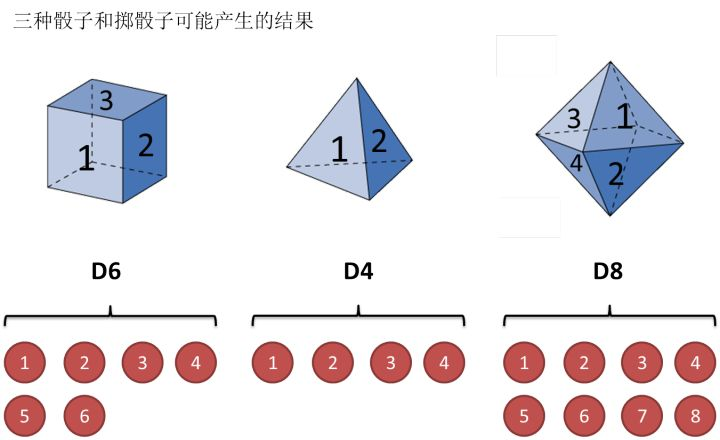

假设我们开始掷骰子，我们先从三个骰子里挑一个，挑到每一个骰子的概率都是1/3。然后我们掷骰子，得到一个数字，1，2，3，4，5，6，7，8中的一个。不停的重复上述过程，我们会得到一串数字，每个数字都是1，2，3，4，5，6，7，8中的一个。例如我们可能得到这么一串数字（掷骰子10次）：1 6 3 5 2 7 3 5 2 4

这串数字叫做可见状态链。但是在隐马尔可夫模型中，我们不仅仅有这么一串可见状态链，还有一串隐含状态链。在这个例子里，这串隐含状态链就是你用的骰子的序列。比如，隐含状态链有可能是：D6 D8 D8 D6 D4 D8 D6 D6 D4 D8

一般来说，HMM中说到的马尔可夫链其实是指隐含状态链，因为隐含状态（骰子）之间存在转换概率（transition probability）。在我们这个例子里，D6的下一个状态是D4，D6，D8的概率都是1/3。D4，D8的下一个状态是D4，D6，D8的转换概率也都一样是1/3。这样设定是为了最开始容易说清楚，但是我们其实是可以随意设定转换概率的。比如，我们可以这样定义，D6后面不能接D4，D6后面是D6的概率是0.9，是D8的概率是0.1。这样就是一个新的HMM。

同样的，尽管可见状态之间没有转换概率，但是隐含状态和可见状态之间有一个概率叫做输出概率（emission probability）。就我们的例子来说，六面骰（D6）产生1的输出概率是1/6。产生2，3，4，5，6的概率也都是1/6。我们同样可以对输出概率进行其他定义。比如，我有一个被赌场动过手脚的六面骰子，掷出来是1的概率更大，是1/2，掷出来是2，3，4，5，6的概率是1/10。

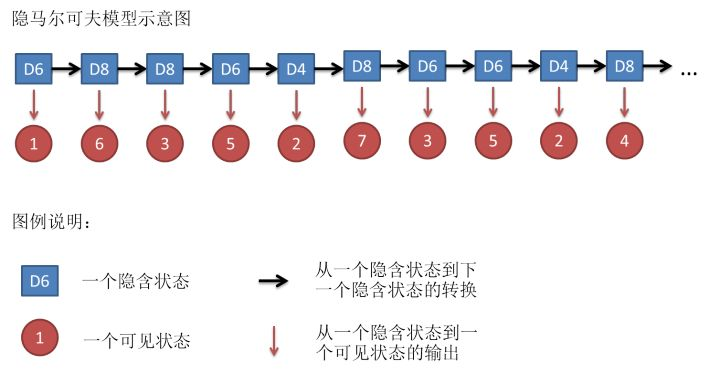

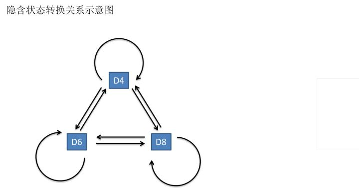

其实对于HMM来说，如果提前知道所有隐含状态之间的转换概率和所有隐含状态到所有可见状态之间的输出概率，做模拟是相当容易的。但是应用HMM模型时候呢，往往是缺失了一部分信息的，有时候你知道骰子有几种，每种骰子是什么，但是不知道掷出来的骰子序列；有时候你只是看到了很多次掷骰子的结果，剩下的什么都不知道。如果应用算法去估计这些缺失的信息，就成了一个很重要的问题。这些算法我会在下面详细讲。

×××××××××××××××××××××××××××××××××××××××××××××××××××××××××××××××××××××

如果你只想看一个简单易懂的例子，就不需要往下看了。

×××××××××××××××××××××××××××××××××××××××××××××××××××××××××××××××××××××

说两句废话，答主认为呢，要了解一个算法，要做到以下两点：会其意，知其形。答主回答的，其实主要是第一点。但是这一点呢，恰恰是最重要，而且很多书上不会讲的。正如你在追一个姑娘，姑娘对你说“你什么都没做错！”你要是只看姑娘的表达形式呢，认为自己什么都没做错，显然就理解错了。你要理会姑娘的意思，“你赶紧给我道歉！”这样当你看到对应的表达形式呢，赶紧认错，跪地求饶就对了。数学也是一样，你要是不理解意思，光看公式，往往一头雾水。不过呢，数学的表达顶多也就是晦涩了点，姑娘的表达呢，有的时候就完全和本意相反。所以答主一直认为理解姑娘比理解数学难多了。

回到正题，和HMM模型相关的算法主要分为三类，分别解决三种问题：

**1）知道骰子有几种（隐含状态数量），每种骰子是什么（转换概率），根据掷骰子掷出的结果（可见状态链），我想知道每次掷出来的都是哪种骰子（隐含状态链）**。

这个问题呢，在语音识别领域呢，叫做解码问题。这个问题其实有两种解法，会给出两个不同的答案。每个答案都对，只不过这些答案的意义不一样。第一种解法求最大似然状态路径，说通俗点呢，就是我求一串骰子序列，这串骰子序列产生观测结果的概率最大。第二种解法呢，就不是求一组骰子序列了，而是求每次掷出的骰子分别是某种骰子的概率。比如说我看到结果后，我可以求得第一次掷骰子是D4的概率是0.5，D6的概率是0.3，D8的概率是0.2.第一种解法我会在下面说到，但是第二种解法我就不写在这里了，如果大家有兴趣，我们另开一个问题继续写吧。

**2）还是知道骰子有几种（隐含状态数量），每种骰子是什么（转换概率），根据掷骰子掷出的结果（可见状态链），我想知道掷出这个结果的概率**。

看似这个问题意义不大，因为你掷出来的结果很多时候都对应了一个比较大的概率。问这个问题的目的呢，其实是检测观察到的结果和已知的模型是否吻合。如果很多次结果都对应了比较小的概率，那么就说明我们已知的模型很有可能是错的，有人偷偷把我们的骰子給换了。

**3）知道骰子有几种（隐含状态数量），不知道每种骰子是什么（转换概率），观测到很多次掷骰子的结果（可见状态链），我想反推出每种骰子是什么（转换概率）**。

这个问题很重要，因为这是最常见的情况。很多时候我们只有可见结果，不知道HMM模型里的参数，我们需要从可见结果估计出这些参数，这是建模的一个必要步骤。

问题阐述完了，下面就开始说解法。（0号问题在上面没有提，只是作为解决上述问题的一个辅助）

0.一个简单问题

其实这个问题实用价值不高。由于对下面较难的问题有帮助，所以先在这里提一下。

知道骰子有几种，每种骰子是什么，每次掷的都是什么骰子，根据掷骰子掷出的结果，求产生这个结果的概率。

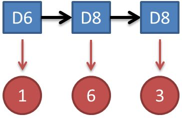

解法无非就是概率相乘：

$P=P(D6)*P(D6\rightarrow 1)*P(D6\rightarrow D8)*P(D8\rightarrow 6)*P(D8\rightarrow D8)*P(D8\rightarrow 3)$

$=\frac{1}{3} *\frac{1}{6} *\frac{1}{3} *\frac{1}{8} *\frac{1}{3} *\frac{1}{8} $

**1.看见不可见的，破解骰子序列**

这里我说的是第一种解法，解最大似然路径问题。

举例来说，我知道我有三个骰子，六面骰，四面骰，八面骰。我也知道我掷了十次的结果（1 6 3 5 2 7 3 5 2 4），我不知道每次用了那种骰子，我想知道最有可能的骰子序列。

其实最简单而暴力的方法就是穷举所有可能的骰子序列，然后依照第零个问题的解法把每个序列对应的概率算出来。然后我们从里面把对应最大概率的序列挑出来就行了。如果马尔可夫链不长，当然可行。如果长的话，穷举的数量太大，就很难完成了。

另外一种很有名的算法叫做Viterbi algorithm. 要理解这个算法，我们先看几个简单的列子。

首先，如果我们只掷一次骰子：

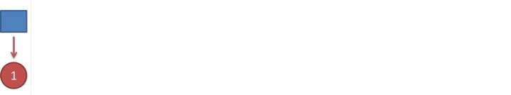

看到结果为1.对应的最大概率骰子序列就是D4，因为D4产生1的概率是1/4，高于1/6和1/8.

把这个情况拓展，我们掷两次骰子：

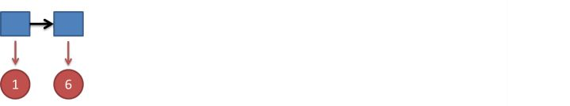

结果为1，6.这时问题变得复杂起来，我们要计算三个值，分别是第二个骰子是D6，D4，D8的最大概率。显然，要取到最大概率，第一个骰子必须为D4。这时，第二个骰子取到D6的最大概率是

$P2(D6)=P(D4)*P(D4\rightarrow 1)*P(D4\rightarrow D6)*P(D6\rightarrow 6)$

$=\frac{1}{3} *\frac{1}{4} *\frac{1}{3} *\frac{1}{6}$

同样的，我们可以计算第二个骰子是D4或D8时的最大概率。我们发现，第二个骰子取到D6的概率最大。而使这个概率最大时，第一个骰子为D4。所以最大概率骰子序列就是D4 D6。

继续拓展，我们掷三次骰子：

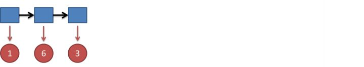

同样，我们计算第三个骰子分别是D6，D4，D8的最大概率。我们再次发现，要取到最大概率，第二个骰子必须为D6。这时，第三个骰子取到D4的最大概率是$P3(D4)=P2(D6)*P(D6\rightarrow D4)*P(D4\rightarrow 3)$

$=\frac{1}{216} *\frac{1}{3} *\frac{1}{4}$

同上，我们可以计算第三个骰子是D6或D8时的最大概率。我们发现，第三个骰子取到D4的概率最大。而使这个概率最大时，第二个骰子为D6，第一个骰子为D4。所以最大概率骰子序列就是D4 D6 D4。

写到这里，大家应该看出点规律了。既然掷骰子一二三次可以算，掷多少次都可以以此类推。我们发现，我们要求最大概率骰子序列时要做这么几件事情。首先，不管序列多长，要从序列长度为1算起，算序列长度为1时取到每个骰子的最大概率。然后，逐渐增加长度，每增加一次长度，重新算一遍在这个长度下最后一个位置取到每个骰子的最大概率。因为上一个长度下的取到每个骰子的最大概率都算过了，重新计算的话其实不难。当我们算到最后一位时，就知道最后一位是哪个骰子的概率最大了。然后，我们要把对应这个最大概率的序列从后往前推出来。

**2.谁动了我的骰子？**

比如说你怀疑自己的六面骰被赌场动过手脚了，有可能被换成另一种六面骰，这种六面骰掷出来是1的概率更大，是1/2，掷出来是2，3，4，5，6的概率是1/10。你怎么办么？答案很简单，算一算正常的三个骰子掷出一段序列的概率，再算一算不正常的六面骰和另外两个正常骰子掷出这段序列的概率。如果前者比后者小，你就要小心了。

比如说掷骰子的结果是：

要算用正常的三个骰子掷出这个结果的概率，其实就是将所有可能情况的概率进行加和计算。同样，简单而暴力的方法就是把穷举所有的骰子序列，还是计算每个骰子序列对应的概率，但是这回，我们不挑最大值了，而是把所有算出来的概率相加，得到的总概率就是我们要求的结果。这个方法依然不能应用于太长的骰子序列（马尔可夫链）。

我们会应用一个和前一个问题类似的解法，只不过前一个问题关心的是概率最大值，这个问题关心的是概率之和。解决这个问题的算法叫做前向算法（forward algorithm）。

首先，如果我们只掷一次骰子：

看到结果为1.产生这个结果的总概率可以按照如下计算，总概率为0.18：

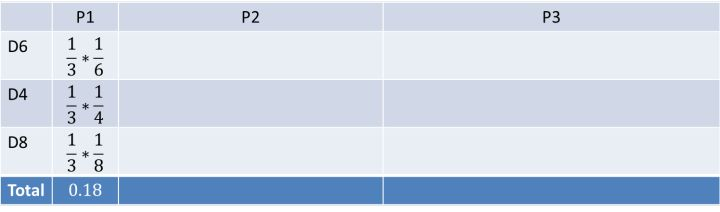

把这个情况拓展，我们掷两次骰子：

看到结果为1，6.产生这个结果的总概率可以按照如下计算，总概率为0.05：

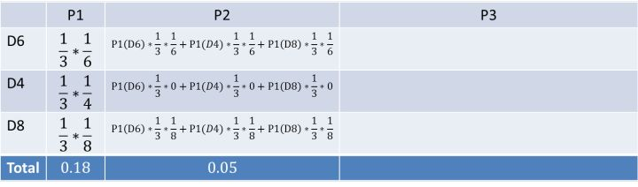

继续拓展，我们掷三次骰子：

看到结果为1，6，3.产生这个结果的总概率可以按照如下计算，总概率为0.03：

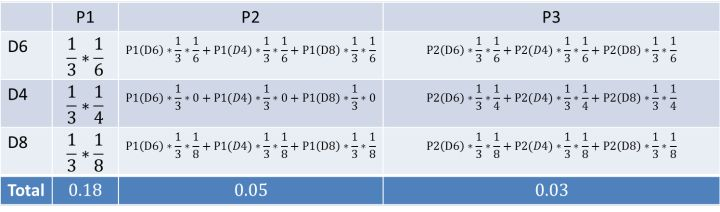

同样的，我们一步一步的算，有多长算多长，再长的马尔可夫链总能算出来的。用同样的方法，也可以算出不正常的六面骰和另外两个正常骰子掷出这段序列的概率，然后我们比较一下这两个概率大小，就能知道你的骰子是不是被人换了。

**3.掷一串骰子出来，让我猜猜你是谁**

**（答主很懒，还没写，会写一下EM这个号称算法的方法）**

上述算法呢，其实用到了递归，逆向推导，循环这些方法，我只不过用很直白的语言写出来了。如果你们去看专业书籍呢，会发现更加严谨和专业的描述。毕竟，我只做了会其意，要知其形，还是要看书的。

## 解释二

摘自我的博客[http://blog.csdn.net/ppn029012](http://blog.csdn.net/ppn029012 "http://blog.csdn.net/ppn029012")

### 1. 赌场风云(背景介绍)

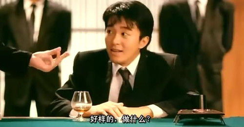

最近一个赌场的老板发现生意不畅，于是派出手下去赌场张望。经探子回报，有位大叔在赌场中总能赢到钱，玩得一手好**骰子**，几乎是战无不胜。而且每次玩骰子的时候周围都有几个保镖站在身边，让人不明就里，只能看到每次开局，骰子飞出，沉稳落地。老板根据多年的经验，推测这位不善之客使用的正是江湖失传多年的"偷换骰子大法”(编者注:**偷换骰子大法，用兜里自带的骰子偷偷换掉均匀的骰子**)。老板是个冷静的人，看这位大叔也不是善者，不想轻易得罪他，又不想让他坏了规矩。正愁上心头，这时候进来一位名叫HMM帅哥，告诉老板他有一个很好的解决方案。

不用近其身，只要在远处装个摄像头，把每局的骰子的点数都记录下来。

然后HMM帅哥将会运用其强大的数学内力，用这些数据推导出

1. 该大叔是不是在出千?

2. 如果是在出千，那么他用了几个作弊的骰子?　还有当前是不是在用作弊的骰子。

3. 这几个作弊骰子出现各点的概率是多少?

天呐，老板一听，这位叫HMM的甚至都不用近身，就能算出是不是在作弊，甚至都能算出别人作弊的骰子是什么样的。那么，只要再当他作弊时，派人围捕他，当场验证骰子就能让他哑口无言。

### 2. HMM是何许人也?

在让HMM开展调查活动之前，该赌场老板也对HMM作了一番调查。

HMM(Hidden Markov Model), 也称隐性马尔可夫模型，是一个概率模型，用来描述一个系统**隐性状态**的转移和**隐性状态**的表现概率。

**系统的隐性状态**指的就是一些外界不便观察(或观察不到)的状态,
 比如在当前的例子里面, 系统的状态指的是大叔使用骰子的状态，即

{正常骰子, 作弊骰子1, 作弊骰子2,...}

**隐性状态的表现**也就是,
 可以观察到的，由隐性状态产生的外在表现特点。这里就是说, 骰子掷出的点数.

{1,2,3,4,5,6}

HMM模型将会描述，系统**隐性状态的转移概率**。也就是大叔切换骰子的概率,下图是一个例子，这时候大叔切换骰子的可能性被描述得淋漓尽致。

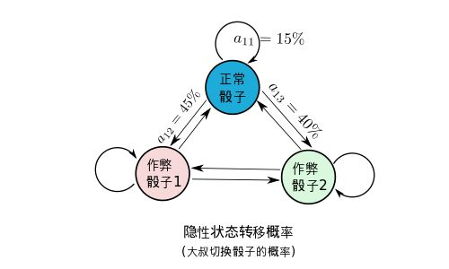

很幸运的，这么复杂的概率转移图，竟然能用简单的矩阵表达, 其中a_{ij}代表的是从i状态到j状态发生的概率

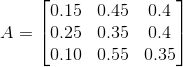

当然同时也会有，**隐性状态表现转移**概率。也就是骰子出现各点的概率分布,
 (e.g. 作弊骰子1能有90%的机会掷到六，作弊骰子2有85%的机会掷到'小’). 给个图如下,

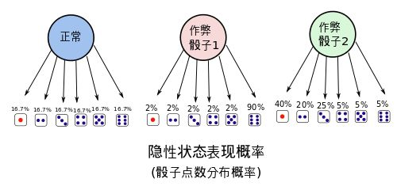

隐性状态的表现分布概率也可以用矩阵表示出来，

把这两个东西总结起来，就是整个HMM模型。

这个模型描述了隐性状态的转换的概率，同时也描述了每个状态外在表现的概率的分布。总之，HMM模型就能够描述扔骰子大叔作弊的频率(骰子更换的概率)，和大叔用的骰子的概率分布。有了大叔的HMM模型，就能把大叔看透，让他完全在阳光下现形。

### 3. HMM能干什么!

总结起来HMM能处理三个问题，

#### 3.1 解码(Decoding)

解码就是需要从一连串的骰子中，看出来哪一些骰子是用了作弊的骰子，哪些是用的正常的骰子。

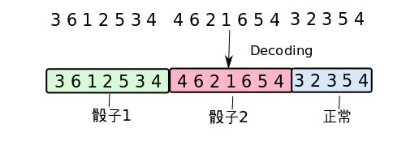

比如上图中，给出一串骰子序列(3,6,1,2..)和大叔的HMM模型, 我们想要计算哪一些骰子的结果(隐性状态表现)可能对是哪种骰子的结果(隐性状态).

#### 3.2学习(Learning)

学习就是，从一连串的骰子中，学习到大叔切换骰子的概率，当然也有这些骰子的点数的分布概率。这是HMM最为**恐怖**也最为**复杂**的招数！！

#### 3.3 估计(Evaluation)

估计说的是，在我们**已经知道**了该大叔的HMM模型的情况下，估测某串骰子出现的可能性概率。比如说，在我们已经知道大叔的HMM模型的情况下，我们就能直接估测到大叔扔到10个6或者8个1的概率。

### 4. HMM是怎么做到的?

#### 4.1 估计

估计是最容易的一招，在完全知道了大叔的HMM模型的情况下，我们很容易就能对其做出估计。

现在我们有了大叔的状态转移概率矩阵A,B就能够进行估计。比如我们想知道这位大叔下一局连续掷出10个6的概率是多少? 如下

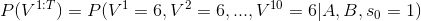

这表示的是，在一开始隐性状态(s0)为1，也就是一开始拿着的是**正常的骰子**的情况下，这位大叔连续掷出10个6的概率。

现在问题难就难在，我们虽然知道了HMM的转换概率，和观察到的状态V{1:T}, 但是我们却不知道实际的隐性的状态变化。

好吧，我们不知道隐性状态的变化，那好吧，我们就先**假设**一个**隐性状态序列**,
 假设大叔前5个用的是正常骰子, 后5个用的是作弊骰子1.

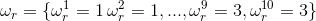

好了，那么我们可以计算，在这种隐性序列假设下掷出10个6的概率.

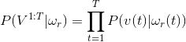

这个概率其实就是，隐性状态表现概率B的乘积.

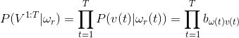

但是问题又出现了，刚才那个隐性状态序列是我假设的，而实际的序列我不知道，这该怎么办。好办，把**所有可能出现**的隐状态序列组合全都试一遍就可以了。于是,

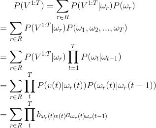

R就是所有可能的隐性状态序列的集合。的嗯，现在问题好像解决了，我们已经能够通过尝试所有组合来获得出现的概率值，并且可以通过A,B矩阵来计算出现的总概率。

但是问题又出现了，可能的集合太大了, 比如有三种骰子，有10次选择机会, 那么总共的组合会有3^10次...这个量级O(c^T)太大了，当问题再大一点时候，组合的数目就会大得超出了计算的可能。所以我们需要一种更有效的计算P(V(1:T)概率的方法。

比如说如下图的算法可以将计算P(V1:T)的计算复杂度降低至O(cT).

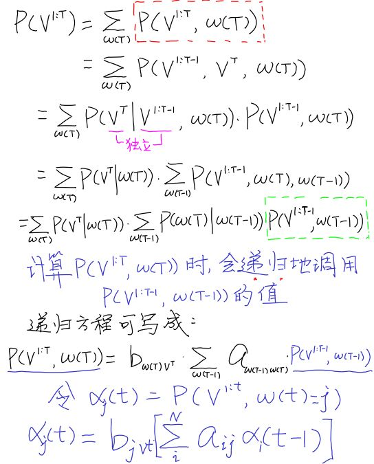

有了这个方程，我们就能从t=0的情况往前推导，一直推导出P(V1:T)的概率。下面让我们算一算，大叔掷出3,2,1这个骰子序列的可能性有多大(假设初始状态为1, 也就是大叔前一次拿着的是正常的骰子)?

#### 4.2 解码(Decoding)

解码的过程就是在给出一串序列的情况下和已知HMM模型的情况下，找到最可能的隐性状态序列。

用数学公式表示就是,
 (V是Visible可见序列, w是隐性状态序列, A,B是HMM状态转移概率矩阵)

(公式太多，请具体看我博客中的推导[机器学习 --- 4. 大内密探HMM(隐马尔可夫)围捕赌场老千](http://blog.csdn.net/ppn029012/article/details/8923501 "机器学习 --- 4. 大内密探HMM(隐马尔可夫)围捕赌场老千"))

然后又可以使用**估计(4.1)**中的**前向推导法**，计算出最大的P(w(1:T),
 V(1:T)).

在完成前向推导法之后，再使用**后向追踪法**(Back
 Tracking)，对求解出能令这个P(w(1:T), V(1:T))最大的隐性序列.这个算法被称为维特比算法(Viterbi Algorithm).

#### 4.3 学习(Learning)

学习是在给出HMM的结构的情况下(比如说假设已经知道该大叔有3只骰子，每只骰子有6面),计算出最有可能的模型参数.

(公式太多，请具体看我博客中的推导[机器学习 --- 4. 大内密探HMM(隐马尔可夫)围捕赌场老千](http://blog.csdn.net/ppn029012/article/details/8923501 "机器学习 --- 4. 大内密探HMM(隐马尔可夫)围捕赌场老千"))

### 5. HMM 的应用

以上举的例子是用HMM对掷骰子进行建模与分析。当然还有很多HMM经典的应用，能根据不同的应用需求，对问题进行建模。

但是使用HMM进行建模的问题，必须满足以下条件,

1.**隐性状态的转移**必须满足马尔可夫性。(状态转移的马尔可夫性:一个状态只与前一个状态有关)

2. 隐性状态必须能够大概被估计。

在满足条件的情况下,确定问题中的**隐性状态是什么**,隐性状态的**表现**可能又有哪些.

HMM适用于的问题在于，真正的状态(隐态)难以被估计，而状态与状态之间又存在联系。

#### 5.1 语音识别

语音识别问题就是将一段**语音信号**转换为**文字序列**的过程.
 在个问题里面

隐性状态就是: 语音信号对应的文字序列

而显性的状态就是: 语音信号.

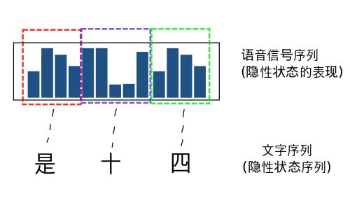

HMM模型的学习(Learning): 语音识别的模型学习和上文中通过观察骰子序列建立起一个最有可能的模型**不同**.　语音识别的HMM模型学习有两个步骤:

1. 统计文字的发音概率,建立隐性表现概率矩阵Ｂ

2. 统计字词之间的转换概率(这个步骤并不需要考虑到语音,可以直接统计字词之间的转移概率即可)

语音模型的估计(Evaluation): 计算"是十四”,"四十四"等等的概率,比较得出最有可能出现的文字序列.

#### 5.2 手写识别

这是一个和语音差不多,只不过手写识别的过程是将字的图像当成了显性序列.

#### 5.3 中文分词

“总所周知，在汉语中，词与词之间不存在分隔符（英文中，词与词之间用空格分隔，这是天然的分词标记），词本身也缺乏明显的形态标记，因此，中文信息处理的特有问题就是如何将汉语的字串分割为合理的词语序。例如，英文句子：you
 should go to kindergarten now 天然的空格已然将词分好，只需要去除其中的介词“to”即可；而“你现在应该去幼儿园了”这句表达同样意思的话没有明显的分隔符，中文分词的目的是，得到“你/现在/应该/去/幼儿园/了”。那么如何进行分词呢？主流的方法有三种：第1类是基于语言学知识的规则方法，如：各种形态的最大匹配、最少切分方法；第2类是基于大规模语料库的机器学习方法，这是目前应用比较广泛、效果较好的解决方案．用到的统计模型有N元语言模型、信道—噪声模型、最大期望、HMM等。第3类也是实际的分词系统中用到的，即规则与统计等多类方法的综合。”[1][使用HMM进行中文分词.](http://www.52nlp.cn/itenyh%E7%89%88-%E7%94%A8hmm%E5%81%9A%E4%B8%AD%E6%96%87%E5%88%86%E8%AF%8D%E4%B8%80%EF%BC%9A%E5%BA%8F "使用HMM进行中文分词.")

5.4 HMM实现拼音输入法

拼音输入法,是一个估测拼音字母对应想要输入的文字(隐性状态)的过程(比如, ‘pingyin’ -> 拼音)

[使用HMM实现简单拼音输入法](http://www.sobuhu.com/archives/1008 "使用HMM实现简单拼音输入法")

### 参考:

[http://ai.stanford.edu/~serafim/CS262_2007/notes/lecture5.pdf](http://ai.stanford.edu/~serafim/CS262_2007/notes/lecture5.pdf "http://ai.stanford.edu/~serafim/CS262_2007/notes/lecture5.pdf")

