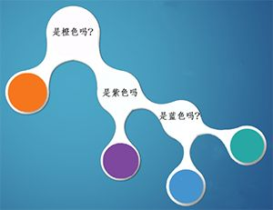

# 通俗地解释信息熵、交叉熵与相对熵

## 解释一
这个解释的十分好，通俗易懂。来自知乎一个问答：
'https://www.zhihu.com/question/41252833'

讨论这个问题需要从香农的信息熵开始。

小明在学校玩王者荣耀被发现了，爸爸被叫去开家长会，心里悲屈的很，就想法子惩罚小明。到家后，爸爸跟小明说：既然你犯错了，就要接受惩罚，但惩罚的程度就看你聪不聪明了。这样吧，我们俩玩猜球游戏，我拿一个球，你猜球的颜色，我可以回答你任何问题，你每猜一次，不管对错，你就一个星期不能玩王者荣耀，当然，猜对，游戏停止，否则继续猜。**当然，当答案只剩下两种选择时，此次猜测结束后，无论猜对猜错都能100%确定答案，无需再猜一次，此时游戏停止（因为好多人对策略１的结果有疑问，所以请注意这个条件）**。

题目1：爸爸拿来一个箱子，跟小明说：里面有橙、紫、蓝及青四种颜色的小球任意个，各颜色小球的占比不清楚，现在我从中拿出一个小球，你猜我手中的小球是什么颜色？

为了使被罚时间最短，小明发挥出最强王者的智商，瞬间就想到了以最小的代价猜出答案，简称策略1，小明的想法是这样的。

在这种情况下，小明什么信息都不知道，只能认为四种颜色的小球出现的概率是一样的。所以，根据策略1，1/4概率是橙色球，小明需要猜两次，1/4是紫色球，小明需要猜两次，其余的小球类似，所以小明预期的猜球次数为：

H = 1/4 * 2 + 1/4 * 2 + 1/4 * 2 + 1/4 * 2 = 2

题目2：爸爸还是拿来一个箱子，跟小明说：箱子里面有小球任意个，但其中1/2是橙色球，1/4是紫色球，1/8是蓝色球及1/8是青色球。我从中拿出一个球，你猜我手中的球是什么颜色的？

小明毕竟是最强王者，仍然很快得想到了答案，简称策略2，他的答案是这样的。

在这种情况下，小明知道了每种颜色小球的比例，比如橙色占比二分之一，如果我猜橙色，很有可能第一次就猜中了。所以，根据策略2，1/2的概率是橙色球，小明需要猜一次，1/4的概率是紫色球，小明需要猜两次，1/8的概率是蓝色球，小明需要猜三次，1/8的概率是青色球，小明需要猜三次，所以小明猜题次数的期望为：

H = 1/2 * 1 + 1/4 * 2 + 1/8 * 3 + 1/8 * 3=  1.75

题目3：其实，爸爸只想让小明意识到自己的错误，并不是真的想罚他，所以拿来一个箱子，跟小明说：里面的球都是橙色，现在我从中拿出一个，你猜我手中的球是什么颜色？

最强王者怎么可能不知道，肯定是橙色，小明需要猜0次。

上面三个题目表现出这样一种现象：针对特定概率为p的小球，需要猜球的次数 = $\log_2 \frac{1}{p}$ ，例如题目2中，1/4是紫色球， $\log_2 4$  = 2 次；1/8是蓝色球， $\log_2 8$  = 3次，这叫做一个事件得自信息（self-information）。那么，针对整个系统，有多种可能发生的事件，预期的猜题次数为: $\sum_{k=1}^N p_k \log_2 \frac{1}{p_k}$ ，这就是**信息熵**，上面三个题目的预期猜球次数都是由这个公式计算而来，第一题的信息熵为2，第二题的信息熵为1.75，最三题的信息熵为1 *$\log 1$ = 0 。

当然，信息量和信息熵都有着严格的定义，这边简单介绍下。在信息论中，信息量，或者叫自信息（self-information）,其代表一个事件所能够提供信息的多少，具体计算方式为: $I(x)=-\log {P(x)}$ 。其是基于这样的想法进行信息量化的，一个不太可能发生的事件发生了，要比一个非常可能发生的事件提供更多的信息(概率小，log值高)。但是，自信息只能衡量单个事件的信息量，而整个系统呈现的是一个分布（例如题目一的分布就是1/4，1/4，1/4，1/4），因此在信息论中，使用信息熵来对概率分布进行量化，即 $H(X)=E_{X \sim P}\left[ I\left( x \right) \right] = - E_{X \sim P}\left[ P\left( x \right) \right]$

那么信息熵代表着什么含义呢？

**信息熵代表的是随机变量或整个系统的不确定性，熵越大，随机变量或系统的不确定性就越大**。上面题目1的熵 > 题目2的熵 > 题目3的熵。在题目1中，小明对整个系统一无所知，只能假设所有的情况出现的概率都是均等的，此时的熵是最大的。题目2中，小明知道了橙色小球出现的概率是1/2及其他小球各自出现的概率，说明小明对这个系统有一定的了解，所以系统的不确定性自然会降低，所以熵小于2。题目3中，小明已经知道箱子中肯定是橙色球，爸爸手中的球肯定是橙色的，因而整个系统的不确定性为0，也就是熵为0。所以，在什么都不知道的情况下，熵会最大，针对上面的题目1~~题目3，这个最大值是2，除此之外，其余的任何一种情况，熵都会比2小。

所以，每一个系统都会有一个真实的概率分布，也叫真实分布，题目1的真实分布为（1/4，1/4，1/4，1/4），题目2的真实分布为（1/2，1/4，1/8，1/8），而**根据真实分布，我们能够找到一个最优策略，以最小的代价消除系统的不确定性**，**而这个代价大小就是信息熵，记住，信息熵衡量了系统的不确定性，而我们要消除这个不确定性，所要付出的【最小努力】（猜题次数、编码长度等）的大小就是信息熵**。具体来讲，题目1只需要猜两次就能确定任何一个小球的颜色，题目2只需要猜测1.75次就能确定任何一个小球的颜色。

现在回到题目2，假设小明只是钻石段位而已，智商没王者那么高，他使用了策略1，即

爸爸已经告诉小明这些小球的真实分布是（1/2，1/4, 1/8，1/8），但小明所选择的策略却认为所有的小球出现的概率相同，相当于忽略了爸爸告诉小明关于箱子中各小球的真实分布，而仍旧认为所有小球出现的概率是一样的，认为小球的分布为（1/4，1/4，1/4，1/4），这个分布就是**非真实分布**。此时，小明猜中任何一种颜色的小球都需要猜两次，即1/2 * 2 + 1/4 * 2 + 1/8 * 2 + 1/8 * 2 = 2。

很明显，针对题目2，使用策略1是一个坏的选择，因为需要猜题的次数增加了，从1.75变成了2。因此，当我们知道根据系统的真实分布制定最优策略去消除系统的不确定性时，我们所付出的努力是最小的，但并不是每个人都和最强王者一样聪明，我们也许会使用其他的策略（非真实分布）去消除系统的不确定性，就好比如我将策略1用于题目2（原来这就是我在白银的原因），那么，当我们使用非最优策略消除系统的不确定性，所需要付出的努力的大小我们该如何去衡量呢？

这就需要引入**交叉熵，其用来衡量在给定的真实分布下，使用非真实分布所指定的策略消除系统的不确定性所需要付出的努力的大小**。

正式的讲，交叉熵的公式为： $\sum_{k=1}^N p_k \log_2 \frac{1}{q_k}$ ，其中 $p_k$ 表示真实分布， $q_k$ 表示非真实分布。例如上面所讲的将策略1用于题目2，真实分布 $p_k = (\frac {1}{2},\frac {1}{4},\frac {1}{8},\frac {1}{8})$ ， 非真实分布 $q_k = (\frac {1}{4},\frac {1}{4},\frac {1}{4},\frac {1}{4})$ ，交叉熵为 $\frac{1}{2} * \log_2 4 + \frac{1}{4} * \log_2 4 + \frac{1}{8} * \log_2 4 + \frac{1}{8} * \log_2 4 = 2$  ，比最优策略的1.75来得大。

因此，交叉熵越低，这个策略就越好，最低的交叉熵也就是使用了真实分布所计算出来的信息熵，因为此时 $p_k = q_k$ ，交叉熵 = 信息熵。这也是为什么在机器学习中的分类算法中，我们总是最小化交叉熵，因为交叉熵越低，就证明由算法所产生的策略最接近最优策略，也间接证明我们算法所算出的非真实分布越接近真实分布。

最后，我们如何去衡量不同策略之间的差异呢？这就需要用到**相对熵，其用来衡量两个取值为正的函数或概率分布之间的差异**，即：

KL(f(x) || g(x)) = $\sum_{ x \in X} f(x) * \log_2 \frac{f(x)}{g(x)}$

现在，假设我们想知道某个策略和最优策略之间的差异，我们就可以用相对熵来衡量这两者之间的差异。即，相对熵 = 某个策略的交叉熵 - 信息熵（根据系统真实分布计算而得的信息熵，为最优策略），公式如下：

KL（p || q） = H（p，q） - H（p） = $ \sum_{k=1}^N p_k \log_2 \frac{1}{q_k} - \sum_{k=1}^N p_k \log_2 \frac{1}{p_k} = \sum_{k=1}^N p_k \log_2 \frac{p_k}{q_k}$

所以将策略1用于题目2，所产生的相对熵为2 - 1.75 = 0.25.

参考：

《数学之美》吴军

[Information entropy](https://www.khanacademy.org/computing/computer-science/informationtheory/moderninfotheory/v/information-entropy "Information entropy")

还有，小明同学，我帮你分析得这么清楚，快带我上王者。

## 解释二
来自知乎一个问答：
'https://www.zhihu.com/question/41252833'

仅从机器学习的角度讨论这个问题。

**相对熵（relative entropy）** 就是KL散度（Kullback–Leibler divergence），用于衡量两个概率分布之间的差异。

对于两个概率分布$p(x)$和$q(x)$ ，其相对熵的计算公式为：
$$\tt KL\it(p\parallel q)=-\int p(x)\ln q(x) dx -(-\int p(x)\ln p(x) dx)$$

注意：由于$p(x)$ 和$q(x)$ 在公式中的地位不是相等的，所以$\tt KL \it(p\parallel q)\not\equiv \tt KL \it (q\parallel p)$.

相对熵的特点，是只有$p(x)=q(x)$ 时，其值为0。若$p(x)$ 和$q(x)$ 略有差异，其值就会大于0。其证明利用了负对数函数（$-\ln x$ ）是严格凸函数（strictly convex function）的性质。具体可以参考PRML 1.6.1 Relative entropy and mutual information.

相对熵公式的前半部分$-\int p(x)\ln q(x)dx$ 就是**交叉熵（cross entropy）**。

若$p(x)$ 是数据的真实概率分布，$q(x)$ 是由数据计算得到的概率分布。机器学习的目的就是希望$q(x)$尽可能地逼近甚至等于$p(x)$ ，从而使得相对熵接近最小值0. 由于真实的概率分布是固定的，相对熵公式的后半部分$(-\int p(x)\ln p(x) dx)$ 就成了一个常数。那么相对熵达到最小值的时候，也意味着交叉熵达到了最小值。对$q(x)$ 的优化就等效于求交叉熵的最小值。另外，对交叉熵求最小值，也等效于求最大似然估计（maximum likelihood estimation）。具体可以参考Deep Learning 5.5 Maximum Likelihood Estimation.

**通俗的结论**：  
  
* 1）信息熵：编码方案完美时，最短平均编码长度的是多少。    
* 2）交叉熵：编码方案不一定完美时（由于对概率分布的估计不一定正确），平均编码长度的是多少。平均编码长度 = 最短平均编码长度 + 一个增量    
* 3）相对熵：编码方案不一定完美时，平均编码长度相对于最小值的增加值。（即上面那个增量） 

