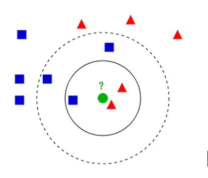
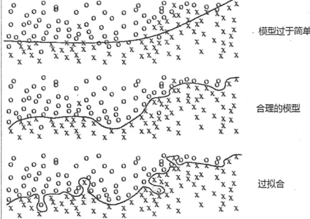
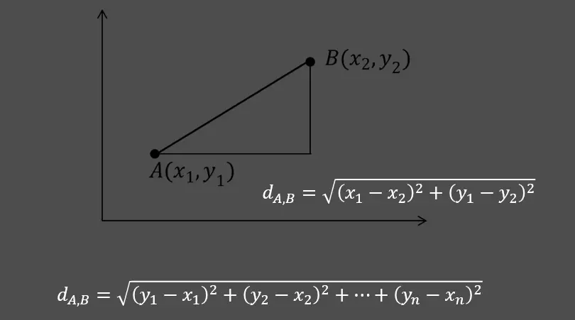
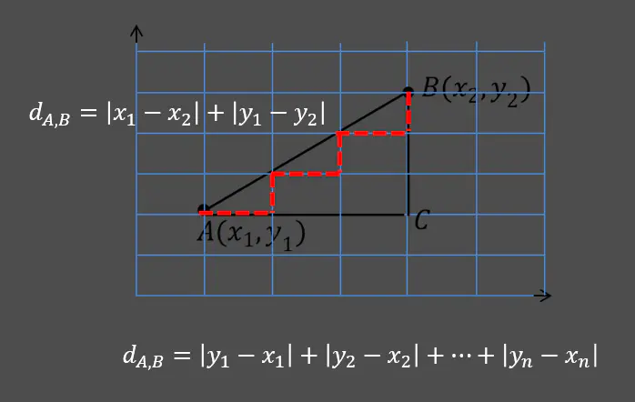
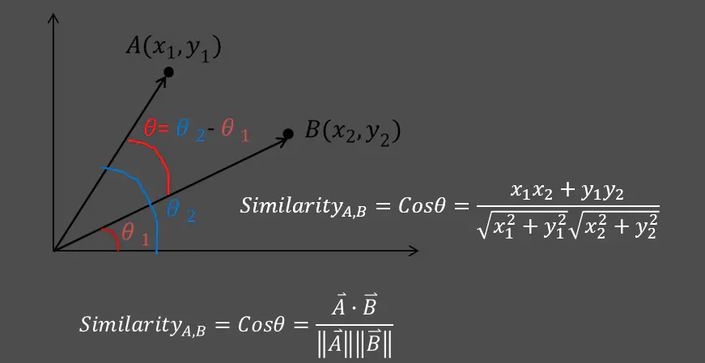
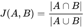
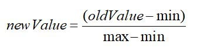

# kNN(K最近邻分类算法)
物以类聚，人以群分。

## KNN算法概述

K最近邻(**k-Nearest Neighbor，KNN**)分类算法，是一个理论上比较成熟的方法，也是最简单的机器学习算法之一，有监督算法。

KNN是一种分类(classification)算法，它输入基于实例的学习（instance-based learning），属于懒惰学习（lazy learning）即KNN没有显式的学习过程，也就是说没有训练阶段，数据集事先已有了分类和特征值，待收到新样本后直接进行处理。与急切学习（eager learning）相对应。

该方法的思路是：如果一个样本在特征空间中的k个最相似的样本中的大多数属于某一个类别，则该样本也属于这个类别。**KNN算法由你的邻居来推断出你的类别，KNN算法就是用距离来衡量样本之间的相似度**。KNN是通过测量不同特征值之间的距离进行分类。 

举个例子：

如果K = 3，绿色圆点的最近的3个邻居是2个红色小三角形和1个蓝色小正方形，少数从属于多数，基于统计的方法，判定绿色的这个待分类点属于红色的三角形一类。

如果K = 5，绿色圆点的最近的5个邻居是2个红色三角形和3个蓝色的正方形，还是少数从属于多数，基于统计的方法，判定绿色的这个待分类点属于蓝色的正方形一类。

## KNN算法步骤
KNN算法步骤：

1)	对于未知类别的数据（对象，点），计算已知类别数据集中的点到该点的距离。  
2)	按照距离由小到大排序  
3)	选取与当前点距离最小的K个点  
4)	确定前K个点所在类别出现的概率  
5)	返回当前K个点出现频率最高的类别作为当前点预测分类  

## k近邻法的三要素
距离度量、k值的选择及分类决策规则是k近邻法的三个基本要素。根据选择的距离度量（如曼哈顿距离或欧氏距离），可计算测试实例与训练集中的每个实例点的距离，根据k值选择k个最近邻点，最后根据分类决策规则将测试实例分类。

K值的选择一般低于样本数据的平方根,一般是不大于20的整数。距离度量常用的有欧式距离，曼哈顿距离，余弦距离等，**一般使用欧氏距离，对于文本分类，常用余弦距离**。**分类决策就是“少数服从多数”的策略**。

### k值的选择
k值的选择会对k近邻法的结果产生重大影响。在应用中，k值一般取一个比较小的数值，通常采用交叉验证法来选取最优的k值。

根据经验发现，不同的𝑘值对模型的预测准确性会有比较大的影响，如果𝑘值过于偏小，可能会导致模型的过拟合；反之，又可能会使模型进入欠拟合状态。

以芝麻分的例子来说，是选取你认识的所有人来推断你的信用呢还是选取经常和你有金钱或信息来往的人进行推断呢？

目前有两种K值选择方案：

* 第一种：设置k近邻样本的投票权重，假设读者在使用KNN算法进行分类或预测时设置的k值比较大，担心模型发生欠拟合的现象，一个简单有效的处理办法就是设置近邻样本的投票权重，如果已知样本距离未知样本比较远，则对应的权重就设置得低一些，否则权重就高一些，通常可以将权重设置为距离的倒数。

* 第二种：采用多重交叉验证法，该方法是目前比较流行的方案，其核心就是将k取不同的值，然后在每种值下执行m重的交叉验证，最后选出平均误差最小的k值。

### 样本间相似度的度量方法
#### 欧式距离

#### 曼哈顿距离

#### 余弦相似度

#### 杰卡德相似系数
杰卡德相似系数与余弦相似度经常被用于推荐算法，计算用户之间的相似性。例如，A用户购买了10件不同的商品，B用户购买了15件不同的商品，则两者之间的相似系数可以表示为：

其中，|A⋂B|表示两个用户所购买相同商品的数量，|A⋃B|代表两个用户购买所有产品的数量。例如，A用户购买的10件商品中有8件与B用户一致，且两个用户一共购买了17件不同的商品，则它们的杰卡德相似系数为8/17。

### 分类决策规则
k近邻法中的分类决策规则往往是多数表决，即由输入实例的k个邻近的训练实例中的多数类，决定输入实例的类。

### KNN的优缺点
优点：精度高、对异常值不敏感、无数据输入假定。

缺点：时间复杂度高、空间复杂度高。

### KNN的优点
1、KNN算法是一个非常简单的算法，理论成熟，思想简单，既可以用来做分类也可以用来做回归

2、天然解决多分类问题，也可用于回归问题

3、和朴素贝叶斯之类的算法比，对数据没有假设，准确度高，对异常点不敏感

4、KNN在训练过程中实质上不需要做任何事情，所以训练本身不产生任何时间上的消耗

5、由于KNN方法主要靠周围有限的邻近的样本，而不是靠判别类域的方法来确定所属类别的，因此对于类域的交叉或重叠较多的待分样本集来说，KNN方法较其他方法更为适合

### KNN的缺点
1、计算量大，效率低。即使优化算法，效率也不高。

2、高度数据相关，样本不平衡的时候，对稀有类别的预测准确率低

3、相比决策树模型，KNN模型可解释性不强

**KNN算法复杂度**：
KNN 分类的计算复杂度和训练集中的文档数目成正比，也就是说，如果训练集中文档总数为 n，那么 KNN 的分类时间复杂度为O(n) 

### 改进
1、当样本不平衡时，比如一个类的样本容量很大，其他类的样本容量很小，输入一个样本的时候，K个临近值中大多数都是大样本容量的那个类，这时可能就会导致分类错误。改进方法是对K临近点进行加权，也就是距离近的点的权值大，距离远的点权值小。 

2、计算量较大，每个待分类的样本都要计算它到全部点的距离，根据距离排序才能求得K个临近点，改进方法是：先对已知样本点进行剪辑，事先去除对分类作用不大的样本。

## KNN问题
该算法在分类时有个主要的不足是，当样本不平衡时，如一个类的样本容量很大，而其他类样本容量很小时，有可能导致当输入一个新样本时，该样本的 K 个邻居中大容量类的样本占多数。解决：可以采用权值的方法，根据和该样本距离的远近，对近邻进行加权，距离越小的邻居权值大，权重一般为距离平方的倒数。

## KNN数据归一化
为了防止某一维度的数据的数值大小对距离计算产生影响，保证多个维度的特征是等权重的，最终结果不能被数值的大小影响，应该将各个维度进行数据的归一化，把数据归一化到[0,1]区间上。使用标准化也是可以的。

归一化公式：  
newValue=((oldValue-min⁡))/(max⁡- min)

