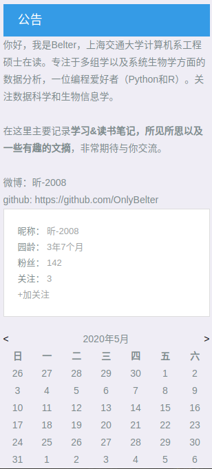

这个文件下线性回归的笔记摘抄自博客园的Belter(博客园昵称：昕-2008)。

`https://www.cnblogs.com/Belter`

作者的简介：
```
你好，我是Belter，上海交通大学计算机系工程硕士在读。专注于多组学以及系统生物学方面的数据分析，一位编程爱好者（Python和R）。关注数据科学和生物信息学。

在这里主要记录学习&读书笔记，所见所思以及一些有趣的文摘，非常期待与你交流。

微博：昕-2008
github: https://github.com/OnlyBelter

昵称： 昕-2008 
园龄： 3年7个月 
粉丝： 142 
关注： 3
```


