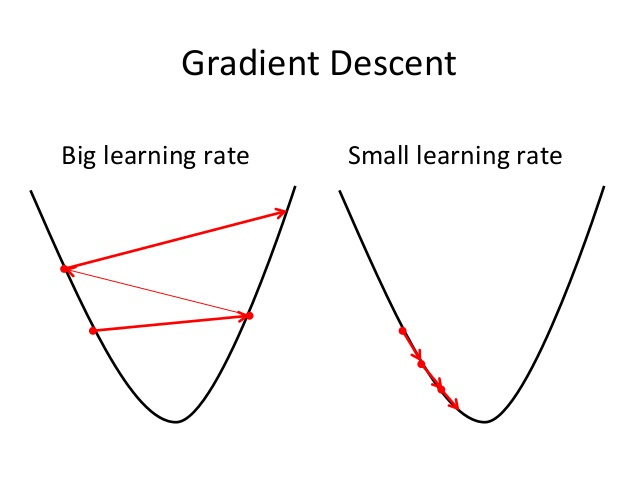

# 一般线性回归
摘抄自:
`https://www.cnblogs.com/Belter/p/8487002.html`

<link rel="stylesheet" type="text/css" href="assets/base.css">


<div id="cnblogs_post_body" class="blogpost-body ">
    <p><span style="color: #000000; background-color: #ff9900;">注</span>：对于最重要的两类回归模型，之前总结了<a href="http://www.cnblogs.com/Belter/p/6128644.html" target="_blank">逻辑回归</a>模型，这里总结一下"线性回归"模型。</p>
<p>&nbsp;</p>
<h2><span style="color: #99cc00;">0. 概述</span></h2>
<hr>
<p>线性回归应该是我们听过次数最多的机器学习算法了。在一般的统计学教科书中，最后都会提到这种方法。因此该算法也算是架起了数理统计与机器学习之间的桥梁。线性回归虽然常见，但是却并不简单。该算法中几乎包含了所有有监督机器学习算法的重要知识点，比如数据的表示、参数的训练、模型的评价、利用正则化防止过拟合等概念。所以说如果掌握了线性回归，可以为后面的学习打下坚实的基础。</p>
<p>&nbsp;</p>
<h2><span style="color: #99cc00;">1. 线性回归的基本形式</span></h2>
<hr>
<p>最简单的线性回归就是直接利用一条直线拟合二维平面上的一系列点，目的是利用这条直线概括所有训练集中样本的散布规律或趋势，最终用于新样本点的预测。二维平面上直线方程的一般形式为<span class="MathJax_Preview" style="color: inherit;"></span><span class="MathJax" id="MathJax-Element-1-Frame" tabindex="0" data-mathml="<math xmlns=&quot;http://www.w3.org/1998/Math/MathML&quot;><mi>y</mi><mo>=</mo><mi>a</mi><mi>x</mi><mo>+</mo><mi>b</mi></math>" role="presentation" style="position: relative;"><nobr aria-hidden="true"><span class="math" id="MathJax-Span-1" style="width: 5.682em; display: inline-block;"><span style="display: inline-block; position: relative; width: 4.628em; height: 0px; font-size: 122%;"><span style="position: absolute; clip: rect(1.291em, 1004.63em, 2.579em, -999.997em); top: -2.163em; left: 0em;"><span class="mrow" id="MathJax-Span-2"><span class="mi" id="MathJax-Span-3" style="font-family: MathJax_Math-italic;">y<span style="display: inline-block; overflow: hidden; height: 1px; width: 0.003em;"></span></span><span class="mo" id="MathJax-Span-4" style="font-family: MathJax_Main; padding-left: 0.296em;">=</span><span class="mi" id="MathJax-Span-5" style="font-family: MathJax_Math-italic; padding-left: 0.296em;">a</span><span class="mi" id="MathJax-Span-6" style="font-family: MathJax_Math-italic;">x</span><span class="mo" id="MathJax-Span-7" style="font-family: MathJax_Main; padding-left: 0.237em;">+</span><span class="mi" id="MathJax-Span-8" style="font-family: MathJax_Math-italic; padding-left: 0.237em;">b</span></span><span style="display: inline-block; width: 0px; height: 2.169em;"></span></span></span><span style="display: inline-block; overflow: hidden; vertical-align: -0.354em; border-left: 0px solid; width: 0px; height: 1.218em;"></span></span></nobr><span class="MJX_Assistive_MathML" role="presentation"><math xmlns="http://www.w3.org/1998/Math/MathML"><mi>y</mi><mo>=</mo><mi>a</mi><mi>x</mi><mo>+</mo><mi>b</mi></math></span></span><script type="math/tex" id="MathJax-Element-1">y = ax + b</script>，使用训练集中的数据以某种方式训练该模型后，就可以确定方程中的两个参数<span class="MathJax_Preview" style="color: inherit;"></span><span class="MathJax" id="MathJax-Element-2-Frame" tabindex="0" data-mathml="<math xmlns=&quot;http://www.w3.org/1998/Math/MathML&quot;><mi>a</mi><mo>,</mo><mi>b</mi></math>" role="presentation" style="position: relative;"><nobr aria-hidden="true"><span class="math" id="MathJax-Span-9" style="width: 1.759em; display: inline-block;"><span style="display: inline-block; position: relative; width: 1.408em; height: 0px; font-size: 122%;"><span style="position: absolute; clip: rect(1.291em, 1001.41em, 2.52em, -999.997em); top: -2.163em; left: 0em;"><span class="mrow" id="MathJax-Span-10"><span class="mi" id="MathJax-Span-11" style="font-family: MathJax_Math-italic;">a</span><span class="mo" id="MathJax-Span-12" style="font-family: MathJax_Main;">,</span><span class="mi" id="MathJax-Span-13" style="font-family: MathJax_Math-italic; padding-left: 0.179em;">b</span></span><span style="display: inline-block; width: 0px; height: 2.169em;"></span></span></span><span style="display: inline-block; overflow: hidden; vertical-align: -0.282em; border-left: 0px solid; width: 0px; height: 1.218em;"></span></span></nobr><span class="MJX_Assistive_MathML" role="presentation"><math xmlns="http://www.w3.org/1998/Math/MathML"><mi>a</mi><mo>,</mo><mi>b</mi></math></span></span><script type="math/tex" id="MathJax-Element-2">a, b</script>的最优值。后面如果观察到了新的样本<span class="MathJax_Preview" style="color: inherit;"></span><span class="MathJax" id="MathJax-Element-3-Frame" tabindex="0" data-mathml="<math xmlns=&quot;http://www.w3.org/1998/Math/MathML&quot;><msup><mi>x</mi><mi>i</mi></msup></math>" role="presentation" style="position: relative;"><nobr aria-hidden="true"><span class="math" id="MathJax-Span-14" style="width: 1.115em; display: inline-block;"><span style="display: inline-block; position: relative; width: 0.881em; height: 0px; font-size: 122%;"><span style="position: absolute; clip: rect(1.174em, 1000.88em, 2.345em, -999.997em); top: -2.163em; left: 0em;"><span class="mrow" id="MathJax-Span-15"><span class="msubsup" id="MathJax-Span-16"><span style="display: inline-block; position: relative; width: 0.881em; height: 0px;"><span style="position: absolute; clip: rect(3.34em, 1000.53em, 4.16em, -999.997em); top: -3.978em; left: 0em;"><span class="mi" id="MathJax-Span-17" style="font-family: MathJax_Math-italic;">x</span><span style="display: inline-block; width: 0px; height: 3.984em;"></span></span><span style="position: absolute; top: -4.33em; left: 0.588em;"><span class="mi" id="MathJax-Span-18" style="font-size: 70.7%; font-family: MathJax_Math-italic;">i</span><span style="display: inline-block; width: 0px; height: 3.984em;"></span></span></span></span></span><span style="display: inline-block; width: 0px; height: 2.169em;"></span></span></span><span style="display: inline-block; overflow: hidden; vertical-align: -0.068em; border-left: 0px solid; width: 0px; height: 1.146em;"></span></span></nobr><span class="MJX_Assistive_MathML" role="presentation"><math xmlns="http://www.w3.org/1998/Math/MathML"><msup><mi>x</mi><mi>i</mi></msup></math></span></span><script type="math/tex" id="MathJax-Element-3">x^i</script>，就可以带入上面学习到的公式计算<span class="MathJax_Preview" style="color: inherit;"></span><span class="MathJax" id="MathJax-Element-4-Frame" tabindex="0" data-mathml="<math xmlns=&quot;http://www.w3.org/1998/Math/MathML&quot;><mi>y</mi></math>" role="presentation" style="position: relative;"><nobr aria-hidden="true"><span class="math" id="MathJax-Span-19" style="width: 0.588em; display: inline-block;"><span style="display: inline-block; position: relative; width: 0.471em; height: 0px; font-size: 122%;"><span style="position: absolute; clip: rect(1.525em, 1000.47em, 2.579em, -999.997em); top: -2.163em; left: 0em;"><span class="mrow" id="MathJax-Span-20"><span class="mi" id="MathJax-Span-21" style="font-family: MathJax_Math-italic;">y<span style="display: inline-block; overflow: hidden; height: 1px; width: 0.003em;"></span></span></span><span style="display: inline-block; width: 0px; height: 2.169em;"></span></span></span><span style="display: inline-block; overflow: hidden; vertical-align: -0.354em; border-left: 0px solid; width: 0px; height: 0.932em;"></span></span></nobr><span class="MJX_Assistive_MathML" role="presentation"><math xmlns="http://www.w3.org/1998/Math/MathML"><mi>y</mi></math></span></span><script type="math/tex" id="MathJax-Element-4">y</script>的值了。</p>
<p>在三维空间中，需要学习的是确定一个二维平面的参数；</p>
<p>以此类推，在<span class="MathJax_Preview" style="color: inherit;"></span><span class="MathJax" id="MathJax-Element-5-Frame" tabindex="0" data-mathml="<math xmlns=&quot;http://www.w3.org/1998/Math/MathML&quot;><mi>n</mi></math>" role="presentation" style="position: relative;"><nobr aria-hidden="true"><span class="math" id="MathJax-Span-22" style="width: 0.764em; display: inline-block;"><span style="display: inline-block; position: relative; width: 0.588em; height: 0px; font-size: 122%;"><span style="position: absolute; clip: rect(1.525em, 1000.59em, 2.345em, -999.997em); top: -2.163em; left: 0em;"><span class="mrow" id="MathJax-Span-23"><span class="mi" id="MathJax-Span-24" style="font-family: MathJax_Math-italic;">n</span></span><span style="display: inline-block; width: 0px; height: 2.169em;"></span></span></span><span style="display: inline-block; overflow: hidden; vertical-align: -0.068em; border-left: 0px solid; width: 0px; height: 0.718em;"></span></span></nobr><span class="MJX_Assistive_MathML" role="presentation"><math xmlns="http://www.w3.org/1998/Math/MathML"><mi>n</mi></math></span></span><script type="math/tex" id="MathJax-Element-5">n</script>维空间中，需要学习的是确定一个<span class="MathJax_Preview" style="color: inherit;"></span><span class="MathJax" id="MathJax-Element-6-Frame" tabindex="0" data-mathml="<math xmlns=&quot;http://www.w3.org/1998/Math/MathML&quot;><mi>n</mi><mo>&amp;#x2212;</mo><mn>1</mn></math>" role="presentation" style="position: relative;"><nobr aria-hidden="true"><span class="math" id="MathJax-Span-25" style="width: 2.872em; display: inline-block;"><span style="display: inline-block; position: relative; width: 2.345em; height: 0px; font-size: 122%;"><span style="position: absolute; clip: rect(1.35em, 1002.29em, 2.403em, -999.997em); top: -2.163em; left: 0em;"><span class="mrow" id="MathJax-Span-26"><span class="mi" id="MathJax-Span-27" style="font-family: MathJax_Math-italic;">n</span><span class="mo" id="MathJax-Span-28" style="font-family: MathJax_Main; padding-left: 0.237em;">−</span><span class="mn" id="MathJax-Span-29" style="font-family: MathJax_Main; padding-left: 0.237em;">1</span></span><span style="display: inline-block; width: 0px; height: 2.169em;"></span></span></span><span style="display: inline-block; overflow: hidden; vertical-align: -0.139em; border-left: 0px solid; width: 0px; height: 1.075em;"></span></span></nobr><span class="MJX_Assistive_MathML" role="presentation"><math xmlns="http://www.w3.org/1998/Math/MathML"><mi>n</mi><mo>−</mo><mn>1</mn></math></span></span><script type="math/tex" id="MathJax-Element-6">n - 1</script>维的超平面的参数.</p>
<p>之所以称该方法为线性模型，是因为该模型是<strong>由所有特征的线性组合构成</strong>的，基本形式为：</p>
<p><span class="MathJax_Preview" style="color: inherit;"></span><div class="MathJax_Display" style="text-align: center;"><span class="MathJax" id="MathJax-Element-7-Frame" tabindex="0" data-mathml="<math xmlns=&quot;http://www.w3.org/1998/Math/MathML&quot; display=&quot;block&quot;><mrow class=&quot;MJX-TeXAtom-ORD&quot;><mover><mi>y</mi><mo stretchy=&quot;false&quot;>&amp;#x005E;</mo></mover></mrow><mo>=</mo><msub><mi>h</mi><mrow class=&quot;MJX-TeXAtom-ORD&quot;><mi>&amp;#x03B8;</mi></mrow></msub><mo stretchy=&quot;false&quot;>(</mo><mi>x</mi><mo stretchy=&quot;false&quot;>)</mo><mo>=</mo><msub><mi>&amp;#x03B8;</mi><mn>0</mn></msub><mo>+</mo><msub><mi>&amp;#x03B8;</mi><mn>1</mn></msub><msub><mi>x</mi><mn>1</mn></msub><mo>+</mo><msub><mi>&amp;#x03B8;</mi><mn>2</mn></msub><msub><mi>x</mi><mn>2</mn></msub><mo>+</mo><mo>&amp;#x22EF;</mo><mo>+</mo><msub><mi>&amp;#x03B8;</mi><mi>n</mi></msub><msub><mi>x</mi><mi>n</mi></msub><mspace width=&quot;1em&quot; /><mo>&amp;#x22EF;</mo><mtext>&amp;#xA0;</mtext><mo stretchy=&quot;false&quot;>(</mo><mn>1</mn><mo>&amp;#x2212;</mo><mn>1</mn><mo stretchy=&quot;false&quot;>)</mo></math>" role="presentation" style="text-align: center; position: relative;"><nobr aria-hidden="true"><span class="math" id="MathJax-Span-30" style="width: 29.687em; display: inline-block;"><span style="display: inline-block; position: relative; width: 24.3em; height: 0px; font-size: 122%;"><span style="position: absolute; clip: rect(1.232em, 1024.18em, 2.579em, -999.997em); top: -2.163em; left: 0em;"><span class="mrow" id="MathJax-Span-31"><span class="texatom" id="MathJax-Span-32"><span class="mrow" id="MathJax-Span-33"><span class="munderover" id="MathJax-Span-34"><span style="display: inline-block; position: relative; width: 0.588em; height: 0px;"><span style="position: absolute; clip: rect(3.34em, 1000.47em, 4.394em, -999.997em); top: -3.978em; left: 0.003em;"><span class="mi" id="MathJax-Span-35" style="font-family: MathJax_Math-italic;">y<span style="display: inline-block; overflow: hidden; height: 1px; width: 0.003em;"></span></span><span style="display: inline-block; width: 0px; height: 3.984em;"></span></span><span style="position: absolute; clip: rect(3.106em, 1000.41em, 3.633em, -999.997em); top: -4.037em; left: 0.061em;"><span class="mo" id="MathJax-Span-36" style="font-family: MathJax_Main;">^</span><span style="display: inline-block; width: 0px; height: 3.984em;"></span></span></span></span></span></span><span class="mo" id="MathJax-Span-37" style="font-family: MathJax_Main; padding-left: 0.296em;">=</span><span class="msubsup" id="MathJax-Span-38" style="padding-left: 0.296em;"><span style="display: inline-block; position: relative; width: 0.998em; height: 0px;"><span style="position: absolute; clip: rect(3.106em, 1000.53em, 4.16em, -999.997em); top: -3.978em; left: 0em;"><span class="mi" id="MathJax-Span-39" style="font-family: MathJax_Math-italic;">h</span><span style="display: inline-block; width: 0px; height: 3.984em;"></span></span><span style="position: absolute; top: -3.803em; left: 0.588em;"><span class="texatom" id="MathJax-Span-40"><span class="mrow" id="MathJax-Span-41"><span class="mi" id="MathJax-Span-42" style="font-size: 70.7%; font-family: MathJax_Math-italic;">θ</span></span></span><span style="display: inline-block; width: 0px; height: 3.984em;"></span></span></span></span><span class="mo" id="MathJax-Span-43" style="font-family: MathJax_Main;">(</span><span class="mi" id="MathJax-Span-44" style="font-family: MathJax_Math-italic;">x</span><span class="mo" id="MathJax-Span-45" style="font-family: MathJax_Main;">)</span><span class="mo" id="MathJax-Span-46" style="font-family: MathJax_Main; padding-left: 0.296em;">=</span><span class="msubsup" id="MathJax-Span-47" style="padding-left: 0.296em;"><span style="display: inline-block; position: relative; width: 0.881em; height: 0px;"><span style="position: absolute; clip: rect(3.106em, 1000.47em, 4.16em, -999.997em); top: -3.978em; left: 0em;"><span class="mi" id="MathJax-Span-48" style="font-family: MathJax_Math-italic;">θ</span><span style="display: inline-block; width: 0px; height: 3.984em;"></span></span><span style="position: absolute; top: -3.803em; left: 0.471em;"><span class="mn" id="MathJax-Span-49" style="font-size: 70.7%; font-family: MathJax_Main;">0</span><span style="display: inline-block; width: 0px; height: 3.984em;"></span></span></span></span><span class="mo" id="MathJax-Span-50" style="font-family: MathJax_Main; padding-left: 0.237em;">+</span><span class="msubsup" id="MathJax-Span-51" style="padding-left: 0.237em;"><span style="display: inline-block; position: relative; width: 0.881em; height: 0px;"><span style="position: absolute; clip: rect(3.106em, 1000.47em, 4.16em, -999.997em); top: -3.978em; left: 0em;"><span class="mi" id="MathJax-Span-52" style="font-family: MathJax_Math-italic;">θ</span><span style="display: inline-block; width: 0px; height: 3.984em;"></span></span><span style="position: absolute; top: -3.803em; left: 0.471em;"><span class="mn" id="MathJax-Span-53" style="font-size: 70.7%; font-family: MathJax_Main;">1</span><span style="display: inline-block; width: 0px; height: 3.984em;"></span></span></span></span><span class="msubsup" id="MathJax-Span-54"><span style="display: inline-block; position: relative; width: 0.998em; height: 0px;"><span style="position: absolute; clip: rect(3.34em, 1000.53em, 4.16em, -999.997em); top: -3.978em; left: 0em;"><span class="mi" id="MathJax-Span-55" style="font-family: MathJax_Math-italic;">x</span><span style="display: inline-block; width: 0px; height: 3.984em;"></span></span><span style="position: absolute; top: -3.803em; left: 0.588em;"><span class="mn" id="MathJax-Span-56" style="font-size: 70.7%; font-family: MathJax_Main;">1</span><span style="display: inline-block; width: 0px; height: 3.984em;"></span></span></span></span><span class="mo" id="MathJax-Span-57" style="font-family: MathJax_Main; padding-left: 0.237em;">+</span><span class="msubsup" id="MathJax-Span-58" style="padding-left: 0.237em;"><span style="display: inline-block; position: relative; width: 0.881em; height: 0px;"><span style="position: absolute; clip: rect(3.106em, 1000.47em, 4.16em, -999.997em); top: -3.978em; left: 0em;"><span class="mi" id="MathJax-Span-59" style="font-family: MathJax_Math-italic;">θ</span><span style="display: inline-block; width: 0px; height: 3.984em;"></span></span><span style="position: absolute; top: -3.803em; left: 0.471em;"><span class="mn" id="MathJax-Span-60" style="font-size: 70.7%; font-family: MathJax_Main;">2</span><span style="display: inline-block; width: 0px; height: 3.984em;"></span></span></span></span><span class="msubsup" id="MathJax-Span-61"><span style="display: inline-block; position: relative; width: 0.998em; height: 0px;"><span style="position: absolute; clip: rect(3.34em, 1000.53em, 4.16em, -999.997em); top: -3.978em; left: 0em;"><span class="mi" id="MathJax-Span-62" style="font-family: MathJax_Math-italic;">x</span><span style="display: inline-block; width: 0px; height: 3.984em;"></span></span><span style="position: absolute; top: -3.803em; left: 0.588em;"><span class="mn" id="MathJax-Span-63" style="font-size: 70.7%; font-family: MathJax_Main;">2</span><span style="display: inline-block; width: 0px; height: 3.984em;"></span></span></span></span><span class="mo" id="MathJax-Span-64" style="font-family: MathJax_Main; padding-left: 0.237em;">+</span><span class="mo" id="MathJax-Span-65" style="font-family: MathJax_Main; padding-left: 0.237em;">⋯</span><span class="mo" id="MathJax-Span-66" style="font-family: MathJax_Main; padding-left: 0.237em;">+</span><span class="msubsup" id="MathJax-Span-67" style="padding-left: 0.237em;"><span style="display: inline-block; position: relative; width: 0.998em; height: 0px;"><span style="position: absolute; clip: rect(3.106em, 1000.47em, 4.16em, -999.997em); top: -3.978em; left: 0em;"><span class="mi" id="MathJax-Span-68" style="font-family: MathJax_Math-italic;">θ</span><span style="display: inline-block; width: 0px; height: 3.984em;"></span></span><span style="position: absolute; top: -3.803em; left: 0.471em;"><span class="mi" id="MathJax-Span-69" style="font-size: 70.7%; font-family: MathJax_Math-italic;">n</span><span style="display: inline-block; width: 0px; height: 3.984em;"></span></span></span></span><span class="msubsup" id="MathJax-Span-70"><span style="display: inline-block; position: relative; width: 1.057em; height: 0px;"><span style="position: absolute; clip: rect(3.34em, 1000.53em, 4.16em, -999.997em); top: -3.978em; left: 0em;"><span class="mi" id="MathJax-Span-71" style="font-family: MathJax_Math-italic;">x</span><span style="display: inline-block; width: 0px; height: 3.984em;"></span></span><span style="position: absolute; top: -3.803em; left: 0.588em;"><span class="mi" id="MathJax-Span-72" style="font-size: 70.7%; font-family: MathJax_Math-italic;">n</span><span style="display: inline-block; width: 0px; height: 3.984em;"></span></span></span></span><span class="mspace" id="MathJax-Span-73" style="height: 0em; vertical-align: 0em; width: 0.998em; display: inline-block; overflow: hidden;"></span><span class="mo" id="MathJax-Span-74" style="font-family: MathJax_Main; padding-left: 0.179em;">⋯</span><span class="mtext" id="MathJax-Span-75" style="font-family: MathJax_Main; padding-left: 0.179em;">&nbsp;</span><span class="mo" id="MathJax-Span-76" style="font-family: MathJax_Main;">(</span><span class="mn" id="MathJax-Span-77" style="font-family: MathJax_Main;">1</span><span class="mo" id="MathJax-Span-78" style="font-family: MathJax_Main; padding-left: 0.237em;">−</span><span class="mn" id="MathJax-Span-79" style="font-family: MathJax_Main; padding-left: 0.237em;">1</span><span class="mo" id="MathJax-Span-80" style="font-family: MathJax_Main;">)</span></span><span style="display: inline-block; width: 0px; height: 2.169em;"></span></span></span><span style="display: inline-block; overflow: hidden; vertical-align: -0.354em; border-left: 0px solid; width: 0px; height: 1.361em;"></span></span></nobr><span class="MJX_Assistive_MathML MJX_Assistive_MathML_Block" role="presentation"><math xmlns="http://www.w3.org/1998/Math/MathML" display="block"><mrow class="MJX-TeXAtom-ORD"><mover><mi>y</mi><mo stretchy="false">^</mo></mover></mrow><mo>=</mo><msub><mi>h</mi><mrow class="MJX-TeXAtom-ORD"><mi>θ</mi></mrow></msub><mo stretchy="false">(</mo><mi>x</mi><mo stretchy="false">)</mo><mo>=</mo><msub><mi>θ</mi><mn>0</mn></msub><mo>+</mo><msub><mi>θ</mi><mn>1</mn></msub><msub><mi>x</mi><mn>1</mn></msub><mo>+</mo><msub><mi>θ</mi><mn>2</mn></msub><msub><mi>x</mi><mn>2</mn></msub><mo>+</mo><mo>⋯</mo><mo>+</mo><msub><mi>θ</mi><mi>n</mi></msub><msub><mi>x</mi><mi>n</mi></msub><mspace width="1em"></mspace><mo>⋯</mo><mtext>&nbsp;</mtext><mo stretchy="false">(</mo><mn>1</mn><mo>−</mo><mn>1</mn><mo stretchy="false">)</mo></math></span></span></div><script type="math/tex; mode=display" id="MathJax-Element-7">\hat{y} = h_{\theta}(x) = \theta_0 + \theta_1x_1 + \theta_2x_2 + \cdots + \theta_nx_n \quad \cdots \ (1-1)</script></p>
<ul>
<li><span class="MathJax_Preview" style="color: inherit;"></span><span class="MathJax" id="MathJax-Element-8-Frame" tabindex="0" data-mathml="<math xmlns=&quot;http://www.w3.org/1998/Math/MathML&quot;><mrow class=&quot;MJX-TeXAtom-ORD&quot;><mover><mi>y</mi><mo stretchy=&quot;false&quot;>&amp;#x005E;</mo></mover></mrow></math>" role="presentation" style="position: relative;"><nobr aria-hidden="true"><span class="math" id="MathJax-Span-81" style="width: 0.764em; display: inline-block;"><span style="display: inline-block; position: relative; width: 0.588em; height: 0px; font-size: 122%;"><span style="position: absolute; clip: rect(1.232em, 1000.53em, 2.579em, -999.997em); top: -2.163em; left: 0em;"><span class="mrow" id="MathJax-Span-82"><span class="texatom" id="MathJax-Span-83"><span class="mrow" id="MathJax-Span-84"><span class="munderover" id="MathJax-Span-85"><span style="display: inline-block; position: relative; width: 0.588em; height: 0px;"><span style="position: absolute; clip: rect(3.34em, 1000.47em, 4.394em, -999.997em); top: -3.978em; left: 0.003em;"><span class="mi" id="MathJax-Span-86" style="font-family: MathJax_Math-italic;">y<span style="display: inline-block; overflow: hidden; height: 1px; width: 0.003em;"></span></span><span style="display: inline-block; width: 0px; height: 3.984em;"></span></span><span style="position: absolute; clip: rect(3.106em, 1000.41em, 3.633em, -999.997em); top: -4.037em; left: 0.061em;"><span class="mo" id="MathJax-Span-87" style="font-family: MathJax_Main;">^</span><span style="display: inline-block; width: 0px; height: 3.984em;"></span></span></span></span></span></span></span><span style="display: inline-block; width: 0px; height: 2.169em;"></span></span></span><span style="display: inline-block; overflow: hidden; vertical-align: -0.354em; border-left: 0px solid; width: 0px; height: 1.289em;"></span></span></nobr><span class="MJX_Assistive_MathML" role="presentation"><math xmlns="http://www.w3.org/1998/Math/MathML"><mrow class="MJX-TeXAtom-ORD"><mover><mi>y</mi><mo stretchy="false">^</mo></mover></mrow></math></span></span><script type="math/tex" id="MathJax-Element-8">\hat{y}</script>表示线性回归模型的预测值（相对于真实观察值）;</li>
<li><span class="MathJax_Preview" style="color: inherit;"></span><span class="MathJax" id="MathJax-Element-9-Frame" tabindex="0" data-mathml="<math xmlns=&quot;http://www.w3.org/1998/Math/MathML&quot;><mi>n</mi></math>" role="presentation" style="position: relative;"><nobr aria-hidden="true"><span class="math" id="MathJax-Span-88" style="width: 0.764em; display: inline-block;"><span style="display: inline-block; position: relative; width: 0.588em; height: 0px; font-size: 122%;"><span style="position: absolute; clip: rect(1.525em, 1000.59em, 2.345em, -999.997em); top: -2.163em; left: 0em;"><span class="mrow" id="MathJax-Span-89"><span class="mi" id="MathJax-Span-90" style="font-family: MathJax_Math-italic;">n</span></span><span style="display: inline-block; width: 0px; height: 2.169em;"></span></span></span><span style="display: inline-block; overflow: hidden; vertical-align: -0.068em; border-left: 0px solid; width: 0px; height: 0.718em;"></span></span></nobr><span class="MJX_Assistive_MathML" role="presentation"><math xmlns="http://www.w3.org/1998/Math/MathML"><mi>n</mi></math></span></span><script type="math/tex" id="MathJax-Element-9">n</script>表示特征的数量;</li>
<li><span class="MathJax_Preview" style="color: inherit;"></span><span class="MathJax" id="MathJax-Element-10-Frame" tabindex="0" data-mathml="<math xmlns=&quot;http://www.w3.org/1998/Math/MathML&quot;><msub><mi>x</mi><mi>i</mi></msub></math>" role="presentation" style="position: relative;"><nobr aria-hidden="true"><span class="math" id="MathJax-Span-91" style="width: 1.115em; display: inline-block;"><span style="display: inline-block; position: relative; width: 0.881em; height: 0px; font-size: 122%;"><span style="position: absolute; clip: rect(1.525em, 1000.88em, 2.52em, -999.997em); top: -2.163em; left: 0em;"><span class="mrow" id="MathJax-Span-92"><span class="msubsup" id="MathJax-Span-93"><span style="display: inline-block; position: relative; width: 0.881em; height: 0px;"><span style="position: absolute; clip: rect(3.34em, 1000.53em, 4.16em, -999.997em); top: -3.978em; left: 0em;"><span class="mi" id="MathJax-Span-94" style="font-family: MathJax_Math-italic;">x</span><span style="display: inline-block; width: 0px; height: 3.984em;"></span></span><span style="position: absolute; top: -3.803em; left: 0.588em;"><span class="mi" id="MathJax-Span-95" style="font-size: 70.7%; font-family: MathJax_Math-italic;">i</span><span style="display: inline-block; width: 0px; height: 3.984em;"></span></span></span></span></span><span style="display: inline-block; width: 0px; height: 2.169em;"></span></span></span><span style="display: inline-block; overflow: hidden; vertical-align: -0.282em; border-left: 0px solid; width: 0px; height: 0.861em;"></span></span></nobr><span class="MJX_Assistive_MathML" role="presentation"><math xmlns="http://www.w3.org/1998/Math/MathML"><msub><mi>x</mi><mi>i</mi></msub></math></span></span><script type="math/tex" id="MathJax-Element-10">x_i</script>表示第<span class="MathJax_Preview" style="color: inherit;"></span><span class="MathJax" id="MathJax-Element-11-Frame" tabindex="0" data-mathml="<math xmlns=&quot;http://www.w3.org/1998/Math/MathML&quot;><mi>i</mi></math>" role="presentation" style="position: relative;"><nobr aria-hidden="true"><span class="math" id="MathJax-Span-96" style="width: 0.471em; display: inline-block;"><span style="display: inline-block; position: relative; width: 0.354em; height: 0px; font-size: 122%;"><span style="position: absolute; clip: rect(1.35em, 1000.3em, 2.345em, -999.997em); top: -2.163em; left: 0em;"><span class="mrow" id="MathJax-Span-97"><span class="mi" id="MathJax-Span-98" style="font-family: MathJax_Math-italic;">i</span></span><span style="display: inline-block; width: 0px; height: 2.169em;"></span></span></span><span style="display: inline-block; overflow: hidden; vertical-align: -0.068em; border-left: 0px solid; width: 0px; height: 0.932em;"></span></span></nobr><span class="MJX_Assistive_MathML" role="presentation"><math xmlns="http://www.w3.org/1998/Math/MathML"><mi>i</mi></math></span></span><script type="math/tex" id="MathJax-Element-11">i</script>个特征的观察值;</li>
<li><span class="MathJax_Preview" style="color: inherit;"></span><span class="MathJax" id="MathJax-Element-12-Frame" tabindex="0" data-mathml="<math xmlns=&quot;http://www.w3.org/1998/Math/MathML&quot;><msub><mi>&amp;#x03B8;</mi><mi>j</mi></msub></math>" role="presentation" style="position: relative;"><nobr aria-hidden="true"><span class="math" id="MathJax-Span-99" style="width: 0.998em; display: inline-block;"><span style="display: inline-block; position: relative; width: 0.823em; height: 0px; font-size: 122%;"><span style="position: absolute; clip: rect(1.291em, 1000.82em, 2.638em, -999.997em); top: -2.163em; left: 0em;"><span class="mrow" id="MathJax-Span-100"><span class="msubsup" id="MathJax-Span-101"><span style="display: inline-block; position: relative; width: 0.823em; height: 0px;"><span style="position: absolute; clip: rect(3.106em, 1000.47em, 4.16em, -999.997em); top: -3.978em; left: 0em;"><span class="mi" id="MathJax-Span-102" style="font-family: MathJax_Math-italic;">θ</span><span style="display: inline-block; width: 0px; height: 3.984em;"></span></span><span style="position: absolute; top: -3.803em; left: 0.471em;"><span class="mi" id="MathJax-Span-103" style="font-size: 70.7%; font-family: MathJax_Math-italic;">j</span><span style="display: inline-block; width: 0px; height: 3.984em;"></span></span></span></span></span><span style="display: inline-block; width: 0px; height: 2.169em;"></span></span></span><span style="display: inline-block; overflow: hidden; vertical-align: -0.425em; border-left: 0px solid; width: 0px; height: 1.361em;"></span></span></nobr><span class="MJX_Assistive_MathML" role="presentation"><math xmlns="http://www.w3.org/1998/Math/MathML"><msub><mi>θ</mi><mi>j</mi></msub></math></span></span><script type="math/tex" id="MathJax-Element-12">\theta_j</script>表示第<span class="MathJax_Preview" style="color: inherit;"></span><span class="MathJax" id="MathJax-Element-13-Frame" tabindex="0" data-mathml="<math xmlns=&quot;http://www.w3.org/1998/Math/MathML&quot;><mi>j</mi></math>" role="presentation" style="position: relative;"><nobr aria-hidden="true"><span class="math" id="MathJax-Span-104" style="width: 0.53em; display: inline-block;"><span style="display: inline-block; position: relative; width: 0.413em; height: 0px; font-size: 122%;"><span style="position: absolute; clip: rect(1.35em, 1000.41em, 2.52em, -999.997em); top: -2.163em; left: 0em;"><span class="mrow" id="MathJax-Span-105"><span class="mi" id="MathJax-Span-106" style="font-family: MathJax_Math-italic;">j</span></span><span style="display: inline-block; width: 0px; height: 2.169em;"></span></span></span><span style="display: inline-block; overflow: hidden; vertical-align: -0.282em; border-left: 0px solid; width: 0px; height: 1.218em;"></span></span></nobr><span class="MJX_Assistive_MathML" role="presentation"><math xmlns="http://www.w3.org/1998/Math/MathML"><mi>j</mi></math></span></span><script type="math/tex" id="MathJax-Element-13">j</script>个参数的值.</li>
</ul>
<p>如果模型包括<span class="MathJax_Preview" style="color: inherit;"></span><span class="MathJax" id="MathJax-Element-14-Frame" tabindex="0" data-mathml="<math xmlns=&quot;http://www.w3.org/1998/Math/MathML&quot;><mi>n</mi></math>" role="presentation" style="position: relative;"><nobr aria-hidden="true"><span class="math" id="MathJax-Span-107" style="width: 0.764em; display: inline-block;"><span style="display: inline-block; position: relative; width: 0.588em; height: 0px; font-size: 122%;"><span style="position: absolute; clip: rect(1.525em, 1000.59em, 2.345em, -999.997em); top: -2.163em; left: 0em;"><span class="mrow" id="MathJax-Span-108"><span class="mi" id="MathJax-Span-109" style="font-family: MathJax_Math-italic;">n</span></span><span style="display: inline-block; width: 0px; height: 2.169em;"></span></span></span><span style="display: inline-block; overflow: hidden; vertical-align: -0.068em; border-left: 0px solid; width: 0px; height: 0.718em;"></span></span></nobr><span class="MJX_Assistive_MathML" role="presentation"><math xmlns="http://www.w3.org/1998/Math/MathML"><mi>n</mi></math></span></span><script type="math/tex" id="MathJax-Element-14">n</script>个特征，那么就会包括<span class="MathJax_Preview" style="color: inherit;"></span><span class="MathJax" id="MathJax-Element-15-Frame" tabindex="0" data-mathml="<math xmlns=&quot;http://www.w3.org/1998/Math/MathML&quot;><mi>n</mi><mo>+</mo><mn>1</mn></math>" role="presentation" style="position: relative;"><nobr aria-hidden="true"><span class="math" id="MathJax-Span-110" style="width: 2.872em; display: inline-block;"><span style="display: inline-block; position: relative; width: 2.345em; height: 0px; font-size: 122%;"><span style="position: absolute; clip: rect(1.35em, 1002.29em, 2.403em, -999.997em); top: -2.163em; left: 0em;"><span class="mrow" id="MathJax-Span-111"><span class="mi" id="MathJax-Span-112" style="font-family: MathJax_Math-italic;">n</span><span class="mo" id="MathJax-Span-113" style="font-family: MathJax_Main; padding-left: 0.237em;">+</span><span class="mn" id="MathJax-Span-114" style="font-family: MathJax_Main; padding-left: 0.237em;">1</span></span><span style="display: inline-block; width: 0px; height: 2.169em;"></span></span></span><span style="display: inline-block; overflow: hidden; vertical-align: -0.139em; border-left: 0px solid; width: 0px; height: 1.075em;"></span></span></nobr><span class="MJX_Assistive_MathML" role="presentation"><math xmlns="http://www.w3.org/1998/Math/MathML"><mi>n</mi><mo>+</mo><mn>1</mn></math></span></span><script type="math/tex" id="MathJax-Element-15">n + 1</script>个参数，还包括常数项（还是被称为截距）。</p>
<p>式子(1-1)使用向量化形式可以表示为<span class="MathJax_Preview" style="color: inherit;"></span><span class="MathJax" id="MathJax-Element-16-Frame" tabindex="0" data-mathml="<math xmlns=&quot;http://www.w3.org/1998/Math/MathML&quot;><msub><mi>h</mi><mrow class=&quot;MJX-TeXAtom-ORD&quot;><mi>&amp;#x03B8;</mi></mrow></msub><mo>=</mo><msup><mi>&amp;#x03B8;</mi><mi>T</mi></msup><mo>&amp;#x22C5;</mo><mi>x</mi></math>" role="presentation" style="position: relative;"><nobr aria-hidden="true"><span class="math" id="MathJax-Span-115" style="width: 5.799em; display: inline-block;"><span style="display: inline-block; position: relative; width: 4.745em; height: 0px; font-size: 122%;"><span style="position: absolute; clip: rect(1.174em, 1004.69em, 2.52em, -999.997em); top: -2.163em; left: 0em;"><span class="mrow" id="MathJax-Span-116"><span class="msubsup" id="MathJax-Span-117"><span style="display: inline-block; position: relative; width: 0.998em; height: 0px;"><span style="position: absolute; clip: rect(3.106em, 1000.53em, 4.16em, -999.997em); top: -3.978em; left: 0em;"><span class="mi" id="MathJax-Span-118" style="font-family: MathJax_Math-italic;">h</span><span style="display: inline-block; width: 0px; height: 3.984em;"></span></span><span style="position: absolute; top: -3.803em; left: 0.588em;"><span class="texatom" id="MathJax-Span-119"><span class="mrow" id="MathJax-Span-120"><span class="mi" id="MathJax-Span-121" style="font-size: 70.7%; font-family: MathJax_Math-italic;">θ</span></span></span><span style="display: inline-block; width: 0px; height: 3.984em;"></span></span></span></span><span class="mo" id="MathJax-Span-122" style="font-family: MathJax_Main; padding-left: 0.296em;">=</span><span class="msubsup" id="MathJax-Span-123" style="padding-left: 0.296em;"><span style="display: inline-block; position: relative; width: 1.057em; height: 0px;"><span style="position: absolute; clip: rect(3.106em, 1000.47em, 4.16em, -999.997em); top: -3.978em; left: 0em;"><span class="mi" id="MathJax-Span-124" style="font-family: MathJax_Math-italic;">θ</span><span style="display: inline-block; width: 0px; height: 3.984em;"></span></span><span style="position: absolute; top: -4.33em; left: 0.471em;"><span class="mi" id="MathJax-Span-125" style="font-size: 70.7%; font-family: MathJax_Math-italic;">T<span style="display: inline-block; overflow: hidden; height: 1px; width: 0.061em;"></span></span><span style="display: inline-block; width: 0px; height: 3.984em;"></span></span></span></span><span class="mo" id="MathJax-Span-126" style="font-family: MathJax_Main; padding-left: 0.237em;">⋅</span><span class="mi" id="MathJax-Span-127" style="font-family: MathJax_Math-italic; padding-left: 0.237em;">x</span></span><span style="display: inline-block; width: 0px; height: 2.169em;"></span></span></span><span style="display: inline-block; overflow: hidden; vertical-align: -0.282em; border-left: 0px solid; width: 0px; height: 1.361em;"></span></span></nobr><span class="MJX_Assistive_MathML" role="presentation"><math xmlns="http://www.w3.org/1998/Math/MathML"><msub><mi>h</mi><mrow class="MJX-TeXAtom-ORD"><mi>θ</mi></mrow></msub><mo>=</mo><msup><mi>θ</mi><mi>T</mi></msup><mo>⋅</mo><mi>x</mi></math></span></span><script type="math/tex" id="MathJax-Element-16">h_{\theta} = \theta^T \cdot x</script>, 在多样本的情况下通常表示为：</p>
<p><span class="MathJax_Preview" style="color: inherit;"></span><div class="MathJax_Display" style="text-align: center;"><span class="MathJax" id="MathJax-Element-17-Frame" tabindex="0" data-mathml="<math xmlns=&quot;http://www.w3.org/1998/Math/MathML&quot; display=&quot;block&quot;><msub><mi>h</mi><mrow class=&quot;MJX-TeXAtom-ORD&quot;><mi>&amp;#x03B8;</mi></mrow></msub><mo stretchy=&quot;false&quot;>(</mo><mi>x</mi><mo stretchy=&quot;false&quot;>)</mo><mo>=</mo><mi>X</mi><mo>&amp;#x22C5;</mo><mi>&amp;#x03B8;</mi><mspace width=&quot;1em&quot; /><mo>&amp;#x22EF;</mo><mtext>&amp;#xA0;</mtext><mo stretchy=&quot;false&quot;>(</mo><mn>1</mn><mo>&amp;#x2212;</mo><mn>2</mn><mo stretchy=&quot;false&quot;>)</mo></math>" role="presentation" style="text-align: center; position: relative;"><nobr aria-hidden="true"><span class="math" id="MathJax-Span-128" style="width: 14.113em; display: inline-block;"><span style="display: inline-block; position: relative; width: 11.537em; height: 0px; font-size: 122%;"><span style="position: absolute; clip: rect(1.232em, 1011.42em, 2.579em, -999.997em); top: -2.163em; left: 0em;"><span class="mrow" id="MathJax-Span-129"><span class="msubsup" id="MathJax-Span-130"><span style="display: inline-block; position: relative; width: 0.998em; height: 0px;"><span style="position: absolute; clip: rect(3.106em, 1000.53em, 4.16em, -999.997em); top: -3.978em; left: 0em;"><span class="mi" id="MathJax-Span-131" style="font-family: MathJax_Math-italic;">h</span><span style="display: inline-block; width: 0px; height: 3.984em;"></span></span><span style="position: absolute; top: -3.803em; left: 0.588em;"><span class="texatom" id="MathJax-Span-132"><span class="mrow" id="MathJax-Span-133"><span class="mi" id="MathJax-Span-134" style="font-size: 70.7%; font-family: MathJax_Math-italic;">θ</span></span></span><span style="display: inline-block; width: 0px; height: 3.984em;"></span></span></span></span><span class="mo" id="MathJax-Span-135" style="font-family: MathJax_Main;">(</span><span class="mi" id="MathJax-Span-136" style="font-family: MathJax_Math-italic;">x</span><span class="mo" id="MathJax-Span-137" style="font-family: MathJax_Main;">)</span><span class="mo" id="MathJax-Span-138" style="font-family: MathJax_Main; padding-left: 0.296em;">=</span><span class="mi" id="MathJax-Span-139" style="font-family: MathJax_Math-italic; padding-left: 0.296em;">X<span style="display: inline-block; overflow: hidden; height: 1px; width: 0.003em;"></span></span><span class="mo" id="MathJax-Span-140" style="font-family: MathJax_Main; padding-left: 0.237em;">⋅</span><span class="mi" id="MathJax-Span-141" style="font-family: MathJax_Math-italic; padding-left: 0.237em;">θ</span><span class="mspace" id="MathJax-Span-142" style="height: 0em; vertical-align: 0em; width: 0.998em; display: inline-block; overflow: hidden;"></span><span class="mo" id="MathJax-Span-143" style="font-family: MathJax_Main; padding-left: 0.179em;">⋯</span><span class="mtext" id="MathJax-Span-144" style="font-family: MathJax_Main; padding-left: 0.179em;">&nbsp;</span><span class="mo" id="MathJax-Span-145" style="font-family: MathJax_Main;">(</span><span class="mn" id="MathJax-Span-146" style="font-family: MathJax_Main;">1</span><span class="mo" id="MathJax-Span-147" style="font-family: MathJax_Main; padding-left: 0.237em;">−</span><span class="mn" id="MathJax-Span-148" style="font-family: MathJax_Main; padding-left: 0.237em;">2</span><span class="mo" id="MathJax-Span-149" style="font-family: MathJax_Main;">)</span></span><span style="display: inline-block; width: 0px; height: 2.169em;"></span></span></span><span style="display: inline-block; overflow: hidden; vertical-align: -0.354em; border-left: 0px solid; width: 0px; height: 1.361em;"></span></span></nobr><span class="MJX_Assistive_MathML MJX_Assistive_MathML_Block" role="presentation"><math xmlns="http://www.w3.org/1998/Math/MathML" display="block"><msub><mi>h</mi><mrow class="MJX-TeXAtom-ORD"><mi>θ</mi></mrow></msub><mo stretchy="false">(</mo><mi>x</mi><mo stretchy="false">)</mo><mo>=</mo><mi>X</mi><mo>⋅</mo><mi>θ</mi><mspace width="1em"></mspace><mo>⋯</mo><mtext>&nbsp;</mtext><mo stretchy="false">(</mo><mn>1</mn><mo>−</mo><mn>2</mn><mo stretchy="false">)</mo></math></span></span></div><script type="math/tex; mode=display" id="MathJax-Element-17">h_{\theta}(x) = X \cdot \theta \quad \cdots \ (1-2)</script></p>
<ul>
<li><span class="MathJax_Preview" style="color: inherit;"></span><span class="MathJax" id="MathJax-Element-18-Frame" tabindex="0" data-mathml="<math xmlns=&quot;http://www.w3.org/1998/Math/MathML&quot;><mi>X</mi></math>" role="presentation" style="position: relative;"><nobr aria-hidden="true"><span class="math" id="MathJax-Span-150" style="width: 0.998em; display: inline-block;"><span style="display: inline-block; position: relative; width: 0.823em; height: 0px; font-size: 122%;"><span style="position: absolute; clip: rect(1.291em, 1000.82em, 2.345em, -999.997em); top: -2.163em; left: 0em;"><span class="mrow" id="MathJax-Span-151"><span class="mi" id="MathJax-Span-152" style="font-family: MathJax_Math-italic;">X<span style="display: inline-block; overflow: hidden; height: 1px; width: 0.003em;"></span></span></span><span style="display: inline-block; width: 0px; height: 2.169em;"></span></span></span><span style="display: inline-block; overflow: hidden; vertical-align: -0.068em; border-left: 0px solid; width: 0px; height: 1.004em;"></span></span></nobr><span class="MJX_Assistive_MathML" role="presentation"><math xmlns="http://www.w3.org/1998/Math/MathML"><mi>X</mi></math></span></span><script type="math/tex" id="MathJax-Element-18">X</script>是<span class="MathJax_Preview" style="color: inherit;"></span><span class="MathJax" id="MathJax-Element-19-Frame" tabindex="0" data-mathml="<math xmlns=&quot;http://www.w3.org/1998/Math/MathML&quot;><mi>m</mi><mo>&amp;#x22C5;</mo><mo stretchy=&quot;false&quot;>(</mo><mi>n</mi><mo>+</mo><mn>1</mn><mo stretchy=&quot;false&quot;>)</mo></math>" role="presentation" style="position: relative;"><nobr aria-hidden="true"><span class="math" id="MathJax-Span-153" style="width: 5.799em; display: inline-block;"><span style="display: inline-block; position: relative; width: 4.745em; height: 0px; font-size: 122%;"><span style="position: absolute; clip: rect(1.232em, 1004.63em, 2.579em, -999.997em); top: -2.163em; left: 0em;"><span class="mrow" id="MathJax-Span-154"><span class="mi" id="MathJax-Span-155" style="font-family: MathJax_Math-italic;">m</span><span class="mo" id="MathJax-Span-156" style="font-family: MathJax_Main; padding-left: 0.237em;">⋅</span><span class="mo" id="MathJax-Span-157" style="font-family: MathJax_Main; padding-left: 0.237em;">(</span><span class="mi" id="MathJax-Span-158" style="font-family: MathJax_Math-italic;">n</span><span class="mo" id="MathJax-Span-159" style="font-family: MathJax_Main; padding-left: 0.237em;">+</span><span class="mn" id="MathJax-Span-160" style="font-family: MathJax_Main; padding-left: 0.237em;">1</span><span class="mo" id="MathJax-Span-161" style="font-family: MathJax_Main;">)</span></span><span style="display: inline-block; width: 0px; height: 2.169em;"></span></span></span><span style="display: inline-block; overflow: hidden; vertical-align: -0.354em; border-left: 0px solid; width: 0px; height: 1.361em;"></span></span></nobr><span class="MJX_Assistive_MathML" role="presentation"><math xmlns="http://www.w3.org/1998/Math/MathML"><mi>m</mi><mo>⋅</mo><mo stretchy="false">(</mo><mi>n</mi><mo>+</mo><mn>1</mn><mo stretchy="false">)</mo></math></span></span><script type="math/tex" id="MathJax-Element-19">m \cdot (n+1)</script>的矩阵，其中<span class="MathJax_Preview" style="color: inherit;"></span><span class="MathJax" id="MathJax-Element-20-Frame" tabindex="0" data-mathml="<math xmlns=&quot;http://www.w3.org/1998/Math/MathML&quot;><mi>m</mi></math>" role="presentation" style="position: relative;"><nobr aria-hidden="true"><span class="math" id="MathJax-Span-162" style="width: 1.115em; display: inline-block;"><span style="display: inline-block; position: relative; width: 0.881em; height: 0px; font-size: 122%;"><span style="position: absolute; clip: rect(1.525em, 1000.88em, 2.345em, -999.997em); top: -2.163em; left: 0em;"><span class="mrow" id="MathJax-Span-163"><span class="mi" id="MathJax-Span-164" style="font-family: MathJax_Math-italic;">m</span></span><span style="display: inline-block; width: 0px; height: 2.169em;"></span></span></span><span style="display: inline-block; overflow: hidden; vertical-align: -0.068em; border-left: 0px solid; width: 0px; height: 0.718em;"></span></span></nobr><span class="MJX_Assistive_MathML" role="presentation"><math xmlns="http://www.w3.org/1998/Math/MathML"><mi>m</mi></math></span></span><script type="math/tex" id="MathJax-Element-20">m</script>表示样本的数量;</li>
<li><span class="MathJax_Preview" style="color: inherit;"></span><span class="MathJax" id="MathJax-Element-21-Frame" tabindex="0" data-mathml="<math xmlns=&quot;http://www.w3.org/1998/Math/MathML&quot;><mi>&amp;#x03B8;</mi></math>" role="presentation" style="position: relative;"><nobr aria-hidden="true"><span class="math" id="MathJax-Span-165" style="width: 0.588em; display: inline-block;"><span style="display: inline-block; position: relative; width: 0.471em; height: 0px; font-size: 122%;"><span style="position: absolute; clip: rect(1.291em, 1000.47em, 2.345em, -999.997em); top: -2.163em; left: 0em;"><span class="mrow" id="MathJax-Span-166"><span class="mi" id="MathJax-Span-167" style="font-family: MathJax_Math-italic;">θ</span></span><span style="display: inline-block; width: 0px; height: 2.169em;"></span></span></span><span style="display: inline-block; overflow: hidden; vertical-align: -0.068em; border-left: 0px solid; width: 0px; height: 1.004em;"></span></span></nobr><span class="MJX_Assistive_MathML" role="presentation"><math xmlns="http://www.w3.org/1998/Math/MathML"><mi>θ</mi></math></span></span><script type="math/tex" id="MathJax-Element-21">\theta</script>是包含所有参数的列向量，长度为<span class="MathJax_Preview" style="color: inherit;"></span><span class="MathJax" id="MathJax-Element-22-Frame" tabindex="0" data-mathml="<math xmlns=&quot;http://www.w3.org/1998/Math/MathML&quot;><mi>n</mi><mo>+</mo><mn>1</mn></math>" role="presentation" style="position: relative;"><nobr aria-hidden="true"><span class="math" id="MathJax-Span-168" style="width: 2.872em; display: inline-block;"><span style="display: inline-block; position: relative; width: 2.345em; height: 0px; font-size: 122%;"><span style="position: absolute; clip: rect(1.35em, 1002.29em, 2.403em, -999.997em); top: -2.163em; left: 0em;"><span class="mrow" id="MathJax-Span-169"><span class="mi" id="MathJax-Span-170" style="font-family: MathJax_Math-italic;">n</span><span class="mo" id="MathJax-Span-171" style="font-family: MathJax_Main; padding-left: 0.237em;">+</span><span class="mn" id="MathJax-Span-172" style="font-family: MathJax_Main; padding-left: 0.237em;">1</span></span><span style="display: inline-block; width: 0px; height: 2.169em;"></span></span></span><span style="display: inline-block; overflow: hidden; vertical-align: -0.139em; border-left: 0px solid; width: 0px; height: 1.075em;"></span></span></nobr><span class="MJX_Assistive_MathML" role="presentation"><math xmlns="http://www.w3.org/1998/Math/MathML"><mi>n</mi><mo>+</mo><mn>1</mn></math></span></span><script type="math/tex" id="MathJax-Element-22">n + 1</script>.</li>
</ul>
<p>式子(1-2)表示所有样本值的矩阵与对应参数向量的乘积，属于矩阵乘法((Matrix multiplication)。</p>
<p>具体可以参考我的另一篇博客<a href="http://www.cnblogs.com/Belter/p/6323390.html" target="_blank">【机器学习】一些基本概念及符号系统</a>中的“4. 模型的表示”部分。</p>
<p>&nbsp;</p>
<h2><span style="color: #99cc00;">2. 线性回归的代价函数</span></h2>
<hr>
<p>假设现在有了训练数据和模型，那么要怎么开始训练呢？这时候就必须定义一个代价函数，<strong>代价函数量化了模型预测值与实际观察值之间的误差大小</strong>。有了代价函数就可以评价取当前参数时模型性能的好坏。</p>
<p>在选择一个恰当的代价函数后，整个模型的训练过程就是求代价函数最小值的过程。这个过程并不容易，可能会出现下面两种情况：</p>
<ul>
<li>得到<strong>全局最优解</strong>：即代价函数的最小值；</li>
<li>得到<strong>局部最优解</strong>：由于很多原因我们可能仅仅只能求的代价函数在某个区间内的极小值.</li>
</ul>
<p>如果代价函数是一个凸函数（convex function），那么从数学上可以保证肯定能求得全局最优解；如果代价函数是非凸函数，就无法从理论上保证最终能得到代价函数的全局最优解（NP-hard问题）。</p>
<p>对于线性回归算法，比较常用的代价函数是均方误差(Mean Square Error, MSE)函数：</p>
<p><span class="MathJax_Preview" style="color: inherit;"></span><div class="MathJax_Display" style="text-align: center;"><span class="MathJax" id="MathJax-Element-23-Frame" tabindex="0" data-mathml="<math xmlns=&quot;http://www.w3.org/1998/Math/MathML&quot; display=&quot;block&quot;><mi>J</mi><mo stretchy=&quot;false&quot;>(</mo><mi>&amp;#x03B8;</mi><mo stretchy=&quot;false&quot;>)</mo><mo>=</mo><mi>M</mi><mi>S</mi><mi>E</mi><mo stretchy=&quot;false&quot;>(</mo><mi>X</mi><mo>,</mo><msub><mi>h</mi><mrow class=&quot;MJX-TeXAtom-ORD&quot;><mi>&amp;#x03B8;</mi></mrow></msub><mo stretchy=&quot;false&quot;>)</mo><mo>=</mo><mfrac><mn>1</mn><mrow><mn>2</mn><mi>m</mi></mrow></mfrac><munderover><mo>&amp;#x2211;</mo><mrow class=&quot;MJX-TeXAtom-ORD&quot;><mi>i</mi><mo>=</mo><mn>1</mn></mrow><mrow class=&quot;MJX-TeXAtom-ORD&quot;><mi>m</mi></mrow></munderover><mrow class=&quot;MJX-TeXAtom-ORD&quot;><mo stretchy=&quot;false&quot;>(</mo><msup><mrow class=&quot;MJX-TeXAtom-ORD&quot;><mover><mi>y</mi><mo stretchy=&quot;false&quot;>&amp;#x005E;</mo></mover></mrow><mrow class=&quot;MJX-TeXAtom-ORD&quot;><mo stretchy=&quot;false&quot;>(</mo><mi>i</mi><mo stretchy=&quot;false&quot;>)</mo></mrow></msup><mo>&amp;#x2212;</mo><msup><mi>y</mi><mrow class=&quot;MJX-TeXAtom-ORD&quot;><mo stretchy=&quot;false&quot;>(</mo><mi>i</mi><mo stretchy=&quot;false&quot;>)</mo></mrow></msup><msup><mo stretchy=&quot;false&quot;>)</mo><mn>2</mn></msup></mrow><mo>=</mo><mfrac><mn>1</mn><mrow><mn>2</mn><mi>m</mi></mrow></mfrac><munderover><mo>&amp;#x2211;</mo><mrow class=&quot;MJX-TeXAtom-ORD&quot;><mi>i</mi><mo>=</mo><mn>1</mn></mrow><mrow class=&quot;MJX-TeXAtom-ORD&quot;><mi>m</mi></mrow></munderover><mrow class=&quot;MJX-TeXAtom-ORD&quot;><mo stretchy=&quot;false&quot;>(</mo><msup><mi>&amp;#x03B8;</mi><mi>T</mi></msup><mo>&amp;#x22C5;</mo><msup><mi>x</mi><mrow class=&quot;MJX-TeXAtom-ORD&quot;><mo stretchy=&quot;false&quot;>(</mo><mi>i</mi><mo stretchy=&quot;false&quot;>)</mo></mrow></msup><mo>&amp;#x2212;</mo><msup><mi>y</mi><mrow class=&quot;MJX-TeXAtom-ORD&quot;><mo stretchy=&quot;false&quot;>(</mo><mi>i</mi><mo stretchy=&quot;false&quot;>)</mo></mrow></msup><msup><mo stretchy=&quot;false&quot;>)</mo><mn>2</mn></msup></mrow><mspace width=&quot;1em&quot; /><mo>&amp;#x22EF;</mo><mtext>&amp;#xA0;</mtext><mo stretchy=&quot;false&quot;>(</mo><mn>2</mn><mo>&amp;#x2212;</mo><mn>1</mn><mo stretchy=&quot;false&quot;>)</mo></math>" role="presentation" style="text-align: center; position: relative;"><nobr aria-hidden="true"><span class="math" id="MathJax-Span-173" style="width: 45.026em; display: inline-block;"><span style="display: inline-block; position: relative; width: 36.888em; height: 0px; font-size: 122%;"><span style="position: absolute; clip: rect(0.413em, 1036.77em, 3.516em, -999.997em); top: -2.163em; left: 0em;"><span class="mrow" id="MathJax-Span-174"><span class="mi" id="MathJax-Span-175" style="font-family: MathJax_Math-italic;">J<span style="display: inline-block; overflow: hidden; height: 1px; width: 0.061em;"></span></span><span class="mo" id="MathJax-Span-176" style="font-family: MathJax_Main;">(</span><span class="mi" id="MathJax-Span-177" style="font-family: MathJax_Math-italic;">θ</span><span class="mo" id="MathJax-Span-178" style="font-family: MathJax_Main;">)</span><span class="mo" id="MathJax-Span-179" style="font-family: MathJax_Main; padding-left: 0.296em;">=</span><span class="mi" id="MathJax-Span-180" style="font-family: MathJax_Math-italic; padding-left: 0.296em;">M<span style="display: inline-block; overflow: hidden; height: 1px; width: 0.061em;"></span></span><span class="mi" id="MathJax-Span-181" style="font-family: MathJax_Math-italic;">S<span style="display: inline-block; overflow: hidden; height: 1px; width: 0.061em;"></span></span><span class="mi" id="MathJax-Span-182" style="font-family: MathJax_Math-italic;">E<span style="display: inline-block; overflow: hidden; height: 1px; width: 0.003em;"></span></span><span class="mo" id="MathJax-Span-183" style="font-family: MathJax_Main;">(</span><span class="mi" id="MathJax-Span-184" style="font-family: MathJax_Math-italic;">X<span style="display: inline-block; overflow: hidden; height: 1px; width: 0.003em;"></span></span><span class="mo" id="MathJax-Span-185" style="font-family: MathJax_Main;">,</span><span class="msubsup" id="MathJax-Span-186" style="padding-left: 0.179em;"><span style="display: inline-block; position: relative; width: 0.998em; height: 0px;"><span style="position: absolute; clip: rect(3.106em, 1000.53em, 4.16em, -999.997em); top: -3.978em; left: 0em;"><span class="mi" id="MathJax-Span-187" style="font-family: MathJax_Math-italic;">h</span><span style="display: inline-block; width: 0px; height: 3.984em;"></span></span><span style="position: absolute; top: -3.803em; left: 0.588em;"><span class="texatom" id="MathJax-Span-188"><span class="mrow" id="MathJax-Span-189"><span class="mi" id="MathJax-Span-190" style="font-size: 70.7%; font-family: MathJax_Math-italic;">θ</span></span></span><span style="display: inline-block; width: 0px; height: 3.984em;"></span></span></span></span><span class="mo" id="MathJax-Span-191" style="font-family: MathJax_Main;">)</span><span class="mo" id="MathJax-Span-192" style="font-family: MathJax_Main; padding-left: 0.296em;">=</span><span class="mfrac" id="MathJax-Span-193" style="padding-left: 0.296em;"><span style="display: inline-block; position: relative; width: 1.525em; height: 0px; margin-right: 0.12em; margin-left: 0.12em;"><span style="position: absolute; clip: rect(3.165em, 1000.41em, 4.16em, -999.997em); top: -4.681em; left: 50%; margin-left: -0.231em;"><span class="mn" id="MathJax-Span-194" style="font-family: MathJax_Main;">1</span><span style="display: inline-block; width: 0px; height: 3.984em;"></span></span><span style="position: absolute; clip: rect(3.165em, 1001.35em, 4.16em, -999.997em); top: -3.276em; left: 50%; margin-left: -0.7em;"><span class="mrow" id="MathJax-Span-195"><span class="mn" id="MathJax-Span-196" style="font-family: MathJax_Main;">2</span><span class="mi" id="MathJax-Span-197" style="font-family: MathJax_Math-italic;">m</span></span><span style="display: inline-block; width: 0px; height: 3.984em;"></span></span><span style="position: absolute; clip: rect(0.823em, 1001.52em, 1.232em, -999.997em); top: -1.285em; left: 0em;"><span style="display: inline-block; overflow: hidden; vertical-align: 0em; border-top: 1.3px solid; width: 1.525em; height: 0px;"></span><span style="display: inline-block; width: 0px; height: 1.057em;"></span></span></span></span><span class="munderover" id="MathJax-Span-198" style="padding-left: 0.179em;"><span style="display: inline-block; position: relative; width: 1.467em; height: 0px;"><span style="position: absolute; clip: rect(2.872em, 1001.41em, 4.628em, -999.997em); top: -3.978em; left: 0em;"><span class="mo" id="MathJax-Span-199" style="font-family: MathJax_Size2; vertical-align: 0em;">∑</span><span style="display: inline-block; width: 0px; height: 3.984em;"></span></span><span style="position: absolute; clip: rect(3.34em, 1001.12em, 4.277em, -999.997em); top: -2.866em; left: 0.179em;"><span class="texatom" id="MathJax-Span-200"><span class="mrow" id="MathJax-Span-201"><span class="mi" id="MathJax-Span-202" style="font-size: 70.7%; font-family: MathJax_Math-italic;">i</span><span class="mo" id="MathJax-Span-203" style="font-size: 70.7%; font-family: MathJax_Main;">=</span><span class="mn" id="MathJax-Span-204" style="font-size: 70.7%; font-family: MathJax_Main;">1</span></span></span><span style="display: inline-block; width: 0px; height: 3.984em;"></span></span><span style="position: absolute; clip: rect(3.399em, 1000.59em, 4.16em, -999.997em); top: -5.149em; left: 0.413em;"><span class="texatom" id="MathJax-Span-205"><span class="mrow" id="MathJax-Span-206"><span class="mi" id="MathJax-Span-207" style="font-size: 70.7%; font-family: MathJax_Math-italic;">m</span></span></span><span style="display: inline-block; width: 0px; height: 3.984em;"></span></span></span></span><span class="texatom" id="MathJax-Span-208" style="padding-left: 0.179em;"><span class="mrow" id="MathJax-Span-209"><span class="mo" id="MathJax-Span-210" style="font-family: MathJax_Main;">(</span><span class="msubsup" id="MathJax-Span-211"><span style="display: inline-block; position: relative; width: 1.467em; height: 0px;"><span style="position: absolute; clip: rect(3.047em, 1000.53em, 4.394em, -999.997em); top: -3.978em; left: 0em;"><span class="texatom" id="MathJax-Span-212"><span class="mrow" id="MathJax-Span-213"><span class="munderover" id="MathJax-Span-214"><span style="display: inline-block; position: relative; width: 0.588em; height: 0px;"><span style="position: absolute; clip: rect(3.34em, 1000.47em, 4.394em, -999.997em); top: -3.978em; left: 0.003em;"><span class="mi" id="MathJax-Span-215" style="font-family: MathJax_Math-italic;">y<span style="display: inline-block; overflow: hidden; height: 1px; width: 0.003em;"></span></span><span style="display: inline-block; width: 0px; height: 3.984em;"></span></span><span style="position: absolute; clip: rect(3.106em, 1000.41em, 3.633em, -999.997em); top: -4.037em; left: 0.061em;"><span class="mo" id="MathJax-Span-216" style="font-family: MathJax_Main;">^</span><span style="display: inline-block; width: 0px; height: 3.984em;"></span></span></span></span></span></span><span style="display: inline-block; width: 0px; height: 3.984em;"></span></span><span style="position: absolute; top: -4.447em; left: 0.588em;"><span class="texatom" id="MathJax-Span-217"><span class="mrow" id="MathJax-Span-218"><span class="mo" id="MathJax-Span-219" style="font-size: 70.7%; font-family: MathJax_Main;">(</span><span class="mi" id="MathJax-Span-220" style="font-size: 70.7%; font-family: MathJax_Math-italic;">i</span><span class="mo" id="MathJax-Span-221" style="font-size: 70.7%; font-family: MathJax_Main;">)</span></span></span><span style="display: inline-block; width: 0px; height: 3.984em;"></span></span></span></span><span class="mo" id="MathJax-Span-222" style="font-family: MathJax_Main; padding-left: 0.237em;">−</span><span class="msubsup" id="MathJax-Span-223" style="padding-left: 0.237em;"><span style="display: inline-block; position: relative; width: 1.408em; height: 0px;"><span style="position: absolute; clip: rect(3.34em, 1000.47em, 4.394em, -999.997em); top: -3.978em; left: 0em;"><span class="mi" id="MathJax-Span-224" style="font-family: MathJax_Math-italic;">y<span style="display: inline-block; overflow: hidden; height: 1px; width: 0.003em;"></span></span><span style="display: inline-block; width: 0px; height: 3.984em;"></span></span><span style="position: absolute; top: -4.388em; left: 0.53em;"><span class="texatom" id="MathJax-Span-225"><span class="mrow" id="MathJax-Span-226"><span class="mo" id="MathJax-Span-227" style="font-size: 70.7%; font-family: MathJax_Main;">(</span><span class="mi" id="MathJax-Span-228" style="font-size: 70.7%; font-family: MathJax_Math-italic;">i</span><span class="mo" id="MathJax-Span-229" style="font-size: 70.7%; font-family: MathJax_Main;">)</span></span></span><span style="display: inline-block; width: 0px; height: 3.984em;"></span></span></span></span><span class="msubsup" id="MathJax-Span-230"><span style="display: inline-block; position: relative; width: 0.823em; height: 0px;"><span style="position: absolute; clip: rect(3.047em, 1000.3em, 4.394em, -999.997em); top: -3.978em; left: 0em;"><span class="mo" id="MathJax-Span-231" style="font-family: MathJax_Main;">)</span><span style="display: inline-block; width: 0px; height: 3.984em;"></span></span><span style="position: absolute; top: -4.388em; left: 0.413em;"><span class="mn" id="MathJax-Span-232" style="font-size: 70.7%; font-family: MathJax_Main;">2</span><span style="display: inline-block; width: 0px; height: 3.984em;"></span></span></span></span></span></span><span class="mo" id="MathJax-Span-233" style="font-family: MathJax_Main; padding-left: 0.296em;">=</span><span class="mfrac" id="MathJax-Span-234" style="padding-left: 0.296em;"><span style="display: inline-block; position: relative; width: 1.525em; height: 0px; margin-right: 0.12em; margin-left: 0.12em;"><span style="position: absolute; clip: rect(3.165em, 1000.41em, 4.16em, -999.997em); top: -4.681em; left: 50%; margin-left: -0.231em;"><span class="mn" id="MathJax-Span-235" style="font-family: MathJax_Main;">1</span><span style="display: inline-block; width: 0px; height: 3.984em;"></span></span><span style="position: absolute; clip: rect(3.165em, 1001.35em, 4.16em, -999.997em); top: -3.276em; left: 50%; margin-left: -0.7em;"><span class="mrow" id="MathJax-Span-236"><span class="mn" id="MathJax-Span-237" style="font-family: MathJax_Main;">2</span><span class="mi" id="MathJax-Span-238" style="font-family: MathJax_Math-italic;">m</span></span><span style="display: inline-block; width: 0px; height: 3.984em;"></span></span><span style="position: absolute; clip: rect(0.823em, 1001.52em, 1.232em, -999.997em); top: -1.285em; left: 0em;"><span style="display: inline-block; overflow: hidden; vertical-align: 0em; border-top: 1.3px solid; width: 1.525em; height: 0px;"></span><span style="display: inline-block; width: 0px; height: 1.057em;"></span></span></span></span><span class="munderover" id="MathJax-Span-239" style="padding-left: 0.179em;"><span style="display: inline-block; position: relative; width: 1.467em; height: 0px;"><span style="position: absolute; clip: rect(2.872em, 1001.41em, 4.628em, -999.997em); top: -3.978em; left: 0em;"><span class="mo" id="MathJax-Span-240" style="font-family: MathJax_Size2; vertical-align: 0em;">∑</span><span style="display: inline-block; width: 0px; height: 3.984em;"></span></span><span style="position: absolute; clip: rect(3.34em, 1001.12em, 4.277em, -999.997em); top: -2.866em; left: 0.179em;"><span class="texatom" id="MathJax-Span-241"><span class="mrow" id="MathJax-Span-242"><span class="mi" id="MathJax-Span-243" style="font-size: 70.7%; font-family: MathJax_Math-italic;">i</span><span class="mo" id="MathJax-Span-244" style="font-size: 70.7%; font-family: MathJax_Main;">=</span><span class="mn" id="MathJax-Span-245" style="font-size: 70.7%; font-family: MathJax_Main;">1</span></span></span><span style="display: inline-block; width: 0px; height: 3.984em;"></span></span><span style="position: absolute; clip: rect(3.399em, 1000.59em, 4.16em, -999.997em); top: -5.149em; left: 0.413em;"><span class="texatom" id="MathJax-Span-246"><span class="mrow" id="MathJax-Span-247"><span class="mi" id="MathJax-Span-248" style="font-size: 70.7%; font-family: MathJax_Math-italic;">m</span></span></span><span style="display: inline-block; width: 0px; height: 3.984em;"></span></span></span></span><span class="texatom" id="MathJax-Span-249" style="padding-left: 0.179em;"><span class="mrow" id="MathJax-Span-250"><span class="mo" id="MathJax-Span-251" style="font-family: MathJax_Main;">(</span><span class="msubsup" id="MathJax-Span-252"><span style="display: inline-block; position: relative; width: 1.057em; height: 0px;"><span style="position: absolute; clip: rect(3.106em, 1000.47em, 4.16em, -999.997em); top: -3.978em; left: 0em;"><span class="mi" id="MathJax-Span-253" style="font-family: MathJax_Math-italic;">θ</span><span style="display: inline-block; width: 0px; height: 3.984em;"></span></span><span style="position: absolute; top: -4.388em; left: 0.471em;"><span class="mi" id="MathJax-Span-254" style="font-size: 70.7%; font-family: MathJax_Math-italic;">T<span style="display: inline-block; overflow: hidden; height: 1px; width: 0.061em;"></span></span><span style="display: inline-block; width: 0px; height: 3.984em;"></span></span></span></span><span class="mo" id="MathJax-Span-255" style="font-family: MathJax_Main; padding-left: 0.237em;">⋅</span><span class="msubsup" id="MathJax-Span-256" style="padding-left: 0.237em;"><span style="display: inline-block; position: relative; width: 1.467em; height: 0px;"><span style="position: absolute; clip: rect(3.34em, 1000.53em, 4.16em, -999.997em); top: -3.978em; left: 0em;"><span class="mi" id="MathJax-Span-257" style="font-family: MathJax_Math-italic;">x</span><span style="display: inline-block; width: 0px; height: 3.984em;"></span></span><span style="position: absolute; top: -4.388em; left: 0.588em;"><span class="texatom" id="MathJax-Span-258"><span class="mrow" id="MathJax-Span-259"><span class="mo" id="MathJax-Span-260" style="font-size: 70.7%; font-family: MathJax_Main;">(</span><span class="mi" id="MathJax-Span-261" style="font-size: 70.7%; font-family: MathJax_Math-italic;">i</span><span class="mo" id="MathJax-Span-262" style="font-size: 70.7%; font-family: MathJax_Main;">)</span></span></span><span style="display: inline-block; width: 0px; height: 3.984em;"></span></span></span></span><span class="mo" id="MathJax-Span-263" style="font-family: MathJax_Main; padding-left: 0.237em;">−</span><span class="msubsup" id="MathJax-Span-264" style="padding-left: 0.237em;"><span style="display: inline-block; position: relative; width: 1.408em; height: 0px;"><span style="position: absolute; clip: rect(3.34em, 1000.47em, 4.394em, -999.997em); top: -3.978em; left: 0em;"><span class="mi" id="MathJax-Span-265" style="font-family: MathJax_Math-italic;">y<span style="display: inline-block; overflow: hidden; height: 1px; width: 0.003em;"></span></span><span style="display: inline-block; width: 0px; height: 3.984em;"></span></span><span style="position: absolute; top: -4.388em; left: 0.53em;"><span class="texatom" id="MathJax-Span-266"><span class="mrow" id="MathJax-Span-267"><span class="mo" id="MathJax-Span-268" style="font-size: 70.7%; font-family: MathJax_Main;">(</span><span class="mi" id="MathJax-Span-269" style="font-size: 70.7%; font-family: MathJax_Math-italic;">i</span><span class="mo" id="MathJax-Span-270" style="font-size: 70.7%; font-family: MathJax_Main;">)</span></span></span><span style="display: inline-block; width: 0px; height: 3.984em;"></span></span></span></span><span class="msubsup" id="MathJax-Span-271"><span style="display: inline-block; position: relative; width: 0.823em; height: 0px;"><span style="position: absolute; clip: rect(3.047em, 1000.3em, 4.394em, -999.997em); top: -3.978em; left: 0em;"><span class="mo" id="MathJax-Span-272" style="font-family: MathJax_Main;">)</span><span style="display: inline-block; width: 0px; height: 3.984em;"></span></span><span style="position: absolute; top: -4.388em; left: 0.413em;"><span class="mn" id="MathJax-Span-273" style="font-size: 70.7%; font-family: MathJax_Main;">2</span><span style="display: inline-block; width: 0px; height: 3.984em;"></span></span></span></span></span></span><span class="mspace" id="MathJax-Span-274" style="height: 0em; vertical-align: 0em; width: 0.998em; display: inline-block; overflow: hidden;"></span><span class="mo" id="MathJax-Span-275" style="font-family: MathJax_Main; padding-left: 0.179em;">⋯</span><span class="mtext" id="MathJax-Span-276" style="font-family: MathJax_Main; padding-left: 0.179em;">&nbsp;</span><span class="mo" id="MathJax-Span-277" style="font-family: MathJax_Main;">(</span><span class="mn" id="MathJax-Span-278" style="font-family: MathJax_Main;">2</span><span class="mo" id="MathJax-Span-279" style="font-family: MathJax_Main; padding-left: 0.237em;">−</span><span class="mn" id="MathJax-Span-280" style="font-family: MathJax_Main; padding-left: 0.237em;">1</span><span class="mo" id="MathJax-Span-281" style="font-family: MathJax_Main;">)</span></span><span style="display: inline-block; width: 0px; height: 2.169em;"></span></span></span><span style="display: inline-block; overflow: hidden; vertical-align: -1.496em; border-left: 0px solid; width: 0px; height: 3.504em;"></span></span></nobr><span class="MJX_Assistive_MathML MJX_Assistive_MathML_Block" role="presentation"><math xmlns="http://www.w3.org/1998/Math/MathML" display="block"><mi>J</mi><mo stretchy="false">(</mo><mi>θ</mi><mo stretchy="false">)</mo><mo>=</mo><mi>M</mi><mi>S</mi><mi>E</mi><mo stretchy="false">(</mo><mi>X</mi><mo>,</mo><msub><mi>h</mi><mrow class="MJX-TeXAtom-ORD"><mi>θ</mi></mrow></msub><mo stretchy="false">)</mo><mo>=</mo><mfrac><mn>1</mn><mrow><mn>2</mn><mi>m</mi></mrow></mfrac><munderover><mo>∑</mo><mrow class="MJX-TeXAtom-ORD"><mi>i</mi><mo>=</mo><mn>1</mn></mrow><mrow class="MJX-TeXAtom-ORD"><mi>m</mi></mrow></munderover><mrow class="MJX-TeXAtom-ORD"><mo stretchy="false">(</mo><msup><mrow class="MJX-TeXAtom-ORD"><mover><mi>y</mi><mo stretchy="false">^</mo></mover></mrow><mrow class="MJX-TeXAtom-ORD"><mo stretchy="false">(</mo><mi>i</mi><mo stretchy="false">)</mo></mrow></msup><mo>−</mo><msup><mi>y</mi><mrow class="MJX-TeXAtom-ORD"><mo stretchy="false">(</mo><mi>i</mi><mo stretchy="false">)</mo></mrow></msup><msup><mo stretchy="false">)</mo><mn>2</mn></msup></mrow><mo>=</mo><mfrac><mn>1</mn><mrow><mn>2</mn><mi>m</mi></mrow></mfrac><munderover><mo>∑</mo><mrow class="MJX-TeXAtom-ORD"><mi>i</mi><mo>=</mo><mn>1</mn></mrow><mrow class="MJX-TeXAtom-ORD"><mi>m</mi></mrow></munderover><mrow class="MJX-TeXAtom-ORD"><mo stretchy="false">(</mo><msup><mi>θ</mi><mi>T</mi></msup><mo>⋅</mo><msup><mi>x</mi><mrow class="MJX-TeXAtom-ORD"><mo stretchy="false">(</mo><mi>i</mi><mo stretchy="false">)</mo></mrow></msup><mo>−</mo><msup><mi>y</mi><mrow class="MJX-TeXAtom-ORD"><mo stretchy="false">(</mo><mi>i</mi><mo stretchy="false">)</mo></mrow></msup><msup><mo stretchy="false">)</mo><mn>2</mn></msup></mrow><mspace width="1em"></mspace><mo>⋯</mo><mtext>&nbsp;</mtext><mo stretchy="false">(</mo><mn>2</mn><mo>−</mo><mn>1</mn><mo stretchy="false">)</mo></math></span></span></div><script type="math/tex; mode=display" id="MathJax-Element-23">J(\theta) = MSE(X, h_{\theta}) = \frac{1}{2m}\sum_{i=1}^{m}{(\hat{y}^{(i)} - y^{(i)})^2} = \frac{1}{2m}\sum_{i=1}^{m}{(\theta^T \cdot x^{(i)} - y^{(i)})^2} \quad \cdots \ (2-1)</script></p>
<ul>
<li>上式表示所有模型的预测值与实际观察值之差的平方和，因此训练集中任何一个实际观察值与模型预测值之间的误差都包含在了这个公式中；</li>
<li>为了求导方便，添加了一个系数<span class="MathJax_Preview" style="color: inherit;"></span><span class="MathJax" id="MathJax-Element-24-Frame" tabindex="0" data-mathml="<math xmlns=&quot;http://www.w3.org/1998/Math/MathML&quot;><mfrac><mn>1</mn><mn>2</mn></mfrac></math>" role="presentation" style="position: relative;"><nobr aria-hidden="true"><span class="math" id="MathJax-Span-282" style="width: 0.881em; display: inline-block;"><span style="display: inline-block; position: relative; width: 0.706em; height: 0px; font-size: 122%;"><span style="position: absolute; clip: rect(1.115em, 1000.71em, 2.755em, -999.997em); top: -2.163em; left: 0em;"><span class="mrow" id="MathJax-Span-283"><span class="mfrac" id="MathJax-Span-284"><span style="display: inline-block; position: relative; width: 0.471em; height: 0px; margin-right: 0.12em; margin-left: 0.12em;"><span style="position: absolute; clip: rect(3.34em, 1000.3em, 4.16em, -999.997em); top: -4.388em; left: 50%; margin-left: -0.173em;"><span class="mn" id="MathJax-Span-285" style="font-size: 70.7%; font-family: MathJax_Main;">1</span><span style="display: inline-block; width: 0px; height: 3.984em;"></span></span><span style="position: absolute; clip: rect(3.34em, 1000.3em, 4.16em, -999.997em); top: -3.569em; left: 50%; margin-left: -0.173em;"><span class="mn" id="MathJax-Span-286" style="font-size: 70.7%; font-family: MathJax_Main;">2</span><span style="display: inline-block; width: 0px; height: 3.984em;"></span></span><span style="position: absolute; clip: rect(0.823em, 1000.47em, 1.232em, -999.997em); top: -1.285em; left: 0em;"><span style="display: inline-block; overflow: hidden; vertical-align: 0em; border-top: 1.3px solid; width: 0.471em; height: 0px;"></span><span style="display: inline-block; width: 0px; height: 1.057em;"></span></span></span></span></span><span style="display: inline-block; width: 0px; height: 2.169em;"></span></span></span><span style="display: inline-block; overflow: hidden; vertical-align: -0.568em; border-left: 0px solid; width: 0px; height: 1.718em;"></span></span></nobr><span class="MJX_Assistive_MathML" role="presentation"><math xmlns="http://www.w3.org/1998/Math/MathML"><mfrac><mn>1</mn><mn>2</mn></mfrac></math></span></span><script type="math/tex" id="MathJax-Element-24">\frac{1}{2}</script>，实际的MSE的定义中是没有的；</li>
<li>该函数是一个凸函数.</li>
</ul>
<p>关于代价函数的更多解释，可以参考另一篇博客<a href="http://www.cnblogs.com/Belter/p/6653773.html" target="_blank">【机器学习】代价函数（cost function）</a></p>
<p>&nbsp;</p>
<h2><span style="color: #99cc00;">2. 利用正规方程求解</span></h2>
<hr>
<p>&nbsp;先看一下正规方程的定义：</p>
<blockquote>
<p>最小二乘法可以将误差方程转化为有确定解的代数方程组（其方程式数目正好等于未知数的个数），从而可求解出这些未知参数。这个有确定解的代数方程组称为最小二乘法估计的正规方程</p>
</blockquote>
<p>就像利用“一阶导数等于0的点是极值点”的性质，可以非常容易求出一元二次方程的极值点一样，我们也可以采用代数的方法直接计算式子(2-1)的最小值点。实际上经过计算可以得到：</p>
<p><span class="MathJax_Preview" style="color: inherit;"></span><div class="MathJax_Display" style="text-align: center;"><span class="MathJax" id="MathJax-Element-25-Frame" tabindex="0" data-mathml="<math xmlns=&quot;http://www.w3.org/1998/Math/MathML&quot; display=&quot;block&quot;><mi>&amp;#x03B8;</mi><mo>=</mo><mo stretchy=&quot;false&quot;>(</mo><msup><mi>X</mi><mi>T</mi></msup><mi>X</mi><msup><mo stretchy=&quot;false&quot;>)</mo><mrow class=&quot;MJX-TeXAtom-ORD&quot;><mo>&amp;#x2212;</mo><mn>1</mn></mrow></msup><msup><mi>X</mi><mi>T</mi></msup><mi>y</mi></math>" role="presentation" style="text-align: center; position: relative;"><nobr aria-hidden="true"><span class="math" id="MathJax-Span-287" style="width: 9.605em; display: inline-block;"><span style="display: inline-block; position: relative; width: 7.848em; height: 0px; font-size: 122%;"><span style="position: absolute; clip: rect(1.115em, 1007.85em, 2.579em, -999.997em); top: -2.163em; left: 0em;"><span class="mrow" id="MathJax-Span-288"><span class="mi" id="MathJax-Span-289" style="font-family: MathJax_Math-italic;">θ</span><span class="mo" id="MathJax-Span-290" style="font-family: MathJax_Main; padding-left: 0.296em;">=</span><span class="mo" id="MathJax-Span-291" style="font-family: MathJax_Main; padding-left: 0.296em;">(</span><span class="msubsup" id="MathJax-Span-292"><span style="display: inline-block; position: relative; width: 1.467em; height: 0px;"><span style="position: absolute; clip: rect(3.106em, 1000.88em, 4.16em, -999.997em); top: -3.978em; left: 0em;"><span class="mi" id="MathJax-Span-293" style="font-family: MathJax_Math-italic;">X<span style="display: inline-block; overflow: hidden; height: 1px; width: 0.003em;"></span></span><span style="display: inline-block; width: 0px; height: 3.984em;"></span></span><span style="position: absolute; top: -4.388em; left: 0.94em;"><span class="mi" id="MathJax-Span-294" style="font-size: 70.7%; font-family: MathJax_Math-italic;">T<span style="display: inline-block; overflow: hidden; height: 1px; width: 0.061em;"></span></span><span style="display: inline-block; width: 0px; height: 3.984em;"></span></span></span></span><span class="mi" id="MathJax-Span-295" style="font-family: MathJax_Math-italic;">X<span style="display: inline-block; overflow: hidden; height: 1px; width: 0.003em;"></span></span><span class="msubsup" id="MathJax-Span-296"><span style="display: inline-block; position: relative; width: 1.35em; height: 0px;"><span style="position: absolute; clip: rect(3.047em, 1000.3em, 4.394em, -999.997em); top: -3.978em; left: 0em;"><span class="mo" id="MathJax-Span-297" style="font-family: MathJax_Main;">)</span><span style="display: inline-block; width: 0px; height: 3.984em;"></span></span><span style="position: absolute; top: -4.388em; left: 0.413em;"><span class="texatom" id="MathJax-Span-298"><span class="mrow" id="MathJax-Span-299"><span class="mo" id="MathJax-Span-300" style="font-size: 70.7%; font-family: MathJax_Main;">−</span><span class="mn" id="MathJax-Span-301" style="font-size: 70.7%; font-family: MathJax_Main;">1</span></span></span><span style="display: inline-block; width: 0px; height: 3.984em;"></span></span></span></span><span class="msubsup" id="MathJax-Span-302"><span style="display: inline-block; position: relative; width: 1.467em; height: 0px;"><span style="position: absolute; clip: rect(3.106em, 1000.88em, 4.16em, -999.997em); top: -3.978em; left: 0em;"><span class="mi" id="MathJax-Span-303" style="font-family: MathJax_Math-italic;">X<span style="display: inline-block; overflow: hidden; height: 1px; width: 0.003em;"></span></span><span style="display: inline-block; width: 0px; height: 3.984em;"></span></span><span style="position: absolute; top: -4.388em; left: 0.94em;"><span class="mi" id="MathJax-Span-304" style="font-size: 70.7%; font-family: MathJax_Math-italic;">T<span style="display: inline-block; overflow: hidden; height: 1px; width: 0.061em;"></span></span><span style="display: inline-block; width: 0px; height: 3.984em;"></span></span></span></span><span class="mi" id="MathJax-Span-305" style="font-family: MathJax_Math-italic;">y<span style="display: inline-block; overflow: hidden; height: 1px; width: 0.003em;"></span></span></span><span style="display: inline-block; width: 0px; height: 2.169em;"></span></span></span><span style="display: inline-block; overflow: hidden; vertical-align: -0.354em; border-left: 0px solid; width: 0px; height: 1.504em;"></span></span></nobr><span class="MJX_Assistive_MathML MJX_Assistive_MathML_Block" role="presentation"><math xmlns="http://www.w3.org/1998/Math/MathML" display="block"><mi>θ</mi><mo>=</mo><mo stretchy="false">(</mo><msup><mi>X</mi><mi>T</mi></msup><mi>X</mi><msup><mo stretchy="false">)</mo><mrow class="MJX-TeXAtom-ORD"><mo>−</mo><mn>1</mn></mrow></msup><msup><mi>X</mi><mi>T</mi></msup><mi>y</mi></math></span></span></div><script type="math/tex; mode=display" id="MathJax-Element-25">\theta = (X^TX)^{-1}X^Ty</script></p>
<p>也就是说，不用经过训练就可以直接利用上面的公式计算出线性回归模型的最优解。既然有了这么方便的方法，为什么我们还需要其他的训练方法（例如梯度下降）呢？这是因为求一个矩阵的逆运算量非常大，例如求一个<span class="MathJax_Preview" style="color: inherit;"></span><span class="MathJax" id="MathJax-Element-26-Frame" tabindex="0" data-mathml="<math xmlns=&quot;http://www.w3.org/1998/Math/MathML&quot;><mi>n</mi><mo>&amp;#x22C5;</mo><mi>n</mi></math>" role="presentation" style="position: relative;"><nobr aria-hidden="true"><span class="math" id="MathJax-Span-306" style="width: 2.403em; display: inline-block;"><span style="display: inline-block; position: relative; width: 1.935em; height: 0px; font-size: 122%;"><span style="position: absolute; clip: rect(1.525em, 1001.93em, 2.345em, -999.997em); top: -2.163em; left: 0em;"><span class="mrow" id="MathJax-Span-307"><span class="mi" id="MathJax-Span-308" style="font-family: MathJax_Math-italic;">n</span><span class="mo" id="MathJax-Span-309" style="font-family: MathJax_Main; padding-left: 0.237em;">⋅</span><span class="mi" id="MathJax-Span-310" style="font-family: MathJax_Math-italic; padding-left: 0.237em;">n</span></span><span style="display: inline-block; width: 0px; height: 2.169em;"></span></span></span><span style="display: inline-block; overflow: hidden; vertical-align: -0.068em; border-left: 0px solid; width: 0px; height: 0.718em;"></span></span></nobr><span class="MJX_Assistive_MathML" role="presentation"><math xmlns="http://www.w3.org/1998/Math/MathML"><mi>n</mi><mo>⋅</mo><mi>n</mi></math></span></span><script type="math/tex" id="MathJax-Element-26">n \cdot n</script>的矩阵的逆，其计算复杂度为<span class="MathJax_Preview" style="color: inherit;"></span><span class="MathJax" id="MathJax-Element-27-Frame" tabindex="0" data-mathml="<math xmlns=&quot;http://www.w3.org/1998/Math/MathML&quot;><mi>O</mi><mo stretchy=&quot;false&quot;>(</mo><msup><mi>n</mi><mn>3</mn></msup><mo stretchy=&quot;false&quot;>)</mo></math>" role="presentation" style="position: relative;"><nobr aria-hidden="true"><span class="math" id="MathJax-Span-311" style="width: 3.165em; display: inline-block;"><span style="display: inline-block; position: relative; width: 2.579em; height: 0px; font-size: 122%;"><span style="position: absolute; clip: rect(1.174em, 1002.46em, 2.579em, -999.997em); top: -2.163em; left: 0em;"><span class="mrow" id="MathJax-Span-312"><span class="mi" id="MathJax-Span-313" style="font-family: MathJax_Math-italic;">O</span><span class="mo" id="MathJax-Span-314" style="font-family: MathJax_Main;">(</span><span class="msubsup" id="MathJax-Span-315"><span style="display: inline-block; position: relative; width: 1.057em; height: 0px;"><span style="position: absolute; clip: rect(3.34em, 1000.59em, 4.16em, -999.997em); top: -3.978em; left: 0em;"><span class="mi" id="MathJax-Span-316" style="font-family: MathJax_Math-italic;">n</span><span style="display: inline-block; width: 0px; height: 3.984em;"></span></span><span style="position: absolute; top: -4.33em; left: 0.588em;"><span class="mn" id="MathJax-Span-317" style="font-size: 70.7%; font-family: MathJax_Main;">3</span><span style="display: inline-block; width: 0px; height: 3.984em;"></span></span></span></span><span class="mo" id="MathJax-Span-318" style="font-family: MathJax_Main;">)</span></span><span style="display: inline-block; width: 0px; height: 2.169em;"></span></span></span><span style="display: inline-block; overflow: hidden; vertical-align: -0.354em; border-left: 0px solid; width: 0px; height: 1.432em;"></span></span></nobr><span class="MJX_Assistive_MathML" role="presentation"><math xmlns="http://www.w3.org/1998/Math/MathML"><mi>O</mi><mo stretchy="false">(</mo><msup><mi>n</mi><mn>3</mn></msup><mo stretchy="false">)</mo></math></span></span><script type="math/tex" id="MathJax-Element-27">O(n^3)</script>。因此，在样本量非常大时利用梯度下降来训练模型所消耗的时间远远小于直接使用正规方程计算结果所消耗的时间。当然，在样本量非常小的情况下，利用该方法还是非常方便的。</p>
<p>&nbsp;</p>
<h2><span style="color: #99cc00;">3. 利用梯度下降训练模型</span></h2>
<hr>
<p>梯度下降几乎可以说是机器学习算法中，训练模型和调参最重要的方法了。梯度就是所有偏导数构成的向量。因为计算代价函数的梯度需要求导，这里应该是机器学习中使用微积分最多的地方了。微博上爱可可老师分享过一个“梯度下降算法演化史”的视频，链接在<a href="https://weibo.com/tv/v/F65eYBxan?fid=1034:14a15d4cfb023af5e168b015e7672ad4" target="_blank">这里</a>。</p>
<h3>3.1 梯度下降的一般步骤</h3>
<ol>
<li>参数的初始化：通常所有参数都初始化为1；</li>
<li>确定学习率；</li>
<li>求代价函数的梯度（所有参数的偏导数）；</li>
<li>所有参数都沿梯度方向移动一步，步长就是学习率的大小；</li>
<li>重复步骤4直到参数不再发生变化（此时取到极值点，梯度为0）或达到预先设定的迭代次数.</li>
</ol>
<h4>3.1.1 学习率</h4>
<p>学习率一般用希腊字母<span class="MathJax_Preview" style="color: inherit;"></span><span class="MathJax" id="MathJax-Element-28-Frame" tabindex="0" data-mathml="<math xmlns=&quot;http://www.w3.org/1998/Math/MathML&quot;><mi>&amp;#x03B1;</mi></math>" role="presentation" style="position: relative;"><nobr aria-hidden="true"><span class="math" id="MathJax-Span-319" style="width: 0.823em; display: inline-block;"><span style="display: inline-block; position: relative; width: 0.647em; height: 0px; font-size: 122%;"><span style="position: absolute; clip: rect(1.525em, 1000.59em, 2.345em, -999.997em); top: -2.163em; left: 0em;"><span class="mrow" id="MathJax-Span-320"><span class="mi" id="MathJax-Span-321" style="font-family: MathJax_Math-italic;">α</span></span><span style="display: inline-block; width: 0px; height: 2.169em;"></span></span></span><span style="display: inline-block; overflow: hidden; vertical-align: -0.068em; border-left: 0px solid; width: 0px; height: 0.718em;"></span></span></nobr><span class="MJX_Assistive_MathML" role="presentation"><math xmlns="http://www.w3.org/1998/Math/MathML"><mi>α</mi></math></span></span><script type="math/tex" id="MathJax-Element-28">\alpha</script>表示，可能需要多尝试几次，才能找到合适的学习率。过大的学习率会导致梯度下降时越过代价函数的最小值点，随着训练步数的增加，代价函数不减反增；如果学习率太小，训练中的每一步参数的变化会非常小，这时可以看到代价函数的值在不断减小，但是需要非常大的迭代次数才能到达代价函数的最小值点。</p>
<p>按照吴恩达老师的建议，每次可以3倍放大或者3倍缩小来调整，直到找到合适的学习率。</p>
<p></p>
<p><span style="font-family: 'courier new', courier;">图3-1，学习率过大会导致参数的取值越过最小值点；学习率过小会导致参数变化缓慢</span></p>
<h4>3.1.2 代价函数的梯度</h4>
<p>在机器学习中，对代价函数包含的每一个参数求偏导数，这些偏导数组成的向量就是代价函数的梯度。</p>
<p>这个时候就要用到微积分中求导数的知识了。如果自己有兴趣可以在草稿纸上手动算一算；如果不想自己算，常见的代价函数的求导过程在网上很容易找到。</p>
<p><strong>均方误差函数的梯度</strong></p>
<p>为了简单起见，先考虑只有一个特征的直线方程：<span class="MathJax_Preview" style="color: inherit;"></span><span class="MathJax" id="MathJax-Element-29-Frame" tabindex="0" data-mathml="<math xmlns=&quot;http://www.w3.org/1998/Math/MathML&quot;><msub><mi>h</mi><mrow class=&quot;MJX-TeXAtom-ORD&quot;><mo stretchy=&quot;false&quot;>(</mo><mi>&amp;#x03B8;</mi><mo stretchy=&quot;false&quot;>)</mo></mrow></msub><mo>=</mo><msub><mi>&amp;#x03B8;</mi><mn>0</mn></msub><mo>+</mo><msub><mi>&amp;#x03B8;</mi><mn>1</mn></msub><msub><mi>x</mi><mn>1</mn></msub></math>" role="presentation" style="position: relative;"><nobr aria-hidden="true"><span class="math" id="MathJax-Span-322" style="width: 8.434em; display: inline-block;"><span style="display: inline-block; position: relative; width: 6.912em; height: 0px; font-size: 122%;"><span style="position: absolute; clip: rect(1.291em, 1006.91em, 2.696em, -999.997em); top: -2.163em; left: 0em;"><span class="mrow" id="MathJax-Span-323"><span class="msubsup" id="MathJax-Span-324"><span style="display: inline-block; position: relative; width: 1.525em; height: 0px;"><span style="position: absolute; clip: rect(3.106em, 1000.53em, 4.16em, -999.997em); top: -3.978em; left: 0em;"><span class="mi" id="MathJax-Span-325" style="font-family: MathJax_Math-italic;">h</span><span style="display: inline-block; width: 0px; height: 3.984em;"></span></span><span style="position: absolute; top: -3.803em; left: 0.588em;"><span class="texatom" id="MathJax-Span-326"><span class="mrow" id="MathJax-Span-327"><span class="mo" id="MathJax-Span-328" style="font-size: 70.7%; font-family: MathJax_Main;">(</span><span class="mi" id="MathJax-Span-329" style="font-size: 70.7%; font-family: MathJax_Math-italic;">θ</span><span class="mo" id="MathJax-Span-330" style="font-size: 70.7%; font-family: MathJax_Main;">)</span></span></span><span style="display: inline-block; width: 0px; height: 3.984em;"></span></span></span></span><span class="mo" id="MathJax-Span-331" style="font-family: MathJax_Main; padding-left: 0.296em;">=</span><span class="msubsup" id="MathJax-Span-332" style="padding-left: 0.296em;"><span style="display: inline-block; position: relative; width: 0.881em; height: 0px;"><span style="position: absolute; clip: rect(3.106em, 1000.47em, 4.16em, -999.997em); top: -3.978em; left: 0em;"><span class="mi" id="MathJax-Span-333" style="font-family: MathJax_Math-italic;">θ</span><span style="display: inline-block; width: 0px; height: 3.984em;"></span></span><span style="position: absolute; top: -3.803em; left: 0.471em;"><span class="mn" id="MathJax-Span-334" style="font-size: 70.7%; font-family: MathJax_Main;">0</span><span style="display: inline-block; width: 0px; height: 3.984em;"></span></span></span></span><span class="mo" id="MathJax-Span-335" style="font-family: MathJax_Main; padding-left: 0.237em;">+</span><span class="msubsup" id="MathJax-Span-336" style="padding-left: 0.237em;"><span style="display: inline-block; position: relative; width: 0.881em; height: 0px;"><span style="position: absolute; clip: rect(3.106em, 1000.47em, 4.16em, -999.997em); top: -3.978em; left: 0em;"><span class="mi" id="MathJax-Span-337" style="font-family: MathJax_Math-italic;">θ</span><span style="display: inline-block; width: 0px; height: 3.984em;"></span></span><span style="position: absolute; top: -3.803em; left: 0.471em;"><span class="mn" id="MathJax-Span-338" style="font-size: 70.7%; font-family: MathJax_Main;">1</span><span style="display: inline-block; width: 0px; height: 3.984em;"></span></span></span></span><span class="msubsup" id="MathJax-Span-339"><span style="display: inline-block; position: relative; width: 0.998em; height: 0px;"><span style="position: absolute; clip: rect(3.34em, 1000.53em, 4.16em, -999.997em); top: -3.978em; left: 0em;"><span class="mi" id="MathJax-Span-340" style="font-family: MathJax_Math-italic;">x</span><span style="display: inline-block; width: 0px; height: 3.984em;"></span></span><span style="position: absolute; top: -3.803em; left: 0.588em;"><span class="mn" id="MathJax-Span-341" style="font-size: 70.7%; font-family: MathJax_Main;">1</span><span style="display: inline-block; width: 0px; height: 3.984em;"></span></span></span></span></span><span style="display: inline-block; width: 0px; height: 2.169em;"></span></span></span><span style="display: inline-block; overflow: hidden; vertical-align: -0.496em; border-left: 0px solid; width: 0px; height: 1.432em;"></span></span></nobr><span class="MJX_Assistive_MathML" role="presentation"><math xmlns="http://www.w3.org/1998/Math/MathML"><msub><mi>h</mi><mrow class="MJX-TeXAtom-ORD"><mo stretchy="false">(</mo><mi>θ</mi><mo stretchy="false">)</mo></mrow></msub><mo>=</mo><msub><mi>θ</mi><mn>0</mn></msub><mo>+</mo><msub><mi>θ</mi><mn>1</mn></msub><msub><mi>x</mi><mn>1</mn></msub></math></span></span><script type="math/tex" id="MathJax-Element-29">h_{(\theta)} = \theta_0 + \theta_1x_1</script></p>
<p>令<span class="MathJax_Preview" style="color: inherit;"></span><span class="MathJax" id="MathJax-Element-30-Frame" tabindex="0" data-mathml="<math xmlns=&quot;http://www.w3.org/1998/Math/MathML&quot;><msub><mi>x</mi><mn>0</mn></msub><mo>=</mo><mn>1</mn></math>" role="presentation" style="position: relative;"><nobr aria-hidden="true"><span class="math" id="MathJax-Span-342" style="width: 3.516em; display: inline-block;"><span style="display: inline-block; position: relative; width: 2.872em; height: 0px; font-size: 122%;"><span style="position: absolute; clip: rect(1.35em, 1002.81em, 2.52em, -999.997em); top: -2.163em; left: 0em;"><span class="mrow" id="MathJax-Span-343"><span class="msubsup" id="MathJax-Span-344"><span style="display: inline-block; position: relative; width: 0.998em; height: 0px;"><span style="position: absolute; clip: rect(3.34em, 1000.53em, 4.16em, -999.997em); top: -3.978em; left: 0em;"><span class="mi" id="MathJax-Span-345" style="font-family: MathJax_Math-italic;">x</span><span style="display: inline-block; width: 0px; height: 3.984em;"></span></span><span style="position: absolute; top: -3.803em; left: 0.588em;"><span class="mn" id="MathJax-Span-346" style="font-size: 70.7%; font-family: MathJax_Main;">0</span><span style="display: inline-block; width: 0px; height: 3.984em;"></span></span></span></span><span class="mo" id="MathJax-Span-347" style="font-family: MathJax_Main; padding-left: 0.296em;">=</span><span class="mn" id="MathJax-Span-348" style="font-family: MathJax_Main; padding-left: 0.296em;">1</span></span><span style="display: inline-block; width: 0px; height: 2.169em;"></span></span></span><span style="display: inline-block; overflow: hidden; vertical-align: -0.282em; border-left: 0px solid; width: 0px; height: 1.146em;"></span></span></nobr><span class="MJX_Assistive_MathML" role="presentation"><math xmlns="http://www.w3.org/1998/Math/MathML"><msub><mi>x</mi><mn>0</mn></msub><mo>=</mo><mn>1</mn></math></span></span><script type="math/tex" id="MathJax-Element-30">x_0 = 1</script>，则可得<span class="MathJax_Preview" style="color: inherit;"></span><span class="MathJax" id="MathJax-Element-31-Frame" tabindex="0" data-mathml="<math xmlns=&quot;http://www.w3.org/1998/Math/MathML&quot;><msub><mi>h</mi><mrow class=&quot;MJX-TeXAtom-ORD&quot;><mo stretchy=&quot;false&quot;>(</mo><mi>&amp;#x03B8;</mi><mo stretchy=&quot;false&quot;>)</mo></mrow></msub><mo>=</mo><msub><mi>&amp;#x03B8;</mi><mn>0</mn></msub><msub><mi>x</mi><mn>0</mn></msub><mo>+</mo><msub><mi>&amp;#x03B8;</mi><mn>1</mn></msub><msub><mi>x</mi><mn>1</mn></msub></math>" role="presentation" style="position: relative;"><nobr aria-hidden="true"><span class="math" id="MathJax-Span-349" style="width: 9.663em; display: inline-block;"><span style="display: inline-block; position: relative; width: 7.907em; height: 0px; font-size: 122%;"><span style="position: absolute; clip: rect(1.291em, 1007.91em, 2.696em, -999.997em); top: -2.163em; left: 0em;"><span class="mrow" id="MathJax-Span-350"><span class="msubsup" id="MathJax-Span-351"><span style="display: inline-block; position: relative; width: 1.525em; height: 0px;"><span style="position: absolute; clip: rect(3.106em, 1000.53em, 4.16em, -999.997em); top: -3.978em; left: 0em;"><span class="mi" id="MathJax-Span-352" style="font-family: MathJax_Math-italic;">h</span><span style="display: inline-block; width: 0px; height: 3.984em;"></span></span><span style="position: absolute; top: -3.803em; left: 0.588em;"><span class="texatom" id="MathJax-Span-353"><span class="mrow" id="MathJax-Span-354"><span class="mo" id="MathJax-Span-355" style="font-size: 70.7%; font-family: MathJax_Main;">(</span><span class="mi" id="MathJax-Span-356" style="font-size: 70.7%; font-family: MathJax_Math-italic;">θ</span><span class="mo" id="MathJax-Span-357" style="font-size: 70.7%; font-family: MathJax_Main;">)</span></span></span><span style="display: inline-block; width: 0px; height: 3.984em;"></span></span></span></span><span class="mo" id="MathJax-Span-358" style="font-family: MathJax_Main; padding-left: 0.296em;">=</span><span class="msubsup" id="MathJax-Span-359" style="padding-left: 0.296em;"><span style="display: inline-block; position: relative; width: 0.881em; height: 0px;"><span style="position: absolute; clip: rect(3.106em, 1000.47em, 4.16em, -999.997em); top: -3.978em; left: 0em;"><span class="mi" id="MathJax-Span-360" style="font-family: MathJax_Math-italic;">θ</span><span style="display: inline-block; width: 0px; height: 3.984em;"></span></span><span style="position: absolute; top: -3.803em; left: 0.471em;"><span class="mn" id="MathJax-Span-361" style="font-size: 70.7%; font-family: MathJax_Main;">0</span><span style="display: inline-block; width: 0px; height: 3.984em;"></span></span></span></span><span class="msubsup" id="MathJax-Span-362"><span style="display: inline-block; position: relative; width: 0.998em; height: 0px;"><span style="position: absolute; clip: rect(3.34em, 1000.53em, 4.16em, -999.997em); top: -3.978em; left: 0em;"><span class="mi" id="MathJax-Span-363" style="font-family: MathJax_Math-italic;">x</span><span style="display: inline-block; width: 0px; height: 3.984em;"></span></span><span style="position: absolute; top: -3.803em; left: 0.588em;"><span class="mn" id="MathJax-Span-364" style="font-size: 70.7%; font-family: MathJax_Main;">0</span><span style="display: inline-block; width: 0px; height: 3.984em;"></span></span></span></span><span class="mo" id="MathJax-Span-365" style="font-family: MathJax_Main; padding-left: 0.237em;">+</span><span class="msubsup" id="MathJax-Span-366" style="padding-left: 0.237em;"><span style="display: inline-block; position: relative; width: 0.881em; height: 0px;"><span style="position: absolute; clip: rect(3.106em, 1000.47em, 4.16em, -999.997em); top: -3.978em; left: 0em;"><span class="mi" id="MathJax-Span-367" style="font-family: MathJax_Math-italic;">θ</span><span style="display: inline-block; width: 0px; height: 3.984em;"></span></span><span style="position: absolute; top: -3.803em; left: 0.471em;"><span class="mn" id="MathJax-Span-368" style="font-size: 70.7%; font-family: MathJax_Main;">1</span><span style="display: inline-block; width: 0px; height: 3.984em;"></span></span></span></span><span class="msubsup" id="MathJax-Span-369"><span style="display: inline-block; position: relative; width: 0.998em; height: 0px;"><span style="position: absolute; clip: rect(3.34em, 1000.53em, 4.16em, -999.997em); top: -3.978em; left: 0em;"><span class="mi" id="MathJax-Span-370" style="font-family: MathJax_Math-italic;">x</span><span style="display: inline-block; width: 0px; height: 3.984em;"></span></span><span style="position: absolute; top: -3.803em; left: 0.588em;"><span class="mn" id="MathJax-Span-371" style="font-size: 70.7%; font-family: MathJax_Main;">1</span><span style="display: inline-block; width: 0px; height: 3.984em;"></span></span></span></span></span><span style="display: inline-block; width: 0px; height: 2.169em;"></span></span></span><span style="display: inline-block; overflow: hidden; vertical-align: -0.496em; border-left: 0px solid; width: 0px; height: 1.432em;"></span></span></nobr><span class="MJX_Assistive_MathML" role="presentation"><math xmlns="http://www.w3.org/1998/Math/MathML"><msub><mi>h</mi><mrow class="MJX-TeXAtom-ORD"><mo stretchy="false">(</mo><mi>θ</mi><mo stretchy="false">)</mo></mrow></msub><mo>=</mo><msub><mi>θ</mi><mn>0</mn></msub><msub><mi>x</mi><mn>0</mn></msub><mo>+</mo><msub><mi>θ</mi><mn>1</mn></msub><msub><mi>x</mi><mn>1</mn></msub></math></span></span><script type="math/tex" id="MathJax-Element-31">h_{(\theta)} = \theta_0x_0 + \theta_1x_1</script></p>
<p>参考MSE的公式，见式子(2-1)，可得，</p>
<ul>
<li><span class="MathJax_Preview" style="color: inherit;"></span><span class="MathJax" id="MathJax-Element-32-Frame" tabindex="0" data-mathml="<math xmlns=&quot;http://www.w3.org/1998/Math/MathML&quot;><mi>J</mi><mo stretchy=&quot;false&quot;>(</mo><mi>&amp;#x03B8;</mi><mo stretchy=&quot;false&quot;>)</mo></math>" role="presentation" style="position: relative;"><nobr aria-hidden="true"><span class="math" id="MathJax-Span-372" style="width: 2.286em; display: inline-block;"><span style="display: inline-block; position: relative; width: 1.876em; height: 0px; font-size: 122%;"><span style="position: absolute; clip: rect(1.232em, 1001.76em, 2.579em, -999.997em); top: -2.163em; left: 0em;"><span class="mrow" id="MathJax-Span-373"><span class="mi" id="MathJax-Span-374" style="font-family: MathJax_Math-italic;">J<span style="display: inline-block; overflow: hidden; height: 1px; width: 0.061em;"></span></span><span class="mo" id="MathJax-Span-375" style="font-family: MathJax_Main;">(</span><span class="mi" id="MathJax-Span-376" style="font-family: MathJax_Math-italic;">θ</span><span class="mo" id="MathJax-Span-377" style="font-family: MathJax_Main;">)</span></span><span style="display: inline-block; width: 0px; height: 2.169em;"></span></span></span><span style="display: inline-block; overflow: hidden; vertical-align: -0.354em; border-left: 0px solid; width: 0px; height: 1.361em;"></span></span></nobr><span class="MJX_Assistive_MathML" role="presentation"><math xmlns="http://www.w3.org/1998/Math/MathML"><mi>J</mi><mo stretchy="false">(</mo><mi>θ</mi><mo stretchy="false">)</mo></math></span></span><script type="math/tex" id="MathJax-Element-32">J(\theta)</script>对<span class="MathJax_Preview" style="color: inherit;"></span><span class="MathJax" id="MathJax-Element-33-Frame" tabindex="0" data-mathml="<math xmlns=&quot;http://www.w3.org/1998/Math/MathML&quot;><msub><mi>&amp;#x03B8;</mi><mn>0</mn></msub></math>" role="presentation" style="position: relative;"><nobr aria-hidden="true"><span class="math" id="MathJax-Span-378" style="width: 1.115em; display: inline-block;"><span style="display: inline-block; position: relative; width: 0.881em; height: 0px; font-size: 122%;"><span style="position: absolute; clip: rect(1.291em, 1000.88em, 2.52em, -999.997em); top: -2.163em; left: 0em;"><span class="mrow" id="MathJax-Span-379"><span class="msubsup" id="MathJax-Span-380"><span style="display: inline-block; position: relative; width: 0.881em; height: 0px;"><span style="position: absolute; clip: rect(3.106em, 1000.47em, 4.16em, -999.997em); top: -3.978em; left: 0em;"><span class="mi" id="MathJax-Span-381" style="font-family: MathJax_Math-italic;">θ</span><span style="display: inline-block; width: 0px; height: 3.984em;"></span></span><span style="position: absolute; top: -3.803em; left: 0.471em;"><span class="mn" id="MathJax-Span-382" style="font-size: 70.7%; font-family: MathJax_Main;">0</span><span style="display: inline-block; width: 0px; height: 3.984em;"></span></span></span></span></span><span style="display: inline-block; width: 0px; height: 2.169em;"></span></span></span><span style="display: inline-block; overflow: hidden; vertical-align: -0.282em; border-left: 0px solid; width: 0px; height: 1.218em;"></span></span></nobr><span class="MJX_Assistive_MathML" role="presentation"><math xmlns="http://www.w3.org/1998/Math/MathML"><msub><mi>θ</mi><mn>0</mn></msub></math></span></span><script type="math/tex" id="MathJax-Element-33">\theta_0</script>的偏导数：<span class="MathJax_Preview" style="color: inherit;"></span><span class="MathJax" id="MathJax-Element-34-Frame" tabindex="0" data-mathml="<math xmlns=&quot;http://www.w3.org/1998/Math/MathML&quot;><mfrac><mi mathvariant=&quot;normal&quot;>&amp;#x2202;</mi><mrow><mi mathvariant=&quot;normal&quot;>&amp;#x2202;</mi><msub><mi>&amp;#x03B8;</mi><mn>0</mn></msub></mrow></mfrac><mi>J</mi><mo stretchy=&quot;false&quot;>(</mo><mi>&amp;#x03B8;</mi><mo stretchy=&quot;false&quot;>)</mo><mo>=</mo><mfrac><mn>1</mn><mi>m</mi></mfrac><munderover><mo>&amp;#x2211;</mo><mrow class=&quot;MJX-TeXAtom-ORD&quot;><mi>i</mi><mo>=</mo><mn>1</mn></mrow><mrow class=&quot;MJX-TeXAtom-ORD&quot;><mi>m</mi></mrow></munderover><mrow class=&quot;MJX-TeXAtom-ORD&quot;><mo stretchy=&quot;false&quot;>[</mo><mo stretchy=&quot;false&quot;>(</mo><msub><mi>h</mi><mrow class=&quot;MJX-TeXAtom-ORD&quot;><mi>&amp;#x03B8;</mi></mrow></msub><mo stretchy=&quot;false&quot;>(</mo><msup><mi>x</mi><mrow class=&quot;MJX-TeXAtom-ORD&quot;><mo stretchy=&quot;false&quot;>(</mo><mi>i</mi><mo stretchy=&quot;false&quot;>)</mo></mrow></msup><mo stretchy=&quot;false&quot;>)</mo><mo>&amp;#x2212;</mo><msup><mi>y</mi><mrow class=&quot;MJX-TeXAtom-ORD&quot;><mo stretchy=&quot;false&quot;>(</mo><mi>i</mi><mo stretchy=&quot;false&quot;>)</mo></mrow></msup><mo stretchy=&quot;false&quot;>)</mo><mo>&amp;#x22C5;</mo><msubsup><mi>x</mi><mn>0</mn><mrow class=&quot;MJX-TeXAtom-ORD&quot;><mo stretchy=&quot;false&quot;>(</mo><mi>i</mi><mo stretchy=&quot;false&quot;>)</mo></mrow></msubsup><mo stretchy=&quot;false&quot;>]</mo></mrow><mspace width=&quot;1em&quot; /><mo>&amp;#x22EF;</mo><mtext>&amp;#xA0;</mtext><mo stretchy=&quot;false&quot;>(</mo><mn>3</mn><mo>&amp;#x2212;</mo><mn>1</mn><mo stretchy=&quot;false&quot;>)</mo></math>" role="presentation" style="position: relative;"><nobr aria-hidden="true"><span class="math" id="MathJax-Span-383" style="width: 28.75em; display: inline-block;"><span style="display: inline-block; position: relative; width: 23.539em; height: 0px; font-size: 122%;"><span style="position: absolute; clip: rect(0.94em, 1023.42em, 2.872em, -999.997em); top: -2.163em; left: 0em;"><span class="mrow" id="MathJax-Span-384"><span class="mfrac" id="MathJax-Span-385"><span style="display: inline-block; position: relative; width: 1.174em; height: 0px; margin-right: 0.12em; margin-left: 0.12em;"><span style="position: absolute; clip: rect(3.282em, 1000.41em, 4.16em, -999.997em); top: -4.388em; left: 50%; margin-left: -0.173em;"><span class="mi" id="MathJax-Span-386" style="font-size: 70.7%; font-family: MathJax_Main;">∂<span style="display: inline-block; overflow: hidden; height: 1px; width: 0.003em;"></span></span><span style="display: inline-block; width: 0px; height: 3.984em;"></span></span><span style="position: absolute; clip: rect(3.282em, 1001.06em, 4.277em, -999.997em); top: -3.569em; left: 50%; margin-left: -0.524em;"><span class="mrow" id="MathJax-Span-387"><span class="mi" id="MathJax-Span-388" style="font-size: 70.7%; font-family: MathJax_Main;">∂<span style="display: inline-block; overflow: hidden; height: 1px; width: 0.003em;"></span></span><span class="msubsup" id="MathJax-Span-389"><span style="display: inline-block; position: relative; width: 0.647em; height: 0px;"><span style="position: absolute; clip: rect(3.282em, 1000.35em, 4.16em, -999.997em); top: -3.978em; left: 0em;"><span class="mi" id="MathJax-Span-390" style="font-size: 70.7%; font-family: MathJax_Math-italic;">θ</span><span style="display: inline-block; width: 0px; height: 3.984em;"></span></span><span style="position: absolute; top: -3.861em; left: 0.354em;"><span class="mn" id="MathJax-Span-391" style="font-size: 50%; font-family: MathJax_Main;">0</span><span style="display: inline-block; width: 0px; height: 3.984em;"></span></span></span></span></span><span style="display: inline-block; width: 0px; height: 3.984em;"></span></span><span style="position: absolute; clip: rect(0.823em, 1001.17em, 1.232em, -999.997em); top: -1.285em; left: 0em;"><span style="display: inline-block; overflow: hidden; vertical-align: 0em; border-top: 1.3px solid; width: 1.174em; height: 0px;"></span><span style="display: inline-block; width: 0px; height: 1.057em;"></span></span></span></span><span class="mi" id="MathJax-Span-392" style="font-family: MathJax_Math-italic;">J<span style="display: inline-block; overflow: hidden; height: 1px; width: 0.061em;"></span></span><span class="mo" id="MathJax-Span-393" style="font-family: MathJax_Main;">(</span><span class="mi" id="MathJax-Span-394" style="font-family: MathJax_Math-italic;">θ</span><span class="mo" id="MathJax-Span-395" style="font-family: MathJax_Main;">)</span><span class="mo" id="MathJax-Span-396" style="font-family: MathJax_Main; padding-left: 0.296em;">=</span><span class="mfrac" id="MathJax-Span-397" style="padding-left: 0.296em;"><span style="display: inline-block; position: relative; width: 0.764em; height: 0px; margin-right: 0.12em; margin-left: 0.12em;"><span style="position: absolute; clip: rect(3.34em, 1000.3em, 4.16em, -999.997em); top: -4.388em; left: 50%; margin-left: -0.173em;"><span class="mn" id="MathJax-Span-398" style="font-size: 70.7%; font-family: MathJax_Main;">1</span><span style="display: inline-block; width: 0px; height: 3.984em;"></span></span><span style="position: absolute; clip: rect(3.516em, 1000.59em, 4.16em, -999.997em); top: -3.627em; left: 50%; margin-left: -0.29em;"><span class="mi" id="MathJax-Span-399" style="font-size: 70.7%; font-family: MathJax_Math-italic;">m</span><span style="display: inline-block; width: 0px; height: 3.984em;"></span></span><span style="position: absolute; clip: rect(0.823em, 1000.76em, 1.232em, -999.997em); top: -1.285em; left: 0em;"><span style="display: inline-block; overflow: hidden; vertical-align: 0em; border-top: 1.3px solid; width: 0.764em; height: 0px;"></span><span style="display: inline-block; width: 0px; height: 1.057em;"></span></span></span></span><span class="munderover" id="MathJax-Span-400" style="padding-left: 0.179em;"><span style="display: inline-block; position: relative; width: 2.286em; height: 0px;"><span style="position: absolute; clip: rect(3.047em, 1001em, 4.394em, -999.997em); top: -3.978em; left: 0em;"><span class="mo" id="MathJax-Span-401" style="font-family: MathJax_Size1; vertical-align: 0em;">∑</span><span style="display: inline-block; width: 0px; height: 3.984em;"></span></span><span style="position: absolute; clip: rect(3.516em, 1000.71em, 4.16em, -999.997em); top: -4.447em; left: 1.057em;"><span class="texatom" id="MathJax-Span-402"><span class="mrow" id="MathJax-Span-403"><span class="mi" id="MathJax-Span-404" style="font-size: 70.7%; font-family: MathJax_Math-italic;">m</span></span></span><span style="display: inline-block; width: 0px; height: 3.984em;"></span></span><span style="position: absolute; clip: rect(3.34em, 1001.23em, 4.16em, -999.997em); top: -3.686em; left: 1.057em;"><span class="texatom" id="MathJax-Span-405"><span class="mrow" id="MathJax-Span-406"><span class="mi" id="MathJax-Span-407" style="font-size: 70.7%; font-family: MathJax_Math-italic;">i</span><span class="mo" id="MathJax-Span-408" style="font-size: 70.7%; font-family: MathJax_Main;">=</span><span class="mn" id="MathJax-Span-409" style="font-size: 70.7%; font-family: MathJax_Main;">1</span></span></span><span style="display: inline-block; width: 0px; height: 3.984em;"></span></span></span></span><span class="texatom" id="MathJax-Span-410" style="padding-left: 0.179em;"><span class="mrow" id="MathJax-Span-411"><span class="mo" id="MathJax-Span-412" style="font-family: MathJax_Main;">[</span><span class="mo" id="MathJax-Span-413" style="font-family: MathJax_Main;">(</span><span class="msubsup" id="MathJax-Span-414"><span style="display: inline-block; position: relative; width: 0.998em; height: 0px;"><span style="position: absolute; clip: rect(3.106em, 1000.53em, 4.16em, -999.997em); top: -3.978em; left: 0em;"><span class="mi" id="MathJax-Span-415" style="font-family: MathJax_Math-italic;">h</span><span style="display: inline-block; width: 0px; height: 3.984em;"></span></span><span style="position: absolute; top: -3.803em; left: 0.588em;"><span class="texatom" id="MathJax-Span-416"><span class="mrow" id="MathJax-Span-417"><span class="mi" id="MathJax-Span-418" style="font-size: 70.7%; font-family: MathJax_Math-italic;">θ</span></span></span><span style="display: inline-block; width: 0px; height: 3.984em;"></span></span></span></span><span class="mo" id="MathJax-Span-419" style="font-family: MathJax_Main;">(</span><span class="msubsup" id="MathJax-Span-420"><span style="display: inline-block; position: relative; width: 1.467em; height: 0px;"><span style="position: absolute; clip: rect(3.34em, 1000.53em, 4.16em, -999.997em); top: -3.978em; left: 0em;"><span class="mi" id="MathJax-Span-421" style="font-family: MathJax_Math-italic;">x</span><span style="display: inline-block; width: 0px; height: 3.984em;"></span></span><span style="position: absolute; top: -4.33em; left: 0.588em;"><span class="texatom" id="MathJax-Span-422"><span class="mrow" id="MathJax-Span-423"><span class="mo" id="MathJax-Span-424" style="font-size: 70.7%; font-family: MathJax_Main;">(</span><span class="mi" id="MathJax-Span-425" style="font-size: 70.7%; font-family: MathJax_Math-italic;">i</span><span class="mo" id="MathJax-Span-426" style="font-size: 70.7%; font-family: MathJax_Main;">)</span></span></span><span style="display: inline-block; width: 0px; height: 3.984em;"></span></span></span></span><span class="mo" id="MathJax-Span-427" style="font-family: MathJax_Main;">)</span><span class="mo" id="MathJax-Span-428" style="font-family: MathJax_Main; padding-left: 0.237em;">−</span><span class="msubsup" id="MathJax-Span-429" style="padding-left: 0.237em;"><span style="display: inline-block; position: relative; width: 1.408em; height: 0px;"><span style="position: absolute; clip: rect(3.34em, 1000.47em, 4.394em, -999.997em); top: -3.978em; left: 0em;"><span class="mi" id="MathJax-Span-430" style="font-family: MathJax_Math-italic;">y<span style="display: inline-block; overflow: hidden; height: 1px; width: 0.003em;"></span></span><span style="display: inline-block; width: 0px; height: 3.984em;"></span></span><span style="position: absolute; top: -4.33em; left: 0.53em;"><span class="texatom" id="MathJax-Span-431"><span class="mrow" id="MathJax-Span-432"><span class="mo" id="MathJax-Span-433" style="font-size: 70.7%; font-family: MathJax_Main;">(</span><span class="mi" id="MathJax-Span-434" style="font-size: 70.7%; font-family: MathJax_Math-italic;">i</span><span class="mo" id="MathJax-Span-435" style="font-size: 70.7%; font-family: MathJax_Main;">)</span></span></span><span style="display: inline-block; width: 0px; height: 3.984em;"></span></span></span></span><span class="mo" id="MathJax-Span-436" style="font-family: MathJax_Main;">)</span><span class="mo" id="MathJax-Span-437" style="font-family: MathJax_Main; padding-left: 0.237em;">⋅</span><span class="msubsup" id="MathJax-Span-438" style="padding-left: 0.237em;"><span style="display: inline-block; position: relative; width: 1.467em; height: 0px;"><span style="position: absolute; clip: rect(3.34em, 1000.53em, 4.16em, -999.997em); top: -3.978em; left: 0em;"><span class="mi" id="MathJax-Span-439" style="font-family: MathJax_Math-italic;">x</span><span style="display: inline-block; width: 0px; height: 3.984em;"></span></span><span style="position: absolute; clip: rect(3.282em, 1000.88em, 4.335em, -999.997em); top: -4.505em; left: 0.588em;"><span class="texatom" id="MathJax-Span-440"><span class="mrow" id="MathJax-Span-441"><span class="mo" id="MathJax-Span-442" style="font-size: 70.7%; font-family: MathJax_Main;">(</span><span class="mi" id="MathJax-Span-443" style="font-size: 70.7%; font-family: MathJax_Math-italic;">i</span><span class="mo" id="MathJax-Span-444" style="font-size: 70.7%; font-family: MathJax_Main;">)</span></span></span><span style="display: inline-block; width: 0px; height: 3.984em;"></span></span><span style="position: absolute; clip: rect(3.34em, 1000.41em, 4.16em, -999.997em); top: -3.686em; left: 0.588em;"><span class="mn" id="MathJax-Span-445" style="font-size: 70.7%; font-family: MathJax_Main;">0</span><span style="display: inline-block; width: 0px; height: 3.984em;"></span></span></span></span><span class="mo" id="MathJax-Span-446" style="font-family: MathJax_Main;">]</span></span></span><span class="mspace" id="MathJax-Span-447" style="height: 0em; vertical-align: 0em; width: 0.998em; display: inline-block; overflow: hidden;"></span><span class="mo" id="MathJax-Span-448" style="font-family: MathJax_Main; padding-left: 0.179em;">⋯</span><span class="mtext" id="MathJax-Span-449" style="font-family: MathJax_Main; padding-left: 0.179em;">&nbsp;</span><span class="mo" id="MathJax-Span-450" style="font-family: MathJax_Main;">(</span><span class="mn" id="MathJax-Span-451" style="font-family: MathJax_Main;">3</span><span class="mo" id="MathJax-Span-452" style="font-family: MathJax_Main; padding-left: 0.237em;">−</span><span class="mn" id="MathJax-Span-453" style="font-family: MathJax_Main; padding-left: 0.237em;">1</span><span class="mo" id="MathJax-Span-454" style="font-family: MathJax_Main;">)</span></span><span style="display: inline-block; width: 0px; height: 2.169em;"></span></span></span><span style="display: inline-block; overflow: hidden; vertical-align: -0.711em; border-left: 0px solid; width: 0px; height: 2.075em;"></span></span></nobr><span class="MJX_Assistive_MathML" role="presentation"><math xmlns="http://www.w3.org/1998/Math/MathML"><mfrac><mi mathvariant="normal">∂</mi><mrow><mi mathvariant="normal">∂</mi><msub><mi>θ</mi><mn>0</mn></msub></mrow></mfrac><mi>J</mi><mo stretchy="false">(</mo><mi>θ</mi><mo stretchy="false">)</mo><mo>=</mo><mfrac><mn>1</mn><mi>m</mi></mfrac><munderover><mo>∑</mo><mrow class="MJX-TeXAtom-ORD"><mi>i</mi><mo>=</mo><mn>1</mn></mrow><mrow class="MJX-TeXAtom-ORD"><mi>m</mi></mrow></munderover><mrow class="MJX-TeXAtom-ORD"><mo stretchy="false">[</mo><mo stretchy="false">(</mo><msub><mi>h</mi><mrow class="MJX-TeXAtom-ORD"><mi>θ</mi></mrow></msub><mo stretchy="false">(</mo><msup><mi>x</mi><mrow class="MJX-TeXAtom-ORD"><mo stretchy="false">(</mo><mi>i</mi><mo stretchy="false">)</mo></mrow></msup><mo stretchy="false">)</mo><mo>−</mo><msup><mi>y</mi><mrow class="MJX-TeXAtom-ORD"><mo stretchy="false">(</mo><mi>i</mi><mo stretchy="false">)</mo></mrow></msup><mo stretchy="false">)</mo><mo>⋅</mo><msubsup><mi>x</mi><mn>0</mn><mrow class="MJX-TeXAtom-ORD"><mo stretchy="false">(</mo><mi>i</mi><mo stretchy="false">)</mo></mrow></msubsup><mo stretchy="false">]</mo></mrow><mspace width="1em"></mspace><mo>⋯</mo><mtext>&nbsp;</mtext><mo stretchy="false">(</mo><mn>3</mn><mo>−</mo><mn>1</mn><mo stretchy="false">)</mo></math></span></span><script type="math/tex" id="MathJax-Element-34">\frac{\partial}{\partial \theta_0} J(\theta) = \frac{1}{m} \sum_{i=1}^{m}{[(h_{\theta}(x^{(i)}) - y^{(i)}) \cdot x_0^{(i)}]} \quad \cdots \ (3-1)</script>;</li>
<li><span class="MathJax_Preview" style="color: inherit;"></span><span class="MathJax" id="MathJax-Element-35-Frame" tabindex="0" data-mathml="<math xmlns=&quot;http://www.w3.org/1998/Math/MathML&quot;><mi>J</mi><mo stretchy=&quot;false&quot;>(</mo><mi>&amp;#x03B8;</mi><mo stretchy=&quot;false&quot;>)</mo></math>" role="presentation" style="position: relative;"><nobr aria-hidden="true"><span class="math" id="MathJax-Span-455" style="width: 2.286em; display: inline-block;"><span style="display: inline-block; position: relative; width: 1.876em; height: 0px; font-size: 122%;"><span style="position: absolute; clip: rect(1.232em, 1001.76em, 2.579em, -999.997em); top: -2.163em; left: 0em;"><span class="mrow" id="MathJax-Span-456"><span class="mi" id="MathJax-Span-457" style="font-family: MathJax_Math-italic;">J<span style="display: inline-block; overflow: hidden; height: 1px; width: 0.061em;"></span></span><span class="mo" id="MathJax-Span-458" style="font-family: MathJax_Main;">(</span><span class="mi" id="MathJax-Span-459" style="font-family: MathJax_Math-italic;">θ</span><span class="mo" id="MathJax-Span-460" style="font-family: MathJax_Main;">)</span></span><span style="display: inline-block; width: 0px; height: 2.169em;"></span></span></span><span style="display: inline-block; overflow: hidden; vertical-align: -0.354em; border-left: 0px solid; width: 0px; height: 1.361em;"></span></span></nobr><span class="MJX_Assistive_MathML" role="presentation"><math xmlns="http://www.w3.org/1998/Math/MathML"><mi>J</mi><mo stretchy="false">(</mo><mi>θ</mi><mo stretchy="false">)</mo></math></span></span><script type="math/tex" id="MathJax-Element-35">J(\theta)</script>对<span class="MathJax_Preview" style="color: inherit;"></span><span class="MathJax" id="MathJax-Element-36-Frame" tabindex="0" data-mathml="<math xmlns=&quot;http://www.w3.org/1998/Math/MathML&quot;><msub><mi>&amp;#x03B8;</mi><mn>1</mn></msub></math>" role="presentation" style="position: relative;"><nobr aria-hidden="true"><span class="math" id="MathJax-Span-461" style="width: 1.115em; display: inline-block;"><span style="display: inline-block; position: relative; width: 0.881em; height: 0px; font-size: 122%;"><span style="position: absolute; clip: rect(1.291em, 1000.88em, 2.52em, -999.997em); top: -2.163em; left: 0em;"><span class="mrow" id="MathJax-Span-462"><span class="msubsup" id="MathJax-Span-463"><span style="display: inline-block; position: relative; width: 0.881em; height: 0px;"><span style="position: absolute; clip: rect(3.106em, 1000.47em, 4.16em, -999.997em); top: -3.978em; left: 0em;"><span class="mi" id="MathJax-Span-464" style="font-family: MathJax_Math-italic;">θ</span><span style="display: inline-block; width: 0px; height: 3.984em;"></span></span><span style="position: absolute; top: -3.803em; left: 0.471em;"><span class="mn" id="MathJax-Span-465" style="font-size: 70.7%; font-family: MathJax_Main;">1</span><span style="display: inline-block; width: 0px; height: 3.984em;"></span></span></span></span></span><span style="display: inline-block; width: 0px; height: 2.169em;"></span></span></span><span style="display: inline-block; overflow: hidden; vertical-align: -0.282em; border-left: 0px solid; width: 0px; height: 1.218em;"></span></span></nobr><span class="MJX_Assistive_MathML" role="presentation"><math xmlns="http://www.w3.org/1998/Math/MathML"><msub><mi>θ</mi><mn>1</mn></msub></math></span></span><script type="math/tex" id="MathJax-Element-36">\theta_1</script>的偏导数：<span class="MathJax_Preview" style="color: inherit;"></span><span class="MathJax" id="MathJax-Element-37-Frame" tabindex="0" data-mathml="<math xmlns=&quot;http://www.w3.org/1998/Math/MathML&quot;><mfrac><mi mathvariant=&quot;normal&quot;>&amp;#x2202;</mi><mrow><mi mathvariant=&quot;normal&quot;>&amp;#x2202;</mi><msub><mi>&amp;#x03B8;</mi><mn>1</mn></msub></mrow></mfrac><mi>J</mi><mo stretchy=&quot;false&quot;>(</mo><mi>&amp;#x03B8;</mi><mo stretchy=&quot;false&quot;>)</mo><mo>=</mo><mfrac><mn>1</mn><mi>m</mi></mfrac><munderover><mo>&amp;#x2211;</mo><mrow class=&quot;MJX-TeXAtom-ORD&quot;><mi>i</mi><mo>=</mo><mn>1</mn></mrow><mrow class=&quot;MJX-TeXAtom-ORD&quot;><mi>m</mi></mrow></munderover><mrow class=&quot;MJX-TeXAtom-ORD&quot;><mo stretchy=&quot;false&quot;>[</mo><mo stretchy=&quot;false&quot;>(</mo><msub><mi>h</mi><mrow class=&quot;MJX-TeXAtom-ORD&quot;><mi>&amp;#x03B8;</mi></mrow></msub><mo stretchy=&quot;false&quot;>(</mo><msup><mi>x</mi><mrow class=&quot;MJX-TeXAtom-ORD&quot;><mo stretchy=&quot;false&quot;>(</mo><mi>i</mi><mo stretchy=&quot;false&quot;>)</mo></mrow></msup><mo stretchy=&quot;false&quot;>)</mo><mo>&amp;#x2212;</mo><msup><mi>y</mi><mrow class=&quot;MJX-TeXAtom-ORD&quot;><mo stretchy=&quot;false&quot;>(</mo><mi>i</mi><mo stretchy=&quot;false&quot;>)</mo></mrow></msup><mo stretchy=&quot;false&quot;>)</mo><mo>&amp;#x22C5;</mo><msubsup><mi>x</mi><mn>1</mn><mrow class=&quot;MJX-TeXAtom-ORD&quot;><mo stretchy=&quot;false&quot;>(</mo><mi>i</mi><mo stretchy=&quot;false&quot;>)</mo></mrow></msubsup><mo stretchy=&quot;false&quot;>]</mo></mrow><mspace width=&quot;1em&quot; /><mo>&amp;#x22EF;</mo><mtext>&amp;#xA0;</mtext><mo stretchy=&quot;false&quot;>(</mo><mn>3</mn><mo>&amp;#x2212;</mo><mn>2</mn><mo stretchy=&quot;false&quot;>)</mo></math>" role="presentation" style="position: relative;"><nobr aria-hidden="true"><span class="math" id="MathJax-Span-466" style="width: 28.75em; display: inline-block;"><span style="display: inline-block; position: relative; width: 23.539em; height: 0px; font-size: 122%;"><span style="position: absolute; clip: rect(0.94em, 1023.42em, 2.872em, -999.997em); top: -2.163em; left: 0em;"><span class="mrow" id="MathJax-Span-467"><span class="mfrac" id="MathJax-Span-468"><span style="display: inline-block; position: relative; width: 1.174em; height: 0px; margin-right: 0.12em; margin-left: 0.12em;"><span style="position: absolute; clip: rect(3.282em, 1000.41em, 4.16em, -999.997em); top: -4.388em; left: 50%; margin-left: -0.173em;"><span class="mi" id="MathJax-Span-469" style="font-size: 70.7%; font-family: MathJax_Main;">∂<span style="display: inline-block; overflow: hidden; height: 1px; width: 0.003em;"></span></span><span style="display: inline-block; width: 0px; height: 3.984em;"></span></span><span style="position: absolute; clip: rect(3.282em, 1001.06em, 4.277em, -999.997em); top: -3.569em; left: 50%; margin-left: -0.524em;"><span class="mrow" id="MathJax-Span-470"><span class="mi" id="MathJax-Span-471" style="font-size: 70.7%; font-family: MathJax_Main;">∂<span style="display: inline-block; overflow: hidden; height: 1px; width: 0.003em;"></span></span><span class="msubsup" id="MathJax-Span-472"><span style="display: inline-block; position: relative; width: 0.647em; height: 0px;"><span style="position: absolute; clip: rect(3.282em, 1000.35em, 4.16em, -999.997em); top: -3.978em; left: 0em;"><span class="mi" id="MathJax-Span-473" style="font-size: 70.7%; font-family: MathJax_Math-italic;">θ</span><span style="display: inline-block; width: 0px; height: 3.984em;"></span></span><span style="position: absolute; top: -3.861em; left: 0.354em;"><span class="mn" id="MathJax-Span-474" style="font-size: 50%; font-family: MathJax_Main;">1</span><span style="display: inline-block; width: 0px; height: 3.984em;"></span></span></span></span></span><span style="display: inline-block; width: 0px; height: 3.984em;"></span></span><span style="position: absolute; clip: rect(0.823em, 1001.17em, 1.232em, -999.997em); top: -1.285em; left: 0em;"><span style="display: inline-block; overflow: hidden; vertical-align: 0em; border-top: 1.3px solid; width: 1.174em; height: 0px;"></span><span style="display: inline-block; width: 0px; height: 1.057em;"></span></span></span></span><span class="mi" id="MathJax-Span-475" style="font-family: MathJax_Math-italic;">J<span style="display: inline-block; overflow: hidden; height: 1px; width: 0.061em;"></span></span><span class="mo" id="MathJax-Span-476" style="font-family: MathJax_Main;">(</span><span class="mi" id="MathJax-Span-477" style="font-family: MathJax_Math-italic;">θ</span><span class="mo" id="MathJax-Span-478" style="font-family: MathJax_Main;">)</span><span class="mo" id="MathJax-Span-479" style="font-family: MathJax_Main; padding-left: 0.296em;">=</span><span class="mfrac" id="MathJax-Span-480" style="padding-left: 0.296em;"><span style="display: inline-block; position: relative; width: 0.764em; height: 0px; margin-right: 0.12em; margin-left: 0.12em;"><span style="position: absolute; clip: rect(3.34em, 1000.3em, 4.16em, -999.997em); top: -4.388em; left: 50%; margin-left: -0.173em;"><span class="mn" id="MathJax-Span-481" style="font-size: 70.7%; font-family: MathJax_Main;">1</span><span style="display: inline-block; width: 0px; height: 3.984em;"></span></span><span style="position: absolute; clip: rect(3.516em, 1000.59em, 4.16em, -999.997em); top: -3.627em; left: 50%; margin-left: -0.29em;"><span class="mi" id="MathJax-Span-482" style="font-size: 70.7%; font-family: MathJax_Math-italic;">m</span><span style="display: inline-block; width: 0px; height: 3.984em;"></span></span><span style="position: absolute; clip: rect(0.823em, 1000.76em, 1.232em, -999.997em); top: -1.285em; left: 0em;"><span style="display: inline-block; overflow: hidden; vertical-align: 0em; border-top: 1.3px solid; width: 0.764em; height: 0px;"></span><span style="display: inline-block; width: 0px; height: 1.057em;"></span></span></span></span><span class="munderover" id="MathJax-Span-483" style="padding-left: 0.179em;"><span style="display: inline-block; position: relative; width: 2.286em; height: 0px;"><span style="position: absolute; clip: rect(3.047em, 1001em, 4.394em, -999.997em); top: -3.978em; left: 0em;"><span class="mo" id="MathJax-Span-484" style="font-family: MathJax_Size1; vertical-align: 0em;">∑</span><span style="display: inline-block; width: 0px; height: 3.984em;"></span></span><span style="position: absolute; clip: rect(3.516em, 1000.71em, 4.16em, -999.997em); top: -4.447em; left: 1.057em;"><span class="texatom" id="MathJax-Span-485"><span class="mrow" id="MathJax-Span-486"><span class="mi" id="MathJax-Span-487" style="font-size: 70.7%; font-family: MathJax_Math-italic;">m</span></span></span><span style="display: inline-block; width: 0px; height: 3.984em;"></span></span><span style="position: absolute; clip: rect(3.34em, 1001.23em, 4.16em, -999.997em); top: -3.686em; left: 1.057em;"><span class="texatom" id="MathJax-Span-488"><span class="mrow" id="MathJax-Span-489"><span class="mi" id="MathJax-Span-490" style="font-size: 70.7%; font-family: MathJax_Math-italic;">i</span><span class="mo" id="MathJax-Span-491" style="font-size: 70.7%; font-family: MathJax_Main;">=</span><span class="mn" id="MathJax-Span-492" style="font-size: 70.7%; font-family: MathJax_Main;">1</span></span></span><span style="display: inline-block; width: 0px; height: 3.984em;"></span></span></span></span><span class="texatom" id="MathJax-Span-493" style="padding-left: 0.179em;"><span class="mrow" id="MathJax-Span-494"><span class="mo" id="MathJax-Span-495" style="font-family: MathJax_Main;">[</span><span class="mo" id="MathJax-Span-496" style="font-family: MathJax_Main;">(</span><span class="msubsup" id="MathJax-Span-497"><span style="display: inline-block; position: relative; width: 0.998em; height: 0px;"><span style="position: absolute; clip: rect(3.106em, 1000.53em, 4.16em, -999.997em); top: -3.978em; left: 0em;"><span class="mi" id="MathJax-Span-498" style="font-family: MathJax_Math-italic;">h</span><span style="display: inline-block; width: 0px; height: 3.984em;"></span></span><span style="position: absolute; top: -3.803em; left: 0.588em;"><span class="texatom" id="MathJax-Span-499"><span class="mrow" id="MathJax-Span-500"><span class="mi" id="MathJax-Span-501" style="font-size: 70.7%; font-family: MathJax_Math-italic;">θ</span></span></span><span style="display: inline-block; width: 0px; height: 3.984em;"></span></span></span></span><span class="mo" id="MathJax-Span-502" style="font-family: MathJax_Main;">(</span><span class="msubsup" id="MathJax-Span-503"><span style="display: inline-block; position: relative; width: 1.467em; height: 0px;"><span style="position: absolute; clip: rect(3.34em, 1000.53em, 4.16em, -999.997em); top: -3.978em; left: 0em;"><span class="mi" id="MathJax-Span-504" style="font-family: MathJax_Math-italic;">x</span><span style="display: inline-block; width: 0px; height: 3.984em;"></span></span><span style="position: absolute; top: -4.33em; left: 0.588em;"><span class="texatom" id="MathJax-Span-505"><span class="mrow" id="MathJax-Span-506"><span class="mo" id="MathJax-Span-507" style="font-size: 70.7%; font-family: MathJax_Main;">(</span><span class="mi" id="MathJax-Span-508" style="font-size: 70.7%; font-family: MathJax_Math-italic;">i</span><span class="mo" id="MathJax-Span-509" style="font-size: 70.7%; font-family: MathJax_Main;">)</span></span></span><span style="display: inline-block; width: 0px; height: 3.984em;"></span></span></span></span><span class="mo" id="MathJax-Span-510" style="font-family: MathJax_Main;">)</span><span class="mo" id="MathJax-Span-511" style="font-family: MathJax_Main; padding-left: 0.237em;">−</span><span class="msubsup" id="MathJax-Span-512" style="padding-left: 0.237em;"><span style="display: inline-block; position: relative; width: 1.408em; height: 0px;"><span style="position: absolute; clip: rect(3.34em, 1000.47em, 4.394em, -999.997em); top: -3.978em; left: 0em;"><span class="mi" id="MathJax-Span-513" style="font-family: MathJax_Math-italic;">y<span style="display: inline-block; overflow: hidden; height: 1px; width: 0.003em;"></span></span><span style="display: inline-block; width: 0px; height: 3.984em;"></span></span><span style="position: absolute; top: -4.33em; left: 0.53em;"><span class="texatom" id="MathJax-Span-514"><span class="mrow" id="MathJax-Span-515"><span class="mo" id="MathJax-Span-516" style="font-size: 70.7%; font-family: MathJax_Main;">(</span><span class="mi" id="MathJax-Span-517" style="font-size: 70.7%; font-family: MathJax_Math-italic;">i</span><span class="mo" id="MathJax-Span-518" style="font-size: 70.7%; font-family: MathJax_Main;">)</span></span></span><span style="display: inline-block; width: 0px; height: 3.984em;"></span></span></span></span><span class="mo" id="MathJax-Span-519" style="font-family: MathJax_Main;">)</span><span class="mo" id="MathJax-Span-520" style="font-family: MathJax_Main; padding-left: 0.237em;">⋅</span><span class="msubsup" id="MathJax-Span-521" style="padding-left: 0.237em;"><span style="display: inline-block; position: relative; width: 1.467em; height: 0px;"><span style="position: absolute; clip: rect(3.34em, 1000.53em, 4.16em, -999.997em); top: -3.978em; left: 0em;"><span class="mi" id="MathJax-Span-522" style="font-family: MathJax_Math-italic;">x</span><span style="display: inline-block; width: 0px; height: 3.984em;"></span></span><span style="position: absolute; clip: rect(3.282em, 1000.88em, 4.335em, -999.997em); top: -4.505em; left: 0.588em;"><span class="texatom" id="MathJax-Span-523"><span class="mrow" id="MathJax-Span-524"><span class="mo" id="MathJax-Span-525" style="font-size: 70.7%; font-family: MathJax_Main;">(</span><span class="mi" id="MathJax-Span-526" style="font-size: 70.7%; font-family: MathJax_Math-italic;">i</span><span class="mo" id="MathJax-Span-527" style="font-size: 70.7%; font-family: MathJax_Main;">)</span></span></span><span style="display: inline-block; width: 0px; height: 3.984em;"></span></span><span style="position: absolute; clip: rect(3.34em, 1000.41em, 4.16em, -999.997em); top: -3.686em; left: 0.588em;"><span class="mn" id="MathJax-Span-528" style="font-size: 70.7%; font-family: MathJax_Main;">1</span><span style="display: inline-block; width: 0px; height: 3.984em;"></span></span></span></span><span class="mo" id="MathJax-Span-529" style="font-family: MathJax_Main;">]</span></span></span><span class="mspace" id="MathJax-Span-530" style="height: 0em; vertical-align: 0em; width: 0.998em; display: inline-block; overflow: hidden;"></span><span class="mo" id="MathJax-Span-531" style="font-family: MathJax_Main; padding-left: 0.179em;">⋯</span><span class="mtext" id="MathJax-Span-532" style="font-family: MathJax_Main; padding-left: 0.179em;">&nbsp;</span><span class="mo" id="MathJax-Span-533" style="font-family: MathJax_Main;">(</span><span class="mn" id="MathJax-Span-534" style="font-family: MathJax_Main;">3</span><span class="mo" id="MathJax-Span-535" style="font-family: MathJax_Main; padding-left: 0.237em;">−</span><span class="mn" id="MathJax-Span-536" style="font-family: MathJax_Main; padding-left: 0.237em;">2</span><span class="mo" id="MathJax-Span-537" style="font-family: MathJax_Main;">)</span></span><span style="display: inline-block; width: 0px; height: 2.169em;"></span></span></span><span style="display: inline-block; overflow: hidden; vertical-align: -0.711em; border-left: 0px solid; width: 0px; height: 2.075em;"></span></span></nobr><span class="MJX_Assistive_MathML" role="presentation"><math xmlns="http://www.w3.org/1998/Math/MathML"><mfrac><mi mathvariant="normal">∂</mi><mrow><mi mathvariant="normal">∂</mi><msub><mi>θ</mi><mn>1</mn></msub></mrow></mfrac><mi>J</mi><mo stretchy="false">(</mo><mi>θ</mi><mo stretchy="false">)</mo><mo>=</mo><mfrac><mn>1</mn><mi>m</mi></mfrac><munderover><mo>∑</mo><mrow class="MJX-TeXAtom-ORD"><mi>i</mi><mo>=</mo><mn>1</mn></mrow><mrow class="MJX-TeXAtom-ORD"><mi>m</mi></mrow></munderover><mrow class="MJX-TeXAtom-ORD"><mo stretchy="false">[</mo><mo stretchy="false">(</mo><msub><mi>h</mi><mrow class="MJX-TeXAtom-ORD"><mi>θ</mi></mrow></msub><mo stretchy="false">(</mo><msup><mi>x</mi><mrow class="MJX-TeXAtom-ORD"><mo stretchy="false">(</mo><mi>i</mi><mo stretchy="false">)</mo></mrow></msup><mo stretchy="false">)</mo><mo>−</mo><msup><mi>y</mi><mrow class="MJX-TeXAtom-ORD"><mo stretchy="false">(</mo><mi>i</mi><mo stretchy="false">)</mo></mrow></msup><mo stretchy="false">)</mo><mo>⋅</mo><msubsup><mi>x</mi><mn>1</mn><mrow class="MJX-TeXAtom-ORD"><mo stretchy="false">(</mo><mi>i</mi><mo stretchy="false">)</mo></mrow></msubsup><mo stretchy="false">]</mo></mrow><mspace width="1em"></mspace><mo>⋯</mo><mtext>&nbsp;</mtext><mo stretchy="false">(</mo><mn>3</mn><mo>−</mo><mn>2</mn><mo stretchy="false">)</mo></math></span></span><script type="math/tex" id="MathJax-Element-37">\frac{\partial}{\partial \theta_1} J(\theta) = \frac{1}{m} \sum_{i=1}^{m}{[(h_{\theta}(x^{(i)}) - y^{(i)}) \cdot x_1^{(i)}]} \quad \cdots \ (3-2)</script>;</li>
</ul>
<p>其中<span class="MathJax_Preview" style="color: inherit;"></span><span class="MathJax" id="MathJax-Element-38-Frame" tabindex="0" data-mathml="<math xmlns=&quot;http://www.w3.org/1998/Math/MathML&quot;><mi>m</mi></math>" role="presentation" style="position: relative;"><nobr aria-hidden="true"><span class="math" id="MathJax-Span-538" style="width: 1.115em; display: inline-block;"><span style="display: inline-block; position: relative; width: 0.881em; height: 0px; font-size: 122%;"><span style="position: absolute; clip: rect(1.525em, 1000.88em, 2.345em, -999.997em); top: -2.163em; left: 0em;"><span class="mrow" id="MathJax-Span-539"><span class="mi" id="MathJax-Span-540" style="font-family: MathJax_Math-italic;">m</span></span><span style="display: inline-block; width: 0px; height: 2.169em;"></span></span></span><span style="display: inline-block; overflow: hidden; vertical-align: -0.068em; border-left: 0px solid; width: 0px; height: 0.718em;"></span></span></nobr><span class="MJX_Assistive_MathML" role="presentation"><math xmlns="http://www.w3.org/1998/Math/MathML"><mi>m</mi></math></span></span><script type="math/tex" id="MathJax-Element-38">m</script>表示样本数量；<span class="MathJax_Preview" style="color: inherit;"></span><span class="MathJax" id="MathJax-Element-39-Frame" tabindex="0" data-mathml="<math xmlns=&quot;http://www.w3.org/1998/Math/MathML&quot;><msup><mi>y</mi><mrow class=&quot;MJX-TeXAtom-ORD&quot;><mi>i</mi></mrow></msup></math>" role="presentation" style="position: relative;"><nobr aria-hidden="true"><span class="math" id="MathJax-Span-541" style="width: 1.115em; display: inline-block;"><span style="display: inline-block; position: relative; width: 0.881em; height: 0px; font-size: 122%;"><span style="position: absolute; clip: rect(1.174em, 1000.88em, 2.579em, -999.997em); top: -2.163em; left: 0em;"><span class="mrow" id="MathJax-Span-542"><span class="msubsup" id="MathJax-Span-543"><span style="display: inline-block; position: relative; width: 0.881em; height: 0px;"><span style="position: absolute; clip: rect(3.34em, 1000.47em, 4.394em, -999.997em); top: -3.978em; left: 0em;"><span class="mi" id="MathJax-Span-544" style="font-family: MathJax_Math-italic;">y<span style="display: inline-block; overflow: hidden; height: 1px; width: 0.003em;"></span></span><span style="display: inline-block; width: 0px; height: 3.984em;"></span></span><span style="position: absolute; top: -4.33em; left: 0.53em;"><span class="texatom" id="MathJax-Span-545"><span class="mrow" id="MathJax-Span-546"><span class="mi" id="MathJax-Span-547" style="font-size: 70.7%; font-family: MathJax_Math-italic;">i</span></span></span><span style="display: inline-block; width: 0px; height: 3.984em;"></span></span></span></span></span><span style="display: inline-block; width: 0px; height: 2.169em;"></span></span></span><span style="display: inline-block; overflow: hidden; vertical-align: -0.354em; border-left: 0px solid; width: 0px; height: 1.432em;"></span></span></nobr><span class="MJX_Assistive_MathML" role="presentation"><math xmlns="http://www.w3.org/1998/Math/MathML"><msup><mi>y</mi><mrow class="MJX-TeXAtom-ORD"><mi>i</mi></mrow></msup></math></span></span><script type="math/tex" id="MathJax-Element-39">y^{i}</script>表示第<span class="MathJax_Preview" style="color: inherit;"></span><span class="MathJax" id="MathJax-Element-40-Frame" tabindex="0" data-mathml="<math xmlns=&quot;http://www.w3.org/1998/Math/MathML&quot;><mi>i</mi></math>" role="presentation" style="position: relative;"><nobr aria-hidden="true"><span class="math" id="MathJax-Span-548" style="width: 0.471em; display: inline-block;"><span style="display: inline-block; position: relative; width: 0.354em; height: 0px; font-size: 122%;"><span style="position: absolute; clip: rect(1.35em, 1000.3em, 2.345em, -999.997em); top: -2.163em; left: 0em;"><span class="mrow" id="MathJax-Span-549"><span class="mi" id="MathJax-Span-550" style="font-family: MathJax_Math-italic;">i</span></span><span style="display: inline-block; width: 0px; height: 2.169em;"></span></span></span><span style="display: inline-block; overflow: hidden; vertical-align: -0.068em; border-left: 0px solid; width: 0px; height: 0.932em;"></span></span></nobr><span class="MJX_Assistive_MathML" role="presentation"><math xmlns="http://www.w3.org/1998/Math/MathML"><mi>i</mi></math></span></span><script type="math/tex" id="MathJax-Element-40">i</script>个样本的观察值；<span class="MathJax_Preview" style="color: inherit;"></span><span class="MathJax" id="MathJax-Element-41-Frame" tabindex="0" data-mathml="<math xmlns=&quot;http://www.w3.org/1998/Math/MathML&quot;><msubsup><mi>x</mi><mn>1</mn><mrow class=&quot;MJX-TeXAtom-ORD&quot;><mi>i</mi></mrow></msubsup></math>" role="presentation" style="position: relative;"><nobr aria-hidden="true"><span class="math" id="MathJax-Span-551" style="width: 1.232em; display: inline-block;"><span style="display: inline-block; position: relative; width: 0.998em; height: 0px; font-size: 122%;"><span style="position: absolute; clip: rect(1.174em, 1001em, 2.638em, -999.997em); top: -2.163em; left: 0em;"><span class="mrow" id="MathJax-Span-552"><span class="msubsup" id="MathJax-Span-553"><span style="display: inline-block; position: relative; width: 0.998em; height: 0px;"><span style="position: absolute; clip: rect(3.34em, 1000.53em, 4.16em, -999.997em); top: -3.978em; left: 0em;"><span class="mi" id="MathJax-Span-554" style="font-family: MathJax_Math-italic;">x</span><span style="display: inline-block; width: 0px; height: 3.984em;"></span></span><span style="position: absolute; clip: rect(3.34em, 1000.3em, 4.16em, -999.997em); top: -4.33em; left: 0.588em;"><span class="texatom" id="MathJax-Span-555"><span class="mrow" id="MathJax-Span-556"><span class="mi" id="MathJax-Span-557" style="font-size: 70.7%; font-family: MathJax_Math-italic;">i</span></span></span><span style="display: inline-block; width: 0px; height: 3.984em;"></span></span><span style="position: absolute; clip: rect(3.34em, 1000.41em, 4.16em, -999.997em); top: -3.686em; left: 0.588em;"><span class="mn" id="MathJax-Span-558" style="font-size: 70.7%; font-family: MathJax_Main;">1</span><span style="display: inline-block; width: 0px; height: 3.984em;"></span></span></span></span></span><span style="display: inline-block; width: 0px; height: 2.169em;"></span></span></span><span style="display: inline-block; overflow: hidden; vertical-align: -0.425em; border-left: 0px solid; width: 0px; height: 1.504em;"></span></span></nobr><span class="MJX_Assistive_MathML" role="presentation"><math xmlns="http://www.w3.org/1998/Math/MathML"><msubsup><mi>x</mi><mn>1</mn><mrow class="MJX-TeXAtom-ORD"><mi>i</mi></mrow></msubsup></math></span></span><script type="math/tex" id="MathJax-Element-41">x_1^{i}</script>表示第<span class="MathJax_Preview" style="color: inherit;"></span><span class="MathJax" id="MathJax-Element-42-Frame" tabindex="0" data-mathml="<math xmlns=&quot;http://www.w3.org/1998/Math/MathML&quot;><mi>i</mi></math>" role="presentation" style="position: relative;"><nobr aria-hidden="true"><span class="math" id="MathJax-Span-559" style="width: 0.471em; display: inline-block;"><span style="display: inline-block; position: relative; width: 0.354em; height: 0px; font-size: 122%;"><span style="position: absolute; clip: rect(1.35em, 1000.3em, 2.345em, -999.997em); top: -2.163em; left: 0em;"><span class="mrow" id="MathJax-Span-560"><span class="mi" id="MathJax-Span-561" style="font-family: MathJax_Math-italic;">i</span></span><span style="display: inline-block; width: 0px; height: 2.169em;"></span></span></span><span style="display: inline-block; overflow: hidden; vertical-align: -0.068em; border-left: 0px solid; width: 0px; height: 0.932em;"></span></span></nobr><span class="MJX_Assistive_MathML" role="presentation"><math xmlns="http://www.w3.org/1998/Math/MathML"><mi>i</mi></math></span></span><script type="math/tex" id="MathJax-Element-42">i</script>个样本的第1个特征的观察值；式子中的点号<span class="MathJax_Preview" style="color: inherit;"></span><span class="MathJax" id="MathJax-Element-43-Frame" tabindex="0" data-mathml="<math xmlns=&quot;http://www.w3.org/1998/Math/MathML&quot;><mo>&amp;#x22C5;</mo></math>" role="presentation" style="position: relative;"><nobr aria-hidden="true"><span class="math" id="MathJax-Span-562" style="width: 0.354em; display: inline-block;"><span style="display: inline-block; position: relative; width: 0.296em; height: 0px; font-size: 122%;"><span style="position: absolute; clip: rect(1.701em, 1000.24em, 2.169em, -999.997em); top: -2.163em; left: 0em;"><span class="mrow" id="MathJax-Span-563"><span class="mo" id="MathJax-Span-564" style="font-family: MathJax_Main;">⋅</span></span><span style="display: inline-block; width: 0px; height: 2.169em;"></span></span></span><span style="display: inline-block; overflow: hidden; vertical-align: 0.146em; border-left: 0px solid; width: 0px; height: 0.289em;"></span></span></nobr><span class="MJX_Assistive_MathML" role="presentation"><math xmlns="http://www.w3.org/1998/Math/MathML"><mo>⋅</mo></math></span></span><script type="math/tex" id="MathJax-Element-43">\cdot</script>表示普通乘法。</p>
<h3>&nbsp;</h3>
<h3>3.2 梯度下降的Python实现</h3>
<h4>3.2.1 方法1 - 原始实现</h4>
<p>下面根据前面已经获得的信息，做一个简单的实现，首先利用直线方程生成一些数据（添加了一些随机误差）</p>
<div class="cnblogs_code"><div class="cnblogs_code_toolbar"><span class="cnblogs_code_copy"><a href="javascript:void(0);" onclick="copyCnblogsCode(this)" title="复制代码"></a></span></div>
<pre><span style="color: #008080;">1</span> <span style="color: #0000ff;">import</span><span style="color: #000000;"> numpy as np
</span><span style="color: #008080;">2</span> <span style="color: #0000ff;">import</span><span style="color: #000000;"> matplotlib.pyplot as plt
</span><span style="color: #008080;">3</span> m = 100  <span style="color: #008000;">#</span><span style="color: #008000;"> 样本量</span>
<span style="color: #008080;">4</span> X = 2 * np.random.rand(m, 1)  <span style="color: #008000;">#</span><span style="color: #008000;"> 取大小在区间(0, 1)上的随机数，构成一个100*1的矩阵</span>
<span style="color: #008080;">5</span> y = 5 + 2 * X + np.random.rand(m, 1<span style="color: #000000;">)
</span><span style="color: #008080;">6</span> plt.plot(X, y, <span style="color: #800000;">"</span><span style="color: #800000;">b.</span><span style="color: #800000;">"</span><span style="color: #000000;">)
</span><span style="color: #008080;">7</span> plt.show()</pre>
<div class="cnblogs_code_toolbar"><span class="cnblogs_code_copy"><a href="javascript:void(0);" onclick="copyCnblogsCode(this)" title="复制代码"></a></span></div></div>
<p>显示如下，</p>
<p></p>
<p><span style="font-family: 'courier new', courier;">图3-2，利用直线方程和随机误差生成的原始数据（训练集）</span></p>
<p>&nbsp;</p>
<p>下面定义了计算代价函数的方法，并且利用梯度下降训练模型的参数。第16行对<span class="MathJax_Preview" style="color: inherit;"></span><span class="MathJax" id="MathJax-Element-44-Frame" tabindex="0" data-mathml="<math xmlns=&quot;http://www.w3.org/1998/Math/MathML&quot;><msub><mi>&amp;#x03B8;</mi><mn>0</mn></msub></math>" role="presentation" style="position: relative;"><nobr aria-hidden="true"><span class="math" id="MathJax-Span-565" style="width: 1.115em; display: inline-block;"><span style="display: inline-block; position: relative; width: 0.881em; height: 0px; font-size: 122%;"><span style="position: absolute; clip: rect(1.291em, 1000.88em, 2.52em, -999.997em); top: -2.163em; left: 0em;"><span class="mrow" id="MathJax-Span-566"><span class="msubsup" id="MathJax-Span-567"><span style="display: inline-block; position: relative; width: 0.881em; height: 0px;"><span style="position: absolute; clip: rect(3.106em, 1000.47em, 4.16em, -999.997em); top: -3.978em; left: 0em;"><span class="mi" id="MathJax-Span-568" style="font-family: MathJax_Math-italic;">θ</span><span style="display: inline-block; width: 0px; height: 3.984em;"></span></span><span style="position: absolute; top: -3.803em; left: 0.471em;"><span class="mn" id="MathJax-Span-569" style="font-size: 70.7%; font-family: MathJax_Main;">0</span><span style="display: inline-block; width: 0px; height: 3.984em;"></span></span></span></span></span><span style="display: inline-block; width: 0px; height: 2.169em;"></span></span></span><span style="display: inline-block; overflow: hidden; vertical-align: -0.282em; border-left: 0px solid; width: 0px; height: 1.218em;"></span></span></nobr><span class="MJX_Assistive_MathML" role="presentation"><math xmlns="http://www.w3.org/1998/Math/MathML"><msub><mi>θ</mi><mn>0</mn></msub></math></span></span><script type="math/tex" id="MathJax-Element-44">\theta_0</script>求偏导数，相当于式子(3-1)；第17行对<span class="MathJax_Preview" style="color: inherit;"></span><span class="MathJax" id="MathJax-Element-45-Frame" tabindex="0" data-mathml="<math xmlns=&quot;http://www.w3.org/1998/Math/MathML&quot;><msub><mi>&amp;#x03B8;</mi><mn>1</mn></msub></math>" role="presentation" style="position: relative;"><nobr aria-hidden="true"><span class="math" id="MathJax-Span-570" style="width: 1.115em; display: inline-block;"><span style="display: inline-block; position: relative; width: 0.881em; height: 0px; font-size: 122%;"><span style="position: absolute; clip: rect(1.291em, 1000.88em, 2.52em, -999.997em); top: -2.163em; left: 0em;"><span class="mrow" id="MathJax-Span-571"><span class="msubsup" id="MathJax-Span-572"><span style="display: inline-block; position: relative; width: 0.881em; height: 0px;"><span style="position: absolute; clip: rect(3.106em, 1000.47em, 4.16em, -999.997em); top: -3.978em; left: 0em;"><span class="mi" id="MathJax-Span-573" style="font-family: MathJax_Math-italic;">θ</span><span style="display: inline-block; width: 0px; height: 3.984em;"></span></span><span style="position: absolute; top: -3.803em; left: 0.471em;"><span class="mn" id="MathJax-Span-574" style="font-size: 70.7%; font-family: MathJax_Main;">1</span><span style="display: inline-block; width: 0px; height: 3.984em;"></span></span></span></span></span><span style="display: inline-block; width: 0px; height: 2.169em;"></span></span></span><span style="display: inline-block; overflow: hidden; vertical-align: -0.282em; border-left: 0px solid; width: 0px; height: 1.218em;"></span></span></nobr><span class="MJX_Assistive_MathML" role="presentation"><math xmlns="http://www.w3.org/1998/Math/MathML"><msub><mi>θ</mi><mn>1</mn></msub></math></span></span><script type="math/tex" id="MathJax-Element-45">\theta_1</script>求偏导数，相当于式子(3-2).</p>
<div class="cnblogs_code"><div class="cnblogs_code_toolbar"><span class="cnblogs_code_copy"><a href="javascript:void(0);" onclick="copyCnblogsCode(this)" title="复制代码"></a></span></div>
<pre><span style="color: #008080;"> 1</span> <span style="color: #008000;">#</span><span style="color: #008000;"> 计算代价函数</span>
<span style="color: #008080;"> 2</span> <span style="color: #0000ff;">def</span><span style="color: #000000;"> L_theta(theta, X_x0, y):
</span><span style="color: #008080;"> 3</span>     delta = np.dot(X_x0, theta) - y  <span style="color: #008000;">#</span><span style="color: #008000;"> np.dot 表示矩阵乘法</span>
<span style="color: #008080;"> 4</span>     L_theta =<span style="color: #000000;"> np.sum(np.multiply(delta, delta))
</span><span style="color: #008080;"> 5</span>     <span style="color: #0000ff;">return</span><span style="color: #000000;"> L_theta
</span><span style="color: #008080;"> 6</span> 
<span style="color: #008080;"> 7</span> T = 1000  <span style="color: #008000;">#</span><span style="color: #008000;"> 迭代次数</span>
<span style="color: #008080;"> 8</span> theta = np.ones((2, 1))  <span style="color: #008000;">#</span><span style="color: #008000;"> 参数的初始化</span>
<span style="color: #008080;"> 9</span> alpha = 0.06  <span style="color: #008000;">#</span><span style="color: #008000;"> 学习率</span>
<span style="color: #008080;">10</span> X_x0 = np.c_[np.ones((100, 1)), X]  <span style="color: #008000;">#</span><span style="color: #008000;"> ADD X0 = 1 to each instance</span>
<span style="color: #008080;">11</span> 
<span style="color: #008080;">12</span> 
<span style="color: #008080;">13</span> <span style="color: #0000ff;">for</span> i <span style="color: #0000ff;">in</span><span style="color: #000000;"> range(T):
</span><span style="color: #008080;">14</span>     theta_0 =<span style="color: #000000;"> theta[0, 0]
</span><span style="color: #008080;">15</span>     theta_1 = theta[1<span style="color: #000000;">, 0]
</span><span style="color: #008080;">16</span>     theta_0 -= alpha*(1/m * np.sum(np.dot(X_x0, theta) -<span style="color: #000000;"> y))
</span><span style="color: #008080;">17</span>     theta_1 -= alpha*(1/m * np.sum(np.dot(np.transpose(X), np.dot(X_x0, theta) -<span style="color: #000000;"> y)))
</span><span style="color: #008080;">18</span>     theta[0, 0] =<span style="color: #000000;"> theta_0
</span><span style="color: #008080;">19</span>     theta[1, 0] =<span style="color: #000000;"> theta_1
</span><span style="color: #008080;">20</span>     <span style="color: #0000ff;">if</span> i%100==<span style="color: #000000;">0:
</span><span style="color: #008080;">21</span>         <span style="color: #0000ff;">print</span>(L_theta(theta, X_x0, y))</pre>
<div class="cnblogs_code_toolbar"><span class="cnblogs_code_copy"><a href="javascript:void(0);" onclick="copyCnblogsCode(this)" title="复制代码"></a></span></div></div>
<p>上面的代码中设置了总的迭代次数为1000次，并且每隔100次，计算当前参数下的代价函数值，输出如下：</p>
<div class="cnblogs_code"><div class="cnblogs_code_toolbar"><span class="cnblogs_code_copy"><a href="javascript:void(0);" onclick="copyCnblogsCode(this)" title="复制代码"></a></span></div>
<pre>2318.32226584
26.2317675878
10.6221201088
8.60799768785
8.3481142323
8.31458131008
8.31025453649
8.30969625023
8.30962421422
8.30961491936</pre>
<div class="cnblogs_code_toolbar"><span class="cnblogs_code_copy"><a href="javascript:void(0);" onclick="copyCnblogsCode(this)" title="复制代码"></a></span></div></div>
<p>从上面的输出可以看到，代价函数的值一直在减小，前面变化很大，后面变化的幅度非常小，说明后面的参数所在的位置已经非常接近代价函数的最小值点，这附近曲线比较平滑，梯度也比较小。</p>
<p>下面是训练完成后的参数<span class="MathJax_Preview" style="color: inherit;"></span><span class="MathJax" id="MathJax-Element-46-Frame" tabindex="0" data-mathml="<math xmlns=&quot;http://www.w3.org/1998/Math/MathML&quot;><mi>&amp;#x03B8;</mi></math>" role="presentation" style="position: relative;"><nobr aria-hidden="true"><span class="math" id="MathJax-Span-575" style="width: 0.588em; display: inline-block;"><span style="display: inline-block; position: relative; width: 0.471em; height: 0px; font-size: 122%;"><span style="position: absolute; clip: rect(1.291em, 1000.47em, 2.345em, -999.997em); top: -2.163em; left: 0em;"><span class="mrow" id="MathJax-Span-576"><span class="mi" id="MathJax-Span-577" style="font-family: MathJax_Math-italic;">θ</span></span><span style="display: inline-block; width: 0px; height: 2.169em;"></span></span></span><span style="display: inline-block; overflow: hidden; vertical-align: -0.068em; border-left: 0px solid; width: 0px; height: 1.004em;"></span></span></nobr><span class="MJX_Assistive_MathML" role="presentation"><math xmlns="http://www.w3.org/1998/Math/MathML"><mi>θ</mi></math></span></span><script type="math/tex" id="MathJax-Element-46">\theta</script>，即代码中变量theta的取值：</p>
<div class="cnblogs_code">
<pre><span style="color: #0000ff;">print</span>(theta)  <span style="color: #008000;">#</span><span style="color: #008000;"> 训练结束后得到的最优参数值</span></pre>
</div>
<p>输出结果如下：</p>
<div class="cnblogs_code">
<pre>array([[ 5.48119293],
       [ 1.98150554]])</pre>
</div>
<p>这个结果，与我们生成数据时设定的斜率和截距非常接近。有了参数，线性回归的方程就确定了，下面比较一下训练出来的直线与生成的数据之间的关系：</p>
<div class="cnblogs_code">
<pre><span style="color: #008080;">1</span> plt.plot(X, h, <span style="color: #800000;">'</span><span style="color: #800000;">r-</span><span style="color: #800000;">'</span><span style="color: #000000;">)
</span><span style="color: #008080;">2</span> plt.plot(X, y, <span style="color: #800000;">'</span><span style="color: #800000;">b.</span><span style="color: #800000;">'</span><span style="color: #000000;">)
</span><span style="color: #008080;">3</span> plt.axis([0, 2, 4, 12<span style="color: #000000;">])
</span><span style="color: #008080;">4</span> plt.show()</pre>
</div>
<p>结果如下，</p>
<p></p>
<p><span style="font-family: 'courier new', courier;">图3-3，训练出来的参数确定的直线方程与训练集中样本点的比较</span></p>
<p>图中红色的线是训练出来的参数确定的直线，蓝色点是原始数据。从上图可以看出来，训练出来的直线方程与前面生成的数据匹配的非常好。确定了直线方程，获得新的数据点后直接带入该直线方程，就可以得到相应的预测值（这也是很多时候我们做线性回归分析的最终目的）：</p>
<div class="cnblogs_code">
<pre><span style="color: #008080;">1</span> X_new = np.array([[0.5], [1.8<span style="color: #000000;">]])
</span><span style="color: #008080;">2</span> X_new_b = np.c_[np.ones((2, 1)), X_new]  <span style="color: #008000;">#</span><span style="color: #008000;"> add x0 = 1 to each instance</span>
<span style="color: #008080;">3</span> y_predict =<span style="color: #000000;"> X_new_b.dot(theta)
</span><span style="color: #008080;">4</span> <span style="color: #0000ff;">print</span><span style="color: #000000;">(X_new)
</span><span style="color: #008080;">5</span> <span style="color: #0000ff;">print</span>(y_predict)</pre>
</div>
<p>输出结果如下：</p>
<div class="cnblogs_code">
<pre>[[ 0.5]
 [ 1.8]]
[[ 6.4719457]
 [ 9.0479029]]</pre>
</div>
<p>上面的结果说明，如果0.5和1.8也用同样的方式产生出来的话，那么可以以非常高的可信度预测它们对应的函数值<span class="MathJax_Preview" style="color: inherit;"></span><span class="MathJax" id="MathJax-Element-47-Frame" tabindex="0" data-mathml="<math xmlns=&quot;http://www.w3.org/1998/Math/MathML&quot;><mi>h</mi></math>" role="presentation" style="position: relative;"><nobr aria-hidden="true"><span class="math" id="MathJax-Span-578" style="width: 0.764em; display: inline-block;"><span style="display: inline-block; position: relative; width: 0.588em; height: 0px; font-size: 122%;"><span style="position: absolute; clip: rect(1.291em, 1000.59em, 2.345em, -999.997em); top: -2.163em; left: 0em;"><span class="mrow" id="MathJax-Span-579"><span class="mi" id="MathJax-Span-580" style="font-family: MathJax_Math-italic;">h</span></span><span style="display: inline-block; width: 0px; height: 2.169em;"></span></span></span><span style="display: inline-block; overflow: hidden; vertical-align: -0.068em; border-left: 0px solid; width: 0px; height: 1.004em;"></span></span></nobr><span class="MJX_Assistive_MathML" role="presentation"><math xmlns="http://www.w3.org/1998/Math/MathML"><mi>h</mi></math></span></span><script type="math/tex" id="MathJax-Element-47">h</script>大约为6.47和9.05。</p>
<h4>3.2.2 方法2 - 梯度的向量化表示</h4>
<p>上面的方法显得有点繁琐，在代码中对两个参数分别求偏导数，并且分别更新它们的值，假如有100个参数，就要重复100次几乎相同的步骤。因此这样的代码，可扩展性非常差。下面我们使用梯度和向量化的方式来重写梯度下降的实现过程。通过比较两个参数的偏导数，即式子(3-1)和(3-2)，不难发现它们非常相似，如果把这些式子统一起来，所有参数的偏导数可以写成下面的样子：</p>
<p><span class="MathJax_Preview" style="color: inherit;"></span><div class="MathJax_Display" style="text-align: center;"><span class="MathJax" id="MathJax-Element-48-Frame" tabindex="0" data-mathml="<math xmlns=&quot;http://www.w3.org/1998/Math/MathML&quot; display=&quot;block&quot;><msub><mi mathvariant=&quot;normal&quot;>&amp;#x2207;</mi><mrow class=&quot;MJX-TeXAtom-ORD&quot;><mi>&amp;#x03B8;</mi></mrow></msub><mi>M</mi><mi>S</mi><mi>E</mi><mo stretchy=&quot;false&quot;>(</mo><mi>&amp;#x03B8;</mi><mo stretchy=&quot;false&quot;>)</mo><mo>=</mo><mrow><mo>(</mo><mtable rowspacing=&quot;4pt&quot; columnspacing=&quot;1em&quot;><mtr><mtd><mfrac><mi mathvariant=&quot;normal&quot;>&amp;#x2202;</mi><mrow><mi mathvariant=&quot;normal&quot;>&amp;#x2202;</mi><msub><mi>&amp;#x03B8;</mi><mn>0</mn></msub></mrow></mfrac><mi>L</mi><mo stretchy=&quot;false&quot;>(</mo><mi>&amp;#x03B8;</mi><mo stretchy=&quot;false&quot;>)</mo></mtd></mtr><mtr><mtd><mfrac><mi mathvariant=&quot;normal&quot;>&amp;#x2202;</mi><mrow><mi mathvariant=&quot;normal&quot;>&amp;#x2202;</mi><msub><mi>&amp;#x03B8;</mi><mn>1</mn></msub></mrow></mfrac><mi>L</mi><mo stretchy=&quot;false&quot;>(</mo><mi>&amp;#x03B8;</mi><mo stretchy=&quot;false&quot;>)</mo></mtd></mtr><mtr><mtd><mo>&amp;#x22EE;</mo></mtd></mtr><mtr><mtd><mfrac><mi mathvariant=&quot;normal&quot;>&amp;#x2202;</mi><mrow><mi mathvariant=&quot;normal&quot;>&amp;#x2202;</mi><msub><mi>&amp;#x03B8;</mi><mi>n</mi></msub></mrow></mfrac><mi>L</mi><mo stretchy=&quot;false&quot;>(</mo><mi>&amp;#x03B8;</mi><mo stretchy=&quot;false&quot;>)</mo></mtd></mtr></mtable><mo>)</mo></mrow><mo>=</mo><mrow><mo>(</mo><mtable rowspacing=&quot;4pt&quot; columnspacing=&quot;1em&quot;><mtr><mtd><mfrac><mn>1</mn><mi>m</mi></mfrac><munderover><mo>&amp;#x2211;</mo><mrow class=&quot;MJX-TeXAtom-ORD&quot;><mi>i</mi><mo>=</mo><mn>1</mn></mrow><mrow class=&quot;MJX-TeXAtom-ORD&quot;><mi>m</mi></mrow></munderover><mrow class=&quot;MJX-TeXAtom-ORD&quot;><mo stretchy=&quot;false&quot;>(</mo><msup><mi>&amp;#x03B8;</mi><mi>T</mi></msup><mo>&amp;#x22C5;</mo><msup><mi>x</mi><mrow class=&quot;MJX-TeXAtom-ORD&quot;><mo stretchy=&quot;false&quot;>(</mo><mi>i</mi><mo stretchy=&quot;false&quot;>)</mo></mrow></msup><mo>&amp;#x2212;</mo><msup><mi>y</mi><mrow class=&quot;MJX-TeXAtom-ORD&quot;><mo stretchy=&quot;false&quot;>(</mo><mi>i</mi><mo stretchy=&quot;false&quot;>)</mo></mrow></msup><mo stretchy=&quot;false&quot;>)</mo><msubsup><mi>x</mi><mn>0</mn><mrow class=&quot;MJX-TeXAtom-ORD&quot;><mo stretchy=&quot;false&quot;>(</mo><mi>i</mi><mo stretchy=&quot;false&quot;>)</mo></mrow></msubsup></mrow></mtd></mtr><mtr><mtd><mfrac><mn>1</mn><mi>m</mi></mfrac><munderover><mo>&amp;#x2211;</mo><mrow class=&quot;MJX-TeXAtom-ORD&quot;><mi>i</mi><mo>=</mo><mn>1</mn></mrow><mrow class=&quot;MJX-TeXAtom-ORD&quot;><mi>m</mi></mrow></munderover><mrow class=&quot;MJX-TeXAtom-ORD&quot;><mo stretchy=&quot;false&quot;>(</mo><msup><mi>&amp;#x03B8;</mi><mi>T</mi></msup><mo>&amp;#x22C5;</mo><msup><mi>x</mi><mrow class=&quot;MJX-TeXAtom-ORD&quot;><mo stretchy=&quot;false&quot;>(</mo><mi>i</mi><mo stretchy=&quot;false&quot;>)</mo></mrow></msup><mo>&amp;#x2212;</mo><msup><mi>y</mi><mrow class=&quot;MJX-TeXAtom-ORD&quot;><mo stretchy=&quot;false&quot;>(</mo><mi>i</mi><mo stretchy=&quot;false&quot;>)</mo></mrow></msup><mo stretchy=&quot;false&quot;>)</mo><msubsup><mi>x</mi><mn>1</mn><mrow class=&quot;MJX-TeXAtom-ORD&quot;><mo stretchy=&quot;false&quot;>(</mo><mi>i</mi><mo stretchy=&quot;false&quot;>)</mo></mrow></msubsup></mrow></mtd></mtr><mtr><mtd><mo>&amp;#x22EE;</mo></mtd></mtr><mtr><mtd><mfrac><mn>1</mn><mi>m</mi></mfrac><munderover><mo>&amp;#x2211;</mo><mrow class=&quot;MJX-TeXAtom-ORD&quot;><mi>i</mi><mo>=</mo><mn>1</mn></mrow><mrow class=&quot;MJX-TeXAtom-ORD&quot;><mi>m</mi></mrow></munderover><mrow class=&quot;MJX-TeXAtom-ORD&quot;><mo stretchy=&quot;false&quot;>(</mo><msup><mi>&amp;#x03B8;</mi><mi>T</mi></msup><mo>&amp;#x22C5;</mo><msup><mi>x</mi><mrow class=&quot;MJX-TeXAtom-ORD&quot;><mo stretchy=&quot;false&quot;>(</mo><mi>i</mi><mo stretchy=&quot;false&quot;>)</mo></mrow></msup><mo>&amp;#x2212;</mo><msup><mi>y</mi><mrow class=&quot;MJX-TeXAtom-ORD&quot;><mo stretchy=&quot;false&quot;>(</mo><mi>i</mi><mo stretchy=&quot;false&quot;>)</mo></mrow></msup><mo stretchy=&quot;false&quot;>)</mo><msubsup><mi>x</mi><mi>n</mi><mrow class=&quot;MJX-TeXAtom-ORD&quot;><mo stretchy=&quot;false&quot;>(</mo><mi>i</mi><mo stretchy=&quot;false&quot;>)</mo></mrow></msubsup></mrow></mtd></mtr></mtable><mo>)</mo></mrow><mo>=</mo><mfrac><mn>1</mn><mi>m</mi></mfrac><mrow><mo>(</mo><mtable rowspacing=&quot;4pt&quot; columnspacing=&quot;1em&quot;><mtr><mtd><msubsup><mi>x</mi><mn>0</mn><mi>T</mi></msubsup><mo>&amp;#x22C5;</mo><mi>e</mi></mtd></mtr><mtr><mtd><msubsup><mi>x</mi><mn>1</mn><mi>T</mi></msubsup><mo>&amp;#x22C5;</mo><mi>e</mi></mtd></mtr><mtr><mtd><mo>&amp;#x22EE;</mo></mtd></mtr><mtr><mtd><msubsup><mi>x</mi><mi>n</mi><mi>T</mi></msubsup><mo>&amp;#x22C5;</mo><mi>e</mi></mtd></mtr></mtable><mo>)</mo></mrow><mo>=</mo><mfrac><mn>1</mn><mi>m</mi></mfrac><msup><mi>X</mi><mi>T</mi></msup><mo>&amp;#x22C5;</mo><mi>e</mi><mspace width=&quot;1em&quot; /><mo>&amp;#x22EF;</mo><mtext>&amp;#xA0;</mtext><mo stretchy=&quot;false&quot;>(</mo><mn>3</mn><mo>&amp;#x2212;</mo><mn>3</mn><mo stretchy=&quot;false&quot;>)</mo></math>" role="presentation" style="text-align: center; position: relative;"><nobr aria-hidden="true"><span class="math" id="MathJax-Span-581" style="width: 55.155em; display: inline-block;"><span style="display: inline-block; position: relative; width: 45.202em; height: 0px; font-size: 122%;"><span style="position: absolute; clip: rect(1.994em, 1045.09em, 9.488em, -999.997em); top: -5.969em; left: 0em;"><span class="mrow" id="MathJax-Span-582"><span class="msubsup" id="MathJax-Span-583"><span style="display: inline-block; position: relative; width: 1.232em; height: 0px;"><span style="position: absolute; clip: rect(3.106em, 1000.76em, 4.218em, -999.997em); top: -3.978em; left: 0em;"><span class="mi" id="MathJax-Span-584" style="font-family: MathJax_Main;">∇</span><span style="display: inline-block; width: 0px; height: 3.984em;"></span></span><span style="position: absolute; top: -3.803em; left: 0.823em;"><span class="texatom" id="MathJax-Span-585"><span class="mrow" id="MathJax-Span-586"><span class="mi" id="MathJax-Span-587" style="font-size: 70.7%; font-family: MathJax_Math-italic;">θ</span></span></span><span style="display: inline-block; width: 0px; height: 3.984em;"></span></span></span></span><span class="mi" id="MathJax-Span-588" style="font-family: MathJax_Math-italic;">M<span style="display: inline-block; overflow: hidden; height: 1px; width: 0.061em;"></span></span><span class="mi" id="MathJax-Span-589" style="font-family: MathJax_Math-italic;">S<span style="display: inline-block; overflow: hidden; height: 1px; width: 0.061em;"></span></span><span class="mi" id="MathJax-Span-590" style="font-family: MathJax_Math-italic;">E<span style="display: inline-block; overflow: hidden; height: 1px; width: 0.003em;"></span></span><span class="mo" id="MathJax-Span-591" style="font-family: MathJax_Main;">(</span><span class="mi" id="MathJax-Span-592" style="font-family: MathJax_Math-italic;">θ</span><span class="mo" id="MathJax-Span-593" style="font-family: MathJax_Main;">)</span><span class="mo" id="MathJax-Span-594" style="font-family: MathJax_Main; padding-left: 0.296em;">=</span><span class="mrow" id="MathJax-Span-595" style="padding-left: 0.296em;"><span class="mo" id="MathJax-Span-596" style="vertical-align: 3.809em;"><span style="display: inline-block; position: relative; width: 0.881em; height: 0px;"><span style="position: absolute; font-family: MathJax_Size4; top: -2.807em; left: 0em;">⎛<span style="display: inline-block; width: 0px; height: 3.984em;"></span></span><span style="position: absolute; font-family: MathJax_Size4; top: 2.52em; left: 0em;">⎝<span style="display: inline-block; width: 0px; height: 3.984em;"></span></span><span style="font-family: MathJax_Size4; position: absolute; top: -1.636em; left: 0em;">⎜<span style="display: inline-block; width: 0px; height: 3.984em;"></span></span><span style="font-family: MathJax_Size4; position: absolute; top: -1.168em; left: 0em;">⎜<span style="display: inline-block; width: 0px; height: 3.984em;"></span></span><span style="font-family: MathJax_Size4; position: absolute; top: -0.641em; left: 0em;">⎜<span style="display: inline-block; width: 0px; height: 3.984em;"></span></span><span style="font-family: MathJax_Size4; position: absolute; top: -0.114em; left: 0em;">⎜<span style="display: inline-block; width: 0px; height: 3.984em;"></span></span><span style="font-family: MathJax_Size4; position: absolute; top: 0.413em; left: 0em;">⎜<span style="display: inline-block; width: 0px; height: 3.984em;"></span></span><span style="font-family: MathJax_Size4; position: absolute; top: 0.94em; left: 0em;">⎜<span style="display: inline-block; width: 0px; height: 3.984em;"></span></span><span style="font-family: MathJax_Size4; position: absolute; top: 1.467em; left: 0em;">⎜<span style="display: inline-block; width: 0px; height: 3.984em;"></span></span></span></span><span class="mtable" id="MathJax-Span-597"><span style="display: inline-block; position: relative; width: 3.399em; height: 0px; margin-right: 0.179em; margin-left: 0.179em;"><span style="position: absolute; clip: rect(4.16em, 1003.28em, 11.654em, -999.997em); top: -8.135em; left: 0em;"><span style="display: inline-block; position: relative; width: 3.399em; height: 0px;"><span style="position: absolute; clip: rect(2.872em, 1003.22em, 4.687em, -999.997em); top: -6.847em; left: 50%; margin-left: -1.636em;"><span class="mtd" id="MathJax-Span-598"><span class="mrow" id="MathJax-Span-599"><span class="mfrac" id="MathJax-Span-600"><span style="display: inline-block; position: relative; width: 1.174em; height: 0px; margin-right: 0.12em; margin-left: 0.12em;"><span style="position: absolute; clip: rect(3.282em, 1000.41em, 4.16em, -999.997em); top: -4.388em; left: 50%; margin-left: -0.173em;"><span class="mi" id="MathJax-Span-601" style="font-size: 70.7%; font-family: MathJax_Main;">∂<span style="display: inline-block; overflow: hidden; height: 1px; width: 0.003em;"></span></span><span style="display: inline-block; width: 0px; height: 3.984em;"></span></span><span style="position: absolute; clip: rect(3.282em, 1001.06em, 4.277em, -999.997em); top: -3.569em; left: 50%; margin-left: -0.524em;"><span class="mrow" id="MathJax-Span-602"><span class="mi" id="MathJax-Span-603" style="font-size: 70.7%; font-family: MathJax_Main;">∂<span style="display: inline-block; overflow: hidden; height: 1px; width: 0.003em;"></span></span><span class="msubsup" id="MathJax-Span-604"><span style="display: inline-block; position: relative; width: 0.647em; height: 0px;"><span style="position: absolute; clip: rect(3.282em, 1000.35em, 4.16em, -999.997em); top: -3.978em; left: 0em;"><span class="mi" id="MathJax-Span-605" style="font-size: 70.7%; font-family: MathJax_Math-italic;">θ</span><span style="display: inline-block; width: 0px; height: 3.984em;"></span></span><span style="position: absolute; top: -3.861em; left: 0.354em;"><span class="mn" id="MathJax-Span-606" style="font-size: 50%; font-family: MathJax_Main;">0</span><span style="display: inline-block; width: 0px; height: 3.984em;"></span></span></span></span></span><span style="display: inline-block; width: 0px; height: 3.984em;"></span></span><span style="position: absolute; clip: rect(0.823em, 1001.17em, 1.232em, -999.997em); top: -1.285em; left: 0em;"><span style="display: inline-block; overflow: hidden; vertical-align: 0em; border-top: 1.3px solid; width: 1.174em; height: 0px;"></span><span style="display: inline-block; width: 0px; height: 1.057em;"></span></span></span></span><span class="mi" id="MathJax-Span-607" style="font-family: MathJax_Math-italic;">L</span><span class="mo" id="MathJax-Span-608" style="font-family: MathJax_Main;">(</span><span class="mi" id="MathJax-Span-609" style="font-family: MathJax_Math-italic;">θ</span><span class="mo" id="MathJax-Span-610" style="font-family: MathJax_Main;">)</span></span></span><span style="display: inline-block; width: 0px; height: 3.984em;"></span></span><span style="position: absolute; clip: rect(2.872em, 1003.22em, 4.687em, -999.997em); top: -4.974em; left: 50%; margin-left: -1.636em;"><span class="mtd" id="MathJax-Span-611"><span class="mrow" id="MathJax-Span-612"><span class="mfrac" id="MathJax-Span-613"><span style="display: inline-block; position: relative; width: 1.174em; height: 0px; margin-right: 0.12em; margin-left: 0.12em;"><span style="position: absolute; clip: rect(3.282em, 1000.41em, 4.16em, -999.997em); top: -4.388em; left: 50%; margin-left: -0.173em;"><span class="mi" id="MathJax-Span-614" style="font-size: 70.7%; font-family: MathJax_Main;">∂<span style="display: inline-block; overflow: hidden; height: 1px; width: 0.003em;"></span></span><span style="display: inline-block; width: 0px; height: 3.984em;"></span></span><span style="position: absolute; clip: rect(3.282em, 1001.06em, 4.277em, -999.997em); top: -3.569em; left: 50%; margin-left: -0.524em;"><span class="mrow" id="MathJax-Span-615"><span class="mi" id="MathJax-Span-616" style="font-size: 70.7%; font-family: MathJax_Main;">∂<span style="display: inline-block; overflow: hidden; height: 1px; width: 0.003em;"></span></span><span class="msubsup" id="MathJax-Span-617"><span style="display: inline-block; position: relative; width: 0.647em; height: 0px;"><span style="position: absolute; clip: rect(3.282em, 1000.35em, 4.16em, -999.997em); top: -3.978em; left: 0em;"><span class="mi" id="MathJax-Span-618" style="font-size: 70.7%; font-family: MathJax_Math-italic;">θ</span><span style="display: inline-block; width: 0px; height: 3.984em;"></span></span><span style="position: absolute; top: -3.861em; left: 0.354em;"><span class="mn" id="MathJax-Span-619" style="font-size: 50%; font-family: MathJax_Main;">1</span><span style="display: inline-block; width: 0px; height: 3.984em;"></span></span></span></span></span><span style="display: inline-block; width: 0px; height: 3.984em;"></span></span><span style="position: absolute; clip: rect(0.823em, 1001.17em, 1.232em, -999.997em); top: -1.285em; left: 0em;"><span style="display: inline-block; overflow: hidden; vertical-align: 0em; border-top: 1.3px solid; width: 1.174em; height: 0px;"></span><span style="display: inline-block; width: 0px; height: 1.057em;"></span></span></span></span><span class="mi" id="MathJax-Span-620" style="font-family: MathJax_Math-italic;">L</span><span class="mo" id="MathJax-Span-621" style="font-family: MathJax_Main;">(</span><span class="mi" id="MathJax-Span-622" style="font-family: MathJax_Math-italic;">θ</span><span class="mo" id="MathJax-Span-623" style="font-family: MathJax_Main;">)</span></span></span><span style="display: inline-block; width: 0px; height: 3.984em;"></span></span><span style="position: absolute; clip: rect(2.52em, 1000.18em, 4.218em, -999.997em); top: -2.749em; left: 50%; margin-left: -0.114em;"><span class="mtd" id="MathJax-Span-624"><span class="mrow" id="MathJax-Span-625"><span class="mo" id="MathJax-Span-626" style="font-family: MathJax_Main;">⋮</span></span></span><span style="display: inline-block; width: 0px; height: 3.984em;"></span></span><span style="position: absolute; clip: rect(2.872em, 1003.28em, 4.687em, -999.997em); top: -1.227em; left: 50%; margin-left: -1.695em;"><span class="mtd" id="MathJax-Span-627"><span class="mrow" id="MathJax-Span-628"><span class="mfrac" id="MathJax-Span-629"><span style="display: inline-block; position: relative; width: 1.232em; height: 0px; margin-right: 0.12em; margin-left: 0.12em;"><span style="position: absolute; clip: rect(3.282em, 1000.41em, 4.16em, -999.997em); top: -4.388em; left: 50%; margin-left: -0.173em;"><span class="mi" id="MathJax-Span-630" style="font-size: 70.7%; font-family: MathJax_Main;">∂<span style="display: inline-block; overflow: hidden; height: 1px; width: 0.003em;"></span></span><span style="display: inline-block; width: 0px; height: 3.984em;"></span></span><span style="position: absolute; clip: rect(3.282em, 1001.12em, 4.277em, -999.997em); top: -3.569em; left: 50%; margin-left: -0.524em;"><span class="mrow" id="MathJax-Span-631"><span class="mi" id="MathJax-Span-632" style="font-size: 70.7%; font-family: MathJax_Main;">∂<span style="display: inline-block; overflow: hidden; height: 1px; width: 0.003em;"></span></span><span class="msubsup" id="MathJax-Span-633"><span style="display: inline-block; position: relative; width: 0.706em; height: 0px;"><span style="position: absolute; clip: rect(3.282em, 1000.35em, 4.16em, -999.997em); top: -3.978em; left: 0em;"><span class="mi" id="MathJax-Span-634" style="font-size: 70.7%; font-family: MathJax_Math-italic;">θ</span><span style="display: inline-block; width: 0px; height: 3.984em;"></span></span><span style="position: absolute; top: -3.861em; left: 0.354em;"><span class="mi" id="MathJax-Span-635" style="font-size: 50%; font-family: MathJax_Math-italic;">n</span><span style="display: inline-block; width: 0px; height: 3.984em;"></span></span></span></span></span><span style="display: inline-block; width: 0px; height: 3.984em;"></span></span><span style="position: absolute; clip: rect(0.823em, 1001.23em, 1.232em, -999.997em); top: -1.285em; left: 0em;"><span style="display: inline-block; overflow: hidden; vertical-align: 0em; border-top: 1.3px solid; width: 1.232em; height: 0px;"></span><span style="display: inline-block; width: 0px; height: 1.057em;"></span></span></span></span><span class="mi" id="MathJax-Span-636" style="font-family: MathJax_Math-italic;">L</span><span class="mo" id="MathJax-Span-637" style="font-family: MathJax_Main;">(</span><span class="mi" id="MathJax-Span-638" style="font-family: MathJax_Math-italic;">θ</span><span class="mo" id="MathJax-Span-639" style="font-family: MathJax_Main;">)</span></span></span><span style="display: inline-block; width: 0px; height: 3.984em;"></span></span></span><span style="display: inline-block; width: 0px; height: 8.141em;"></span></span></span></span><span class="mo" id="MathJax-Span-640" style="vertical-align: 3.809em;"><span style="display: inline-block; position: relative; width: 0.881em; height: 0px;"><span style="position: absolute; font-family: MathJax_Size4; top: -2.807em; left: 0em;">⎞<span style="display: inline-block; width: 0px; height: 3.984em;"></span></span><span style="position: absolute; font-family: MathJax_Size4; top: 2.52em; left: 0em;">⎠<span style="display: inline-block; width: 0px; height: 3.984em;"></span></span><span style="font-family: MathJax_Size4; position: absolute; top: -1.636em; left: 0em;">⎟<span style="display: inline-block; width: 0px; height: 3.984em;"></span></span><span style="font-family: MathJax_Size4; position: absolute; top: -1.168em; left: 0em;">⎟<span style="display: inline-block; width: 0px; height: 3.984em;"></span></span><span style="font-family: MathJax_Size4; position: absolute; top: -0.641em; left: 0em;">⎟<span style="display: inline-block; width: 0px; height: 3.984em;"></span></span><span style="font-family: MathJax_Size4; position: absolute; top: -0.114em; left: 0em;">⎟<span style="display: inline-block; width: 0px; height: 3.984em;"></span></span><span style="font-family: MathJax_Size4; position: absolute; top: 0.413em; left: 0em;">⎟<span style="display: inline-block; width: 0px; height: 3.984em;"></span></span><span style="font-family: MathJax_Size4; position: absolute; top: 0.94em; left: 0em;">⎟<span style="display: inline-block; width: 0px; height: 3.984em;"></span></span><span style="font-family: MathJax_Size4; position: absolute; top: 1.467em; left: 0em;">⎟<span style="display: inline-block; width: 0px; height: 3.984em;"></span></span></span></span></span><span class="mo" id="MathJax-Span-641" style="font-family: MathJax_Main; padding-left: 0.296em;">=</span><span class="mrow" id="MathJax-Span-642" style="padding-left: 0.296em;"><span class="mo" id="MathJax-Span-643" style="vertical-align: 3.691em;"><span style="display: inline-block; position: relative; width: 0.881em; height: 0px;"><span style="position: absolute; font-family: MathJax_Size4; top: -2.807em; left: 0em;">⎛<span style="display: inline-block; width: 0px; height: 3.984em;"></span></span><span style="position: absolute; font-family: MathJax_Size4; top: 2.286em; left: 0em;">⎝<span style="display: inline-block; width: 0px; height: 3.984em;"></span></span><span style="font-family: MathJax_Size4; position: absolute; top: -1.636em; left: 0em;">⎜<span style="display: inline-block; width: 0px; height: 3.984em;"></span></span><span style="font-family: MathJax_Size4; position: absolute; top: -1.051em; left: 0em;">⎜<span style="display: inline-block; width: 0px; height: 3.984em;"></span></span><span style="font-family: MathJax_Size4; position: absolute; top: -0.524em; left: 0em;">⎜<span style="display: inline-block; width: 0px; height: 3.984em;"></span></span><span style="font-family: MathJax_Size4; position: absolute; top: 0.061em; left: 0em;">⎜<span style="display: inline-block; width: 0px; height: 3.984em;"></span></span><span style="font-family: MathJax_Size4; position: absolute; top: 0.588em; left: 0em;">⎜<span style="display: inline-block; width: 0px; height: 3.984em;"></span></span><span style="font-family: MathJax_Size4; position: absolute; top: 1.174em; left: 0em;">⎜<span style="display: inline-block; width: 0px; height: 3.984em;"></span></span></span></span><span class="mtable" id="MathJax-Span-644"><span style="display: inline-block; position: relative; width: 11.771em; height: 0px; margin-right: 0.179em; margin-left: 0.179em;"><span style="position: absolute; clip: rect(4.043em, 1011.77em, 11.303em, -999.997em); top: -7.901em; left: 0em;"><span style="display: inline-block; position: relative; width: 11.771em; height: 0px;"><span style="position: absolute; clip: rect(2.755em, 1011.77em, 4.511em, -999.997em); top: -6.613em; left: 50%; margin-left: -5.852em;"><span class="mtd" id="MathJax-Span-645"><span class="mrow" id="MathJax-Span-646"><span class="mfrac" id="MathJax-Span-647"><span style="display: inline-block; position: relative; width: 0.764em; height: 0px; margin-right: 0.12em; margin-left: 0.12em;"><span style="position: absolute; clip: rect(3.34em, 1000.3em, 4.16em, -999.997em); top: -4.388em; left: 50%; margin-left: -0.173em;"><span class="mn" id="MathJax-Span-648" style="font-size: 70.7%; font-family: MathJax_Main;">1</span><span style="display: inline-block; width: 0px; height: 3.984em;"></span></span><span style="position: absolute; clip: rect(3.516em, 1000.59em, 4.16em, -999.997em); top: -3.627em; left: 50%; margin-left: -0.29em;"><span class="mi" id="MathJax-Span-649" style="font-size: 70.7%; font-family: MathJax_Math-italic;">m</span><span style="display: inline-block; width: 0px; height: 3.984em;"></span></span><span style="position: absolute; clip: rect(0.823em, 1000.76em, 1.232em, -999.997em); top: -1.285em; left: 0em;"><span style="display: inline-block; overflow: hidden; vertical-align: 0em; border-top: 1.3px solid; width: 0.764em; height: 0px;"></span><span style="display: inline-block; width: 0px; height: 1.057em;"></span></span></span></span><span class="munderover" id="MathJax-Span-650" style="padding-left: 0.179em;"><span style="display: inline-block; position: relative; width: 2.286em; height: 0px;"><span style="position: absolute; clip: rect(3.047em, 1001em, 4.394em, -999.997em); top: -3.978em; left: 0em;"><span class="mo" id="MathJax-Span-651" style="font-family: MathJax_Size1; vertical-align: 0em;">∑</span><span style="display: inline-block; width: 0px; height: 3.984em;"></span></span><span style="position: absolute; clip: rect(3.516em, 1000.71em, 4.16em, -999.997em); top: -4.447em; left: 1.057em;"><span class="texatom" id="MathJax-Span-652"><span class="mrow" id="MathJax-Span-653"><span class="mi" id="MathJax-Span-654" style="font-size: 70.7%; font-family: MathJax_Math-italic;">m</span></span></span><span style="display: inline-block; width: 0px; height: 3.984em;"></span></span><span style="position: absolute; clip: rect(3.34em, 1001.23em, 4.16em, -999.997em); top: -3.686em; left: 1.057em;"><span class="texatom" id="MathJax-Span-655"><span class="mrow" id="MathJax-Span-656"><span class="mi" id="MathJax-Span-657" style="font-size: 70.7%; font-family: MathJax_Math-italic;">i</span><span class="mo" id="MathJax-Span-658" style="font-size: 70.7%; font-family: MathJax_Main;">=</span><span class="mn" id="MathJax-Span-659" style="font-size: 70.7%; font-family: MathJax_Main;">1</span></span></span><span style="display: inline-block; width: 0px; height: 3.984em;"></span></span></span></span><span class="texatom" id="MathJax-Span-660" style="padding-left: 0.179em;"><span class="mrow" id="MathJax-Span-661"><span class="mo" id="MathJax-Span-662" style="font-family: MathJax_Main;">(</span><span class="msubsup" id="MathJax-Span-663"><span style="display: inline-block; position: relative; width: 1.057em; height: 0px;"><span style="position: absolute; clip: rect(3.106em, 1000.47em, 4.16em, -999.997em); top: -3.978em; left: 0em;"><span class="mi" id="MathJax-Span-664" style="font-family: MathJax_Math-italic;">θ</span><span style="display: inline-block; width: 0px; height: 3.984em;"></span></span><span style="position: absolute; top: -4.33em; left: 0.471em;"><span class="mi" id="MathJax-Span-665" style="font-size: 70.7%; font-family: MathJax_Math-italic;">T<span style="display: inline-block; overflow: hidden; height: 1px; width: 0.061em;"></span></span><span style="display: inline-block; width: 0px; height: 3.984em;"></span></span></span></span><span class="mo" id="MathJax-Span-666" style="font-family: MathJax_Main; padding-left: 0.237em;">⋅</span><span class="msubsup" id="MathJax-Span-667" style="padding-left: 0.237em;"><span style="display: inline-block; position: relative; width: 1.467em; height: 0px;"><span style="position: absolute; clip: rect(3.34em, 1000.53em, 4.16em, -999.997em); top: -3.978em; left: 0em;"><span class="mi" id="MathJax-Span-668" style="font-family: MathJax_Math-italic;">x</span><span style="display: inline-block; width: 0px; height: 3.984em;"></span></span><span style="position: absolute; top: -4.33em; left: 0.588em;"><span class="texatom" id="MathJax-Span-669"><span class="mrow" id="MathJax-Span-670"><span class="mo" id="MathJax-Span-671" style="font-size: 70.7%; font-family: MathJax_Main;">(</span><span class="mi" id="MathJax-Span-672" style="font-size: 70.7%; font-family: MathJax_Math-italic;">i</span><span class="mo" id="MathJax-Span-673" style="font-size: 70.7%; font-family: MathJax_Main;">)</span></span></span><span style="display: inline-block; width: 0px; height: 3.984em;"></span></span></span></span><span class="mo" id="MathJax-Span-674" style="font-family: MathJax_Main; padding-left: 0.237em;">−</span><span class="msubsup" id="MathJax-Span-675" style="padding-left: 0.237em;"><span style="display: inline-block; position: relative; width: 1.408em; height: 0px;"><span style="position: absolute; clip: rect(3.34em, 1000.47em, 4.394em, -999.997em); top: -3.978em; left: 0em;"><span class="mi" id="MathJax-Span-676" style="font-family: MathJax_Math-italic;">y<span style="display: inline-block; overflow: hidden; height: 1px; width: 0.003em;"></span></span><span style="display: inline-block; width: 0px; height: 3.984em;"></span></span><span style="position: absolute; top: -4.33em; left: 0.53em;"><span class="texatom" id="MathJax-Span-677"><span class="mrow" id="MathJax-Span-678"><span class="mo" id="MathJax-Span-679" style="font-size: 70.7%; font-family: MathJax_Main;">(</span><span class="mi" id="MathJax-Span-680" style="font-size: 70.7%; font-family: MathJax_Math-italic;">i</span><span class="mo" id="MathJax-Span-681" style="font-size: 70.7%; font-family: MathJax_Main;">)</span></span></span><span style="display: inline-block; width: 0px; height: 3.984em;"></span></span></span></span><span class="mo" id="MathJax-Span-682" style="font-family: MathJax_Main;">)</span><span class="msubsup" id="MathJax-Span-683"><span style="display: inline-block; position: relative; width: 1.467em; height: 0px;"><span style="position: absolute; clip: rect(3.34em, 1000.53em, 4.16em, -999.997em); top: -3.978em; left: 0em;"><span class="mi" id="MathJax-Span-684" style="font-family: MathJax_Math-italic;">x</span><span style="display: inline-block; width: 0px; height: 3.984em;"></span></span><span style="position: absolute; clip: rect(3.282em, 1000.88em, 4.335em, -999.997em); top: -4.505em; left: 0.588em;"><span class="texatom" id="MathJax-Span-685"><span class="mrow" id="MathJax-Span-686"><span class="mo" id="MathJax-Span-687" style="font-size: 70.7%; font-family: MathJax_Main;">(</span><span class="mi" id="MathJax-Span-688" style="font-size: 70.7%; font-family: MathJax_Math-italic;">i</span><span class="mo" id="MathJax-Span-689" style="font-size: 70.7%; font-family: MathJax_Main;">)</span></span></span><span style="display: inline-block; width: 0px; height: 3.984em;"></span></span><span style="position: absolute; clip: rect(3.34em, 1000.41em, 4.16em, -999.997em); top: -3.686em; left: 0.588em;"><span class="mn" id="MathJax-Span-690" style="font-size: 70.7%; font-family: MathJax_Main;">0</span><span style="display: inline-block; width: 0px; height: 3.984em;"></span></span></span></span></span></span></span></span><span style="display: inline-block; width: 0px; height: 3.984em;"></span></span><span style="position: absolute; clip: rect(2.755em, 1011.77em, 4.511em, -999.997em); top: -4.857em; left: 50%; margin-left: -5.852em;"><span class="mtd" id="MathJax-Span-691"><span class="mrow" id="MathJax-Span-692"><span class="mfrac" id="MathJax-Span-693"><span style="display: inline-block; position: relative; width: 0.764em; height: 0px; margin-right: 0.12em; margin-left: 0.12em;"><span style="position: absolute; clip: rect(3.34em, 1000.3em, 4.16em, -999.997em); top: -4.388em; left: 50%; margin-left: -0.173em;"><span class="mn" id="MathJax-Span-694" style="font-size: 70.7%; font-family: MathJax_Main;">1</span><span style="display: inline-block; width: 0px; height: 3.984em;"></span></span><span style="position: absolute; clip: rect(3.516em, 1000.59em, 4.16em, -999.997em); top: -3.627em; left: 50%; margin-left: -0.29em;"><span class="mi" id="MathJax-Span-695" style="font-size: 70.7%; font-family: MathJax_Math-italic;">m</span><span style="display: inline-block; width: 0px; height: 3.984em;"></span></span><span style="position: absolute; clip: rect(0.823em, 1000.76em, 1.232em, -999.997em); top: -1.285em; left: 0em;"><span style="display: inline-block; overflow: hidden; vertical-align: 0em; border-top: 1.3px solid; width: 0.764em; height: 0px;"></span><span style="display: inline-block; width: 0px; height: 1.057em;"></span></span></span></span><span class="munderover" id="MathJax-Span-696" style="padding-left: 0.179em;"><span style="display: inline-block; position: relative; width: 2.286em; height: 0px;"><span style="position: absolute; clip: rect(3.047em, 1001em, 4.394em, -999.997em); top: -3.978em; left: 0em;"><span class="mo" id="MathJax-Span-697" style="font-family: MathJax_Size1; vertical-align: 0em;">∑</span><span style="display: inline-block; width: 0px; height: 3.984em;"></span></span><span style="position: absolute; clip: rect(3.516em, 1000.71em, 4.16em, -999.997em); top: -4.447em; left: 1.057em;"><span class="texatom" id="MathJax-Span-698"><span class="mrow" id="MathJax-Span-699"><span class="mi" id="MathJax-Span-700" style="font-size: 70.7%; font-family: MathJax_Math-italic;">m</span></span></span><span style="display: inline-block; width: 0px; height: 3.984em;"></span></span><span style="position: absolute; clip: rect(3.34em, 1001.23em, 4.16em, -999.997em); top: -3.686em; left: 1.057em;"><span class="texatom" id="MathJax-Span-701"><span class="mrow" id="MathJax-Span-702"><span class="mi" id="MathJax-Span-703" style="font-size: 70.7%; font-family: MathJax_Math-italic;">i</span><span class="mo" id="MathJax-Span-704" style="font-size: 70.7%; font-family: MathJax_Main;">=</span><span class="mn" id="MathJax-Span-705" style="font-size: 70.7%; font-family: MathJax_Main;">1</span></span></span><span style="display: inline-block; width: 0px; height: 3.984em;"></span></span></span></span><span class="texatom" id="MathJax-Span-706" style="padding-left: 0.179em;"><span class="mrow" id="MathJax-Span-707"><span class="mo" id="MathJax-Span-708" style="font-family: MathJax_Main;">(</span><span class="msubsup" id="MathJax-Span-709"><span style="display: inline-block; position: relative; width: 1.057em; height: 0px;"><span style="position: absolute; clip: rect(3.106em, 1000.47em, 4.16em, -999.997em); top: -3.978em; left: 0em;"><span class="mi" id="MathJax-Span-710" style="font-family: MathJax_Math-italic;">θ</span><span style="display: inline-block; width: 0px; height: 3.984em;"></span></span><span style="position: absolute; top: -4.33em; left: 0.471em;"><span class="mi" id="MathJax-Span-711" style="font-size: 70.7%; font-family: MathJax_Math-italic;">T<span style="display: inline-block; overflow: hidden; height: 1px; width: 0.061em;"></span></span><span style="display: inline-block; width: 0px; height: 3.984em;"></span></span></span></span><span class="mo" id="MathJax-Span-712" style="font-family: MathJax_Main; padding-left: 0.237em;">⋅</span><span class="msubsup" id="MathJax-Span-713" style="padding-left: 0.237em;"><span style="display: inline-block; position: relative; width: 1.467em; height: 0px;"><span style="position: absolute; clip: rect(3.34em, 1000.53em, 4.16em, -999.997em); top: -3.978em; left: 0em;"><span class="mi" id="MathJax-Span-714" style="font-family: MathJax_Math-italic;">x</span><span style="display: inline-block; width: 0px; height: 3.984em;"></span></span><span style="position: absolute; top: -4.33em; left: 0.588em;"><span class="texatom" id="MathJax-Span-715"><span class="mrow" id="MathJax-Span-716"><span class="mo" id="MathJax-Span-717" style="font-size: 70.7%; font-family: MathJax_Main;">(</span><span class="mi" id="MathJax-Span-718" style="font-size: 70.7%; font-family: MathJax_Math-italic;">i</span><span class="mo" id="MathJax-Span-719" style="font-size: 70.7%; font-family: MathJax_Main;">)</span></span></span><span style="display: inline-block; width: 0px; height: 3.984em;"></span></span></span></span><span class="mo" id="MathJax-Span-720" style="font-family: MathJax_Main; padding-left: 0.237em;">−</span><span class="msubsup" id="MathJax-Span-721" style="padding-left: 0.237em;"><span style="display: inline-block; position: relative; width: 1.408em; height: 0px;"><span style="position: absolute; clip: rect(3.34em, 1000.47em, 4.394em, -999.997em); top: -3.978em; left: 0em;"><span class="mi" id="MathJax-Span-722" style="font-family: MathJax_Math-italic;">y<span style="display: inline-block; overflow: hidden; height: 1px; width: 0.003em;"></span></span><span style="display: inline-block; width: 0px; height: 3.984em;"></span></span><span style="position: absolute; top: -4.33em; left: 0.53em;"><span class="texatom" id="MathJax-Span-723"><span class="mrow" id="MathJax-Span-724"><span class="mo" id="MathJax-Span-725" style="font-size: 70.7%; font-family: MathJax_Main;">(</span><span class="mi" id="MathJax-Span-726" style="font-size: 70.7%; font-family: MathJax_Math-italic;">i</span><span class="mo" id="MathJax-Span-727" style="font-size: 70.7%; font-family: MathJax_Main;">)</span></span></span><span style="display: inline-block; width: 0px; height: 3.984em;"></span></span></span></span><span class="mo" id="MathJax-Span-728" style="font-family: MathJax_Main;">)</span><span class="msubsup" id="MathJax-Span-729"><span style="display: inline-block; position: relative; width: 1.467em; height: 0px;"><span style="position: absolute; clip: rect(3.34em, 1000.53em, 4.16em, -999.997em); top: -3.978em; left: 0em;"><span class="mi" id="MathJax-Span-730" style="font-family: MathJax_Math-italic;">x</span><span style="display: inline-block; width: 0px; height: 3.984em;"></span></span><span style="position: absolute; clip: rect(3.282em, 1000.88em, 4.335em, -999.997em); top: -4.505em; left: 0.588em;"><span class="texatom" id="MathJax-Span-731"><span class="mrow" id="MathJax-Span-732"><span class="mo" id="MathJax-Span-733" style="font-size: 70.7%; font-family: MathJax_Main;">(</span><span class="mi" id="MathJax-Span-734" style="font-size: 70.7%; font-family: MathJax_Math-italic;">i</span><span class="mo" id="MathJax-Span-735" style="font-size: 70.7%; font-family: MathJax_Main;">)</span></span></span><span style="display: inline-block; width: 0px; height: 3.984em;"></span></span><span style="position: absolute; clip: rect(3.34em, 1000.41em, 4.16em, -999.997em); top: -3.686em; left: 0.588em;"><span class="mn" id="MathJax-Span-736" style="font-size: 70.7%; font-family: MathJax_Main;">1</span><span style="display: inline-block; width: 0px; height: 3.984em;"></span></span></span></span></span></span></span></span><span style="display: inline-block; width: 0px; height: 3.984em;"></span></span><span style="position: absolute; clip: rect(2.52em, 1000.18em, 4.218em, -999.997em); top: -2.749em; left: 50%; margin-left: -0.114em;"><span class="mtd" id="MathJax-Span-737"><span class="mrow" id="MathJax-Span-738"><span class="mo" id="MathJax-Span-739" style="font-family: MathJax_Main;">⋮</span></span></span><span style="display: inline-block; width: 0px; height: 3.984em;"></span></span><span style="position: absolute; clip: rect(2.755em, 1011.77em, 4.511em, -999.997em); top: -1.109em; left: 50%; margin-left: -5.852em;"><span class="mtd" id="MathJax-Span-740"><span class="mrow" id="MathJax-Span-741"><span class="mfrac" id="MathJax-Span-742"><span style="display: inline-block; position: relative; width: 0.764em; height: 0px; margin-right: 0.12em; margin-left: 0.12em;"><span style="position: absolute; clip: rect(3.34em, 1000.3em, 4.16em, -999.997em); top: -4.388em; left: 50%; margin-left: -0.173em;"><span class="mn" id="MathJax-Span-743" style="font-size: 70.7%; font-family: MathJax_Main;">1</span><span style="display: inline-block; width: 0px; height: 3.984em;"></span></span><span style="position: absolute; clip: rect(3.516em, 1000.59em, 4.16em, -999.997em); top: -3.627em; left: 50%; margin-left: -0.29em;"><span class="mi" id="MathJax-Span-744" style="font-size: 70.7%; font-family: MathJax_Math-italic;">m</span><span style="display: inline-block; width: 0px; height: 3.984em;"></span></span><span style="position: absolute; clip: rect(0.823em, 1000.76em, 1.232em, -999.997em); top: -1.285em; left: 0em;"><span style="display: inline-block; overflow: hidden; vertical-align: 0em; border-top: 1.3px solid; width: 0.764em; height: 0px;"></span><span style="display: inline-block; width: 0px; height: 1.057em;"></span></span></span></span><span class="munderover" id="MathJax-Span-745" style="padding-left: 0.179em;"><span style="display: inline-block; position: relative; width: 2.286em; height: 0px;"><span style="position: absolute; clip: rect(3.047em, 1001em, 4.394em, -999.997em); top: -3.978em; left: 0em;"><span class="mo" id="MathJax-Span-746" style="font-family: MathJax_Size1; vertical-align: 0em;">∑</span><span style="display: inline-block; width: 0px; height: 3.984em;"></span></span><span style="position: absolute; clip: rect(3.516em, 1000.71em, 4.16em, -999.997em); top: -4.447em; left: 1.057em;"><span class="texatom" id="MathJax-Span-747"><span class="mrow" id="MathJax-Span-748"><span class="mi" id="MathJax-Span-749" style="font-size: 70.7%; font-family: MathJax_Math-italic;">m</span></span></span><span style="display: inline-block; width: 0px; height: 3.984em;"></span></span><span style="position: absolute; clip: rect(3.34em, 1001.23em, 4.16em, -999.997em); top: -3.686em; left: 1.057em;"><span class="texatom" id="MathJax-Span-750"><span class="mrow" id="MathJax-Span-751"><span class="mi" id="MathJax-Span-752" style="font-size: 70.7%; font-family: MathJax_Math-italic;">i</span><span class="mo" id="MathJax-Span-753" style="font-size: 70.7%; font-family: MathJax_Main;">=</span><span class="mn" id="MathJax-Span-754" style="font-size: 70.7%; font-family: MathJax_Main;">1</span></span></span><span style="display: inline-block; width: 0px; height: 3.984em;"></span></span></span></span><span class="texatom" id="MathJax-Span-755" style="padding-left: 0.179em;"><span class="mrow" id="MathJax-Span-756"><span class="mo" id="MathJax-Span-757" style="font-family: MathJax_Main;">(</span><span class="msubsup" id="MathJax-Span-758"><span style="display: inline-block; position: relative; width: 1.057em; height: 0px;"><span style="position: absolute; clip: rect(3.106em, 1000.47em, 4.16em, -999.997em); top: -3.978em; left: 0em;"><span class="mi" id="MathJax-Span-759" style="font-family: MathJax_Math-italic;">θ</span><span style="display: inline-block; width: 0px; height: 3.984em;"></span></span><span style="position: absolute; top: -4.33em; left: 0.471em;"><span class="mi" id="MathJax-Span-760" style="font-size: 70.7%; font-family: MathJax_Math-italic;">T<span style="display: inline-block; overflow: hidden; height: 1px; width: 0.061em;"></span></span><span style="display: inline-block; width: 0px; height: 3.984em;"></span></span></span></span><span class="mo" id="MathJax-Span-761" style="font-family: MathJax_Main; padding-left: 0.237em;">⋅</span><span class="msubsup" id="MathJax-Span-762" style="padding-left: 0.237em;"><span style="display: inline-block; position: relative; width: 1.467em; height: 0px;"><span style="position: absolute; clip: rect(3.34em, 1000.53em, 4.16em, -999.997em); top: -3.978em; left: 0em;"><span class="mi" id="MathJax-Span-763" style="font-family: MathJax_Math-italic;">x</span><span style="display: inline-block; width: 0px; height: 3.984em;"></span></span><span style="position: absolute; top: -4.33em; left: 0.588em;"><span class="texatom" id="MathJax-Span-764"><span class="mrow" id="MathJax-Span-765"><span class="mo" id="MathJax-Span-766" style="font-size: 70.7%; font-family: MathJax_Main;">(</span><span class="mi" id="MathJax-Span-767" style="font-size: 70.7%; font-family: MathJax_Math-italic;">i</span><span class="mo" id="MathJax-Span-768" style="font-size: 70.7%; font-family: MathJax_Main;">)</span></span></span><span style="display: inline-block; width: 0px; height: 3.984em;"></span></span></span></span><span class="mo" id="MathJax-Span-769" style="font-family: MathJax_Main; padding-left: 0.237em;">−</span><span class="msubsup" id="MathJax-Span-770" style="padding-left: 0.237em;"><span style="display: inline-block; position: relative; width: 1.408em; height: 0px;"><span style="position: absolute; clip: rect(3.34em, 1000.47em, 4.394em, -999.997em); top: -3.978em; left: 0em;"><span class="mi" id="MathJax-Span-771" style="font-family: MathJax_Math-italic;">y<span style="display: inline-block; overflow: hidden; height: 1px; width: 0.003em;"></span></span><span style="display: inline-block; width: 0px; height: 3.984em;"></span></span><span style="position: absolute; top: -4.33em; left: 0.53em;"><span class="texatom" id="MathJax-Span-772"><span class="mrow" id="MathJax-Span-773"><span class="mo" id="MathJax-Span-774" style="font-size: 70.7%; font-family: MathJax_Main;">(</span><span class="mi" id="MathJax-Span-775" style="font-size: 70.7%; font-family: MathJax_Math-italic;">i</span><span class="mo" id="MathJax-Span-776" style="font-size: 70.7%; font-family: MathJax_Main;">)</span></span></span><span style="display: inline-block; width: 0px; height: 3.984em;"></span></span></span></span><span class="mo" id="MathJax-Span-777" style="font-family: MathJax_Main;">)</span><span class="msubsup" id="MathJax-Span-778"><span style="display: inline-block; position: relative; width: 1.467em; height: 0px;"><span style="position: absolute; clip: rect(3.34em, 1000.53em, 4.16em, -999.997em); top: -3.978em; left: 0em;"><span class="mi" id="MathJax-Span-779" style="font-family: MathJax_Math-italic;">x</span><span style="display: inline-block; width: 0px; height: 3.984em;"></span></span><span style="position: absolute; clip: rect(3.282em, 1000.88em, 4.335em, -999.997em); top: -4.505em; left: 0.588em;"><span class="texatom" id="MathJax-Span-780"><span class="mrow" id="MathJax-Span-781"><span class="mo" id="MathJax-Span-782" style="font-size: 70.7%; font-family: MathJax_Main;">(</span><span class="mi" id="MathJax-Span-783" style="font-size: 70.7%; font-family: MathJax_Math-italic;">i</span><span class="mo" id="MathJax-Span-784" style="font-size: 70.7%; font-family: MathJax_Main;">)</span></span></span><span style="display: inline-block; width: 0px; height: 3.984em;"></span></span><span style="position: absolute; clip: rect(3.516em, 1000.53em, 4.16em, -999.997em); top: -3.803em; left: 0.588em;"><span class="mi" id="MathJax-Span-785" style="font-size: 70.7%; font-family: MathJax_Math-italic;">n</span><span style="display: inline-block; width: 0px; height: 3.984em;"></span></span></span></span></span></span></span></span><span style="display: inline-block; width: 0px; height: 3.984em;"></span></span></span><span style="display: inline-block; width: 0px; height: 7.907em;"></span></span></span></span><span class="mo" id="MathJax-Span-786" style="vertical-align: 3.691em;"><span style="display: inline-block; position: relative; width: 0.881em; height: 0px;"><span style="position: absolute; font-family: MathJax_Size4; top: -2.807em; left: 0em;">⎞<span style="display: inline-block; width: 0px; height: 3.984em;"></span></span><span style="position: absolute; font-family: MathJax_Size4; top: 2.286em; left: 0em;">⎠<span style="display: inline-block; width: 0px; height: 3.984em;"></span></span><span style="font-family: MathJax_Size4; position: absolute; top: -1.636em; left: 0em;">⎟<span style="display: inline-block; width: 0px; height: 3.984em;"></span></span><span style="font-family: MathJax_Size4; position: absolute; top: -1.051em; left: 0em;">⎟<span style="display: inline-block; width: 0px; height: 3.984em;"></span></span><span style="font-family: MathJax_Size4; position: absolute; top: -0.524em; left: 0em;">⎟<span style="display: inline-block; width: 0px; height: 3.984em;"></span></span><span style="font-family: MathJax_Size4; position: absolute; top: 0.061em; left: 0em;">⎟<span style="display: inline-block; width: 0px; height: 3.984em;"></span></span><span style="font-family: MathJax_Size4; position: absolute; top: 0.588em; left: 0em;">⎟<span style="display: inline-block; width: 0px; height: 3.984em;"></span></span><span style="font-family: MathJax_Size4; position: absolute; top: 1.174em; left: 0em;">⎟<span style="display: inline-block; width: 0px; height: 3.984em;"></span></span></span></span></span><span class="mo" id="MathJax-Span-787" style="font-family: MathJax_Main; padding-left: 0.296em;">=</span><span class="mfrac" id="MathJax-Span-788" style="padding-left: 0.296em;"><span style="display: inline-block; position: relative; width: 0.998em; height: 0px; margin-right: 0.12em; margin-left: 0.12em;"><span style="position: absolute; clip: rect(3.165em, 1000.41em, 4.16em, -999.997em); top: -4.681em; left: 50%; margin-left: -0.231em;"><span class="mn" id="MathJax-Span-789" style="font-family: MathJax_Main;">1</span><span style="display: inline-block; width: 0px; height: 3.984em;"></span></span><span style="position: absolute; clip: rect(3.34em, 1000.88em, 4.16em, -999.997em); top: -3.276em; left: 50%; margin-left: -0.407em;"><span class="mi" id="MathJax-Span-790" style="font-family: MathJax_Math-italic;">m</span><span style="display: inline-block; width: 0px; height: 3.984em;"></span></span><span style="position: absolute; clip: rect(0.823em, 1001em, 1.232em, -999.997em); top: -1.285em; left: 0em;"><span style="display: inline-block; overflow: hidden; vertical-align: 0em; border-top: 1.3px solid; width: 0.998em; height: 0px;"></span><span style="display: inline-block; width: 0px; height: 1.057em;"></span></span></span></span><span class="mrow" id="MathJax-Span-791"><span class="mo" id="MathJax-Span-792" style="vertical-align: 3.223em;"><span style="display: inline-block; position: relative; width: 0.881em; height: 0px;"><span style="position: absolute; font-family: MathJax_Size4; top: -2.807em; left: 0em;">⎛<span style="display: inline-block; width: 0px; height: 3.984em;"></span></span><span style="position: absolute; font-family: MathJax_Size4; top: 1.35em; left: 0em;">⎝<span style="display: inline-block; width: 0px; height: 3.984em;"></span></span><span style="font-family: MathJax_Size4; position: absolute; top: -1.695em; left: 0em;">⎜<span style="display: inline-block; width: 0px; height: 3.984em;"></span></span><span style="font-family: MathJax_Size4; position: absolute; top: -1.168em; left: 0em;">⎜<span style="display: inline-block; width: 0px; height: 3.984em;"></span></span><span style="font-family: MathJax_Size4; position: absolute; top: -0.7em; left: 0em;">⎜<span style="display: inline-block; width: 0px; height: 3.984em;"></span></span><span style="font-family: MathJax_Size4; position: absolute; top: -0.173em; left: 0em;">⎜<span style="display: inline-block; width: 0px; height: 3.984em;"></span></span><span style="font-family: MathJax_Size4; position: absolute; top: 0.296em; left: 0em;">⎜<span style="display: inline-block; width: 0px; height: 3.984em;"></span></span></span></span><span class="mtable" id="MathJax-Span-793"><span style="display: inline-block; position: relative; width: 2.345em; height: 0px; margin-right: 0.179em; margin-left: 0.179em;"><span style="position: absolute; clip: rect(3.574em, 1002.35em, 9.839em, -999.997em); top: -6.964em; left: 0em;"><span style="display: inline-block; position: relative; width: 2.345em; height: 0px;"><span style="position: absolute; clip: rect(2.989em, 1002.35em, 4.511em, -999.997em); top: -6.379em; left: 50%; margin-left: -1.168em;"><span class="mtd" id="MathJax-Span-794"><span class="mrow" id="MathJax-Span-795"><span class="msubsup" id="MathJax-Span-796"><span style="display: inline-block; position: relative; width: 1.174em; height: 0px;"><span style="position: absolute; clip: rect(3.34em, 1000.53em, 4.16em, -999.997em); top: -3.978em; left: 0em;"><span class="mi" id="MathJax-Span-797" style="font-family: MathJax_Math-italic;">x</span><span style="display: inline-block; width: 0px; height: 3.984em;"></span></span><span style="position: absolute; clip: rect(3.34em, 1000.59em, 4.16em, -999.997em); top: -4.33em; left: 0.588em;"><span class="mi" id="MathJax-Span-798" style="font-size: 70.7%; font-family: MathJax_Math-italic;">T<span style="display: inline-block; overflow: hidden; height: 1px; width: 0.061em;"></span></span><span style="display: inline-block; width: 0px; height: 3.984em;"></span></span><span style="position: absolute; clip: rect(3.34em, 1000.41em, 4.16em, -999.997em); top: -3.686em; left: 0.588em;"><span class="mn" id="MathJax-Span-799" style="font-size: 70.7%; font-family: MathJax_Main;">0</span><span style="display: inline-block; width: 0px; height: 3.984em;"></span></span></span></span><span class="mo" id="MathJax-Span-800" style="font-family: MathJax_Main; padding-left: 0.237em;">⋅</span><span class="mi" id="MathJax-Span-801" style="font-family: MathJax_Math-italic; padding-left: 0.237em;">e</span></span></span><span style="display: inline-block; width: 0px; height: 3.984em;"></span></span><span style="position: absolute; clip: rect(2.989em, 1002.35em, 4.453em, -999.997em); top: -4.857em; left: 50%; margin-left: -1.168em;"><span class="mtd" id="MathJax-Span-802"><span class="mrow" id="MathJax-Span-803"><span class="msubsup" id="MathJax-Span-804"><span style="display: inline-block; position: relative; width: 1.174em; height: 0px;"><span style="position: absolute; clip: rect(3.34em, 1000.53em, 4.16em, -999.997em); top: -3.978em; left: 0em;"><span class="mi" id="MathJax-Span-805" style="font-family: MathJax_Math-italic;">x</span><span style="display: inline-block; width: 0px; height: 3.984em;"></span></span><span style="position: absolute; clip: rect(3.34em, 1000.59em, 4.16em, -999.997em); top: -4.33em; left: 0.588em;"><span class="mi" id="MathJax-Span-806" style="font-size: 70.7%; font-family: MathJax_Math-italic;">T<span style="display: inline-block; overflow: hidden; height: 1px; width: 0.061em;"></span></span><span style="display: inline-block; width: 0px; height: 3.984em;"></span></span><span style="position: absolute; clip: rect(3.34em, 1000.41em, 4.16em, -999.997em); top: -3.686em; left: 0.588em;"><span class="mn" id="MathJax-Span-807" style="font-size: 70.7%; font-family: MathJax_Main;">1</span><span style="display: inline-block; width: 0px; height: 3.984em;"></span></span></span></span><span class="mo" id="MathJax-Span-808" style="font-family: MathJax_Main; padding-left: 0.237em;">⋅</span><span class="mi" id="MathJax-Span-809" style="font-family: MathJax_Math-italic; padding-left: 0.237em;">e</span></span></span><span style="display: inline-block; width: 0px; height: 3.984em;"></span></span><span style="position: absolute; clip: rect(2.52em, 1000.18em, 4.218em, -999.997em); top: -2.866em; left: 50%; margin-left: -0.114em;"><span class="mtd" id="MathJax-Span-810"><span class="mrow" id="MathJax-Span-811"><span class="mo" id="MathJax-Span-812" style="font-family: MathJax_Main;">⋮</span></span></span><span style="display: inline-block; width: 0px; height: 3.984em;"></span></span><span style="position: absolute; clip: rect(2.989em, 1002.35em, 4.335em, -999.997em); top: -1.402em; left: 50%; margin-left: -1.168em;"><span class="mtd" id="MathJax-Span-813"><span class="mrow" id="MathJax-Span-814"><span class="msubsup" id="MathJax-Span-815"><span style="display: inline-block; position: relative; width: 1.174em; height: 0px;"><span style="position: absolute; clip: rect(3.34em, 1000.53em, 4.16em, -999.997em); top: -3.978em; left: 0em;"><span class="mi" id="MathJax-Span-816" style="font-family: MathJax_Math-italic;">x</span><span style="display: inline-block; width: 0px; height: 3.984em;"></span></span><span style="position: absolute; clip: rect(3.34em, 1000.59em, 4.16em, -999.997em); top: -4.33em; left: 0.588em;"><span class="mi" id="MathJax-Span-817" style="font-size: 70.7%; font-family: MathJax_Math-italic;">T<span style="display: inline-block; overflow: hidden; height: 1px; width: 0.061em;"></span></span><span style="display: inline-block; width: 0px; height: 3.984em;"></span></span><span style="position: absolute; clip: rect(3.516em, 1000.53em, 4.16em, -999.997em); top: -3.803em; left: 0.588em;"><span class="mi" id="MathJax-Span-818" style="font-size: 70.7%; font-family: MathJax_Math-italic;">n</span><span style="display: inline-block; width: 0px; height: 3.984em;"></span></span></span></span><span class="mo" id="MathJax-Span-819" style="font-family: MathJax_Main; padding-left: 0.237em;">⋅</span><span class="mi" id="MathJax-Span-820" style="font-family: MathJax_Math-italic; padding-left: 0.237em;">e</span></span></span><span style="display: inline-block; width: 0px; height: 3.984em;"></span></span></span><span style="display: inline-block; width: 0px; height: 6.97em;"></span></span></span></span><span class="mo" id="MathJax-Span-821" style="vertical-align: 3.223em;"><span style="display: inline-block; position: relative; width: 0.881em; height: 0px;"><span style="position: absolute; font-family: MathJax_Size4; top: -2.807em; left: 0em;">⎞<span style="display: inline-block; width: 0px; height: 3.984em;"></span></span><span style="position: absolute; font-family: MathJax_Size4; top: 1.35em; left: 0em;">⎠<span style="display: inline-block; width: 0px; height: 3.984em;"></span></span><span style="font-family: MathJax_Size4; position: absolute; top: -1.695em; left: 0em;">⎟<span style="display: inline-block; width: 0px; height: 3.984em;"></span></span><span style="font-family: MathJax_Size4; position: absolute; top: -1.168em; left: 0em;">⎟<span style="display: inline-block; width: 0px; height: 3.984em;"></span></span><span style="font-family: MathJax_Size4; position: absolute; top: -0.7em; left: 0em;">⎟<span style="display: inline-block; width: 0px; height: 3.984em;"></span></span><span style="font-family: MathJax_Size4; position: absolute; top: -0.173em; left: 0em;">⎟<span style="display: inline-block; width: 0px; height: 3.984em;"></span></span><span style="font-family: MathJax_Size4; position: absolute; top: 0.296em; left: 0em;">⎟<span style="display: inline-block; width: 0px; height: 3.984em;"></span></span></span></span></span><span class="mo" id="MathJax-Span-822" style="font-family: MathJax_Main; padding-left: 0.296em;">=</span><span class="mfrac" id="MathJax-Span-823" style="padding-left: 0.296em;"><span style="display: inline-block; position: relative; width: 0.998em; height: 0px; margin-right: 0.12em; margin-left: 0.12em;"><span style="position: absolute; clip: rect(3.165em, 1000.41em, 4.16em, -999.997em); top: -4.681em; left: 50%; margin-left: -0.231em;"><span class="mn" id="MathJax-Span-824" style="font-family: MathJax_Main;">1</span><span style="display: inline-block; width: 0px; height: 3.984em;"></span></span><span style="position: absolute; clip: rect(3.34em, 1000.88em, 4.16em, -999.997em); top: -3.276em; left: 50%; margin-left: -0.407em;"><span class="mi" id="MathJax-Span-825" style="font-family: MathJax_Math-italic;">m</span><span style="display: inline-block; width: 0px; height: 3.984em;"></span></span><span style="position: absolute; clip: rect(0.823em, 1001em, 1.232em, -999.997em); top: -1.285em; left: 0em;"><span style="display: inline-block; overflow: hidden; vertical-align: 0em; border-top: 1.3px solid; width: 0.998em; height: 0px;"></span><span style="display: inline-block; width: 0px; height: 1.057em;"></span></span></span></span><span class="msubsup" id="MathJax-Span-826"><span style="display: inline-block; position: relative; width: 1.467em; height: 0px;"><span style="position: absolute; clip: rect(3.106em, 1000.88em, 4.16em, -999.997em); top: -3.978em; left: 0em;"><span class="mi" id="MathJax-Span-827" style="font-family: MathJax_Math-italic;">X<span style="display: inline-block; overflow: hidden; height: 1px; width: 0.003em;"></span></span><span style="display: inline-block; width: 0px; height: 3.984em;"></span></span><span style="position: absolute; top: -4.388em; left: 0.94em;"><span class="mi" id="MathJax-Span-828" style="font-size: 70.7%; font-family: MathJax_Math-italic;">T<span style="display: inline-block; overflow: hidden; height: 1px; width: 0.061em;"></span></span><span style="display: inline-block; width: 0px; height: 3.984em;"></span></span></span></span><span class="mo" id="MathJax-Span-829" style="font-family: MathJax_Main; padding-left: 0.237em;">⋅</span><span class="mi" id="MathJax-Span-830" style="font-family: MathJax_Math-italic; padding-left: 0.237em;">e</span><span class="mspace" id="MathJax-Span-831" style="height: 0em; vertical-align: 0em; width: 0.998em; display: inline-block; overflow: hidden;"></span><span class="mo" id="MathJax-Span-832" style="font-family: MathJax_Main; padding-left: 0.179em;">⋯</span><span class="mtext" id="MathJax-Span-833" style="font-family: MathJax_Main; padding-left: 0.179em;">&nbsp;</span><span class="mo" id="MathJax-Span-834" style="font-family: MathJax_Main;">(</span><span class="mn" id="MathJax-Span-835" style="font-family: MathJax_Main;">3</span><span class="mo" id="MathJax-Span-836" style="font-family: MathJax_Main; padding-left: 0.237em;">−</span><span class="mn" id="MathJax-Span-837" style="font-family: MathJax_Main; padding-left: 0.237em;">3</span><span class="mo" id="MathJax-Span-838" style="font-family: MathJax_Main;">)</span></span><span style="display: inline-block; width: 0px; height: 5.975em;"></span></span></span><span style="display: inline-block; overflow: hidden; vertical-align: -4.139em; border-left: 0px solid; width: 0px; height: 8.861em;"></span></span></nobr><span class="MJX_Assistive_MathML MJX_Assistive_MathML_Block" role="presentation"><math xmlns="http://www.w3.org/1998/Math/MathML" display="block"><msub><mi mathvariant="normal">∇</mi><mrow class="MJX-TeXAtom-ORD"><mi>θ</mi></mrow></msub><mi>M</mi><mi>S</mi><mi>E</mi><mo stretchy="false">(</mo><mi>θ</mi><mo stretchy="false">)</mo><mo>=</mo><mrow><mo>(</mo><mtable rowspacing="4pt" columnspacing="1em"><mtr><mtd><mfrac><mi mathvariant="normal">∂</mi><mrow><mi mathvariant="normal">∂</mi><msub><mi>θ</mi><mn>0</mn></msub></mrow></mfrac><mi>L</mi><mo stretchy="false">(</mo><mi>θ</mi><mo stretchy="false">)</mo></mtd></mtr><mtr><mtd><mfrac><mi mathvariant="normal">∂</mi><mrow><mi mathvariant="normal">∂</mi><msub><mi>θ</mi><mn>1</mn></msub></mrow></mfrac><mi>L</mi><mo stretchy="false">(</mo><mi>θ</mi><mo stretchy="false">)</mo></mtd></mtr><mtr><mtd><mo>⋮</mo></mtd></mtr><mtr><mtd><mfrac><mi mathvariant="normal">∂</mi><mrow><mi mathvariant="normal">∂</mi><msub><mi>θ</mi><mi>n</mi></msub></mrow></mfrac><mi>L</mi><mo stretchy="false">(</mo><mi>θ</mi><mo stretchy="false">)</mo></mtd></mtr></mtable><mo>)</mo></mrow><mo>=</mo><mrow><mo>(</mo><mtable rowspacing="4pt" columnspacing="1em"><mtr><mtd><mfrac><mn>1</mn><mi>m</mi></mfrac><munderover><mo>∑</mo><mrow class="MJX-TeXAtom-ORD"><mi>i</mi><mo>=</mo><mn>1</mn></mrow><mrow class="MJX-TeXAtom-ORD"><mi>m</mi></mrow></munderover><mrow class="MJX-TeXAtom-ORD"><mo stretchy="false">(</mo><msup><mi>θ</mi><mi>T</mi></msup><mo>⋅</mo><msup><mi>x</mi><mrow class="MJX-TeXAtom-ORD"><mo stretchy="false">(</mo><mi>i</mi><mo stretchy="false">)</mo></mrow></msup><mo>−</mo><msup><mi>y</mi><mrow class="MJX-TeXAtom-ORD"><mo stretchy="false">(</mo><mi>i</mi><mo stretchy="false">)</mo></mrow></msup><mo stretchy="false">)</mo><msubsup><mi>x</mi><mn>0</mn><mrow class="MJX-TeXAtom-ORD"><mo stretchy="false">(</mo><mi>i</mi><mo stretchy="false">)</mo></mrow></msubsup></mrow></mtd></mtr><mtr><mtd><mfrac><mn>1</mn><mi>m</mi></mfrac><munderover><mo>∑</mo><mrow class="MJX-TeXAtom-ORD"><mi>i</mi><mo>=</mo><mn>1</mn></mrow><mrow class="MJX-TeXAtom-ORD"><mi>m</mi></mrow></munderover><mrow class="MJX-TeXAtom-ORD"><mo stretchy="false">(</mo><msup><mi>θ</mi><mi>T</mi></msup><mo>⋅</mo><msup><mi>x</mi><mrow class="MJX-TeXAtom-ORD"><mo stretchy="false">(</mo><mi>i</mi><mo stretchy="false">)</mo></mrow></msup><mo>−</mo><msup><mi>y</mi><mrow class="MJX-TeXAtom-ORD"><mo stretchy="false">(</mo><mi>i</mi><mo stretchy="false">)</mo></mrow></msup><mo stretchy="false">)</mo><msubsup><mi>x</mi><mn>1</mn><mrow class="MJX-TeXAtom-ORD"><mo stretchy="false">(</mo><mi>i</mi><mo stretchy="false">)</mo></mrow></msubsup></mrow></mtd></mtr><mtr><mtd><mo>⋮</mo></mtd></mtr><mtr><mtd><mfrac><mn>1</mn><mi>m</mi></mfrac><munderover><mo>∑</mo><mrow class="MJX-TeXAtom-ORD"><mi>i</mi><mo>=</mo><mn>1</mn></mrow><mrow class="MJX-TeXAtom-ORD"><mi>m</mi></mrow></munderover><mrow class="MJX-TeXAtom-ORD"><mo stretchy="false">(</mo><msup><mi>θ</mi><mi>T</mi></msup><mo>⋅</mo><msup><mi>x</mi><mrow class="MJX-TeXAtom-ORD"><mo stretchy="false">(</mo><mi>i</mi><mo stretchy="false">)</mo></mrow></msup><mo>−</mo><msup><mi>y</mi><mrow class="MJX-TeXAtom-ORD"><mo stretchy="false">(</mo><mi>i</mi><mo stretchy="false">)</mo></mrow></msup><mo stretchy="false">)</mo><msubsup><mi>x</mi><mi>n</mi><mrow class="MJX-TeXAtom-ORD"><mo stretchy="false">(</mo><mi>i</mi><mo stretchy="false">)</mo></mrow></msubsup></mrow></mtd></mtr></mtable><mo>)</mo></mrow><mo>=</mo><mfrac><mn>1</mn><mi>m</mi></mfrac><mrow><mo>(</mo><mtable rowspacing="4pt" columnspacing="1em"><mtr><mtd><msubsup><mi>x</mi><mn>0</mn><mi>T</mi></msubsup><mo>⋅</mo><mi>e</mi></mtd></mtr><mtr><mtd><msubsup><mi>x</mi><mn>1</mn><mi>T</mi></msubsup><mo>⋅</mo><mi>e</mi></mtd></mtr><mtr><mtd><mo>⋮</mo></mtd></mtr><mtr><mtd><msubsup><mi>x</mi><mi>n</mi><mi>T</mi></msubsup><mo>⋅</mo><mi>e</mi></mtd></mtr></mtable><mo>)</mo></mrow><mo>=</mo><mfrac><mn>1</mn><mi>m</mi></mfrac><msup><mi>X</mi><mi>T</mi></msup><mo>⋅</mo><mi>e</mi><mspace width="1em"></mspace><mo>⋯</mo><mtext>&nbsp;</mtext><mo stretchy="false">(</mo><mn>3</mn><mo>−</mo><mn>3</mn><mo stretchy="false">)</mo></math></span></span></div><script type="math/tex; mode=display" id="MathJax-Element-48">\nabla_{\theta}MSE(\theta) = \begin{pmatrix} \frac{\partial}{\partial \theta_0} L(\theta) \\ \frac{\partial}{\partial \theta_1} L(\theta) \\ \vdots \\ \frac{\partial}{\partial \theta_n} L(\theta) \end{pmatrix} = \begin{pmatrix} \frac{1}{m} \sum_{i=1}^{m}{(\theta^T \cdot x^{(i)} - y^{(i)}) x^{(i)}_0} \\ \frac{1}{m} \sum_{i=1}^{m}{(\theta^T \cdot x^{(i)} - y^{(i)}) x^{(i)}_1} \\ \vdots \\ \frac{1}{m} \sum_{i=1}^{m}{(\theta^T \cdot x^{(i)} - y^{(i)}) x^{(i)}_n} \end{pmatrix} = \frac{1}{m} \begin{pmatrix} x_0^T \cdot e \\ x_1^T \cdot e \\ \vdots \\ x_n^T \cdot e \end{pmatrix} = \frac{1}{m} X^T \cdot e \quad \cdots \ (3-3) </script><em id="__mceDel"><br></em></p>
<p>上面式子中的倒三角是梯度的表示符号，其中，<span class="MathJax_Preview" style="color: inherit;"></span><span class="MathJax" id="MathJax-Element-49-Frame" tabindex="0" data-mathml="<math xmlns=&quot;http://www.w3.org/1998/Math/MathML&quot;><msubsup><mi>x</mi><mi>n</mi><mi>T</mi></msubsup></math>" role="presentation" style="position: relative;"><nobr aria-hidden="true"><span class="math" id="MathJax-Span-839" style="width: 1.467em; display: inline-block;"><span style="display: inline-block; position: relative; width: 1.174em; height: 0px; font-size: 122%;"><span style="position: absolute; clip: rect(1.174em, 1001.17em, 2.52em, -999.997em); top: -2.163em; left: 0em;"><span class="mrow" id="MathJax-Span-840"><span class="msubsup" id="MathJax-Span-841"><span style="display: inline-block; position: relative; width: 1.174em; height: 0px;"><span style="position: absolute; clip: rect(3.34em, 1000.53em, 4.16em, -999.997em); top: -3.978em; left: 0em;"><span class="mi" id="MathJax-Span-842" style="font-family: MathJax_Math-italic;">x</span><span style="display: inline-block; width: 0px; height: 3.984em;"></span></span><span style="position: absolute; clip: rect(3.34em, 1000.59em, 4.16em, -999.997em); top: -4.33em; left: 0.588em;"><span class="mi" id="MathJax-Span-843" style="font-size: 70.7%; font-family: MathJax_Math-italic;">T<span style="display: inline-block; overflow: hidden; height: 1px; width: 0.061em;"></span></span><span style="display: inline-block; width: 0px; height: 3.984em;"></span></span><span style="position: absolute; clip: rect(3.516em, 1000.53em, 4.16em, -999.997em); top: -3.803em; left: 0.588em;"><span class="mi" id="MathJax-Span-844" style="font-size: 70.7%; font-family: MathJax_Math-italic;">n</span><span style="display: inline-block; width: 0px; height: 3.984em;"></span></span></span></span></span><span style="display: inline-block; width: 0px; height: 2.169em;"></span></span></span><span style="display: inline-block; overflow: hidden; vertical-align: -0.282em; border-left: 0px solid; width: 0px; height: 1.361em;"></span></span></nobr><span class="MJX_Assistive_MathML" role="presentation"><math xmlns="http://www.w3.org/1998/Math/MathML"><msubsup><mi>x</mi><mi>n</mi><mi>T</mi></msubsup></math></span></span><script type="math/tex" id="MathJax-Element-49">x_n^T</script>表示所有样本第<span class="MathJax_Preview" style="color: inherit;"></span><span class="MathJax" id="MathJax-Element-50-Frame" tabindex="0" data-mathml="<math xmlns=&quot;http://www.w3.org/1998/Math/MathML&quot;><mi>n</mi></math>" role="presentation" style="position: relative;"><nobr aria-hidden="true"><span class="math" id="MathJax-Span-845" style="width: 0.764em; display: inline-block;"><span style="display: inline-block; position: relative; width: 0.588em; height: 0px; font-size: 122%;"><span style="position: absolute; clip: rect(1.525em, 1000.59em, 2.345em, -999.997em); top: -2.163em; left: 0em;"><span class="mrow" id="MathJax-Span-846"><span class="mi" id="MathJax-Span-847" style="font-family: MathJax_Math-italic;">n</span></span><span style="display: inline-block; width: 0px; height: 2.169em;"></span></span></span><span style="display: inline-block; overflow: hidden; vertical-align: -0.068em; border-left: 0px solid; width: 0px; height: 0.718em;"></span></span></nobr><span class="MJX_Assistive_MathML" role="presentation"><math xmlns="http://www.w3.org/1998/Math/MathML"><mi>n</mi></math></span></span><script type="math/tex" id="MathJax-Element-50">n</script>个特征组成的向量的转置；<span class="MathJax_Preview" style="color: inherit;"></span><span class="MathJax" id="MathJax-Element-51-Frame" tabindex="0" data-mathml="<math xmlns=&quot;http://www.w3.org/1998/Math/MathML&quot;><mi>e</mi><mo>=</mo><mrow class=&quot;MJX-TeXAtom-ORD&quot;><mover><mi>h</mi><mo stretchy=&quot;false&quot;>&amp;#x005E;</mo></mover></mrow><mo>&amp;#x2212;</mo><mi>y</mi><mo>=</mo><mo stretchy=&quot;false&quot;>(</mo><mi>X</mi><mo>&amp;#x22C5;</mo><mi>&amp;#x03B8;</mi><mo>&amp;#x2212;</mo><mi>y</mi><mo stretchy=&quot;false&quot;>)</mo></math>" role="presentation" style="position: relative;"><nobr aria-hidden="true"><span class="math" id="MathJax-Span-848" style="width: 12.298em; display: inline-block;"><span style="display: inline-block; position: relative; width: 10.073em; height: 0px; font-size: 122%;"><span style="position: absolute; clip: rect(0.998em, 1009.96em, 2.579em, -999.997em); top: -2.163em; left: 0em;"><span class="mrow" id="MathJax-Span-849"><span class="mi" id="MathJax-Span-850" style="font-family: MathJax_Math-italic;">e</span><span class="mo" id="MathJax-Span-851" style="font-family: MathJax_Main; padding-left: 0.296em;">=</span><span class="texatom" id="MathJax-Span-852" style="padding-left: 0.296em;"><span class="mrow" id="MathJax-Span-853"><span class="munderover" id="MathJax-Span-854"><span style="display: inline-block; position: relative; width: 0.588em; height: 0px;"><span style="position: absolute; clip: rect(3.106em, 1000.53em, 4.16em, -999.997em); top: -3.978em; left: 0em;"><span class="mi" id="MathJax-Span-855" style="font-family: MathJax_Math-italic;">h</span><span style="display: inline-block; width: 0px; height: 3.984em;"></span></span><span style="position: absolute; clip: rect(3.106em, 1000.41em, 3.633em, -999.997em); top: -4.271em; left: 0.003em;"><span class="mo" id="MathJax-Span-856" style="font-family: MathJax_Main;">^</span><span style="display: inline-block; width: 0px; height: 3.984em;"></span></span></span></span></span></span><span class="mo" id="MathJax-Span-857" style="font-family: MathJax_Main; padding-left: 0.237em;">−</span><span class="mi" id="MathJax-Span-858" style="font-family: MathJax_Math-italic; padding-left: 0.237em;">y<span style="display: inline-block; overflow: hidden; height: 1px; width: 0.003em;"></span></span><span class="mo" id="MathJax-Span-859" style="font-family: MathJax_Main; padding-left: 0.296em;">=</span><span class="mo" id="MathJax-Span-860" style="font-family: MathJax_Main; padding-left: 0.296em;">(</span><span class="mi" id="MathJax-Span-861" style="font-family: MathJax_Math-italic;">X<span style="display: inline-block; overflow: hidden; height: 1px; width: 0.003em;"></span></span><span class="mo" id="MathJax-Span-862" style="font-family: MathJax_Main; padding-left: 0.237em;">⋅</span><span class="mi" id="MathJax-Span-863" style="font-family: MathJax_Math-italic; padding-left: 0.237em;">θ</span><span class="mo" id="MathJax-Span-864" style="font-family: MathJax_Main; padding-left: 0.237em;">−</span><span class="mi" id="MathJax-Span-865" style="font-family: MathJax_Math-italic; padding-left: 0.237em;">y<span style="display: inline-block; overflow: hidden; height: 1px; width: 0.003em;"></span></span><span class="mo" id="MathJax-Span-866" style="font-family: MathJax_Main;">)</span></span><span style="display: inline-block; width: 0px; height: 2.169em;"></span></span></span><span style="display: inline-block; overflow: hidden; vertical-align: -0.354em; border-left: 0px solid; width: 0px; height: 1.646em;"></span></span></nobr><span class="MJX_Assistive_MathML" role="presentation"><math xmlns="http://www.w3.org/1998/Math/MathML"><mi>e</mi><mo>=</mo><mrow class="MJX-TeXAtom-ORD"><mover><mi>h</mi><mo stretchy="false">^</mo></mover></mrow><mo>−</mo><mi>y</mi><mo>=</mo><mo stretchy="false">(</mo><mi>X</mi><mo>⋅</mo><mi>θ</mi><mo>−</mo><mi>y</mi><mo stretchy="false">)</mo></math></span></span><script type="math/tex" id="MathJax-Element-51">e = \hat{h} - y = (X \cdot \theta - y)</script>表示所有样本的误差；<span class="MathJax_Preview" style="color: inherit;"></span><span class="MathJax" id="MathJax-Element-52-Frame" tabindex="0" data-mathml="<math xmlns=&quot;http://www.w3.org/1998/Math/MathML&quot;><mo>&amp;#x22C5;</mo></math>" role="presentation" style="position: relative;"><nobr aria-hidden="true"><span class="math" id="MathJax-Span-867" style="width: 0.354em; display: inline-block;"><span style="display: inline-block; position: relative; width: 0.296em; height: 0px; font-size: 122%;"><span style="position: absolute; clip: rect(1.701em, 1000.24em, 2.169em, -999.997em); top: -2.163em; left: 0em;"><span class="mrow" id="MathJax-Span-868"><span class="mo" id="MathJax-Span-869" style="font-family: MathJax_Main;">⋅</span></span><span style="display: inline-block; width: 0px; height: 2.169em;"></span></span></span><span style="display: inline-block; overflow: hidden; vertical-align: 0.146em; border-left: 0px solid; width: 0px; height: 0.289em;"></span></span></nobr><span class="MJX_Assistive_MathML" role="presentation"><math xmlns="http://www.w3.org/1998/Math/MathML"><mo>⋅</mo></math></span></span><script type="math/tex" id="MathJax-Element-52">\cdot</script>表示向量的点积（结果为一个标量）或矩阵乘法（结果为一个矩阵）。通过该式的表示，就把所有参数的偏导数表示成了一个式子。参数更新的过程就可以表示如下：</p>
<p><span class="MathJax_Preview" style="color: inherit;"></span><div class="MathJax_Display" style="text-align: center;"><span class="MathJax" id="MathJax-Element-53-Frame" tabindex="0" data-mathml="<math xmlns=&quot;http://www.w3.org/1998/Math/MathML&quot; display=&quot;block&quot;><mi>&amp;#x03B8;</mi><mo>=</mo><mi>&amp;#x03B8;</mi><mo>&amp;#x2212;</mo><mi>&amp;#x03B1;</mi><msub><mi mathvariant=&quot;normal&quot;>&amp;#x2207;</mi><mrow class=&quot;MJX-TeXAtom-ORD&quot;><mi>&amp;#x03B8;</mi></mrow></msub><mi>M</mi><mi>S</mi><mi>E</mi><mo stretchy=&quot;false&quot;>(</mo><mi>&amp;#x03B8;</mi><mo stretchy=&quot;false&quot;>)</mo><mspace width=&quot;1em&quot; /><mo>&amp;#x22EF;</mo><mtext>&amp;#xA0;</mtext><mo stretchy=&quot;false&quot;>(</mo><mn>3</mn><mo>&amp;#x2212;</mo><mn>4</mn><mo stretchy=&quot;false&quot;>)</mo></math>" role="presentation" style="text-align: center; position: relative;"><nobr aria-hidden="true"><span class="math" id="MathJax-Span-870" style="width: 18.153em; display: inline-block;"><span style="display: inline-block; position: relative; width: 14.874em; height: 0px; font-size: 122%;"><span style="position: absolute; clip: rect(1.232em, 1014.76em, 2.579em, -999.997em); top: -2.163em; left: 0em;"><span class="mrow" id="MathJax-Span-871"><span class="mi" id="MathJax-Span-872" style="font-family: MathJax_Math-italic;">θ</span><span class="mo" id="MathJax-Span-873" style="font-family: MathJax_Main; padding-left: 0.296em;">=</span><span class="mi" id="MathJax-Span-874" style="font-family: MathJax_Math-italic; padding-left: 0.296em;">θ</span><span class="mo" id="MathJax-Span-875" style="font-family: MathJax_Main; padding-left: 0.237em;">−</span><span class="mi" id="MathJax-Span-876" style="font-family: MathJax_Math-italic; padding-left: 0.237em;">α</span><span class="msubsup" id="MathJax-Span-877"><span style="display: inline-block; position: relative; width: 1.232em; height: 0px;"><span style="position: absolute; clip: rect(3.106em, 1000.76em, 4.218em, -999.997em); top: -3.978em; left: 0em;"><span class="mi" id="MathJax-Span-878" style="font-family: MathJax_Main;">∇</span><span style="display: inline-block; width: 0px; height: 3.984em;"></span></span><span style="position: absolute; top: -3.803em; left: 0.823em;"><span class="texatom" id="MathJax-Span-879"><span class="mrow" id="MathJax-Span-880"><span class="mi" id="MathJax-Span-881" style="font-size: 70.7%; font-family: MathJax_Math-italic;">θ</span></span></span><span style="display: inline-block; width: 0px; height: 3.984em;"></span></span></span></span><span class="mi" id="MathJax-Span-882" style="font-family: MathJax_Math-italic;">M<span style="display: inline-block; overflow: hidden; height: 1px; width: 0.061em;"></span></span><span class="mi" id="MathJax-Span-883" style="font-family: MathJax_Math-italic;">S<span style="display: inline-block; overflow: hidden; height: 1px; width: 0.061em;"></span></span><span class="mi" id="MathJax-Span-884" style="font-family: MathJax_Math-italic;">E<span style="display: inline-block; overflow: hidden; height: 1px; width: 0.003em;"></span></span><span class="mo" id="MathJax-Span-885" style="font-family: MathJax_Main;">(</span><span class="mi" id="MathJax-Span-886" style="font-family: MathJax_Math-italic;">θ</span><span class="mo" id="MathJax-Span-887" style="font-family: MathJax_Main;">)</span><span class="mspace" id="MathJax-Span-888" style="height: 0em; vertical-align: 0em; width: 0.998em; display: inline-block; overflow: hidden;"></span><span class="mo" id="MathJax-Span-889" style="font-family: MathJax_Main; padding-left: 0.179em;">⋯</span><span class="mtext" id="MathJax-Span-890" style="font-family: MathJax_Main; padding-left: 0.179em;">&nbsp;</span><span class="mo" id="MathJax-Span-891" style="font-family: MathJax_Main;">(</span><span class="mn" id="MathJax-Span-892" style="font-family: MathJax_Main;">3</span><span class="mo" id="MathJax-Span-893" style="font-family: MathJax_Main; padding-left: 0.237em;">−</span><span class="mn" id="MathJax-Span-894" style="font-family: MathJax_Main; padding-left: 0.237em;">4</span><span class="mo" id="MathJax-Span-895" style="font-family: MathJax_Main;">)</span></span><span style="display: inline-block; width: 0px; height: 2.169em;"></span></span></span><span style="display: inline-block; overflow: hidden; vertical-align: -0.354em; border-left: 0px solid; width: 0px; height: 1.361em;"></span></span></nobr><span class="MJX_Assistive_MathML MJX_Assistive_MathML_Block" role="presentation"><math xmlns="http://www.w3.org/1998/Math/MathML" display="block"><mi>θ</mi><mo>=</mo><mi>θ</mi><mo>−</mo><mi>α</mi><msub><mi mathvariant="normal">∇</mi><mrow class="MJX-TeXAtom-ORD"><mi>θ</mi></mrow></msub><mi>M</mi><mi>S</mi><mi>E</mi><mo stretchy="false">(</mo><mi>θ</mi><mo stretchy="false">)</mo><mspace width="1em"></mspace><mo>⋯</mo><mtext>&nbsp;</mtext><mo stretchy="false">(</mo><mn>3</mn><mo>−</mo><mn>4</mn><mo stretchy="false">)</mo></math></span></span></div><script type="math/tex; mode=display" id="MathJax-Element-53">\theta = \theta - \alpha\nabla_{\theta}MSE(\theta) \quad \cdots \ (3-4)</script></p>
<p>下面是新的梯度下降的实现：</p>
<div class="cnblogs_code"><div class="cnblogs_code_toolbar"><span class="cnblogs_code_copy"><a href="javascript:void(0);" onclick="copyCnblogsCode(this)" title="复制代码"></a></span></div>
<pre><span style="color: #008080;"> 1</span> T = 1000  <span style="color: #008000;">#</span><span style="color: #008000;"> 迭代次数</span>
<span style="color: #008080;"> 2</span> theta = np.ones((2, 1))  <span style="color: #008000;">#</span><span style="color: #008000;"> 参数的初始化</span>
<span style="color: #008080;"> 3</span> alpha = 0.18  <span style="color: #008000;">#</span><span style="color: #008000;"> 学习率</span>
<span style="color: #008080;"> 4</span> X_x0 = np.c_[np.ones((100, 1)), X]  <span style="color: #008000;">#</span><span style="color: #008000;"> ADD X0 = 1 to each instance</span>
<span style="color: #008080;"> 5</span> 
<span style="color: #008080;"> 6</span> <span style="color: #008000;">#</span><span style="color: #008000;"> print(np.multiply(delta, delta))</span>
<span style="color: #008080;"> 7</span> 
<span style="color: #008080;"> 8</span> <span style="color: #008000;">#</span><span style="color: #008000;"> print(L_theta)</span>
<span style="color: #008080;"> 9</span> <span style="color: #0000ff;">for</span> i <span style="color: #0000ff;">in</span><span style="color: #000000;"> range(T):
</span><span style="color: #008080;">10</span>     h =<span style="color: #000000;"> np.dot(X_x0, theta)
</span><span style="color: #008080;">11</span>     theta -= alpha * 1/m * np.dot(X_x0.T, h -<span style="color: #000000;"> y)
</span><span style="color: #008080;">12</span>     <span style="color: #0000ff;">if</span> i%100==<span style="color: #000000;">0:
</span><span style="color: #008080;">13</span>         <span style="color: #0000ff;">print</span>(L_theta(theta, X_x0, y))</pre>
<div class="cnblogs_code_toolbar"><span class="cnblogs_code_copy"><a href="javascript:void(0);" onclick="copyCnblogsCode(this)" title="复制代码"></a></span></div></div>
<p>上面代码第11行是式子(3-4)的实现，比起方法1中的实现，不仅代码量更少，也不受参数数量的限制。而且矩阵的计算通常都经过了优化，计算起来效率也更高。所以<strong>能用向量化的方式表示的公式要尽量使用向量化表示</strong>。</p>
<p>上面的代码中将学习率放大了3倍，下面是每隔100次迭代相应参数下代价函数的取值：</p>
<div class="cnblogs_code"><div class="cnblogs_code_toolbar"><span class="cnblogs_code_copy"><a href="javascript:void(0);" onclick="copyCnblogsCode(this)" title="复制代码"></a></span></div>
<pre>1143.69070944
8.57809912576
8.31015455643
8.30961463254
8.30961354457
8.30961354237
8.30961354237
8.30961354237
8.30961354237
8.30961354237</pre>
<div class="cnblogs_code_toolbar"><span class="cnblogs_code_copy"><a href="javascript:void(0);" onclick="copyCnblogsCode(this)" title="复制代码"></a></span></div></div>
<p>从第600次迭代开始，代价函数的值开始保持不变，这说明后面的梯度等于0，参数已经取到了代价函数的最小值点，整个训练过程已经收敛。</p>
<p>最终训练出来的参数值如下：</p>
<div class="cnblogs_code">
<pre>array([[ 5.4812737 ],
       [ 1.98144106]])</pre>
</div>
<h4>3.2.3 方法3 - 使用scikit-learn工具包</h4>
<p>自己实现算法是学习算法最好的方式，当我们掌握了这类算法的基本原理，就不用每次都自己实现了。因为这些算法都是非常成熟的机器学习算法，有许多程序包都实现了这些算法。在Python中，使用比较广泛的是<a href="http://scikit-learn.org/stable/index.html" target="_blank">scikit-learn</a>这个工具包，这个package最开始由google的暑期实习生David Cournapeau开发，第一个版本公开于2010年2月。现在是Python社区中开发活跃且广泛使用的开源机器学习工具。下面是使用sk-learn实现的线性回归分析：</p>
<div class="cnblogs_code">
<pre><span style="color: #008080;">1</span> <span style="color: #0000ff;">from</span> sklearn.linear_model <span style="color: #0000ff;">import</span><span style="color: #000000;"> LinearRegression
</span><span style="color: #008080;">2</span> lin_reg =<span style="color: #000000;"> LinearRegression()
</span><span style="color: #008080;">3</span> <span style="color: #000000;">lin_reg.fit(X, y)
</span><span style="color: #008080;">4</span> <span style="color: #0000ff;">print</span>(lin_reg.intercept_, lin_reg.coef_)</pre>
</div>
<p>结果如下：</p>
<div class="cnblogs_code">
<pre>[ 5.4812737] [[ 1.98144106]]</pre>
</div>
<p>结果与方法2的结果相同，这验证了我们前面方法的正确性，也说明使用sk-learn直接就得到了参数的最优解。通过比较，可以发现sk-learn模型为我们做了下面这些事情：</p>
<ul>
<li>参数的初始化；</li>
<li>选择学习率；</li>
<li>求代价函数的梯度；</li>
<li>参数的更新.</li>
</ul>
<p>我们也不需要对输入的训练集做任何处理（例如前面的方法都需要为每一个样本点添加<span class="MathJax_Preview" style="color: inherit;"></span><span class="MathJax" id="MathJax-Element-54-Frame" tabindex="0" data-mathml="<math xmlns=&quot;http://www.w3.org/1998/Math/MathML&quot;><msub><mi>x</mi><mn>0</mn></msub><mo>=</mo><mn>1</mn></math>" role="presentation" style="position: relative;"><nobr aria-hidden="true"><span class="math" id="MathJax-Span-896" style="width: 3.516em; display: inline-block;"><span style="display: inline-block; position: relative; width: 2.872em; height: 0px; font-size: 122%;"><span style="position: absolute; clip: rect(1.35em, 1002.81em, 2.52em, -999.997em); top: -2.163em; left: 0em;"><span class="mrow" id="MathJax-Span-897"><span class="msubsup" id="MathJax-Span-898"><span style="display: inline-block; position: relative; width: 0.998em; height: 0px;"><span style="position: absolute; clip: rect(3.34em, 1000.53em, 4.16em, -999.997em); top: -3.978em; left: 0em;"><span class="mi" id="MathJax-Span-899" style="font-family: MathJax_Math-italic;">x</span><span style="display: inline-block; width: 0px; height: 3.984em;"></span></span><span style="position: absolute; top: -3.803em; left: 0.588em;"><span class="mn" id="MathJax-Span-900" style="font-size: 70.7%; font-family: MathJax_Main;">0</span><span style="display: inline-block; width: 0px; height: 3.984em;"></span></span></span></span><span class="mo" id="MathJax-Span-901" style="font-family: MathJax_Main; padding-left: 0.296em;">=</span><span class="mn" id="MathJax-Span-902" style="font-family: MathJax_Main; padding-left: 0.296em;">1</span></span><span style="display: inline-block; width: 0px; height: 2.169em;"></span></span></span><span style="display: inline-block; overflow: hidden; vertical-align: -0.282em; border-left: 0px solid; width: 0px; height: 1.146em;"></span></span></nobr><span class="MJX_Assistive_MathML" role="presentation"><math xmlns="http://www.w3.org/1998/Math/MathML"><msub><mi>x</mi><mn>0</mn></msub><mo>=</mo><mn>1</mn></math></span></span><script type="math/tex" id="MathJax-Element-54">x_0 = 1</script>），只需要选择算法并且输入带标签(<span class="MathJax_Preview" style="color: inherit;"></span><span class="MathJax" id="MathJax-Element-55-Frame" tabindex="0" data-mathml="<math xmlns=&quot;http://www.w3.org/1998/Math/MathML&quot;><mi>y</mi></math>" role="presentation" style="position: relative;"><nobr aria-hidden="true"><span class="math" id="MathJax-Span-903" style="width: 0.588em; display: inline-block;"><span style="display: inline-block; position: relative; width: 0.471em; height: 0px; font-size: 122%;"><span style="position: absolute; clip: rect(1.525em, 1000.47em, 2.579em, -999.997em); top: -2.163em; left: 0em;"><span class="mrow" id="MathJax-Span-904"><span class="mi" id="MathJax-Span-905" style="font-family: MathJax_Math-italic;">y<span style="display: inline-block; overflow: hidden; height: 1px; width: 0.003em;"></span></span></span><span style="display: inline-block; width: 0px; height: 2.169em;"></span></span></span><span style="display: inline-block; overflow: hidden; vertical-align: -0.354em; border-left: 0px solid; width: 0px; height: 0.932em;"></span></span></nobr><span class="MJX_Assistive_MathML" role="presentation"><math xmlns="http://www.w3.org/1998/Math/MathML"><mi>y</mi></math></span></span><script type="math/tex" id="MathJax-Element-55">y</script>)的训练集(<span class="MathJax_Preview" style="color: inherit;"></span><span class="MathJax" id="MathJax-Element-56-Frame" tabindex="0" data-mathml="<math xmlns=&quot;http://www.w3.org/1998/Math/MathML&quot;><mi>X</mi></math>" role="presentation" style="position: relative;"><nobr aria-hidden="true"><span class="math" id="MathJax-Span-906" style="width: 0.998em; display: inline-block;"><span style="display: inline-block; position: relative; width: 0.823em; height: 0px; font-size: 122%;"><span style="position: absolute; clip: rect(1.291em, 1000.82em, 2.345em, -999.997em); top: -2.163em; left: 0em;"><span class="mrow" id="MathJax-Span-907"><span class="mi" id="MathJax-Span-908" style="font-family: MathJax_Math-italic;">X<span style="display: inline-block; overflow: hidden; height: 1px; width: 0.003em;"></span></span></span><span style="display: inline-block; width: 0px; height: 2.169em;"></span></span></span><span style="display: inline-block; overflow: hidden; vertical-align: -0.068em; border-left: 0px solid; width: 0px; height: 1.004em;"></span></span></nobr><span class="MJX_Assistive_MathML" role="presentation"><math xmlns="http://www.w3.org/1998/Math/MathML"><mi>X</mi></math></span></span><script type="math/tex" id="MathJax-Element-56">X</script>)就可以了。模型训练完成后，截距(<span class="MathJax_Preview" style="color: inherit;"></span><span class="MathJax" id="MathJax-Element-57-Frame" tabindex="0" data-mathml="<math xmlns=&quot;http://www.w3.org/1998/Math/MathML&quot;><msub><mi>&amp;#x03B8;</mi><mn>0</mn></msub></math>" role="presentation" style="position: relative;"><nobr aria-hidden="true"><span class="math" id="MathJax-Span-909" style="width: 1.115em; display: inline-block;"><span style="display: inline-block; position: relative; width: 0.881em; height: 0px; font-size: 122%;"><span style="position: absolute; clip: rect(1.291em, 1000.88em, 2.52em, -999.997em); top: -2.163em; left: 0em;"><span class="mrow" id="MathJax-Span-910"><span class="msubsup" id="MathJax-Span-911"><span style="display: inline-block; position: relative; width: 0.881em; height: 0px;"><span style="position: absolute; clip: rect(3.106em, 1000.47em, 4.16em, -999.997em); top: -3.978em; left: 0em;"><span class="mi" id="MathJax-Span-912" style="font-family: MathJax_Math-italic;">θ</span><span style="display: inline-block; width: 0px; height: 3.984em;"></span></span><span style="position: absolute; top: -3.803em; left: 0.471em;"><span class="mn" id="MathJax-Span-913" style="font-size: 70.7%; font-family: MathJax_Main;">0</span><span style="display: inline-block; width: 0px; height: 3.984em;"></span></span></span></span></span><span style="display: inline-block; width: 0px; height: 2.169em;"></span></span></span><span style="display: inline-block; overflow: hidden; vertical-align: -0.282em; border-left: 0px solid; width: 0px; height: 1.218em;"></span></span></nobr><span class="MJX_Assistive_MathML" role="presentation"><math xmlns="http://www.w3.org/1998/Math/MathML"><msub><mi>θ</mi><mn>0</mn></msub></math></span></span><script type="math/tex" id="MathJax-Element-57">\theta_0</script>)的值保存在<span style="font-family: 'courier new', courier;">intercept_</span>中，其他参数保存在<span style="font-family: 'courier new', courier;">coef_</span>中。</p>
<p>下面使用训练好的线性回归模型预测新的样本点：</p>
<div class="cnblogs_code">
<pre><span style="color: #0000ff;">print</span>(lin_reg.predict(X_new))</pre>
</div>
<p>结果为：</p>
<div class="cnblogs_code">
<pre>[[ 6.47199423]
 [ 9.0478676 ]]</pre>
</div>
<p>&nbsp;</p>
<p>更多scikit-learn中关于线性回归模型的内容可以参考<a href="http://scikit-learn.org/stable/modules/linear_model.html" target="_blank">官方文档</a>。</p>
<p>&nbsp;</p>
<h2><span style="color: #99cc00;">Reference</span></h2>
<hr>
<p>https://stackoverflow.com/a/18194919/2803344</p>
<p>http://scikit-learn.org/stable/modules/linear_model.html</p>
<p>Géron A. Hands-on machine learning with Scikit-Learn and TensorFlow: concepts, tools, and techniques to build intelligent systems[M]. " O'Reilly Media, Inc.", 2017. <a href="https://github.com/ageron/handson-ml" target="_blank">github</a></p>
<p>https://weibo.com/tv/v/F65eYBxan?fid=1034:14a15d4cfb023af5e168b015e7672ad4</p>
<p>https://en.wikipedia.org/wiki/Scikit-learn</p>
<p>&nbsp;</p>
<p>&nbsp;</p>
<p></p>
<p><audio controls="controls" style="display: none;"></audio></p>
</div>


网络图片转本地：
```


```