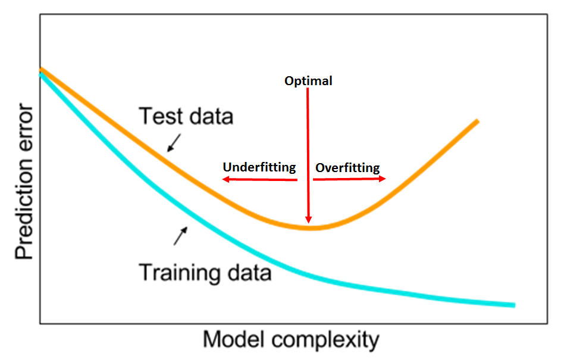
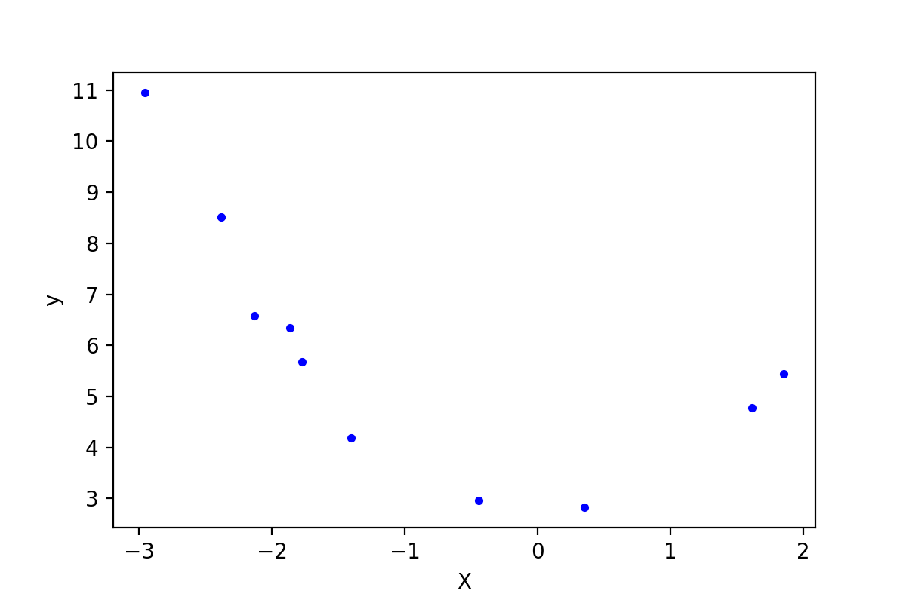
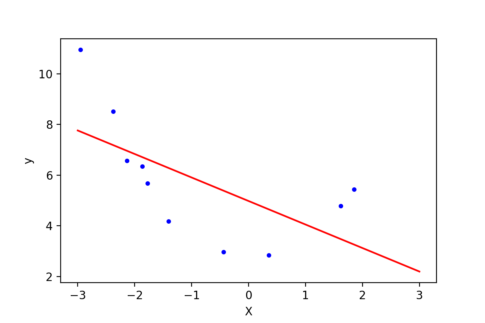
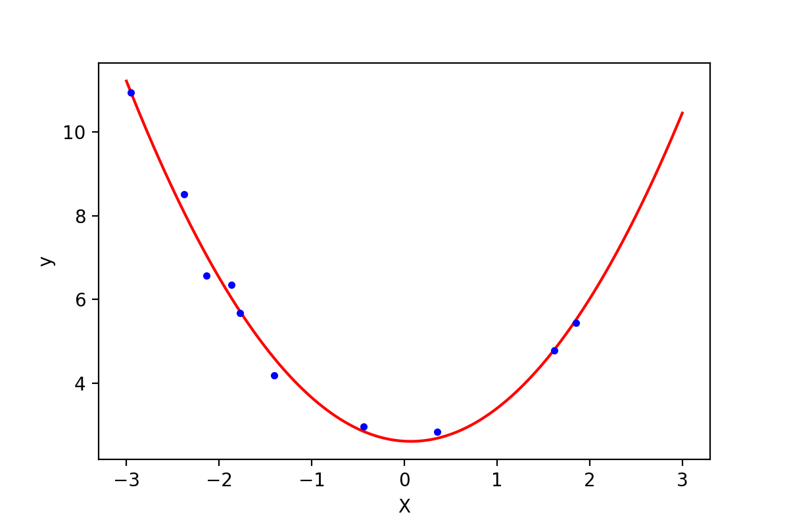
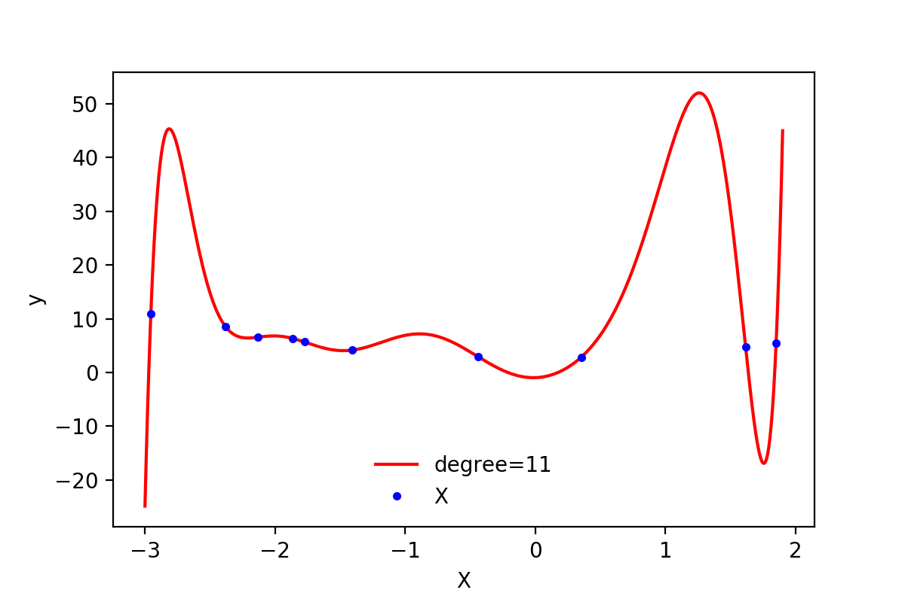

# 多项式回归
摘抄自:
`https://www.cnblogs.com/Belter/p/8530222.html`

<link rel="stylesheet" type="text/css" href="assets/base.css">


<div id="cnblogs_post_body" class="blogpost-body ">
    <p><span style="color: #000000; background-color: #ff6600;">注</span>：在上一篇的一般线性回归中，使用的假设函数是一元一次方程，也就是二维平面上的一条直线。但是很多时候可能会遇到直线方程无法很好的拟合数据的情况，这个时候可以尝试使用多项式回归。多项式回归中，加入了特征的更高次方（例如平方项或立方项），也相当于增加了模型的自由度，用来捕获数据中非线性的变化。添加高阶项的时候，也增加了模型的复杂度。随着模型复杂度的升高，模型的容量以及拟合数据的能力增加，可以进一步降低训练误差，但导致过拟合的风险也随之增加。</p>
<p>&nbsp;</p>
<p>&nbsp;</p>
<p><span style="font-family: 'courier new', courier;">图A，模型复杂度与训练误差及测试误差之间的关系</span></p>
<p>&nbsp;</p>
<h3><span style="color: #99cc00;">0. 多项式回归的一般形式</span></h3>
<hr>
<p>在多项式回归中，最重要的参数是最高次方的次数。设最高次方的次数为<span class="MathJax_Preview" style="color: inherit;"></span><span class="MathJax" id="MathJax-Element-1-Frame" tabindex="0" data-mathml="<math xmlns=&quot;http://www.w3.org/1998/Math/MathML&quot;><mi>n</mi></math>" role="presentation" style="position: relative;"><nobr aria-hidden="true"><span class="math" id="MathJax-Span-1" style="width: 0.764em; display: inline-block;"><span style="display: inline-block; position: relative; width: 0.588em; height: 0px; font-size: 122%;"><span style="position: absolute; clip: rect(1.525em, 1000.59em, 2.345em, -999.997em); top: -2.163em; left: 0em;"><span class="mrow" id="MathJax-Span-2"><span class="mi" id="MathJax-Span-3" style="font-family: MathJax_Math-italic;">n</span></span><span style="display: inline-block; width: 0px; height: 2.169em;"></span></span></span><span style="display: inline-block; overflow: hidden; vertical-align: -0.068em; border-left: 0px solid; width: 0px; height: 0.718em;"></span></span></nobr><span class="MJX_Assistive_MathML" role="presentation"><math xmlns="http://www.w3.org/1998/Math/MathML"><mi>n</mi></math></span></span><script type="math/tex" id="MathJax-Element-1">n</script>，且只有一个特征时，其多项式回归的方程为：</p>
<p><span class="MathJax_Preview" style="color: inherit;"></span><div class="MathJax_Display" style="text-align: center;"><span class="MathJax" id="MathJax-Element-2-Frame" tabindex="0" data-mathml="<math xmlns=&quot;http://www.w3.org/1998/Math/MathML&quot; display=&quot;block&quot;><mrow class=&quot;MJX-TeXAtom-ORD&quot;><mover><mi>h</mi><mo stretchy=&quot;false&quot;>&amp;#x005E;</mo></mover></mrow><mo>=</mo><msub><mi>&amp;#x03B8;</mi><mn>0</mn></msub><mo>+</mo><msub><mi>&amp;#x03B8;</mi><mn>1</mn></msub><msup><mi>x</mi><mn>1</mn></msup><mo>+</mo><mtext>&amp;#xA0;</mtext><mo>.</mo><mo>.</mo><mo>.</mo><mtext>&amp;#xA0;</mtext><mo>+</mo><msub><mi>&amp;#x03B8;</mi><mrow class=&quot;MJX-TeXAtom-ORD&quot;><mi>n</mi><mo>&amp;#x2212;</mo><mn>1</mn></mrow></msub><msup><mi>x</mi><mrow class=&quot;MJX-TeXAtom-ORD&quot;><mi>n</mi><mo>&amp;#x2212;</mo><mn>1</mn></mrow></msup><mo>+</mo><msub><mi>&amp;#x03B8;</mi><mi>n</mi></msub><msup><mi>x</mi><mi>n</mi></msup></math>" role="presentation" style="text-align: center; position: relative;"><nobr aria-hidden="true"><span class="math" id="MathJax-Span-4" style="width: 21.314em; display: inline-block;"><span style="display: inline-block; position: relative; width: 17.45em; height: 0px; font-size: 122%;"><span style="position: absolute; clip: rect(0.998em, 1017.45em, 2.579em, -999.997em); top: -2.163em; left: 0em;"><span class="mrow" id="MathJax-Span-5"><span class="texatom" id="MathJax-Span-6"><span class="mrow" id="MathJax-Span-7"><span class="munderover" id="MathJax-Span-8"><span style="display: inline-block; position: relative; width: 0.588em; height: 0px;"><span style="position: absolute; clip: rect(3.106em, 1000.53em, 4.16em, -999.997em); top: -3.978em; left: 0em;"><span class="mi" id="MathJax-Span-9" style="font-family: MathJax_Math-italic;">h</span><span style="display: inline-block; width: 0px; height: 3.984em;"></span></span><span style="position: absolute; clip: rect(3.106em, 1000.41em, 3.633em, -999.997em); top: -4.271em; left: 0.003em;"><span class="mo" id="MathJax-Span-10" style="font-family: MathJax_Main;">^</span><span style="display: inline-block; width: 0px; height: 3.984em;"></span></span></span></span></span></span><span class="mo" id="MathJax-Span-11" style="font-family: MathJax_Main; padding-left: 0.296em;">=</span><span class="msubsup" id="MathJax-Span-12" style="padding-left: 0.296em;"><span style="display: inline-block; position: relative; width: 0.881em; height: 0px;"><span style="position: absolute; clip: rect(3.106em, 1000.47em, 4.16em, -999.997em); top: -3.978em; left: 0em;"><span class="mi" id="MathJax-Span-13" style="font-family: MathJax_Math-italic;">θ</span><span style="display: inline-block; width: 0px; height: 3.984em;"></span></span><span style="position: absolute; top: -3.803em; left: 0.471em;"><span class="mn" id="MathJax-Span-14" style="font-size: 70.7%; font-family: MathJax_Main;">0</span><span style="display: inline-block; width: 0px; height: 3.984em;"></span></span></span></span><span class="mo" id="MathJax-Span-15" style="font-family: MathJax_Main; padding-left: 0.237em;">+</span><span class="msubsup" id="MathJax-Span-16" style="padding-left: 0.237em;"><span style="display: inline-block; position: relative; width: 0.881em; height: 0px;"><span style="position: absolute; clip: rect(3.106em, 1000.47em, 4.16em, -999.997em); top: -3.978em; left: 0em;"><span class="mi" id="MathJax-Span-17" style="font-family: MathJax_Math-italic;">θ</span><span style="display: inline-block; width: 0px; height: 3.984em;"></span></span><span style="position: absolute; top: -3.803em; left: 0.471em;"><span class="mn" id="MathJax-Span-18" style="font-size: 70.7%; font-family: MathJax_Main;">1</span><span style="display: inline-block; width: 0px; height: 3.984em;"></span></span></span></span><span class="msubsup" id="MathJax-Span-19"><span style="display: inline-block; position: relative; width: 0.998em; height: 0px;"><span style="position: absolute; clip: rect(3.34em, 1000.53em, 4.16em, -999.997em); top: -3.978em; left: 0em;"><span class="mi" id="MathJax-Span-20" style="font-family: MathJax_Math-italic;">x</span><span style="display: inline-block; width: 0px; height: 3.984em;"></span></span><span style="position: absolute; top: -4.388em; left: 0.588em;"><span class="mn" id="MathJax-Span-21" style="font-size: 70.7%; font-family: MathJax_Main;">1</span><span style="display: inline-block; width: 0px; height: 3.984em;"></span></span></span></span><span class="mo" id="MathJax-Span-22" style="font-family: MathJax_Main; padding-left: 0.237em;">+</span><span class="mtext" id="MathJax-Span-23" style="font-family: MathJax_Main; padding-left: 0.237em;">&nbsp;</span><span class="mo" id="MathJax-Span-24" style="font-family: MathJax_Main;">.</span><span class="mo" id="MathJax-Span-25" style="font-family: MathJax_Main; padding-left: 0.179em;">.</span><span class="mo" id="MathJax-Span-26" style="font-family: MathJax_Main; padding-left: 0.179em;">.</span><span class="mtext" id="MathJax-Span-27" style="font-family: MathJax_Main; padding-left: 0.179em;">&nbsp;</span><span class="mo" id="MathJax-Span-28" style="font-family: MathJax_Main; padding-left: 0.237em;">+</span><span class="msubsup" id="MathJax-Span-29" style="padding-left: 0.237em;"><span style="display: inline-block; position: relative; width: 1.876em; height: 0px;"><span style="position: absolute; clip: rect(3.106em, 1000.47em, 4.16em, -999.997em); top: -3.978em; left: 0em;"><span class="mi" id="MathJax-Span-30" style="font-family: MathJax_Math-italic;">θ</span><span style="display: inline-block; width: 0px; height: 3.984em;"></span></span><span style="position: absolute; top: -3.803em; left: 0.471em;"><span class="texatom" id="MathJax-Span-31"><span class="mrow" id="MathJax-Span-32"><span class="mi" id="MathJax-Span-33" style="font-size: 70.7%; font-family: MathJax_Math-italic;">n</span><span class="mo" id="MathJax-Span-34" style="font-size: 70.7%; font-family: MathJax_Main;">−</span><span class="mn" id="MathJax-Span-35" style="font-size: 70.7%; font-family: MathJax_Main;">1</span></span></span><span style="display: inline-block; width: 0px; height: 3.984em;"></span></span></span></span><span class="msubsup" id="MathJax-Span-36"><span style="display: inline-block; position: relative; width: 1.994em; height: 0px;"><span style="position: absolute; clip: rect(3.34em, 1000.53em, 4.16em, -999.997em); top: -3.978em; left: 0em;"><span class="mi" id="MathJax-Span-37" style="font-family: MathJax_Math-italic;">x</span><span style="display: inline-block; width: 0px; height: 3.984em;"></span></span><span style="position: absolute; top: -4.388em; left: 0.588em;"><span class="texatom" id="MathJax-Span-38"><span class="mrow" id="MathJax-Span-39"><span class="mi" id="MathJax-Span-40" style="font-size: 70.7%; font-family: MathJax_Math-italic;">n</span><span class="mo" id="MathJax-Span-41" style="font-size: 70.7%; font-family: MathJax_Main;">−</span><span class="mn" id="MathJax-Span-42" style="font-size: 70.7%; font-family: MathJax_Main;">1</span></span></span><span style="display: inline-block; width: 0px; height: 3.984em;"></span></span></span></span><span class="mo" id="MathJax-Span-43" style="font-family: MathJax_Main; padding-left: 0.237em;">+</span><span class="msubsup" id="MathJax-Span-44" style="padding-left: 0.237em;"><span style="display: inline-block; position: relative; width: 0.998em; height: 0px;"><span style="position: absolute; clip: rect(3.106em, 1000.47em, 4.16em, -999.997em); top: -3.978em; left: 0em;"><span class="mi" id="MathJax-Span-45" style="font-family: MathJax_Math-italic;">θ</span><span style="display: inline-block; width: 0px; height: 3.984em;"></span></span><span style="position: absolute; top: -3.803em; left: 0.471em;"><span class="mi" id="MathJax-Span-46" style="font-size: 70.7%; font-family: MathJax_Math-italic;">n</span><span style="display: inline-block; width: 0px; height: 3.984em;"></span></span></span></span><span class="msubsup" id="MathJax-Span-47"><span style="display: inline-block; position: relative; width: 1.057em; height: 0px;"><span style="position: absolute; clip: rect(3.34em, 1000.53em, 4.16em, -999.997em); top: -3.978em; left: 0em;"><span class="mi" id="MathJax-Span-48" style="font-family: MathJax_Math-italic;">x</span><span style="display: inline-block; width: 0px; height: 3.984em;"></span></span><span style="position: absolute; top: -4.388em; left: 0.588em;"><span class="mi" id="MathJax-Span-49" style="font-size: 70.7%; font-family: MathJax_Math-italic;">n</span><span style="display: inline-block; width: 0px; height: 3.984em;"></span></span></span></span></span><span style="display: inline-block; width: 0px; height: 2.169em;"></span></span></span><span style="display: inline-block; overflow: hidden; vertical-align: -0.354em; border-left: 0px solid; width: 0px; height: 1.646em;"></span></span></nobr><span class="MJX_Assistive_MathML MJX_Assistive_MathML_Block" role="presentation"><math xmlns="http://www.w3.org/1998/Math/MathML" display="block"><mrow class="MJX-TeXAtom-ORD"><mover><mi>h</mi><mo stretchy="false">^</mo></mover></mrow><mo>=</mo><msub><mi>θ</mi><mn>0</mn></msub><mo>+</mo><msub><mi>θ</mi><mn>1</mn></msub><msup><mi>x</mi><mn>1</mn></msup><mo>+</mo><mtext>&nbsp;</mtext><mo>.</mo><mo>.</mo><mo>.</mo><mtext>&nbsp;</mtext><mo>+</mo><msub><mi>θ</mi><mrow class="MJX-TeXAtom-ORD"><mi>n</mi><mo>−</mo><mn>1</mn></mrow></msub><msup><mi>x</mi><mrow class="MJX-TeXAtom-ORD"><mi>n</mi><mo>−</mo><mn>1</mn></mrow></msup><mo>+</mo><msub><mi>θ</mi><mi>n</mi></msub><msup><mi>x</mi><mi>n</mi></msup></math></span></span></div><script type="math/tex; mode=display" id="MathJax-Element-2"> \hat{h} = \theta_0 + \theta_1 x^1 + \ ... \  + \theta_{n-1} x^{n-1} +  \theta_n x^n </script></p>
<p>如果令<span class="MathJax_Preview" style="color: inherit;"></span><span class="MathJax" id="MathJax-Element-3-Frame" tabindex="0" data-mathml="<math xmlns=&quot;http://www.w3.org/1998/Math/MathML&quot;><msub><mi>x</mi><mn>0</mn></msub><mo>=</mo><mn>1</mn></math>" role="presentation" style="position: relative;"><nobr aria-hidden="true"><span class="math" id="MathJax-Span-50" style="width: 3.516em; display: inline-block;"><span style="display: inline-block; position: relative; width: 2.872em; height: 0px; font-size: 122%;"><span style="position: absolute; clip: rect(1.35em, 1002.81em, 2.52em, -999.997em); top: -2.163em; left: 0em;"><span class="mrow" id="MathJax-Span-51"><span class="msubsup" id="MathJax-Span-52"><span style="display: inline-block; position: relative; width: 0.998em; height: 0px;"><span style="position: absolute; clip: rect(3.34em, 1000.53em, 4.16em, -999.997em); top: -3.978em; left: 0em;"><span class="mi" id="MathJax-Span-53" style="font-family: MathJax_Math-italic;">x</span><span style="display: inline-block; width: 0px; height: 3.984em;"></span></span><span style="position: absolute; top: -3.803em; left: 0.588em;"><span class="mn" id="MathJax-Span-54" style="font-size: 70.7%; font-family: MathJax_Main;">0</span><span style="display: inline-block; width: 0px; height: 3.984em;"></span></span></span></span><span class="mo" id="MathJax-Span-55" style="font-family: MathJax_Main; padding-left: 0.296em;">=</span><span class="mn" id="MathJax-Span-56" style="font-family: MathJax_Main; padding-left: 0.296em;">1</span></span><span style="display: inline-block; width: 0px; height: 2.169em;"></span></span></span><span style="display: inline-block; overflow: hidden; vertical-align: -0.282em; border-left: 0px solid; width: 0px; height: 1.146em;"></span></span></nobr><span class="MJX_Assistive_MathML" role="presentation"><math xmlns="http://www.w3.org/1998/Math/MathML"><msub><mi>x</mi><mn>0</mn></msub><mo>=</mo><mn>1</mn></math></span></span><script type="math/tex" id="MathJax-Element-3">x_0 = 1</script>，在多样本的情况下，可以写成向量化的形式：</p>
<p><span class="MathJax_Preview" style="color: inherit;"></span><div class="MathJax_Display" style="text-align: center;"><span class="MathJax" id="MathJax-Element-4-Frame" tabindex="0" data-mathml="<math xmlns=&quot;http://www.w3.org/1998/Math/MathML&quot; display=&quot;block&quot;><mrow class=&quot;MJX-TeXAtom-ORD&quot;><mover><mi>h</mi><mo stretchy=&quot;false&quot;>&amp;#x005E;</mo></mover></mrow><mo>=</mo><mi>X</mi><mo>&amp;#x22C5;</mo><mi>&amp;#x03B8;</mi></math>" role="presentation" style="text-align: center; position: relative;"><nobr aria-hidden="true"><span class="math" id="MathJax-Span-57" style="width: 4.862em; display: inline-block;"><span style="display: inline-block; position: relative; width: 3.984em; height: 0px; font-size: 122%;"><span style="position: absolute; clip: rect(0.998em, 1003.98em, 2.345em, -999.997em); top: -2.163em; left: 0em;"><span class="mrow" id="MathJax-Span-58"><span class="texatom" id="MathJax-Span-59"><span class="mrow" id="MathJax-Span-60"><span class="munderover" id="MathJax-Span-61"><span style="display: inline-block; position: relative; width: 0.588em; height: 0px;"><span style="position: absolute; clip: rect(3.106em, 1000.53em, 4.16em, -999.997em); top: -3.978em; left: 0em;"><span class="mi" id="MathJax-Span-62" style="font-family: MathJax_Math-italic;">h</span><span style="display: inline-block; width: 0px; height: 3.984em;"></span></span><span style="position: absolute; clip: rect(3.106em, 1000.41em, 3.633em, -999.997em); top: -4.271em; left: 0.003em;"><span class="mo" id="MathJax-Span-63" style="font-family: MathJax_Main;">^</span><span style="display: inline-block; width: 0px; height: 3.984em;"></span></span></span></span></span></span><span class="mo" id="MathJax-Span-64" style="font-family: MathJax_Main; padding-left: 0.296em;">=</span><span class="mi" id="MathJax-Span-65" style="font-family: MathJax_Math-italic; padding-left: 0.296em;">X<span style="display: inline-block; overflow: hidden; height: 1px; width: 0.003em;"></span></span><span class="mo" id="MathJax-Span-66" style="font-family: MathJax_Main; padding-left: 0.237em;">⋅</span><span class="mi" id="MathJax-Span-67" style="font-family: MathJax_Math-italic; padding-left: 0.237em;">θ</span></span><span style="display: inline-block; width: 0px; height: 2.169em;"></span></span></span><span style="display: inline-block; overflow: hidden; vertical-align: -0.068em; border-left: 0px solid; width: 0px; height: 1.361em;"></span></span></nobr><span class="MJX_Assistive_MathML MJX_Assistive_MathML_Block" role="presentation"><math xmlns="http://www.w3.org/1998/Math/MathML" display="block"><mrow class="MJX-TeXAtom-ORD"><mover><mi>h</mi><mo stretchy="false">^</mo></mover></mrow><mo>=</mo><mi>X</mi><mo>⋅</mo><mi>θ</mi></math></span></span></div><script type="math/tex; mode=display" id="MathJax-Element-4">\hat{h} = X \cdot \theta</script></p>
<p>其中<span class="MathJax_Preview" style="color: inherit;"></span><span class="MathJax" id="MathJax-Element-5-Frame" tabindex="0" data-mathml="<math xmlns=&quot;http://www.w3.org/1998/Math/MathML&quot;><mi>X</mi></math>" role="presentation" style="position: relative;"><nobr aria-hidden="true"><span class="math" id="MathJax-Span-68" style="width: 0.998em; display: inline-block;"><span style="display: inline-block; position: relative; width: 0.823em; height: 0px; font-size: 122%;"><span style="position: absolute; clip: rect(1.291em, 1000.82em, 2.345em, -999.997em); top: -2.163em; left: 0em;"><span class="mrow" id="MathJax-Span-69"><span class="mi" id="MathJax-Span-70" style="font-family: MathJax_Math-italic;">X<span style="display: inline-block; overflow: hidden; height: 1px; width: 0.003em;"></span></span></span><span style="display: inline-block; width: 0px; height: 2.169em;"></span></span></span><span style="display: inline-block; overflow: hidden; vertical-align: -0.068em; border-left: 0px solid; width: 0px; height: 1.004em;"></span></span></nobr><span class="MJX_Assistive_MathML" role="presentation"><math xmlns="http://www.w3.org/1998/Math/MathML"><mi>X</mi></math></span></span><script type="math/tex" id="MathJax-Element-5">X</script>是大小为<span class="MathJax_Preview" style="color: inherit;"></span><span class="MathJax" id="MathJax-Element-6-Frame" tabindex="0" data-mathml="<math xmlns=&quot;http://www.w3.org/1998/Math/MathML&quot;><mi>m</mi><mo>&amp;#x22C5;</mo><mo stretchy=&quot;false&quot;>(</mo><mi>n</mi><mo>+</mo><mn>1</mn><mo stretchy=&quot;false&quot;>)</mo></math>" role="presentation" style="position: relative;"><nobr aria-hidden="true"><span class="math" id="MathJax-Span-71" style="width: 5.799em; display: inline-block;"><span style="display: inline-block; position: relative; width: 4.745em; height: 0px; font-size: 122%;"><span style="position: absolute; clip: rect(1.232em, 1004.63em, 2.579em, -999.997em); top: -2.163em; left: 0em;"><span class="mrow" id="MathJax-Span-72"><span class="mi" id="MathJax-Span-73" style="font-family: MathJax_Math-italic;">m</span><span class="mo" id="MathJax-Span-74" style="font-family: MathJax_Main; padding-left: 0.237em;">⋅</span><span class="mo" id="MathJax-Span-75" style="font-family: MathJax_Main; padding-left: 0.237em;">(</span><span class="mi" id="MathJax-Span-76" style="font-family: MathJax_Math-italic;">n</span><span class="mo" id="MathJax-Span-77" style="font-family: MathJax_Main; padding-left: 0.237em;">+</span><span class="mn" id="MathJax-Span-78" style="font-family: MathJax_Main; padding-left: 0.237em;">1</span><span class="mo" id="MathJax-Span-79" style="font-family: MathJax_Main;">)</span></span><span style="display: inline-block; width: 0px; height: 2.169em;"></span></span></span><span style="display: inline-block; overflow: hidden; vertical-align: -0.354em; border-left: 0px solid; width: 0px; height: 1.361em;"></span></span></nobr><span class="MJX_Assistive_MathML" role="presentation"><math xmlns="http://www.w3.org/1998/Math/MathML"><mi>m</mi><mo>⋅</mo><mo stretchy="false">(</mo><mi>n</mi><mo>+</mo><mn>1</mn><mo stretchy="false">)</mo></math></span></span><script type="math/tex" id="MathJax-Element-6">m \cdot (n+1)</script>的矩阵，<span class="MathJax_Preview" style="color: inherit;"></span><span class="MathJax" id="MathJax-Element-7-Frame" tabindex="0" data-mathml="<math xmlns=&quot;http://www.w3.org/1998/Math/MathML&quot;><mi>&amp;#x03B8;</mi></math>" role="presentation" style="position: relative;"><nobr aria-hidden="true"><span class="math" id="MathJax-Span-80" style="width: 0.588em; display: inline-block;"><span style="display: inline-block; position: relative; width: 0.471em; height: 0px; font-size: 122%;"><span style="position: absolute; clip: rect(1.291em, 1000.47em, 2.345em, -999.997em); top: -2.163em; left: 0em;"><span class="mrow" id="MathJax-Span-81"><span class="mi" id="MathJax-Span-82" style="font-family: MathJax_Math-italic;">θ</span></span><span style="display: inline-block; width: 0px; height: 2.169em;"></span></span></span><span style="display: inline-block; overflow: hidden; vertical-align: -0.068em; border-left: 0px solid; width: 0px; height: 1.004em;"></span></span></nobr><span class="MJX_Assistive_MathML" role="presentation"><math xmlns="http://www.w3.org/1998/Math/MathML"><mi>θ</mi></math></span></span><script type="math/tex" id="MathJax-Element-7">\theta</script>是大小为<span class="MathJax_Preview" style="color: inherit;"></span><span class="MathJax" id="MathJax-Element-8-Frame" tabindex="0" data-mathml="<math xmlns=&quot;http://www.w3.org/1998/Math/MathML&quot;><mo stretchy=&quot;false&quot;>(</mo><mi>n</mi><mo>+</mo><mn>1</mn><mo stretchy=&quot;false&quot;>)</mo><mo>&amp;#x22C5;</mo><mn>1</mn></math>" role="presentation" style="position: relative;"><nobr aria-hidden="true"><span class="math" id="MathJax-Span-83" style="width: 5.389em; display: inline-block;"><span style="display: inline-block; position: relative; width: 4.394em; height: 0px; font-size: 122%;"><span style="position: absolute; clip: rect(1.232em, 1004.34em, 2.579em, -999.997em); top: -2.163em; left: 0em;"><span class="mrow" id="MathJax-Span-84"><span class="mo" id="MathJax-Span-85" style="font-family: MathJax_Main;">(</span><span class="mi" id="MathJax-Span-86" style="font-family: MathJax_Math-italic;">n</span><span class="mo" id="MathJax-Span-87" style="font-family: MathJax_Main; padding-left: 0.237em;">+</span><span class="mn" id="MathJax-Span-88" style="font-family: MathJax_Main; padding-left: 0.237em;">1</span><span class="mo" id="MathJax-Span-89" style="font-family: MathJax_Main;">)</span><span class="mo" id="MathJax-Span-90" style="font-family: MathJax_Main; padding-left: 0.237em;">⋅</span><span class="mn" id="MathJax-Span-91" style="font-family: MathJax_Main; padding-left: 0.237em;">1</span></span><span style="display: inline-block; width: 0px; height: 2.169em;"></span></span></span><span style="display: inline-block; overflow: hidden; vertical-align: -0.354em; border-left: 0px solid; width: 0px; height: 1.361em;"></span></span></nobr><span class="MJX_Assistive_MathML" role="presentation"><math xmlns="http://www.w3.org/1998/Math/MathML"><mo stretchy="false">(</mo><mi>n</mi><mo>+</mo><mn>1</mn><mo stretchy="false">)</mo><mo>⋅</mo><mn>1</mn></math></span></span><script type="math/tex" id="MathJax-Element-8">(n+1) \cdot 1</script>的矩阵。在这里虽然只有一个特征<span class="MathJax_Preview" style="color: inherit;"></span><span class="MathJax" id="MathJax-Element-9-Frame" tabindex="0" data-mathml="<math xmlns=&quot;http://www.w3.org/1998/Math/MathML&quot;><mi>x</mi></math>" role="presentation" style="position: relative;"><nobr aria-hidden="true"><span class="math" id="MathJax-Span-92" style="width: 0.764em; display: inline-block;"><span style="display: inline-block; position: relative; width: 0.588em; height: 0px; font-size: 122%;"><span style="position: absolute; clip: rect(1.525em, 1000.53em, 2.345em, -999.997em); top: -2.163em; left: 0em;"><span class="mrow" id="MathJax-Span-93"><span class="mi" id="MathJax-Span-94" style="font-family: MathJax_Math-italic;">x</span></span><span style="display: inline-block; width: 0px; height: 2.169em;"></span></span></span><span style="display: inline-block; overflow: hidden; vertical-align: -0.068em; border-left: 0px solid; width: 0px; height: 0.718em;"></span></span></nobr><span class="MJX_Assistive_MathML" role="presentation"><math xmlns="http://www.w3.org/1998/Math/MathML"><mi>x</mi></math></span></span><script type="math/tex" id="MathJax-Element-9">x</script>以及<span class="MathJax_Preview" style="color: inherit;"></span><span class="MathJax" id="MathJax-Element-10-Frame" tabindex="0" data-mathml="<math xmlns=&quot;http://www.w3.org/1998/Math/MathML&quot;><mi>x</mi></math>" role="presentation" style="position: relative;"><nobr aria-hidden="true"><span class="math" id="MathJax-Span-95" style="width: 0.764em; display: inline-block;"><span style="display: inline-block; position: relative; width: 0.588em; height: 0px; font-size: 122%;"><span style="position: absolute; clip: rect(1.525em, 1000.53em, 2.345em, -999.997em); top: -2.163em; left: 0em;"><span class="mrow" id="MathJax-Span-96"><span class="mi" id="MathJax-Span-97" style="font-family: MathJax_Math-italic;">x</span></span><span style="display: inline-block; width: 0px; height: 2.169em;"></span></span></span><span style="display: inline-block; overflow: hidden; vertical-align: -0.068em; border-left: 0px solid; width: 0px; height: 0.718em;"></span></span></nobr><span class="MJX_Assistive_MathML" role="presentation"><math xmlns="http://www.w3.org/1998/Math/MathML"><mi>x</mi></math></span></span><script type="math/tex" id="MathJax-Element-10">x</script>的不同次方，但是也可以将<span class="MathJax_Preview" style="color: inherit;"></span><span class="MathJax" id="MathJax-Element-11-Frame" tabindex="0" data-mathml="<math xmlns=&quot;http://www.w3.org/1998/Math/MathML&quot;><mi>x</mi></math>" role="presentation" style="position: relative;"><nobr aria-hidden="true"><span class="math" id="MathJax-Span-98" style="width: 0.764em; display: inline-block;"><span style="display: inline-block; position: relative; width: 0.588em; height: 0px; font-size: 122%;"><span style="position: absolute; clip: rect(1.525em, 1000.53em, 2.345em, -999.997em); top: -2.163em; left: 0em;"><span class="mrow" id="MathJax-Span-99"><span class="mi" id="MathJax-Span-100" style="font-family: MathJax_Math-italic;">x</span></span><span style="display: inline-block; width: 0px; height: 2.169em;"></span></span></span><span style="display: inline-block; overflow: hidden; vertical-align: -0.068em; border-left: 0px solid; width: 0px; height: 0.718em;"></span></span></nobr><span class="MJX_Assistive_MathML" role="presentation"><math xmlns="http://www.w3.org/1998/Math/MathML"><mi>x</mi></math></span></span><script type="math/tex" id="MathJax-Element-11">x</script>的高次方当做一个新特征。与多元回归分析唯一不同的是，这些特征之间是高度相关的，而不是通常要求的那样是相互对立的。</p>
<p>&nbsp;在这里有个问题在刚开始学习线性回归的时候困扰了自己很久：如果假设中出现了高阶项，那么这个模型还是线性模型吗？此时看待问题的角度不同，得到的结果也不同。如果把上面的假设看成是特征<span class="MathJax_Preview" style="color: inherit;"></span><span class="MathJax" id="MathJax-Element-12-Frame" tabindex="0" data-mathml="<math xmlns=&quot;http://www.w3.org/1998/Math/MathML&quot;><mi>x</mi></math>" role="presentation" style="position: relative;"><nobr aria-hidden="true"><span class="math" id="MathJax-Span-101" style="width: 0.764em; display: inline-block;"><span style="display: inline-block; position: relative; width: 0.588em; height: 0px; font-size: 122%;"><span style="position: absolute; clip: rect(1.525em, 1000.53em, 2.345em, -999.997em); top: -2.163em; left: 0em;"><span class="mrow" id="MathJax-Span-102"><span class="mi" id="MathJax-Span-103" style="font-family: MathJax_Math-italic;">x</span></span><span style="display: inline-block; width: 0px; height: 2.169em;"></span></span></span><span style="display: inline-block; overflow: hidden; vertical-align: -0.068em; border-left: 0px solid; width: 0px; height: 0.718em;"></span></span></nobr><span class="MJX_Assistive_MathML" role="presentation"><math xmlns="http://www.w3.org/1998/Math/MathML"><mi>x</mi></math></span></span><script type="math/tex" id="MathJax-Element-12">x</script>的方程，那么该方程就是非线性方程；如果看成是参数<span class="MathJax_Preview" style="color: inherit;"></span><span class="MathJax" id="MathJax-Element-13-Frame" tabindex="0" data-mathml="<math xmlns=&quot;http://www.w3.org/1998/Math/MathML&quot;><mi>&amp;#x03B8;</mi></math>" role="presentation" style="position: relative;"><nobr aria-hidden="true"><span class="math" id="MathJax-Span-104" style="width: 0.588em; display: inline-block;"><span style="display: inline-block; position: relative; width: 0.471em; height: 0px; font-size: 122%;"><span style="position: absolute; clip: rect(1.291em, 1000.47em, 2.345em, -999.997em); top: -2.163em; left: 0em;"><span class="mrow" id="MathJax-Span-105"><span class="mi" id="MathJax-Span-106" style="font-family: MathJax_Math-italic;">θ</span></span><span style="display: inline-block; width: 0px; height: 2.169em;"></span></span></span><span style="display: inline-block; overflow: hidden; vertical-align: -0.068em; border-left: 0px solid; width: 0px; height: 1.004em;"></span></span></nobr><span class="MJX_Assistive_MathML" role="presentation"><math xmlns="http://www.w3.org/1998/Math/MathML"><mi>θ</mi></math></span></span><script type="math/tex" id="MathJax-Element-13">\theta</script>的方程，那么<span class="MathJax_Preview" style="color: inherit;"></span><span class="MathJax" id="MathJax-Element-14-Frame" tabindex="0" data-mathml="<math xmlns=&quot;http://www.w3.org/1998/Math/MathML&quot;><mi>x</mi></math>" role="presentation" style="position: relative;"><nobr aria-hidden="true"><span class="math" id="MathJax-Span-107" style="width: 0.764em; display: inline-block;"><span style="display: inline-block; position: relative; width: 0.588em; height: 0px; font-size: 122%;"><span style="position: absolute; clip: rect(1.525em, 1000.53em, 2.345em, -999.997em); top: -2.163em; left: 0em;"><span class="mrow" id="MathJax-Span-108"><span class="mi" id="MathJax-Span-109" style="font-family: MathJax_Math-italic;">x</span></span><span style="display: inline-block; width: 0px; height: 2.169em;"></span></span></span><span style="display: inline-block; overflow: hidden; vertical-align: -0.068em; border-left: 0px solid; width: 0px; height: 0.718em;"></span></span></nobr><span class="MJX_Assistive_MathML" role="presentation"><math xmlns="http://www.w3.org/1998/Math/MathML"><mi>x</mi></math></span></span><script type="math/tex" id="MathJax-Element-14">x</script>的高阶项都可以看做是对应<span class="MathJax_Preview" style="color: inherit;"></span><span class="MathJax" id="MathJax-Element-15-Frame" tabindex="0" data-mathml="<math xmlns=&quot;http://www.w3.org/1998/Math/MathML&quot;><mi>&amp;#x03B8;</mi></math>" role="presentation" style="position: relative;"><nobr aria-hidden="true"><span class="math" id="MathJax-Span-110" style="width: 0.588em; display: inline-block;"><span style="display: inline-block; position: relative; width: 0.471em; height: 0px; font-size: 122%;"><span style="position: absolute; clip: rect(1.291em, 1000.47em, 2.345em, -999.997em); top: -2.163em; left: 0em;"><span class="mrow" id="MathJax-Span-111"><span class="mi" id="MathJax-Span-112" style="font-family: MathJax_Math-italic;">θ</span></span><span style="display: inline-block; width: 0px; height: 2.169em;"></span></span></span><span style="display: inline-block; overflow: hidden; vertical-align: -0.068em; border-left: 0px solid; width: 0px; height: 1.004em;"></span></span></nobr><span class="MJX_Assistive_MathML" role="presentation"><math xmlns="http://www.w3.org/1998/Math/MathML"><mi>θ</mi></math></span></span><script type="math/tex" id="MathJax-Element-15">\theta</script>的参数，那么该方程就是线性方程。很明显，在线性回归中采用了后一种解释方式。因此多项式回归仍然是参数的线性模型。</p>
<p>&nbsp;</p>
<h3><span style="color: #99cc00;">1. 多项式回归的实现</span></h3>
<hr>
<p>下面主要使用了numpy、scipy、matplotlib和scikit-learn，所有使用到的函数的导入如下：</p>
<div class="cnblogs_code"><div class="cnblogs_code_toolbar"><span class="cnblogs_code_copy"><a href="javascript:void(0);" onclick="copyCnblogsCode(this)" title="复制代码"></a></span></div>
<pre><span style="color: #008080;">1</span> <span style="color: #0000ff;">import</span><span style="color: #000000;"> numpy as np
</span><span style="color: #008080;">2</span> <span style="color: #0000ff;">from</span> scipy <span style="color: #0000ff;">import</span><span style="color: #000000;"> stats
</span><span style="color: #008080;">3</span> <span style="color: #0000ff;">import</span><span style="color: #000000;"> matplotlib.pyplot as plt
</span><span style="color: #008080;">4</span> <span style="color: #0000ff;">from</span> sklearn.preprocessing <span style="color: #0000ff;">import</span><span style="color: #000000;"> PolynomialFeatures
</span><span style="color: #008080;">5</span> <span style="color: #0000ff;">from</span> sklearn.linear_model <span style="color: #0000ff;">import</span><span style="color: #000000;"> LinearRegression
</span><span style="color: #008080;">6</span> <span style="color: #0000ff;">from</span> sklearn.metrics <span style="color: #0000ff;">import</span> mean_squared_error</pre>
<div class="cnblogs_code_toolbar"><span class="cnblogs_code_copy"><a href="javascript:void(0);" onclick="copyCnblogsCode(this)" title="复制代码"></a></span></div></div>
<p>下是使用的数据是使用<span class="MathJax_Preview" style="color: inherit;"></span><span class="MathJax" id="MathJax-Element-16-Frame" tabindex="0" data-mathml="<math xmlns=&quot;http://www.w3.org/1998/Math/MathML&quot;><mi>y</mi><mo>=</mo><msup><mi>x</mi><mn>2</mn></msup><mo>+</mo><mn>2</mn></math>" role="presentation" style="position: relative;"><nobr aria-hidden="true"><span class="math" id="MathJax-Span-113" style="width: 5.682em; display: inline-block;"><span style="display: inline-block; position: relative; width: 4.628em; height: 0px; font-size: 122%;"><span style="position: absolute; clip: rect(1.174em, 1004.57em, 2.579em, -999.997em); top: -2.163em; left: 0em;"><span class="mrow" id="MathJax-Span-114"><span class="mi" id="MathJax-Span-115" style="font-family: MathJax_Math-italic;">y<span style="display: inline-block; overflow: hidden; height: 1px; width: 0.003em;"></span></span><span class="mo" id="MathJax-Span-116" style="font-family: MathJax_Main; padding-left: 0.296em;">=</span><span class="msubsup" id="MathJax-Span-117" style="padding-left: 0.296em;"><span style="display: inline-block; position: relative; width: 0.998em; height: 0px;"><span style="position: absolute; clip: rect(3.34em, 1000.53em, 4.16em, -999.997em); top: -3.978em; left: 0em;"><span class="mi" id="MathJax-Span-118" style="font-family: MathJax_Math-italic;">x</span><span style="display: inline-block; width: 0px; height: 3.984em;"></span></span><span style="position: absolute; top: -4.33em; left: 0.588em;"><span class="mn" id="MathJax-Span-119" style="font-size: 70.7%; font-family: MathJax_Main;">2</span><span style="display: inline-block; width: 0px; height: 3.984em;"></span></span></span></span><span class="mo" id="MathJax-Span-120" style="font-family: MathJax_Main; padding-left: 0.237em;">+</span><span class="mn" id="MathJax-Span-121" style="font-family: MathJax_Main; padding-left: 0.237em;">2</span></span><span style="display: inline-block; width: 0px; height: 2.169em;"></span></span></span><span style="display: inline-block; overflow: hidden; vertical-align: -0.354em; border-left: 0px solid; width: 0px; height: 1.432em;"></span></span></nobr><span class="MJX_Assistive_MathML" role="presentation"><math xmlns="http://www.w3.org/1998/Math/MathML"><mi>y</mi><mo>=</mo><msup><mi>x</mi><mn>2</mn></msup><mo>+</mo><mn>2</mn></math></span></span><script type="math/tex" id="MathJax-Element-16">y = x^2 + 2</script>并加入一些随机误差生成的，只取了10个数据点：</p>
<div class="cnblogs_code"><div class="cnblogs_code_toolbar"><span class="cnblogs_code_copy"><a href="javascript:void(0);" onclick="copyCnblogsCode(this)" title="复制代码"></a></span></div>
<pre><span style="color: #008080;"> 1</span> data = np.array([[ -2.95507616,  10.94533252<span style="color: #000000;">],
</span><span style="color: #008080;"> 2</span>        [ -0.44226119,   2.96705822<span style="color: #000000;">],
</span><span style="color: #008080;"> 3</span>        [ -2.13294087,   6.57336839<span style="color: #000000;">],
</span><span style="color: #008080;"> 4</span>        [  1.84990823,   5.44244467<span style="color: #000000;">],
</span><span style="color: #008080;"> 5</span>        [  0.35139795,   2.83533936<span style="color: #000000;">],
</span><span style="color: #008080;"> 6</span>        [ -1.77443098,   5.6800407<span style="color: #000000;"> ],
</span><span style="color: #008080;"> 7</span>        [ -1.8657203 ,   6.34470814<span style="color: #000000;">],
</span><span style="color: #008080;"> 8</span>        [  1.61526823,   4.77833358<span style="color: #000000;">],
</span><span style="color: #008080;"> 9</span>        [ -2.38043687,   8.51887713<span style="color: #000000;">],
</span><span style="color: #008080;">10</span>        [ -1.40513866,   4.18262786<span style="color: #000000;">]])
</span><span style="color: #008080;">11</span> m = data.shape[0]  <span style="color: #008000;">#</span><span style="color: #008000;"> 样本大小</span>
<span style="color: #008080;">12</span> X =<span style="color: #000000;"> data[:, 0].reshape(-1, 1)  # 将array转换成矩阵
</span><span style="color: #008080;">13</span> y = data[:, 1<span style="color: #000000;">].reshape(-1, 1)
</span><span style="color: #008080;">14</span> plt.plot(X, y, <span style="color: #800000;">"</span><span style="color: #800000;">b.</span><span style="color: #800000;">"</span><span style="color: #000000;">)
</span><span style="color: #008080;">15</span> plt.xlabel(<span style="color: #800000;">'</span><span style="color: #800000;">X</span><span style="color: #800000;">'</span><span style="color: #000000;">)
</span><span style="color: #008080;">16</span> plt.ylabel(<span style="color: #800000;">'</span><span style="color: #800000;">y</span><span style="color: #800000;">'</span><span style="color: #000000;">)
</span><span style="color: #008080;">17</span> plt.show()</pre>
<div class="cnblogs_code_toolbar"><span class="cnblogs_code_copy"><a href="javascript:void(0);" onclick="copyCnblogsCode(this)" title="复制代码"></a></span></div></div>
<p>这些数据点plot出来，如下图：</p>
<p></p>
<p><span style="font-family: 'courier new', courier;">图1-1，原始数据</span></p>
<h4>1.1 直线方程拟合</h4>
<p>下面先用直线方程拟合上面的数据点：</p>
<div class="cnblogs_code"><div class="cnblogs_code_toolbar"><span class="cnblogs_code_copy"><a href="javascript:void(0);" onclick="copyCnblogsCode(this)" title="复制代码"></a></span></div>
<pre><span style="color: #008080;"> 1</span> lin_reg =<span style="color: #000000;"> LinearRegression()
</span><span style="color: #008080;"> 2</span> <span style="color: #000000;">lin_reg.fit(X, y)
</span><span style="color: #008080;"> 3</span> <span style="color: #0000ff;">print</span>(lin_reg.intercept_, lin_reg.coef_)  <span style="color: #008000;">#</span><span style="color: #008000;"> [ 4.97857827] [[-0.92810463]]</span>
<span style="color: #008080;"> 4</span> 
<span style="color: #008080;"> 5</span> X_plot = np.linspace(-3, 3, 1000).reshape(-1, 1<span style="color: #000000;">)
</span><span style="color: #008080;"> 6</span> y_plot = np.dot(X_plot, lin_reg.coef_.T) +<span style="color: #000000;"> lin_reg.intercept_
</span><span style="color: #008080;"> 7</span> plt.plot(X_plot, y_plot, <span style="color: #800000;">'</span><span style="color: #800000;">r-</span><span style="color: #800000;">'</span><span style="color: #000000;">)
</span><span style="color: #008080;"> 8</span> plt.plot(X, y, <span style="color: #800000;">'</span><span style="color: #800000;">b.</span><span style="color: #800000;">'</span><span style="color: #000000;">)
</span><span style="color: #008080;"> 9</span> plt.xlabel(<span style="color: #800000;">'</span><span style="color: #800000;">X</span><span style="color: #800000;">'</span><span style="color: #000000;">)
</span><span style="color: #008080;">10</span> plt.ylabel(<span style="color: #800000;">'</span><span style="color: #800000;">y</span><span style="color: #800000;">'</span><span style="color: #000000;">)
</span><span style="color: #008080;">11</span> plt.savefig(<span style="color: #800000;">'</span><span style="color: #800000;">regu-2.png</span><span style="color: #800000;">'</span>, dpi=200)</pre>
<div class="cnblogs_code_toolbar"><span class="cnblogs_code_copy"><a href="javascript:void(0);" onclick="copyCnblogsCode(this)" title="复制代码"></a></span></div></div>
<p></p>
<p><span style="font-family: 'courier new', courier;">图1-2，直线拟合的效果</span></p>
<p>可以使用函数"<span style="font-family: 'courier new', courier;">mean_squared_error</span>"来计算误差(使用前面介绍过的Mean squared error, <a href="https://en.wikipedia.org/wiki/Mean_squared_error" target="_blank">MSE</a>)：</p>
<div class="cnblogs_code">
<pre>h = np.dot(X.reshape(-1, 1), lin_reg.coef_.T) +<span style="color: #000000;"> lin_reg.intercept_
</span><span style="color: #0000ff;">print</span>(mean_squared_error(h, y)) <span style="color: #008000;">#</span><span style="color: #008000;"> 3.34</span></pre>
</div>
<p>&nbsp;</p>
<h4>1.2 使用多项式方程</h4>
<p>为了拟合2次方程，需要有特征<span class="MathJax_Preview" style="color: inherit;"></span><span class="MathJax" id="MathJax-Element-17-Frame" tabindex="0" data-mathml="<math xmlns=&quot;http://www.w3.org/1998/Math/MathML&quot;><msup><mi>x</mi><mn>2</mn></msup></math>" role="presentation" style="position: relative;"><nobr aria-hidden="true"><span class="math" id="MathJax-Span-122" style="width: 1.232em; display: inline-block;"><span style="display: inline-block; position: relative; width: 0.998em; height: 0px; font-size: 122%;"><span style="position: absolute; clip: rect(1.174em, 1001em, 2.345em, -999.997em); top: -2.163em; left: 0em;"><span class="mrow" id="MathJax-Span-123"><span class="msubsup" id="MathJax-Span-124"><span style="display: inline-block; position: relative; width: 0.998em; height: 0px;"><span style="position: absolute; clip: rect(3.34em, 1000.53em, 4.16em, -999.997em); top: -3.978em; left: 0em;"><span class="mi" id="MathJax-Span-125" style="font-family: MathJax_Math-italic;">x</span><span style="display: inline-block; width: 0px; height: 3.984em;"></span></span><span style="position: absolute; top: -4.33em; left: 0.588em;"><span class="mn" id="MathJax-Span-126" style="font-size: 70.7%; font-family: MathJax_Main;">2</span><span style="display: inline-block; width: 0px; height: 3.984em;"></span></span></span></span></span><span style="display: inline-block; width: 0px; height: 2.169em;"></span></span></span><span style="display: inline-block; overflow: hidden; vertical-align: -0.068em; border-left: 0px solid; width: 0px; height: 1.146em;"></span></span></nobr><span class="MJX_Assistive_MathML" role="presentation"><math xmlns="http://www.w3.org/1998/Math/MathML"><msup><mi>x</mi><mn>2</mn></msup></math></span></span><script type="math/tex" id="MathJax-Element-17">x^2</script>的数据，这里可以使用函数"PolynomialFeatures"来获得：</p>
<div class="cnblogs_code">
<pre><span style="color: #008080;">1</span> poly_features = PolynomialFeatures(degree=2, include_bias=<span style="color: #000000;">False)
</span><span style="color: #008080;">2</span> X_poly =<span style="color: #000000;"> poly_features.fit_transform(X)
</span><span style="color: #008080;">3</span> <span style="color: #0000ff;">print</span>(X_poly)</pre>
</div>
<p>结果如下：</p>
<div class="cnblogs_code"><div class="cnblogs_code_toolbar"><span class="cnblogs_code_copy"><a href="javascript:void(0);" onclick="copyCnblogsCode(this)" title="复制代码"></a></span></div>
<pre>[[-2.95507616  8.73247511]
 [-0.44226119  0.19559496]
 [-2.13294087  4.54943675]
 [ 1.84990823  3.42216046]
 [ 0.35139795  0.12348052]
 [-1.77443098  3.1486053 ]
 [-1.8657203   3.48091224]
 [ 1.61526823  2.60909145]
 [-2.38043687  5.66647969]
 [-1.40513866  1.97441465]]</pre>
<div class="cnblogs_code_toolbar"><span class="cnblogs_code_copy"><a href="javascript:void(0);" onclick="copyCnblogsCode(this)" title="复制代码"></a></span></div></div>
<p>利用上面的数据做线性回归分析：</p>
<div class="cnblogs_code"><div class="cnblogs_code_toolbar"><span class="cnblogs_code_copy"><a href="javascript:void(0);" onclick="copyCnblogsCode(this)" title="复制代码"></a></span></div>
<pre><span style="color: #008080;"> 1</span> lin_reg =<span style="color: #000000;"> LinearRegression()
</span><span style="color: #008080;"> 2</span> <span style="color: #000000;">lin_reg.fit(X_poly, y)
</span><span style="color: #008080;"> 3</span> <span style="color: #0000ff;">print</span>(lin_reg.intercept_, lin_reg.coef_)  <span style="color: #008000;">#</span><span style="color: #008000;"> [ 2.60996757] [[-0.12759678  0.9144504 ]]</span>
<span style="color: #008080;"> 4</span> 
<span style="color: #008080;"> 5</span> X_plot = np.linspace(-3, 3, 1000).reshape(-1, 1<span style="color: #000000;">)
</span><span style="color: #008080;"> 6</span> X_plot_poly =<span style="color: #000000;"> poly_features.fit_transform(X_plot)
</span><span style="color: #008080;"> 7</span> y_plot = np.dot(X_plot_poly, lin_reg.coef_.T) +<span style="color: #000000;"> lin_reg.intercept_
</span><span style="color: #008080;"> 8</span> plt.plot(X_plot, y_plot, <span style="color: #800000;">'</span><span style="color: #800000;">r-</span><span style="color: #800000;">'</span><span style="color: #000000;">)
</span><span style="color: #008080;"> 9</span> plt.plot(X, y, <span style="color: #800000;">'</span><span style="color: #800000;">b.</span><span style="color: #800000;">'</span><span style="color: #000000;">)</span>
<span style="color: #008080;">10</span> plt.show()</pre>
<div class="cnblogs_code_toolbar"><span class="cnblogs_code_copy"><a href="javascript:void(0);" onclick="copyCnblogsCode(this)" title="复制代码"></a></span></div></div>
<p>第3行得到了训练后的参数，即多项式方程为<span class="MathJax_Preview" style="color: inherit;"></span><span class="MathJax" id="MathJax-Element-18-Frame" tabindex="0" data-mathml="<math xmlns=&quot;http://www.w3.org/1998/Math/MathML&quot;><mi>h</mi><mo>=</mo><mo>&amp;#x2212;</mo><mn>0.13</mn><mi>x</mi><mo>+</mo><mn>0.91</mn><msup><mi>x</mi><mn>2</mn></msup><mo>+</mo><mn>2.61</mn></math>" role="presentation" style="position: relative;"><nobr aria-hidden="true"><span class="math" id="MathJax-Span-127" style="width: 14.816em; display: inline-block;"><span style="display: inline-block; position: relative; width: 12.122em; height: 0px; font-size: 122%;"><span style="position: absolute; clip: rect(1.174em, 1012.06em, 2.403em, -999.997em); top: -2.163em; left: 0em;"><span class="mrow" id="MathJax-Span-128"><span class="mi" id="MathJax-Span-129" style="font-family: MathJax_Math-italic;">h</span><span class="mo" id="MathJax-Span-130" style="font-family: MathJax_Main; padding-left: 0.296em;">=</span><span class="mo" id="MathJax-Span-131" style="font-family: MathJax_Main; padding-left: 0.296em;">−</span><span class="mn" id="MathJax-Span-132" style="font-family: MathJax_Main;">0.13</span><span class="mi" id="MathJax-Span-133" style="font-family: MathJax_Math-italic;">x</span><span class="mo" id="MathJax-Span-134" style="font-family: MathJax_Main; padding-left: 0.237em;">+</span><span class="mn" id="MathJax-Span-135" style="font-family: MathJax_Main; padding-left: 0.237em;">0.91</span><span class="msubsup" id="MathJax-Span-136"><span style="display: inline-block; position: relative; width: 0.998em; height: 0px;"><span style="position: absolute; clip: rect(3.34em, 1000.53em, 4.16em, -999.997em); top: -3.978em; left: 0em;"><span class="mi" id="MathJax-Span-137" style="font-family: MathJax_Math-italic;">x</span><span style="display: inline-block; width: 0px; height: 3.984em;"></span></span><span style="position: absolute; top: -4.33em; left: 0.588em;"><span class="mn" id="MathJax-Span-138" style="font-size: 70.7%; font-family: MathJax_Main;">2</span><span style="display: inline-block; width: 0px; height: 3.984em;"></span></span></span></span><span class="mo" id="MathJax-Span-139" style="font-family: MathJax_Main; padding-left: 0.237em;">+</span><span class="mn" id="MathJax-Span-140" style="font-family: MathJax_Main; padding-left: 0.237em;">2.61</span></span><span style="display: inline-block; width: 0px; height: 2.169em;"></span></span></span><span style="display: inline-block; overflow: hidden; vertical-align: -0.139em; border-left: 0px solid; width: 0px; height: 1.289em;"></span></span></nobr><span class="MJX_Assistive_MathML" role="presentation"><math xmlns="http://www.w3.org/1998/Math/MathML"><mi>h</mi><mo>=</mo><mo>−</mo><mn>0.13</mn><mi>x</mi><mo>+</mo><mn>0.91</mn><msup><mi>x</mi><mn>2</mn></msup><mo>+</mo><mn>2.61</mn></math></span></span><script type="math/tex" id="MathJax-Element-18">h = -0.13x + 0.91x^2 + 2.61</script> （结果中系数的顺序与<span class="MathJax_Preview" style="color: inherit;"></span><span class="MathJax" id="MathJax-Element-19-Frame" tabindex="0" data-mathml="<math xmlns=&quot;http://www.w3.org/1998/Math/MathML&quot;><mi>X</mi></math>" role="presentation" style="position: relative;"><nobr aria-hidden="true"><span class="math" id="MathJax-Span-141" style="width: 0.998em; display: inline-block;"><span style="display: inline-block; position: relative; width: 0.823em; height: 0px; font-size: 122%;"><span style="position: absolute; clip: rect(1.291em, 1000.82em, 2.345em, -999.997em); top: -2.163em; left: 0em;"><span class="mrow" id="MathJax-Span-142"><span class="mi" id="MathJax-Span-143" style="font-family: MathJax_Math-italic;">X<span style="display: inline-block; overflow: hidden; height: 1px; width: 0.003em;"></span></span></span><span style="display: inline-block; width: 0px; height: 2.169em;"></span></span></span><span style="display: inline-block; overflow: hidden; vertical-align: -0.068em; border-left: 0px solid; width: 0px; height: 1.004em;"></span></span></nobr><span class="MJX_Assistive_MathML" role="presentation"><math xmlns="http://www.w3.org/1998/Math/MathML"><mi>X</mi></math></span></span><script type="math/tex" id="MathJax-Element-19">X</script>中特征的顺序一致），如下图所示：</p>
<p></p>
<p><span style="font-family: 'courier new', courier;">图1-3：2次多项式方程与原始数据的比较</span></p>
<p>利用多项式回归，代价函数MSE的值下降到了0.07。通过观察代码，可以发现训练多项式方程与直线方程唯一的差别是输入的训练集<span class="MathJax_Preview" style="color: inherit;"></span><span class="MathJax" id="MathJax-Element-20-Frame" tabindex="0" data-mathml="<math xmlns=&quot;http://www.w3.org/1998/Math/MathML&quot;><mi>X</mi></math>" role="presentation" style="position: relative;"><nobr aria-hidden="true"><span class="math" id="MathJax-Span-144" style="width: 0.998em; display: inline-block;"><span style="display: inline-block; position: relative; width: 0.823em; height: 0px; font-size: 122%;"><span style="position: absolute; clip: rect(1.291em, 1000.82em, 2.345em, -999.997em); top: -2.163em; left: 0em;"><span class="mrow" id="MathJax-Span-145"><span class="mi" id="MathJax-Span-146" style="font-family: MathJax_Math-italic;">X<span style="display: inline-block; overflow: hidden; height: 1px; width: 0.003em;"></span></span></span><span style="display: inline-block; width: 0px; height: 2.169em;"></span></span></span><span style="display: inline-block; overflow: hidden; vertical-align: -0.068em; border-left: 0px solid; width: 0px; height: 1.004em;"></span></span></nobr><span class="MJX_Assistive_MathML" role="presentation"><math xmlns="http://www.w3.org/1998/Math/MathML"><mi>X</mi></math></span></span><script type="math/tex" id="MathJax-Element-20">X</script>的差别。在训练直线方程时直接输入了<span class="MathJax_Preview" style="color: inherit;"></span><span class="MathJax" id="MathJax-Element-21-Frame" tabindex="0" data-mathml="<math xmlns=&quot;http://www.w3.org/1998/Math/MathML&quot;><mi>X</mi></math>" role="presentation" style="position: relative;"><nobr aria-hidden="true"><span class="math" id="MathJax-Span-147" style="width: 0.998em; display: inline-block;"><span style="display: inline-block; position: relative; width: 0.823em; height: 0px; font-size: 122%;"><span style="position: absolute; clip: rect(1.291em, 1000.82em, 2.345em, -999.997em); top: -2.163em; left: 0em;"><span class="mrow" id="MathJax-Span-148"><span class="mi" id="MathJax-Span-149" style="font-family: MathJax_Math-italic;">X<span style="display: inline-block; overflow: hidden; height: 1px; width: 0.003em;"></span></span></span><span style="display: inline-block; width: 0px; height: 2.169em;"></span></span></span><span style="display: inline-block; overflow: hidden; vertical-align: -0.068em; border-left: 0px solid; width: 0px; height: 1.004em;"></span></span></nobr><span class="MJX_Assistive_MathML" role="presentation"><math xmlns="http://www.w3.org/1998/Math/MathML"><mi>X</mi></math></span></span><script type="math/tex" id="MathJax-Element-21">X</script>的值，在训练多项式方程的时候，还添加了我们计算出来的<span class="MathJax_Preview" style="color: inherit;"></span><span class="MathJax" id="MathJax-Element-22-Frame" tabindex="0" data-mathml="<math xmlns=&quot;http://www.w3.org/1998/Math/MathML&quot;><msup><mi>x</mi><mn>2</mn></msup></math>" role="presentation" style="position: relative;"><nobr aria-hidden="true"><span class="math" id="MathJax-Span-150" style="width: 1.232em; display: inline-block;"><span style="display: inline-block; position: relative; width: 0.998em; height: 0px; font-size: 122%;"><span style="position: absolute; clip: rect(1.174em, 1001em, 2.345em, -999.997em); top: -2.163em; left: 0em;"><span class="mrow" id="MathJax-Span-151"><span class="msubsup" id="MathJax-Span-152"><span style="display: inline-block; position: relative; width: 0.998em; height: 0px;"><span style="position: absolute; clip: rect(3.34em, 1000.53em, 4.16em, -999.997em); top: -3.978em; left: 0em;"><span class="mi" id="MathJax-Span-153" style="font-family: MathJax_Math-italic;">x</span><span style="display: inline-block; width: 0px; height: 3.984em;"></span></span><span style="position: absolute; top: -4.33em; left: 0.588em;"><span class="mn" id="MathJax-Span-154" style="font-size: 70.7%; font-family: MathJax_Main;">2</span><span style="display: inline-block; width: 0px; height: 3.984em;"></span></span></span></span></span><span style="display: inline-block; width: 0px; height: 2.169em;"></span></span></span><span style="display: inline-block; overflow: hidden; vertical-align: -0.068em; border-left: 0px solid; width: 0px; height: 1.146em;"></span></span></nobr><span class="MJX_Assistive_MathML" role="presentation"><math xmlns="http://www.w3.org/1998/Math/MathML"><msup><mi>x</mi><mn>2</mn></msup></math></span></span><script type="math/tex" id="MathJax-Element-22">x^2</script>这个“新特征”的值（由于<span class="MathJax_Preview" style="color: inherit;"></span><span class="MathJax" id="MathJax-Element-23-Frame" tabindex="0" data-mathml="<math xmlns=&quot;http://www.w3.org/1998/Math/MathML&quot;><msup><mi>x</mi><mn>2</mn></msup></math>" role="presentation" style="position: relative;"><nobr aria-hidden="true"><span class="math" id="MathJax-Span-155" style="width: 1.232em; display: inline-block;"><span style="display: inline-block; position: relative; width: 0.998em; height: 0px; font-size: 122%;"><span style="position: absolute; clip: rect(1.174em, 1001em, 2.345em, -999.997em); top: -2.163em; left: 0em;"><span class="mrow" id="MathJax-Span-156"><span class="msubsup" id="MathJax-Span-157"><span style="display: inline-block; position: relative; width: 0.998em; height: 0px;"><span style="position: absolute; clip: rect(3.34em, 1000.53em, 4.16em, -999.997em); top: -3.978em; left: 0em;"><span class="mi" id="MathJax-Span-158" style="font-family: MathJax_Math-italic;">x</span><span style="display: inline-block; width: 0px; height: 3.984em;"></span></span><span style="position: absolute; top: -4.33em; left: 0.588em;"><span class="mn" id="MathJax-Span-159" style="font-size: 70.7%; font-family: MathJax_Main;">2</span><span style="display: inline-block; width: 0px; height: 3.984em;"></span></span></span></span></span><span style="display: inline-block; width: 0px; height: 2.169em;"></span></span></span><span style="display: inline-block; overflow: hidden; vertical-align: -0.068em; border-left: 0px solid; width: 0px; height: 1.146em;"></span></span></nobr><span class="MJX_Assistive_MathML" role="presentation"><math xmlns="http://www.w3.org/1998/Math/MathML"><msup><mi>x</mi><mn>2</mn></msup></math></span></span><script type="math/tex" id="MathJax-Element-23">x^2</script>完全是由<span class="MathJax_Preview" style="color: inherit;"></span><span class="MathJax" id="MathJax-Element-24-Frame" tabindex="0" data-mathml="<math xmlns=&quot;http://www.w3.org/1998/Math/MathML&quot;><mi>x</mi></math>" role="presentation" style="position: relative;"><nobr aria-hidden="true"><span class="math" id="MathJax-Span-160" style="width: 0.764em; display: inline-block;"><span style="display: inline-block; position: relative; width: 0.588em; height: 0px; font-size: 122%;"><span style="position: absolute; clip: rect(1.525em, 1000.53em, 2.345em, -999.997em); top: -2.163em; left: 0em;"><span class="mrow" id="MathJax-Span-161"><span class="mi" id="MathJax-Span-162" style="font-family: MathJax_Math-italic;">x</span></span><span style="display: inline-block; width: 0px; height: 2.169em;"></span></span></span><span style="display: inline-block; overflow: hidden; vertical-align: -0.068em; border-left: 0px solid; width: 0px; height: 0.718em;"></span></span></nobr><span class="MJX_Assistive_MathML" role="presentation"><math xmlns="http://www.w3.org/1998/Math/MathML"><mi>x</mi></math></span></span><script type="math/tex" id="MathJax-Element-24">x</script>的值确定的，因此严格意义上来讲此时该模型只有一个特征<span class="MathJax_Preview" style="color: inherit;"></span><span class="MathJax" id="MathJax-Element-25-Frame" tabindex="0" data-mathml="<math xmlns=&quot;http://www.w3.org/1998/Math/MathML&quot;><mi>x</mi></math>" role="presentation" style="position: relative;"><nobr aria-hidden="true"><span class="math" id="MathJax-Span-163" style="width: 0.764em; display: inline-block;"><span style="display: inline-block; position: relative; width: 0.588em; height: 0px; font-size: 122%;"><span style="position: absolute; clip: rect(1.525em, 1000.53em, 2.345em, -999.997em); top: -2.163em; left: 0em;"><span class="mrow" id="MathJax-Span-164"><span class="mi" id="MathJax-Span-165" style="font-family: MathJax_Math-italic;">x</span></span><span style="display: inline-block; width: 0px; height: 2.169em;"></span></span></span><span style="display: inline-block; overflow: hidden; vertical-align: -0.068em; border-left: 0px solid; width: 0px; height: 0.718em;"></span></span></nobr><span class="MJX_Assistive_MathML" role="presentation"><math xmlns="http://www.w3.org/1998/Math/MathML"><mi>x</mi></math></span></span><script type="math/tex" id="MathJax-Element-25">x</script>）。</p>
<p>此时有个非常有趣的问题：假如一开始得到的数据就是上面代码中"X_poly"的样子，且不知道<span class="MathJax_Preview" style="color: inherit;"></span><span class="MathJax" id="MathJax-Element-26-Frame" tabindex="0" data-mathml="<math xmlns=&quot;http://www.w3.org/1998/Math/MathML&quot;><msub><mi>x</mi><mn>1</mn></msub></math>" role="presentation" style="position: relative;"><nobr aria-hidden="true"><span class="math" id="MathJax-Span-166" style="width: 1.232em; display: inline-block;"><span style="display: inline-block; position: relative; width: 0.998em; height: 0px; font-size: 122%;"><span style="position: absolute; clip: rect(1.525em, 1001em, 2.52em, -999.997em); top: -2.163em; left: 0em;"><span class="mrow" id="MathJax-Span-167"><span class="msubsup" id="MathJax-Span-168"><span style="display: inline-block; position: relative; width: 0.998em; height: 0px;"><span style="position: absolute; clip: rect(3.34em, 1000.53em, 4.16em, -999.997em); top: -3.978em; left: 0em;"><span class="mi" id="MathJax-Span-169" style="font-family: MathJax_Math-italic;">x</span><span style="display: inline-block; width: 0px; height: 3.984em;"></span></span><span style="position: absolute; top: -3.803em; left: 0.588em;"><span class="mn" id="MathJax-Span-170" style="font-size: 70.7%; font-family: MathJax_Main;">1</span><span style="display: inline-block; width: 0px; height: 3.984em;"></span></span></span></span></span><span style="display: inline-block; width: 0px; height: 2.169em;"></span></span></span><span style="display: inline-block; overflow: hidden; vertical-align: -0.282em; border-left: 0px solid; width: 0px; height: 0.861em;"></span></span></nobr><span class="MJX_Assistive_MathML" role="presentation"><math xmlns="http://www.w3.org/1998/Math/MathML"><msub><mi>x</mi><mn>1</mn></msub></math></span></span><script type="math/tex" id="MathJax-Element-26">x_1</script>与<span class="MathJax_Preview" style="color: inherit;"></span><span class="MathJax" id="MathJax-Element-27-Frame" tabindex="0" data-mathml="<math xmlns=&quot;http://www.w3.org/1998/Math/MathML&quot;><msub><mi>x</mi><mn>2</mn></msub></math>" role="presentation" style="position: relative;"><nobr aria-hidden="true"><span class="math" id="MathJax-Span-171" style="width: 1.232em; display: inline-block;"><span style="display: inline-block; position: relative; width: 0.998em; height: 0px; font-size: 122%;"><span style="position: absolute; clip: rect(1.525em, 1001em, 2.52em, -999.997em); top: -2.163em; left: 0em;"><span class="mrow" id="MathJax-Span-172"><span class="msubsup" id="MathJax-Span-173"><span style="display: inline-block; position: relative; width: 0.998em; height: 0px;"><span style="position: absolute; clip: rect(3.34em, 1000.53em, 4.16em, -999.997em); top: -3.978em; left: 0em;"><span class="mi" id="MathJax-Span-174" style="font-family: MathJax_Math-italic;">x</span><span style="display: inline-block; width: 0px; height: 3.984em;"></span></span><span style="position: absolute; top: -3.803em; left: 0.588em;"><span class="mn" id="MathJax-Span-175" style="font-size: 70.7%; font-family: MathJax_Main;">2</span><span style="display: inline-block; width: 0px; height: 3.984em;"></span></span></span></span></span><span style="display: inline-block; width: 0px; height: 2.169em;"></span></span></span><span style="display: inline-block; overflow: hidden; vertical-align: -0.282em; border-left: 0px solid; width: 0px; height: 0.861em;"></span></span></nobr><span class="MJX_Assistive_MathML" role="presentation"><math xmlns="http://www.w3.org/1998/Math/MathML"><msub><mi>x</mi><mn>2</mn></msub></math></span></span><script type="math/tex" id="MathJax-Element-27">x_2</script>之间的关系。此时相当于我们有10个样本，每个样本具有<span class="MathJax_Preview" style="color: inherit;"></span><span class="MathJax" id="MathJax-Element-28-Frame" tabindex="0" data-mathml="<math xmlns=&quot;http://www.w3.org/1998/Math/MathML&quot;><msub><mi>x</mi><mn>1</mn></msub><mo>,</mo><msub><mi>x</mi><mn>2</mn></msub></math>" role="presentation" style="position: relative;"><nobr aria-hidden="true"><span class="math" id="MathJax-Span-176" style="width: 3.047em; display: inline-block;"><span style="display: inline-block; position: relative; width: 2.462em; height: 0px; font-size: 122%;"><span style="position: absolute; clip: rect(1.525em, 1002.46em, 2.52em, -999.997em); top: -2.163em; left: 0em;"><span class="mrow" id="MathJax-Span-177"><span class="msubsup" id="MathJax-Span-178"><span style="display: inline-block; position: relative; width: 0.998em; height: 0px;"><span style="position: absolute; clip: rect(3.34em, 1000.53em, 4.16em, -999.997em); top: -3.978em; left: 0em;"><span class="mi" id="MathJax-Span-179" style="font-family: MathJax_Math-italic;">x</span><span style="display: inline-block; width: 0px; height: 3.984em;"></span></span><span style="position: absolute; top: -3.803em; left: 0.588em;"><span class="mn" id="MathJax-Span-180" style="font-size: 70.7%; font-family: MathJax_Main;">1</span><span style="display: inline-block; width: 0px; height: 3.984em;"></span></span></span></span><span class="mo" id="MathJax-Span-181" style="font-family: MathJax_Main;">,</span><span class="msubsup" id="MathJax-Span-182" style="padding-left: 0.179em;"><span style="display: inline-block; position: relative; width: 0.998em; height: 0px;"><span style="position: absolute; clip: rect(3.34em, 1000.53em, 4.16em, -999.997em); top: -3.978em; left: 0em;"><span class="mi" id="MathJax-Span-183" style="font-family: MathJax_Math-italic;">x</span><span style="display: inline-block; width: 0px; height: 3.984em;"></span></span><span style="position: absolute; top: -3.803em; left: 0.588em;"><span class="mn" id="MathJax-Span-184" style="font-size: 70.7%; font-family: MathJax_Main;">2</span><span style="display: inline-block; width: 0px; height: 3.984em;"></span></span></span></span></span><span style="display: inline-block; width: 0px; height: 2.169em;"></span></span></span><span style="display: inline-block; overflow: hidden; vertical-align: -0.282em; border-left: 0px solid; width: 0px; height: 0.932em;"></span></span></nobr><span class="MJX_Assistive_MathML" role="presentation"><math xmlns="http://www.w3.org/1998/Math/MathML"><msub><mi>x</mi><mn>1</mn></msub><mo>,</mo><msub><mi>x</mi><mn>2</mn></msub></math></span></span><script type="math/tex" id="MathJax-Element-28">x_1, x_2</script>两个不同的特征。这时假设函数为：<span class="MathJax_Preview" style="color: inherit;"></span><div class="MathJax_Display" style="text-align: center;"><span class="MathJax" id="MathJax-Element-29-Frame" tabindex="0" data-mathml="<math xmlns=&quot;http://www.w3.org/1998/Math/MathML&quot; display=&quot;block&quot;><mrow class=&quot;MJX-TeXAtom-ORD&quot;><mover><mi>h</mi><mo stretchy=&quot;false&quot;>&amp;#x005E;</mo></mover></mrow><mo>=</mo><msub><mi>&amp;#x03B8;</mi><mn>0</mn></msub><mo>+</mo><msub><mi>&amp;#x03B8;</mi><mn>1</mn></msub><msub><mi>x</mi><mn>1</mn></msub><mo>+</mo><msub><mi>&amp;#x03B8;</mi><mn>2</mn></msub><msub><mi>x</mi><mn>2</mn></msub></math>" role="presentation" style="text-align: center; position: relative;"><nobr aria-hidden="true"><span class="math" id="MathJax-Span-185" style="width: 11.069em; display: inline-block;"><span style="display: inline-block; position: relative; width: 9.078em; height: 0px; font-size: 122%;"><span style="position: absolute; clip: rect(0.998em, 1009.08em, 2.52em, -999.997em); top: -2.163em; left: 0em;"><span class="mrow" id="MathJax-Span-186"><span class="texatom" id="MathJax-Span-187"><span class="mrow" id="MathJax-Span-188"><span class="munderover" id="MathJax-Span-189"><span style="display: inline-block; position: relative; width: 0.588em; height: 0px;"><span style="position: absolute; clip: rect(3.106em, 1000.53em, 4.16em, -999.997em); top: -3.978em; left: 0em;"><span class="mi" id="MathJax-Span-190" style="font-family: MathJax_Math-italic;">h</span><span style="display: inline-block; width: 0px; height: 3.984em;"></span></span><span style="position: absolute; clip: rect(3.106em, 1000.41em, 3.633em, -999.997em); top: -4.271em; left: 0.003em;"><span class="mo" id="MathJax-Span-191" style="font-family: MathJax_Main;">^</span><span style="display: inline-block; width: 0px; height: 3.984em;"></span></span></span></span></span></span><span class="mo" id="MathJax-Span-192" style="font-family: MathJax_Main; padding-left: 0.296em;">=</span><span class="msubsup" id="MathJax-Span-193" style="padding-left: 0.296em;"><span style="display: inline-block; position: relative; width: 0.881em; height: 0px;"><span style="position: absolute; clip: rect(3.106em, 1000.47em, 4.16em, -999.997em); top: -3.978em; left: 0em;"><span class="mi" id="MathJax-Span-194" style="font-family: MathJax_Math-italic;">θ</span><span style="display: inline-block; width: 0px; height: 3.984em;"></span></span><span style="position: absolute; top: -3.803em; left: 0.471em;"><span class="mn" id="MathJax-Span-195" style="font-size: 70.7%; font-family: MathJax_Main;">0</span><span style="display: inline-block; width: 0px; height: 3.984em;"></span></span></span></span><span class="mo" id="MathJax-Span-196" style="font-family: MathJax_Main; padding-left: 0.237em;">+</span><span class="msubsup" id="MathJax-Span-197" style="padding-left: 0.237em;"><span style="display: inline-block; position: relative; width: 0.881em; height: 0px;"><span style="position: absolute; clip: rect(3.106em, 1000.47em, 4.16em, -999.997em); top: -3.978em; left: 0em;"><span class="mi" id="MathJax-Span-198" style="font-family: MathJax_Math-italic;">θ</span><span style="display: inline-block; width: 0px; height: 3.984em;"></span></span><span style="position: absolute; top: -3.803em; left: 0.471em;"><span class="mn" id="MathJax-Span-199" style="font-size: 70.7%; font-family: MathJax_Main;">1</span><span style="display: inline-block; width: 0px; height: 3.984em;"></span></span></span></span><span class="msubsup" id="MathJax-Span-200"><span style="display: inline-block; position: relative; width: 0.998em; height: 0px;"><span style="position: absolute; clip: rect(3.34em, 1000.53em, 4.16em, -999.997em); top: -3.978em; left: 0em;"><span class="mi" id="MathJax-Span-201" style="font-family: MathJax_Math-italic;">x</span><span style="display: inline-block; width: 0px; height: 3.984em;"></span></span><span style="position: absolute; top: -3.803em; left: 0.588em;"><span class="mn" id="MathJax-Span-202" style="font-size: 70.7%; font-family: MathJax_Main;">1</span><span style="display: inline-block; width: 0px; height: 3.984em;"></span></span></span></span><span class="mo" id="MathJax-Span-203" style="font-family: MathJax_Main; padding-left: 0.237em;">+</span><span class="msubsup" id="MathJax-Span-204" style="padding-left: 0.237em;"><span style="display: inline-block; position: relative; width: 0.881em; height: 0px;"><span style="position: absolute; clip: rect(3.106em, 1000.47em, 4.16em, -999.997em); top: -3.978em; left: 0em;"><span class="mi" id="MathJax-Span-205" style="font-family: MathJax_Math-italic;">θ</span><span style="display: inline-block; width: 0px; height: 3.984em;"></span></span><span style="position: absolute; top: -3.803em; left: 0.471em;"><span class="mn" id="MathJax-Span-206" style="font-size: 70.7%; font-family: MathJax_Main;">2</span><span style="display: inline-block; width: 0px; height: 3.984em;"></span></span></span></span><span class="msubsup" id="MathJax-Span-207"><span style="display: inline-block; position: relative; width: 0.998em; height: 0px;"><span style="position: absolute; clip: rect(3.34em, 1000.53em, 4.16em, -999.997em); top: -3.978em; left: 0em;"><span class="mi" id="MathJax-Span-208" style="font-family: MathJax_Math-italic;">x</span><span style="display: inline-block; width: 0px; height: 3.984em;"></span></span><span style="position: absolute; top: -3.803em; left: 0.588em;"><span class="mn" id="MathJax-Span-209" style="font-size: 70.7%; font-family: MathJax_Main;">2</span><span style="display: inline-block; width: 0px; height: 3.984em;"></span></span></span></span></span><span style="display: inline-block; width: 0px; height: 2.169em;"></span></span></span><span style="display: inline-block; overflow: hidden; vertical-align: -0.282em; border-left: 0px solid; width: 0px; height: 1.575em;"></span></span></nobr><span class="MJX_Assistive_MathML MJX_Assistive_MathML_Block" role="presentation"><math xmlns="http://www.w3.org/1998/Math/MathML" display="block"><mrow class="MJX-TeXAtom-ORD"><mover><mi>h</mi><mo stretchy="false">^</mo></mover></mrow><mo>=</mo><msub><mi>θ</mi><mn>0</mn></msub><mo>+</mo><msub><mi>θ</mi><mn>1</mn></msub><msub><mi>x</mi><mn>1</mn></msub><mo>+</mo><msub><mi>θ</mi><mn>2</mn></msub><msub><mi>x</mi><mn>2</mn></msub></math></span></span></div><script type="math/tex; mode=display" id="MathJax-Element-29">\hat{h} = \theta_0 + \theta_1 x_1 + \theta_2 x_2</script></p>
<p>直接按照二元线性回归方程来训练，也可以得到上面同样的结果（<span class="MathJax_Preview" style="color: inherit;"></span><span class="MathJax" id="MathJax-Element-30-Frame" tabindex="0" data-mathml="<math xmlns=&quot;http://www.w3.org/1998/Math/MathML&quot;><mi>&amp;#x03B8;</mi></math>" role="presentation" style="position: relative;"><nobr aria-hidden="true"><span class="math" id="MathJax-Span-210" style="width: 0.588em; display: inline-block;"><span style="display: inline-block; position: relative; width: 0.471em; height: 0px; font-size: 122%;"><span style="position: absolute; clip: rect(1.291em, 1000.47em, 2.345em, -999.997em); top: -2.163em; left: 0em;"><span class="mrow" id="MathJax-Span-211"><span class="mi" id="MathJax-Span-212" style="font-family: MathJax_Math-italic;">θ</span></span><span style="display: inline-block; width: 0px; height: 2.169em;"></span></span></span><span style="display: inline-block; overflow: hidden; vertical-align: -0.068em; border-left: 0px solid; width: 0px; height: 1.004em;"></span></span></nobr><span class="MJX_Assistive_MathML" role="presentation"><math xmlns="http://www.w3.org/1998/Math/MathML"><mi>θ</mi></math></span></span><script type="math/tex" id="MathJax-Element-30">\theta</script>的值）。如果在相同情况下，收集到了新的数据，可以直接带入上面的方程进行预测。唯一不同的是，我们不知道<span class="MathJax_Preview" style="color: inherit;"></span><span class="MathJax" id="MathJax-Element-31-Frame" tabindex="0" data-mathml="<math xmlns=&quot;http://www.w3.org/1998/Math/MathML&quot;><msub><mi>x</mi><mn>2</mn></msub><mo>=</mo><msubsup><mi>x</mi><mn>1</mn><mn>2</mn></msubsup></math>" role="presentation" style="position: relative;"><nobr aria-hidden="true"><span class="math" id="MathJax-Span-213" style="width: 4.101em; display: inline-block;"><span style="display: inline-block; position: relative; width: 3.34em; height: 0px; font-size: 122%;"><span style="position: absolute; clip: rect(1.174em, 1003.34em, 2.638em, -999.997em); top: -2.163em; left: 0em;"><span class="mrow" id="MathJax-Span-214"><span class="msubsup" id="MathJax-Span-215"><span style="display: inline-block; position: relative; width: 0.998em; height: 0px;"><span style="position: absolute; clip: rect(3.34em, 1000.53em, 4.16em, -999.997em); top: -3.978em; left: 0em;"><span class="mi" id="MathJax-Span-216" style="font-family: MathJax_Math-italic;">x</span><span style="display: inline-block; width: 0px; height: 3.984em;"></span></span><span style="position: absolute; top: -3.803em; left: 0.588em;"><span class="mn" id="MathJax-Span-217" style="font-size: 70.7%; font-family: MathJax_Main;">2</span><span style="display: inline-block; width: 0px; height: 3.984em;"></span></span></span></span><span class="mo" id="MathJax-Span-218" style="font-family: MathJax_Main; padding-left: 0.296em;">=</span><span class="msubsup" id="MathJax-Span-219" style="padding-left: 0.296em;"><span style="display: inline-block; position: relative; width: 0.998em; height: 0px;"><span style="position: absolute; clip: rect(3.34em, 1000.53em, 4.16em, -999.997em); top: -3.978em; left: 0em;"><span class="mi" id="MathJax-Span-220" style="font-family: MathJax_Math-italic;">x</span><span style="display: inline-block; width: 0px; height: 3.984em;"></span></span><span style="position: absolute; clip: rect(3.34em, 1000.41em, 4.16em, -999.997em); top: -4.33em; left: 0.588em;"><span class="mn" id="MathJax-Span-221" style="font-size: 70.7%; font-family: MathJax_Main;">2</span><span style="display: inline-block; width: 0px; height: 3.984em;"></span></span><span style="position: absolute; clip: rect(3.34em, 1000.41em, 4.16em, -999.997em); top: -3.686em; left: 0.588em;"><span class="mn" id="MathJax-Span-222" style="font-size: 70.7%; font-family: MathJax_Main;">1</span><span style="display: inline-block; width: 0px; height: 3.984em;"></span></span></span></span></span><span style="display: inline-block; width: 0px; height: 2.169em;"></span></span></span><span style="display: inline-block; overflow: hidden; vertical-align: -0.425em; border-left: 0px solid; width: 0px; height: 1.504em;"></span></span></nobr><span class="MJX_Assistive_MathML" role="presentation"><math xmlns="http://www.w3.org/1998/Math/MathML"><msub><mi>x</mi><mn>2</mn></msub><mo>=</mo><msubsup><mi>x</mi><mn>1</mn><mn>2</mn></msubsup></math></span></span><script type="math/tex" id="MathJax-Element-31">x_2 = x_1^2</script>这个隐含在数据内部的关系，所有也就无法画出图1-3中的这条曲线。一旦了解到了这两个特征之间的关系，数据的维度就从3维下降到了2维（包含截距项<span class="MathJax_Preview" style="color: inherit;"></span><span class="MathJax" id="MathJax-Element-32-Frame" tabindex="0" data-mathml="<math xmlns=&quot;http://www.w3.org/1998/Math/MathML&quot;><msub><mi>&amp;#x03B8;</mi><mn>0</mn></msub></math>" role="presentation" style="position: relative;"><nobr aria-hidden="true"><span class="math" id="MathJax-Span-223" style="width: 1.115em; display: inline-block;"><span style="display: inline-block; position: relative; width: 0.881em; height: 0px; font-size: 122%;"><span style="position: absolute; clip: rect(1.291em, 1000.88em, 2.52em, -999.997em); top: -2.163em; left: 0em;"><span class="mrow" id="MathJax-Span-224"><span class="msubsup" id="MathJax-Span-225"><span style="display: inline-block; position: relative; width: 0.881em; height: 0px;"><span style="position: absolute; clip: rect(3.106em, 1000.47em, 4.16em, -999.997em); top: -3.978em; left: 0em;"><span class="mi" id="MathJax-Span-226" style="font-family: MathJax_Math-italic;">θ</span><span style="display: inline-block; width: 0px; height: 3.984em;"></span></span><span style="position: absolute; top: -3.803em; left: 0.471em;"><span class="mn" id="MathJax-Span-227" style="font-size: 70.7%; font-family: MathJax_Main;">0</span><span style="display: inline-block; width: 0px; height: 3.984em;"></span></span></span></span></span><span style="display: inline-block; width: 0px; height: 2.169em;"></span></span></span><span style="display: inline-block; overflow: hidden; vertical-align: -0.282em; border-left: 0px solid; width: 0px; height: 1.218em;"></span></span></nobr><span class="MJX_Assistive_MathML" role="presentation"><math xmlns="http://www.w3.org/1998/Math/MathML"><msub><mi>θ</mi><mn>0</mn></msub></math></span></span><script type="math/tex" id="MathJax-Element-32">\theta_0</script>）。</p>
<p>&nbsp;</p>
<h3><span style="color: #99cc00;">&nbsp;2. 持续降低训练误差与过拟合</span></h3>
<hr>
<p>在上面实现多项式回归的过程中，通过引入高阶项<span class="MathJax_Preview" style="color: inherit;"></span><span class="MathJax" id="MathJax-Element-33-Frame" tabindex="0" data-mathml="<math xmlns=&quot;http://www.w3.org/1998/Math/MathML&quot;><msup><mi>x</mi><mn>2</mn></msup></math>" role="presentation" style="position: relative;"><nobr aria-hidden="true"><span class="math" id="MathJax-Span-228" style="width: 1.232em; display: inline-block;"><span style="display: inline-block; position: relative; width: 0.998em; height: 0px; font-size: 122%;"><span style="position: absolute; clip: rect(1.174em, 1001em, 2.345em, -999.997em); top: -2.163em; left: 0em;"><span class="mrow" id="MathJax-Span-229"><span class="msubsup" id="MathJax-Span-230"><span style="display: inline-block; position: relative; width: 0.998em; height: 0px;"><span style="position: absolute; clip: rect(3.34em, 1000.53em, 4.16em, -999.997em); top: -3.978em; left: 0em;"><span class="mi" id="MathJax-Span-231" style="font-family: MathJax_Math-italic;">x</span><span style="display: inline-block; width: 0px; height: 3.984em;"></span></span><span style="position: absolute; top: -4.33em; left: 0.588em;"><span class="mn" id="MathJax-Span-232" style="font-size: 70.7%; font-family: MathJax_Main;">2</span><span style="display: inline-block; width: 0px; height: 3.984em;"></span></span></span></span></span><span style="display: inline-block; width: 0px; height: 2.169em;"></span></span></span><span style="display: inline-block; overflow: hidden; vertical-align: -0.068em; border-left: 0px solid; width: 0px; height: 1.146em;"></span></span></nobr><span class="MJX_Assistive_MathML" role="presentation"><math xmlns="http://www.w3.org/1998/Math/MathML"><msup><mi>x</mi><mn>2</mn></msup></math></span></span><script type="math/tex" id="MathJax-Element-33">x^2</script>，训练误差从3.34下降到了0.07，减小了将近50倍。那么训练误差是否还有进一步下降的空间呢？答案是肯定的，通过继续增加更高阶的项，训练误差可以进一步降低。通过尝试，当最高阶项为<span class="MathJax_Preview" style="color: inherit;"></span><span class="MathJax" id="MathJax-Element-34-Frame" tabindex="0" data-mathml="<math xmlns=&quot;http://www.w3.org/1998/Math/MathML&quot;><msup><mi>x</mi><mrow class=&quot;MJX-TeXAtom-ORD&quot;><mn>11</mn></mrow></msup></math>" role="presentation" style="position: relative;"><nobr aria-hidden="true"><span class="math" id="MathJax-Span-233" style="width: 1.642em; display: inline-block;"><span style="display: inline-block; position: relative; width: 1.35em; height: 0px; font-size: 122%;"><span style="position: absolute; clip: rect(1.174em, 1001.35em, 2.345em, -999.997em); top: -2.163em; left: 0em;"><span class="mrow" id="MathJax-Span-234"><span class="msubsup" id="MathJax-Span-235"><span style="display: inline-block; position: relative; width: 1.35em; height: 0px;"><span style="position: absolute; clip: rect(3.34em, 1000.53em, 4.16em, -999.997em); top: -3.978em; left: 0em;"><span class="mi" id="MathJax-Span-236" style="font-family: MathJax_Math-italic;">x</span><span style="display: inline-block; width: 0px; height: 3.984em;"></span></span><span style="position: absolute; top: -4.33em; left: 0.588em;"><span class="texatom" id="MathJax-Span-237"><span class="mrow" id="MathJax-Span-238"><span class="mn" id="MathJax-Span-239" style="font-size: 70.7%; font-family: MathJax_Main;">11</span></span></span><span style="display: inline-block; width: 0px; height: 3.984em;"></span></span></span></span></span><span style="display: inline-block; width: 0px; height: 2.169em;"></span></span></span><span style="display: inline-block; overflow: hidden; vertical-align: -0.068em; border-left: 0px solid; width: 0px; height: 1.146em;"></span></span></nobr><span class="MJX_Assistive_MathML" role="presentation"><math xmlns="http://www.w3.org/1998/Math/MathML"><msup><mi>x</mi><mrow class="MJX-TeXAtom-ORD"><mn>11</mn></mrow></msup></math></span></span><script type="math/tex" id="MathJax-Element-34">x^{11}</script>时，训练误差为3.11e-23，几乎等于0了。</p>
<p>下面是测试不同degree的过程：</p>
<div class="cnblogs_code"><div class="cnblogs_code_toolbar"><span class="cnblogs_code_copy"><a href="javascript:void(0);" onclick="copyCnblogsCode(this)" title="复制代码"></a></span></div>
<pre><span style="color: #008080;"> 1</span> <span style="color: #008000;">#</span><span style="color: #008000;"> test different degree and return loss</span>
<span style="color: #008080;"> 2</span> <span style="color: #0000ff;">def</span><span style="color: #000000;"> try_degree(degree, X, y):
</span><span style="color: #008080;"> 3</span>     poly_features_d = PolynomialFeatures(degree=degree, include_bias=<span style="color: #000000;">False)
</span><span style="color: #008080;"> 4</span>     X_poly_d =<span style="color: #000000;"> poly_features_d.fit_transform(X)
</span><span style="color: #008080;"> 5</span>     lin_reg_d =<span style="color: #000000;"> LinearRegression()
</span><span style="color: #008080;"> 6</span> <span style="color: #000000;">    lin_reg_d.fit(X_poly_d, y)
</span><span style="color: #008080;"> 7</span>     <span style="color: #0000ff;">return</span> {<span style="color: #800000;">'</span><span style="color: #800000;">X_poly</span><span style="color: #800000;">'</span>: X_poly_d, <span style="color: #800000;">'</span><span style="color: #800000;">intercept</span><span style="color: #800000;">'</span>: lin_reg_d.intercept_, <span style="color: #800000;">'</span><span style="color: #800000;">coef</span><span style="color: #800000;">'</span><span style="color: #000000;">: lin_reg_d.coef_}
</span><span style="color: #008080;"> 8</span> 
<span style="color: #008080;"> 9</span> degree2loss_paras =<span style="color: #000000;"> []
</span><span style="color: #008080;">10</span> <span style="color: #0000ff;">for</span> i <span style="color: #0000ff;">in</span> range(2, 20<span style="color: #000000;">):
</span><span style="color: #008080;">11</span>     paras =<span style="color: #000000;"> try_degree(i, X, y)
</span><span style="color: #008080;">12</span>     h = np.dot(paras[<span style="color: #800000;">'</span><span style="color: #800000;">X_poly</span><span style="color: #800000;">'</span>], paras[<span style="color: #800000;">'</span><span style="color: #800000;">coef</span><span style="color: #800000;">'</span>].T) + paras[<span style="color: #800000;">'</span><span style="color: #800000;">intercept</span><span style="color: #800000;">'</span><span style="color: #000000;">]
</span><span style="color: #008080;">13</span>     _loss =<span style="color: #000000;"> mean_squared_error(h, y)
</span><span style="color: #008080;">14</span>     degree2loss_paras.append({<span style="color: #800000;">'</span><span style="color: #800000;">d</span><span style="color: #800000;">'</span>: i, <span style="color: #800000;">'</span><span style="color: #800000;">loss</span><span style="color: #800000;">'</span>: _loss, <span style="color: #800000;">'</span><span style="color: #800000;">coef</span><span style="color: #800000;">'</span>: paras[<span style="color: #800000;">'</span><span style="color: #800000;">coef</span><span style="color: #800000;">'</span>], <span style="color: #800000;">'</span><span style="color: #800000;">intercept</span><span style="color: #800000;">'</span>: paras[<span style="color: #800000;">'</span><span style="color: #800000;">intercept</span><span style="color: #800000;">'</span><span style="color: #000000;">]})
</span><span style="color: #008080;">15</span> 
<span style="color: #008080;">16</span> min_index = np.argmin(np.array([i[<span style="color: #800000;">'</span><span style="color: #800000;">loss</span><span style="color: #800000;">'</span>] <span style="color: #0000ff;">for</span> i <span style="color: #0000ff;">in</span><span style="color: #000000;"> degree2loss_paras]))
</span><span style="color: #008080;">17</span> min_loss_para =<span style="color: #000000;"> degree2loss_paras[min_index]
</span><span style="color: #008080;">18</span> <span style="color: #0000ff;">print</span>(min_loss_para)  <span style="color: #008000;">#</span> 
<span style="color: #008080;">19</span> X_plot = np.linspace(-3, 1.9, 1000).reshape(-1, 1<span style="color: #000000;">)
</span><span style="color: #008080;">20</span> poly_features_d = PolynomialFeatures(degree=min_loss_para[<span style="color: #800000;">'</span><span style="color: #800000;">d</span><span style="color: #800000;">'</span>], include_bias=<span style="color: #000000;">False)
</span><span style="color: #008080;">21</span> X_plot_poly =<span style="color: #000000;"> poly_features_d.fit_transform(X_plot)
</span><span style="color: #008080;">22</span> y_plot = np.dot(X_plot_poly, min_loss_para[<span style="color: #800000;">'</span><span style="color: #800000;">coef</span><span style="color: #800000;">'</span>].T) + min_loss_para[<span style="color: #800000;">'</span><span style="color: #800000;">intercept</span><span style="color: #800000;">'</span><span style="color: #000000;">]
</span><span style="color: #008080;">23</span> fig, ax = plt.subplots(1, 1<span style="color: #000000;">)
</span><span style="color: #008080;">24</span> ax.plot(X_plot, y_plot, <span style="color: #800000;">'</span><span style="color: #800000;">r-</span><span style="color: #800000;">'</span>, label=<span style="color: #800000;">'</span><span style="color: #800000;">degree=11</span><span style="color: #800000;">'</span><span style="color: #000000;">)
</span><span style="color: #008080;">25</span> ax.plot(X, y, <span style="color: #800000;">'</span><span style="color: #800000;">b.</span><span style="color: #800000;">'</span>, label=<span style="color: #800000;">'</span><span style="color: #800000;">X</span><span style="color: #800000;">'</span><span style="color: #000000;">)
</span><span style="color: #008080;">26</span> plt.xlabel(<span style="color: #800000;">'</span><span style="color: #800000;">X</span><span style="color: #800000;">'</span><span style="color: #000000;">)
</span><span style="color: #008080;">27</span> plt.ylabel(<span style="color: #800000;">'</span><span style="color: #800000;">y</span><span style="color: #800000;">'</span><span style="color: #000000;">)
</span><span style="color: #008080;">28</span> ax.legend(loc=<span style="color: #800000;">'</span><span style="color: #800000;">best</span><span style="color: #800000;">'</span>, frameon=<span style="color: #000000;">False)
</span><span style="color: #008080;">29</span> plt.savefig(<span style="color: #800000;">'</span><span style="color: #800000;">regu-4-overfitting.png</span><span style="color: #800000;">'</span>, dpi=200)</pre>
<div class="cnblogs_code_toolbar"><span class="cnblogs_code_copy"><a href="javascript:void(0);" onclick="copyCnblogsCode(this)" title="复制代码"></a></span></div></div>
<p>输出为：</p>
<div class="cnblogs_code"><div class="cnblogs_code_toolbar"><span class="cnblogs_code_copy"><a href="javascript:void(0);" onclick="copyCnblogsCode(this)" title="复制代码"></a></span></div>
<pre>{'coef': array([[  0.7900162 ,  26.72083627,   4.33062978,  -7.65908434,
          24.62696711,  12.33754429, -15.72302536,  -9.54076366,
           1.42221981,   1.74521649,   0.27877112]]),
 'd': 11,
 'intercept': array([-0.95562816]),
 'loss': 3.1080267005676934e-23}</pre>
<div class="cnblogs_code_toolbar"><span class="cnblogs_code_copy"><a href="javascript:void(0);" onclick="copyCnblogsCode(this)" title="复制代码"></a></span></div></div>
<p>画出的函数图像如下：</p>
<p></p>
<p><span style="font-family: 'courier new', courier;">图2-1：degree=11时的函数图像</span></p>
<p>由图2-1可以看到，此时函数图像穿过了每一个样本点，所有的训练样本都落在了拟合的曲线上，训练误差接近与0。 可以说是近乎完美的模型了。但是，这样的曲线与我们最开始数据的来源（一个二次方程加上一些随机误差）差异非常大。如果从相同来源再取一些样本点，使用该模型预测会出现非常大的误差。类似这种训练误差非常小，但是新数据点的测试误差非常大的情况，就叫做模型的<strong>过拟合</strong>。过拟合出现时，表示模型过于复杂，过多考虑了当前样本的特殊情况以及噪音（模型学习到了当前训练样本非全局的特性），使得模型的泛化能力下降。</p>
<p>出现过拟合一般有以下几种解决方式：</p>
<ul>
<li>降低模型复杂度，例如减小上面例子中的degree；</li>
<li>降维，减小特征的数量；</li>
<li>增加训练样本；</li>
<li>添加正则化项.</li>
</ul>
<p>防止模型过拟合是机器学习领域里最重要的问题之一。鉴于该问题的普遍性和重要性，在满足要求的情况下，能选择简单模型时应该尽量选择简单的模型。</p>
<p>&nbsp;</p>
<h3><span style="color: #99cc00;">Reference</span></h3>
<hr>
<p>http://scikit-learn.org/stable/modules/linear_model.html</p>
<p>Géron A. Hands-on machine learning with Scikit-Learn and TensorFlow: concepts, tools, and techniques to build intelligent systems[M]. " O'Reilly Media, Inc.", 2017.&nbsp;<a href="https://github.com/ageron/handson-ml" target="_blank">github</a></p>
<p>https://www.arxiv-vanity.com/papers/1803.09820/</p>
<p>&nbsp;</p>
<p><audio controls="controls" style="display: none;"></audio></p>
</div>


网络图片转本地：

```


```
