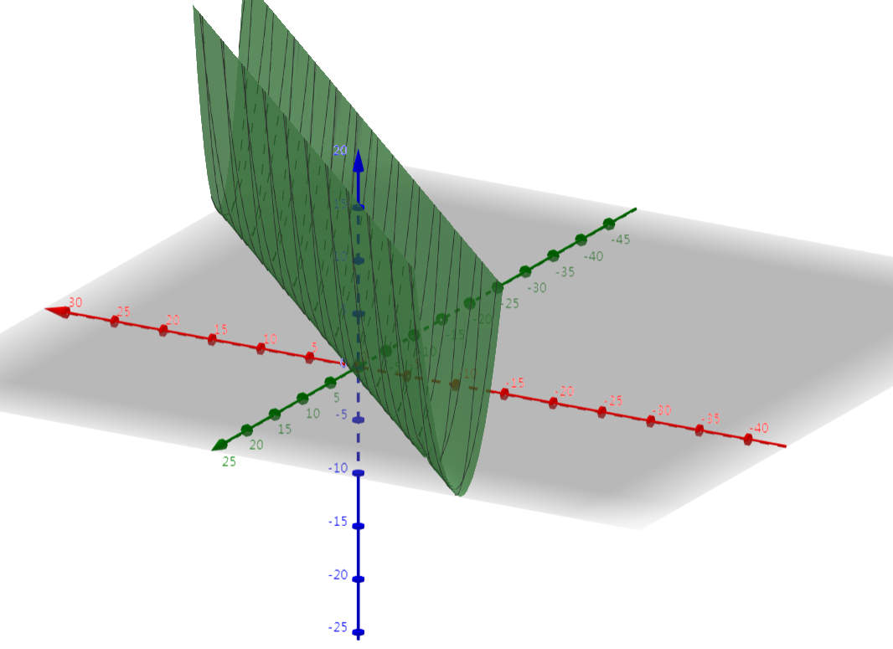
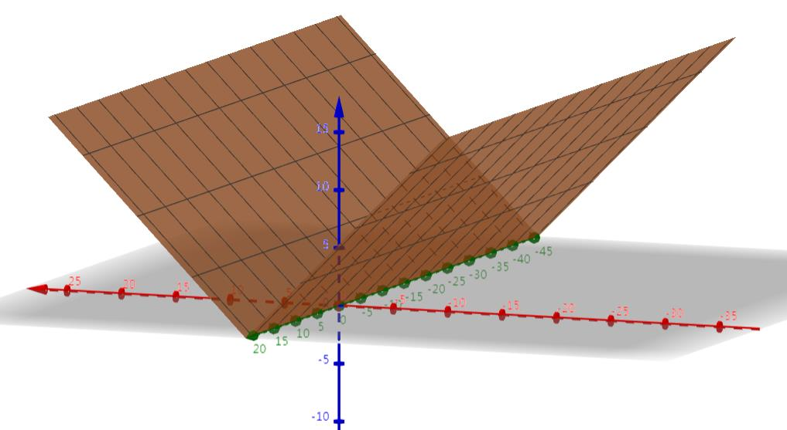
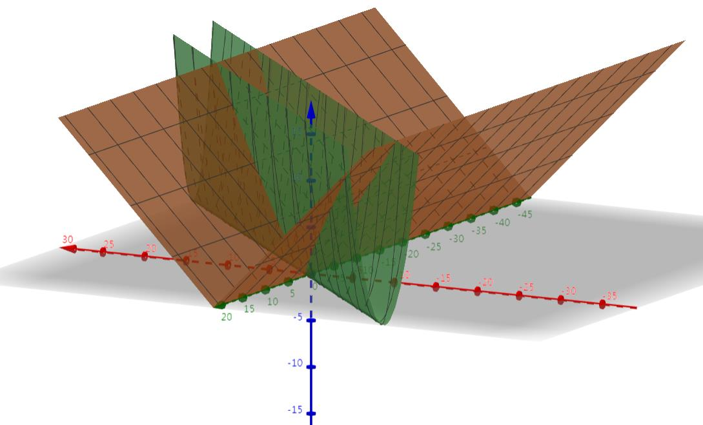
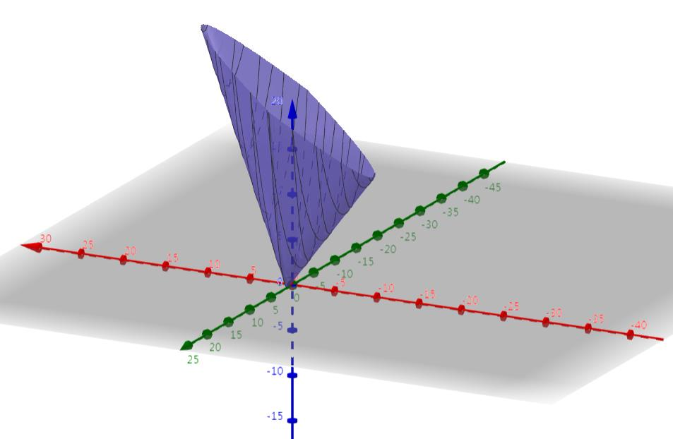
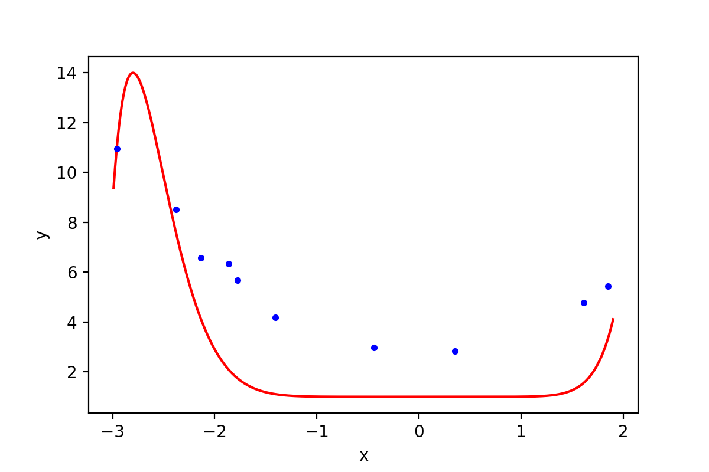
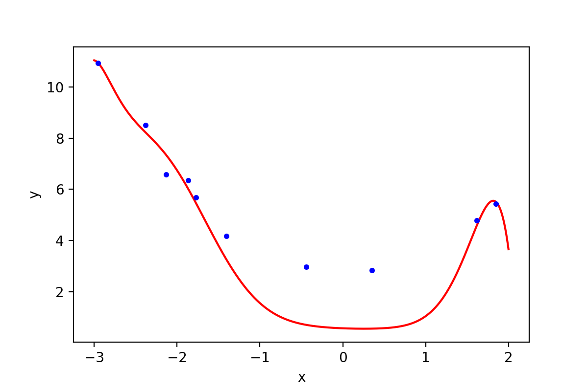
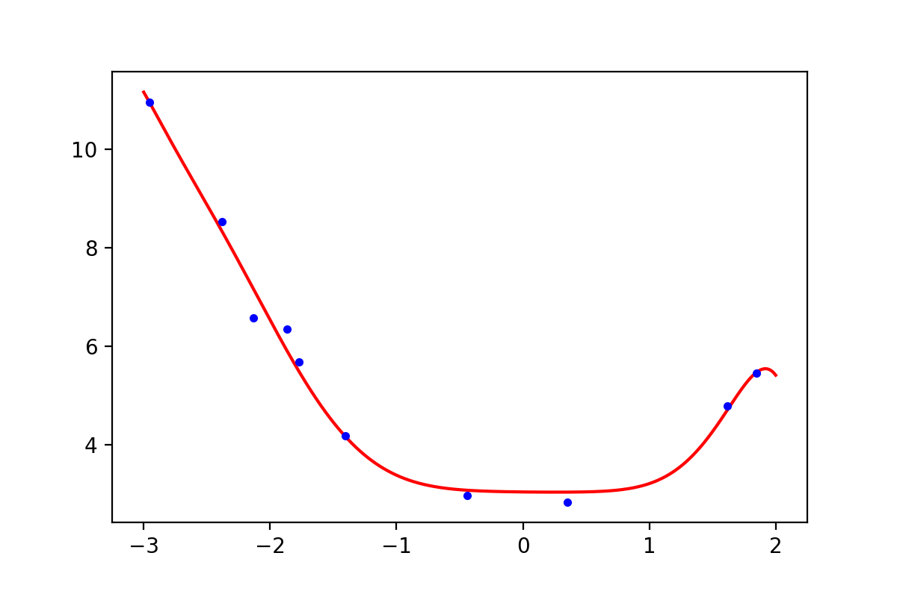
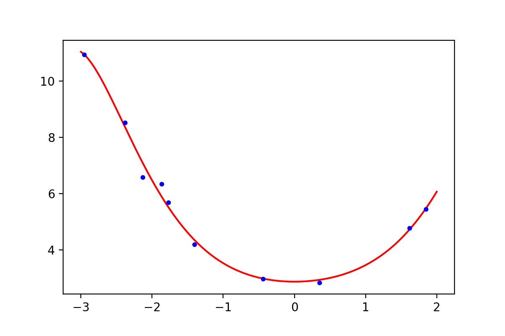
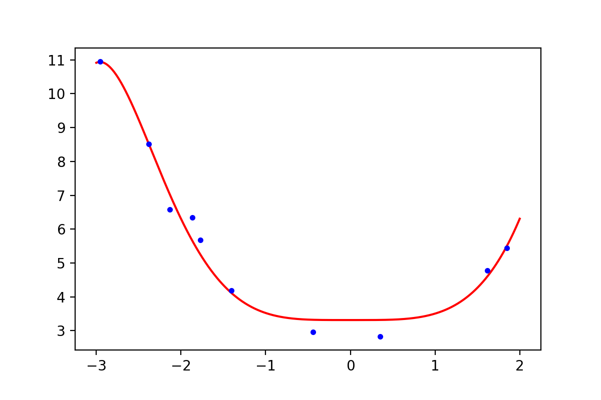
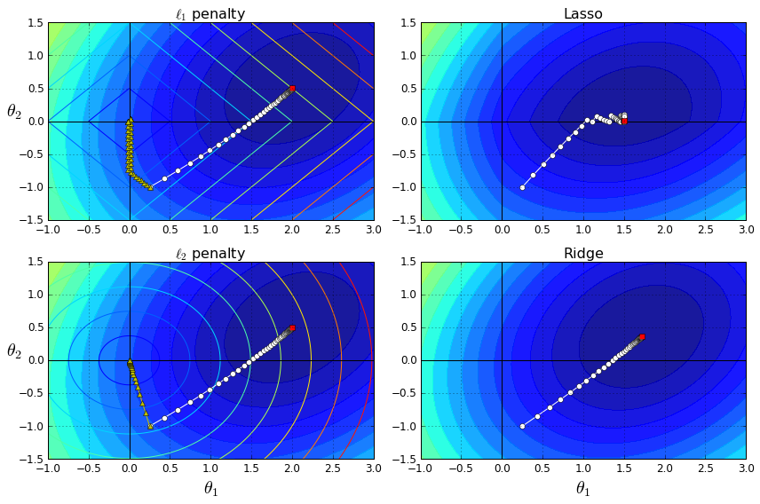

# 正则化的线性回归 —— 岭回归与Lasso回归
摘抄自:
`https://www.cnblogs.com/Belter/p/8536939.html`

<link rel="stylesheet" type="text/css" href="assets/base.css">


<div id="cnblogs_post_body" class="blogpost-body ">
    <p><span style="background-color: #ff6600;">注</span>：正则化是用来防止过拟合的方法。在最开始学习机器学习的课程时，只是觉得这个方法就像某种魔法一样非常神奇的改变了模型的参数。但是一直也无法对其基本原理有一个透彻、直观的理解。直到最近再次接触到这个概念，经过一番苦思冥想后终于有了我自己的理解。</p>
<p>&nbsp;</p>
<h3><span style="color: #99cc00;">0. 正则化（Regularization&nbsp;）</span></h3>
<hr>
<p>前面使用多项式回归，如果多项式最高次项比较大，模型就容易出现过拟合。正则化是一种常见的防止过拟合的方法，一般原理是在代价函数后面加上一个对参数的约束项，这个约束项被叫做<strong>正则化项</strong>（regularizer）。在线性回归模型中，通常有两种不同的正则化项：</p>
<ul>
<li>加上所有参数（不包括<span class="MathJax_Preview" style="color: inherit;"></span><span class="MathJax" id="MathJax-Element-1-Frame" tabindex="0" data-mathml="<math xmlns=&quot;http://www.w3.org/1998/Math/MathML&quot;><msub><mi>&amp;#x03B8;</mi><mn>0</mn></msub></math>" role="presentation" style="position: relative;"><nobr aria-hidden="true"><span class="math" id="MathJax-Span-1" style="width: 1.115em; display: inline-block;"><span style="display: inline-block; position: relative; width: 0.881em; height: 0px; font-size: 122%;"><span style="position: absolute; clip: rect(1.291em, 1000.88em, 2.52em, -999.997em); top: -2.163em; left: 0em;"><span class="mrow" id="MathJax-Span-2"><span class="msubsup" id="MathJax-Span-3"><span style="display: inline-block; position: relative; width: 0.881em; height: 0px;"><span style="position: absolute; clip: rect(3.106em, 1000.47em, 4.16em, -999.997em); top: -3.978em; left: 0em;"><span class="mi" id="MathJax-Span-4" style="font-family: MathJax_Math-italic;">θ</span><span style="display: inline-block; width: 0px; height: 3.984em;"></span></span><span style="position: absolute; top: -3.803em; left: 0.471em;"><span class="mn" id="MathJax-Span-5" style="font-size: 70.7%; font-family: MathJax_Main;">0</span><span style="display: inline-block; width: 0px; height: 3.984em;"></span></span></span></span></span><span style="display: inline-block; width: 0px; height: 2.169em;"></span></span></span><span style="display: inline-block; overflow: hidden; vertical-align: -0.282em; border-left: 0px solid; width: 0px; height: 1.218em;"></span></span></nobr><span class="MJX_Assistive_MathML" role="presentation"><math xmlns="http://www.w3.org/1998/Math/MathML"><msub><mi>θ</mi><mn>0</mn></msub></math></span></span><script type="math/tex" id="MathJax-Element-1">\theta_0</script>）的绝对值之和，即<span class="MathJax_Preview" style="color: inherit;"></span><span class="MathJax" id="MathJax-Element-2-Frame" tabindex="0" data-mathml="<math xmlns=&quot;http://www.w3.org/1998/Math/MathML&quot;><mi>l</mi><mn>1</mn></math>" role="presentation" style="position: relative;"><nobr aria-hidden="true"><span class="math" id="MathJax-Span-6" style="width: 0.998em; display: inline-block;"><span style="display: inline-block; position: relative; width: 0.823em; height: 0px; font-size: 122%;"><span style="position: absolute; clip: rect(1.291em, 1000.76em, 2.345em, -999.997em); top: -2.163em; left: 0em;"><span class="mrow" id="MathJax-Span-7"><span class="mi" id="MathJax-Span-8" style="font-family: MathJax_Math-italic;">l</span><span class="mn" id="MathJax-Span-9" style="font-family: MathJax_Main;">1</span></span><span style="display: inline-block; width: 0px; height: 2.169em;"></span></span></span><span style="display: inline-block; overflow: hidden; vertical-align: -0.068em; border-left: 0px solid; width: 0px; height: 1.004em;"></span></span></nobr><span class="MJX_Assistive_MathML" role="presentation"><math xmlns="http://www.w3.org/1998/Math/MathML"><mi>l</mi><mn>1</mn></math></span></span><script type="math/tex" id="MathJax-Element-2">l1</script>范数，此时叫做Lasso回归；</li>
<li>加上所有参数（不包括<span class="MathJax_Preview" style="color: inherit;"></span><span class="MathJax" id="MathJax-Element-3-Frame" tabindex="0" data-mathml="<math xmlns=&quot;http://www.w3.org/1998/Math/MathML&quot;><msub><mi>&amp;#x03B8;</mi><mn>0</mn></msub></math>" role="presentation" style="position: relative;"><nobr aria-hidden="true"><span class="math" id="MathJax-Span-10" style="width: 1.115em; display: inline-block;"><span style="display: inline-block; position: relative; width: 0.881em; height: 0px; font-size: 122%;"><span style="position: absolute; clip: rect(1.291em, 1000.88em, 2.52em, -999.997em); top: -2.163em; left: 0em;"><span class="mrow" id="MathJax-Span-11"><span class="msubsup" id="MathJax-Span-12"><span style="display: inline-block; position: relative; width: 0.881em; height: 0px;"><span style="position: absolute; clip: rect(3.106em, 1000.47em, 4.16em, -999.997em); top: -3.978em; left: 0em;"><span class="mi" id="MathJax-Span-13" style="font-family: MathJax_Math-italic;">θ</span><span style="display: inline-block; width: 0px; height: 3.984em;"></span></span><span style="position: absolute; top: -3.803em; left: 0.471em;"><span class="mn" id="MathJax-Span-14" style="font-size: 70.7%; font-family: MathJax_Main;">0</span><span style="display: inline-block; width: 0px; height: 3.984em;"></span></span></span></span></span><span style="display: inline-block; width: 0px; height: 2.169em;"></span></span></span><span style="display: inline-block; overflow: hidden; vertical-align: -0.282em; border-left: 0px solid; width: 0px; height: 1.218em;"></span></span></nobr><span class="MJX_Assistive_MathML" role="presentation"><math xmlns="http://www.w3.org/1998/Math/MathML"><msub><mi>θ</mi><mn>0</mn></msub></math></span></span><script type="math/tex" id="MathJax-Element-3">\theta_0</script>）的平方和，即<span class="MathJax_Preview" style="color: inherit;"></span><span class="MathJax" id="MathJax-Element-4-Frame" tabindex="0" data-mathml="<math xmlns=&quot;http://www.w3.org/1998/Math/MathML&quot;><mi>l</mi><mn>2</mn></math>" role="presentation" style="position: relative;"><nobr aria-hidden="true"><span class="math" id="MathJax-Span-15" style="width: 0.998em; display: inline-block;"><span style="display: inline-block; position: relative; width: 0.823em; height: 0px; font-size: 122%;"><span style="position: absolute; clip: rect(1.291em, 1000.76em, 2.345em, -999.997em); top: -2.163em; left: 0em;"><span class="mrow" id="MathJax-Span-16"><span class="mi" id="MathJax-Span-17" style="font-family: MathJax_Math-italic;">l</span><span class="mn" id="MathJax-Span-18" style="font-family: MathJax_Main;">2</span></span><span style="display: inline-block; width: 0px; height: 2.169em;"></span></span></span><span style="display: inline-block; overflow: hidden; vertical-align: -0.068em; border-left: 0px solid; width: 0px; height: 1.004em;"></span></span></nobr><span class="MJX_Assistive_MathML" role="presentation"><math xmlns="http://www.w3.org/1998/Math/MathML"><mi>l</mi><mn>2</mn></math></span></span><script type="math/tex" id="MathJax-Element-4">l2</script>范数，此时叫做岭回归.</li>
</ul>
<p>看过不少关于正则化原理的解释，但是都没有获得一个比较直观的理解。下面用代价函数的图像以及正则化项的图像来帮助解释正则化之所以起作用的原因。</p>
<h4>0.1 代价函数的图像</h4>
<p>为了可视化，选择直线方程进行优化。假设一个直线方程以及代价函数如下：</p>
<p><span class="MathJax_Preview" style="color: inherit;"></span><span class="MathJax" id="MathJax-Element-5-Frame" tabindex="0" data-mathml="<math xmlns=&quot;http://www.w3.org/1998/Math/MathML&quot;><msub><mrow class=&quot;MJX-TeXAtom-ORD&quot;><mover><mi>h</mi><mo stretchy=&quot;false&quot;>&amp;#x005E;</mo></mover></mrow><mrow class=&quot;MJX-TeXAtom-ORD&quot;><mi>&amp;#x03B8;</mi></mrow></msub><mo>=</mo><msub><mi>&amp;#x03B8;</mi><mn>0</mn></msub><mo>+</mo><msub><mi>&amp;#x03B8;</mi><mn>1</mn></msub><mi>x</mi></math>" role="presentation" style="position: relative;"><nobr aria-hidden="true"><span class="math" id="MathJax-Span-19" style="width: 7.263em; display: inline-block;"><span style="display: inline-block; position: relative; width: 5.916em; height: 0px; font-size: 122%;"><span style="position: absolute; clip: rect(0.998em, 1005.86em, 2.52em, -999.997em); top: -2.163em; left: 0em;"><span class="mrow" id="MathJax-Span-20"><span class="msubsup" id="MathJax-Span-21"><span style="display: inline-block; position: relative; width: 0.998em; height: 0px;"><span style="position: absolute; clip: rect(2.813em, 1000.53em, 4.16em, -999.997em); top: -3.978em; left: 0em;"><span class="texatom" id="MathJax-Span-22"><span class="mrow" id="MathJax-Span-23"><span class="munderover" id="MathJax-Span-24"><span style="display: inline-block; position: relative; width: 0.588em; height: 0px;"><span style="position: absolute; clip: rect(3.106em, 1000.53em, 4.16em, -999.997em); top: -3.978em; left: 0em;"><span class="mi" id="MathJax-Span-25" style="font-family: MathJax_Math-italic;">h</span><span style="display: inline-block; width: 0px; height: 3.984em;"></span></span><span style="position: absolute; clip: rect(3.106em, 1000.41em, 3.633em, -999.997em); top: -4.271em; left: 0.003em;"><span class="mo" id="MathJax-Span-26" style="font-family: MathJax_Main;">^</span><span style="display: inline-block; width: 0px; height: 3.984em;"></span></span></span></span></span></span><span style="display: inline-block; width: 0px; height: 3.984em;"></span></span><span style="position: absolute; top: -3.803em; left: 0.588em;"><span class="texatom" id="MathJax-Span-27"><span class="mrow" id="MathJax-Span-28"><span class="mi" id="MathJax-Span-29" style="font-size: 70.7%; font-family: MathJax_Math-italic;">θ</span></span></span><span style="display: inline-block; width: 0px; height: 3.984em;"></span></span></span></span><span class="mo" id="MathJax-Span-30" style="font-family: MathJax_Main; padding-left: 0.296em;">=</span><span class="msubsup" id="MathJax-Span-31" style="padding-left: 0.296em;"><span style="display: inline-block; position: relative; width: 0.881em; height: 0px;"><span style="position: absolute; clip: rect(3.106em, 1000.47em, 4.16em, -999.997em); top: -3.978em; left: 0em;"><span class="mi" id="MathJax-Span-32" style="font-family: MathJax_Math-italic;">θ</span><span style="display: inline-block; width: 0px; height: 3.984em;"></span></span><span style="position: absolute; top: -3.803em; left: 0.471em;"><span class="mn" id="MathJax-Span-33" style="font-size: 70.7%; font-family: MathJax_Main;">0</span><span style="display: inline-block; width: 0px; height: 3.984em;"></span></span></span></span><span class="mo" id="MathJax-Span-34" style="font-family: MathJax_Main; padding-left: 0.237em;">+</span><span class="msubsup" id="MathJax-Span-35" style="padding-left: 0.237em;"><span style="display: inline-block; position: relative; width: 0.881em; height: 0px;"><span style="position: absolute; clip: rect(3.106em, 1000.47em, 4.16em, -999.997em); top: -3.978em; left: 0em;"><span class="mi" id="MathJax-Span-36" style="font-family: MathJax_Math-italic;">θ</span><span style="display: inline-block; width: 0px; height: 3.984em;"></span></span><span style="position: absolute; top: -3.803em; left: 0.471em;"><span class="mn" id="MathJax-Span-37" style="font-size: 70.7%; font-family: MathJax_Main;">1</span><span style="display: inline-block; width: 0px; height: 3.984em;"></span></span></span></span><span class="mi" id="MathJax-Span-38" style="font-family: MathJax_Math-italic;">x</span></span><span style="display: inline-block; width: 0px; height: 2.169em;"></span></span></span><span style="display: inline-block; overflow: hidden; vertical-align: -0.282em; border-left: 0px solid; width: 0px; height: 1.575em;"></span></span></nobr><span class="MJX_Assistive_MathML" role="presentation"><math xmlns="http://www.w3.org/1998/Math/MathML"><msub><mrow class="MJX-TeXAtom-ORD"><mover><mi>h</mi><mo stretchy="false">^</mo></mover></mrow><mrow class="MJX-TeXAtom-ORD"><mi>θ</mi></mrow></msub><mo>=</mo><msub><mi>θ</mi><mn>0</mn></msub><mo>+</mo><msub><mi>θ</mi><mn>1</mn></msub><mi>x</mi></math></span></span><script type="math/tex" id="MathJax-Element-5">\hat{h}_{\theta} = \theta_0 + \theta_1 x</script>，该方程只有一个特征<span class="MathJax_Preview" style="color: inherit;"></span><span class="MathJax" id="MathJax-Element-6-Frame" tabindex="0" data-mathml="<math xmlns=&quot;http://www.w3.org/1998/Math/MathML&quot;><mi>x</mi></math>" role="presentation" style="position: relative;"><nobr aria-hidden="true"><span class="math" id="MathJax-Span-39" style="width: 0.764em; display: inline-block;"><span style="display: inline-block; position: relative; width: 0.588em; height: 0px; font-size: 122%;"><span style="position: absolute; clip: rect(1.525em, 1000.53em, 2.345em, -999.997em); top: -2.163em; left: 0em;"><span class="mrow" id="MathJax-Span-40"><span class="mi" id="MathJax-Span-41" style="font-family: MathJax_Math-italic;">x</span></span><span style="display: inline-block; width: 0px; height: 2.169em;"></span></span></span><span style="display: inline-block; overflow: hidden; vertical-align: -0.068em; border-left: 0px solid; width: 0px; height: 0.718em;"></span></span></nobr><span class="MJX_Assistive_MathML" role="presentation"><math xmlns="http://www.w3.org/1998/Math/MathML"><mi>x</mi></math></span></span><script type="math/tex" id="MathJax-Element-6">x</script>，两个参数<span class="MathJax_Preview" style="color: inherit;"></span><span class="MathJax" id="MathJax-Element-7-Frame" tabindex="0" data-mathml="<math xmlns=&quot;http://www.w3.org/1998/Math/MathML&quot;><msub><mi>&amp;#x03B8;</mi><mn>0</mn></msub></math>" role="presentation" style="position: relative;"><nobr aria-hidden="true"><span class="math" id="MathJax-Span-42" style="width: 1.115em; display: inline-block;"><span style="display: inline-block; position: relative; width: 0.881em; height: 0px; font-size: 122%;"><span style="position: absolute; clip: rect(1.291em, 1000.88em, 2.52em, -999.997em); top: -2.163em; left: 0em;"><span class="mrow" id="MathJax-Span-43"><span class="msubsup" id="MathJax-Span-44"><span style="display: inline-block; position: relative; width: 0.881em; height: 0px;"><span style="position: absolute; clip: rect(3.106em, 1000.47em, 4.16em, -999.997em); top: -3.978em; left: 0em;"><span class="mi" id="MathJax-Span-45" style="font-family: MathJax_Math-italic;">θ</span><span style="display: inline-block; width: 0px; height: 3.984em;"></span></span><span style="position: absolute; top: -3.803em; left: 0.471em;"><span class="mn" id="MathJax-Span-46" style="font-size: 70.7%; font-family: MathJax_Main;">0</span><span style="display: inline-block; width: 0px; height: 3.984em;"></span></span></span></span></span><span style="display: inline-block; width: 0px; height: 2.169em;"></span></span></span><span style="display: inline-block; overflow: hidden; vertical-align: -0.282em; border-left: 0px solid; width: 0px; height: 1.218em;"></span></span></nobr><span class="MJX_Assistive_MathML" role="presentation"><math xmlns="http://www.w3.org/1998/Math/MathML"><msub><mi>θ</mi><mn>0</mn></msub></math></span></span><script type="math/tex" id="MathJax-Element-7">\theta_0</script>和<span class="MathJax_Preview" style="color: inherit;"></span><span class="MathJax" id="MathJax-Element-8-Frame" tabindex="0" data-mathml="<math xmlns=&quot;http://www.w3.org/1998/Math/MathML&quot;><msub><mi>&amp;#x03B8;</mi><mn>1</mn></msub></math>" role="presentation" style="position: relative;"><nobr aria-hidden="true"><span class="math" id="MathJax-Span-47" style="width: 1.115em; display: inline-block;"><span style="display: inline-block; position: relative; width: 0.881em; height: 0px; font-size: 122%;"><span style="position: absolute; clip: rect(1.291em, 1000.88em, 2.52em, -999.997em); top: -2.163em; left: 0em;"><span class="mrow" id="MathJax-Span-48"><span class="msubsup" id="MathJax-Span-49"><span style="display: inline-block; position: relative; width: 0.881em; height: 0px;"><span style="position: absolute; clip: rect(3.106em, 1000.47em, 4.16em, -999.997em); top: -3.978em; left: 0em;"><span class="mi" id="MathJax-Span-50" style="font-family: MathJax_Math-italic;">θ</span><span style="display: inline-block; width: 0px; height: 3.984em;"></span></span><span style="position: absolute; top: -3.803em; left: 0.471em;"><span class="mn" id="MathJax-Span-51" style="font-size: 70.7%; font-family: MathJax_Main;">1</span><span style="display: inline-block; width: 0px; height: 3.984em;"></span></span></span></span></span><span style="display: inline-block; width: 0px; height: 2.169em;"></span></span></span><span style="display: inline-block; overflow: hidden; vertical-align: -0.282em; border-left: 0px solid; width: 0px; height: 1.218em;"></span></span></nobr><span class="MJX_Assistive_MathML" role="presentation"><math xmlns="http://www.w3.org/1998/Math/MathML"><msub><mi>θ</mi><mn>1</mn></msub></math></span></span><script type="math/tex" id="MathJax-Element-8">\theta_1</script></p>
<p><span class="MathJax_Preview" style="color: inherit;"></span><span class="MathJax" id="MathJax-Element-9-Frame" tabindex="0" data-mathml="<math xmlns=&quot;http://www.w3.org/1998/Math/MathML&quot;><mi>J</mi><mo stretchy=&quot;false&quot;>(</mo><mi>&amp;#x03B8;</mi><mo stretchy=&quot;false&quot;>)</mo><mo>=</mo><mfrac><mn>1</mn><mi>m</mi></mfrac><munderover><mo>&amp;#x2211;</mo><mrow class=&quot;MJX-TeXAtom-ORD&quot;><mi>i</mi><mo>=</mo><mn>1</mn></mrow><mrow class=&quot;MJX-TeXAtom-ORD&quot;><mi>m</mi></mrow></munderover><mrow class=&quot;MJX-TeXAtom-ORD&quot;><mo stretchy=&quot;false&quot;>(</mo><msub><mi>&amp;#x03B8;</mi><mn>0</mn></msub><mo>+</mo><msub><mi>&amp;#x03B8;</mi><mn>1</mn></msub><msup><mi>x</mi><mrow class=&quot;MJX-TeXAtom-ORD&quot;><mo stretchy=&quot;false&quot;>(</mo><mi>i</mi><mo stretchy=&quot;false&quot;>)</mo></mrow></msup><mo>&amp;#x2212;</mo><msup><mi>y</mi><mrow class=&quot;MJX-TeXAtom-ORD&quot;><mo stretchy=&quot;false&quot;>(</mo><mi>i</mi><mo stretchy=&quot;false&quot;>)</mo></mrow></msup><msup><mo stretchy=&quot;false&quot;>)</mo><mn>2</mn></msup></mrow></math>" role="presentation" style="position: relative;"><nobr aria-hidden="true"><span class="math" id="MathJax-Span-52" style="width: 18.621em; display: inline-block;"><span style="display: inline-block; position: relative; width: 15.225em; height: 0px; font-size: 122%;"><span style="position: absolute; clip: rect(1.115em, 1015.23em, 2.696em, -999.997em); top: -2.163em; left: 0em;"><span class="mrow" id="MathJax-Span-53"><span class="mi" id="MathJax-Span-54" style="font-family: MathJax_Math-italic;">J<span style="display: inline-block; overflow: hidden; height: 1px; width: 0.061em;"></span></span><span class="mo" id="MathJax-Span-55" style="font-family: MathJax_Main;">(</span><span class="mi" id="MathJax-Span-56" style="font-family: MathJax_Math-italic;">θ</span><span class="mo" id="MathJax-Span-57" style="font-family: MathJax_Main;">)</span><span class="mo" id="MathJax-Span-58" style="font-family: MathJax_Main; padding-left: 0.296em;">=</span><span class="mfrac" id="MathJax-Span-59" style="padding-left: 0.296em;"><span style="display: inline-block; position: relative; width: 0.764em; height: 0px; margin-right: 0.12em; margin-left: 0.12em;"><span style="position: absolute; clip: rect(3.34em, 1000.3em, 4.16em, -999.997em); top: -4.388em; left: 50%; margin-left: -0.173em;"><span class="mn" id="MathJax-Span-60" style="font-size: 70.7%; font-family: MathJax_Main;">1</span><span style="display: inline-block; width: 0px; height: 3.984em;"></span></span><span style="position: absolute; clip: rect(3.516em, 1000.59em, 4.16em, -999.997em); top: -3.627em; left: 50%; margin-left: -0.29em;"><span class="mi" id="MathJax-Span-61" style="font-size: 70.7%; font-family: MathJax_Math-italic;">m</span><span style="display: inline-block; width: 0px; height: 3.984em;"></span></span><span style="position: absolute; clip: rect(0.823em, 1000.76em, 1.232em, -999.997em); top: -1.285em; left: 0em;"><span style="display: inline-block; overflow: hidden; vertical-align: 0em; border-top: 1.3px solid; width: 0.764em; height: 0px;"></span><span style="display: inline-block; width: 0px; height: 1.057em;"></span></span></span></span><span class="munderover" id="MathJax-Span-62" style="padding-left: 0.179em;"><span style="display: inline-block; position: relative; width: 2.286em; height: 0px;"><span style="position: absolute; clip: rect(3.047em, 1001em, 4.394em, -999.997em); top: -3.978em; left: 0em;"><span class="mo" id="MathJax-Span-63" style="font-family: MathJax_Size1; vertical-align: 0em;">∑</span><span style="display: inline-block; width: 0px; height: 3.984em;"></span></span><span style="position: absolute; clip: rect(3.516em, 1000.71em, 4.16em, -999.997em); top: -4.447em; left: 1.057em;"><span class="texatom" id="MathJax-Span-64"><span class="mrow" id="MathJax-Span-65"><span class="mi" id="MathJax-Span-66" style="font-size: 70.7%; font-family: MathJax_Math-italic;">m</span></span></span><span style="display: inline-block; width: 0px; height: 3.984em;"></span></span><span style="position: absolute; clip: rect(3.34em, 1001.23em, 4.16em, -999.997em); top: -3.686em; left: 1.057em;"><span class="texatom" id="MathJax-Span-67"><span class="mrow" id="MathJax-Span-68"><span class="mi" id="MathJax-Span-69" style="font-size: 70.7%; font-family: MathJax_Math-italic;">i</span><span class="mo" id="MathJax-Span-70" style="font-size: 70.7%; font-family: MathJax_Main;">=</span><span class="mn" id="MathJax-Span-71" style="font-size: 70.7%; font-family: MathJax_Main;">1</span></span></span><span style="display: inline-block; width: 0px; height: 3.984em;"></span></span></span></span><span class="texatom" id="MathJax-Span-72" style="padding-left: 0.179em;"><span class="mrow" id="MathJax-Span-73"><span class="mo" id="MathJax-Span-74" style="font-family: MathJax_Main;">(</span><span class="msubsup" id="MathJax-Span-75"><span style="display: inline-block; position: relative; width: 0.881em; height: 0px;"><span style="position: absolute; clip: rect(3.106em, 1000.47em, 4.16em, -999.997em); top: -3.978em; left: 0em;"><span class="mi" id="MathJax-Span-76" style="font-family: MathJax_Math-italic;">θ</span><span style="display: inline-block; width: 0px; height: 3.984em;"></span></span><span style="position: absolute; top: -3.803em; left: 0.471em;"><span class="mn" id="MathJax-Span-77" style="font-size: 70.7%; font-family: MathJax_Main;">0</span><span style="display: inline-block; width: 0px; height: 3.984em;"></span></span></span></span><span class="mo" id="MathJax-Span-78" style="font-family: MathJax_Main; padding-left: 0.237em;">+</span><span class="msubsup" id="MathJax-Span-79" style="padding-left: 0.237em;"><span style="display: inline-block; position: relative; width: 0.881em; height: 0px;"><span style="position: absolute; clip: rect(3.106em, 1000.47em, 4.16em, -999.997em); top: -3.978em; left: 0em;"><span class="mi" id="MathJax-Span-80" style="font-family: MathJax_Math-italic;">θ</span><span style="display: inline-block; width: 0px; height: 3.984em;"></span></span><span style="position: absolute; top: -3.803em; left: 0.471em;"><span class="mn" id="MathJax-Span-81" style="font-size: 70.7%; font-family: MathJax_Main;">1</span><span style="display: inline-block; width: 0px; height: 3.984em;"></span></span></span></span><span class="msubsup" id="MathJax-Span-82"><span style="display: inline-block; position: relative; width: 1.467em; height: 0px;"><span style="position: absolute; clip: rect(3.34em, 1000.53em, 4.16em, -999.997em); top: -3.978em; left: 0em;"><span class="mi" id="MathJax-Span-83" style="font-family: MathJax_Math-italic;">x</span><span style="display: inline-block; width: 0px; height: 3.984em;"></span></span><span style="position: absolute; top: -4.33em; left: 0.588em;"><span class="texatom" id="MathJax-Span-84"><span class="mrow" id="MathJax-Span-85"><span class="mo" id="MathJax-Span-86" style="font-size: 70.7%; font-family: MathJax_Main;">(</span><span class="mi" id="MathJax-Span-87" style="font-size: 70.7%; font-family: MathJax_Math-italic;">i</span><span class="mo" id="MathJax-Span-88" style="font-size: 70.7%; font-family: MathJax_Main;">)</span></span></span><span style="display: inline-block; width: 0px; height: 3.984em;"></span></span></span></span><span class="mo" id="MathJax-Span-89" style="font-family: MathJax_Main; padding-left: 0.237em;">−</span><span class="msubsup" id="MathJax-Span-90" style="padding-left: 0.237em;"><span style="display: inline-block; position: relative; width: 1.408em; height: 0px;"><span style="position: absolute; clip: rect(3.34em, 1000.47em, 4.394em, -999.997em); top: -3.978em; left: 0em;"><span class="mi" id="MathJax-Span-91" style="font-family: MathJax_Math-italic;">y<span style="display: inline-block; overflow: hidden; height: 1px; width: 0.003em;"></span></span><span style="display: inline-block; width: 0px; height: 3.984em;"></span></span><span style="position: absolute; top: -4.33em; left: 0.53em;"><span class="texatom" id="MathJax-Span-92"><span class="mrow" id="MathJax-Span-93"><span class="mo" id="MathJax-Span-94" style="font-size: 70.7%; font-family: MathJax_Main;">(</span><span class="mi" id="MathJax-Span-95" style="font-size: 70.7%; font-family: MathJax_Math-italic;">i</span><span class="mo" id="MathJax-Span-96" style="font-size: 70.7%; font-family: MathJax_Main;">)</span></span></span><span style="display: inline-block; width: 0px; height: 3.984em;"></span></span></span></span><span class="msubsup" id="MathJax-Span-97"><span style="display: inline-block; position: relative; width: 0.823em; height: 0px;"><span style="position: absolute; clip: rect(3.047em, 1000.3em, 4.394em, -999.997em); top: -3.978em; left: 0em;"><span class="mo" id="MathJax-Span-98" style="font-family: MathJax_Main;">)</span><span style="display: inline-block; width: 0px; height: 3.984em;"></span></span><span style="position: absolute; top: -4.33em; left: 0.413em;"><span class="mn" id="MathJax-Span-99" style="font-size: 70.7%; font-family: MathJax_Main;">2</span><span style="display: inline-block; width: 0px; height: 3.984em;"></span></span></span></span></span></span></span><span style="display: inline-block; width: 0px; height: 2.169em;"></span></span></span><span style="display: inline-block; overflow: hidden; vertical-align: -0.496em; border-left: 0px solid; width: 0px; height: 1.646em;"></span></span></nobr><span class="MJX_Assistive_MathML" role="presentation"><math xmlns="http://www.w3.org/1998/Math/MathML"><mi>J</mi><mo stretchy="false">(</mo><mi>θ</mi><mo stretchy="false">)</mo><mo>=</mo><mfrac><mn>1</mn><mi>m</mi></mfrac><munderover><mo>∑</mo><mrow class="MJX-TeXAtom-ORD"><mi>i</mi><mo>=</mo><mn>1</mn></mrow><mrow class="MJX-TeXAtom-ORD"><mi>m</mi></mrow></munderover><mrow class="MJX-TeXAtom-ORD"><mo stretchy="false">(</mo><msub><mi>θ</mi><mn>0</mn></msub><mo>+</mo><msub><mi>θ</mi><mn>1</mn></msub><msup><mi>x</mi><mrow class="MJX-TeXAtom-ORD"><mo stretchy="false">(</mo><mi>i</mi><mo stretchy="false">)</mo></mrow></msup><mo>−</mo><msup><mi>y</mi><mrow class="MJX-TeXAtom-ORD"><mo stretchy="false">(</mo><mi>i</mi><mo stretchy="false">)</mo></mrow></msup><msup><mo stretchy="false">)</mo><mn>2</mn></msup></mrow></math></span></span><script type="math/tex" id="MathJax-Element-9">J(\theta) = \frac{1}{m} \sum_{i=1}^{m}{(\theta_0 + \theta_1 x^{(i)} - y^{(i)})^2}</script>，该代价函数为均方误差函数（MSE），其中<span class="MathJax_Preview" style="color: inherit;"></span><span class="MathJax" id="MathJax-Element-10-Frame" tabindex="0" data-mathml="<math xmlns=&quot;http://www.w3.org/1998/Math/MathML&quot;><mi>m</mi></math>" role="presentation" style="position: relative;"><nobr aria-hidden="true"><span class="math" id="MathJax-Span-100" style="width: 1.115em; display: inline-block;"><span style="display: inline-block; position: relative; width: 0.881em; height: 0px; font-size: 122%;"><span style="position: absolute; clip: rect(1.525em, 1000.88em, 2.345em, -999.997em); top: -2.163em; left: 0em;"><span class="mrow" id="MathJax-Span-101"><span class="mi" id="MathJax-Span-102" style="font-family: MathJax_Math-italic;">m</span></span><span style="display: inline-block; width: 0px; height: 2.169em;"></span></span></span><span style="display: inline-block; overflow: hidden; vertical-align: -0.068em; border-left: 0px solid; width: 0px; height: 0.718em;"></span></span></nobr><span class="MJX_Assistive_MathML" role="presentation"><math xmlns="http://www.w3.org/1998/Math/MathML"><mi>m</mi></math></span></span><script type="math/tex" id="MathJax-Element-10">m</script>表示样本量.</p>
<p>为了保持简单，只取一个样本点<span class="MathJax_Preview" style="color: inherit;"></span><span class="MathJax" id="MathJax-Element-11-Frame" tabindex="0" data-mathml="<math xmlns=&quot;http://www.w3.org/1998/Math/MathML&quot;><mo stretchy=&quot;false&quot;>(</mo><mn>1</mn><mo>,</mo><mn>1</mn><mo stretchy=&quot;false&quot;>)</mo></math>" role="presentation" style="position: relative;"><nobr aria-hidden="true"><span class="math" id="MathJax-Span-103" style="width: 2.755em; display: inline-block;"><span style="display: inline-block; position: relative; width: 2.228em; height: 0px; font-size: 122%;"><span style="position: absolute; clip: rect(1.232em, 1002.11em, 2.579em, -999.997em); top: -2.163em; left: 0em;"><span class="mrow" id="MathJax-Span-104"><span class="mo" id="MathJax-Span-105" style="font-family: MathJax_Main;">(</span><span class="mn" id="MathJax-Span-106" style="font-family: MathJax_Main;">1</span><span class="mo" id="MathJax-Span-107" style="font-family: MathJax_Main;">,</span><span class="mn" id="MathJax-Span-108" style="font-family: MathJax_Main; padding-left: 0.179em;">1</span><span class="mo" id="MathJax-Span-109" style="font-family: MathJax_Main;">)</span></span><span style="display: inline-block; width: 0px; height: 2.169em;"></span></span></span><span style="display: inline-block; overflow: hidden; vertical-align: -0.354em; border-left: 0px solid; width: 0px; height: 1.361em;"></span></span></nobr><span class="MJX_Assistive_MathML" role="presentation"><math xmlns="http://www.w3.org/1998/Math/MathML"><mo stretchy="false">(</mo><mn>1</mn><mo>,</mo><mn>1</mn><mo stretchy="false">)</mo></math></span></span><script type="math/tex" id="MathJax-Element-11">(1, 1)</script>代入上面的代价函数方程中，可得<span class="MathJax_Preview" style="color: inherit;"></span><span class="MathJax" id="MathJax-Element-12-Frame" tabindex="0" data-mathml="<math xmlns=&quot;http://www.w3.org/1998/Math/MathML&quot;><mi>J</mi><mo stretchy=&quot;false&quot;>(</mo><mi>&amp;#x03B8;</mi><mo stretchy=&quot;false&quot;>)</mo><mo>=</mo><mo stretchy=&quot;false&quot;>(</mo><msub><mi>&amp;#x03B8;</mi><mn>0</mn></msub><mo>+</mo><msub><mi>&amp;#x03B8;</mi><mn>1</mn></msub><mo>&amp;#x2212;</mo><mn>1</mn><msup><mo stretchy=&quot;false&quot;>)</mo><mn>2</mn></msup></math>" role="presentation" style="position: relative;"><nobr aria-hidden="true"><span class="math" id="MathJax-Span-110" style="width: 11.244em; display: inline-block;"><span style="display: inline-block; position: relative; width: 9.195em; height: 0px; font-size: 122%;"><span style="position: absolute; clip: rect(1.174em, 1009.2em, 2.579em, -999.997em); top: -2.163em; left: 0em;"><span class="mrow" id="MathJax-Span-111"><span class="mi" id="MathJax-Span-112" style="font-family: MathJax_Math-italic;">J<span style="display: inline-block; overflow: hidden; height: 1px; width: 0.061em;"></span></span><span class="mo" id="MathJax-Span-113" style="font-family: MathJax_Main;">(</span><span class="mi" id="MathJax-Span-114" style="font-family: MathJax_Math-italic;">θ</span><span class="mo" id="MathJax-Span-115" style="font-family: MathJax_Main;">)</span><span class="mo" id="MathJax-Span-116" style="font-family: MathJax_Main; padding-left: 0.296em;">=</span><span class="mo" id="MathJax-Span-117" style="font-family: MathJax_Main; padding-left: 0.296em;">(</span><span class="msubsup" id="MathJax-Span-118"><span style="display: inline-block; position: relative; width: 0.881em; height: 0px;"><span style="position: absolute; clip: rect(3.106em, 1000.47em, 4.16em, -999.997em); top: -3.978em; left: 0em;"><span class="mi" id="MathJax-Span-119" style="font-family: MathJax_Math-italic;">θ</span><span style="display: inline-block; width: 0px; height: 3.984em;"></span></span><span style="position: absolute; top: -3.803em; left: 0.471em;"><span class="mn" id="MathJax-Span-120" style="font-size: 70.7%; font-family: MathJax_Main;">0</span><span style="display: inline-block; width: 0px; height: 3.984em;"></span></span></span></span><span class="mo" id="MathJax-Span-121" style="font-family: MathJax_Main; padding-left: 0.237em;">+</span><span class="msubsup" id="MathJax-Span-122" style="padding-left: 0.237em;"><span style="display: inline-block; position: relative; width: 0.881em; height: 0px;"><span style="position: absolute; clip: rect(3.106em, 1000.47em, 4.16em, -999.997em); top: -3.978em; left: 0em;"><span class="mi" id="MathJax-Span-123" style="font-family: MathJax_Math-italic;">θ</span><span style="display: inline-block; width: 0px; height: 3.984em;"></span></span><span style="position: absolute; top: -3.803em; left: 0.471em;"><span class="mn" id="MathJax-Span-124" style="font-size: 70.7%; font-family: MathJax_Main;">1</span><span style="display: inline-block; width: 0px; height: 3.984em;"></span></span></span></span><span class="mo" id="MathJax-Span-125" style="font-family: MathJax_Main; padding-left: 0.237em;">−</span><span class="mn" id="MathJax-Span-126" style="font-family: MathJax_Main; padding-left: 0.237em;">1</span><span class="msubsup" id="MathJax-Span-127"><span style="display: inline-block; position: relative; width: 0.823em; height: 0px;"><span style="position: absolute; clip: rect(3.047em, 1000.3em, 4.394em, -999.997em); top: -3.978em; left: 0em;"><span class="mo" id="MathJax-Span-128" style="font-family: MathJax_Main;">)</span><span style="display: inline-block; width: 0px; height: 3.984em;"></span></span><span style="position: absolute; top: -4.33em; left: 0.413em;"><span class="mn" id="MathJax-Span-129" style="font-size: 70.7%; font-family: MathJax_Main;">2</span><span style="display: inline-block; width: 0px; height: 3.984em;"></span></span></span></span></span><span style="display: inline-block; width: 0px; height: 2.169em;"></span></span></span><span style="display: inline-block; overflow: hidden; vertical-align: -0.354em; border-left: 0px solid; width: 0px; height: 1.504em;"></span></span></nobr><span class="MJX_Assistive_MathML" role="presentation"><math xmlns="http://www.w3.org/1998/Math/MathML"><mi>J</mi><mo stretchy="false">(</mo><mi>θ</mi><mo stretchy="false">)</mo><mo>=</mo><mo stretchy="false">(</mo><msub><mi>θ</mi><mn>0</mn></msub><mo>+</mo><msub><mi>θ</mi><mn>1</mn></msub><mo>−</mo><mn>1</mn><msup><mo stretchy="false">)</mo><mn>2</mn></msup></math></span></span><script type="math/tex" id="MathJax-Element-12">J(\theta) = (\theta_0 + \theta_1 - 1)^2</script>. 该式是一个二元一次方程，可以在3维空间中作图（下面利用网站<a href="https://www.geogebra.org/3d" target="_blank">GeoGebra</a>画出该方程的图像）：</p>
<p></p>
<p><span style="font-family: 'courier new', courier;">图0-1，代入样本点<span class="MathJax_Preview" style="color: inherit;"></span><span class="MathJax" id="MathJax-Element-13-Frame" tabindex="0" data-mathml="<math xmlns=&quot;http://www.w3.org/1998/Math/MathML&quot;><mo stretchy=&quot;false&quot;>(</mo><mn>1</mn><mo>,</mo><mn>1</mn><mo stretchy=&quot;false&quot;>)</mo></math>" role="presentation" style="position: relative;"><nobr aria-hidden="true"><span class="math" id="MathJax-Span-130" style="width: 2.755em; display: inline-block;"><span style="display: inline-block; position: relative; width: 2.228em; height: 0px; font-size: 122%;"><span style="position: absolute; clip: rect(1.232em, 1002.11em, 2.579em, -999.997em); top: -2.163em; left: 0em;"><span class="mrow" id="MathJax-Span-131"><span class="mo" id="MathJax-Span-132" style="font-family: MathJax_Main;">(</span><span class="mn" id="MathJax-Span-133" style="font-family: MathJax_Main;">1</span><span class="mo" id="MathJax-Span-134" style="font-family: MathJax_Main;">,</span><span class="mn" id="MathJax-Span-135" style="font-family: MathJax_Main; padding-left: 0.179em;">1</span><span class="mo" id="MathJax-Span-136" style="font-family: MathJax_Main;">)</span></span><span style="display: inline-block; width: 0px; height: 2.169em;"></span></span></span><span style="display: inline-block; overflow: hidden; vertical-align: -0.354em; border-left: 0px solid; width: 0px; height: 1.361em;"></span></span></nobr><span class="MJX_Assistive_MathML" role="presentation"><math xmlns="http://www.w3.org/1998/Math/MathML"><mo stretchy="false">(</mo><mn>1</mn><mo>,</mo><mn>1</mn><mo stretchy="false">)</mo></math></span></span><script type="math/tex" id="MathJax-Element-13">(1, 1)</script>后的代价函数MSE的图像</span></p>
<p>由于多个样本点的代价函数是所有样本点代价函数之和，且不同的样本点只是相当于改变了代价函数中两个变量的参数（此时<span class="MathJax_Preview" style="color: inherit;"></span><span class="MathJax" id="MathJax-Element-14-Frame" tabindex="0" data-mathml="<math xmlns=&quot;http://www.w3.org/1998/Math/MathML&quot;><msub><mi>&amp;#x03B8;</mi><mn>0</mn></msub></math>" role="presentation" style="position: relative;"><nobr aria-hidden="true"><span class="math" id="MathJax-Span-137" style="width: 1.115em; display: inline-block;"><span style="display: inline-block; position: relative; width: 0.881em; height: 0px; font-size: 122%;"><span style="position: absolute; clip: rect(1.291em, 1000.88em, 2.52em, -999.997em); top: -2.163em; left: 0em;"><span class="mrow" id="MathJax-Span-138"><span class="msubsup" id="MathJax-Span-139"><span style="display: inline-block; position: relative; width: 0.881em; height: 0px;"><span style="position: absolute; clip: rect(3.106em, 1000.47em, 4.16em, -999.997em); top: -3.978em; left: 0em;"><span class="mi" id="MathJax-Span-140" style="font-family: MathJax_Math-italic;">θ</span><span style="display: inline-block; width: 0px; height: 3.984em;"></span></span><span style="position: absolute; top: -3.803em; left: 0.471em;"><span class="mn" id="MathJax-Span-141" style="font-size: 70.7%; font-family: MathJax_Main;">0</span><span style="display: inline-block; width: 0px; height: 3.984em;"></span></span></span></span></span><span style="display: inline-block; width: 0px; height: 2.169em;"></span></span></span><span style="display: inline-block; overflow: hidden; vertical-align: -0.282em; border-left: 0px solid; width: 0px; height: 1.218em;"></span></span></nobr><span class="MJX_Assistive_MathML" role="presentation"><math xmlns="http://www.w3.org/1998/Math/MathML"><msub><mi>θ</mi><mn>0</mn></msub></math></span></span><script type="math/tex" id="MathJax-Element-14">\theta_0</script>和<span class="MathJax_Preview" style="color: inherit;"></span><span class="MathJax" id="MathJax-Element-15-Frame" tabindex="0" data-mathml="<math xmlns=&quot;http://www.w3.org/1998/Math/MathML&quot;><msub><mi>&amp;#x03B8;</mi><mn>1</mn></msub></math>" role="presentation" style="position: relative;"><nobr aria-hidden="true"><span class="math" id="MathJax-Span-142" style="width: 1.115em; display: inline-block;"><span style="display: inline-block; position: relative; width: 0.881em; height: 0px; font-size: 122%;"><span style="position: absolute; clip: rect(1.291em, 1000.88em, 2.52em, -999.997em); top: -2.163em; left: 0em;"><span class="mrow" id="MathJax-Span-143"><span class="msubsup" id="MathJax-Span-144"><span style="display: inline-block; position: relative; width: 0.881em; height: 0px;"><span style="position: absolute; clip: rect(3.106em, 1000.47em, 4.16em, -999.997em); top: -3.978em; left: 0em;"><span class="mi" id="MathJax-Span-145" style="font-family: MathJax_Math-italic;">θ</span><span style="display: inline-block; width: 0px; height: 3.984em;"></span></span><span style="position: absolute; top: -3.803em; left: 0.471em;"><span class="mn" id="MathJax-Span-146" style="font-size: 70.7%; font-family: MathJax_Main;">1</span><span style="display: inline-block; width: 0px; height: 3.984em;"></span></span></span></span></span><span style="display: inline-block; width: 0px; height: 2.169em;"></span></span></span><span style="display: inline-block; overflow: hidden; vertical-align: -0.282em; border-left: 0px solid; width: 0px; height: 1.218em;"></span></span></nobr><span class="MJX_Assistive_MathML" role="presentation"><math xmlns="http://www.w3.org/1998/Math/MathML"><msub><mi>θ</mi><mn>1</mn></msub></math></span></span><script type="math/tex" id="MathJax-Element-15">\theta_1</script>是变量，样本点的取值是参数）。因此多样本的代价函数MSE的图像只会在图0-1上发生缩放和平移，而不会发生过大的形变。</p>
<p>对于坐标轴，表示如下：</p>
<ul>
<li>使用<span class="MathJax_Preview" style="color: inherit;"></span><span class="MathJax" id="MathJax-Element-16-Frame" tabindex="0" data-mathml="<math xmlns=&quot;http://www.w3.org/1998/Math/MathML&quot;><mi>J</mi></math>" role="presentation" style="position: relative;"><nobr aria-hidden="true"><span class="math" id="MathJax-Span-147" style="width: 0.823em; display: inline-block;"><span style="display: inline-block; position: relative; width: 0.647em; height: 0px; font-size: 122%;"><span style="position: absolute; clip: rect(1.291em, 1000.65em, 2.345em, -999.997em); top: -2.163em; left: 0em;"><span class="mrow" id="MathJax-Span-148"><span class="mi" id="MathJax-Span-149" style="font-family: MathJax_Math-italic;">J<span style="display: inline-block; overflow: hidden; height: 1px; width: 0.061em;"></span></span></span><span style="display: inline-block; width: 0px; height: 2.169em;"></span></span></span><span style="display: inline-block; overflow: hidden; vertical-align: -0.068em; border-left: 0px solid; width: 0px; height: 1.004em;"></span></span></nobr><span class="MJX_Assistive_MathML" role="presentation"><math xmlns="http://www.w3.org/1998/Math/MathML"><mi>J</mi></math></span></span><script type="math/tex" id="MathJax-Element-16">J</script>轴表示蓝色轴线，上方为正向；</li>
<li>使用<span class="MathJax_Preview" style="color: inherit;"></span><span class="MathJax" id="MathJax-Element-17-Frame" tabindex="0" data-mathml="<math xmlns=&quot;http://www.w3.org/1998/Math/MathML&quot;><msub><mi>&amp;#x03B8;</mi><mn>1</mn></msub></math>" role="presentation" style="position: relative;"><nobr aria-hidden="true"><span class="math" id="MathJax-Span-150" style="width: 1.115em; display: inline-block;"><span style="display: inline-block; position: relative; width: 0.881em; height: 0px; font-size: 122%;"><span style="position: absolute; clip: rect(1.291em, 1000.88em, 2.52em, -999.997em); top: -2.163em; left: 0em;"><span class="mrow" id="MathJax-Span-151"><span class="msubsup" id="MathJax-Span-152"><span style="display: inline-block; position: relative; width: 0.881em; height: 0px;"><span style="position: absolute; clip: rect(3.106em, 1000.47em, 4.16em, -999.997em); top: -3.978em; left: 0em;"><span class="mi" id="MathJax-Span-153" style="font-family: MathJax_Math-italic;">θ</span><span style="display: inline-block; width: 0px; height: 3.984em;"></span></span><span style="position: absolute; top: -3.803em; left: 0.471em;"><span class="mn" id="MathJax-Span-154" style="font-size: 70.7%; font-family: MathJax_Main;">1</span><span style="display: inline-block; width: 0px; height: 3.984em;"></span></span></span></span></span><span style="display: inline-block; width: 0px; height: 2.169em;"></span></span></span><span style="display: inline-block; overflow: hidden; vertical-align: -0.282em; border-left: 0px solid; width: 0px; height: 1.218em;"></span></span></nobr><span class="MJX_Assistive_MathML" role="presentation"><math xmlns="http://www.w3.org/1998/Math/MathML"><msub><mi>θ</mi><mn>1</mn></msub></math></span></span><script type="math/tex" id="MathJax-Element-17">\theta_1</script>表示红色轴线，左边为正向；</li>
<li>使用<span class="MathJax_Preview" style="color: inherit;"></span><span class="MathJax" id="MathJax-Element-18-Frame" tabindex="0" data-mathml="<math xmlns=&quot;http://www.w3.org/1998/Math/MathML&quot;><msub><mi>&amp;#x03B8;</mi><mn>0</mn></msub></math>" role="presentation" style="position: relative;"><nobr aria-hidden="true"><span class="math" id="MathJax-Span-155" style="width: 1.115em; display: inline-block;"><span style="display: inline-block; position: relative; width: 0.881em; height: 0px; font-size: 122%;"><span style="position: absolute; clip: rect(1.291em, 1000.88em, 2.52em, -999.997em); top: -2.163em; left: 0em;"><span class="mrow" id="MathJax-Span-156"><span class="msubsup" id="MathJax-Span-157"><span style="display: inline-block; position: relative; width: 0.881em; height: 0px;"><span style="position: absolute; clip: rect(3.106em, 1000.47em, 4.16em, -999.997em); top: -3.978em; left: 0em;"><span class="mi" id="MathJax-Span-158" style="font-family: MathJax_Math-italic;">θ</span><span style="display: inline-block; width: 0px; height: 3.984em;"></span></span><span style="position: absolute; top: -3.803em; left: 0.471em;"><span class="mn" id="MathJax-Span-159" style="font-size: 70.7%; font-family: MathJax_Main;">0</span><span style="display: inline-block; width: 0px; height: 3.984em;"></span></span></span></span></span><span style="display: inline-block; width: 0px; height: 2.169em;"></span></span></span><span style="display: inline-block; overflow: hidden; vertical-align: -0.282em; border-left: 0px solid; width: 0px; height: 1.218em;"></span></span></nobr><span class="MJX_Assistive_MathML" role="presentation"><math xmlns="http://www.w3.org/1998/Math/MathML"><msub><mi>θ</mi><mn>0</mn></msub></math></span></span><script type="math/tex" id="MathJax-Element-18">\theta_0</script>表示绿色轴线，指向屏幕外的方向为正向.</li>
</ul>
<p>此时的函数图像相当于一条抛物线沿着平面<span class="MathJax_Preview" style="color: inherit;"></span><span class="MathJax" id="MathJax-Element-19-Frame" tabindex="0" data-mathml="<math xmlns=&quot;http://www.w3.org/1998/Math/MathML&quot;><mi>J</mi><mo>=</mo><mn>0</mn></math>" role="presentation" style="position: relative;"><nobr aria-hidden="true"><span class="math" id="MathJax-Span-160" style="width: 3.047em; display: inline-block;"><span style="display: inline-block; position: relative; width: 2.462em; height: 0px; font-size: 122%;"><span style="position: absolute; clip: rect(1.291em, 1002.4em, 2.345em, -999.997em); top: -2.163em; left: 0em;"><span class="mrow" id="MathJax-Span-161"><span class="mi" id="MathJax-Span-162" style="font-family: MathJax_Math-italic;">J<span style="display: inline-block; overflow: hidden; height: 1px; width: 0.061em;"></span></span><span class="mo" id="MathJax-Span-163" style="font-family: MathJax_Main; padding-left: 0.296em;">=</span><span class="mn" id="MathJax-Span-164" style="font-family: MathJax_Main; padding-left: 0.296em;">0</span></span><span style="display: inline-block; width: 0px; height: 2.169em;"></span></span></span><span style="display: inline-block; overflow: hidden; vertical-align: -0.068em; border-left: 0px solid; width: 0px; height: 1.004em;"></span></span></nobr><span class="MJX_Assistive_MathML" role="presentation"><math xmlns="http://www.w3.org/1998/Math/MathML"><mi>J</mi><mo>=</mo><mn>0</mn></math></span></span><script type="math/tex" id="MathJax-Element-19">J = 0</script>上直线<span class="MathJax_Preview" style="color: inherit;"></span><span class="MathJax" id="MathJax-Element-20-Frame" tabindex="0" data-mathml="<math xmlns=&quot;http://www.w3.org/1998/Math/MathML&quot;><msub><mi>&amp;#x03B8;</mi><mn>0</mn></msub><mo>=</mo><mo>&amp;#x2212;</mo><msub><mi>&amp;#x03B8;</mi><mn>1</mn></msub></math>" role="presentation" style="position: relative;"><nobr aria-hidden="true"><span class="math" id="MathJax-Span-165" style="width: 4.804em; display: inline-block;"><span style="display: inline-block; position: relative; width: 3.926em; height: 0px; font-size: 122%;"><span style="position: absolute; clip: rect(1.291em, 1003.93em, 2.52em, -999.997em); top: -2.163em; left: 0em;"><span class="mrow" id="MathJax-Span-166"><span class="msubsup" id="MathJax-Span-167"><span style="display: inline-block; position: relative; width: 0.881em; height: 0px;"><span style="position: absolute; clip: rect(3.106em, 1000.47em, 4.16em, -999.997em); top: -3.978em; left: 0em;"><span class="mi" id="MathJax-Span-168" style="font-family: MathJax_Math-italic;">θ</span><span style="display: inline-block; width: 0px; height: 3.984em;"></span></span><span style="position: absolute; top: -3.803em; left: 0.471em;"><span class="mn" id="MathJax-Span-169" style="font-size: 70.7%; font-family: MathJax_Main;">0</span><span style="display: inline-block; width: 0px; height: 3.984em;"></span></span></span></span><span class="mo" id="MathJax-Span-170" style="font-family: MathJax_Main; padding-left: 0.296em;">=</span><span class="mo" id="MathJax-Span-171" style="font-family: MathJax_Main; padding-left: 0.296em;">−</span><span class="msubsup" id="MathJax-Span-172"><span style="display: inline-block; position: relative; width: 0.881em; height: 0px;"><span style="position: absolute; clip: rect(3.106em, 1000.47em, 4.16em, -999.997em); top: -3.978em; left: 0em;"><span class="mi" id="MathJax-Span-173" style="font-family: MathJax_Math-italic;">θ</span><span style="display: inline-block; width: 0px; height: 3.984em;"></span></span><span style="position: absolute; top: -3.803em; left: 0.471em;"><span class="mn" id="MathJax-Span-174" style="font-size: 70.7%; font-family: MathJax_Main;">1</span><span style="display: inline-block; width: 0px; height: 3.984em;"></span></span></span></span></span><span style="display: inline-block; width: 0px; height: 2.169em;"></span></span></span><span style="display: inline-block; overflow: hidden; vertical-align: -0.282em; border-left: 0px solid; width: 0px; height: 1.218em;"></span></span></nobr><span class="MJX_Assistive_MathML" role="presentation"><math xmlns="http://www.w3.org/1998/Math/MathML"><msub><mi>θ</mi><mn>0</mn></msub><mo>=</mo><mo>−</mo><msub><mi>θ</mi><mn>1</mn></msub></math></span></span><script type="math/tex" id="MathJax-Element-20">\theta_0 = - \theta_1</script>平移后形成的图像。</p>
<h4>0.2 正则化项的图像</h4>
<p>这里使用<span class="MathJax_Preview" style="color: inherit;"></span><span class="MathJax" id="MathJax-Element-21-Frame" tabindex="0" data-mathml="<math xmlns=&quot;http://www.w3.org/1998/Math/MathML&quot;><mi>L</mi><mn>1</mn></math>" role="presentation" style="position: relative;"><nobr aria-hidden="true"><span class="math" id="MathJax-Span-175" style="width: 1.467em; display: inline-block;"><span style="display: inline-block; position: relative; width: 1.174em; height: 0px; font-size: 122%;"><span style="position: absolute; clip: rect(1.291em, 1001.12em, 2.345em, -999.997em); top: -2.163em; left: 0em;"><span class="mrow" id="MathJax-Span-176"><span class="mi" id="MathJax-Span-177" style="font-family: MathJax_Math-italic;">L</span><span class="mn" id="MathJax-Span-178" style="font-family: MathJax_Main;">1</span></span><span style="display: inline-block; width: 0px; height: 2.169em;"></span></span></span><span style="display: inline-block; overflow: hidden; vertical-align: -0.068em; border-left: 0px solid; width: 0px; height: 1.004em;"></span></span></nobr><span class="MJX_Assistive_MathML" role="presentation"><math xmlns="http://www.w3.org/1998/Math/MathML"><mi>L</mi><mn>1</mn></math></span></span><script type="math/tex" id="MathJax-Element-21">L1</script>范数作为正则化项，加上正则化项之后MSE代价函数变成：</p>
<p><span class="MathJax_Preview" style="color: inherit;"></span><span class="MathJax" id="MathJax-Element-22-Frame" tabindex="0" data-mathml="<math xmlns=&quot;http://www.w3.org/1998/Math/MathML&quot;><mi>J</mi><mo stretchy=&quot;false&quot;>(</mo><mi>&amp;#x03B8;</mi><mo stretchy=&quot;false&quot;>)</mo><mo>=</mo><mfrac><mn>1</mn><mi>m</mi></mfrac><munderover><mo>&amp;#x2211;</mo><mrow class=&quot;MJX-TeXAtom-ORD&quot;><mi>i</mi><mo>=</mo><mn>1</mn></mrow><mrow class=&quot;MJX-TeXAtom-ORD&quot;><mi>m</mi></mrow></munderover><mrow class=&quot;MJX-TeXAtom-ORD&quot;><mo stretchy=&quot;false&quot;>(</mo><msub><mi>&amp;#x03B8;</mi><mn>0</mn></msub><mo>+</mo><msub><mi>&amp;#x03B8;</mi><mn>1</mn></msub><msup><mi>x</mi><mrow class=&quot;MJX-TeXAtom-ORD&quot;><mo stretchy=&quot;false&quot;>(</mo><mi>i</mi><mo stretchy=&quot;false&quot;>)</mo></mrow></msup><mo>&amp;#x2212;</mo><msup><mi>y</mi><mrow class=&quot;MJX-TeXAtom-ORD&quot;><mo stretchy=&quot;false&quot;>(</mo><mi>i</mi><mo stretchy=&quot;false&quot;>)</mo></mrow></msup><msup><mo stretchy=&quot;false&quot;>)</mo><mn>2</mn></msup></mrow><mo>+</mo><mi>&amp;#x03BB;</mi><mrow class=&quot;MJX-TeXAtom-ORD&quot;><mo stretchy=&quot;false&quot;>|</mo></mrow><mrow class=&quot;MJX-TeXAtom-ORD&quot;><mo stretchy=&quot;false&quot;>|</mo></mrow><msub><mi>&amp;#x03B8;</mi><mn>1</mn></msub><mrow class=&quot;MJX-TeXAtom-ORD&quot;><mo stretchy=&quot;false&quot;>|</mo></mrow><msub><mrow class=&quot;MJX-TeXAtom-ORD&quot;><mo stretchy=&quot;false&quot;>|</mo></mrow><mn>1</mn></msub></math>" role="presentation" style="position: relative;"><nobr aria-hidden="true"><span class="math" id="MathJax-Span-179" style="width: 23.715em; display: inline-block;"><span style="display: inline-block; position: relative; width: 19.441em; height: 0px; font-size: 122%;"><span style="position: absolute; clip: rect(1.115em, 1019.44em, 2.696em, -999.997em); top: -2.163em; left: 0em;"><span class="mrow" id="MathJax-Span-180"><span class="mi" id="MathJax-Span-181" style="font-family: MathJax_Math-italic;">J<span style="display: inline-block; overflow: hidden; height: 1px; width: 0.061em;"></span></span><span class="mo" id="MathJax-Span-182" style="font-family: MathJax_Main;">(</span><span class="mi" id="MathJax-Span-183" style="font-family: MathJax_Math-italic;">θ</span><span class="mo" id="MathJax-Span-184" style="font-family: MathJax_Main;">)</span><span class="mo" id="MathJax-Span-185" style="font-family: MathJax_Main; padding-left: 0.296em;">=</span><span class="mfrac" id="MathJax-Span-186" style="padding-left: 0.296em;"><span style="display: inline-block; position: relative; width: 0.764em; height: 0px; margin-right: 0.12em; margin-left: 0.12em;"><span style="position: absolute; clip: rect(3.34em, 1000.3em, 4.16em, -999.997em); top: -4.388em; left: 50%; margin-left: -0.173em;"><span class="mn" id="MathJax-Span-187" style="font-size: 70.7%; font-family: MathJax_Main;">1</span><span style="display: inline-block; width: 0px; height: 3.984em;"></span></span><span style="position: absolute; clip: rect(3.516em, 1000.59em, 4.16em, -999.997em); top: -3.627em; left: 50%; margin-left: -0.29em;"><span class="mi" id="MathJax-Span-188" style="font-size: 70.7%; font-family: MathJax_Math-italic;">m</span><span style="display: inline-block; width: 0px; height: 3.984em;"></span></span><span style="position: absolute; clip: rect(0.823em, 1000.76em, 1.232em, -999.997em); top: -1.285em; left: 0em;"><span style="display: inline-block; overflow: hidden; vertical-align: 0em; border-top: 1.3px solid; width: 0.764em; height: 0px;"></span><span style="display: inline-block; width: 0px; height: 1.057em;"></span></span></span></span><span class="munderover" id="MathJax-Span-189" style="padding-left: 0.179em;"><span style="display: inline-block; position: relative; width: 2.286em; height: 0px;"><span style="position: absolute; clip: rect(3.047em, 1001em, 4.394em, -999.997em); top: -3.978em; left: 0em;"><span class="mo" id="MathJax-Span-190" style="font-family: MathJax_Size1; vertical-align: 0em;">∑</span><span style="display: inline-block; width: 0px; height: 3.984em;"></span></span><span style="position: absolute; clip: rect(3.516em, 1000.71em, 4.16em, -999.997em); top: -4.447em; left: 1.057em;"><span class="texatom" id="MathJax-Span-191"><span class="mrow" id="MathJax-Span-192"><span class="mi" id="MathJax-Span-193" style="font-size: 70.7%; font-family: MathJax_Math-italic;">m</span></span></span><span style="display: inline-block; width: 0px; height: 3.984em;"></span></span><span style="position: absolute; clip: rect(3.34em, 1001.23em, 4.16em, -999.997em); top: -3.686em; left: 1.057em;"><span class="texatom" id="MathJax-Span-194"><span class="mrow" id="MathJax-Span-195"><span class="mi" id="MathJax-Span-196" style="font-size: 70.7%; font-family: MathJax_Math-italic;">i</span><span class="mo" id="MathJax-Span-197" style="font-size: 70.7%; font-family: MathJax_Main;">=</span><span class="mn" id="MathJax-Span-198" style="font-size: 70.7%; font-family: MathJax_Main;">1</span></span></span><span style="display: inline-block; width: 0px; height: 3.984em;"></span></span></span></span><span class="texatom" id="MathJax-Span-199" style="padding-left: 0.179em;"><span class="mrow" id="MathJax-Span-200"><span class="mo" id="MathJax-Span-201" style="font-family: MathJax_Main;">(</span><span class="msubsup" id="MathJax-Span-202"><span style="display: inline-block; position: relative; width: 0.881em; height: 0px;"><span style="position: absolute; clip: rect(3.106em, 1000.47em, 4.16em, -999.997em); top: -3.978em; left: 0em;"><span class="mi" id="MathJax-Span-203" style="font-family: MathJax_Math-italic;">θ</span><span style="display: inline-block; width: 0px; height: 3.984em;"></span></span><span style="position: absolute; top: -3.803em; left: 0.471em;"><span class="mn" id="MathJax-Span-204" style="font-size: 70.7%; font-family: MathJax_Main;">0</span><span style="display: inline-block; width: 0px; height: 3.984em;"></span></span></span></span><span class="mo" id="MathJax-Span-205" style="font-family: MathJax_Main; padding-left: 0.237em;">+</span><span class="msubsup" id="MathJax-Span-206" style="padding-left: 0.237em;"><span style="display: inline-block; position: relative; width: 0.881em; height: 0px;"><span style="position: absolute; clip: rect(3.106em, 1000.47em, 4.16em, -999.997em); top: -3.978em; left: 0em;"><span class="mi" id="MathJax-Span-207" style="font-family: MathJax_Math-italic;">θ</span><span style="display: inline-block; width: 0px; height: 3.984em;"></span></span><span style="position: absolute; top: -3.803em; left: 0.471em;"><span class="mn" id="MathJax-Span-208" style="font-size: 70.7%; font-family: MathJax_Main;">1</span><span style="display: inline-block; width: 0px; height: 3.984em;"></span></span></span></span><span class="msubsup" id="MathJax-Span-209"><span style="display: inline-block; position: relative; width: 1.467em; height: 0px;"><span style="position: absolute; clip: rect(3.34em, 1000.53em, 4.16em, -999.997em); top: -3.978em; left: 0em;"><span class="mi" id="MathJax-Span-210" style="font-family: MathJax_Math-italic;">x</span><span style="display: inline-block; width: 0px; height: 3.984em;"></span></span><span style="position: absolute; top: -4.33em; left: 0.588em;"><span class="texatom" id="MathJax-Span-211"><span class="mrow" id="MathJax-Span-212"><span class="mo" id="MathJax-Span-213" style="font-size: 70.7%; font-family: MathJax_Main;">(</span><span class="mi" id="MathJax-Span-214" style="font-size: 70.7%; font-family: MathJax_Math-italic;">i</span><span class="mo" id="MathJax-Span-215" style="font-size: 70.7%; font-family: MathJax_Main;">)</span></span></span><span style="display: inline-block; width: 0px; height: 3.984em;"></span></span></span></span><span class="mo" id="MathJax-Span-216" style="font-family: MathJax_Main; padding-left: 0.237em;">−</span><span class="msubsup" id="MathJax-Span-217" style="padding-left: 0.237em;"><span style="display: inline-block; position: relative; width: 1.408em; height: 0px;"><span style="position: absolute; clip: rect(3.34em, 1000.47em, 4.394em, -999.997em); top: -3.978em; left: 0em;"><span class="mi" id="MathJax-Span-218" style="font-family: MathJax_Math-italic;">y<span style="display: inline-block; overflow: hidden; height: 1px; width: 0.003em;"></span></span><span style="display: inline-block; width: 0px; height: 3.984em;"></span></span><span style="position: absolute; top: -4.33em; left: 0.53em;"><span class="texatom" id="MathJax-Span-219"><span class="mrow" id="MathJax-Span-220"><span class="mo" id="MathJax-Span-221" style="font-size: 70.7%; font-family: MathJax_Main;">(</span><span class="mi" id="MathJax-Span-222" style="font-size: 70.7%; font-family: MathJax_Math-italic;">i</span><span class="mo" id="MathJax-Span-223" style="font-size: 70.7%; font-family: MathJax_Main;">)</span></span></span><span style="display: inline-block; width: 0px; height: 3.984em;"></span></span></span></span><span class="msubsup" id="MathJax-Span-224"><span style="display: inline-block; position: relative; width: 0.823em; height: 0px;"><span style="position: absolute; clip: rect(3.047em, 1000.3em, 4.394em, -999.997em); top: -3.978em; left: 0em;"><span class="mo" id="MathJax-Span-225" style="font-family: MathJax_Main;">)</span><span style="display: inline-block; width: 0px; height: 3.984em;"></span></span><span style="position: absolute; top: -4.33em; left: 0.413em;"><span class="mn" id="MathJax-Span-226" style="font-size: 70.7%; font-family: MathJax_Main;">2</span><span style="display: inline-block; width: 0px; height: 3.984em;"></span></span></span></span></span></span><span class="mo" id="MathJax-Span-227" style="font-family: MathJax_Main; padding-left: 0.237em;">+</span><span class="mi" id="MathJax-Span-228" style="font-family: MathJax_Math-italic; padding-left: 0.237em;">λ</span><span class="texatom" id="MathJax-Span-229"><span class="mrow" id="MathJax-Span-230"><span class="mo" id="MathJax-Span-231" style="font-family: MathJax_Main;">|</span></span></span><span class="texatom" id="MathJax-Span-232"><span class="mrow" id="MathJax-Span-233"><span class="mo" id="MathJax-Span-234" style="font-family: MathJax_Main;">|</span></span></span><span class="msubsup" id="MathJax-Span-235"><span style="display: inline-block; position: relative; width: 0.881em; height: 0px;"><span style="position: absolute; clip: rect(3.106em, 1000.47em, 4.16em, -999.997em); top: -3.978em; left: 0em;"><span class="mi" id="MathJax-Span-236" style="font-family: MathJax_Math-italic;">θ</span><span style="display: inline-block; width: 0px; height: 3.984em;"></span></span><span style="position: absolute; top: -3.803em; left: 0.471em;"><span class="mn" id="MathJax-Span-237" style="font-size: 70.7%; font-family: MathJax_Main;">1</span><span style="display: inline-block; width: 0px; height: 3.984em;"></span></span></span></span><span class="texatom" id="MathJax-Span-238"><span class="mrow" id="MathJax-Span-239"><span class="mo" id="MathJax-Span-240" style="font-family: MathJax_Main;">|</span></span></span><span class="msubsup" id="MathJax-Span-241"><span style="display: inline-block; position: relative; width: 0.706em; height: 0px;"><span style="position: absolute; clip: rect(3.047em, 1000.18em, 4.394em, -999.997em); top: -3.978em; left: 0em;"><span class="texatom" id="MathJax-Span-242"><span class="mrow" id="MathJax-Span-243"><span class="mo" id="MathJax-Span-244" style="font-family: MathJax_Main;">|</span></span></span><span style="display: inline-block; width: 0px; height: 3.984em;"></span></span><span style="position: absolute; top: -3.686em; left: 0.296em;"><span class="mn" id="MathJax-Span-245" style="font-size: 70.7%; font-family: MathJax_Main;">1</span><span style="display: inline-block; width: 0px; height: 3.984em;"></span></span></span></span></span><span style="display: inline-block; width: 0px; height: 2.169em;"></span></span></span><span style="display: inline-block; overflow: hidden; vertical-align: -0.496em; border-left: 0px solid; width: 0px; height: 1.646em;"></span></span></nobr><span class="MJX_Assistive_MathML" role="presentation"><math xmlns="http://www.w3.org/1998/Math/MathML"><mi>J</mi><mo stretchy="false">(</mo><mi>θ</mi><mo stretchy="false">)</mo><mo>=</mo><mfrac><mn>1</mn><mi>m</mi></mfrac><munderover><mo>∑</mo><mrow class="MJX-TeXAtom-ORD"><mi>i</mi><mo>=</mo><mn>1</mn></mrow><mrow class="MJX-TeXAtom-ORD"><mi>m</mi></mrow></munderover><mrow class="MJX-TeXAtom-ORD"><mo stretchy="false">(</mo><msub><mi>θ</mi><mn>0</mn></msub><mo>+</mo><msub><mi>θ</mi><mn>1</mn></msub><msup><mi>x</mi><mrow class="MJX-TeXAtom-ORD"><mo stretchy="false">(</mo><mi>i</mi><mo stretchy="false">)</mo></mrow></msup><mo>−</mo><msup><mi>y</mi><mrow class="MJX-TeXAtom-ORD"><mo stretchy="false">(</mo><mi>i</mi><mo stretchy="false">)</mo></mrow></msup><msup><mo stretchy="false">)</mo><mn>2</mn></msup></mrow><mo>+</mo><mi>λ</mi><mrow class="MJX-TeXAtom-ORD"><mo stretchy="false">|</mo></mrow><mrow class="MJX-TeXAtom-ORD"><mo stretchy="false">|</mo></mrow><msub><mi>θ</mi><mn>1</mn></msub><mrow class="MJX-TeXAtom-ORD"><mo stretchy="false">|</mo></mrow><msub><mrow class="MJX-TeXAtom-ORD"><mo stretchy="false">|</mo></mrow><mn>1</mn></msub></math></span></span><script type="math/tex" id="MathJax-Element-22">J(\theta) = \frac{1}{m} \sum_{i=1}^{m}{(\theta_0 + \theta_1 x^{(i)} - y^{(i)})^2}  + \lambda ||\theta_1||_1</script>,</p>
<p>上式中<span class="MathJax_Preview" style="color: inherit;"></span><span class="MathJax" id="MathJax-Element-23-Frame" tabindex="0" data-mathml="<math xmlns=&quot;http://www.w3.org/1998/Math/MathML&quot;><mi>&amp;#x03BB;</mi></math>" role="presentation" style="position: relative;"><nobr aria-hidden="true"><span class="math" id="MathJax-Span-246" style="width: 0.764em; display: inline-block;"><span style="display: inline-block; position: relative; width: 0.588em; height: 0px; font-size: 122%;"><span style="position: absolute; clip: rect(1.291em, 1000.59em, 2.345em, -999.997em); top: -2.163em; left: 0em;"><span class="mrow" id="MathJax-Span-247"><span class="mi" id="MathJax-Span-248" style="font-family: MathJax_Math-italic;">λ</span></span><span style="display: inline-block; width: 0px; height: 2.169em;"></span></span></span><span style="display: inline-block; overflow: hidden; vertical-align: -0.068em; border-left: 0px solid; width: 0px; height: 1.004em;"></span></span></nobr><span class="MJX_Assistive_MathML" role="presentation"><math xmlns="http://www.w3.org/1998/Math/MathML"><mi>λ</mi></math></span></span><script type="math/tex" id="MathJax-Element-23">\lambda</script>是正则化项的参数，为了简化取<span class="MathJax_Preview" style="color: inherit;"></span><span class="MathJax" id="MathJax-Element-24-Frame" tabindex="0" data-mathml="<math xmlns=&quot;http://www.w3.org/1998/Math/MathML&quot;><mi>&amp;#x03BB;</mi><mo>=</mo><mn>1</mn></math>" role="presentation" style="position: relative;"><nobr aria-hidden="true"><span class="math" id="MathJax-Span-249" style="width: 3.047em; display: inline-block;"><span style="display: inline-block; position: relative; width: 2.462em; height: 0px; font-size: 122%;"><span style="position: absolute; clip: rect(1.291em, 1002.4em, 2.345em, -999.997em); top: -2.163em; left: 0em;"><span class="mrow" id="MathJax-Span-250"><span class="mi" id="MathJax-Span-251" style="font-family: MathJax_Math-italic;">λ</span><span class="mo" id="MathJax-Span-252" style="font-family: MathJax_Main; padding-left: 0.296em;">=</span><span class="mn" id="MathJax-Span-253" style="font-family: MathJax_Main; padding-left: 0.296em;">1</span></span><span style="display: inline-block; width: 0px; height: 2.169em;"></span></span></span><span style="display: inline-block; overflow: hidden; vertical-align: -0.068em; border-left: 0px solid; width: 0px; height: 1.004em;"></span></span></nobr><span class="MJX_Assistive_MathML" role="presentation"><math xmlns="http://www.w3.org/1998/Math/MathML"><mi>λ</mi><mo>=</mo><mn>1</mn></math></span></span><script type="math/tex" id="MathJax-Element-24">\lambda = 1</script>。由于正则化项中始终不包含截距项<span class="MathJax_Preview" style="color: inherit;"></span><span class="MathJax" id="MathJax-Element-25-Frame" tabindex="0" data-mathml="<math xmlns=&quot;http://www.w3.org/1998/Math/MathML&quot;><msub><mi>&amp;#x03B8;</mi><mn>0</mn></msub></math>" role="presentation" style="position: relative;"><nobr aria-hidden="true"><span class="math" id="MathJax-Span-254" style="width: 1.115em; display: inline-block;"><span style="display: inline-block; position: relative; width: 0.881em; height: 0px; font-size: 122%;"><span style="position: absolute; clip: rect(1.291em, 1000.88em, 2.52em, -999.997em); top: -2.163em; left: 0em;"><span class="mrow" id="MathJax-Span-255"><span class="msubsup" id="MathJax-Span-256"><span style="display: inline-block; position: relative; width: 0.881em; height: 0px;"><span style="position: absolute; clip: rect(3.106em, 1000.47em, 4.16em, -999.997em); top: -3.978em; left: 0em;"><span class="mi" id="MathJax-Span-257" style="font-family: MathJax_Math-italic;">θ</span><span style="display: inline-block; width: 0px; height: 3.984em;"></span></span><span style="position: absolute; top: -3.803em; left: 0.471em;"><span class="mn" id="MathJax-Span-258" style="font-size: 70.7%; font-family: MathJax_Main;">0</span><span style="display: inline-block; width: 0px; height: 3.984em;"></span></span></span></span></span><span style="display: inline-block; width: 0px; height: 2.169em;"></span></span></span><span style="display: inline-block; overflow: hidden; vertical-align: -0.282em; border-left: 0px solid; width: 0px; height: 1.218em;"></span></span></nobr><span class="MJX_Assistive_MathML" role="presentation"><math xmlns="http://www.w3.org/1998/Math/MathML"><msub><mi>θ</mi><mn>0</mn></msub></math></span></span><script type="math/tex" id="MathJax-Element-25">\theta_0</script>，此时的<span class="MathJax_Preview" style="color: inherit;"></span><span class="MathJax" id="MathJax-Element-26-Frame" tabindex="0" data-mathml="<math xmlns=&quot;http://www.w3.org/1998/Math/MathML&quot;><mi>L</mi><mn>1</mn></math>" role="presentation" style="position: relative;"><nobr aria-hidden="true"><span class="math" id="MathJax-Span-259" style="width: 1.467em; display: inline-block;"><span style="display: inline-block; position: relative; width: 1.174em; height: 0px; font-size: 122%;"><span style="position: absolute; clip: rect(1.291em, 1001.12em, 2.345em, -999.997em); top: -2.163em; left: 0em;"><span class="mrow" id="MathJax-Span-260"><span class="mi" id="MathJax-Span-261" style="font-family: MathJax_Math-italic;">L</span><span class="mn" id="MathJax-Span-262" style="font-family: MathJax_Main;">1</span></span><span style="display: inline-block; width: 0px; height: 2.169em;"></span></span></span><span style="display: inline-block; overflow: hidden; vertical-align: -0.068em; border-left: 0px solid; width: 0px; height: 1.004em;"></span></span></nobr><span class="MJX_Assistive_MathML" role="presentation"><math xmlns="http://www.w3.org/1998/Math/MathML"><mi>L</mi><mn>1</mn></math></span></span><script type="math/tex" id="MathJax-Element-26">L1</script>范数相当于参数<span class="MathJax_Preview" style="color: inherit;"></span><span class="MathJax" id="MathJax-Element-27-Frame" tabindex="0" data-mathml="<math xmlns=&quot;http://www.w3.org/1998/Math/MathML&quot;><msub><mi>&amp;#x03B8;</mi><mn>1</mn></msub></math>" role="presentation" style="position: relative;"><nobr aria-hidden="true"><span class="math" id="MathJax-Span-263" style="width: 1.115em; display: inline-block;"><span style="display: inline-block; position: relative; width: 0.881em; height: 0px; font-size: 122%;"><span style="position: absolute; clip: rect(1.291em, 1000.88em, 2.52em, -999.997em); top: -2.163em; left: 0em;"><span class="mrow" id="MathJax-Span-264"><span class="msubsup" id="MathJax-Span-265"><span style="display: inline-block; position: relative; width: 0.881em; height: 0px;"><span style="position: absolute; clip: rect(3.106em, 1000.47em, 4.16em, -999.997em); top: -3.978em; left: 0em;"><span class="mi" id="MathJax-Span-266" style="font-family: MathJax_Math-italic;">θ</span><span style="display: inline-block; width: 0px; height: 3.984em;"></span></span><span style="position: absolute; top: -3.803em; left: 0.471em;"><span class="mn" id="MathJax-Span-267" style="font-size: 70.7%; font-family: MathJax_Main;">1</span><span style="display: inline-block; width: 0px; height: 3.984em;"></span></span></span></span></span><span style="display: inline-block; width: 0px; height: 2.169em;"></span></span></span><span style="display: inline-block; overflow: hidden; vertical-align: -0.282em; border-left: 0px solid; width: 0px; height: 1.218em;"></span></span></nobr><span class="MJX_Assistive_MathML" role="presentation"><math xmlns="http://www.w3.org/1998/Math/MathML"><msub><mi>θ</mi><mn>1</mn></msub></math></span></span><script type="math/tex" id="MathJax-Element-27">\theta_1</script>的绝对值，函数图像如下：</p>
<p></p>
<p>图0-2，<span class="MathJax_Preview" style="color: inherit;"></span><span class="MathJax" id="MathJax-Element-28-Frame" tabindex="0" data-mathml="<math xmlns=&quot;http://www.w3.org/1998/Math/MathML&quot;><mi>L</mi><mn>1</mn></math>" role="presentation" style="position: relative;"><nobr aria-hidden="true"><span class="math" id="MathJax-Span-268" style="width: 1.467em; display: inline-block;"><span style="display: inline-block; position: relative; width: 1.174em; height: 0px; font-size: 122%;"><span style="position: absolute; clip: rect(1.291em, 1001.12em, 2.345em, -999.997em); top: -2.163em; left: 0em;"><span class="mrow" id="MathJax-Span-269"><span class="mi" id="MathJax-Span-270" style="font-family: MathJax_Math-italic;">L</span><span class="mn" id="MathJax-Span-271" style="font-family: MathJax_Main;">1</span></span><span style="display: inline-block; width: 0px; height: 2.169em;"></span></span></span><span style="display: inline-block; overflow: hidden; vertical-align: -0.068em; border-left: 0px solid; width: 0px; height: 1.004em;"></span></span></nobr><span class="MJX_Assistive_MathML" role="presentation"><math xmlns="http://www.w3.org/1998/Math/MathML"><mi>L</mi><mn>1</mn></math></span></span><script type="math/tex" id="MathJax-Element-28">L1</script>正则化项的图像</p>
<p>此时的函数图像相当于一张对折后，半张开的纸。纸的折痕与平面<span class="MathJax_Preview" style="color: inherit;"></span><span class="MathJax" id="MathJax-Element-29-Frame" tabindex="0" data-mathml="<math xmlns=&quot;http://www.w3.org/1998/Math/MathML&quot;><mi>J</mi><mo>=</mo><mn>0</mn></math>" role="presentation" style="position: relative;"><nobr aria-hidden="true"><span class="math" id="MathJax-Span-272" style="width: 3.047em; display: inline-block;"><span style="display: inline-block; position: relative; width: 2.462em; height: 0px; font-size: 122%;"><span style="position: absolute; clip: rect(1.291em, 1002.4em, 2.345em, -999.997em); top: -2.163em; left: 0em;"><span class="mrow" id="MathJax-Span-273"><span class="mi" id="MathJax-Span-274" style="font-family: MathJax_Math-italic;">J<span style="display: inline-block; overflow: hidden; height: 1px; width: 0.061em;"></span></span><span class="mo" id="MathJax-Span-275" style="font-family: MathJax_Main; padding-left: 0.296em;">=</span><span class="mn" id="MathJax-Span-276" style="font-family: MathJax_Main; padding-left: 0.296em;">0</span></span><span style="display: inline-block; width: 0px; height: 2.169em;"></span></span></span><span style="display: inline-block; overflow: hidden; vertical-align: -0.068em; border-left: 0px solid; width: 0px; height: 1.004em;"></span></span></nobr><span class="MJX_Assistive_MathML" role="presentation"><math xmlns="http://www.w3.org/1998/Math/MathML"><mi>J</mi><mo>=</mo><mn>0</mn></math></span></span><script type="math/tex" id="MathJax-Element-29">J = 0</script>上<span class="MathJax_Preview" style="color: inherit;"></span><span class="MathJax" id="MathJax-Element-30-Frame" tabindex="0" data-mathml="<math xmlns=&quot;http://www.w3.org/1998/Math/MathML&quot;><msub><mi>&amp;#x03B8;</mi><mn>0</mn></msub></math>" role="presentation" style="position: relative;"><nobr aria-hidden="true"><span class="math" id="MathJax-Span-277" style="width: 1.115em; display: inline-block;"><span style="display: inline-block; position: relative; width: 0.881em; height: 0px; font-size: 122%;"><span style="position: absolute; clip: rect(1.291em, 1000.88em, 2.52em, -999.997em); top: -2.163em; left: 0em;"><span class="mrow" id="MathJax-Span-278"><span class="msubsup" id="MathJax-Span-279"><span style="display: inline-block; position: relative; width: 0.881em; height: 0px;"><span style="position: absolute; clip: rect(3.106em, 1000.47em, 4.16em, -999.997em); top: -3.978em; left: 0em;"><span class="mi" id="MathJax-Span-280" style="font-family: MathJax_Math-italic;">θ</span><span style="display: inline-block; width: 0px; height: 3.984em;"></span></span><span style="position: absolute; top: -3.803em; left: 0.471em;"><span class="mn" id="MathJax-Span-281" style="font-size: 70.7%; font-family: MathJax_Main;">0</span><span style="display: inline-block; width: 0px; height: 3.984em;"></span></span></span></span></span><span style="display: inline-block; width: 0px; height: 2.169em;"></span></span></span><span style="display: inline-block; overflow: hidden; vertical-align: -0.282em; border-left: 0px solid; width: 0px; height: 1.218em;"></span></span></nobr><span class="MJX_Assistive_MathML" role="presentation"><math xmlns="http://www.w3.org/1998/Math/MathML"><msub><mi>θ</mi><mn>0</mn></msub></math></span></span><script type="math/tex" id="MathJax-Element-30">\theta_0</script>轴重叠。</p>
<h4>0.3 代价函数与正则化项图像的叠加</h4>
<p>直接将这两个图像放在一起的样子：</p>
<p></p>
<p><span style="font-family: 'courier new', courier;">图0-3，同时显示代价函数与正则化项的图像</span></p>
<p>将两个方程相加之后，即<span class="MathJax_Preview" style="color: inherit;"></span><span class="MathJax" id="MathJax-Element-31-Frame" tabindex="0" data-mathml="<math xmlns=&quot;http://www.w3.org/1998/Math/MathML&quot;><mi>J</mi><mo stretchy=&quot;false&quot;>(</mo><mi>&amp;#x03B8;</mi><mo stretchy=&quot;false&quot;>)</mo><mo>=</mo><mo stretchy=&quot;false&quot;>(</mo><msub><mi>&amp;#x03B8;</mi><mn>0</mn></msub><mo>+</mo><msub><mi>&amp;#x03B8;</mi><mn>1</mn></msub><mo>&amp;#x2212;</mo><mn>1</mn><msup><mo stretchy=&quot;false&quot;>)</mo><mn>2</mn></msup><mo>+</mo><mrow class=&quot;MJX-TeXAtom-ORD&quot;><mo stretchy=&quot;false&quot;>|</mo></mrow><msub><mi>&amp;#x03B8;</mi><mn>1</mn></msub><mrow class=&quot;MJX-TeXAtom-ORD&quot;><mo stretchy=&quot;false&quot;>|</mo></mrow></math>" role="presentation" style="position: relative;"><nobr aria-hidden="true"><span class="math" id="MathJax-Span-282" style="width: 14.523em; display: inline-block;"><span style="display: inline-block; position: relative; width: 11.888em; height: 0px; font-size: 122%;"><span style="position: absolute; clip: rect(1.174em, 1011.77em, 2.579em, -999.997em); top: -2.163em; left: 0em;"><span class="mrow" id="MathJax-Span-283"><span class="mi" id="MathJax-Span-284" style="font-family: MathJax_Math-italic;">J<span style="display: inline-block; overflow: hidden; height: 1px; width: 0.061em;"></span></span><span class="mo" id="MathJax-Span-285" style="font-family: MathJax_Main;">(</span><span class="mi" id="MathJax-Span-286" style="font-family: MathJax_Math-italic;">θ</span><span class="mo" id="MathJax-Span-287" style="font-family: MathJax_Main;">)</span><span class="mo" id="MathJax-Span-288" style="font-family: MathJax_Main; padding-left: 0.296em;">=</span><span class="mo" id="MathJax-Span-289" style="font-family: MathJax_Main; padding-left: 0.296em;">(</span><span class="msubsup" id="MathJax-Span-290"><span style="display: inline-block; position: relative; width: 0.881em; height: 0px;"><span style="position: absolute; clip: rect(3.106em, 1000.47em, 4.16em, -999.997em); top: -3.978em; left: 0em;"><span class="mi" id="MathJax-Span-291" style="font-family: MathJax_Math-italic;">θ</span><span style="display: inline-block; width: 0px; height: 3.984em;"></span></span><span style="position: absolute; top: -3.803em; left: 0.471em;"><span class="mn" id="MathJax-Span-292" style="font-size: 70.7%; font-family: MathJax_Main;">0</span><span style="display: inline-block; width: 0px; height: 3.984em;"></span></span></span></span><span class="mo" id="MathJax-Span-293" style="font-family: MathJax_Main; padding-left: 0.237em;">+</span><span class="msubsup" id="MathJax-Span-294" style="padding-left: 0.237em;"><span style="display: inline-block; position: relative; width: 0.881em; height: 0px;"><span style="position: absolute; clip: rect(3.106em, 1000.47em, 4.16em, -999.997em); top: -3.978em; left: 0em;"><span class="mi" id="MathJax-Span-295" style="font-family: MathJax_Math-italic;">θ</span><span style="display: inline-block; width: 0px; height: 3.984em;"></span></span><span style="position: absolute; top: -3.803em; left: 0.471em;"><span class="mn" id="MathJax-Span-296" style="font-size: 70.7%; font-family: MathJax_Main;">1</span><span style="display: inline-block; width: 0px; height: 3.984em;"></span></span></span></span><span class="mo" id="MathJax-Span-297" style="font-family: MathJax_Main; padding-left: 0.237em;">−</span><span class="mn" id="MathJax-Span-298" style="font-family: MathJax_Main; padding-left: 0.237em;">1</span><span class="msubsup" id="MathJax-Span-299"><span style="display: inline-block; position: relative; width: 0.823em; height: 0px;"><span style="position: absolute; clip: rect(3.047em, 1000.3em, 4.394em, -999.997em); top: -3.978em; left: 0em;"><span class="mo" id="MathJax-Span-300" style="font-family: MathJax_Main;">)</span><span style="display: inline-block; width: 0px; height: 3.984em;"></span></span><span style="position: absolute; top: -4.33em; left: 0.413em;"><span class="mn" id="MathJax-Span-301" style="font-size: 70.7%; font-family: MathJax_Main;">2</span><span style="display: inline-block; width: 0px; height: 3.984em;"></span></span></span></span><span class="mo" id="MathJax-Span-302" style="font-family: MathJax_Main; padding-left: 0.237em;">+</span><span class="texatom" id="MathJax-Span-303" style="padding-left: 0.237em;"><span class="mrow" id="MathJax-Span-304"><span class="mo" id="MathJax-Span-305" style="font-family: MathJax_Main;">|</span></span></span><span class="msubsup" id="MathJax-Span-306"><span style="display: inline-block; position: relative; width: 0.881em; height: 0px;"><span style="position: absolute; clip: rect(3.106em, 1000.47em, 4.16em, -999.997em); top: -3.978em; left: 0em;"><span class="mi" id="MathJax-Span-307" style="font-family: MathJax_Math-italic;">θ</span><span style="display: inline-block; width: 0px; height: 3.984em;"></span></span><span style="position: absolute; top: -3.803em; left: 0.471em;"><span class="mn" id="MathJax-Span-308" style="font-size: 70.7%; font-family: MathJax_Main;">1</span><span style="display: inline-block; width: 0px; height: 3.984em;"></span></span></span></span><span class="texatom" id="MathJax-Span-309"><span class="mrow" id="MathJax-Span-310"><span class="mo" id="MathJax-Span-311" style="font-family: MathJax_Main;">|</span></span></span></span><span style="display: inline-block; width: 0px; height: 2.169em;"></span></span></span><span style="display: inline-block; overflow: hidden; vertical-align: -0.354em; border-left: 0px solid; width: 0px; height: 1.504em;"></span></span></nobr><span class="MJX_Assistive_MathML" role="presentation"><math xmlns="http://www.w3.org/1998/Math/MathML"><mi>J</mi><mo stretchy="false">(</mo><mi>θ</mi><mo stretchy="false">)</mo><mo>=</mo><mo stretchy="false">(</mo><msub><mi>θ</mi><mn>0</mn></msub><mo>+</mo><msub><mi>θ</mi><mn>1</mn></msub><mo>−</mo><mn>1</mn><msup><mo stretchy="false">)</mo><mn>2</mn></msup><mo>+</mo><mrow class="MJX-TeXAtom-ORD"><mo stretchy="false">|</mo></mrow><msub><mi>θ</mi><mn>1</mn></msub><mrow class="MJX-TeXAtom-ORD"><mo stretchy="false">|</mo></mrow></math></span></span><script type="math/tex" id="MathJax-Element-31">J(\theta) = (\theta_0 + \theta_1 - 1)^2 + |\theta_1|</script>，做图可以得到下面的图像：</p>
<p></p>
<p><span style="font-family: 'courier new', courier;">图0-4，加入正则化项之后代价函数的图像</span></p>
<p>此时的图像，就像是一个圆锥体被捏扁了之后，立在坐标原点上。观察添加正则化项前后的图像，我们会发现：</p>
<ul>
<li style="margin-left: 30px;">加上正则化项之后，此时损失函数就分成了两部分：第1项为原来的MSE函数，第2项为正则化项，<strong>最终的结果是这两部分的线性组合</strong>;</li>
<li style="margin-left: 30px;">在第1项的值非常小但在第2项的值非常大的区域，这些值会受到正则化项的巨大影响，从而使得这些区域的值变的与正则化项近似：例如原来的损失函数沿<span class="MathJax_Preview" style="color: inherit;"></span><span class="MathJax" id="MathJax-Element-32-Frame" tabindex="0" data-mathml="<math xmlns=&quot;http://www.w3.org/1998/Math/MathML&quot;><msub><mi>&amp;#x03B8;</mi><mn>0</mn></msub><mo>=</mo><mo>&amp;#x2212;</mo><msub><mi>&amp;#x03B8;</mi><mn>1</mn></msub></math>" role="presentation" style="position: relative;"><nobr aria-hidden="true"><span class="math" id="MathJax-Span-312" style="width: 4.804em; display: inline-block;"><span style="display: inline-block; position: relative; width: 3.926em; height: 0px; font-size: 122%;"><span style="position: absolute; clip: rect(1.291em, 1003.93em, 2.52em, -999.997em); top: -2.163em; left: 0em;"><span class="mrow" id="MathJax-Span-313"><span class="msubsup" id="MathJax-Span-314"><span style="display: inline-block; position: relative; width: 0.881em; height: 0px;"><span style="position: absolute; clip: rect(3.106em, 1000.47em, 4.16em, -999.997em); top: -3.978em; left: 0em;"><span class="mi" id="MathJax-Span-315" style="font-family: MathJax_Math-italic;">θ</span><span style="display: inline-block; width: 0px; height: 3.984em;"></span></span><span style="position: absolute; top: -3.803em; left: 0.471em;"><span class="mn" id="MathJax-Span-316" style="font-size: 70.7%; font-family: MathJax_Main;">0</span><span style="display: inline-block; width: 0px; height: 3.984em;"></span></span></span></span><span class="mo" id="MathJax-Span-317" style="font-family: MathJax_Main; padding-left: 0.296em;">=</span><span class="mo" id="MathJax-Span-318" style="font-family: MathJax_Main; padding-left: 0.296em;">−</span><span class="msubsup" id="MathJax-Span-319"><span style="display: inline-block; position: relative; width: 0.881em; height: 0px;"><span style="position: absolute; clip: rect(3.106em, 1000.47em, 4.16em, -999.997em); top: -3.978em; left: 0em;"><span class="mi" id="MathJax-Span-320" style="font-family: MathJax_Math-italic;">θ</span><span style="display: inline-block; width: 0px; height: 3.984em;"></span></span><span style="position: absolute; top: -3.803em; left: 0.471em;"><span class="mn" id="MathJax-Span-321" style="font-size: 70.7%; font-family: MathJax_Main;">1</span><span style="display: inline-block; width: 0px; height: 3.984em;"></span></span></span></span></span><span style="display: inline-block; width: 0px; height: 2.169em;"></span></span></span><span style="display: inline-block; overflow: hidden; vertical-align: -0.282em; border-left: 0px solid; width: 0px; height: 1.218em;"></span></span></nobr><span class="MJX_Assistive_MathML" role="presentation"><math xmlns="http://www.w3.org/1998/Math/MathML"><msub><mi>θ</mi><mn>0</mn></msub><mo>=</mo><mo>−</mo><msub><mi>θ</mi><mn>1</mn></msub></math></span></span><script type="math/tex" id="MathJax-Element-32">\theta_0 = -\theta_1</script>，<span class="MathJax_Preview" style="color: inherit;"></span><span class="MathJax" id="MathJax-Element-33-Frame" tabindex="0" data-mathml="<math xmlns=&quot;http://www.w3.org/1998/Math/MathML&quot;><mi>J</mi></math>" role="presentation" style="position: relative;"><nobr aria-hidden="true"><span class="math" id="MathJax-Span-322" style="width: 0.823em; display: inline-block;"><span style="display: inline-block; position: relative; width: 0.647em; height: 0px; font-size: 122%;"><span style="position: absolute; clip: rect(1.291em, 1000.65em, 2.345em, -999.997em); top: -2.163em; left: 0em;"><span class="mrow" id="MathJax-Span-323"><span class="mi" id="MathJax-Span-324" style="font-family: MathJax_Math-italic;">J<span style="display: inline-block; overflow: hidden; height: 1px; width: 0.061em;"></span></span></span><span style="display: inline-block; width: 0px; height: 2.169em;"></span></span></span><span style="display: inline-block; overflow: hidden; vertical-align: -0.068em; border-left: 0px solid; width: 0px; height: 1.004em;"></span></span></nobr><span class="MJX_Assistive_MathML" role="presentation"><math xmlns="http://www.w3.org/1998/Math/MathML"><mi>J</mi></math></span></span><script type="math/tex" id="MathJax-Element-33">J</script>轴方向上的值始终为0，但是加入正则化项<span class="MathJax_Preview" style="color: inherit;"></span><span class="MathJax" id="MathJax-Element-34-Frame" tabindex="0" data-mathml="<math xmlns=&quot;http://www.w3.org/1998/Math/MathML&quot;><mi>J</mi><mo>=</mo><mrow class=&quot;MJX-TeXAtom-ORD&quot;><mo stretchy=&quot;false&quot;>|</mo></mrow><msub><mi>&amp;#x03B8;</mi><mn>1</mn></msub><mrow class=&quot;MJX-TeXAtom-ORD&quot;><mo stretchy=&quot;false&quot;>|</mo></mrow></math>" role="presentation" style="position: relative;"><nobr aria-hidden="true"><span class="math" id="MathJax-Span-325" style="width: 4.16em; display: inline-block;"><span style="display: inline-block; position: relative; width: 3.399em; height: 0px; font-size: 122%;"><span style="position: absolute; clip: rect(1.232em, 1003.28em, 2.579em, -999.997em); top: -2.163em; left: 0em;"><span class="mrow" id="MathJax-Span-326"><span class="mi" id="MathJax-Span-327" style="font-family: MathJax_Math-italic;">J<span style="display: inline-block; overflow: hidden; height: 1px; width: 0.061em;"></span></span><span class="mo" id="MathJax-Span-328" style="font-family: MathJax_Main; padding-left: 0.296em;">=</span><span class="texatom" id="MathJax-Span-329" style="padding-left: 0.296em;"><span class="mrow" id="MathJax-Span-330"><span class="mo" id="MathJax-Span-331" style="font-family: MathJax_Main;">|</span></span></span><span class="msubsup" id="MathJax-Span-332"><span style="display: inline-block; position: relative; width: 0.881em; height: 0px;"><span style="position: absolute; clip: rect(3.106em, 1000.47em, 4.16em, -999.997em); top: -3.978em; left: 0em;"><span class="mi" id="MathJax-Span-333" style="font-family: MathJax_Math-italic;">θ</span><span style="display: inline-block; width: 0px; height: 3.984em;"></span></span><span style="position: absolute; top: -3.803em; left: 0.471em;"><span class="mn" id="MathJax-Span-334" style="font-size: 70.7%; font-family: MathJax_Main;">1</span><span style="display: inline-block; width: 0px; height: 3.984em;"></span></span></span></span><span class="texatom" id="MathJax-Span-335"><span class="mrow" id="MathJax-Span-336"><span class="mo" id="MathJax-Span-337" style="font-family: MathJax_Main;">|</span></span></span></span><span style="display: inline-block; width: 0px; height: 2.169em;"></span></span></span><span style="display: inline-block; overflow: hidden; vertical-align: -0.354em; border-left: 0px solid; width: 0px; height: 1.361em;"></span></span></nobr><span class="MJX_Assistive_MathML" role="presentation"><math xmlns="http://www.w3.org/1998/Math/MathML"><mi>J</mi><mo>=</mo><mrow class="MJX-TeXAtom-ORD"><mo stretchy="false">|</mo></mrow><msub><mi>θ</mi><mn>1</mn></msub><mrow class="MJX-TeXAtom-ORD"><mo stretchy="false">|</mo></mrow></math></span></span><script type="math/tex" id="MathJax-Element-34">J = |\theta_1|</script>后，该直线上原来为0的点，都变成了<span class="MathJax_Preview" style="color: inherit;"></span><span class="MathJax" id="MathJax-Element-35-Frame" tabindex="0" data-mathml="<math xmlns=&quot;http://www.w3.org/1998/Math/MathML&quot;><msub><mi>&amp;#x03B8;</mi><mn>1</mn></msub></math>" role="presentation" style="position: relative;"><nobr aria-hidden="true"><span class="math" id="MathJax-Span-338" style="width: 1.115em; display: inline-block;"><span style="display: inline-block; position: relative; width: 0.881em; height: 0px; font-size: 122%;"><span style="position: absolute; clip: rect(1.291em, 1000.88em, 2.52em, -999.997em); top: -2.163em; left: 0em;"><span class="mrow" id="MathJax-Span-339"><span class="msubsup" id="MathJax-Span-340"><span style="display: inline-block; position: relative; width: 0.881em; height: 0px;"><span style="position: absolute; clip: rect(3.106em, 1000.47em, 4.16em, -999.997em); top: -3.978em; left: 0em;"><span class="mi" id="MathJax-Span-341" style="font-family: MathJax_Math-italic;">θ</span><span style="display: inline-block; width: 0px; height: 3.984em;"></span></span><span style="position: absolute; top: -3.803em; left: 0.471em;"><span class="mn" id="MathJax-Span-342" style="font-size: 70.7%; font-family: MathJax_Main;">1</span><span style="display: inline-block; width: 0px; height: 3.984em;"></span></span></span></span></span><span style="display: inline-block; width: 0px; height: 2.169em;"></span></span></span><span style="display: inline-block; overflow: hidden; vertical-align: -0.282em; border-left: 0px solid; width: 0px; height: 1.218em;"></span></span></nobr><span class="MJX_Assistive_MathML" role="presentation"><math xmlns="http://www.w3.org/1998/Math/MathML"><msub><mi>θ</mi><mn>1</mn></msub></math></span></span><script type="math/tex" id="MathJax-Element-35">\theta_1</script>的绝对值。这就像加权平均值一样，哪一项的权重越大，对最终结果产生的影响也越大;</li>
<li style="margin-left: 30px;">如果想象一种非常极端的情况：在参数的整个定义域上，第2项的取值都远远大于第一项的取值，那么最终的损失函数几乎100%都会由第2项决定，也就是整个代价函数的图像会非常类似于<span class="MathJax_Preview" style="color: inherit;"></span><span class="MathJax" id="MathJax-Element-36-Frame" tabindex="0" data-mathml="<math xmlns=&quot;http://www.w3.org/1998/Math/MathML&quot;><mi>J</mi><mo>=</mo><mrow class=&quot;MJX-TeXAtom-ORD&quot;><mo stretchy=&quot;false&quot;>|</mo></mrow><msub><mi>&amp;#x03B8;</mi><mn>1</mn></msub><mrow class=&quot;MJX-TeXAtom-ORD&quot;><mo stretchy=&quot;false&quot;>|</mo></mrow></math>" role="presentation" style="position: relative;"><nobr aria-hidden="true"><span class="math" id="MathJax-Span-343" style="width: 4.16em; display: inline-block;"><span style="display: inline-block; position: relative; width: 3.399em; height: 0px; font-size: 122%;"><span style="position: absolute; clip: rect(1.232em, 1003.28em, 2.579em, -999.997em); top: -2.163em; left: 0em;"><span class="mrow" id="MathJax-Span-344"><span class="mi" id="MathJax-Span-345" style="font-family: MathJax_Math-italic;">J<span style="display: inline-block; overflow: hidden; height: 1px; width: 0.061em;"></span></span><span class="mo" id="MathJax-Span-346" style="font-family: MathJax_Main; padding-left: 0.296em;">=</span><span class="texatom" id="MathJax-Span-347" style="padding-left: 0.296em;"><span class="mrow" id="MathJax-Span-348"><span class="mo" id="MathJax-Span-349" style="font-family: MathJax_Main;">|</span></span></span><span class="msubsup" id="MathJax-Span-350"><span style="display: inline-block; position: relative; width: 0.881em; height: 0px;"><span style="position: absolute; clip: rect(3.106em, 1000.47em, 4.16em, -999.997em); top: -3.978em; left: 0em;"><span class="mi" id="MathJax-Span-351" style="font-family: MathJax_Math-italic;">θ</span><span style="display: inline-block; width: 0px; height: 3.984em;"></span></span><span style="position: absolute; top: -3.803em; left: 0.471em;"><span class="mn" id="MathJax-Span-352" style="font-size: 70.7%; font-family: MathJax_Main;">1</span><span style="display: inline-block; width: 0px; height: 3.984em;"></span></span></span></span><span class="texatom" id="MathJax-Span-353"><span class="mrow" id="MathJax-Span-354"><span class="mo" id="MathJax-Span-355" style="font-family: MathJax_Main;">|</span></span></span></span><span style="display: inline-block; width: 0px; height: 2.169em;"></span></span></span><span style="display: inline-block; overflow: hidden; vertical-align: -0.354em; border-left: 0px solid; width: 0px; height: 1.361em;"></span></span></nobr><span class="MJX_Assistive_MathML" role="presentation"><math xmlns="http://www.w3.org/1998/Math/MathML"><mi>J</mi><mo>=</mo><mrow class="MJX-TeXAtom-ORD"><mo stretchy="false">|</mo></mrow><msub><mi>θ</mi><mn>1</mn></msub><mrow class="MJX-TeXAtom-ORD"><mo stretchy="false">|</mo></mrow></math></span></span><script type="math/tex" id="MathJax-Element-36">J=|\theta_1|</script>（图0-2）而不是原来的MSE函数的图像（图0-1）。这时候就相当于<span class="MathJax_Preview" style="color: inherit;"></span><span class="MathJax" id="MathJax-Element-37-Frame" tabindex="0" data-mathml="<math xmlns=&quot;http://www.w3.org/1998/Math/MathML&quot;><mi>&amp;#x03BB;</mi></math>" role="presentation" style="position: relative;"><nobr aria-hidden="true"><span class="math" id="MathJax-Span-356" style="width: 0.764em; display: inline-block;"><span style="display: inline-block; position: relative; width: 0.588em; height: 0px; font-size: 122%;"><span style="position: absolute; clip: rect(1.291em, 1000.59em, 2.345em, -999.997em); top: -2.163em; left: 0em;"><span class="mrow" id="MathJax-Span-357"><span class="mi" id="MathJax-Span-358" style="font-family: MathJax_Math-italic;">λ</span></span><span style="display: inline-block; width: 0px; height: 2.169em;"></span></span></span><span style="display: inline-block; overflow: hidden; vertical-align: -0.068em; border-left: 0px solid; width: 0px; height: 1.004em;"></span></span></nobr><span class="MJX_Assistive_MathML" role="presentation"><math xmlns="http://www.w3.org/1998/Math/MathML"><mi>λ</mi></math></span></span><script type="math/tex" id="MathJax-Element-37">\lambda</script>的取值过大的情况，最终的全局最优解将会是坐标原点，这就是为什么在这种情况下最终得到的解全都为0.</li>
</ul>
<p>&nbsp;</p>
<h3><span style="color: #99cc00;">1.&nbsp;岭回归</span></h3>
<hr>
<p>岭回归与多项式回归唯一的不同在于代价函数上的差别。岭回归的代价函数如下：</p>
<p><span class="MathJax_Preview" style="color: inherit;"></span><div class="MathJax_Display" style="text-align: center;"><span class="MathJax" id="MathJax-Element-38-Frame" tabindex="0" data-mathml="<math xmlns=&quot;http://www.w3.org/1998/Math/MathML&quot; display=&quot;block&quot;><mi>J</mi><mo stretchy=&quot;false&quot;>(</mo><mi>&amp;#x03B8;</mi><mo stretchy=&quot;false&quot;>)</mo><mo>=</mo><mfrac><mn>1</mn><mi>m</mi></mfrac><munderover><mo>&amp;#x2211;</mo><mrow class=&quot;MJX-TeXAtom-ORD&quot;><mi>i</mi><mo>=</mo><mn>1</mn></mrow><mrow class=&quot;MJX-TeXAtom-ORD&quot;><mi>m</mi></mrow></munderover><mrow class=&quot;MJX-TeXAtom-ORD&quot;><mo stretchy=&quot;false&quot;>(</mo><msup><mi>y</mi><mrow class=&quot;MJX-TeXAtom-ORD&quot;><mo stretchy=&quot;false&quot;>(</mo><mi>i</mi><mo stretchy=&quot;false&quot;>)</mo></mrow></msup><mo>&amp;#x2212;</mo><mo stretchy=&quot;false&quot;>(</mo><mi>w</mi><msup><mi>x</mi><mrow class=&quot;MJX-TeXAtom-ORD&quot;><mo stretchy=&quot;false&quot;>(</mo><mi>i</mi><mo stretchy=&quot;false&quot;>)</mo></mrow></msup><mo>+</mo><mi>b</mi><mo stretchy=&quot;false&quot;>)</mo><msup><mo stretchy=&quot;false&quot;>)</mo><mn>2</mn></msup></mrow><mo>+</mo><mi>&amp;#x03BB;</mi><mrow class=&quot;MJX-TeXAtom-ORD&quot;><mo stretchy=&quot;false&quot;>|</mo></mrow><mrow class=&quot;MJX-TeXAtom-ORD&quot;><mo stretchy=&quot;false&quot;>|</mo></mrow><mi>w</mi><mrow class=&quot;MJX-TeXAtom-ORD&quot;><mo stretchy=&quot;false&quot;>|</mo></mrow><msubsup><mrow class=&quot;MJX-TeXAtom-ORD&quot;><mo stretchy=&quot;false&quot;>|</mo></mrow><mn>2</mn><mn>2</mn></msubsup><mo>=</mo><mi>M</mi><mi>S</mi><mi>E</mi><mo stretchy=&quot;false&quot;>(</mo><mi>&amp;#x03B8;</mi><mo stretchy=&quot;false&quot;>)</mo><mo>+</mo><mi>&amp;#x03BB;</mi><munderover><mo>&amp;#x2211;</mo><mrow class=&quot;MJX-TeXAtom-ORD&quot;><mi>i</mi><mo>=</mo><mn>1</mn></mrow><mrow class=&quot;MJX-TeXAtom-ORD&quot;><mi>n</mi></mrow></munderover><mrow class=&quot;MJX-TeXAtom-ORD&quot;><msubsup><mi>&amp;#x03B8;</mi><mi>i</mi><mn>2</mn></msubsup></mrow><mtext>&amp;#xA0;</mtext><mspace width=&quot;1em&quot; /><mo>&amp;#x22EF;</mo><mtext>&amp;#xA0;</mtext><mo stretchy=&quot;false&quot;>(</mo><mn>1</mn><mo>&amp;#x2212;</mo><mn>1</mn><mo stretchy=&quot;false&quot;>)</mo></math>" role="presentation" style="text-align: center; position: relative;"><nobr aria-hidden="true"><span class="math" id="MathJax-Span-359" style="width: 42.099em; display: inline-block;"><span style="display: inline-block; position: relative; width: 34.488em; height: 0px; font-size: 122%;"><span style="position: absolute; clip: rect(0.413em, 1034.37em, 3.516em, -999.997em); top: -2.163em; left: 0em;"><span class="mrow" id="MathJax-Span-360"><span class="mi" id="MathJax-Span-361" style="font-family: MathJax_Math-italic;">J<span style="display: inline-block; overflow: hidden; height: 1px; width: 0.061em;"></span></span><span class="mo" id="MathJax-Span-362" style="font-family: MathJax_Main;">(</span><span class="mi" id="MathJax-Span-363" style="font-family: MathJax_Math-italic;">θ</span><span class="mo" id="MathJax-Span-364" style="font-family: MathJax_Main;">)</span><span class="mo" id="MathJax-Span-365" style="font-family: MathJax_Main; padding-left: 0.296em;">=</span><span class="mfrac" id="MathJax-Span-366" style="padding-left: 0.296em;"><span style="display: inline-block; position: relative; width: 0.998em; height: 0px; margin-right: 0.12em; margin-left: 0.12em;"><span style="position: absolute; clip: rect(3.165em, 1000.41em, 4.16em, -999.997em); top: -4.681em; left: 50%; margin-left: -0.231em;"><span class="mn" id="MathJax-Span-367" style="font-family: MathJax_Main;">1</span><span style="display: inline-block; width: 0px; height: 3.984em;"></span></span><span style="position: absolute; clip: rect(3.34em, 1000.88em, 4.16em, -999.997em); top: -3.276em; left: 50%; margin-left: -0.407em;"><span class="mi" id="MathJax-Span-368" style="font-family: MathJax_Math-italic;">m</span><span style="display: inline-block; width: 0px; height: 3.984em;"></span></span><span style="position: absolute; clip: rect(0.823em, 1001em, 1.232em, -999.997em); top: -1.285em; left: 0em;"><span style="display: inline-block; overflow: hidden; vertical-align: 0em; border-top: 1.3px solid; width: 0.998em; height: 0px;"></span><span style="display: inline-block; width: 0px; height: 1.057em;"></span></span></span></span><span class="munderover" id="MathJax-Span-369" style="padding-left: 0.179em;"><span style="display: inline-block; position: relative; width: 1.467em; height: 0px;"><span style="position: absolute; clip: rect(2.872em, 1001.41em, 4.628em, -999.997em); top: -3.978em; left: 0em;"><span class="mo" id="MathJax-Span-370" style="font-family: MathJax_Size2; vertical-align: 0em;">∑</span><span style="display: inline-block; width: 0px; height: 3.984em;"></span></span><span style="position: absolute; clip: rect(3.34em, 1001.12em, 4.277em, -999.997em); top: -2.866em; left: 0.179em;"><span class="texatom" id="MathJax-Span-371"><span class="mrow" id="MathJax-Span-372"><span class="mi" id="MathJax-Span-373" style="font-size: 70.7%; font-family: MathJax_Math-italic;">i</span><span class="mo" id="MathJax-Span-374" style="font-size: 70.7%; font-family: MathJax_Main;">=</span><span class="mn" id="MathJax-Span-375" style="font-size: 70.7%; font-family: MathJax_Main;">1</span></span></span><span style="display: inline-block; width: 0px; height: 3.984em;"></span></span><span style="position: absolute; clip: rect(3.399em, 1000.59em, 4.16em, -999.997em); top: -5.149em; left: 0.413em;"><span class="texatom" id="MathJax-Span-376"><span class="mrow" id="MathJax-Span-377"><span class="mi" id="MathJax-Span-378" style="font-size: 70.7%; font-family: MathJax_Math-italic;">m</span></span></span><span style="display: inline-block; width: 0px; height: 3.984em;"></span></span></span></span><span class="texatom" id="MathJax-Span-379" style="padding-left: 0.179em;"><span class="mrow" id="MathJax-Span-380"><span class="mo" id="MathJax-Span-381" style="font-family: MathJax_Main;">(</span><span class="msubsup" id="MathJax-Span-382"><span style="display: inline-block; position: relative; width: 1.408em; height: 0px;"><span style="position: absolute; clip: rect(3.34em, 1000.47em, 4.394em, -999.997em); top: -3.978em; left: 0em;"><span class="mi" id="MathJax-Span-383" style="font-family: MathJax_Math-italic;">y<span style="display: inline-block; overflow: hidden; height: 1px; width: 0.003em;"></span></span><span style="display: inline-block; width: 0px; height: 3.984em;"></span></span><span style="position: absolute; top: -4.388em; left: 0.53em;"><span class="texatom" id="MathJax-Span-384"><span class="mrow" id="MathJax-Span-385"><span class="mo" id="MathJax-Span-386" style="font-size: 70.7%; font-family: MathJax_Main;">(</span><span class="mi" id="MathJax-Span-387" style="font-size: 70.7%; font-family: MathJax_Math-italic;">i</span><span class="mo" id="MathJax-Span-388" style="font-size: 70.7%; font-family: MathJax_Main;">)</span></span></span><span style="display: inline-block; width: 0px; height: 3.984em;"></span></span></span></span><span class="mo" id="MathJax-Span-389" style="font-family: MathJax_Main; padding-left: 0.237em;">−</span><span class="mo" id="MathJax-Span-390" style="font-family: MathJax_Main; padding-left: 0.237em;">(</span><span class="mi" id="MathJax-Span-391" style="font-family: MathJax_Math-italic;">w</span><span class="msubsup" id="MathJax-Span-392"><span style="display: inline-block; position: relative; width: 1.467em; height: 0px;"><span style="position: absolute; clip: rect(3.34em, 1000.53em, 4.16em, -999.997em); top: -3.978em; left: 0em;"><span class="mi" id="MathJax-Span-393" style="font-family: MathJax_Math-italic;">x</span><span style="display: inline-block; width: 0px; height: 3.984em;"></span></span><span style="position: absolute; top: -4.388em; left: 0.588em;"><span class="texatom" id="MathJax-Span-394"><span class="mrow" id="MathJax-Span-395"><span class="mo" id="MathJax-Span-396" style="font-size: 70.7%; font-family: MathJax_Main;">(</span><span class="mi" id="MathJax-Span-397" style="font-size: 70.7%; font-family: MathJax_Math-italic;">i</span><span class="mo" id="MathJax-Span-398" style="font-size: 70.7%; font-family: MathJax_Main;">)</span></span></span><span style="display: inline-block; width: 0px; height: 3.984em;"></span></span></span></span><span class="mo" id="MathJax-Span-399" style="font-family: MathJax_Main; padding-left: 0.237em;">+</span><span class="mi" id="MathJax-Span-400" style="font-family: MathJax_Math-italic; padding-left: 0.237em;">b</span><span class="mo" id="MathJax-Span-401" style="font-family: MathJax_Main;">)</span><span class="msubsup" id="MathJax-Span-402"><span style="display: inline-block; position: relative; width: 0.823em; height: 0px;"><span style="position: absolute; clip: rect(3.047em, 1000.3em, 4.394em, -999.997em); top: -3.978em; left: 0em;"><span class="mo" id="MathJax-Span-403" style="font-family: MathJax_Main;">)</span><span style="display: inline-block; width: 0px; height: 3.984em;"></span></span><span style="position: absolute; top: -4.388em; left: 0.413em;"><span class="mn" id="MathJax-Span-404" style="font-size: 70.7%; font-family: MathJax_Main;">2</span><span style="display: inline-block; width: 0px; height: 3.984em;"></span></span></span></span></span></span><span class="mo" id="MathJax-Span-405" style="font-family: MathJax_Main; padding-left: 0.237em;">+</span><span class="mi" id="MathJax-Span-406" style="font-family: MathJax_Math-italic; padding-left: 0.237em;">λ</span><span class="texatom" id="MathJax-Span-407"><span class="mrow" id="MathJax-Span-408"><span class="mo" id="MathJax-Span-409" style="font-family: MathJax_Main;">|</span></span></span><span class="texatom" id="MathJax-Span-410"><span class="mrow" id="MathJax-Span-411"><span class="mo" id="MathJax-Span-412" style="font-family: MathJax_Main;">|</span></span></span><span class="mi" id="MathJax-Span-413" style="font-family: MathJax_Math-italic;">w</span><span class="texatom" id="MathJax-Span-414"><span class="mrow" id="MathJax-Span-415"><span class="mo" id="MathJax-Span-416" style="font-family: MathJax_Main;">|</span></span></span><span class="msubsup" id="MathJax-Span-417"><span style="display: inline-block; position: relative; width: 0.706em; height: 0px;"><span style="position: absolute; clip: rect(3.047em, 1000.18em, 4.394em, -999.997em); top: -3.978em; left: 0em;"><span class="texatom" id="MathJax-Span-418"><span class="mrow" id="MathJax-Span-419"><span class="mo" id="MathJax-Span-420" style="font-family: MathJax_Main;">|</span></span></span><span style="display: inline-block; width: 0px; height: 3.984em;"></span></span><span style="position: absolute; clip: rect(3.34em, 1000.41em, 4.16em, -999.997em); top: -4.447em; left: 0.296em;"><span class="mn" id="MathJax-Span-421" style="font-size: 70.7%; font-family: MathJax_Main;">2</span><span style="display: inline-block; width: 0px; height: 3.984em;"></span></span><span style="position: absolute; clip: rect(3.34em, 1000.41em, 4.16em, -999.997em); top: -3.686em; left: 0.296em;"><span class="mn" id="MathJax-Span-422" style="font-size: 70.7%; font-family: MathJax_Main;">2</span><span style="display: inline-block; width: 0px; height: 3.984em;"></span></span></span></span><span class="mo" id="MathJax-Span-423" style="font-family: MathJax_Main; padding-left: 0.296em;">=</span><span class="mi" id="MathJax-Span-424" style="font-family: MathJax_Math-italic; padding-left: 0.296em;">M<span style="display: inline-block; overflow: hidden; height: 1px; width: 0.061em;"></span></span><span class="mi" id="MathJax-Span-425" style="font-family: MathJax_Math-italic;">S<span style="display: inline-block; overflow: hidden; height: 1px; width: 0.061em;"></span></span><span class="mi" id="MathJax-Span-426" style="font-family: MathJax_Math-italic;">E<span style="display: inline-block; overflow: hidden; height: 1px; width: 0.003em;"></span></span><span class="mo" id="MathJax-Span-427" style="font-family: MathJax_Main;">(</span><span class="mi" id="MathJax-Span-428" style="font-family: MathJax_Math-italic;">θ</span><span class="mo" id="MathJax-Span-429" style="font-family: MathJax_Main;">)</span><span class="mo" id="MathJax-Span-430" style="font-family: MathJax_Main; padding-left: 0.237em;">+</span><span class="mi" id="MathJax-Span-431" style="font-family: MathJax_Math-italic; padding-left: 0.237em;">λ</span><span class="munderover" id="MathJax-Span-432" style="padding-left: 0.179em;"><span style="display: inline-block; position: relative; width: 1.467em; height: 0px;"><span style="position: absolute; clip: rect(2.872em, 1001.41em, 4.628em, -999.997em); top: -3.978em; left: 0em;"><span class="mo" id="MathJax-Span-433" style="font-family: MathJax_Size2; vertical-align: 0em;">∑</span><span style="display: inline-block; width: 0px; height: 3.984em;"></span></span><span style="position: absolute; clip: rect(3.34em, 1001.12em, 4.277em, -999.997em); top: -2.866em; left: 0.179em;"><span class="texatom" id="MathJax-Span-434"><span class="mrow" id="MathJax-Span-435"><span class="mi" id="MathJax-Span-436" style="font-size: 70.7%; font-family: MathJax_Math-italic;">i</span><span class="mo" id="MathJax-Span-437" style="font-size: 70.7%; font-family: MathJax_Main;">=</span><span class="mn" id="MathJax-Span-438" style="font-size: 70.7%; font-family: MathJax_Main;">1</span></span></span><span style="display: inline-block; width: 0px; height: 3.984em;"></span></span><span style="position: absolute; clip: rect(3.399em, 1000.41em, 4.16em, -999.997em); top: -5.149em; left: 0.53em;"><span class="texatom" id="MathJax-Span-439"><span class="mrow" id="MathJax-Span-440"><span class="mi" id="MathJax-Span-441" style="font-size: 70.7%; font-family: MathJax_Math-italic;">n</span></span></span><span style="display: inline-block; width: 0px; height: 3.984em;"></span></span></span></span><span class="texatom" id="MathJax-Span-442" style="padding-left: 0.179em;"><span class="mrow" id="MathJax-Span-443"><span class="msubsup" id="MathJax-Span-444"><span style="display: inline-block; position: relative; width: 0.881em; height: 0px;"><span style="position: absolute; clip: rect(3.106em, 1000.47em, 4.16em, -999.997em); top: -3.978em; left: 0em;"><span class="mi" id="MathJax-Span-445" style="font-family: MathJax_Math-italic;">θ</span><span style="display: inline-block; width: 0px; height: 3.984em;"></span></span><span style="position: absolute; clip: rect(3.34em, 1000.41em, 4.16em, -999.997em); top: -4.33em; left: 0.471em;"><span class="mn" id="MathJax-Span-446" style="font-size: 70.7%; font-family: MathJax_Main;">2</span><span style="display: inline-block; width: 0px; height: 3.984em;"></span></span><span style="position: absolute; clip: rect(3.34em, 1000.3em, 4.16em, -999.997em); top: -3.686em; left: 0.471em;"><span class="mi" id="MathJax-Span-447" style="font-size: 70.7%; font-family: MathJax_Math-italic;">i</span><span style="display: inline-block; width: 0px; height: 3.984em;"></span></span></span></span></span></span><span class="mtext" id="MathJax-Span-448" style="font-family: MathJax_Main;">&nbsp;</span><span class="mspace" id="MathJax-Span-449" style="height: 0em; vertical-align: 0em; width: 0.998em; display: inline-block; overflow: hidden;"></span><span class="mo" id="MathJax-Span-450" style="font-family: MathJax_Main; padding-left: 0.179em;">⋯</span><span class="mtext" id="MathJax-Span-451" style="font-family: MathJax_Main; padding-left: 0.179em;">&nbsp;</span><span class="mo" id="MathJax-Span-452" style="font-family: MathJax_Main;">(</span><span class="mn" id="MathJax-Span-453" style="font-family: MathJax_Main;">1</span><span class="mo" id="MathJax-Span-454" style="font-family: MathJax_Main; padding-left: 0.237em;">−</span><span class="mn" id="MathJax-Span-455" style="font-family: MathJax_Main; padding-left: 0.237em;">1</span><span class="mo" id="MathJax-Span-456" style="font-family: MathJax_Main;">)</span></span><span style="display: inline-block; width: 0px; height: 2.169em;"></span></span></span><span style="display: inline-block; overflow: hidden; vertical-align: -1.496em; border-left: 0px solid; width: 0px; height: 3.504em;"></span></span></nobr><span class="MJX_Assistive_MathML MJX_Assistive_MathML_Block" role="presentation"><math xmlns="http://www.w3.org/1998/Math/MathML" display="block"><mi>J</mi><mo stretchy="false">(</mo><mi>θ</mi><mo stretchy="false">)</mo><mo>=</mo><mfrac><mn>1</mn><mi>m</mi></mfrac><munderover><mo>∑</mo><mrow class="MJX-TeXAtom-ORD"><mi>i</mi><mo>=</mo><mn>1</mn></mrow><mrow class="MJX-TeXAtom-ORD"><mi>m</mi></mrow></munderover><mrow class="MJX-TeXAtom-ORD"><mo stretchy="false">(</mo><msup><mi>y</mi><mrow class="MJX-TeXAtom-ORD"><mo stretchy="false">(</mo><mi>i</mi><mo stretchy="false">)</mo></mrow></msup><mo>−</mo><mo stretchy="false">(</mo><mi>w</mi><msup><mi>x</mi><mrow class="MJX-TeXAtom-ORD"><mo stretchy="false">(</mo><mi>i</mi><mo stretchy="false">)</mo></mrow></msup><mo>+</mo><mi>b</mi><mo stretchy="false">)</mo><msup><mo stretchy="false">)</mo><mn>2</mn></msup></mrow><mo>+</mo><mi>λ</mi><mrow class="MJX-TeXAtom-ORD"><mo stretchy="false">|</mo></mrow><mrow class="MJX-TeXAtom-ORD"><mo stretchy="false">|</mo></mrow><mi>w</mi><mrow class="MJX-TeXAtom-ORD"><mo stretchy="false">|</mo></mrow><msubsup><mrow class="MJX-TeXAtom-ORD"><mo stretchy="false">|</mo></mrow><mn>2</mn><mn>2</mn></msubsup><mo>=</mo><mi>M</mi><mi>S</mi><mi>E</mi><mo stretchy="false">(</mo><mi>θ</mi><mo stretchy="false">)</mo><mo>+</mo><mi>λ</mi><munderover><mo>∑</mo><mrow class="MJX-TeXAtom-ORD"><mi>i</mi><mo>=</mo><mn>1</mn></mrow><mrow class="MJX-TeXAtom-ORD"><mi>n</mi></mrow></munderover><mrow class="MJX-TeXAtom-ORD"><msubsup><mi>θ</mi><mi>i</mi><mn>2</mn></msubsup></mrow><mtext>&nbsp;</mtext><mspace width="1em"></mspace><mo>⋯</mo><mtext>&nbsp;</mtext><mo stretchy="false">(</mo><mn>1</mn><mo>−</mo><mn>1</mn><mo stretchy="false">)</mo></math></span></span></div><script type="math/tex; mode=display" id="MathJax-Element-38">J(\theta) = \frac{1}{m} \sum_{i=1}^{m}{(y^{(i)} - (w x^{(i)} + b))^2}  + \lambda ||w||_2^2 = MSE(\theta) + \lambda \sum_{i = 1}^{n}{\theta_i^2} \ \quad \cdots \ (1 - 1)</script></p>
<p>为了方便计算导数，通常也写成下面的形式：</p>
<p><span class="MathJax_Preview" style="color: inherit;"></span><div class="MathJax_Display" style="text-align: center;"><span class="MathJax" id="MathJax-Element-39-Frame" tabindex="0" data-mathml="<math xmlns=&quot;http://www.w3.org/1998/Math/MathML&quot; display=&quot;block&quot;><mi>J</mi><mo stretchy=&quot;false&quot;>(</mo><mi>&amp;#x03B8;</mi><mo stretchy=&quot;false&quot;>)</mo><mo>=</mo><mfrac><mn>1</mn><mrow><mn>2</mn><mi>m</mi></mrow></mfrac><munderover><mo>&amp;#x2211;</mo><mrow class=&quot;MJX-TeXAtom-ORD&quot;><mi>i</mi><mo>=</mo><mn>1</mn></mrow><mrow class=&quot;MJX-TeXAtom-ORD&quot;><mi>m</mi></mrow></munderover><mrow class=&quot;MJX-TeXAtom-ORD&quot;><mo stretchy=&quot;false&quot;>(</mo><msup><mi>y</mi><mrow class=&quot;MJX-TeXAtom-ORD&quot;><mo stretchy=&quot;false&quot;>(</mo><mi>i</mi><mo stretchy=&quot;false&quot;>)</mo></mrow></msup><mo>&amp;#x2212;</mo><mo stretchy=&quot;false&quot;>(</mo><mi>w</mi><msup><mi>x</mi><mrow class=&quot;MJX-TeXAtom-ORD&quot;><mo stretchy=&quot;false&quot;>(</mo><mi>i</mi><mo stretchy=&quot;false&quot;>)</mo></mrow></msup><mo>+</mo><mi>b</mi><mo stretchy=&quot;false&quot;>)</mo><msup><mo stretchy=&quot;false&quot;>)</mo><mn>2</mn></msup></mrow><mo>+</mo><mfrac><mi>&amp;#x03BB;</mi><mn>2</mn></mfrac><mrow class=&quot;MJX-TeXAtom-ORD&quot;><mo stretchy=&quot;false&quot;>|</mo></mrow><mrow class=&quot;MJX-TeXAtom-ORD&quot;><mo stretchy=&quot;false&quot;>|</mo></mrow><mi>w</mi><mrow class=&quot;MJX-TeXAtom-ORD&quot;><mo stretchy=&quot;false&quot;>|</mo></mrow><msubsup><mrow class=&quot;MJX-TeXAtom-ORD&quot;><mo stretchy=&quot;false&quot;>|</mo></mrow><mn>2</mn><mn>2</mn></msubsup><mo>=</mo><mfrac><mn>1</mn><mn>2</mn></mfrac><mi>M</mi><mi>S</mi><mi>E</mi><mo stretchy=&quot;false&quot;>(</mo><mi>&amp;#x03B8;</mi><mo stretchy=&quot;false&quot;>)</mo><mo>+</mo><mfrac><mi>&amp;#x03BB;</mi><mn>2</mn></mfrac><munderover><mo>&amp;#x2211;</mo><mrow class=&quot;MJX-TeXAtom-ORD&quot;><mi>i</mi><mo>=</mo><mn>1</mn></mrow><mrow class=&quot;MJX-TeXAtom-ORD&quot;><mi>n</mi></mrow></munderover><mrow class=&quot;MJX-TeXAtom-ORD&quot;><msubsup><mi>&amp;#x03B8;</mi><mi>i</mi><mn>2</mn></msubsup></mrow><mtext>&amp;#xA0;</mtext><mspace width=&quot;1em&quot; /><mo>&amp;#x22EF;</mo><mtext>&amp;#xA0;</mtext><mo stretchy=&quot;false&quot;>(</mo><mn>1</mn><mo>&amp;#x2212;</mo><mn>2</mn><mo stretchy=&quot;false&quot;>)</mo></math>" role="presentation" style="text-align: center; position: relative;"><nobr aria-hidden="true"><span class="math" id="MathJax-Span-457" style="width: 44.675em; display: inline-block;"><span style="display: inline-block; position: relative; width: 36.595em; height: 0px; font-size: 122%;"><span style="position: absolute; clip: rect(0.413em, 1036.48em, 3.516em, -999.997em); top: -2.163em; left: 0em;"><span class="mrow" id="MathJax-Span-458"><span class="mi" id="MathJax-Span-459" style="font-family: MathJax_Math-italic;">J<span style="display: inline-block; overflow: hidden; height: 1px; width: 0.061em;"></span></span><span class="mo" id="MathJax-Span-460" style="font-family: MathJax_Main;">(</span><span class="mi" id="MathJax-Span-461" style="font-family: MathJax_Math-italic;">θ</span><span class="mo" id="MathJax-Span-462" style="font-family: MathJax_Main;">)</span><span class="mo" id="MathJax-Span-463" style="font-family: MathJax_Main; padding-left: 0.296em;">=</span><span class="mfrac" id="MathJax-Span-464" style="padding-left: 0.296em;"><span style="display: inline-block; position: relative; width: 1.525em; height: 0px; margin-right: 0.12em; margin-left: 0.12em;"><span style="position: absolute; clip: rect(3.165em, 1000.41em, 4.16em, -999.997em); top: -4.681em; left: 50%; margin-left: -0.231em;"><span class="mn" id="MathJax-Span-465" style="font-family: MathJax_Main;">1</span><span style="display: inline-block; width: 0px; height: 3.984em;"></span></span><span style="position: absolute; clip: rect(3.165em, 1001.35em, 4.16em, -999.997em); top: -3.276em; left: 50%; margin-left: -0.7em;"><span class="mrow" id="MathJax-Span-466"><span class="mn" id="MathJax-Span-467" style="font-family: MathJax_Main;">2</span><span class="mi" id="MathJax-Span-468" style="font-family: MathJax_Math-italic;">m</span></span><span style="display: inline-block; width: 0px; height: 3.984em;"></span></span><span style="position: absolute; clip: rect(0.823em, 1001.52em, 1.232em, -999.997em); top: -1.285em; left: 0em;"><span style="display: inline-block; overflow: hidden; vertical-align: 0em; border-top: 1.3px solid; width: 1.525em; height: 0px;"></span><span style="display: inline-block; width: 0px; height: 1.057em;"></span></span></span></span><span class="munderover" id="MathJax-Span-469" style="padding-left: 0.179em;"><span style="display: inline-block; position: relative; width: 1.467em; height: 0px;"><span style="position: absolute; clip: rect(2.872em, 1001.41em, 4.628em, -999.997em); top: -3.978em; left: 0em;"><span class="mo" id="MathJax-Span-470" style="font-family: MathJax_Size2; vertical-align: 0em;">∑</span><span style="display: inline-block; width: 0px; height: 3.984em;"></span></span><span style="position: absolute; clip: rect(3.34em, 1001.12em, 4.277em, -999.997em); top: -2.866em; left: 0.179em;"><span class="texatom" id="MathJax-Span-471"><span class="mrow" id="MathJax-Span-472"><span class="mi" id="MathJax-Span-473" style="font-size: 70.7%; font-family: MathJax_Math-italic;">i</span><span class="mo" id="MathJax-Span-474" style="font-size: 70.7%; font-family: MathJax_Main;">=</span><span class="mn" id="MathJax-Span-475" style="font-size: 70.7%; font-family: MathJax_Main;">1</span></span></span><span style="display: inline-block; width: 0px; height: 3.984em;"></span></span><span style="position: absolute; clip: rect(3.399em, 1000.59em, 4.16em, -999.997em); top: -5.149em; left: 0.413em;"><span class="texatom" id="MathJax-Span-476"><span class="mrow" id="MathJax-Span-477"><span class="mi" id="MathJax-Span-478" style="font-size: 70.7%; font-family: MathJax_Math-italic;">m</span></span></span><span style="display: inline-block; width: 0px; height: 3.984em;"></span></span></span></span><span class="texatom" id="MathJax-Span-479" style="padding-left: 0.179em;"><span class="mrow" id="MathJax-Span-480"><span class="mo" id="MathJax-Span-481" style="font-family: MathJax_Main;">(</span><span class="msubsup" id="MathJax-Span-482"><span style="display: inline-block; position: relative; width: 1.408em; height: 0px;"><span style="position: absolute; clip: rect(3.34em, 1000.47em, 4.394em, -999.997em); top: -3.978em; left: 0em;"><span class="mi" id="MathJax-Span-483" style="font-family: MathJax_Math-italic;">y<span style="display: inline-block; overflow: hidden; height: 1px; width: 0.003em;"></span></span><span style="display: inline-block; width: 0px; height: 3.984em;"></span></span><span style="position: absolute; top: -4.388em; left: 0.53em;"><span class="texatom" id="MathJax-Span-484"><span class="mrow" id="MathJax-Span-485"><span class="mo" id="MathJax-Span-486" style="font-size: 70.7%; font-family: MathJax_Main;">(</span><span class="mi" id="MathJax-Span-487" style="font-size: 70.7%; font-family: MathJax_Math-italic;">i</span><span class="mo" id="MathJax-Span-488" style="font-size: 70.7%; font-family: MathJax_Main;">)</span></span></span><span style="display: inline-block; width: 0px; height: 3.984em;"></span></span></span></span><span class="mo" id="MathJax-Span-489" style="font-family: MathJax_Main; padding-left: 0.237em;">−</span><span class="mo" id="MathJax-Span-490" style="font-family: MathJax_Main; padding-left: 0.237em;">(</span><span class="mi" id="MathJax-Span-491" style="font-family: MathJax_Math-italic;">w</span><span class="msubsup" id="MathJax-Span-492"><span style="display: inline-block; position: relative; width: 1.467em; height: 0px;"><span style="position: absolute; clip: rect(3.34em, 1000.53em, 4.16em, -999.997em); top: -3.978em; left: 0em;"><span class="mi" id="MathJax-Span-493" style="font-family: MathJax_Math-italic;">x</span><span style="display: inline-block; width: 0px; height: 3.984em;"></span></span><span style="position: absolute; top: -4.388em; left: 0.588em;"><span class="texatom" id="MathJax-Span-494"><span class="mrow" id="MathJax-Span-495"><span class="mo" id="MathJax-Span-496" style="font-size: 70.7%; font-family: MathJax_Main;">(</span><span class="mi" id="MathJax-Span-497" style="font-size: 70.7%; font-family: MathJax_Math-italic;">i</span><span class="mo" id="MathJax-Span-498" style="font-size: 70.7%; font-family: MathJax_Main;">)</span></span></span><span style="display: inline-block; width: 0px; height: 3.984em;"></span></span></span></span><span class="mo" id="MathJax-Span-499" style="font-family: MathJax_Main; padding-left: 0.237em;">+</span><span class="mi" id="MathJax-Span-500" style="font-family: MathJax_Math-italic; padding-left: 0.237em;">b</span><span class="mo" id="MathJax-Span-501" style="font-family: MathJax_Main;">)</span><span class="msubsup" id="MathJax-Span-502"><span style="display: inline-block; position: relative; width: 0.823em; height: 0px;"><span style="position: absolute; clip: rect(3.047em, 1000.3em, 4.394em, -999.997em); top: -3.978em; left: 0em;"><span class="mo" id="MathJax-Span-503" style="font-family: MathJax_Main;">)</span><span style="display: inline-block; width: 0px; height: 3.984em;"></span></span><span style="position: absolute; top: -4.388em; left: 0.413em;"><span class="mn" id="MathJax-Span-504" style="font-size: 70.7%; font-family: MathJax_Main;">2</span><span style="display: inline-block; width: 0px; height: 3.984em;"></span></span></span></span></span></span><span class="mo" id="MathJax-Span-505" style="font-family: MathJax_Main; padding-left: 0.237em;">+</span><span class="mfrac" id="MathJax-Span-506" style="padding-left: 0.237em;"><span style="display: inline-block; position: relative; width: 0.706em; height: 0px; margin-right: 0.12em; margin-left: 0.12em;"><span style="position: absolute; clip: rect(3.106em, 1000.53em, 4.16em, -999.997em); top: -4.681em; left: 50%; margin-left: -0.29em;"><span class="mi" id="MathJax-Span-507" style="font-family: MathJax_Math-italic;">λ</span><span style="display: inline-block; width: 0px; height: 3.984em;"></span></span><span style="position: absolute; clip: rect(3.165em, 1000.47em, 4.16em, -999.997em); top: -3.276em; left: 50%; margin-left: -0.231em;"><span class="mn" id="MathJax-Span-508" style="font-family: MathJax_Main;">2</span><span style="display: inline-block; width: 0px; height: 3.984em;"></span></span><span style="position: absolute; clip: rect(0.823em, 1000.71em, 1.232em, -999.997em); top: -1.285em; left: 0em;"><span style="display: inline-block; overflow: hidden; vertical-align: 0em; border-top: 1.3px solid; width: 0.706em; height: 0px;"></span><span style="display: inline-block; width: 0px; height: 1.057em;"></span></span></span></span><span class="texatom" id="MathJax-Span-509"><span class="mrow" id="MathJax-Span-510"><span class="mo" id="MathJax-Span-511" style="font-family: MathJax_Main;">|</span></span></span><span class="texatom" id="MathJax-Span-512"><span class="mrow" id="MathJax-Span-513"><span class="mo" id="MathJax-Span-514" style="font-family: MathJax_Main;">|</span></span></span><span class="mi" id="MathJax-Span-515" style="font-family: MathJax_Math-italic;">w</span><span class="texatom" id="MathJax-Span-516"><span class="mrow" id="MathJax-Span-517"><span class="mo" id="MathJax-Span-518" style="font-family: MathJax_Main;">|</span></span></span><span class="msubsup" id="MathJax-Span-519"><span style="display: inline-block; position: relative; width: 0.706em; height: 0px;"><span style="position: absolute; clip: rect(3.047em, 1000.18em, 4.394em, -999.997em); top: -3.978em; left: 0em;"><span class="texatom" id="MathJax-Span-520"><span class="mrow" id="MathJax-Span-521"><span class="mo" id="MathJax-Span-522" style="font-family: MathJax_Main;">|</span></span></span><span style="display: inline-block; width: 0px; height: 3.984em;"></span></span><span style="position: absolute; clip: rect(3.34em, 1000.41em, 4.16em, -999.997em); top: -4.447em; left: 0.296em;"><span class="mn" id="MathJax-Span-523" style="font-size: 70.7%; font-family: MathJax_Main;">2</span><span style="display: inline-block; width: 0px; height: 3.984em;"></span></span><span style="position: absolute; clip: rect(3.34em, 1000.41em, 4.16em, -999.997em); top: -3.686em; left: 0.296em;"><span class="mn" id="MathJax-Span-524" style="font-size: 70.7%; font-family: MathJax_Main;">2</span><span style="display: inline-block; width: 0px; height: 3.984em;"></span></span></span></span><span class="mo" id="MathJax-Span-525" style="font-family: MathJax_Main; padding-left: 0.296em;">=</span><span class="mfrac" id="MathJax-Span-526" style="padding-left: 0.296em;"><span style="display: inline-block; position: relative; width: 0.647em; height: 0px; margin-right: 0.12em; margin-left: 0.12em;"><span style="position: absolute; clip: rect(3.165em, 1000.41em, 4.16em, -999.997em); top: -4.681em; left: 50%; margin-left: -0.231em;"><span class="mn" id="MathJax-Span-527" style="font-family: MathJax_Main;">1</span><span style="display: inline-block; width: 0px; height: 3.984em;"></span></span><span style="position: absolute; clip: rect(3.165em, 1000.47em, 4.16em, -999.997em); top: -3.276em; left: 50%; margin-left: -0.231em;"><span class="mn" id="MathJax-Span-528" style="font-family: MathJax_Main;">2</span><span style="display: inline-block; width: 0px; height: 3.984em;"></span></span><span style="position: absolute; clip: rect(0.823em, 1000.65em, 1.232em, -999.997em); top: -1.285em; left: 0em;"><span style="display: inline-block; overflow: hidden; vertical-align: 0em; border-top: 1.3px solid; width: 0.647em; height: 0px;"></span><span style="display: inline-block; width: 0px; height: 1.057em;"></span></span></span></span><span class="mi" id="MathJax-Span-529" style="font-family: MathJax_Math-italic;">M<span style="display: inline-block; overflow: hidden; height: 1px; width: 0.061em;"></span></span><span class="mi" id="MathJax-Span-530" style="font-family: MathJax_Math-italic;">S<span style="display: inline-block; overflow: hidden; height: 1px; width: 0.061em;"></span></span><span class="mi" id="MathJax-Span-531" style="font-family: MathJax_Math-italic;">E<span style="display: inline-block; overflow: hidden; height: 1px; width: 0.003em;"></span></span><span class="mo" id="MathJax-Span-532" style="font-family: MathJax_Main;">(</span><span class="mi" id="MathJax-Span-533" style="font-family: MathJax_Math-italic;">θ</span><span class="mo" id="MathJax-Span-534" style="font-family: MathJax_Main;">)</span><span class="mo" id="MathJax-Span-535" style="font-family: MathJax_Main; padding-left: 0.237em;">+</span><span class="mfrac" id="MathJax-Span-536" style="padding-left: 0.237em;"><span style="display: inline-block; position: relative; width: 0.706em; height: 0px; margin-right: 0.12em; margin-left: 0.12em;"><span style="position: absolute; clip: rect(3.106em, 1000.53em, 4.16em, -999.997em); top: -4.681em; left: 50%; margin-left: -0.29em;"><span class="mi" id="MathJax-Span-537" style="font-family: MathJax_Math-italic;">λ</span><span style="display: inline-block; width: 0px; height: 3.984em;"></span></span><span style="position: absolute; clip: rect(3.165em, 1000.47em, 4.16em, -999.997em); top: -3.276em; left: 50%; margin-left: -0.231em;"><span class="mn" id="MathJax-Span-538" style="font-family: MathJax_Main;">2</span><span style="display: inline-block; width: 0px; height: 3.984em;"></span></span><span style="position: absolute; clip: rect(0.823em, 1000.71em, 1.232em, -999.997em); top: -1.285em; left: 0em;"><span style="display: inline-block; overflow: hidden; vertical-align: 0em; border-top: 1.3px solid; width: 0.706em; height: 0px;"></span><span style="display: inline-block; width: 0px; height: 1.057em;"></span></span></span></span><span class="munderover" id="MathJax-Span-539" style="padding-left: 0.179em;"><span style="display: inline-block; position: relative; width: 1.467em; height: 0px;"><span style="position: absolute; clip: rect(2.872em, 1001.41em, 4.628em, -999.997em); top: -3.978em; left: 0em;"><span class="mo" id="MathJax-Span-540" style="font-family: MathJax_Size2; vertical-align: 0em;">∑</span><span style="display: inline-block; width: 0px; height: 3.984em;"></span></span><span style="position: absolute; clip: rect(3.34em, 1001.12em, 4.277em, -999.997em); top: -2.866em; left: 0.179em;"><span class="texatom" id="MathJax-Span-541"><span class="mrow" id="MathJax-Span-542"><span class="mi" id="MathJax-Span-543" style="font-size: 70.7%; font-family: MathJax_Math-italic;">i</span><span class="mo" id="MathJax-Span-544" style="font-size: 70.7%; font-family: MathJax_Main;">=</span><span class="mn" id="MathJax-Span-545" style="font-size: 70.7%; font-family: MathJax_Main;">1</span></span></span><span style="display: inline-block; width: 0px; height: 3.984em;"></span></span><span style="position: absolute; clip: rect(3.399em, 1000.41em, 4.16em, -999.997em); top: -5.149em; left: 0.53em;"><span class="texatom" id="MathJax-Span-546"><span class="mrow" id="MathJax-Span-547"><span class="mi" id="MathJax-Span-548" style="font-size: 70.7%; font-family: MathJax_Math-italic;">n</span></span></span><span style="display: inline-block; width: 0px; height: 3.984em;"></span></span></span></span><span class="texatom" id="MathJax-Span-549" style="padding-left: 0.179em;"><span class="mrow" id="MathJax-Span-550"><span class="msubsup" id="MathJax-Span-551"><span style="display: inline-block; position: relative; width: 0.881em; height: 0px;"><span style="position: absolute; clip: rect(3.106em, 1000.47em, 4.16em, -999.997em); top: -3.978em; left: 0em;"><span class="mi" id="MathJax-Span-552" style="font-family: MathJax_Math-italic;">θ</span><span style="display: inline-block; width: 0px; height: 3.984em;"></span></span><span style="position: absolute; clip: rect(3.34em, 1000.41em, 4.16em, -999.997em); top: -4.33em; left: 0.471em;"><span class="mn" id="MathJax-Span-553" style="font-size: 70.7%; font-family: MathJax_Main;">2</span><span style="display: inline-block; width: 0px; height: 3.984em;"></span></span><span style="position: absolute; clip: rect(3.34em, 1000.3em, 4.16em, -999.997em); top: -3.686em; left: 0.471em;"><span class="mi" id="MathJax-Span-554" style="font-size: 70.7%; font-family: MathJax_Math-italic;">i</span><span style="display: inline-block; width: 0px; height: 3.984em;"></span></span></span></span></span></span><span class="mtext" id="MathJax-Span-555" style="font-family: MathJax_Main;">&nbsp;</span><span class="mspace" id="MathJax-Span-556" style="height: 0em; vertical-align: 0em; width: 0.998em; display: inline-block; overflow: hidden;"></span><span class="mo" id="MathJax-Span-557" style="font-family: MathJax_Main; padding-left: 0.179em;">⋯</span><span class="mtext" id="MathJax-Span-558" style="font-family: MathJax_Main; padding-left: 0.179em;">&nbsp;</span><span class="mo" id="MathJax-Span-559" style="font-family: MathJax_Main;">(</span><span class="mn" id="MathJax-Span-560" style="font-family: MathJax_Main;">1</span><span class="mo" id="MathJax-Span-561" style="font-family: MathJax_Main; padding-left: 0.237em;">−</span><span class="mn" id="MathJax-Span-562" style="font-family: MathJax_Main; padding-left: 0.237em;">2</span><span class="mo" id="MathJax-Span-563" style="font-family: MathJax_Main;">)</span></span><span style="display: inline-block; width: 0px; height: 2.169em;"></span></span></span><span style="display: inline-block; overflow: hidden; vertical-align: -1.496em; border-left: 0px solid; width: 0px; height: 3.504em;"></span></span></nobr><span class="MJX_Assistive_MathML MJX_Assistive_MathML_Block" role="presentation"><math xmlns="http://www.w3.org/1998/Math/MathML" display="block"><mi>J</mi><mo stretchy="false">(</mo><mi>θ</mi><mo stretchy="false">)</mo><mo>=</mo><mfrac><mn>1</mn><mrow><mn>2</mn><mi>m</mi></mrow></mfrac><munderover><mo>∑</mo><mrow class="MJX-TeXAtom-ORD"><mi>i</mi><mo>=</mo><mn>1</mn></mrow><mrow class="MJX-TeXAtom-ORD"><mi>m</mi></mrow></munderover><mrow class="MJX-TeXAtom-ORD"><mo stretchy="false">(</mo><msup><mi>y</mi><mrow class="MJX-TeXAtom-ORD"><mo stretchy="false">(</mo><mi>i</mi><mo stretchy="false">)</mo></mrow></msup><mo>−</mo><mo stretchy="false">(</mo><mi>w</mi><msup><mi>x</mi><mrow class="MJX-TeXAtom-ORD"><mo stretchy="false">(</mo><mi>i</mi><mo stretchy="false">)</mo></mrow></msup><mo>+</mo><mi>b</mi><mo stretchy="false">)</mo><msup><mo stretchy="false">)</mo><mn>2</mn></msup></mrow><mo>+</mo><mfrac><mi>λ</mi><mn>2</mn></mfrac><mrow class="MJX-TeXAtom-ORD"><mo stretchy="false">|</mo></mrow><mrow class="MJX-TeXAtom-ORD"><mo stretchy="false">|</mo></mrow><mi>w</mi><mrow class="MJX-TeXAtom-ORD"><mo stretchy="false">|</mo></mrow><msubsup><mrow class="MJX-TeXAtom-ORD"><mo stretchy="false">|</mo></mrow><mn>2</mn><mn>2</mn></msubsup><mo>=</mo><mfrac><mn>1</mn><mn>2</mn></mfrac><mi>M</mi><mi>S</mi><mi>E</mi><mo stretchy="false">(</mo><mi>θ</mi><mo stretchy="false">)</mo><mo>+</mo><mfrac><mi>λ</mi><mn>2</mn></mfrac><munderover><mo>∑</mo><mrow class="MJX-TeXAtom-ORD"><mi>i</mi><mo>=</mo><mn>1</mn></mrow><mrow class="MJX-TeXAtom-ORD"><mi>n</mi></mrow></munderover><mrow class="MJX-TeXAtom-ORD"><msubsup><mi>θ</mi><mi>i</mi><mn>2</mn></msubsup></mrow><mtext>&nbsp;</mtext><mspace width="1em"></mspace><mo>⋯</mo><mtext>&nbsp;</mtext><mo stretchy="false">(</mo><mn>1</mn><mo>−</mo><mn>2</mn><mo stretchy="false">)</mo></math></span></span></div><script type="math/tex; mode=display" id="MathJax-Element-39">J(\theta) = \frac{1}{2m} \sum_{i=1}^{m}{(y^{(i)} - (w x^{(i)} + b))^2}  + \frac{\lambda}{2} ||w||_2^2 = \frac{1}{2}MSE(\theta) + \frac{\lambda}{2} \sum_{i = 1}^{n}{\theta_i^2} \ \quad \cdots \ (1 - 2)</script></p>
<p>上式中的<span class="MathJax_Preview" style="color: inherit;"></span><span class="MathJax" id="MathJax-Element-40-Frame" tabindex="0" data-mathml="<math xmlns=&quot;http://www.w3.org/1998/Math/MathML&quot;><mi>w</mi></math>" role="presentation" style="position: relative;"><nobr aria-hidden="true"><span class="math" id="MathJax-Span-564" style="width: 0.881em; display: inline-block;"><span style="display: inline-block; position: relative; width: 0.706em; height: 0px; font-size: 122%;"><span style="position: absolute; clip: rect(1.525em, 1000.71em, 2.345em, -999.997em); top: -2.163em; left: 0em;"><span class="mrow" id="MathJax-Span-565"><span class="mi" id="MathJax-Span-566" style="font-family: MathJax_Math-italic;">w</span></span><span style="display: inline-block; width: 0px; height: 2.169em;"></span></span></span><span style="display: inline-block; overflow: hidden; vertical-align: -0.068em; border-left: 0px solid; width: 0px; height: 0.718em;"></span></span></nobr><span class="MJX_Assistive_MathML" role="presentation"><math xmlns="http://www.w3.org/1998/Math/MathML"><mi>w</mi></math></span></span><script type="math/tex" id="MathJax-Element-40">w</script>是长度为<span class="MathJax_Preview" style="color: inherit;"></span><span class="MathJax" id="MathJax-Element-41-Frame" tabindex="0" data-mathml="<math xmlns=&quot;http://www.w3.org/1998/Math/MathML&quot;><mi>n</mi></math>" role="presentation" style="position: relative;"><nobr aria-hidden="true"><span class="math" id="MathJax-Span-567" style="width: 0.764em; display: inline-block;"><span style="display: inline-block; position: relative; width: 0.588em; height: 0px; font-size: 122%;"><span style="position: absolute; clip: rect(1.525em, 1000.59em, 2.345em, -999.997em); top: -2.163em; left: 0em;"><span class="mrow" id="MathJax-Span-568"><span class="mi" id="MathJax-Span-569" style="font-family: MathJax_Math-italic;">n</span></span><span style="display: inline-block; width: 0px; height: 2.169em;"></span></span></span><span style="display: inline-block; overflow: hidden; vertical-align: -0.068em; border-left: 0px solid; width: 0px; height: 0.718em;"></span></span></nobr><span class="MJX_Assistive_MathML" role="presentation"><math xmlns="http://www.w3.org/1998/Math/MathML"><mi>n</mi></math></span></span><script type="math/tex" id="MathJax-Element-41">n</script>的向量，不包括截距项的系数<span class="MathJax_Preview" style="color: inherit;"></span><span class="MathJax" id="MathJax-Element-42-Frame" tabindex="0" data-mathml="<math xmlns=&quot;http://www.w3.org/1998/Math/MathML&quot;><msub><mi>&amp;#x03B8;</mi><mn>0</mn></msub></math>" role="presentation" style="position: relative;"><nobr aria-hidden="true"><span class="math" id="MathJax-Span-570" style="width: 1.115em; display: inline-block;"><span style="display: inline-block; position: relative; width: 0.881em; height: 0px; font-size: 122%;"><span style="position: absolute; clip: rect(1.291em, 1000.88em, 2.52em, -999.997em); top: -2.163em; left: 0em;"><span class="mrow" id="MathJax-Span-571"><span class="msubsup" id="MathJax-Span-572"><span style="display: inline-block; position: relative; width: 0.881em; height: 0px;"><span style="position: absolute; clip: rect(3.106em, 1000.47em, 4.16em, -999.997em); top: -3.978em; left: 0em;"><span class="mi" id="MathJax-Span-573" style="font-family: MathJax_Math-italic;">θ</span><span style="display: inline-block; width: 0px; height: 3.984em;"></span></span><span style="position: absolute; top: -3.803em; left: 0.471em;"><span class="mn" id="MathJax-Span-574" style="font-size: 70.7%; font-family: MathJax_Main;">0</span><span style="display: inline-block; width: 0px; height: 3.984em;"></span></span></span></span></span><span style="display: inline-block; width: 0px; height: 2.169em;"></span></span></span><span style="display: inline-block; overflow: hidden; vertical-align: -0.282em; border-left: 0px solid; width: 0px; height: 1.218em;"></span></span></nobr><span class="MJX_Assistive_MathML" role="presentation"><math xmlns="http://www.w3.org/1998/Math/MathML"><msub><mi>θ</mi><mn>0</mn></msub></math></span></span><script type="math/tex" id="MathJax-Element-42">\theta_0</script>；<span class="MathJax_Preview" style="color: inherit;"></span><span class="MathJax" id="MathJax-Element-43-Frame" tabindex="0" data-mathml="<math xmlns=&quot;http://www.w3.org/1998/Math/MathML&quot;><mi>&amp;#x03B8;</mi></math>" role="presentation" style="position: relative;"><nobr aria-hidden="true"><span class="math" id="MathJax-Span-575" style="width: 0.588em; display: inline-block;"><span style="display: inline-block; position: relative; width: 0.471em; height: 0px; font-size: 122%;"><span style="position: absolute; clip: rect(1.291em, 1000.47em, 2.345em, -999.997em); top: -2.163em; left: 0em;"><span class="mrow" id="MathJax-Span-576"><span class="mi" id="MathJax-Span-577" style="font-family: MathJax_Math-italic;">θ</span></span><span style="display: inline-block; width: 0px; height: 2.169em;"></span></span></span><span style="display: inline-block; overflow: hidden; vertical-align: -0.068em; border-left: 0px solid; width: 0px; height: 1.004em;"></span></span></nobr><span class="MJX_Assistive_MathML" role="presentation"><math xmlns="http://www.w3.org/1998/Math/MathML"><mi>θ</mi></math></span></span><script type="math/tex" id="MathJax-Element-43">\theta</script>是长度为<span class="MathJax_Preview" style="color: inherit;"></span><span class="MathJax" id="MathJax-Element-44-Frame" tabindex="0" data-mathml="<math xmlns=&quot;http://www.w3.org/1998/Math/MathML&quot;><mi>n</mi><mo>+</mo><mn>1</mn></math>" role="presentation" style="position: relative;"><nobr aria-hidden="true"><span class="math" id="MathJax-Span-578" style="width: 2.872em; display: inline-block;"><span style="display: inline-block; position: relative; width: 2.345em; height: 0px; font-size: 122%;"><span style="position: absolute; clip: rect(1.35em, 1002.29em, 2.403em, -999.997em); top: -2.163em; left: 0em;"><span class="mrow" id="MathJax-Span-579"><span class="mi" id="MathJax-Span-580" style="font-family: MathJax_Math-italic;">n</span><span class="mo" id="MathJax-Span-581" style="font-family: MathJax_Main; padding-left: 0.237em;">+</span><span class="mn" id="MathJax-Span-582" style="font-family: MathJax_Main; padding-left: 0.237em;">1</span></span><span style="display: inline-block; width: 0px; height: 2.169em;"></span></span></span><span style="display: inline-block; overflow: hidden; vertical-align: -0.139em; border-left: 0px solid; width: 0px; height: 1.075em;"></span></span></nobr><span class="MJX_Assistive_MathML" role="presentation"><math xmlns="http://www.w3.org/1998/Math/MathML"><mi>n</mi><mo>+</mo><mn>1</mn></math></span></span><script type="math/tex" id="MathJax-Element-44">n + 1</script>的向量，包括截距项的系数<span class="MathJax_Preview" style="color: inherit;"></span><span class="MathJax" id="MathJax-Element-45-Frame" tabindex="0" data-mathml="<math xmlns=&quot;http://www.w3.org/1998/Math/MathML&quot;><msub><mi>&amp;#x03B8;</mi><mn>0</mn></msub></math>" role="presentation" style="position: relative;"><nobr aria-hidden="true"><span class="math" id="MathJax-Span-583" style="width: 1.115em; display: inline-block;"><span style="display: inline-block; position: relative; width: 0.881em; height: 0px; font-size: 122%;"><span style="position: absolute; clip: rect(1.291em, 1000.88em, 2.52em, -999.997em); top: -2.163em; left: 0em;"><span class="mrow" id="MathJax-Span-584"><span class="msubsup" id="MathJax-Span-585"><span style="display: inline-block; position: relative; width: 0.881em; height: 0px;"><span style="position: absolute; clip: rect(3.106em, 1000.47em, 4.16em, -999.997em); top: -3.978em; left: 0em;"><span class="mi" id="MathJax-Span-586" style="font-family: MathJax_Math-italic;">θ</span><span style="display: inline-block; width: 0px; height: 3.984em;"></span></span><span style="position: absolute; top: -3.803em; left: 0.471em;"><span class="mn" id="MathJax-Span-587" style="font-size: 70.7%; font-family: MathJax_Main;">0</span><span style="display: inline-block; width: 0px; height: 3.984em;"></span></span></span></span></span><span style="display: inline-block; width: 0px; height: 2.169em;"></span></span></span><span style="display: inline-block; overflow: hidden; vertical-align: -0.282em; border-left: 0px solid; width: 0px; height: 1.218em;"></span></span></nobr><span class="MJX_Assistive_MathML" role="presentation"><math xmlns="http://www.w3.org/1998/Math/MathML"><msub><mi>θ</mi><mn>0</mn></msub></math></span></span><script type="math/tex" id="MathJax-Element-45">\theta_0</script>；<span class="MathJax_Preview" style="color: inherit;"></span><span class="MathJax" id="MathJax-Element-46-Frame" tabindex="0" data-mathml="<math xmlns=&quot;http://www.w3.org/1998/Math/MathML&quot;><mi>m</mi></math>" role="presentation" style="position: relative;"><nobr aria-hidden="true"><span class="math" id="MathJax-Span-588" style="width: 1.115em; display: inline-block;"><span style="display: inline-block; position: relative; width: 0.881em; height: 0px; font-size: 122%;"><span style="position: absolute; clip: rect(1.525em, 1000.88em, 2.345em, -999.997em); top: -2.163em; left: 0em;"><span class="mrow" id="MathJax-Span-589"><span class="mi" id="MathJax-Span-590" style="font-family: MathJax_Math-italic;">m</span></span><span style="display: inline-block; width: 0px; height: 2.169em;"></span></span></span><span style="display: inline-block; overflow: hidden; vertical-align: -0.068em; border-left: 0px solid; width: 0px; height: 0.718em;"></span></span></nobr><span class="MJX_Assistive_MathML" role="presentation"><math xmlns="http://www.w3.org/1998/Math/MathML"><mi>m</mi></math></span></span><script type="math/tex" id="MathJax-Element-46">m</script>为样本数；<span class="MathJax_Preview" style="color: inherit;"></span><span class="MathJax" id="MathJax-Element-47-Frame" tabindex="0" data-mathml="<math xmlns=&quot;http://www.w3.org/1998/Math/MathML&quot;><mi>n</mi></math>" role="presentation" style="position: relative;"><nobr aria-hidden="true"><span class="math" id="MathJax-Span-591" style="width: 0.764em; display: inline-block;"><span style="display: inline-block; position: relative; width: 0.588em; height: 0px; font-size: 122%;"><span style="position: absolute; clip: rect(1.525em, 1000.59em, 2.345em, -999.997em); top: -2.163em; left: 0em;"><span class="mrow" id="MathJax-Span-592"><span class="mi" id="MathJax-Span-593" style="font-family: MathJax_Math-italic;">n</span></span><span style="display: inline-block; width: 0px; height: 2.169em;"></span></span></span><span style="display: inline-block; overflow: hidden; vertical-align: -0.068em; border-left: 0px solid; width: 0px; height: 0.718em;"></span></span></nobr><span class="MJX_Assistive_MathML" role="presentation"><math xmlns="http://www.w3.org/1998/Math/MathML"><mi>n</mi></math></span></span><script type="math/tex" id="MathJax-Element-47">n</script>为特征数.</p>
<p>&nbsp;</p>
<p>岭回归的代价函数仍然是一个凸函数，因此可以利用梯度等于0的方式求得全局最优解（正规方程）：</p>
<p><span class="MathJax_Preview" style="color: inherit;"></span><div class="MathJax_Display" style="text-align: center;"><span class="MathJax" id="MathJax-Element-48-Frame" tabindex="0" data-mathml="<math xmlns=&quot;http://www.w3.org/1998/Math/MathML&quot; display=&quot;block&quot;><mi>&amp;#x03B8;</mi><mo>=</mo><mo stretchy=&quot;false&quot;>(</mo><msup><mi>X</mi><mi>T</mi></msup><mi>X</mi><mo>+</mo><mi>&amp;#x03BB;</mi><mi>I</mi><msup><mo stretchy=&quot;false&quot;>)</mo><mrow class=&quot;MJX-TeXAtom-ORD&quot;><mo>&amp;#x2212;</mo><mn>1</mn></mrow></msup><mo stretchy=&quot;false&quot;>(</mo><msup><mi>X</mi><mi>T</mi></msup><mi>y</mi><mo stretchy=&quot;false&quot;>)</mo></math>" role="presentation" style="text-align: center; position: relative;"><nobr aria-hidden="true"><span class="math" id="MathJax-Span-594" style="width: 13.352em; display: inline-block;"><span style="display: inline-block; position: relative; width: 10.951em; height: 0px; font-size: 122%;"><span style="position: absolute; clip: rect(1.115em, 1010.83em, 2.579em, -999.997em); top: -2.163em; left: 0em;"><span class="mrow" id="MathJax-Span-595"><span class="mi" id="MathJax-Span-596" style="font-family: MathJax_Math-italic;">θ</span><span class="mo" id="MathJax-Span-597" style="font-family: MathJax_Main; padding-left: 0.296em;">=</span><span class="mo" id="MathJax-Span-598" style="font-family: MathJax_Main; padding-left: 0.296em;">(</span><span class="msubsup" id="MathJax-Span-599"><span style="display: inline-block; position: relative; width: 1.467em; height: 0px;"><span style="position: absolute; clip: rect(3.106em, 1000.88em, 4.16em, -999.997em); top: -3.978em; left: 0em;"><span class="mi" id="MathJax-Span-600" style="font-family: MathJax_Math-italic;">X<span style="display: inline-block; overflow: hidden; height: 1px; width: 0.003em;"></span></span><span style="display: inline-block; width: 0px; height: 3.984em;"></span></span><span style="position: absolute; top: -4.388em; left: 0.94em;"><span class="mi" id="MathJax-Span-601" style="font-size: 70.7%; font-family: MathJax_Math-italic;">T<span style="display: inline-block; overflow: hidden; height: 1px; width: 0.061em;"></span></span><span style="display: inline-block; width: 0px; height: 3.984em;"></span></span></span></span><span class="mi" id="MathJax-Span-602" style="font-family: MathJax_Math-italic;">X<span style="display: inline-block; overflow: hidden; height: 1px; width: 0.003em;"></span></span><span class="mo" id="MathJax-Span-603" style="font-family: MathJax_Main; padding-left: 0.237em;">+</span><span class="mi" id="MathJax-Span-604" style="font-family: MathJax_Math-italic; padding-left: 0.237em;">λ</span><span class="mi" id="MathJax-Span-605" style="font-family: MathJax_Math-italic;">I<span style="display: inline-block; overflow: hidden; height: 1px; width: 0.061em;"></span></span><span class="msubsup" id="MathJax-Span-606"><span style="display: inline-block; position: relative; width: 1.35em; height: 0px;"><span style="position: absolute; clip: rect(3.047em, 1000.3em, 4.394em, -999.997em); top: -3.978em; left: 0em;"><span class="mo" id="MathJax-Span-607" style="font-family: MathJax_Main;">)</span><span style="display: inline-block; width: 0px; height: 3.984em;"></span></span><span style="position: absolute; top: -4.388em; left: 0.413em;"><span class="texatom" id="MathJax-Span-608"><span class="mrow" id="MathJax-Span-609"><span class="mo" id="MathJax-Span-610" style="font-size: 70.7%; font-family: MathJax_Main;">−</span><span class="mn" id="MathJax-Span-611" style="font-size: 70.7%; font-family: MathJax_Main;">1</span></span></span><span style="display: inline-block; width: 0px; height: 3.984em;"></span></span></span></span><span class="mo" id="MathJax-Span-612" style="font-family: MathJax_Main;">(</span><span class="msubsup" id="MathJax-Span-613"><span style="display: inline-block; position: relative; width: 1.467em; height: 0px;"><span style="position: absolute; clip: rect(3.106em, 1000.88em, 4.16em, -999.997em); top: -3.978em; left: 0em;"><span class="mi" id="MathJax-Span-614" style="font-family: MathJax_Math-italic;">X<span style="display: inline-block; overflow: hidden; height: 1px; width: 0.003em;"></span></span><span style="display: inline-block; width: 0px; height: 3.984em;"></span></span><span style="position: absolute; top: -4.388em; left: 0.94em;"><span class="mi" id="MathJax-Span-615" style="font-size: 70.7%; font-family: MathJax_Math-italic;">T<span style="display: inline-block; overflow: hidden; height: 1px; width: 0.061em;"></span></span><span style="display: inline-block; width: 0px; height: 3.984em;"></span></span></span></span><span class="mi" id="MathJax-Span-616" style="font-family: MathJax_Math-italic;">y<span style="display: inline-block; overflow: hidden; height: 1px; width: 0.003em;"></span></span><span class="mo" id="MathJax-Span-617" style="font-family: MathJax_Main;">)</span></span><span style="display: inline-block; width: 0px; height: 2.169em;"></span></span></span><span style="display: inline-block; overflow: hidden; vertical-align: -0.354em; border-left: 0px solid; width: 0px; height: 1.504em;"></span></span></nobr><span class="MJX_Assistive_MathML MJX_Assistive_MathML_Block" role="presentation"><math xmlns="http://www.w3.org/1998/Math/MathML" display="block"><mi>θ</mi><mo>=</mo><mo stretchy="false">(</mo><msup><mi>X</mi><mi>T</mi></msup><mi>X</mi><mo>+</mo><mi>λ</mi><mi>I</mi><msup><mo stretchy="false">)</mo><mrow class="MJX-TeXAtom-ORD"><mo>−</mo><mn>1</mn></mrow></msup><mo stretchy="false">(</mo><msup><mi>X</mi><mi>T</mi></msup><mi>y</mi><mo stretchy="false">)</mo></math></span></span></div><script type="math/tex; mode=display" id="MathJax-Element-48">\theta = (X^T X + \lambda I)^{-1}(X^T y)</script></p>
<p>上述正规方程与一般线性回归的正规方程相比，多了一项<span class="MathJax_Preview" style="color: inherit;"></span><span class="MathJax" id="MathJax-Element-49-Frame" tabindex="0" data-mathml="<math xmlns=&quot;http://www.w3.org/1998/Math/MathML&quot;><mi>&amp;#x03BB;</mi><mi>I</mi></math>" role="presentation" style="position: relative;"><nobr aria-hidden="true"><span class="math" id="MathJax-Span-618" style="width: 1.291em; display: inline-block;"><span style="display: inline-block; position: relative; width: 1.057em; height: 0px; font-size: 122%;"><span style="position: absolute; clip: rect(1.291em, 1001.06em, 2.345em, -999.997em); top: -2.163em; left: 0em;"><span class="mrow" id="MathJax-Span-619"><span class="mi" id="MathJax-Span-620" style="font-family: MathJax_Math-italic;">λ</span><span class="mi" id="MathJax-Span-621" style="font-family: MathJax_Math-italic;">I<span style="display: inline-block; overflow: hidden; height: 1px; width: 0.061em;"></span></span></span><span style="display: inline-block; width: 0px; height: 2.169em;"></span></span></span><span style="display: inline-block; overflow: hidden; vertical-align: -0.068em; border-left: 0px solid; width: 0px; height: 1.004em;"></span></span></nobr><span class="MJX_Assistive_MathML" role="presentation"><math xmlns="http://www.w3.org/1998/Math/MathML"><mi>λ</mi><mi>I</mi></math></span></span><script type="math/tex" id="MathJax-Element-49">\lambda I</script>，其中<span class="MathJax_Preview" style="color: inherit;"></span><span class="MathJax" id="MathJax-Element-50-Frame" tabindex="0" data-mathml="<math xmlns=&quot;http://www.w3.org/1998/Math/MathML&quot;><mi>I</mi></math>" role="presentation" style="position: relative;"><nobr aria-hidden="true"><span class="math" id="MathJax-Span-622" style="width: 0.647em; display: inline-block;"><span style="display: inline-block; position: relative; width: 0.53em; height: 0px; font-size: 122%;"><span style="position: absolute; clip: rect(1.291em, 1000.53em, 2.345em, -999.997em); top: -2.163em; left: 0em;"><span class="mrow" id="MathJax-Span-623"><span class="mi" id="MathJax-Span-624" style="font-family: MathJax_Math-italic;">I<span style="display: inline-block; overflow: hidden; height: 1px; width: 0.061em;"></span></span></span><span style="display: inline-block; width: 0px; height: 2.169em;"></span></span></span><span style="display: inline-block; overflow: hidden; vertical-align: -0.068em; border-left: 0px solid; width: 0px; height: 1.004em;"></span></span></nobr><span class="MJX_Assistive_MathML" role="presentation"><math xmlns="http://www.w3.org/1998/Math/MathML"><mi>I</mi></math></span></span><script type="math/tex" id="MathJax-Element-50">I</script>表示单位矩阵。假如<span class="MathJax_Preview" style="color: inherit;"></span><span class="MathJax" id="MathJax-Element-51-Frame" tabindex="0" data-mathml="<math xmlns=&quot;http://www.w3.org/1998/Math/MathML&quot;><msup><mi>X</mi><mi>T</mi></msup><mi>X</mi></math>" role="presentation" style="position: relative;"><nobr aria-hidden="true"><span class="math" id="MathJax-Span-625" style="width: 2.813em; display: inline-block;"><span style="display: inline-block; position: relative; width: 2.286em; height: 0px; font-size: 122%;"><span style="position: absolute; clip: rect(1.174em, 1002.29em, 2.345em, -999.997em); top: -2.163em; left: 0em;"><span class="mrow" id="MathJax-Span-626"><span class="msubsup" id="MathJax-Span-627"><span style="display: inline-block; position: relative; width: 1.467em; height: 0px;"><span style="position: absolute; clip: rect(3.106em, 1000.88em, 4.16em, -999.997em); top: -3.978em; left: 0em;"><span class="mi" id="MathJax-Span-628" style="font-family: MathJax_Math-italic;">X<span style="display: inline-block; overflow: hidden; height: 1px; width: 0.003em;"></span></span><span style="display: inline-block; width: 0px; height: 3.984em;"></span></span><span style="position: absolute; top: -4.33em; left: 0.94em;"><span class="mi" id="MathJax-Span-629" style="font-size: 70.7%; font-family: MathJax_Math-italic;">T<span style="display: inline-block; overflow: hidden; height: 1px; width: 0.061em;"></span></span><span style="display: inline-block; width: 0px; height: 3.984em;"></span></span></span></span><span class="mi" id="MathJax-Span-630" style="font-family: MathJax_Math-italic;">X<span style="display: inline-block; overflow: hidden; height: 1px; width: 0.003em;"></span></span></span><span style="display: inline-block; width: 0px; height: 2.169em;"></span></span></span><span style="display: inline-block; overflow: hidden; vertical-align: -0.068em; border-left: 0px solid; width: 0px; height: 1.146em;"></span></span></nobr><span class="MJX_Assistive_MathML" role="presentation"><math xmlns="http://www.w3.org/1998/Math/MathML"><msup><mi>X</mi><mi>T</mi></msup><mi>X</mi></math></span></span><script type="math/tex" id="MathJax-Element-51">X^T X</script>是一个奇异矩阵（不满秩），添加这一项后可以保证该项可逆。由于单位矩阵的形状是对角线上为1其他地方都为0，看起来像一条山岭，因此而得名。</p>
<p>&nbsp;</p>
<p>除了上述正规方程之外，还可以使用梯度下降的方式求解（求梯度的过程可以参考<a href="http://www.cnblogs.com/Belter/p/8487002.html" target="_blank">一般线性回归</a>，3.2.2节）。这里采用式子<span class="MathJax_Preview" style="color: inherit;"></span><span class="MathJax" id="MathJax-Element-52-Frame" tabindex="0" data-mathml="<math xmlns=&quot;http://www.w3.org/1998/Math/MathML&quot;><mn>1</mn><mo>&amp;#x2212;</mo><mn>2</mn></math>" role="presentation" style="position: relative;"><nobr aria-hidden="true"><span class="math" id="MathJax-Span-631" style="width: 2.755em; display: inline-block;"><span style="display: inline-block; position: relative; width: 2.228em; height: 0px; font-size: 122%;"><span style="position: absolute; clip: rect(1.35em, 1002.17em, 2.403em, -999.997em); top: -2.163em; left: 0em;"><span class="mrow" id="MathJax-Span-632"><span class="mn" id="MathJax-Span-633" style="font-family: MathJax_Main;">1</span><span class="mo" id="MathJax-Span-634" style="font-family: MathJax_Main; padding-left: 0.237em;">−</span><span class="mn" id="MathJax-Span-635" style="font-family: MathJax_Main; padding-left: 0.237em;">2</span></span><span style="display: inline-block; width: 0px; height: 2.169em;"></span></span></span><span style="display: inline-block; overflow: hidden; vertical-align: -0.139em; border-left: 0px solid; width: 0px; height: 1.075em;"></span></span></nobr><span class="MJX_Assistive_MathML" role="presentation"><math xmlns="http://www.w3.org/1998/Math/MathML"><mn>1</mn><mo>−</mo><mn>2</mn></math></span></span><script type="math/tex" id="MathJax-Element-52">1 - 2</script>来求导：</p>
<p><span class="MathJax_Preview" style="color: inherit;"></span><div class="MathJax_Display" style="text-align: center;"><span class="MathJax" id="MathJax-Element-53-Frame" tabindex="0" data-mathml="<math xmlns=&quot;http://www.w3.org/1998/Math/MathML&quot; display=&quot;block&quot;><msub><mi mathvariant=&quot;normal&quot;>&amp;#x2207;</mi><mrow class=&quot;MJX-TeXAtom-ORD&quot;><mi>&amp;#x03B8;</mi></mrow></msub><mi>J</mi><mo stretchy=&quot;false&quot;>(</mo><mi>&amp;#x03B8;</mi><mo stretchy=&quot;false&quot;>)</mo><mo>=</mo><mfrac><mn>1</mn><mi>m</mi></mfrac><msup><mi>X</mi><mi>T</mi></msup><mo>&amp;#x22C5;</mo><mo stretchy=&quot;false&quot;>(</mo><mi>X</mi><mo>&amp;#x22C5;</mo><mi>&amp;#x03B8;</mi><mo>&amp;#x2212;</mo><mi>y</mi><mo stretchy=&quot;false&quot;>)</mo><mo>+</mo><mi>&amp;#x03BB;</mi><mi>w</mi><mtext>&amp;#xA0;</mtext><mspace width=&quot;1em&quot; /><mo>&amp;#x22EF;</mo><mtext>&amp;#xA0;</mtext><mo stretchy=&quot;false&quot;>(</mo><mn>1</mn><mo>&amp;#x2212;</mo><mn>3</mn><mo stretchy=&quot;false&quot;>)</mo></math>" role="presentation" style="text-align: center; position: relative;"><nobr aria-hidden="true"><span class="math" id="MathJax-Span-636" style="width: 25.764em; display: inline-block;"><span style="display: inline-block; position: relative; width: 21.08em; height: 0px; font-size: 122%;"><span style="position: absolute; clip: rect(0.647em, 1020.96em, 3.047em, -999.997em); top: -2.163em; left: 0em;"><span class="mrow" id="MathJax-Span-637"><span class="msubsup" id="MathJax-Span-638"><span style="display: inline-block; position: relative; width: 1.232em; height: 0px;"><span style="position: absolute; clip: rect(3.106em, 1000.76em, 4.218em, -999.997em); top: -3.978em; left: 0em;"><span class="mi" id="MathJax-Span-639" style="font-family: MathJax_Main;">∇</span><span style="display: inline-block; width: 0px; height: 3.984em;"></span></span><span style="position: absolute; top: -3.803em; left: 0.823em;"><span class="texatom" id="MathJax-Span-640"><span class="mrow" id="MathJax-Span-641"><span class="mi" id="MathJax-Span-642" style="font-size: 70.7%; font-family: MathJax_Math-italic;">θ</span></span></span><span style="display: inline-block; width: 0px; height: 3.984em;"></span></span></span></span><span class="mi" id="MathJax-Span-643" style="font-family: MathJax_Math-italic;">J<span style="display: inline-block; overflow: hidden; height: 1px; width: 0.061em;"></span></span><span class="mo" id="MathJax-Span-644" style="font-family: MathJax_Main;">(</span><span class="mi" id="MathJax-Span-645" style="font-family: MathJax_Math-italic;">θ</span><span class="mo" id="MathJax-Span-646" style="font-family: MathJax_Main;">)</span><span class="mo" id="MathJax-Span-647" style="font-family: MathJax_Main; padding-left: 0.296em;">=</span><span class="mfrac" id="MathJax-Span-648" style="padding-left: 0.296em;"><span style="display: inline-block; position: relative; width: 0.998em; height: 0px; margin-right: 0.12em; margin-left: 0.12em;"><span style="position: absolute; clip: rect(3.165em, 1000.41em, 4.16em, -999.997em); top: -4.681em; left: 50%; margin-left: -0.231em;"><span class="mn" id="MathJax-Span-649" style="font-family: MathJax_Main;">1</span><span style="display: inline-block; width: 0px; height: 3.984em;"></span></span><span style="position: absolute; clip: rect(3.34em, 1000.88em, 4.16em, -999.997em); top: -3.276em; left: 50%; margin-left: -0.407em;"><span class="mi" id="MathJax-Span-650" style="font-family: MathJax_Math-italic;">m</span><span style="display: inline-block; width: 0px; height: 3.984em;"></span></span><span style="position: absolute; clip: rect(0.823em, 1001em, 1.232em, -999.997em); top: -1.285em; left: 0em;"><span style="display: inline-block; overflow: hidden; vertical-align: 0em; border-top: 1.3px solid; width: 0.998em; height: 0px;"></span><span style="display: inline-block; width: 0px; height: 1.057em;"></span></span></span></span><span class="msubsup" id="MathJax-Span-651"><span style="display: inline-block; position: relative; width: 1.467em; height: 0px;"><span style="position: absolute; clip: rect(3.106em, 1000.88em, 4.16em, -999.997em); top: -3.978em; left: 0em;"><span class="mi" id="MathJax-Span-652" style="font-family: MathJax_Math-italic;">X<span style="display: inline-block; overflow: hidden; height: 1px; width: 0.003em;"></span></span><span style="display: inline-block; width: 0px; height: 3.984em;"></span></span><span style="position: absolute; top: -4.388em; left: 0.94em;"><span class="mi" id="MathJax-Span-653" style="font-size: 70.7%; font-family: MathJax_Math-italic;">T<span style="display: inline-block; overflow: hidden; height: 1px; width: 0.061em;"></span></span><span style="display: inline-block; width: 0px; height: 3.984em;"></span></span></span></span><span class="mo" id="MathJax-Span-654" style="font-family: MathJax_Main; padding-left: 0.237em;">⋅</span><span class="mo" id="MathJax-Span-655" style="font-family: MathJax_Main; padding-left: 0.237em;">(</span><span class="mi" id="MathJax-Span-656" style="font-family: MathJax_Math-italic;">X<span style="display: inline-block; overflow: hidden; height: 1px; width: 0.003em;"></span></span><span class="mo" id="MathJax-Span-657" style="font-family: MathJax_Main; padding-left: 0.237em;">⋅</span><span class="mi" id="MathJax-Span-658" style="font-family: MathJax_Math-italic; padding-left: 0.237em;">θ</span><span class="mo" id="MathJax-Span-659" style="font-family: MathJax_Main; padding-left: 0.237em;">−</span><span class="mi" id="MathJax-Span-660" style="font-family: MathJax_Math-italic; padding-left: 0.237em;">y<span style="display: inline-block; overflow: hidden; height: 1px; width: 0.003em;"></span></span><span class="mo" id="MathJax-Span-661" style="font-family: MathJax_Main;">)</span><span class="mo" id="MathJax-Span-662" style="font-family: MathJax_Main; padding-left: 0.237em;">+</span><span class="mi" id="MathJax-Span-663" style="font-family: MathJax_Math-italic; padding-left: 0.237em;">λ</span><span class="mi" id="MathJax-Span-664" style="font-family: MathJax_Math-italic;">w</span><span class="mtext" id="MathJax-Span-665" style="font-family: MathJax_Main;">&nbsp;</span><span class="mspace" id="MathJax-Span-666" style="height: 0em; vertical-align: 0em; width: 0.998em; display: inline-block; overflow: hidden;"></span><span class="mo" id="MathJax-Span-667" style="font-family: MathJax_Main; padding-left: 0.179em;">⋯</span><span class="mtext" id="MathJax-Span-668" style="font-family: MathJax_Main; padding-left: 0.179em;">&nbsp;</span><span class="mo" id="MathJax-Span-669" style="font-family: MathJax_Main;">(</span><span class="mn" id="MathJax-Span-670" style="font-family: MathJax_Main;">1</span><span class="mo" id="MathJax-Span-671" style="font-family: MathJax_Main; padding-left: 0.237em;">−</span><span class="mn" id="MathJax-Span-672" style="font-family: MathJax_Main; padding-left: 0.237em;">3</span><span class="mo" id="MathJax-Span-673" style="font-family: MathJax_Main;">)</span></span><span style="display: inline-block; width: 0px; height: 2.169em;"></span></span></span><span style="display: inline-block; overflow: hidden; vertical-align: -0.925em; border-left: 0px solid; width: 0px; height: 2.646em;"></span></span></nobr><span class="MJX_Assistive_MathML MJX_Assistive_MathML_Block" role="presentation"><math xmlns="http://www.w3.org/1998/Math/MathML" display="block"><msub><mi mathvariant="normal">∇</mi><mrow class="MJX-TeXAtom-ORD"><mi>θ</mi></mrow></msub><mi>J</mi><mo stretchy="false">(</mo><mi>θ</mi><mo stretchy="false">)</mo><mo>=</mo><mfrac><mn>1</mn><mi>m</mi></mfrac><msup><mi>X</mi><mi>T</mi></msup><mo>⋅</mo><mo stretchy="false">(</mo><mi>X</mi><mo>⋅</mo><mi>θ</mi><mo>−</mo><mi>y</mi><mo stretchy="false">)</mo><mo>+</mo><mi>λ</mi><mi>w</mi><mtext>&nbsp;</mtext><mspace width="1em"></mspace><mo>⋯</mo><mtext>&nbsp;</mtext><mo stretchy="false">(</mo><mn>1</mn><mo>−</mo><mn>3</mn><mo stretchy="false">)</mo></math></span></span></div><script type="math/tex; mode=display" id="MathJax-Element-53">\nabla_{\theta} J(\theta) = \frac{1}{m} X^T \cdot (X \cdot \theta - y)  + \lambda w \ \quad \cdots \ (1 - 3) </script></p>
<p>因为式子<span class="MathJax_Preview" style="color: inherit;"></span><span class="MathJax" id="MathJax-Element-54-Frame" tabindex="0" data-mathml="<math xmlns=&quot;http://www.w3.org/1998/Math/MathML&quot;><mn>1</mn><mo>&amp;#x2212;</mo><mn>2</mn></math>" role="presentation" style="position: relative;"><nobr aria-hidden="true"><span class="math" id="MathJax-Span-674" style="width: 2.755em; display: inline-block;"><span style="display: inline-block; position: relative; width: 2.228em; height: 0px; font-size: 122%;"><span style="position: absolute; clip: rect(1.35em, 1002.17em, 2.403em, -999.997em); top: -2.163em; left: 0em;"><span class="mrow" id="MathJax-Span-675"><span class="mn" id="MathJax-Span-676" style="font-family: MathJax_Main;">1</span><span class="mo" id="MathJax-Span-677" style="font-family: MathJax_Main; padding-left: 0.237em;">−</span><span class="mn" id="MathJax-Span-678" style="font-family: MathJax_Main; padding-left: 0.237em;">2</span></span><span style="display: inline-block; width: 0px; height: 2.169em;"></span></span></span><span style="display: inline-block; overflow: hidden; vertical-align: -0.139em; border-left: 0px solid; width: 0px; height: 1.075em;"></span></span></nobr><span class="MJX_Assistive_MathML" role="presentation"><math xmlns="http://www.w3.org/1998/Math/MathML"><mn>1</mn><mo>−</mo><mn>2</mn></math></span></span><script type="math/tex" id="MathJax-Element-54">1- 2</script>中和式第二项不包含<span class="MathJax_Preview" style="color: inherit;"></span><span class="MathJax" id="MathJax-Element-55-Frame" tabindex="0" data-mathml="<math xmlns=&quot;http://www.w3.org/1998/Math/MathML&quot;><msub><mi>&amp;#x03B8;</mi><mn>0</mn></msub></math>" role="presentation" style="position: relative;"><nobr aria-hidden="true"><span class="math" id="MathJax-Span-679" style="width: 1.115em; display: inline-block;"><span style="display: inline-block; position: relative; width: 0.881em; height: 0px; font-size: 122%;"><span style="position: absolute; clip: rect(1.291em, 1000.88em, 2.52em, -999.997em); top: -2.163em; left: 0em;"><span class="mrow" id="MathJax-Span-680"><span class="msubsup" id="MathJax-Span-681"><span style="display: inline-block; position: relative; width: 0.881em; height: 0px;"><span style="position: absolute; clip: rect(3.106em, 1000.47em, 4.16em, -999.997em); top: -3.978em; left: 0em;"><span class="mi" id="MathJax-Span-682" style="font-family: MathJax_Math-italic;">θ</span><span style="display: inline-block; width: 0px; height: 3.984em;"></span></span><span style="position: absolute; top: -3.803em; left: 0.471em;"><span class="mn" id="MathJax-Span-683" style="font-size: 70.7%; font-family: MathJax_Main;">0</span><span style="display: inline-block; width: 0px; height: 3.984em;"></span></span></span></span></span><span style="display: inline-block; width: 0px; height: 2.169em;"></span></span></span><span style="display: inline-block; overflow: hidden; vertical-align: -0.282em; border-left: 0px solid; width: 0px; height: 1.218em;"></span></span></nobr><span class="MJX_Assistive_MathML" role="presentation"><math xmlns="http://www.w3.org/1998/Math/MathML"><msub><mi>θ</mi><mn>0</mn></msub></math></span></span><script type="math/tex" id="MathJax-Element-55">\theta_0</script>，因此求梯度后，上式第二项中的<span class="MathJax_Preview" style="color: inherit;"></span><span class="MathJax" id="MathJax-Element-56-Frame" tabindex="0" data-mathml="<math xmlns=&quot;http://www.w3.org/1998/Math/MathML&quot;><mi>w</mi></math>" role="presentation" style="position: relative;"><nobr aria-hidden="true"><span class="math" id="MathJax-Span-684" style="width: 0.881em; display: inline-block;"><span style="display: inline-block; position: relative; width: 0.706em; height: 0px; font-size: 122%;"><span style="position: absolute; clip: rect(1.525em, 1000.71em, 2.345em, -999.997em); top: -2.163em; left: 0em;"><span class="mrow" id="MathJax-Span-685"><span class="mi" id="MathJax-Span-686" style="font-family: MathJax_Math-italic;">w</span></span><span style="display: inline-block; width: 0px; height: 2.169em;"></span></span></span><span style="display: inline-block; overflow: hidden; vertical-align: -0.068em; border-left: 0px solid; width: 0px; height: 0.718em;"></span></span></nobr><span class="MJX_Assistive_MathML" role="presentation"><math xmlns="http://www.w3.org/1998/Math/MathML"><mi>w</mi></math></span></span><script type="math/tex" id="MathJax-Element-56">w</script>本来也不包含<span class="MathJax_Preview" style="color: inherit;"></span><span class="MathJax" id="MathJax-Element-57-Frame" tabindex="0" data-mathml="<math xmlns=&quot;http://www.w3.org/1998/Math/MathML&quot;><msub><mi>&amp;#x03B8;</mi><mn>0</mn></msub></math>" role="presentation" style="position: relative;"><nobr aria-hidden="true"><span class="math" id="MathJax-Span-687" style="width: 1.115em; display: inline-block;"><span style="display: inline-block; position: relative; width: 0.881em; height: 0px; font-size: 122%;"><span style="position: absolute; clip: rect(1.291em, 1000.88em, 2.52em, -999.997em); top: -2.163em; left: 0em;"><span class="mrow" id="MathJax-Span-688"><span class="msubsup" id="MathJax-Span-689"><span style="display: inline-block; position: relative; width: 0.881em; height: 0px;"><span style="position: absolute; clip: rect(3.106em, 1000.47em, 4.16em, -999.997em); top: -3.978em; left: 0em;"><span class="mi" id="MathJax-Span-690" style="font-family: MathJax_Math-italic;">θ</span><span style="display: inline-block; width: 0px; height: 3.984em;"></span></span><span style="position: absolute; top: -3.803em; left: 0.471em;"><span class="mn" id="MathJax-Span-691" style="font-size: 70.7%; font-family: MathJax_Main;">0</span><span style="display: inline-block; width: 0px; height: 3.984em;"></span></span></span></span></span><span style="display: inline-block; width: 0px; height: 2.169em;"></span></span></span><span style="display: inline-block; overflow: hidden; vertical-align: -0.282em; border-left: 0px solid; width: 0px; height: 1.218em;"></span></span></nobr><span class="MJX_Assistive_MathML" role="presentation"><math xmlns="http://www.w3.org/1998/Math/MathML"><msub><mi>θ</mi><mn>0</mn></msub></math></span></span><script type="math/tex" id="MathJax-Element-57">\theta_0</script>。为了计算方便，添加<span class="MathJax_Preview" style="color: inherit;"></span><span class="MathJax" id="MathJax-Element-58-Frame" tabindex="0" data-mathml="<math xmlns=&quot;http://www.w3.org/1998/Math/MathML&quot;><msub><mi>&amp;#x03B8;</mi><mn>0</mn></msub><mo>=</mo><mn>0</mn></math>" role="presentation" style="position: relative;"><nobr aria-hidden="true"><span class="math" id="MathJax-Span-692" style="width: 3.399em; display: inline-block;"><span style="display: inline-block; position: relative; width: 2.755em; height: 0px; font-size: 122%;"><span style="position: absolute; clip: rect(1.291em, 1002.7em, 2.52em, -999.997em); top: -2.163em; left: 0em;"><span class="mrow" id="MathJax-Span-693"><span class="msubsup" id="MathJax-Span-694"><span style="display: inline-block; position: relative; width: 0.881em; height: 0px;"><span style="position: absolute; clip: rect(3.106em, 1000.47em, 4.16em, -999.997em); top: -3.978em; left: 0em;"><span class="mi" id="MathJax-Span-695" style="font-family: MathJax_Math-italic;">θ</span><span style="display: inline-block; width: 0px; height: 3.984em;"></span></span><span style="position: absolute; top: -3.803em; left: 0.471em;"><span class="mn" id="MathJax-Span-696" style="font-size: 70.7%; font-family: MathJax_Main;">0</span><span style="display: inline-block; width: 0px; height: 3.984em;"></span></span></span></span><span class="mo" id="MathJax-Span-697" style="font-family: MathJax_Main; padding-left: 0.296em;">=</span><span class="mn" id="MathJax-Span-698" style="font-family: MathJax_Main; padding-left: 0.296em;">0</span></span><span style="display: inline-block; width: 0px; height: 2.169em;"></span></span></span><span style="display: inline-block; overflow: hidden; vertical-align: -0.282em; border-left: 0px solid; width: 0px; height: 1.218em;"></span></span></nobr><span class="MJX_Assistive_MathML" role="presentation"><math xmlns="http://www.w3.org/1998/Math/MathML"><msub><mi>θ</mi><mn>0</mn></msub><mo>=</mo><mn>0</mn></math></span></span><script type="math/tex" id="MathJax-Element-58">\theta_0 = 0</script>到<span class="MathJax_Preview" style="color: inherit;"></span><span class="MathJax" id="MathJax-Element-59-Frame" tabindex="0" data-mathml="<math xmlns=&quot;http://www.w3.org/1998/Math/MathML&quot;><mi>w</mi></math>" role="presentation" style="position: relative;"><nobr aria-hidden="true"><span class="math" id="MathJax-Span-699" style="width: 0.881em; display: inline-block;"><span style="display: inline-block; position: relative; width: 0.706em; height: 0px; font-size: 122%;"><span style="position: absolute; clip: rect(1.525em, 1000.71em, 2.345em, -999.997em); top: -2.163em; left: 0em;"><span class="mrow" id="MathJax-Span-700"><span class="mi" id="MathJax-Span-701" style="font-family: MathJax_Math-italic;">w</span></span><span style="display: inline-block; width: 0px; height: 2.169em;"></span></span></span><span style="display: inline-block; overflow: hidden; vertical-align: -0.068em; border-left: 0px solid; width: 0px; height: 0.718em;"></span></span></nobr><span class="MJX_Assistive_MathML" role="presentation"><math xmlns="http://www.w3.org/1998/Math/MathML"><mi>w</mi></math></span></span><script type="math/tex" id="MathJax-Element-59">w</script>.</p>
<p>因此在梯度下降的过程中，参数的更新可以表示成下面的公式：</p>
<p><span class="MathJax_Preview" style="color: inherit;"></span><div class="MathJax_Display" style="text-align: center;"><span class="MathJax" id="MathJax-Element-60-Frame" tabindex="0" data-mathml="<math xmlns=&quot;http://www.w3.org/1998/Math/MathML&quot; display=&quot;block&quot;><mi>&amp;#x03B8;</mi><mo>=</mo><mi>&amp;#x03B8;</mi><mo>&amp;#x2212;</mo><mo stretchy=&quot;false&quot;>(</mo><mfrac><mi>&amp;#x03B1;</mi><mi>m</mi></mfrac><msup><mi>X</mi><mi>T</mi></msup><mo>&amp;#x22C5;</mo><mo stretchy=&quot;false&quot;>(</mo><mi>X</mi><mo>&amp;#x22C5;</mo><mi>&amp;#x03B8;</mi><mo>&amp;#x2212;</mo><mi>y</mi><mo stretchy=&quot;false&quot;>)</mo><mo>+</mo><mi>&amp;#x03BB;</mi><mi>w</mi><mo stretchy=&quot;false&quot;>)</mo><mtext>&amp;#xA0;</mtext><mspace width=&quot;1em&quot; /><mo>&amp;#x22EF;</mo><mtext>&amp;#xA0;</mtext><mo stretchy=&quot;false&quot;>(</mo><mn>1</mn><mo>&amp;#x2212;</mo><mn>4</mn><mo stretchy=&quot;false&quot;>)</mo></math>" role="presentation" style="text-align: center; position: relative;"><nobr aria-hidden="true"><span class="math" id="MathJax-Span-702" style="width: 25.53em; display: inline-block;"><span style="display: inline-block; position: relative; width: 20.905em; height: 0px; font-size: 122%;"><span style="position: absolute; clip: rect(0.881em, 1020.79em, 3.047em, -999.997em); top: -2.163em; left: 0em;"><span class="mrow" id="MathJax-Span-703"><span class="mi" id="MathJax-Span-704" style="font-family: MathJax_Math-italic;">θ</span><span class="mo" id="MathJax-Span-705" style="font-family: MathJax_Main; padding-left: 0.296em;">=</span><span class="mi" id="MathJax-Span-706" style="font-family: MathJax_Math-italic; padding-left: 0.296em;">θ</span><span class="mo" id="MathJax-Span-707" style="font-family: MathJax_Main; padding-left: 0.237em;">−</span><span class="mo" id="MathJax-Span-708" style="font-family: MathJax_Main; padding-left: 0.237em;">(</span><span class="mfrac" id="MathJax-Span-709"><span style="display: inline-block; position: relative; width: 0.998em; height: 0px; margin-right: 0.12em; margin-left: 0.12em;"><span style="position: absolute; clip: rect(3.34em, 1000.59em, 4.16em, -999.997em); top: -4.681em; left: 50%; margin-left: -0.29em;"><span class="mi" id="MathJax-Span-710" style="font-family: MathJax_Math-italic;">α</span><span style="display: inline-block; width: 0px; height: 3.984em;"></span></span><span style="position: absolute; clip: rect(3.34em, 1000.88em, 4.16em, -999.997em); top: -3.276em; left: 50%; margin-left: -0.407em;"><span class="mi" id="MathJax-Span-711" style="font-family: MathJax_Math-italic;">m</span><span style="display: inline-block; width: 0px; height: 3.984em;"></span></span><span style="position: absolute; clip: rect(0.823em, 1001em, 1.232em, -999.997em); top: -1.285em; left: 0em;"><span style="display: inline-block; overflow: hidden; vertical-align: 0em; border-top: 1.3px solid; width: 0.998em; height: 0px;"></span><span style="display: inline-block; width: 0px; height: 1.057em;"></span></span></span></span><span class="msubsup" id="MathJax-Span-712"><span style="display: inline-block; position: relative; width: 1.467em; height: 0px;"><span style="position: absolute; clip: rect(3.106em, 1000.88em, 4.16em, -999.997em); top: -3.978em; left: 0em;"><span class="mi" id="MathJax-Span-713" style="font-family: MathJax_Math-italic;">X<span style="display: inline-block; overflow: hidden; height: 1px; width: 0.003em;"></span></span><span style="display: inline-block; width: 0px; height: 3.984em;"></span></span><span style="position: absolute; top: -4.388em; left: 0.94em;"><span class="mi" id="MathJax-Span-714" style="font-size: 70.7%; font-family: MathJax_Math-italic;">T<span style="display: inline-block; overflow: hidden; height: 1px; width: 0.061em;"></span></span><span style="display: inline-block; width: 0px; height: 3.984em;"></span></span></span></span><span class="mo" id="MathJax-Span-715" style="font-family: MathJax_Main; padding-left: 0.237em;">⋅</span><span class="mo" id="MathJax-Span-716" style="font-family: MathJax_Main; padding-left: 0.237em;">(</span><span class="mi" id="MathJax-Span-717" style="font-family: MathJax_Math-italic;">X<span style="display: inline-block; overflow: hidden; height: 1px; width: 0.003em;"></span></span><span class="mo" id="MathJax-Span-718" style="font-family: MathJax_Main; padding-left: 0.237em;">⋅</span><span class="mi" id="MathJax-Span-719" style="font-family: MathJax_Math-italic; padding-left: 0.237em;">θ</span><span class="mo" id="MathJax-Span-720" style="font-family: MathJax_Main; padding-left: 0.237em;">−</span><span class="mi" id="MathJax-Span-721" style="font-family: MathJax_Math-italic; padding-left: 0.237em;">y<span style="display: inline-block; overflow: hidden; height: 1px; width: 0.003em;"></span></span><span class="mo" id="MathJax-Span-722" style="font-family: MathJax_Main;">)</span><span class="mo" id="MathJax-Span-723" style="font-family: MathJax_Main; padding-left: 0.237em;">+</span><span class="mi" id="MathJax-Span-724" style="font-family: MathJax_Math-italic; padding-left: 0.237em;">λ</span><span class="mi" id="MathJax-Span-725" style="font-family: MathJax_Math-italic;">w</span><span class="mo" id="MathJax-Span-726" style="font-family: MathJax_Main;">)</span><span class="mtext" id="MathJax-Span-727" style="font-family: MathJax_Main;">&nbsp;</span><span class="mspace" id="MathJax-Span-728" style="height: 0em; vertical-align: 0em; width: 0.998em; display: inline-block; overflow: hidden;"></span><span class="mo" id="MathJax-Span-729" style="font-family: MathJax_Main; padding-left: 0.179em;">⋯</span><span class="mtext" id="MathJax-Span-730" style="font-family: MathJax_Main; padding-left: 0.179em;">&nbsp;</span><span class="mo" id="MathJax-Span-731" style="font-family: MathJax_Main;">(</span><span class="mn" id="MathJax-Span-732" style="font-family: MathJax_Main;">1</span><span class="mo" id="MathJax-Span-733" style="font-family: MathJax_Main; padding-left: 0.237em;">−</span><span class="mn" id="MathJax-Span-734" style="font-family: MathJax_Main; padding-left: 0.237em;">4</span><span class="mo" id="MathJax-Span-735" style="font-family: MathJax_Main;">)</span></span><span style="display: inline-block; width: 0px; height: 2.169em;"></span></span></span><span style="display: inline-block; overflow: hidden; vertical-align: -0.925em; border-left: 0px solid; width: 0px; height: 2.361em;"></span></span></nobr><span class="MJX_Assistive_MathML MJX_Assistive_MathML_Block" role="presentation"><math xmlns="http://www.w3.org/1998/Math/MathML" display="block"><mi>θ</mi><mo>=</mo><mi>θ</mi><mo>−</mo><mo stretchy="false">(</mo><mfrac><mi>α</mi><mi>m</mi></mfrac><msup><mi>X</mi><mi>T</mi></msup><mo>⋅</mo><mo stretchy="false">(</mo><mi>X</mi><mo>⋅</mo><mi>θ</mi><mo>−</mo><mi>y</mi><mo stretchy="false">)</mo><mo>+</mo><mi>λ</mi><mi>w</mi><mo stretchy="false">)</mo><mtext>&nbsp;</mtext><mspace width="1em"></mspace><mo>⋯</mo><mtext>&nbsp;</mtext><mo stretchy="false">(</mo><mn>1</mn><mo>−</mo><mn>4</mn><mo stretchy="false">)</mo></math></span></span></div><script type="math/tex; mode=display" id="MathJax-Element-60">\theta = \theta - (\frac{\alpha}{m} X^T \cdot (X \cdot \theta - y)  + \lambda w) \ \quad \cdots \ (1 - 4) </script></p>
<p>其中<span class="MathJax_Preview" style="color: inherit;"></span><span class="MathJax" id="MathJax-Element-61-Frame" tabindex="0" data-mathml="<math xmlns=&quot;http://www.w3.org/1998/Math/MathML&quot;><mi>&amp;#x03B1;</mi></math>" role="presentation" style="position: relative;"><nobr aria-hidden="true"><span class="math" id="MathJax-Span-736" style="width: 0.823em; display: inline-block;"><span style="display: inline-block; position: relative; width: 0.647em; height: 0px; font-size: 122%;"><span style="position: absolute; clip: rect(1.525em, 1000.59em, 2.345em, -999.997em); top: -2.163em; left: 0em;"><span class="mrow" id="MathJax-Span-737"><span class="mi" id="MathJax-Span-738" style="font-family: MathJax_Math-italic;">α</span></span><span style="display: inline-block; width: 0px; height: 2.169em;"></span></span></span><span style="display: inline-block; overflow: hidden; vertical-align: -0.068em; border-left: 0px solid; width: 0px; height: 0.718em;"></span></span></nobr><span class="MJX_Assistive_MathML" role="presentation"><math xmlns="http://www.w3.org/1998/Math/MathML"><mi>α</mi></math></span></span><script type="math/tex" id="MathJax-Element-61">\alpha</script>为学习率，<span class="MathJax_Preview" style="color: inherit;"></span><span class="MathJax" id="MathJax-Element-62-Frame" tabindex="0" data-mathml="<math xmlns=&quot;http://www.w3.org/1998/Math/MathML&quot;><mi>&amp;#x03BB;</mi></math>" role="presentation" style="position: relative;"><nobr aria-hidden="true"><span class="math" id="MathJax-Span-739" style="width: 0.764em; display: inline-block;"><span style="display: inline-block; position: relative; width: 0.588em; height: 0px; font-size: 122%;"><span style="position: absolute; clip: rect(1.291em, 1000.59em, 2.345em, -999.997em); top: -2.163em; left: 0em;"><span class="mrow" id="MathJax-Span-740"><span class="mi" id="MathJax-Span-741" style="font-family: MathJax_Math-italic;">λ</span></span><span style="display: inline-block; width: 0px; height: 2.169em;"></span></span></span><span style="display: inline-block; overflow: hidden; vertical-align: -0.068em; border-left: 0px solid; width: 0px; height: 1.004em;"></span></span></nobr><span class="MJX_Assistive_MathML" role="presentation"><math xmlns="http://www.w3.org/1998/Math/MathML"><mi>λ</mi></math></span></span><script type="math/tex" id="MathJax-Element-62">\lambda</script>为正则化项的参数</p>
<h4>1.1 数据以及相关函数</h4>
<div class="cnblogs_code"><div class="cnblogs_code_toolbar"><span class="cnblogs_code_copy"><a href="javascript:void(0);" onclick="copyCnblogsCode(this)" title="复制代码"></a></span></div>
<pre><span style="color: #008080;"> 1</span> <span style="color: #0000ff;">import</span><span style="color: #000000;"> numpy as np
</span><span style="color: #008080;"> 2</span> <span style="color: #0000ff;">import</span><span style="color: #000000;"> matplotlib.pyplot as plt
</span><span style="color: #008080;"> 3</span> <span style="color: #0000ff;">from</span> sklearn.preprocessing <span style="color: #0000ff;">import</span><span style="color: #000000;"> PolynomialFeatures
</span><span style="color: #008080;"> 4</span> <span style="color: #0000ff;">from</span> sklearn.metrics <span style="color: #0000ff;">import</span><span style="color: #000000;"> mean_squared_error
</span><span style="color: #008080;"> 5</span> 
<span style="color: #008080;"> 6</span> data = np.array([[ -2.95507616,  10.94533252<span style="color: #000000;">],
</span><span style="color: #008080;"> 7</span>        [ -0.44226119,   2.96705822<span style="color: #000000;">],
</span><span style="color: #008080;"> 8</span>        [ -2.13294087,   6.57336839<span style="color: #000000;">],
</span><span style="color: #008080;"> 9</span>        [  1.84990823,   5.44244467<span style="color: #000000;">],
</span><span style="color: #008080;">10</span>        [  0.35139795,   2.83533936<span style="color: #000000;">],
</span><span style="color: #008080;">11</span>        [ -1.77443098,   5.6800407<span style="color: #000000;"> ],
</span><span style="color: #008080;">12</span>        [ -1.8657203 ,   6.34470814<span style="color: #000000;">],
</span><span style="color: #008080;">13</span>        [  1.61526823,   4.77833358<span style="color: #000000;">],
</span><span style="color: #008080;">14</span>        [ -2.38043687,   8.51887713<span style="color: #000000;">],
</span><span style="color: #008080;">15</span>        [ -1.40513866,   4.18262786<span style="color: #000000;">]])
</span><span style="color: #008080;">16</span> m = data.shape[0]  <span style="color: #008000;">#</span><span style="color: #008000;"> 样本大小</span>
<span style="color: #008080;">17</span> X = data[:, 0].reshape(-1, 1)  <span style="color: #008000;">#</span><span style="color: #008000;"> 将array转换成矩阵</span>
<span style="color: #008080;">18</span> y = data[:, 1].reshape(-1, 1)</pre>
<div class="cnblogs_code_toolbar"><span class="cnblogs_code_copy"><a href="javascript:void(0);" onclick="copyCnblogsCode(this)" title="复制代码"></a></span></div></div>
<p>继续使用多项式回归中的数据。</p>
<h4>1.2 岭回归的手动实现</h4>
<p>&nbsp;有了上面的理论基础，就可以自己实现岭回归了，下面是Python代码：</p>
<div class="cnblogs_code"><div class="cnblogs_code_toolbar"><span class="cnblogs_code_copy"><a href="javascript:void(0);" onclick="copyCnblogsCode(this)" title="复制代码"></a></span></div>
<pre><span style="color: #008080;"> 1</span> <span style="color: #008000;">#</span><span style="color: #008000;"> 代价函数</span>
<span style="color: #008080;"> 2</span> <span style="color: #0000ff;">def</span><span style="color: #000000;"> L_theta(theta, X_x0, y, lamb):
</span><span style="color: #008080;"> 3</span>     <span style="color: #800000;">"""</span>
<span style="color: #008080;"> 4</span> <span style="color: #800000;">    lamb: lambda, the parameter of regularization
</span><span style="color: #008080;"> 5</span> <span style="color: #800000;">    theta: (n+1)·1 matrix, contains the parameter of x0=1
</span><span style="color: #008080;"> 6</span> <span style="color: #800000;">    X_x0: m·(n+1) matrix, plus x0
</span><span style="color: #008080;"> 7</span>     <span style="color: #800000;">"""</span>
<span style="color: #008080;"> 8</span>     h = np.dot(X_x0, theta)  <span style="color: #008000;">#</span><span style="color: #008000;"> np.dot 表示矩阵乘法</span>
<span style="color: #008080;"> 9</span>     theta_without_t0 = theta[1<span style="color: #000000;">:]
</span><span style="color: #008080;">10</span>     L_theta = 0.5 * mean_squared_error(h, y) + 0.5 * lamb *<span style="color: #000000;"> np.sum(np.square(theta_without_t0))
</span><span style="color: #008080;">11</span>     <span style="color: #0000ff;">return</span><span style="color: #000000;"> L_theta
</span><span style="color: #008080;">12</span> 
<span style="color: #008080;">13</span> <span style="color: #008000;">#</span><span style="color: #008000;"> 梯度下降</span>
<span style="color: #008080;">14</span> <span style="color: #0000ff;">def</span><span style="color: #000000;"> GD(lamb, X_x0, theta, y, alpha):
</span><span style="color: #008080;">15</span>     <span style="color: #800000;">"""</span>
<span style="color: #008080;">16</span> <span style="color: #800000;">    lamb: lambda, the parameter of regularization
</span><span style="color: #008080;">17</span> <span style="color: #800000;">    alpha: learning rate
</span><span style="color: #008080;">18</span> <span style="color: #800000;">    X_x0: m·(n+1), plus x0
</span><span style="color: #008080;">19</span> <span style="color: #800000;">    theta: (n+1)·1 matrix, contains the parameter of x0=1
</span><span style="color: #008080;">20</span>     <span style="color: #800000;">"""</span>
<span style="color: #008080;">21</span>     <span style="color: #0000ff;">for</span> i <span style="color: #0000ff;">in</span><span style="color: #000000;"> range(T):
</span><span style="color: #008080;">22</span>         h =<span style="color: #000000;"> np.dot(X_x0, theta) 
</span><span style="color: #008080;">23</span>         theta_with_t0_0 = np.r_[np.zeros([1, 1]), theta[1:]]  <span style="color: #008000;">#</span><span style="color: #008000;"> set theta[0] = 0</span>
<span style="color: #008080;">24</span>         theta -= (alpha * 1/m * np.dot(X_x0.T, h - y) + lamb*(theta_with_t0_0))  <span style="color: #008000;">#</span><span style="color: #008000;"> add the gradient of regularization term</span>
<span style="color: #008080;">25</span>         <span style="color: #0000ff;">if</span> i%50000==<span style="color: #000000;">0:
</span><span style="color: #008080;">26</span>             <span style="color: #0000ff;">print</span><span style="color: #000000;">(L_theta(theta, X_x0, y, lamb))
</span><span style="color: #008080;">27</span>     <span style="color: #0000ff;">return</span><span style="color: #000000;"> theta
</span><span style="color: #008080;">28</span> 
<span style="color: #008080;">29</span> T = 1200000  <span style="color: #008000;">#</span><span style="color: #008000;"> 迭代次数</span>
<span style="color: #008080;">30</span> degree = 11
<span style="color: #008080;">31</span> theta = np.ones((degree + 1, 1))  <span style="color: #008000;">#</span><span style="color: #008000;"> 参数的初始化，degree = 11，一个12个参数</span>
<span style="color: #008080;">32</span> alpha = 0.0000000006 <span style="color: #008000;">#</span><span style="color: #008000;"> 学习率</span>
<span style="color: #008080;">33</span> <span style="color: #008000;">#</span><span style="color: #008000;"> alpha = 0.003  # 学习率</span>
<span style="color: #008080;">34</span> lamb = 0.0001
<span style="color: #008080;">35</span> <span style="color: #008000;">#</span><span style="color: #008000;"> lamb = 0</span>
<span style="color: #008080;">36</span> poly_features_d = PolynomialFeatures(degree=degree, include_bias=<span style="color: #000000;">False)
</span><span style="color: #008080;">37</span> X_poly_d =<span style="color: #000000;"> poly_features_d.fit_transform(X)
</span><span style="color: #008080;">38</span> X_x0 = np.c_[np.ones((m, 1)), X_poly_d]  <span style="color: #008000;">#</span><span style="color: #008000;"> ADD X0 = 1 to each instance</span>
<span style="color: #008080;">39</span> theta = GD(lamb=lamb, X_x0=X_x0, theta=theta, y=y, alpha=alpha)</pre>
<div class="cnblogs_code_toolbar"><span class="cnblogs_code_copy"><a href="javascript:void(0);" onclick="copyCnblogsCode(this)" title="复制代码"></a></span></div></div>
<p>上面第10行对应公式<span class="MathJax_Preview" style="color: inherit;"></span><span class="MathJax" id="MathJax-Element-63-Frame" tabindex="0" data-mathml="<math xmlns=&quot;http://www.w3.org/1998/Math/MathML&quot;><mn>1</mn><mo>&amp;#x2212;</mo><mn>2</mn></math>" role="presentation" style="position: relative;"><nobr aria-hidden="true"><span class="math" id="MathJax-Span-742" style="width: 2.755em; display: inline-block;"><span style="display: inline-block; position: relative; width: 2.228em; height: 0px; font-size: 122%;"><span style="position: absolute; clip: rect(1.35em, 1002.17em, 2.403em, -999.997em); top: -2.163em; left: 0em;"><span class="mrow" id="MathJax-Span-743"><span class="mn" id="MathJax-Span-744" style="font-family: MathJax_Main;">1</span><span class="mo" id="MathJax-Span-745" style="font-family: MathJax_Main; padding-left: 0.237em;">−</span><span class="mn" id="MathJax-Span-746" style="font-family: MathJax_Main; padding-left: 0.237em;">2</span></span><span style="display: inline-block; width: 0px; height: 2.169em;"></span></span></span><span style="display: inline-block; overflow: hidden; vertical-align: -0.139em; border-left: 0px solid; width: 0px; height: 1.075em;"></span></span></nobr><span class="MJX_Assistive_MathML" role="presentation"><math xmlns="http://www.w3.org/1998/Math/MathML"><mn>1</mn><mo>−</mo><mn>2</mn></math></span></span><script type="math/tex" id="MathJax-Element-63">1-2</script>，第24行对应公式<span class="MathJax_Preview" style="color: inherit;"></span><span class="MathJax" id="MathJax-Element-64-Frame" tabindex="0" data-mathml="<math xmlns=&quot;http://www.w3.org/1998/Math/MathML&quot;><mn>1</mn><mo>&amp;#x2212;</mo><mn>3</mn></math>" role="presentation" style="position: relative;"><nobr aria-hidden="true"><span class="math" id="MathJax-Span-747" style="width: 2.755em; display: inline-block;"><span style="display: inline-block; position: relative; width: 2.228em; height: 0px; font-size: 122%;"><span style="position: absolute; clip: rect(1.35em, 1002.17em, 2.403em, -999.997em); top: -2.163em; left: 0em;"><span class="mrow" id="MathJax-Span-748"><span class="mn" id="MathJax-Span-749" style="font-family: MathJax_Main;">1</span><span class="mo" id="MathJax-Span-750" style="font-family: MathJax_Main; padding-left: 0.237em;">−</span><span class="mn" id="MathJax-Span-751" style="font-family: MathJax_Main; padding-left: 0.237em;">3</span></span><span style="display: inline-block; width: 0px; height: 2.169em;"></span></span></span><span style="display: inline-block; overflow: hidden; vertical-align: -0.139em; border-left: 0px solid; width: 0px; height: 1.075em;"></span></span></nobr><span class="MJX_Assistive_MathML" role="presentation"><math xmlns="http://www.w3.org/1998/Math/MathML"><mn>1</mn><mo>−</mo><mn>3</mn></math></span></span><script type="math/tex" id="MathJax-Element-64">1-3</script>。由于自由度比较大，此时利用梯度下降的方法训练模型比较困难，学习率稍微大一点就会出现出现损失函数的值越过最低点不断增长的情况。下面是训练结束后的参数以及代价函数值：</p>
<div class="cnblogs_code"><div class="cnblogs_code_toolbar"><span class="cnblogs_code_copy"><a href="javascript:void(0);" onclick="copyCnblogsCode(this)" title="复制代码"></a></span></div>
<pre>[[  1.00078848e+00]
 [ -1.03862735e-05]
 [  3.85144400e-05]
 [ -3.77233288e-05]
 [  1.28959318e-04]
 [ -1.42449160e-04]
 [  4.42760996e-04]
 [ -5.11518471e-04]
 [  1.42533716e-03]
 [ -1.40265037e-03]
 [  3.13638870e-03]
 [  1.21862016e-03]]
3.59934190413</pre>
<div class="cnblogs_code_toolbar"><span class="cnblogs_code_copy"><a href="javascript:void(0);" onclick="copyCnblogsCode(this)" title="复制代码"></a></span></div></div>
<p>从上面的结果看，截距项的参数最大，高阶项的参数都比较小。下面是比较原始数据和训练出来的模型之间的关系：</p>
<div class="cnblogs_code"><div class="cnblogs_code_toolbar"><span class="cnblogs_code_copy"><a href="javascript:void(0);" onclick="copyCnblogsCode(this)" title="复制代码"></a></span></div>
<pre><span style="color: #008080;">1</span> X_plot = np.linspace(-2.99, 1.9, 1000).reshape(-1, 1<span style="color: #000000;">)
</span><span style="color: #008080;">2</span> poly_features_d_with_bias = PolynomialFeatures(degree=degree, include_bias=<span style="color: #000000;">True)
</span><span style="color: #008080;">3</span> X_plot_poly =<span style="color: #000000;"> poly_features_d_with_bias.fit_transform(X_plot)
</span><span style="color: #008080;">4</span> y_plot =<span style="color: #000000;"> np.dot(X_plot_poly, theta)
</span><span style="color: #008080;">5</span> plt.plot(X_plot, y_plot, <span style="color: #800000;">'</span><span style="color: #800000;">r-</span><span style="color: #800000;">'</span><span style="color: #000000;">)
</span><span style="color: #008080;">6</span> plt.plot(X, y, <span style="color: #800000;">'</span><span style="color: #800000;">b.</span><span style="color: #800000;">'</span><span style="color: #000000;">)
</span><span style="color: #008080;">7</span> plt.xlabel(<span style="color: #800000;">'</span><span style="color: #800000;">x</span><span style="color: #800000;">'</span><span style="color: #000000;">)
</span><span style="color: #008080;">8</span> plt.ylabel(<span style="color: #800000;">'</span><span style="color: #800000;">y</span><span style="color: #800000;">'</span><span style="color: #000000;">)
</span><span style="color: #008080;">9</span> plt.show()</pre>
<div class="cnblogs_code_toolbar"><span class="cnblogs_code_copy"><a href="javascript:void(0);" onclick="copyCnblogsCode(this)" title="复制代码"></a></span></div></div>
<p></p>
<p><span style="font-family: 'courier new', courier;">&nbsp;图1-1，手动实现岭回归的效果</span></p>
<p>图中模型与原始数据的匹配度不是太好，但是过拟合的情况极大的改善了，模型变的更简单了。</p>
<h4>1.2 正规方程</h4>
<p>下面使用正规方程求解：</p>
<p>&nbsp;其中<span class="MathJax_Preview" style="color: inherit;"></span><span class="MathJax" id="MathJax-Element-65-Frame" tabindex="0" data-mathml="<math xmlns=&quot;http://www.w3.org/1998/Math/MathML&quot;><mi>&amp;#x03BB;</mi><mo>=</mo><mn>10</mn></math>" role="presentation" style="position: relative;"><nobr aria-hidden="true"><span class="math" id="MathJax-Span-752" style="width: 3.574em; display: inline-block;"><span style="display: inline-block; position: relative; width: 2.93em; height: 0px; font-size: 122%;"><span style="position: absolute; clip: rect(1.291em, 1002.87em, 2.345em, -999.997em); top: -2.163em; left: 0em;"><span class="mrow" id="MathJax-Span-753"><span class="mi" id="MathJax-Span-754" style="font-family: MathJax_Math-italic;">λ</span><span class="mo" id="MathJax-Span-755" style="font-family: MathJax_Main; padding-left: 0.296em;">=</span><span class="mn" id="MathJax-Span-756" style="font-family: MathJax_Main; padding-left: 0.296em;">10</span></span><span style="display: inline-block; width: 0px; height: 2.169em;"></span></span></span><span style="display: inline-block; overflow: hidden; vertical-align: -0.068em; border-left: 0px solid; width: 0px; height: 1.004em;"></span></span></nobr><span class="MJX_Assistive_MathML" role="presentation"><math xmlns="http://www.w3.org/1998/Math/MathML"><mi>λ</mi><mo>=</mo><mn>10</mn></math></span></span><script type="math/tex" id="MathJax-Element-65">\lambda = 10</script></p>
<div class="cnblogs_code"><div class="cnblogs_code_toolbar"><span class="cnblogs_code_copy"><a href="javascript:void(0);" onclick="copyCnblogsCode(this)" title="复制代码"></a></span></div>
<pre><span style="color: #008080;"> 1</span> theta2 = np.linalg.inv(np.dot(X_x0.T, X_x0) + 10*np.identity(X_x0.shape[1<span style="color: #000000;">])).dot(X_x0.T).dot(y)
</span><span style="color: #008080;"> 2</span> <span style="color: #0000ff;">print</span><span style="color: #000000;">(theta2)
</span><span style="color: #008080;"> 3</span> <span style="color: #0000ff;">print</span><span style="color: #000000;">(L_theta(theta2, X_x0, y, lamb))
</span><span style="color: #008080;"> 4</span> 
<span style="color: #008080;"> 5</span> X_plot = np.linspace(-3, 2, 1000).reshape(-1, 1<span style="color: #000000;">)
</span><span style="color: #008080;"> 6</span> poly_features_d_with_bias = PolynomialFeatures(degree=degree, include_bias=<span style="color: #000000;">True)
</span><span style="color: #008080;"> 7</span> X_plot_poly =<span style="color: #000000;"> poly_features_d_with_bias.fit_transform(X_plot)
</span><span style="color: #008080;"> 8</span> y_plot =<span style="color: #000000;"> np.dot(X_plot_poly, theta2)
</span><span style="color: #008080;"> 9</span> plt.plot(X_plot, y_plot, <span style="color: #800000;">'</span><span style="color: #800000;">r-</span><span style="color: #800000;">'</span><span style="color: #000000;">)
</span><span style="color: #008080;">10</span> plt.plot(X, y, <span style="color: #800000;">'</span><span style="color: #800000;">b.</span><span style="color: #800000;">'</span><span style="color: #000000;">)
</span><span style="color: #008080;">11</span> plt.xlabel(<span style="color: #800000;">'</span><span style="color: #800000;">x</span><span style="color: #800000;">'</span><span style="color: #000000;">)
</span><span style="color: #008080;">12</span> plt.ylabel(<span style="color: #800000;">'</span><span style="color: #800000;">y</span><span style="color: #800000;">'</span><span style="color: #000000;">)
</span><span style="color: #008080;">13</span> plt.show()</pre>
<div class="cnblogs_code_toolbar"><span class="cnblogs_code_copy"><a href="javascript:void(0);" onclick="copyCnblogsCode(this)" title="复制代码"></a></span></div></div>
<p>参数即代价函数的值：</p>
<div class="cnblogs_code"><div class="cnblogs_code_toolbar"><span class="cnblogs_code_copy"><a href="javascript:void(0);" onclick="copyCnblogsCode(this)" title="复制代码"></a></span></div>
<pre>[[ 0.56502653]
 [-0.12459546]
 [ 0.26772443]
 [-0.15642405]
 [ 0.29249514]
 [-0.10084392]
 [ 0.22791769]
 [ 0.1648667 ]
 [-0.05686718]
 [-0.03906615]
 [-0.00111673]
 [ 0.00101724]]
0.604428719639</pre>
<div class="cnblogs_code_toolbar"><span class="cnblogs_code_copy"><a href="javascript:void(0);" onclick="copyCnblogsCode(this)" title="复制代码"></a></span></div></div>
<p>从参数来看，截距项的系数减小了，1-7阶都有比较大的参数都比较大，后面更高阶项的参数越来越小，下面是函数图像：</p>
<p></p>
<p><span style="font-family: 'courier new', courier;">&nbsp;图1-2，使用正规方程求解</span></p>
<p>从图中可以看到，虽然模型的自由度没变，还是11，但是过拟合的程度得到了改善。</p>
<h4>1.3 使用scikit-learn</h4>
<p>scikit-learn中有专门计算岭回归的函数，而且效果要比上面的方法好。使用scikit-learn中的岭回归，只需要输入以下参数：</p>
<ul>
<li>alpha: 上面公式中的<span class="MathJax_Preview" style="color: inherit;"></span><span class="MathJax" id="MathJax-Element-66-Frame" tabindex="0" data-mathml="<math xmlns=&quot;http://www.w3.org/1998/Math/MathML&quot;><mi>&amp;#x03BB;</mi></math>" role="presentation" style="position: relative;"><nobr aria-hidden="true"><span class="math" id="MathJax-Span-757" style="width: 0.764em; display: inline-block;"><span style="display: inline-block; position: relative; width: 0.588em; height: 0px; font-size: 122%;"><span style="position: absolute; clip: rect(1.291em, 1000.59em, 2.345em, -999.997em); top: -2.163em; left: 0em;"><span class="mrow" id="MathJax-Span-758"><span class="mi" id="MathJax-Span-759" style="font-family: MathJax_Math-italic;">λ</span></span><span style="display: inline-block; width: 0px; height: 2.169em;"></span></span></span><span style="display: inline-block; overflow: hidden; vertical-align: -0.068em; border-left: 0px solid; width: 0px; height: 1.004em;"></span></span></nobr><span class="MJX_Assistive_MathML" role="presentation"><math xmlns="http://www.w3.org/1998/Math/MathML"><mi>λ</mi></math></span></span><script type="math/tex" id="MathJax-Element-66">\lambda</script>，正则化项的系数；</li>
<li>solver: 求解方法；</li>
<li>X: 训练样本；</li>
<li>y: 训练样本的标签.</li>
</ul>
<div class="cnblogs_code"><div class="cnblogs_code_toolbar"><span class="cnblogs_code_copy"><a href="javascript:void(0);" onclick="copyCnblogsCode(this)" title="复制代码"></a></span></div>
<pre><span style="color: #008080;"> 1</span> <span style="color: #0000ff;">from</span> sklearn.linear_model <span style="color: #0000ff;">import</span><span style="color: #000000;"> Ridge
</span><span style="color: #008080;"> 2</span> 
<span style="color: #008080;"> 3</span> <span style="color: #008000;">#</span><span style="color: #008000;"> 代价函数</span>
<span style="color: #008080;"> 4</span> <span style="color: #0000ff;">def</span><span style="color: #000000;"> L_theta_new(intercept, coef, X, y, lamb):
</span><span style="color: #008080;"> 5</span>     <span style="color: #800000;">"""</span>
<span style="color: #008080;"> 6</span> <span style="color: #800000;">    lamb: lambda, the parameter of regularization
</span><span style="color: #008080;"> 7</span> <span style="color: #800000;">    theta: (n+1)·1 matrix, contains the parameter of x0=1
</span><span style="color: #008080;"> 8</span> <span style="color: #800000;">    X_x0: m·(n+1) matrix, plus x0
</span><span style="color: #008080;"> 9</span>     <span style="color: #800000;">"""</span>
<span style="color: #008080;">10</span>     h = np.dot(X, coef) + intercept  <span style="color: #008000;">#</span><span style="color: #008000;"> np.dot 表示矩阵乘法</span>
<span style="color: #008080;">11</span>     L_theta = 0.5 * mean_squared_error(h, y) + 0.5 * lamb *<span style="color: #000000;"> np.sum(np.square(coef))
</span><span style="color: #008080;">12</span>     <span style="color: #0000ff;">return</span><span style="color: #000000;"> L_theta
</span><span style="color: #008080;">13</span> 
<span style="color: #008080;">14</span> lamb = 10
<span style="color: #008080;">15</span> ridge_reg = Ridge(alpha=lamb, solver=<span style="color: #800000;">"</span><span style="color: #800000;">cholesky</span><span style="color: #800000;">"</span><span style="color: #000000;">)
</span><span style="color: #008080;">16</span> <span style="color: #000000;">ridge_reg.fit(X_poly_d, y)
</span><span style="color: #008080;">17</span> <span style="color: #0000ff;">print</span><span style="color: #000000;">(ridge_reg.intercept_, ridge_reg.coef_)
</span><span style="color: #008080;">18</span> <span style="color: #0000ff;">print</span>(L_theta_new(intercept=ridge_reg.intercept_, coef=ridge_reg.coef_.T, X=X_poly_d, y=y, lamb=<span style="color: #000000;">lamb))
</span><span style="color: #008080;">19</span> 
<span style="color: #008080;">20</span> X_plot = np.linspace(-3, 2, 1000).reshape(-1, 1<span style="color: #000000;">)
</span><span style="color: #008080;">21</span> X_plot_poly =<span style="color: #000000;"> poly_features_d.fit_transform(X_plot)
</span><span style="color: #008080;">22</span> h = np.dot(X_plot_poly, ridge_reg.coef_.T) +<span style="color: #000000;"> ridge_reg.intercept_
</span><span style="color: #008080;">23</span> plt.plot(X_plot, h, <span style="color: #800000;">'</span><span style="color: #800000;">r-</span><span style="color: #800000;">'</span><span style="color: #000000;">)
</span><span style="color: #008080;">24</span> plt.plot(X, y, <span style="color: #800000;">'</span><span style="color: #800000;">b.</span><span style="color: #800000;">'</span><span style="color: #000000;">)
</span><span style="color: #008080;">25</span> plt.show()</pre>
<div class="cnblogs_code_toolbar"><span class="cnblogs_code_copy"><a href="javascript:void(0);" onclick="copyCnblogsCode(this)" title="复制代码"></a></span></div></div>
<p>训练结束后得到的参数为（分别表示截距，特征的系数；代价函数的值）：</p>
<div class="cnblogs_code">
<pre>[ 3.03698398] [[ -2.95619849e-02   6.09137803e-02  -4.93919290e-02   1.10593684e-01
   -4.65660197e-02   1.06387336e-01   5.14340826e-02  -2.29460359e-02
   -1.12705709e-02  -1.73925386e-05   2.79198986e-04]]
0.213877232488</pre>
</div>
<p></p>
<p><span style="font-family: 'courier new', courier;">图1-3，使用scikit-learn训练岭回归</span></p>
<p>经过与前面两种方法得到的结果比较，这里得到的曲线更加平滑，不仅降低了过拟合的风险，代价函数的值也非常低。</p>
<p>&nbsp;</p>
<h3><span style="color: #99cc00;">2. Lasso回归</span></h3>
<hr>
<p>&nbsp;Lasso回归于岭回归非常相似，它们的差别在于使用了不同的正则化项。最终都实现了约束参数从而防止过拟合的效果。但是Lasso之所以重要，还有另一个原因是：Lasso能够将一些作用比较小的特征的参数训练为0，从而获得稀疏解。也就是说用这种方法，在训练模型的过程中实现了降维(特征筛选)的目的。</p>
<p>Lasso回归的代价函数为：</p>
<p><span class="MathJax_Preview" style="color: inherit;"></span><div class="MathJax_Display" style="text-align: center;"><span class="MathJax" id="MathJax-Element-67-Frame" tabindex="0" data-mathml="<math xmlns=&quot;http://www.w3.org/1998/Math/MathML&quot; display=&quot;block&quot;><mi>J</mi><mo stretchy=&quot;false&quot;>(</mo><mi>&amp;#x03B8;</mi><mo stretchy=&quot;false&quot;>)</mo><mo>=</mo><mfrac><mn>1</mn><mrow><mn>2</mn><mi>m</mi></mrow></mfrac><munderover><mo>&amp;#x2211;</mo><mrow class=&quot;MJX-TeXAtom-ORD&quot;><mi>i</mi><mo>=</mo><mn>1</mn></mrow><mrow class=&quot;MJX-TeXAtom-ORD&quot;><mi>m</mi></mrow></munderover><mrow class=&quot;MJX-TeXAtom-ORD&quot;><mo stretchy=&quot;false&quot;>(</mo><msup><mi>y</mi><mrow class=&quot;MJX-TeXAtom-ORD&quot;><mo stretchy=&quot;false&quot;>(</mo><mi>i</mi><mo stretchy=&quot;false&quot;>)</mo></mrow></msup><mo>&amp;#x2212;</mo><mo stretchy=&quot;false&quot;>(</mo><mi>w</mi><msup><mi>x</mi><mrow class=&quot;MJX-TeXAtom-ORD&quot;><mo stretchy=&quot;false&quot;>(</mo><mi>i</mi><mo stretchy=&quot;false&quot;>)</mo></mrow></msup><mo>+</mo><mi>b</mi><mo stretchy=&quot;false&quot;>)</mo><msup><mo stretchy=&quot;false&quot;>)</mo><mn>2</mn></msup></mrow><mo>+</mo><mi>&amp;#x03BB;</mi><mrow class=&quot;MJX-TeXAtom-ORD&quot;><mo stretchy=&quot;false&quot;>|</mo></mrow><mrow class=&quot;MJX-TeXAtom-ORD&quot;><mo stretchy=&quot;false&quot;>|</mo></mrow><mi>w</mi><mrow class=&quot;MJX-TeXAtom-ORD&quot;><mo stretchy=&quot;false&quot;>|</mo></mrow><msub><mrow class=&quot;MJX-TeXAtom-ORD&quot;><mo stretchy=&quot;false&quot;>|</mo></mrow><mn>1</mn></msub><mo>=</mo><mfrac><mn>1</mn><mn>2</mn></mfrac><mi>M</mi><mi>S</mi><mi>E</mi><mo stretchy=&quot;false&quot;>(</mo><mi>&amp;#x03B8;</mi><mo stretchy=&quot;false&quot;>)</mo><mo>+</mo><mi>&amp;#x03BB;</mi><munderover><mo>&amp;#x2211;</mo><mrow class=&quot;MJX-TeXAtom-ORD&quot;><mi>i</mi><mo>=</mo><mn>1</mn></mrow><mrow class=&quot;MJX-TeXAtom-ORD&quot;><mi>n</mi></mrow></munderover><mrow class=&quot;MJX-TeXAtom-ORD&quot;><mrow class=&quot;MJX-TeXAtom-ORD&quot;><mo stretchy=&quot;false&quot;>|</mo></mrow><msub><mi>&amp;#x03B8;</mi><mi>i</mi></msub><mrow class=&quot;MJX-TeXAtom-ORD&quot;><mo stretchy=&quot;false&quot;>|</mo></mrow></mrow><mtext>&amp;#xA0;</mtext><mspace width=&quot;1em&quot; /><mo>&amp;#x22EF;</mo><mtext>&amp;#xA0;</mtext><mo stretchy=&quot;false&quot;>(</mo><mn>2</mn><mo>&amp;#x2212;</mo><mn>1</mn><mo stretchy=&quot;false&quot;>)</mo></math>" role="presentation" style="text-align: center; position: relative;"><nobr aria-hidden="true"><span class="math" id="MathJax-Span-760" style="width: 44.382em; display: inline-block;"><span style="display: inline-block; position: relative; width: 36.361em; height: 0px; font-size: 122%;"><span style="position: absolute; clip: rect(0.413em, 1036.24em, 3.516em, -999.997em); top: -2.163em; left: 0em;"><span class="mrow" id="MathJax-Span-761"><span class="mi" id="MathJax-Span-762" style="font-family: MathJax_Math-italic;">J<span style="display: inline-block; overflow: hidden; height: 1px; width: 0.061em;"></span></span><span class="mo" id="MathJax-Span-763" style="font-family: MathJax_Main;">(</span><span class="mi" id="MathJax-Span-764" style="font-family: MathJax_Math-italic;">θ</span><span class="mo" id="MathJax-Span-765" style="font-family: MathJax_Main;">)</span><span class="mo" id="MathJax-Span-766" style="font-family: MathJax_Main; padding-left: 0.296em;">=</span><span class="mfrac" id="MathJax-Span-767" style="padding-left: 0.296em;"><span style="display: inline-block; position: relative; width: 1.525em; height: 0px; margin-right: 0.12em; margin-left: 0.12em;"><span style="position: absolute; clip: rect(3.165em, 1000.41em, 4.16em, -999.997em); top: -4.681em; left: 50%; margin-left: -0.231em;"><span class="mn" id="MathJax-Span-768" style="font-family: MathJax_Main;">1</span><span style="display: inline-block; width: 0px; height: 3.984em;"></span></span><span style="position: absolute; clip: rect(3.165em, 1001.35em, 4.16em, -999.997em); top: -3.276em; left: 50%; margin-left: -0.7em;"><span class="mrow" id="MathJax-Span-769"><span class="mn" id="MathJax-Span-770" style="font-family: MathJax_Main;">2</span><span class="mi" id="MathJax-Span-771" style="font-family: MathJax_Math-italic;">m</span></span><span style="display: inline-block; width: 0px; height: 3.984em;"></span></span><span style="position: absolute; clip: rect(0.823em, 1001.52em, 1.232em, -999.997em); top: -1.285em; left: 0em;"><span style="display: inline-block; overflow: hidden; vertical-align: 0em; border-top: 1.3px solid; width: 1.525em; height: 0px;"></span><span style="display: inline-block; width: 0px; height: 1.057em;"></span></span></span></span><span class="munderover" id="MathJax-Span-772" style="padding-left: 0.179em;"><span style="display: inline-block; position: relative; width: 1.467em; height: 0px;"><span style="position: absolute; clip: rect(2.872em, 1001.41em, 4.628em, -999.997em); top: -3.978em; left: 0em;"><span class="mo" id="MathJax-Span-773" style="font-family: MathJax_Size2; vertical-align: 0em;">∑</span><span style="display: inline-block; width: 0px; height: 3.984em;"></span></span><span style="position: absolute; clip: rect(3.34em, 1001.12em, 4.277em, -999.997em); top: -2.866em; left: 0.179em;"><span class="texatom" id="MathJax-Span-774"><span class="mrow" id="MathJax-Span-775"><span class="mi" id="MathJax-Span-776" style="font-size: 70.7%; font-family: MathJax_Math-italic;">i</span><span class="mo" id="MathJax-Span-777" style="font-size: 70.7%; font-family: MathJax_Main;">=</span><span class="mn" id="MathJax-Span-778" style="font-size: 70.7%; font-family: MathJax_Main;">1</span></span></span><span style="display: inline-block; width: 0px; height: 3.984em;"></span></span><span style="position: absolute; clip: rect(3.399em, 1000.59em, 4.16em, -999.997em); top: -5.149em; left: 0.413em;"><span class="texatom" id="MathJax-Span-779"><span class="mrow" id="MathJax-Span-780"><span class="mi" id="MathJax-Span-781" style="font-size: 70.7%; font-family: MathJax_Math-italic;">m</span></span></span><span style="display: inline-block; width: 0px; height: 3.984em;"></span></span></span></span><span class="texatom" id="MathJax-Span-782" style="padding-left: 0.179em;"><span class="mrow" id="MathJax-Span-783"><span class="mo" id="MathJax-Span-784" style="font-family: MathJax_Main;">(</span><span class="msubsup" id="MathJax-Span-785"><span style="display: inline-block; position: relative; width: 1.408em; height: 0px;"><span style="position: absolute; clip: rect(3.34em, 1000.47em, 4.394em, -999.997em); top: -3.978em; left: 0em;"><span class="mi" id="MathJax-Span-786" style="font-family: MathJax_Math-italic;">y<span style="display: inline-block; overflow: hidden; height: 1px; width: 0.003em;"></span></span><span style="display: inline-block; width: 0px; height: 3.984em;"></span></span><span style="position: absolute; top: -4.388em; left: 0.53em;"><span class="texatom" id="MathJax-Span-787"><span class="mrow" id="MathJax-Span-788"><span class="mo" id="MathJax-Span-789" style="font-size: 70.7%; font-family: MathJax_Main;">(</span><span class="mi" id="MathJax-Span-790" style="font-size: 70.7%; font-family: MathJax_Math-italic;">i</span><span class="mo" id="MathJax-Span-791" style="font-size: 70.7%; font-family: MathJax_Main;">)</span></span></span><span style="display: inline-block; width: 0px; height: 3.984em;"></span></span></span></span><span class="mo" id="MathJax-Span-792" style="font-family: MathJax_Main; padding-left: 0.237em;">−</span><span class="mo" id="MathJax-Span-793" style="font-family: MathJax_Main; padding-left: 0.237em;">(</span><span class="mi" id="MathJax-Span-794" style="font-family: MathJax_Math-italic;">w</span><span class="msubsup" id="MathJax-Span-795"><span style="display: inline-block; position: relative; width: 1.467em; height: 0px;"><span style="position: absolute; clip: rect(3.34em, 1000.53em, 4.16em, -999.997em); top: -3.978em; left: 0em;"><span class="mi" id="MathJax-Span-796" style="font-family: MathJax_Math-italic;">x</span><span style="display: inline-block; width: 0px; height: 3.984em;"></span></span><span style="position: absolute; top: -4.388em; left: 0.588em;"><span class="texatom" id="MathJax-Span-797"><span class="mrow" id="MathJax-Span-798"><span class="mo" id="MathJax-Span-799" style="font-size: 70.7%; font-family: MathJax_Main;">(</span><span class="mi" id="MathJax-Span-800" style="font-size: 70.7%; font-family: MathJax_Math-italic;">i</span><span class="mo" id="MathJax-Span-801" style="font-size: 70.7%; font-family: MathJax_Main;">)</span></span></span><span style="display: inline-block; width: 0px; height: 3.984em;"></span></span></span></span><span class="mo" id="MathJax-Span-802" style="font-family: MathJax_Main; padding-left: 0.237em;">+</span><span class="mi" id="MathJax-Span-803" style="font-family: MathJax_Math-italic; padding-left: 0.237em;">b</span><span class="mo" id="MathJax-Span-804" style="font-family: MathJax_Main;">)</span><span class="msubsup" id="MathJax-Span-805"><span style="display: inline-block; position: relative; width: 0.823em; height: 0px;"><span style="position: absolute; clip: rect(3.047em, 1000.3em, 4.394em, -999.997em); top: -3.978em; left: 0em;"><span class="mo" id="MathJax-Span-806" style="font-family: MathJax_Main;">)</span><span style="display: inline-block; width: 0px; height: 3.984em;"></span></span><span style="position: absolute; top: -4.388em; left: 0.413em;"><span class="mn" id="MathJax-Span-807" style="font-size: 70.7%; font-family: MathJax_Main;">2</span><span style="display: inline-block; width: 0px; height: 3.984em;"></span></span></span></span></span></span><span class="mo" id="MathJax-Span-808" style="font-family: MathJax_Main; padding-left: 0.237em;">+</span><span class="mi" id="MathJax-Span-809" style="font-family: MathJax_Math-italic; padding-left: 0.237em;">λ</span><span class="texatom" id="MathJax-Span-810"><span class="mrow" id="MathJax-Span-811"><span class="mo" id="MathJax-Span-812" style="font-family: MathJax_Main;">|</span></span></span><span class="texatom" id="MathJax-Span-813"><span class="mrow" id="MathJax-Span-814"><span class="mo" id="MathJax-Span-815" style="font-family: MathJax_Main;">|</span></span></span><span class="mi" id="MathJax-Span-816" style="font-family: MathJax_Math-italic;">w</span><span class="texatom" id="MathJax-Span-817"><span class="mrow" id="MathJax-Span-818"><span class="mo" id="MathJax-Span-819" style="font-family: MathJax_Main;">|</span></span></span><span class="msubsup" id="MathJax-Span-820"><span style="display: inline-block; position: relative; width: 0.706em; height: 0px;"><span style="position: absolute; clip: rect(3.047em, 1000.18em, 4.394em, -999.997em); top: -3.978em; left: 0em;"><span class="texatom" id="MathJax-Span-821"><span class="mrow" id="MathJax-Span-822"><span class="mo" id="MathJax-Span-823" style="font-family: MathJax_Main;">|</span></span></span><span style="display: inline-block; width: 0px; height: 3.984em;"></span></span><span style="position: absolute; top: -3.686em; left: 0.296em;"><span class="mn" id="MathJax-Span-824" style="font-size: 70.7%; font-family: MathJax_Main;">1</span><span style="display: inline-block; width: 0px; height: 3.984em;"></span></span></span></span><span class="mo" id="MathJax-Span-825" style="font-family: MathJax_Main; padding-left: 0.296em;">=</span><span class="mfrac" id="MathJax-Span-826" style="padding-left: 0.296em;"><span style="display: inline-block; position: relative; width: 0.647em; height: 0px; margin-right: 0.12em; margin-left: 0.12em;"><span style="position: absolute; clip: rect(3.165em, 1000.41em, 4.16em, -999.997em); top: -4.681em; left: 50%; margin-left: -0.231em;"><span class="mn" id="MathJax-Span-827" style="font-family: MathJax_Main;">1</span><span style="display: inline-block; width: 0px; height: 3.984em;"></span></span><span style="position: absolute; clip: rect(3.165em, 1000.47em, 4.16em, -999.997em); top: -3.276em; left: 50%; margin-left: -0.231em;"><span class="mn" id="MathJax-Span-828" style="font-family: MathJax_Main;">2</span><span style="display: inline-block; width: 0px; height: 3.984em;"></span></span><span style="position: absolute; clip: rect(0.823em, 1000.65em, 1.232em, -999.997em); top: -1.285em; left: 0em;"><span style="display: inline-block; overflow: hidden; vertical-align: 0em; border-top: 1.3px solid; width: 0.647em; height: 0px;"></span><span style="display: inline-block; width: 0px; height: 1.057em;"></span></span></span></span><span class="mi" id="MathJax-Span-829" style="font-family: MathJax_Math-italic;">M<span style="display: inline-block; overflow: hidden; height: 1px; width: 0.061em;"></span></span><span class="mi" id="MathJax-Span-830" style="font-family: MathJax_Math-italic;">S<span style="display: inline-block; overflow: hidden; height: 1px; width: 0.061em;"></span></span><span class="mi" id="MathJax-Span-831" style="font-family: MathJax_Math-italic;">E<span style="display: inline-block; overflow: hidden; height: 1px; width: 0.003em;"></span></span><span class="mo" id="MathJax-Span-832" style="font-family: MathJax_Main;">(</span><span class="mi" id="MathJax-Span-833" style="font-family: MathJax_Math-italic;">θ</span><span class="mo" id="MathJax-Span-834" style="font-family: MathJax_Main;">)</span><span class="mo" id="MathJax-Span-835" style="font-family: MathJax_Main; padding-left: 0.237em;">+</span><span class="mi" id="MathJax-Span-836" style="font-family: MathJax_Math-italic; padding-left: 0.237em;">λ</span><span class="munderover" id="MathJax-Span-837" style="padding-left: 0.179em;"><span style="display: inline-block; position: relative; width: 1.467em; height: 0px;"><span style="position: absolute; clip: rect(2.872em, 1001.41em, 4.628em, -999.997em); top: -3.978em; left: 0em;"><span class="mo" id="MathJax-Span-838" style="font-family: MathJax_Size2; vertical-align: 0em;">∑</span><span style="display: inline-block; width: 0px; height: 3.984em;"></span></span><span style="position: absolute; clip: rect(3.34em, 1001.12em, 4.277em, -999.997em); top: -2.866em; left: 0.179em;"><span class="texatom" id="MathJax-Span-839"><span class="mrow" id="MathJax-Span-840"><span class="mi" id="MathJax-Span-841" style="font-size: 70.7%; font-family: MathJax_Math-italic;">i</span><span class="mo" id="MathJax-Span-842" style="font-size: 70.7%; font-family: MathJax_Main;">=</span><span class="mn" id="MathJax-Span-843" style="font-size: 70.7%; font-family: MathJax_Main;">1</span></span></span><span style="display: inline-block; width: 0px; height: 3.984em;"></span></span><span style="position: absolute; clip: rect(3.399em, 1000.41em, 4.16em, -999.997em); top: -5.149em; left: 0.53em;"><span class="texatom" id="MathJax-Span-844"><span class="mrow" id="MathJax-Span-845"><span class="mi" id="MathJax-Span-846" style="font-size: 70.7%; font-family: MathJax_Math-italic;">n</span></span></span><span style="display: inline-block; width: 0px; height: 3.984em;"></span></span></span></span><span class="texatom" id="MathJax-Span-847" style="padding-left: 0.179em;"><span class="mrow" id="MathJax-Span-848"><span class="texatom" id="MathJax-Span-849"><span class="mrow" id="MathJax-Span-850"><span class="mo" id="MathJax-Span-851" style="font-family: MathJax_Main;">|</span></span></span><span class="msubsup" id="MathJax-Span-852"><span style="display: inline-block; position: relative; width: 0.764em; height: 0px;"><span style="position: absolute; clip: rect(3.106em, 1000.47em, 4.16em, -999.997em); top: -3.978em; left: 0em;"><span class="mi" id="MathJax-Span-853" style="font-family: MathJax_Math-italic;">θ</span><span style="display: inline-block; width: 0px; height: 3.984em;"></span></span><span style="position: absolute; top: -3.803em; left: 0.471em;"><span class="mi" id="MathJax-Span-854" style="font-size: 70.7%; font-family: MathJax_Math-italic;">i</span><span style="display: inline-block; width: 0px; height: 3.984em;"></span></span></span></span><span class="texatom" id="MathJax-Span-855"><span class="mrow" id="MathJax-Span-856"><span class="mo" id="MathJax-Span-857" style="font-family: MathJax_Main;">|</span></span></span></span></span><span class="mtext" id="MathJax-Span-858" style="font-family: MathJax_Main;">&nbsp;</span><span class="mspace" id="MathJax-Span-859" style="height: 0em; vertical-align: 0em; width: 0.998em; display: inline-block; overflow: hidden;"></span><span class="mo" id="MathJax-Span-860" style="font-family: MathJax_Main; padding-left: 0.179em;">⋯</span><span class="mtext" id="MathJax-Span-861" style="font-family: MathJax_Main; padding-left: 0.179em;">&nbsp;</span><span class="mo" id="MathJax-Span-862" style="font-family: MathJax_Main;">(</span><span class="mn" id="MathJax-Span-863" style="font-family: MathJax_Main;">2</span><span class="mo" id="MathJax-Span-864" style="font-family: MathJax_Main; padding-left: 0.237em;">−</span><span class="mn" id="MathJax-Span-865" style="font-family: MathJax_Main; padding-left: 0.237em;">1</span><span class="mo" id="MathJax-Span-866" style="font-family: MathJax_Main;">)</span></span><span style="display: inline-block; width: 0px; height: 2.169em;"></span></span></span><span style="display: inline-block; overflow: hidden; vertical-align: -1.496em; border-left: 0px solid; width: 0px; height: 3.504em;"></span></span></nobr><span class="MJX_Assistive_MathML MJX_Assistive_MathML_Block" role="presentation"><math xmlns="http://www.w3.org/1998/Math/MathML" display="block"><mi>J</mi><mo stretchy="false">(</mo><mi>θ</mi><mo stretchy="false">)</mo><mo>=</mo><mfrac><mn>1</mn><mrow><mn>2</mn><mi>m</mi></mrow></mfrac><munderover><mo>∑</mo><mrow class="MJX-TeXAtom-ORD"><mi>i</mi><mo>=</mo><mn>1</mn></mrow><mrow class="MJX-TeXAtom-ORD"><mi>m</mi></mrow></munderover><mrow class="MJX-TeXAtom-ORD"><mo stretchy="false">(</mo><msup><mi>y</mi><mrow class="MJX-TeXAtom-ORD"><mo stretchy="false">(</mo><mi>i</mi><mo stretchy="false">)</mo></mrow></msup><mo>−</mo><mo stretchy="false">(</mo><mi>w</mi><msup><mi>x</mi><mrow class="MJX-TeXAtom-ORD"><mo stretchy="false">(</mo><mi>i</mi><mo stretchy="false">)</mo></mrow></msup><mo>+</mo><mi>b</mi><mo stretchy="false">)</mo><msup><mo stretchy="false">)</mo><mn>2</mn></msup></mrow><mo>+</mo><mi>λ</mi><mrow class="MJX-TeXAtom-ORD"><mo stretchy="false">|</mo></mrow><mrow class="MJX-TeXAtom-ORD"><mo stretchy="false">|</mo></mrow><mi>w</mi><mrow class="MJX-TeXAtom-ORD"><mo stretchy="false">|</mo></mrow><msub><mrow class="MJX-TeXAtom-ORD"><mo stretchy="false">|</mo></mrow><mn>1</mn></msub><mo>=</mo><mfrac><mn>1</mn><mn>2</mn></mfrac><mi>M</mi><mi>S</mi><mi>E</mi><mo stretchy="false">(</mo><mi>θ</mi><mo stretchy="false">)</mo><mo>+</mo><mi>λ</mi><munderover><mo>∑</mo><mrow class="MJX-TeXAtom-ORD"><mi>i</mi><mo>=</mo><mn>1</mn></mrow><mrow class="MJX-TeXAtom-ORD"><mi>n</mi></mrow></munderover><mrow class="MJX-TeXAtom-ORD"><mrow class="MJX-TeXAtom-ORD"><mo stretchy="false">|</mo></mrow><msub><mi>θ</mi><mi>i</mi></msub><mrow class="MJX-TeXAtom-ORD"><mo stretchy="false">|</mo></mrow></mrow><mtext>&nbsp;</mtext><mspace width="1em"></mspace><mo>⋯</mo><mtext>&nbsp;</mtext><mo stretchy="false">(</mo><mn>2</mn><mo>−</mo><mn>1</mn><mo stretchy="false">)</mo></math></span></span></div><script type="math/tex; mode=display" id="MathJax-Element-67">J(\theta) = \frac{1}{2m} \sum_{i=1}^{m}{(y^{(i)} - (w x^{(i)} + b))^2}  + \lambda ||w||_1 = \frac{1}{2}MSE(\theta) + \lambda \sum_{i = 1}^{n}{|\theta_i|} \ \quad \cdots \ (2 - 1)</script></p>
<p>上式中的<span class="MathJax_Preview" style="color: inherit;"></span><span class="MathJax" id="MathJax-Element-68-Frame" tabindex="0" data-mathml="<math xmlns=&quot;http://www.w3.org/1998/Math/MathML&quot;><mi>w</mi></math>" role="presentation" style="position: relative;"><nobr aria-hidden="true"><span class="math" id="MathJax-Span-867" style="width: 0.881em; display: inline-block;"><span style="display: inline-block; position: relative; width: 0.706em; height: 0px; font-size: 122%;"><span style="position: absolute; clip: rect(1.525em, 1000.71em, 2.345em, -999.997em); top: -2.163em; left: 0em;"><span class="mrow" id="MathJax-Span-868"><span class="mi" id="MathJax-Span-869" style="font-family: MathJax_Math-italic;">w</span></span><span style="display: inline-block; width: 0px; height: 2.169em;"></span></span></span><span style="display: inline-block; overflow: hidden; vertical-align: -0.068em; border-left: 0px solid; width: 0px; height: 0.718em;"></span></span></nobr><span class="MJX_Assistive_MathML" role="presentation"><math xmlns="http://www.w3.org/1998/Math/MathML"><mi>w</mi></math></span></span><script type="math/tex" id="MathJax-Element-68">w</script>是长度为<span class="MathJax_Preview" style="color: inherit;"></span><span class="MathJax" id="MathJax-Element-69-Frame" tabindex="0" data-mathml="<math xmlns=&quot;http://www.w3.org/1998/Math/MathML&quot;><mi>n</mi></math>" role="presentation" style="position: relative;"><nobr aria-hidden="true"><span class="math" id="MathJax-Span-870" style="width: 0.764em; display: inline-block;"><span style="display: inline-block; position: relative; width: 0.588em; height: 0px; font-size: 122%;"><span style="position: absolute; clip: rect(1.525em, 1000.59em, 2.345em, -999.997em); top: -2.163em; left: 0em;"><span class="mrow" id="MathJax-Span-871"><span class="mi" id="MathJax-Span-872" style="font-family: MathJax_Math-italic;">n</span></span><span style="display: inline-block; width: 0px; height: 2.169em;"></span></span></span><span style="display: inline-block; overflow: hidden; vertical-align: -0.068em; border-left: 0px solid; width: 0px; height: 0.718em;"></span></span></nobr><span class="MJX_Assistive_MathML" role="presentation"><math xmlns="http://www.w3.org/1998/Math/MathML"><mi>n</mi></math></span></span><script type="math/tex" id="MathJax-Element-69">n</script>的向量，不包括截距项的系数<span class="MathJax_Preview" style="color: inherit;"></span><span class="MathJax" id="MathJax-Element-70-Frame" tabindex="0" data-mathml="<math xmlns=&quot;http://www.w3.org/1998/Math/MathML&quot;><msub><mrow class=&quot;MJX-TeXAtom-ORD&quot;><mo>&amp;#x3B8;</mo></mrow><mn>0</mn></msub></math>" role="presentation" style="position: relative;"><nobr aria-hidden="true"><span class="math" id="MathJax-Span-873" style="width: 1.115em; display: inline-block;"><span style="display: inline-block; position: relative; width: 0.881em; height: 0px; font-size: 122%;"><span style="position: absolute; clip: rect(1.291em, 1000.88em, 2.52em, -999.997em); top: -2.163em; left: 0em;"><span class="mrow" id="MathJax-Span-874"><span class="msubsup" id="MathJax-Span-875"><span style="display: inline-block; position: relative; width: 0.881em; height: 0px;"><span style="position: absolute; clip: rect(3.106em, 1000.47em, 4.16em, -999.997em); top: -3.978em; left: 0em;"><span class="texatom" id="MathJax-Span-876"><span class="mrow" id="MathJax-Span-877"><span class="mo" id="MathJax-Span-878" style="font-family: MathJax_Math-italic;">θ</span></span></span><span style="display: inline-block; width: 0px; height: 3.984em;"></span></span><span style="position: absolute; top: -3.803em; left: 0.471em;"><span class="mn" id="MathJax-Span-879" style="font-size: 70.7%; font-family: MathJax_Main;">0</span><span style="display: inline-block; width: 0px; height: 3.984em;"></span></span></span></span></span><span style="display: inline-block; width: 0px; height: 2.169em;"></span></span></span><span style="display: inline-block; overflow: hidden; vertical-align: -0.282em; border-left: 0px solid; width: 0px; height: 1.218em;"></span></span></nobr><span class="MJX_Assistive_MathML" role="presentation"><math xmlns="http://www.w3.org/1998/Math/MathML"><msub><mrow class="MJX-TeXAtom-ORD"><mo>θ</mo></mrow><mn>0</mn></msub></math></span></span><script type="math/tex" id="MathJax-Element-70">θ_0</script>, <span class="MathJax_Preview" style="color: inherit;"></span><span class="MathJax" id="MathJax-Element-71-Frame" tabindex="0" data-mathml="<math xmlns=&quot;http://www.w3.org/1998/Math/MathML&quot;><mrow class=&quot;MJX-TeXAtom-ORD&quot;><mo>&amp;#x3B8;</mo></mrow></math>" role="presentation" style="position: relative;"><nobr aria-hidden="true"><span class="math" id="MathJax-Span-880" style="width: 0.588em; display: inline-block;"><span style="display: inline-block; position: relative; width: 0.471em; height: 0px; font-size: 122%;"><span style="position: absolute; clip: rect(1.291em, 1000.47em, 2.345em, -999.997em); top: -2.163em; left: 0em;"><span class="mrow" id="MathJax-Span-881"><span class="texatom" id="MathJax-Span-882"><span class="mrow" id="MathJax-Span-883"><span class="mo" id="MathJax-Span-884" style="font-family: MathJax_Math-italic;">θ</span></span></span></span><span style="display: inline-block; width: 0px; height: 2.169em;"></span></span></span><span style="display: inline-block; overflow: hidden; vertical-align: -0.068em; border-left: 0px solid; width: 0px; height: 1.004em;"></span></span></nobr><span class="MJX_Assistive_MathML" role="presentation"><math xmlns="http://www.w3.org/1998/Math/MathML"><mrow class="MJX-TeXAtom-ORD"><mo>θ</mo></mrow></math></span></span><script type="math/tex" id="MathJax-Element-71">θ</script>是长度为<span class="MathJax_Preview" style="color: inherit;"></span><span class="MathJax" id="MathJax-Element-72-Frame" tabindex="0" data-mathml="<math xmlns=&quot;http://www.w3.org/1998/Math/MathML&quot;><mi>n</mi><mo>+</mo><mn>1</mn></math>" role="presentation" style="position: relative;"><nobr aria-hidden="true"><span class="math" id="MathJax-Span-885" style="width: 2.872em; display: inline-block;"><span style="display: inline-block; position: relative; width: 2.345em; height: 0px; font-size: 122%;"><span style="position: absolute; clip: rect(1.35em, 1002.29em, 2.403em, -999.997em); top: -2.163em; left: 0em;"><span class="mrow" id="MathJax-Span-886"><span class="mi" id="MathJax-Span-887" style="font-family: MathJax_Math-italic;">n</span><span class="mo" id="MathJax-Span-888" style="font-family: MathJax_Main; padding-left: 0.237em;">+</span><span class="mn" id="MathJax-Span-889" style="font-family: MathJax_Main; padding-left: 0.237em;">1</span></span><span style="display: inline-block; width: 0px; height: 2.169em;"></span></span></span><span style="display: inline-block; overflow: hidden; vertical-align: -0.139em; border-left: 0px solid; width: 0px; height: 1.075em;"></span></span></nobr><span class="MJX_Assistive_MathML" role="presentation"><math xmlns="http://www.w3.org/1998/Math/MathML"><mi>n</mi><mo>+</mo><mn>1</mn></math></span></span><script type="math/tex" id="MathJax-Element-72">n+1</script>的向量，包括截距项的系数<span class="MathJax_Preview" style="color: inherit;"></span><span class="MathJax" id="MathJax-Element-73-Frame" tabindex="0" data-mathml="<math xmlns=&quot;http://www.w3.org/1998/Math/MathML&quot;><msub><mrow class=&quot;MJX-TeXAtom-ORD&quot;><mo>&amp;#x3B8;</mo></mrow><mn>0</mn></msub></math>" role="presentation" style="position: relative;"><nobr aria-hidden="true"><span class="math" id="MathJax-Span-890" style="width: 1.115em; display: inline-block;"><span style="display: inline-block; position: relative; width: 0.881em; height: 0px; font-size: 122%;"><span style="position: absolute; clip: rect(1.291em, 1000.88em, 2.52em, -999.997em); top: -2.163em; left: 0em;"><span class="mrow" id="MathJax-Span-891"><span class="msubsup" id="MathJax-Span-892"><span style="display: inline-block; position: relative; width: 0.881em; height: 0px;"><span style="position: absolute; clip: rect(3.106em, 1000.47em, 4.16em, -999.997em); top: -3.978em; left: 0em;"><span class="texatom" id="MathJax-Span-893"><span class="mrow" id="MathJax-Span-894"><span class="mo" id="MathJax-Span-895" style="font-family: MathJax_Math-italic;">θ</span></span></span><span style="display: inline-block; width: 0px; height: 3.984em;"></span></span><span style="position: absolute; top: -3.803em; left: 0.471em;"><span class="mn" id="MathJax-Span-896" style="font-size: 70.7%; font-family: MathJax_Main;">0</span><span style="display: inline-block; width: 0px; height: 3.984em;"></span></span></span></span></span><span style="display: inline-block; width: 0px; height: 2.169em;"></span></span></span><span style="display: inline-block; overflow: hidden; vertical-align: -0.282em; border-left: 0px solid; width: 0px; height: 1.218em;"></span></span></nobr><span class="MJX_Assistive_MathML" role="presentation"><math xmlns="http://www.w3.org/1998/Math/MathML"><msub><mrow class="MJX-TeXAtom-ORD"><mo>θ</mo></mrow><mn>0</mn></msub></math></span></span><script type="math/tex" id="MathJax-Element-73">θ_0</script>，<span class="MathJax_Preview" style="color: inherit;"></span><span class="MathJax" id="MathJax-Element-74-Frame" tabindex="0" data-mathml="<math xmlns=&quot;http://www.w3.org/1998/Math/MathML&quot;><mi>m</mi></math>" role="presentation" style="position: relative;"><nobr aria-hidden="true"><span class="math" id="MathJax-Span-897" style="width: 1.115em; display: inline-block;"><span style="display: inline-block; position: relative; width: 0.881em; height: 0px; font-size: 122%;"><span style="position: absolute; clip: rect(1.525em, 1000.88em, 2.345em, -999.997em); top: -2.163em; left: 0em;"><span class="mrow" id="MathJax-Span-898"><span class="mi" id="MathJax-Span-899" style="font-family: MathJax_Math-italic;">m</span></span><span style="display: inline-block; width: 0px; height: 2.169em;"></span></span></span><span style="display: inline-block; overflow: hidden; vertical-align: -0.068em; border-left: 0px solid; width: 0px; height: 0.718em;"></span></span></nobr><span class="MJX_Assistive_MathML" role="presentation"><math xmlns="http://www.w3.org/1998/Math/MathML"><mi>m</mi></math></span></span><script type="math/tex" id="MathJax-Element-74">m</script>为样本数，<span class="MathJax_Preview" style="color: inherit;"></span><span class="MathJax" id="MathJax-Element-75-Frame" tabindex="0" data-mathml="<math xmlns=&quot;http://www.w3.org/1998/Math/MathML&quot;><mi>n</mi></math>" role="presentation" style="position: relative;"><nobr aria-hidden="true"><span class="math" id="MathJax-Span-900" style="width: 0.764em; display: inline-block;"><span style="display: inline-block; position: relative; width: 0.588em; height: 0px; font-size: 122%;"><span style="position: absolute; clip: rect(1.525em, 1000.59em, 2.345em, -999.997em); top: -2.163em; left: 0em;"><span class="mrow" id="MathJax-Span-901"><span class="mi" id="MathJax-Span-902" style="font-family: MathJax_Math-italic;">n</span></span><span style="display: inline-block; width: 0px; height: 2.169em;"></span></span></span><span style="display: inline-block; overflow: hidden; vertical-align: -0.068em; border-left: 0px solid; width: 0px; height: 0.718em;"></span></span></nobr><span class="MJX_Assistive_MathML" role="presentation"><math xmlns="http://www.w3.org/1998/Math/MathML"><mi>n</mi></math></span></span><script type="math/tex" id="MathJax-Element-75">n</script>为特征数.</p>
<p><span class="MathJax_Preview" style="color: inherit;"></span><span class="MathJax" id="MathJax-Element-76-Frame" tabindex="0" data-mathml="<math xmlns=&quot;http://www.w3.org/1998/Math/MathML&quot;><mrow class=&quot;MJX-TeXAtom-ORD&quot;><mo stretchy=&quot;false&quot;>|</mo></mrow><mrow class=&quot;MJX-TeXAtom-ORD&quot;><mo stretchy=&quot;false&quot;>|</mo></mrow><mi>w</mi><mrow class=&quot;MJX-TeXAtom-ORD&quot;><mo stretchy=&quot;false&quot;>|</mo></mrow><msub><mrow class=&quot;MJX-TeXAtom-ORD&quot;><mo stretchy=&quot;false&quot;>|</mo></mrow><mn>1</mn></msub></math>" role="presentation" style="position: relative;"><nobr aria-hidden="true"><span class="math" id="MathJax-Span-903" style="width: 2.755em; display: inline-block;"><span style="display: inline-block; position: relative; width: 2.228em; height: 0px; font-size: 122%;"><span style="position: absolute; clip: rect(1.232em, 1002.23em, 2.638em, -999.997em); top: -2.163em; left: 0em;"><span class="mrow" id="MathJax-Span-904"><span class="texatom" id="MathJax-Span-905"><span class="mrow" id="MathJax-Span-906"><span class="mo" id="MathJax-Span-907" style="font-family: MathJax_Main;">|</span></span></span><span class="texatom" id="MathJax-Span-908"><span class="mrow" id="MathJax-Span-909"><span class="mo" id="MathJax-Span-910" style="font-family: MathJax_Main;">|</span></span></span><span class="mi" id="MathJax-Span-911" style="font-family: MathJax_Math-italic;">w</span><span class="texatom" id="MathJax-Span-912"><span class="mrow" id="MathJax-Span-913"><span class="mo" id="MathJax-Span-914" style="font-family: MathJax_Main;">|</span></span></span><span class="msubsup" id="MathJax-Span-915"><span style="display: inline-block; position: relative; width: 0.706em; height: 0px;"><span style="position: absolute; clip: rect(3.047em, 1000.18em, 4.394em, -999.997em); top: -3.978em; left: 0em;"><span class="texatom" id="MathJax-Span-916"><span class="mrow" id="MathJax-Span-917"><span class="mo" id="MathJax-Span-918" style="font-family: MathJax_Main;">|</span></span></span><span style="display: inline-block; width: 0px; height: 3.984em;"></span></span><span style="position: absolute; top: -3.686em; left: 0.296em;"><span class="mn" id="MathJax-Span-919" style="font-size: 70.7%; font-family: MathJax_Main;">1</span><span style="display: inline-block; width: 0px; height: 3.984em;"></span></span></span></span></span><span style="display: inline-block; width: 0px; height: 2.169em;"></span></span></span><span style="display: inline-block; overflow: hidden; vertical-align: -0.425em; border-left: 0px solid; width: 0px; height: 1.432em;"></span></span></nobr><span class="MJX_Assistive_MathML" role="presentation"><math xmlns="http://www.w3.org/1998/Math/MathML"><mrow class="MJX-TeXAtom-ORD"><mo stretchy="false">|</mo></mrow><mrow class="MJX-TeXAtom-ORD"><mo stretchy="false">|</mo></mrow><mi>w</mi><mrow class="MJX-TeXAtom-ORD"><mo stretchy="false">|</mo></mrow><msub><mrow class="MJX-TeXAtom-ORD"><mo stretchy="false">|</mo></mrow><mn>1</mn></msub></math></span></span><script type="math/tex" id="MathJax-Element-76">||w||_1</script>表示参数<span class="MathJax_Preview" style="color: inherit;"></span><span class="MathJax" id="MathJax-Element-77-Frame" tabindex="0" data-mathml="<math xmlns=&quot;http://www.w3.org/1998/Math/MathML&quot;><mi>w</mi></math>" role="presentation" style="position: relative;"><nobr aria-hidden="true"><span class="math" id="MathJax-Span-920" style="width: 0.881em; display: inline-block;"><span style="display: inline-block; position: relative; width: 0.706em; height: 0px; font-size: 122%;"><span style="position: absolute; clip: rect(1.525em, 1000.71em, 2.345em, -999.997em); top: -2.163em; left: 0em;"><span class="mrow" id="MathJax-Span-921"><span class="mi" id="MathJax-Span-922" style="font-family: MathJax_Math-italic;">w</span></span><span style="display: inline-block; width: 0px; height: 2.169em;"></span></span></span><span style="display: inline-block; overflow: hidden; vertical-align: -0.068em; border-left: 0px solid; width: 0px; height: 0.718em;"></span></span></nobr><span class="MJX_Assistive_MathML" role="presentation"><math xmlns="http://www.w3.org/1998/Math/MathML"><mi>w</mi></math></span></span><script type="math/tex" id="MathJax-Element-77">w</script>的<span class="MathJax_Preview" style="color: inherit;"></span><span class="MathJax" id="MathJax-Element-78-Frame" tabindex="0" data-mathml="<math xmlns=&quot;http://www.w3.org/1998/Math/MathML&quot;><mi>l</mi><mn>1</mn></math>" role="presentation" style="position: relative;"><nobr aria-hidden="true"><span class="math" id="MathJax-Span-923" style="width: 0.998em; display: inline-block;"><span style="display: inline-block; position: relative; width: 0.823em; height: 0px; font-size: 122%;"><span style="position: absolute; clip: rect(1.291em, 1000.76em, 2.345em, -999.997em); top: -2.163em; left: 0em;"><span class="mrow" id="MathJax-Span-924"><span class="mi" id="MathJax-Span-925" style="font-family: MathJax_Math-italic;">l</span><span class="mn" id="MathJax-Span-926" style="font-family: MathJax_Main;">1</span></span><span style="display: inline-block; width: 0px; height: 2.169em;"></span></span></span><span style="display: inline-block; overflow: hidden; vertical-align: -0.068em; border-left: 0px solid; width: 0px; height: 1.004em;"></span></span></nobr><span class="MJX_Assistive_MathML" role="presentation"><math xmlns="http://www.w3.org/1998/Math/MathML"><mi>l</mi><mn>1</mn></math></span></span><script type="math/tex" id="MathJax-Element-78">l1</script>范数，也是一种表示距离的函数。加入<span class="MathJax_Preview" style="color: inherit;"></span><span class="MathJax" id="MathJax-Element-79-Frame" tabindex="0" data-mathml="<math xmlns=&quot;http://www.w3.org/1998/Math/MathML&quot;><mi>w</mi></math>" role="presentation" style="position: relative;"><nobr aria-hidden="true"><span class="math" id="MathJax-Span-927" style="width: 0.881em; display: inline-block;"><span style="display: inline-block; position: relative; width: 0.706em; height: 0px; font-size: 122%;"><span style="position: absolute; clip: rect(1.525em, 1000.71em, 2.345em, -999.997em); top: -2.163em; left: 0em;"><span class="mrow" id="MathJax-Span-928"><span class="mi" id="MathJax-Span-929" style="font-family: MathJax_Math-italic;">w</span></span><span style="display: inline-block; width: 0px; height: 2.169em;"></span></span></span><span style="display: inline-block; overflow: hidden; vertical-align: -0.068em; border-left: 0px solid; width: 0px; height: 0.718em;"></span></span></nobr><span class="MJX_Assistive_MathML" role="presentation"><math xmlns="http://www.w3.org/1998/Math/MathML"><mi>w</mi></math></span></span><script type="math/tex" id="MathJax-Element-79">w</script>表示3维空间中的一个点<span class="MathJax_Preview" style="color: inherit;"></span><span class="MathJax" id="MathJax-Element-80-Frame" tabindex="0" data-mathml="<math xmlns=&quot;http://www.w3.org/1998/Math/MathML&quot;><mo stretchy=&quot;false&quot;>(</mo><mi>x</mi><mo>,</mo><mi>y</mi><mo>,</mo><mi>z</mi><mo stretchy=&quot;false&quot;>)</mo></math>" role="presentation" style="position: relative;"><nobr aria-hidden="true"><span class="math" id="MathJax-Span-930" style="width: 3.926em; display: inline-block;"><span style="display: inline-block; position: relative; width: 3.223em; height: 0px; font-size: 122%;"><span style="position: absolute; clip: rect(1.232em, 1003.11em, 2.579em, -999.997em); top: -2.163em; left: 0em;"><span class="mrow" id="MathJax-Span-931"><span class="mo" id="MathJax-Span-932" style="font-family: MathJax_Main;">(</span><span class="mi" id="MathJax-Span-933" style="font-family: MathJax_Math-italic;">x</span><span class="mo" id="MathJax-Span-934" style="font-family: MathJax_Main;">,</span><span class="mi" id="MathJax-Span-935" style="font-family: MathJax_Math-italic; padding-left: 0.179em;">y<span style="display: inline-block; overflow: hidden; height: 1px; width: 0.003em;"></span></span><span class="mo" id="MathJax-Span-936" style="font-family: MathJax_Main;">,</span><span class="mi" id="MathJax-Span-937" style="font-family: MathJax_Math-italic; padding-left: 0.179em;">z<span style="display: inline-block; overflow: hidden; height: 1px; width: 0.003em;"></span></span><span class="mo" id="MathJax-Span-938" style="font-family: MathJax_Main;">)</span></span><span style="display: inline-block; width: 0px; height: 2.169em;"></span></span></span><span style="display: inline-block; overflow: hidden; vertical-align: -0.354em; border-left: 0px solid; width: 0px; height: 1.361em;"></span></span></nobr><span class="MJX_Assistive_MathML" role="presentation"><math xmlns="http://www.w3.org/1998/Math/MathML"><mo stretchy="false">(</mo><mi>x</mi><mo>,</mo><mi>y</mi><mo>,</mo><mi>z</mi><mo stretchy="false">)</mo></math></span></span><script type="math/tex" id="MathJax-Element-80">(x, y, z)</script>，那么<span class="MathJax_Preview" style="color: inherit;"></span><span class="MathJax" id="MathJax-Element-81-Frame" tabindex="0" data-mathml="<math xmlns=&quot;http://www.w3.org/1998/Math/MathML&quot;><mrow class=&quot;MJX-TeXAtom-ORD&quot;><mo stretchy=&quot;false&quot;>|</mo></mrow><mrow class=&quot;MJX-TeXAtom-ORD&quot;><mo stretchy=&quot;false&quot;>|</mo></mrow><mi>w</mi><mrow class=&quot;MJX-TeXAtom-ORD&quot;><mo stretchy=&quot;false&quot;>|</mo></mrow><msub><mrow class=&quot;MJX-TeXAtom-ORD&quot;><mo stretchy=&quot;false&quot;>|</mo></mrow><mn>1</mn></msub><mo>=</mo><mrow class=&quot;MJX-TeXAtom-ORD&quot;><mo stretchy=&quot;false&quot;>|</mo></mrow><mi>x</mi><mrow class=&quot;MJX-TeXAtom-ORD&quot;><mo stretchy=&quot;false&quot;>|</mo></mrow><mo>+</mo><mrow class=&quot;MJX-TeXAtom-ORD&quot;><mo stretchy=&quot;false&quot;>|</mo></mrow><mi>y</mi><mrow class=&quot;MJX-TeXAtom-ORD&quot;><mo stretchy=&quot;false&quot;>|</mo></mrow><mo>+</mo><mrow class=&quot;MJX-TeXAtom-ORD&quot;><mo stretchy=&quot;false&quot;>|</mo></mrow><mi>z</mi><mrow class=&quot;MJX-TeXAtom-ORD&quot;><mo stretchy=&quot;false&quot;>|</mo></mrow></math>" role="presentation" style="position: relative;"><nobr aria-hidden="true"><span class="math" id="MathJax-Span-939" style="width: 11.361em; display: inline-block;"><span style="display: inline-block; position: relative; width: 9.312em; height: 0px; font-size: 122%;"><span style="position: absolute; clip: rect(1.232em, 1009.2em, 2.638em, -999.997em); top: -2.163em; left: 0em;"><span class="mrow" id="MathJax-Span-940"><span class="texatom" id="MathJax-Span-941"><span class="mrow" id="MathJax-Span-942"><span class="mo" id="MathJax-Span-943" style="font-family: MathJax_Main;">|</span></span></span><span class="texatom" id="MathJax-Span-944"><span class="mrow" id="MathJax-Span-945"><span class="mo" id="MathJax-Span-946" style="font-family: MathJax_Main;">|</span></span></span><span class="mi" id="MathJax-Span-947" style="font-family: MathJax_Math-italic;">w</span><span class="texatom" id="MathJax-Span-948"><span class="mrow" id="MathJax-Span-949"><span class="mo" id="MathJax-Span-950" style="font-family: MathJax_Main;">|</span></span></span><span class="msubsup" id="MathJax-Span-951"><span style="display: inline-block; position: relative; width: 0.706em; height: 0px;"><span style="position: absolute; clip: rect(3.047em, 1000.18em, 4.394em, -999.997em); top: -3.978em; left: 0em;"><span class="texatom" id="MathJax-Span-952"><span class="mrow" id="MathJax-Span-953"><span class="mo" id="MathJax-Span-954" style="font-family: MathJax_Main;">|</span></span></span><span style="display: inline-block; width: 0px; height: 3.984em;"></span></span><span style="position: absolute; top: -3.686em; left: 0.296em;"><span class="mn" id="MathJax-Span-955" style="font-size: 70.7%; font-family: MathJax_Main;">1</span><span style="display: inline-block; width: 0px; height: 3.984em;"></span></span></span></span><span class="mo" id="MathJax-Span-956" style="font-family: MathJax_Main; padding-left: 0.296em;">=</span><span class="texatom" id="MathJax-Span-957" style="padding-left: 0.296em;"><span class="mrow" id="MathJax-Span-958"><span class="mo" id="MathJax-Span-959" style="font-family: MathJax_Main;">|</span></span></span><span class="mi" id="MathJax-Span-960" style="font-family: MathJax_Math-italic;">x</span><span class="texatom" id="MathJax-Span-961"><span class="mrow" id="MathJax-Span-962"><span class="mo" id="MathJax-Span-963" style="font-family: MathJax_Main;">|</span></span></span><span class="mo" id="MathJax-Span-964" style="font-family: MathJax_Main; padding-left: 0.237em;">+</span><span class="texatom" id="MathJax-Span-965" style="padding-left: 0.237em;"><span class="mrow" id="MathJax-Span-966"><span class="mo" id="MathJax-Span-967" style="font-family: MathJax_Main;">|</span></span></span><span class="mi" id="MathJax-Span-968" style="font-family: MathJax_Math-italic;">y<span style="display: inline-block; overflow: hidden; height: 1px; width: 0.003em;"></span></span><span class="texatom" id="MathJax-Span-969"><span class="mrow" id="MathJax-Span-970"><span class="mo" id="MathJax-Span-971" style="font-family: MathJax_Main;">|</span></span></span><span class="mo" id="MathJax-Span-972" style="font-family: MathJax_Main; padding-left: 0.237em;">+</span><span class="texatom" id="MathJax-Span-973" style="padding-left: 0.237em;"><span class="mrow" id="MathJax-Span-974"><span class="mo" id="MathJax-Span-975" style="font-family: MathJax_Main;">|</span></span></span><span class="mi" id="MathJax-Span-976" style="font-family: MathJax_Math-italic;">z<span style="display: inline-block; overflow: hidden; height: 1px; width: 0.003em;"></span></span><span class="texatom" id="MathJax-Span-977"><span class="mrow" id="MathJax-Span-978"><span class="mo" id="MathJax-Span-979" style="font-family: MathJax_Main;">|</span></span></span></span><span style="display: inline-block; width: 0px; height: 2.169em;"></span></span></span><span style="display: inline-block; overflow: hidden; vertical-align: -0.425em; border-left: 0px solid; width: 0px; height: 1.432em;"></span></span></nobr><span class="MJX_Assistive_MathML" role="presentation"><math xmlns="http://www.w3.org/1998/Math/MathML"><mrow class="MJX-TeXAtom-ORD"><mo stretchy="false">|</mo></mrow><mrow class="MJX-TeXAtom-ORD"><mo stretchy="false">|</mo></mrow><mi>w</mi><mrow class="MJX-TeXAtom-ORD"><mo stretchy="false">|</mo></mrow><msub><mrow class="MJX-TeXAtom-ORD"><mo stretchy="false">|</mo></mrow><mn>1</mn></msub><mo>=</mo><mrow class="MJX-TeXAtom-ORD"><mo stretchy="false">|</mo></mrow><mi>x</mi><mrow class="MJX-TeXAtom-ORD"><mo stretchy="false">|</mo></mrow><mo>+</mo><mrow class="MJX-TeXAtom-ORD"><mo stretchy="false">|</mo></mrow><mi>y</mi><mrow class="MJX-TeXAtom-ORD"><mo stretchy="false">|</mo></mrow><mo>+</mo><mrow class="MJX-TeXAtom-ORD"><mo stretchy="false">|</mo></mrow><mi>z</mi><mrow class="MJX-TeXAtom-ORD"><mo stretchy="false">|</mo></mrow></math></span></span><script type="math/tex" id="MathJax-Element-81">||w||_1 = |x| + |y| + |z|</script>，即各个方向上的绝对值（长度）之和。</p>
<p>&nbsp;</p>
<p>式子<span class="MathJax_Preview" style="color: inherit;"></span><span class="MathJax" id="MathJax-Element-82-Frame" tabindex="0" data-mathml="<math xmlns=&quot;http://www.w3.org/1998/Math/MathML&quot;><mn>2</mn><mo>&amp;#x2212;</mo><mn>1</mn></math>" role="presentation" style="position: relative;"><nobr aria-hidden="true"><span class="math" id="MathJax-Span-980" style="width: 2.755em; display: inline-block;"><span style="display: inline-block; position: relative; width: 2.228em; height: 0px; font-size: 122%;"><span style="position: absolute; clip: rect(1.35em, 1002.17em, 2.403em, -999.997em); top: -2.163em; left: 0em;"><span class="mrow" id="MathJax-Span-981"><span class="mn" id="MathJax-Span-982" style="font-family: MathJax_Main;">2</span><span class="mo" id="MathJax-Span-983" style="font-family: MathJax_Main; padding-left: 0.237em;">−</span><span class="mn" id="MathJax-Span-984" style="font-family: MathJax_Main; padding-left: 0.237em;">1</span></span><span style="display: inline-block; width: 0px; height: 2.169em;"></span></span></span><span style="display: inline-block; overflow: hidden; vertical-align: -0.139em; border-left: 0px solid; width: 0px; height: 1.075em;"></span></span></nobr><span class="MJX_Assistive_MathML" role="presentation"><math xmlns="http://www.w3.org/1998/Math/MathML"><mn>2</mn><mo>−</mo><mn>1</mn></math></span></span><script type="math/tex" id="MathJax-Element-82">2-1</script>的梯度为：</p>
<p><span class="MathJax_Preview" style="color: inherit;"></span><div class="MathJax_Display" style="text-align: center;"><span class="MathJax" id="MathJax-Element-83-Frame" tabindex="0" data-mathml="<math xmlns=&quot;http://www.w3.org/1998/Math/MathML&quot; display=&quot;block&quot;><msub><mi mathvariant=&quot;normal&quot;>&amp;#x2207;</mi><mrow class=&quot;MJX-TeXAtom-ORD&quot;><mi>&amp;#x03B8;</mi></mrow></msub><mi>M</mi><mi>S</mi><mi>E</mi><mo stretchy=&quot;false&quot;>(</mo><mi>&amp;#x03B8;</mi><mo stretchy=&quot;false&quot;>)</mo><mo>+</mo><mi>&amp;#x03BB;</mi><mrow><mo>(</mo><mtable rowspacing=&quot;4pt&quot; columnspacing=&quot;1em&quot;><mtr><mtd><mi>s</mi><mi>i</mi><mi>g</mi><mi>n</mi><mo stretchy=&quot;false&quot;>(</mo><msub><mi>&amp;#x03B8;</mi><mn>1</mn></msub><mo stretchy=&quot;false&quot;>)</mo></mtd></mtr><mtr><mtd><mi>s</mi><mi>i</mi><mi>g</mi><mi>n</mi><mo stretchy=&quot;false&quot;>(</mo><msub><mi>&amp;#x03B8;</mi><mn>2</mn></msub><mo stretchy=&quot;false&quot;>)</mo></mtd></mtr><mtr><mtd><mo>&amp;#x22EE;</mo></mtd></mtr><mtr><mtd><mi>s</mi><mi>i</mi><mi>g</mi><mi>n</mi><mo stretchy=&quot;false&quot;>(</mo><msub><mi>&amp;#x03B8;</mi><mi>n</mi></msub><mo stretchy=&quot;false&quot;>)</mo></mtd></mtr></mtable><mo>)</mo></mrow><mspace width=&quot;1em&quot; /><mo>&amp;#x22EF;</mo><mtext>&amp;#xA0;</mtext><mo stretchy=&quot;false&quot;>(</mo><mn>2</mn><mo>&amp;#x2212;</mo><mn>2</mn><mo stretchy=&quot;false&quot;>)</mo></math>" role="presentation" style="text-align: center; position: relative;"><nobr aria-hidden="true"><span class="math" id="MathJax-Span-985" style="width: 22.544em; display: inline-block;"><span style="display: inline-block; position: relative; width: 18.446em; height: 0px; font-size: 122%;"><span style="position: absolute; clip: rect(1.994em, 1018.33em, 8.2em, -999.997em); top: -5.325em; left: 0em;"><span class="mrow" id="MathJax-Span-986"><span class="msubsup" id="MathJax-Span-987"><span style="display: inline-block; position: relative; width: 1.232em; height: 0px;"><span style="position: absolute; clip: rect(3.106em, 1000.76em, 4.218em, -999.997em); top: -3.978em; left: 0em;"><span class="mi" id="MathJax-Span-988" style="font-family: MathJax_Main;">∇</span><span style="display: inline-block; width: 0px; height: 3.984em;"></span></span><span style="position: absolute; top: -3.803em; left: 0.823em;"><span class="texatom" id="MathJax-Span-989"><span class="mrow" id="MathJax-Span-990"><span class="mi" id="MathJax-Span-991" style="font-size: 70.7%; font-family: MathJax_Math-italic;">θ</span></span></span><span style="display: inline-block; width: 0px; height: 3.984em;"></span></span></span></span><span class="mi" id="MathJax-Span-992" style="font-family: MathJax_Math-italic;">M<span style="display: inline-block; overflow: hidden; height: 1px; width: 0.061em;"></span></span><span class="mi" id="MathJax-Span-993" style="font-family: MathJax_Math-italic;">S<span style="display: inline-block; overflow: hidden; height: 1px; width: 0.061em;"></span></span><span class="mi" id="MathJax-Span-994" style="font-family: MathJax_Math-italic;">E<span style="display: inline-block; overflow: hidden; height: 1px; width: 0.003em;"></span></span><span class="mo" id="MathJax-Span-995" style="font-family: MathJax_Main;">(</span><span class="mi" id="MathJax-Span-996" style="font-family: MathJax_Math-italic;">θ</span><span class="mo" id="MathJax-Span-997" style="font-family: MathJax_Main;">)</span><span class="mo" id="MathJax-Span-998" style="font-family: MathJax_Main; padding-left: 0.237em;">+</span><span class="mi" id="MathJax-Span-999" style="font-family: MathJax_Math-italic; padding-left: 0.237em;">λ</span><span class="mrow" id="MathJax-Span-1000" style="padding-left: 0.179em;"><span class="mo" id="MathJax-Span-1001" style="vertical-align: 3.165em;"><span style="display: inline-block; position: relative; width: 0.881em; height: 0px;"><span style="position: absolute; font-family: MathJax_Size4; top: -2.807em; left: 0em;">⎛<span style="display: inline-block; width: 0px; height: 3.984em;"></span></span><span style="position: absolute; font-family: MathJax_Size4; top: 1.232em; left: 0em;">⎝<span style="display: inline-block; width: 0px; height: 3.984em;"></span></span><span style="font-family: MathJax_Size4; position: absolute; top: -1.636em; left: 0em;">⎜<span style="display: inline-block; width: 0px; height: 3.984em;"></span></span><span style="font-family: MathJax_Size4; position: absolute; top: -1.051em; left: 0em;">⎜<span style="display: inline-block; width: 0px; height: 3.984em;"></span></span><span style="font-family: MathJax_Size4; position: absolute; top: -0.465em; left: 0em;">⎜<span style="display: inline-block; width: 0px; height: 3.984em;"></span></span><span style="font-family: MathJax_Size4; position: absolute; top: 0.12em; left: 0em;">⎜<span style="display: inline-block; width: 0px; height: 3.984em;"></span></span></span></span><span class="mtable" id="MathJax-Span-1002"><span style="display: inline-block; position: relative; width: 3.633em; height: 0px; margin-right: 0.179em; margin-left: 0.179em;"><span style="position: absolute; clip: rect(3.516em, 1003.57em, 9.663em, -999.997em); top: -6.789em; left: 0em;"><span style="display: inline-block; position: relative; width: 3.633em; height: 0px;"><span style="position: absolute; clip: rect(3.047em, 1003.46em, 4.394em, -999.997em); top: -6.379em; left: 50%; margin-left: -1.754em;"><span class="mtd" id="MathJax-Span-1003"><span class="mrow" id="MathJax-Span-1004"><span class="mi" id="MathJax-Span-1005" style="font-family: MathJax_Math-italic;">s</span><span class="mi" id="MathJax-Span-1006" style="font-family: MathJax_Math-italic;">i</span><span class="mi" id="MathJax-Span-1007" style="font-family: MathJax_Math-italic;">g<span style="display: inline-block; overflow: hidden; height: 1px; width: 0.003em;"></span></span><span class="mi" id="MathJax-Span-1008" style="font-family: MathJax_Math-italic;">n</span><span class="mo" id="MathJax-Span-1009" style="font-family: MathJax_Main;">(</span><span class="msubsup" id="MathJax-Span-1010"><span style="display: inline-block; position: relative; width: 0.881em; height: 0px;"><span style="position: absolute; clip: rect(3.106em, 1000.47em, 4.16em, -999.997em); top: -3.978em; left: 0em;"><span class="mi" id="MathJax-Span-1011" style="font-family: MathJax_Math-italic;">θ</span><span style="display: inline-block; width: 0px; height: 3.984em;"></span></span><span style="position: absolute; top: -3.803em; left: 0.471em;"><span class="mn" id="MathJax-Span-1012" style="font-size: 70.7%; font-family: MathJax_Main;">1</span><span style="display: inline-block; width: 0px; height: 3.984em;"></span></span></span></span><span class="mo" id="MathJax-Span-1013" style="font-family: MathJax_Main;">)</span></span></span><span style="display: inline-block; width: 0px; height: 3.984em;"></span></span><span style="position: absolute; clip: rect(3.047em, 1003.46em, 4.394em, -999.997em); top: -4.915em; left: 50%; margin-left: -1.754em;"><span class="mtd" id="MathJax-Span-1014"><span class="mrow" id="MathJax-Span-1015"><span class="mi" id="MathJax-Span-1016" style="font-family: MathJax_Math-italic;">s</span><span class="mi" id="MathJax-Span-1017" style="font-family: MathJax_Math-italic;">i</span><span class="mi" id="MathJax-Span-1018" style="font-family: MathJax_Math-italic;">g<span style="display: inline-block; overflow: hidden; height: 1px; width: 0.003em;"></span></span><span class="mi" id="MathJax-Span-1019" style="font-family: MathJax_Math-italic;">n</span><span class="mo" id="MathJax-Span-1020" style="font-family: MathJax_Main;">(</span><span class="msubsup" id="MathJax-Span-1021"><span style="display: inline-block; position: relative; width: 0.881em; height: 0px;"><span style="position: absolute; clip: rect(3.106em, 1000.47em, 4.16em, -999.997em); top: -3.978em; left: 0em;"><span class="mi" id="MathJax-Span-1022" style="font-family: MathJax_Math-italic;">θ</span><span style="display: inline-block; width: 0px; height: 3.984em;"></span></span><span style="position: absolute; top: -3.803em; left: 0.471em;"><span class="mn" id="MathJax-Span-1023" style="font-size: 70.7%; font-family: MathJax_Main;">2</span><span style="display: inline-block; width: 0px; height: 3.984em;"></span></span></span></span><span class="mo" id="MathJax-Span-1024" style="font-family: MathJax_Main;">)</span></span></span><span style="display: inline-block; width: 0px; height: 3.984em;"></span></span><span style="position: absolute; clip: rect(2.52em, 1000.18em, 4.218em, -999.997em); top: -2.924em; left: 50%; margin-left: -0.114em;"><span class="mtd" id="MathJax-Span-1025"><span class="mrow" id="MathJax-Span-1026"><span class="mo" id="MathJax-Span-1027" style="font-family: MathJax_Main;">⋮</span></span></span><span style="display: inline-block; width: 0px; height: 3.984em;"></span></span><span style="position: absolute; clip: rect(3.047em, 1003.57em, 4.394em, -999.997em); top: -1.578em; left: 50%; margin-left: -1.812em;"><span class="mtd" id="MathJax-Span-1028"><span class="mrow" id="MathJax-Span-1029"><span class="mi" id="MathJax-Span-1030" style="font-family: MathJax_Math-italic;">s</span><span class="mi" id="MathJax-Span-1031" style="font-family: MathJax_Math-italic;">i</span><span class="mi" id="MathJax-Span-1032" style="font-family: MathJax_Math-italic;">g<span style="display: inline-block; overflow: hidden; height: 1px; width: 0.003em;"></span></span><span class="mi" id="MathJax-Span-1033" style="font-family: MathJax_Math-italic;">n</span><span class="mo" id="MathJax-Span-1034" style="font-family: MathJax_Main;">(</span><span class="msubsup" id="MathJax-Span-1035"><span style="display: inline-block; position: relative; width: 0.998em; height: 0px;"><span style="position: absolute; clip: rect(3.106em, 1000.47em, 4.16em, -999.997em); top: -3.978em; left: 0em;"><span class="mi" id="MathJax-Span-1036" style="font-family: MathJax_Math-italic;">θ</span><span style="display: inline-block; width: 0px; height: 3.984em;"></span></span><span style="position: absolute; top: -3.803em; left: 0.471em;"><span class="mi" id="MathJax-Span-1037" style="font-size: 70.7%; font-family: MathJax_Math-italic;">n</span><span style="display: inline-block; width: 0px; height: 3.984em;"></span></span></span></span><span class="mo" id="MathJax-Span-1038" style="font-family: MathJax_Main;">)</span></span></span><span style="display: inline-block; width: 0px; height: 3.984em;"></span></span></span><span style="display: inline-block; width: 0px; height: 6.794em;"></span></span></span></span><span class="mo" id="MathJax-Span-1039" style="vertical-align: 3.165em;"><span style="display: inline-block; position: relative; width: 0.881em; height: 0px;"><span style="position: absolute; font-family: MathJax_Size4; top: -2.807em; left: 0em;">⎞<span style="display: inline-block; width: 0px; height: 3.984em;"></span></span><span style="position: absolute; font-family: MathJax_Size4; top: 1.232em; left: 0em;">⎠<span style="display: inline-block; width: 0px; height: 3.984em;"></span></span><span style="font-family: MathJax_Size4; position: absolute; top: -1.636em; left: 0em;">⎟<span style="display: inline-block; width: 0px; height: 3.984em;"></span></span><span style="font-family: MathJax_Size4; position: absolute; top: -1.051em; left: 0em;">⎟<span style="display: inline-block; width: 0px; height: 3.984em;"></span></span><span style="font-family: MathJax_Size4; position: absolute; top: -0.465em; left: 0em;">⎟<span style="display: inline-block; width: 0px; height: 3.984em;"></span></span><span style="font-family: MathJax_Size4; position: absolute; top: 0.12em; left: 0em;">⎟<span style="display: inline-block; width: 0px; height: 3.984em;"></span></span></span></span></span><span class="mspace" id="MathJax-Span-1040" style="height: 0em; vertical-align: 0em; width: 0.998em; display: inline-block; overflow: hidden;"></span><span class="mo" id="MathJax-Span-1041" style="font-family: MathJax_Main; padding-left: 0.179em;">⋯</span><span class="mtext" id="MathJax-Span-1042" style="font-family: MathJax_Main; padding-left: 0.179em;">&nbsp;</span><span class="mo" id="MathJax-Span-1043" style="font-family: MathJax_Main;">(</span><span class="mn" id="MathJax-Span-1044" style="font-family: MathJax_Main;">2</span><span class="mo" id="MathJax-Span-1045" style="font-family: MathJax_Main; padding-left: 0.237em;">−</span><span class="mn" id="MathJax-Span-1046" style="font-family: MathJax_Main; padding-left: 0.237em;">2</span><span class="mo" id="MathJax-Span-1047" style="font-family: MathJax_Main;">)</span></span><span style="display: inline-block; width: 0px; height: 5.331em;"></span></span></span><span style="display: inline-block; overflow: hidden; vertical-align: -3.354em; border-left: 0px solid; width: 0px; height: 7.289em;"></span></span></nobr><span class="MJX_Assistive_MathML MJX_Assistive_MathML_Block" role="presentation"><math xmlns="http://www.w3.org/1998/Math/MathML" display="block"><msub><mi mathvariant="normal">∇</mi><mrow class="MJX-TeXAtom-ORD"><mi>θ</mi></mrow></msub><mi>M</mi><mi>S</mi><mi>E</mi><mo stretchy="false">(</mo><mi>θ</mi><mo stretchy="false">)</mo><mo>+</mo><mi>λ</mi><mrow><mo>(</mo><mtable rowspacing="4pt" columnspacing="1em"><mtr><mtd><mi>s</mi><mi>i</mi><mi>g</mi><mi>n</mi><mo stretchy="false">(</mo><msub><mi>θ</mi><mn>1</mn></msub><mo stretchy="false">)</mo></mtd></mtr><mtr><mtd><mi>s</mi><mi>i</mi><mi>g</mi><mi>n</mi><mo stretchy="false">(</mo><msub><mi>θ</mi><mn>2</mn></msub><mo stretchy="false">)</mo></mtd></mtr><mtr><mtd><mo>⋮</mo></mtd></mtr><mtr><mtd><mi>s</mi><mi>i</mi><mi>g</mi><mi>n</mi><mo stretchy="false">(</mo><msub><mi>θ</mi><mi>n</mi></msub><mo stretchy="false">)</mo></mtd></mtr></mtable><mo>)</mo></mrow><mspace width="1em"></mspace><mo>⋯</mo><mtext>&nbsp;</mtext><mo stretchy="false">(</mo><mn>2</mn><mo>−</mo><mn>2</mn><mo stretchy="false">)</mo></math></span></span></div><script type="math/tex; mode=display" id="MathJax-Element-83">\nabla_{\theta}MSE(\theta) + \lambda \begin{pmatrix} sign(\theta_1) \\  sign(\theta_2) \\ \vdots \\ sign(\theta_n) \end{pmatrix} \quad \cdots \ (2-2)</script></p>
<p>&nbsp;其中<span class="MathJax_Preview" style="color: inherit;"></span><span class="MathJax" id="MathJax-Element-84-Frame" tabindex="0" data-mathml="<math xmlns=&quot;http://www.w3.org/1998/Math/MathML&quot;><mi>s</mi><mi>i</mi><mi>g</mi><mi>n</mi><mo stretchy=&quot;false&quot;>(</mo><msub><mi>&amp;#x03B8;</mi><mi>i</mi></msub><mo stretchy=&quot;false&quot;>)</mo></math>" role="presentation" style="position: relative;"><nobr aria-hidden="true"><span class="math" id="MathJax-Span-1048" style="width: 4.218em; display: inline-block;"><span style="display: inline-block; position: relative; width: 3.457em; height: 0px; font-size: 122%;"><span style="position: absolute; clip: rect(1.232em, 1003.34em, 2.579em, -999.997em); top: -2.163em; left: 0em;"><span class="mrow" id="MathJax-Span-1049"><span class="mi" id="MathJax-Span-1050" style="font-family: MathJax_Math-italic;">s</span><span class="mi" id="MathJax-Span-1051" style="font-family: MathJax_Math-italic;">i</span><span class="mi" id="MathJax-Span-1052" style="font-family: MathJax_Math-italic;">g<span style="display: inline-block; overflow: hidden; height: 1px; width: 0.003em;"></span></span><span class="mi" id="MathJax-Span-1053" style="font-family: MathJax_Math-italic;">n</span><span class="mo" id="MathJax-Span-1054" style="font-family: MathJax_Main;">(</span><span class="msubsup" id="MathJax-Span-1055"><span style="display: inline-block; position: relative; width: 0.764em; height: 0px;"><span style="position: absolute; clip: rect(3.106em, 1000.47em, 4.16em, -999.997em); top: -3.978em; left: 0em;"><span class="mi" id="MathJax-Span-1056" style="font-family: MathJax_Math-italic;">θ</span><span style="display: inline-block; width: 0px; height: 3.984em;"></span></span><span style="position: absolute; top: -3.803em; left: 0.471em;"><span class="mi" id="MathJax-Span-1057" style="font-size: 70.7%; font-family: MathJax_Math-italic;">i</span><span style="display: inline-block; width: 0px; height: 3.984em;"></span></span></span></span><span class="mo" id="MathJax-Span-1058" style="font-family: MathJax_Main;">)</span></span><span style="display: inline-block; width: 0px; height: 2.169em;"></span></span></span><span style="display: inline-block; overflow: hidden; vertical-align: -0.354em; border-left: 0px solid; width: 0px; height: 1.361em;"></span></span></nobr><span class="MJX_Assistive_MathML" role="presentation"><math xmlns="http://www.w3.org/1998/Math/MathML"><mi>s</mi><mi>i</mi><mi>g</mi><mi>n</mi><mo stretchy="false">(</mo><msub><mi>θ</mi><mi>i</mi></msub><mo stretchy="false">)</mo></math></span></span><script type="math/tex" id="MathJax-Element-84">sign(\theta_i)</script>由<span class="MathJax_Preview" style="color: inherit;"></span><span class="MathJax" id="MathJax-Element-85-Frame" tabindex="0" data-mathml="<math xmlns=&quot;http://www.w3.org/1998/Math/MathML&quot;><msub><mi>&amp;#x03B8;</mi><mi>i</mi></msub></math>" role="presentation" style="position: relative;"><nobr aria-hidden="true"><span class="math" id="MathJax-Span-1059" style="width: 0.94em; display: inline-block;"><span style="display: inline-block; position: relative; width: 0.764em; height: 0px; font-size: 122%;"><span style="position: absolute; clip: rect(1.291em, 1000.76em, 2.52em, -999.997em); top: -2.163em; left: 0em;"><span class="mrow" id="MathJax-Span-1060"><span class="msubsup" id="MathJax-Span-1061"><span style="display: inline-block; position: relative; width: 0.764em; height: 0px;"><span style="position: absolute; clip: rect(3.106em, 1000.47em, 4.16em, -999.997em); top: -3.978em; left: 0em;"><span class="mi" id="MathJax-Span-1062" style="font-family: MathJax_Math-italic;">θ</span><span style="display: inline-block; width: 0px; height: 3.984em;"></span></span><span style="position: absolute; top: -3.803em; left: 0.471em;"><span class="mi" id="MathJax-Span-1063" style="font-size: 70.7%; font-family: MathJax_Math-italic;">i</span><span style="display: inline-block; width: 0px; height: 3.984em;"></span></span></span></span></span><span style="display: inline-block; width: 0px; height: 2.169em;"></span></span></span><span style="display: inline-block; overflow: hidden; vertical-align: -0.282em; border-left: 0px solid; width: 0px; height: 1.218em;"></span></span></nobr><span class="MJX_Assistive_MathML" role="presentation"><math xmlns="http://www.w3.org/1998/Math/MathML"><msub><mi>θ</mi><mi>i</mi></msub></math></span></span><script type="math/tex" id="MathJax-Element-85">\theta_i</script>的符号决定: <span class="MathJax_Preview" style="color: inherit;"></span><span class="MathJax" id="MathJax-Element-86-Frame" tabindex="0" data-mathml="<math xmlns=&quot;http://www.w3.org/1998/Math/MathML&quot;><msub><mi>&amp;#x03B8;</mi><mi>i</mi></msub><mo>&amp;gt;</mo><mn>0</mn><mo>,</mo><mi>s</mi><mi>i</mi><mi>g</mi><mi>n</mi><mo stretchy=&quot;false&quot;>(</mo><msub><mi>&amp;#x03B8;</mi><mi>i</mi></msub><mo stretchy=&quot;false&quot;>)</mo><mo>=</mo><mn>1</mn><mo>;</mo><mtext>&amp;#xA0;</mtext><msub><mi>&amp;#x03B8;</mi><mi>i</mi></msub><mo>=</mo><mn>0</mn><mo>,</mo><mi>s</mi><mi>i</mi><mi>g</mi><mi>n</mi><mo stretchy=&quot;false&quot;>(</mo><msub><mi>&amp;#x03B8;</mi><mi>i</mi></msub><mo stretchy=&quot;false&quot;>)</mo><mo>=</mo><mn>0</mn><mo>;</mo><mtext>&amp;#xA0;</mtext><msub><mi>&amp;#x03B8;</mi><mi>i</mi></msub><mo>&amp;lt;</mo><mn>0</mn><mo>,</mo><mi>s</mi><mi>i</mi><mi>g</mi><mi>n</mi><mo stretchy=&quot;false&quot;>(</mo><msub><mi>&amp;#x03B8;</mi><mi>i</mi></msub><mo stretchy=&quot;false&quot;>)</mo><mo>=</mo><mo>&amp;#x2212;</mo><mn>1</mn></math>" role="presentation" style="position: relative;"><nobr aria-hidden="true"><span class="math" id="MathJax-Span-1064" style="width: 33.317em; display: inline-block;"><span style="display: inline-block; position: relative; width: 27.286em; height: 0px; font-size: 122%;"><span style="position: absolute; clip: rect(1.232em, 1027.23em, 2.579em, -999.997em); top: -2.163em; left: 0em;"><span class="mrow" id="MathJax-Span-1065"><span class="msubsup" id="MathJax-Span-1066"><span style="display: inline-block; position: relative; width: 0.764em; height: 0px;"><span style="position: absolute; clip: rect(3.106em, 1000.47em, 4.16em, -999.997em); top: -3.978em; left: 0em;"><span class="mi" id="MathJax-Span-1067" style="font-family: MathJax_Math-italic;">θ</span><span style="display: inline-block; width: 0px; height: 3.984em;"></span></span><span style="position: absolute; top: -3.803em; left: 0.471em;"><span class="mi" id="MathJax-Span-1068" style="font-size: 70.7%; font-family: MathJax_Math-italic;">i</span><span style="display: inline-block; width: 0px; height: 3.984em;"></span></span></span></span><span class="mo" id="MathJax-Span-1069" style="font-family: MathJax_Main; padding-left: 0.296em;">&gt;</span><span class="mn" id="MathJax-Span-1070" style="font-family: MathJax_Main; padding-left: 0.296em;">0</span><span class="mo" id="MathJax-Span-1071" style="font-family: MathJax_Main;">,</span><span class="mi" id="MathJax-Span-1072" style="font-family: MathJax_Math-italic; padding-left: 0.179em;">s</span><span class="mi" id="MathJax-Span-1073" style="font-family: MathJax_Math-italic;">i</span><span class="mi" id="MathJax-Span-1074" style="font-family: MathJax_Math-italic;">g<span style="display: inline-block; overflow: hidden; height: 1px; width: 0.003em;"></span></span><span class="mi" id="MathJax-Span-1075" style="font-family: MathJax_Math-italic;">n</span><span class="mo" id="MathJax-Span-1076" style="font-family: MathJax_Main;">(</span><span class="msubsup" id="MathJax-Span-1077"><span style="display: inline-block; position: relative; width: 0.764em; height: 0px;"><span style="position: absolute; clip: rect(3.106em, 1000.47em, 4.16em, -999.997em); top: -3.978em; left: 0em;"><span class="mi" id="MathJax-Span-1078" style="font-family: MathJax_Math-italic;">θ</span><span style="display: inline-block; width: 0px; height: 3.984em;"></span></span><span style="position: absolute; top: -3.803em; left: 0.471em;"><span class="mi" id="MathJax-Span-1079" style="font-size: 70.7%; font-family: MathJax_Math-italic;">i</span><span style="display: inline-block; width: 0px; height: 3.984em;"></span></span></span></span><span class="mo" id="MathJax-Span-1080" style="font-family: MathJax_Main;">)</span><span class="mo" id="MathJax-Span-1081" style="font-family: MathJax_Main; padding-left: 0.296em;">=</span><span class="mn" id="MathJax-Span-1082" style="font-family: MathJax_Main; padding-left: 0.296em;">1</span><span class="mo" id="MathJax-Span-1083" style="font-family: MathJax_Main;">;</span><span class="mtext" id="MathJax-Span-1084" style="font-family: MathJax_Main; padding-left: 0.179em;">&nbsp;</span><span class="msubsup" id="MathJax-Span-1085"><span style="display: inline-block; position: relative; width: 0.764em; height: 0px;"><span style="position: absolute; clip: rect(3.106em, 1000.47em, 4.16em, -999.997em); top: -3.978em; left: 0em;"><span class="mi" id="MathJax-Span-1086" style="font-family: MathJax_Math-italic;">θ</span><span style="display: inline-block; width: 0px; height: 3.984em;"></span></span><span style="position: absolute; top: -3.803em; left: 0.471em;"><span class="mi" id="MathJax-Span-1087" style="font-size: 70.7%; font-family: MathJax_Math-italic;">i</span><span style="display: inline-block; width: 0px; height: 3.984em;"></span></span></span></span><span class="mo" id="MathJax-Span-1088" style="font-family: MathJax_Main; padding-left: 0.296em;">=</span><span class="mn" id="MathJax-Span-1089" style="font-family: MathJax_Main; padding-left: 0.296em;">0</span><span class="mo" id="MathJax-Span-1090" style="font-family: MathJax_Main;">,</span><span class="mi" id="MathJax-Span-1091" style="font-family: MathJax_Math-italic; padding-left: 0.179em;">s</span><span class="mi" id="MathJax-Span-1092" style="font-family: MathJax_Math-italic;">i</span><span class="mi" id="MathJax-Span-1093" style="font-family: MathJax_Math-italic;">g<span style="display: inline-block; overflow: hidden; height: 1px; width: 0.003em;"></span></span><span class="mi" id="MathJax-Span-1094" style="font-family: MathJax_Math-italic;">n</span><span class="mo" id="MathJax-Span-1095" style="font-family: MathJax_Main;">(</span><span class="msubsup" id="MathJax-Span-1096"><span style="display: inline-block; position: relative; width: 0.764em; height: 0px;"><span style="position: absolute; clip: rect(3.106em, 1000.47em, 4.16em, -999.997em); top: -3.978em; left: 0em;"><span class="mi" id="MathJax-Span-1097" style="font-family: MathJax_Math-italic;">θ</span><span style="display: inline-block; width: 0px; height: 3.984em;"></span></span><span style="position: absolute; top: -3.803em; left: 0.471em;"><span class="mi" id="MathJax-Span-1098" style="font-size: 70.7%; font-family: MathJax_Math-italic;">i</span><span style="display: inline-block; width: 0px; height: 3.984em;"></span></span></span></span><span class="mo" id="MathJax-Span-1099" style="font-family: MathJax_Main;">)</span><span class="mo" id="MathJax-Span-1100" style="font-family: MathJax_Main; padding-left: 0.296em;">=</span><span class="mn" id="MathJax-Span-1101" style="font-family: MathJax_Main; padding-left: 0.296em;">0</span><span class="mo" id="MathJax-Span-1102" style="font-family: MathJax_Main;">;</span><span class="mtext" id="MathJax-Span-1103" style="font-family: MathJax_Main; padding-left: 0.179em;">&nbsp;</span><span class="msubsup" id="MathJax-Span-1104"><span style="display: inline-block; position: relative; width: 0.764em; height: 0px;"><span style="position: absolute; clip: rect(3.106em, 1000.47em, 4.16em, -999.997em); top: -3.978em; left: 0em;"><span class="mi" id="MathJax-Span-1105" style="font-family: MathJax_Math-italic;">θ</span><span style="display: inline-block; width: 0px; height: 3.984em;"></span></span><span style="position: absolute; top: -3.803em; left: 0.471em;"><span class="mi" id="MathJax-Span-1106" style="font-size: 70.7%; font-family: MathJax_Math-italic;">i</span><span style="display: inline-block; width: 0px; height: 3.984em;"></span></span></span></span><span class="mo" id="MathJax-Span-1107" style="font-family: MathJax_Main; padding-left: 0.296em;">&lt;</span><span class="mn" id="MathJax-Span-1108" style="font-family: MathJax_Main; padding-left: 0.296em;">0</span><span class="mo" id="MathJax-Span-1109" style="font-family: MathJax_Main;">,</span><span class="mi" id="MathJax-Span-1110" style="font-family: MathJax_Math-italic; padding-left: 0.179em;">s</span><span class="mi" id="MathJax-Span-1111" style="font-family: MathJax_Math-italic;">i</span><span class="mi" id="MathJax-Span-1112" style="font-family: MathJax_Math-italic;">g<span style="display: inline-block; overflow: hidden; height: 1px; width: 0.003em;"></span></span><span class="mi" id="MathJax-Span-1113" style="font-family: MathJax_Math-italic;">n</span><span class="mo" id="MathJax-Span-1114" style="font-family: MathJax_Main;">(</span><span class="msubsup" id="MathJax-Span-1115"><span style="display: inline-block; position: relative; width: 0.764em; height: 0px;"><span style="position: absolute; clip: rect(3.106em, 1000.47em, 4.16em, -999.997em); top: -3.978em; left: 0em;"><span class="mi" id="MathJax-Span-1116" style="font-family: MathJax_Math-italic;">θ</span><span style="display: inline-block; width: 0px; height: 3.984em;"></span></span><span style="position: absolute; top: -3.803em; left: 0.471em;"><span class="mi" id="MathJax-Span-1117" style="font-size: 70.7%; font-family: MathJax_Math-italic;">i</span><span style="display: inline-block; width: 0px; height: 3.984em;"></span></span></span></span><span class="mo" id="MathJax-Span-1118" style="font-family: MathJax_Main;">)</span><span class="mo" id="MathJax-Span-1119" style="font-family: MathJax_Main; padding-left: 0.296em;">=</span><span class="mo" id="MathJax-Span-1120" style="font-family: MathJax_Main; padding-left: 0.296em;">−</span><span class="mn" id="MathJax-Span-1121" style="font-family: MathJax_Main;">1</span></span><span style="display: inline-block; width: 0px; height: 2.169em;"></span></span></span><span style="display: inline-block; overflow: hidden; vertical-align: -0.354em; border-left: 0px solid; width: 0px; height: 1.361em;"></span></span></nobr><span class="MJX_Assistive_MathML" role="presentation"><math xmlns="http://www.w3.org/1998/Math/MathML"><msub><mi>θ</mi><mi>i</mi></msub><mo>&gt;</mo><mn>0</mn><mo>,</mo><mi>s</mi><mi>i</mi><mi>g</mi><mi>n</mi><mo stretchy="false">(</mo><msub><mi>θ</mi><mi>i</mi></msub><mo stretchy="false">)</mo><mo>=</mo><mn>1</mn><mo>;</mo><mtext>&nbsp;</mtext><msub><mi>θ</mi><mi>i</mi></msub><mo>=</mo><mn>0</mn><mo>,</mo><mi>s</mi><mi>i</mi><mi>g</mi><mi>n</mi><mo stretchy="false">(</mo><msub><mi>θ</mi><mi>i</mi></msub><mo stretchy="false">)</mo><mo>=</mo><mn>0</mn><mo>;</mo><mtext>&nbsp;</mtext><msub><mi>θ</mi><mi>i</mi></msub><mo>&lt;</mo><mn>0</mn><mo>,</mo><mi>s</mi><mi>i</mi><mi>g</mi><mi>n</mi><mo stretchy="false">(</mo><msub><mi>θ</mi><mi>i</mi></msub><mo stretchy="false">)</mo><mo>=</mo><mo>−</mo><mn>1</mn></math></span></span><script type="math/tex" id="MathJax-Element-86">\theta_i > 0, sign(\theta_i) = 1; \ \theta_i = 0, sign(\theta_i) = 0; \ \theta_i < 0, sign(\theta_i) = -1</script>.</p>
<p>&nbsp;</p>
<h4>2.1 Lasso的实现</h4>
<p>直接使用scikit-learn中的函数：</p>
<p>可以参考官方文档，http://scikit-learn.org/stable/modules/generated/sklearn.linear_model.Lasso.html</p>
<p>下面模型中的参数alpha就是公式(2-1)中的参数<span class="MathJax_Preview" style="color: inherit;"></span><span class="MathJax" id="MathJax-Element-87-Frame" tabindex="0" data-mathml="<math xmlns=&quot;http://www.w3.org/1998/Math/MathML&quot;><mi>&amp;#x03BB;</mi></math>" role="presentation" style="position: relative;"><nobr aria-hidden="true"><span class="math" id="MathJax-Span-1122" style="width: 0.764em; display: inline-block;"><span style="display: inline-block; position: relative; width: 0.588em; height: 0px; font-size: 122%;"><span style="position: absolute; clip: rect(1.291em, 1000.59em, 2.345em, -999.997em); top: -2.163em; left: 0em;"><span class="mrow" id="MathJax-Span-1123"><span class="mi" id="MathJax-Span-1124" style="font-family: MathJax_Math-italic;">λ</span></span><span style="display: inline-block; width: 0px; height: 2.169em;"></span></span></span><span style="display: inline-block; overflow: hidden; vertical-align: -0.068em; border-left: 0px solid; width: 0px; height: 1.004em;"></span></span></nobr><span class="MJX_Assistive_MathML" role="presentation"><math xmlns="http://www.w3.org/1998/Math/MathML"><mi>λ</mi></math></span></span><script type="math/tex" id="MathJax-Element-87">\lambda</script>，是正则化项的系数，可以取大于0的任意值。alpha的值越大，对模型中参数的惩罚力度越大，因此会有更多的参数被训练为0（只对线性相关的参数起作用），模型也就变得更加简单了。</p>
<div class="cnblogs_code"><div class="cnblogs_code_toolbar"><span class="cnblogs_code_copy"><a href="javascript:void(0);" onclick="copyCnblogsCode(this)" title="复制代码"></a></span></div>
<pre><span style="color: #008080;"> 1</span> <span style="color: #0000ff;">from</span> sklearn.linear_model <span style="color: #0000ff;">import</span><span style="color: #000000;"> Lasso
</span><span style="color: #008080;"> 2</span> 
<span style="color: #008080;"> 3</span> lamb = 0.025
<span style="color: #008080;"> 4</span> lasso_reg = Lasso(alpha=<span style="color: #000000;">lamb)
</span><span style="color: #008080;"> 5</span> <span style="color: #000000;">lasso_reg.fit(X_poly_d, y)
</span><span style="color: #008080;"> 6</span> <span style="color: #0000ff;">print</span><span style="color: #000000;">(lasso_reg.intercept_, lasso_reg.coef_)
</span><span style="color: #008080;"> 7</span> <span style="color: #0000ff;">print</span>(L_theta_new(intercept=lasso_reg.intercept_, coef=lasso_reg.coef_.T, X=X_poly_d, y=y, lamb=<span style="color: #000000;">lamb))
</span><span style="color: #008080;"> 8</span> 
<span style="color: #008080;"> 9</span> X_plot = np.linspace(-3, 2, 1000).reshape(-1, 1<span style="color: #000000;">)
</span><span style="color: #008080;">10</span> X_plot_poly =<span style="color: #000000;"> poly_features_d.fit_transform(X_plot)
</span><span style="color: #008080;">11</span> h = np.dot(X_plot_poly, lasso_reg.coef_.T) +<span style="color: #000000;"> lasso_reg.intercept_
</span><span style="color: #008080;">12</span> plt.plot(X_plot, h, <span style="color: #800000;">'</span><span style="color: #800000;">r-</span><span style="color: #800000;">'</span><span style="color: #000000;">)
</span><span style="color: #008080;">13</span> plt.plot(X, y, <span style="color: #800000;">'</span><span style="color: #800000;">b.</span><span style="color: #800000;">'</span><span style="color: #000000;">)
</span><span style="color: #008080;">14</span> plt.show()</pre>
<div class="cnblogs_code_toolbar"><span class="cnblogs_code_copy"><a href="javascript:void(0);" onclick="copyCnblogsCode(this)" title="复制代码"></a></span></div></div>
<p>最终获得的参数以及代价函数的值为：</p>
<p>其中计算代价函数值的函数"L_theta_new"需要修改其中的"L_theta"为"<span style="font-family: 'courier new', courier;">L_theta = 0.5 * mean_squared_error(h, y) + lamb * np.sum(np.abs(coef))</span>"</p>
<div class="cnblogs_code">
<pre>[ 2.86435179] [ -0.00000000e+00   5.29099723e-01  -3.61182017e-02   9.75614738e-02
   1.61971116e-03  -3.42711766e-03   2.78782527e-04  -1.63421713e-04
  -5.64291215e-06  -1.38933655e-05   1.02036898e-06]</pre>
<pre>0.0451291096773</pre>
</div>
<p>从结果可以看到，截距项的值最大，一次项的系数为0，二次项的系数是剩下的所有项中值最大的，也比较符合数据的真实来源。这里也可以看出来，更高阶的项虽然系数都非常小但不为0，这是因为这些项之间的关系是非线性的，无法用线性组合互相表示。</p>
<p></p>
<p><span style="font-family: 'courier new', courier;">图2-1，Lasso回归得到的图像</span></p>
<p>图2-1是目前在<span class="MathJax_Preview" style="color: inherit;"></span><span class="MathJax" id="MathJax-Element-88-Frame" tabindex="0" data-mathml="<math xmlns=&quot;http://www.w3.org/1998/Math/MathML&quot;><mi>d</mi><mi>e</mi><mi>g</mi><mi>r</mi><mi>e</mi><mi>e</mi><mo>=</mo><mn>11</mn></math>" role="presentation" style="position: relative;"><nobr aria-hidden="true"><span class="math" id="MathJax-Span-1125" style="width: 6.385em; display: inline-block;"><span style="display: inline-block; position: relative; width: 5.214em; height: 0px; font-size: 122%;"><span style="position: absolute; clip: rect(1.291em, 1005.15em, 2.579em, -999.997em); top: -2.163em; left: 0em;"><span class="mrow" id="MathJax-Span-1126"><span class="mi" id="MathJax-Span-1127" style="font-family: MathJax_Math-italic;">d<span style="display: inline-block; overflow: hidden; height: 1px; width: 0.003em;"></span></span><span class="mi" id="MathJax-Span-1128" style="font-family: MathJax_Math-italic;">e</span><span class="mi" id="MathJax-Span-1129" style="font-family: MathJax_Math-italic;">g<span style="display: inline-block; overflow: hidden; height: 1px; width: 0.003em;"></span></span><span class="mi" id="MathJax-Span-1130" style="font-family: MathJax_Math-italic;">r</span><span class="mi" id="MathJax-Span-1131" style="font-family: MathJax_Math-italic;">e</span><span class="mi" id="MathJax-Span-1132" style="font-family: MathJax_Math-italic;">e</span><span class="mo" id="MathJax-Span-1133" style="font-family: MathJax_Main; padding-left: 0.296em;">=</span><span class="mn" id="MathJax-Span-1134" style="font-family: MathJax_Main; padding-left: 0.296em;">11</span></span><span style="display: inline-block; width: 0px; height: 2.169em;"></span></span></span><span style="display: inline-block; overflow: hidden; vertical-align: -0.354em; border-left: 0px solid; width: 0px; height: 1.218em;"></span></span></nobr><span class="MJX_Assistive_MathML" role="presentation"><math xmlns="http://www.w3.org/1998/Math/MathML"><mi>d</mi><mi>e</mi><mi>g</mi><mi>r</mi><mi>e</mi><mi>e</mi><mo>=</mo><mn>11</mn></math></span></span><script type="math/tex" id="MathJax-Element-88">degree=11</script>的情况下，得到的最好模型。</p>
<p>&nbsp;</p>
<h3><span style="color: #99cc00;">3. 弹性网络（&nbsp;Elastic Net）</span></h3>
<hr>
<p>弹性网络是结合了岭回归和Lasso回归，由两者加权平均所得。据介绍这种方法在特征数大于训练集样本数或有些特征之间高度相关时比Lasso更加稳定。</p>
<p>其代价函数为：</p>
<p><span class="MathJax_Preview" style="color: inherit;"></span><div class="MathJax_Display" style="text-align: center;"><span class="MathJax" id="MathJax-Element-89-Frame" tabindex="0" data-mathml="<math xmlns=&quot;http://www.w3.org/1998/Math/MathML&quot; display=&quot;block&quot;><mi>J</mi><mo stretchy=&quot;false&quot;>(</mo><mi>&amp;#x03B8;</mi><mo stretchy=&quot;false&quot;>)</mo><mo>=</mo><mfrac><mn>1</mn><mn>2</mn></mfrac><mi>M</mi><mi>S</mi><mi>E</mi><mo stretchy=&quot;false&quot;>(</mo><mi>&amp;#x03B8;</mi><mo stretchy=&quot;false&quot;>)</mo><mo>+</mo><mi>r</mi><mi>&amp;#x03BB;</mi><munderover><mo>&amp;#x2211;</mo><mrow class=&quot;MJX-TeXAtom-ORD&quot;><mi>i</mi><mo>=</mo><mn>1</mn></mrow><mrow class=&quot;MJX-TeXAtom-ORD&quot;><mi>n</mi></mrow></munderover><mrow class=&quot;MJX-TeXAtom-ORD&quot;><mrow class=&quot;MJX-TeXAtom-ORD&quot;><mo stretchy=&quot;false&quot;>|</mo></mrow><msub><mi>&amp;#x03B8;</mi><mi>i</mi></msub><mrow class=&quot;MJX-TeXAtom-ORD&quot;><mo stretchy=&quot;false&quot;>|</mo></mrow></mrow><mo>+</mo><mfrac><mrow><mn>1</mn><mo>&amp;#x2212;</mo><mi>r</mi></mrow><mn>2</mn></mfrac><mi>&amp;#x03BB;</mi><munderover><mo>&amp;#x2211;</mo><mrow class=&quot;MJX-TeXAtom-ORD&quot;><mi>i</mi><mo>=</mo><mn>1</mn></mrow><mrow class=&quot;MJX-TeXAtom-ORD&quot;><mi>n</mi></mrow></munderover><mrow class=&quot;MJX-TeXAtom-ORD&quot;><msubsup><mi>&amp;#x03B8;</mi><mi>i</mi><mn>2</mn></msubsup></mrow><mtext>&amp;#xA0;</mtext><mspace width=&quot;1em&quot; /><mo>&amp;#x22EF;</mo><mtext>&amp;#xA0;</mtext><mo stretchy=&quot;false&quot;>(</mo><mn>3</mn><mo>&amp;#x2212;</mo><mn>1</mn><mo stretchy=&quot;false&quot;>)</mo></math>" role="presentation" style="text-align: center; position: relative;"><nobr aria-hidden="true"><span class="math" id="MathJax-Span-1135" style="width: 32.146em; display: inline-block;"><span style="display: inline-block; position: relative; width: 26.35em; height: 0px; font-size: 122%;"><span style="position: absolute; clip: rect(0.413em, 1026.23em, 3.516em, -999.997em); top: -2.163em; left: 0em;"><span class="mrow" id="MathJax-Span-1136"><span class="mi" id="MathJax-Span-1137" style="font-family: MathJax_Math-italic;">J<span style="display: inline-block; overflow: hidden; height: 1px; width: 0.061em;"></span></span><span class="mo" id="MathJax-Span-1138" style="font-family: MathJax_Main;">(</span><span class="mi" id="MathJax-Span-1139" style="font-family: MathJax_Math-italic;">θ</span><span class="mo" id="MathJax-Span-1140" style="font-family: MathJax_Main;">)</span><span class="mo" id="MathJax-Span-1141" style="font-family: MathJax_Main; padding-left: 0.296em;">=</span><span class="mfrac" id="MathJax-Span-1142" style="padding-left: 0.296em;"><span style="display: inline-block; position: relative; width: 0.647em; height: 0px; margin-right: 0.12em; margin-left: 0.12em;"><span style="position: absolute; clip: rect(3.165em, 1000.41em, 4.16em, -999.997em); top: -4.681em; left: 50%; margin-left: -0.231em;"><span class="mn" id="MathJax-Span-1143" style="font-family: MathJax_Main;">1</span><span style="display: inline-block; width: 0px; height: 3.984em;"></span></span><span style="position: absolute; clip: rect(3.165em, 1000.47em, 4.16em, -999.997em); top: -3.276em; left: 50%; margin-left: -0.231em;"><span class="mn" id="MathJax-Span-1144" style="font-family: MathJax_Main;">2</span><span style="display: inline-block; width: 0px; height: 3.984em;"></span></span><span style="position: absolute; clip: rect(0.823em, 1000.65em, 1.232em, -999.997em); top: -1.285em; left: 0em;"><span style="display: inline-block; overflow: hidden; vertical-align: 0em; border-top: 1.3px solid; width: 0.647em; height: 0px;"></span><span style="display: inline-block; width: 0px; height: 1.057em;"></span></span></span></span><span class="mi" id="MathJax-Span-1145" style="font-family: MathJax_Math-italic;">M<span style="display: inline-block; overflow: hidden; height: 1px; width: 0.061em;"></span></span><span class="mi" id="MathJax-Span-1146" style="font-family: MathJax_Math-italic;">S<span style="display: inline-block; overflow: hidden; height: 1px; width: 0.061em;"></span></span><span class="mi" id="MathJax-Span-1147" style="font-family: MathJax_Math-italic;">E<span style="display: inline-block; overflow: hidden; height: 1px; width: 0.003em;"></span></span><span class="mo" id="MathJax-Span-1148" style="font-family: MathJax_Main;">(</span><span class="mi" id="MathJax-Span-1149" style="font-family: MathJax_Math-italic;">θ</span><span class="mo" id="MathJax-Span-1150" style="font-family: MathJax_Main;">)</span><span class="mo" id="MathJax-Span-1151" style="font-family: MathJax_Main; padding-left: 0.237em;">+</span><span class="mi" id="MathJax-Span-1152" style="font-family: MathJax_Math-italic; padding-left: 0.237em;">r</span><span class="mi" id="MathJax-Span-1153" style="font-family: MathJax_Math-italic;">λ</span><span class="munderover" id="MathJax-Span-1154" style="padding-left: 0.179em;"><span style="display: inline-block; position: relative; width: 1.467em; height: 0px;"><span style="position: absolute; clip: rect(2.872em, 1001.41em, 4.628em, -999.997em); top: -3.978em; left: 0em;"><span class="mo" id="MathJax-Span-1155" style="font-family: MathJax_Size2; vertical-align: 0em;">∑</span><span style="display: inline-block; width: 0px; height: 3.984em;"></span></span><span style="position: absolute; clip: rect(3.34em, 1001.12em, 4.277em, -999.997em); top: -2.866em; left: 0.179em;"><span class="texatom" id="MathJax-Span-1156"><span class="mrow" id="MathJax-Span-1157"><span class="mi" id="MathJax-Span-1158" style="font-size: 70.7%; font-family: MathJax_Math-italic;">i</span><span class="mo" id="MathJax-Span-1159" style="font-size: 70.7%; font-family: MathJax_Main;">=</span><span class="mn" id="MathJax-Span-1160" style="font-size: 70.7%; font-family: MathJax_Main;">1</span></span></span><span style="display: inline-block; width: 0px; height: 3.984em;"></span></span><span style="position: absolute; clip: rect(3.399em, 1000.41em, 4.16em, -999.997em); top: -5.149em; left: 0.53em;"><span class="texatom" id="MathJax-Span-1161"><span class="mrow" id="MathJax-Span-1162"><span class="mi" id="MathJax-Span-1163" style="font-size: 70.7%; font-family: MathJax_Math-italic;">n</span></span></span><span style="display: inline-block; width: 0px; height: 3.984em;"></span></span></span></span><span class="texatom" id="MathJax-Span-1164" style="padding-left: 0.179em;"><span class="mrow" id="MathJax-Span-1165"><span class="texatom" id="MathJax-Span-1166"><span class="mrow" id="MathJax-Span-1167"><span class="mo" id="MathJax-Span-1168" style="font-family: MathJax_Main;">|</span></span></span><span class="msubsup" id="MathJax-Span-1169"><span style="display: inline-block; position: relative; width: 0.764em; height: 0px;"><span style="position: absolute; clip: rect(3.106em, 1000.47em, 4.16em, -999.997em); top: -3.978em; left: 0em;"><span class="mi" id="MathJax-Span-1170" style="font-family: MathJax_Math-italic;">θ</span><span style="display: inline-block; width: 0px; height: 3.984em;"></span></span><span style="position: absolute; top: -3.803em; left: 0.471em;"><span class="mi" id="MathJax-Span-1171" style="font-size: 70.7%; font-family: MathJax_Math-italic;">i</span><span style="display: inline-block; width: 0px; height: 3.984em;"></span></span></span></span><span class="texatom" id="MathJax-Span-1172"><span class="mrow" id="MathJax-Span-1173"><span class="mo" id="MathJax-Span-1174" style="font-family: MathJax_Main;">|</span></span></span></span></span><span class="mo" id="MathJax-Span-1175" style="font-family: MathJax_Main; padding-left: 0.237em;">+</span><span class="mfrac" id="MathJax-Span-1176" style="padding-left: 0.237em;"><span style="display: inline-block; position: relative; width: 2.345em; height: 0px; margin-right: 0.12em; margin-left: 0.12em;"><span style="position: absolute; clip: rect(3.165em, 1002.17em, 4.218em, -999.997em); top: -4.681em; left: 50%; margin-left: -1.109em;"><span class="mrow" id="MathJax-Span-1177"><span class="mn" id="MathJax-Span-1178" style="font-family: MathJax_Main;">1</span><span class="mo" id="MathJax-Span-1179" style="font-family: MathJax_Main; padding-left: 0.237em;">−</span><span class="mi" id="MathJax-Span-1180" style="font-family: MathJax_Math-italic; padding-left: 0.237em;">r</span></span><span style="display: inline-block; width: 0px; height: 3.984em;"></span></span><span style="position: absolute; clip: rect(3.165em, 1000.47em, 4.16em, -999.997em); top: -3.276em; left: 50%; margin-left: -0.231em;"><span class="mn" id="MathJax-Span-1181" style="font-family: MathJax_Main;">2</span><span style="display: inline-block; width: 0px; height: 3.984em;"></span></span><span style="position: absolute; clip: rect(0.823em, 1002.35em, 1.232em, -999.997em); top: -1.285em; left: 0em;"><span style="display: inline-block; overflow: hidden; vertical-align: 0em; border-top: 1.3px solid; width: 2.345em; height: 0px;"></span><span style="display: inline-block; width: 0px; height: 1.057em;"></span></span></span></span><span class="mi" id="MathJax-Span-1182" style="font-family: MathJax_Math-italic;">λ</span><span class="munderover" id="MathJax-Span-1183" style="padding-left: 0.179em;"><span style="display: inline-block; position: relative; width: 1.467em; height: 0px;"><span style="position: absolute; clip: rect(2.872em, 1001.41em, 4.628em, -999.997em); top: -3.978em; left: 0em;"><span class="mo" id="MathJax-Span-1184" style="font-family: MathJax_Size2; vertical-align: 0em;">∑</span><span style="display: inline-block; width: 0px; height: 3.984em;"></span></span><span style="position: absolute; clip: rect(3.34em, 1001.12em, 4.277em, -999.997em); top: -2.866em; left: 0.179em;"><span class="texatom" id="MathJax-Span-1185"><span class="mrow" id="MathJax-Span-1186"><span class="mi" id="MathJax-Span-1187" style="font-size: 70.7%; font-family: MathJax_Math-italic;">i</span><span class="mo" id="MathJax-Span-1188" style="font-size: 70.7%; font-family: MathJax_Main;">=</span><span class="mn" id="MathJax-Span-1189" style="font-size: 70.7%; font-family: MathJax_Main;">1</span></span></span><span style="display: inline-block; width: 0px; height: 3.984em;"></span></span><span style="position: absolute; clip: rect(3.399em, 1000.41em, 4.16em, -999.997em); top: -5.149em; left: 0.53em;"><span class="texatom" id="MathJax-Span-1190"><span class="mrow" id="MathJax-Span-1191"><span class="mi" id="MathJax-Span-1192" style="font-size: 70.7%; font-family: MathJax_Math-italic;">n</span></span></span><span style="display: inline-block; width: 0px; height: 3.984em;"></span></span></span></span><span class="texatom" id="MathJax-Span-1193" style="padding-left: 0.179em;"><span class="mrow" id="MathJax-Span-1194"><span class="msubsup" id="MathJax-Span-1195"><span style="display: inline-block; position: relative; width: 0.881em; height: 0px;"><span style="position: absolute; clip: rect(3.106em, 1000.47em, 4.16em, -999.997em); top: -3.978em; left: 0em;"><span class="mi" id="MathJax-Span-1196" style="font-family: MathJax_Math-italic;">θ</span><span style="display: inline-block; width: 0px; height: 3.984em;"></span></span><span style="position: absolute; clip: rect(3.34em, 1000.41em, 4.16em, -999.997em); top: -4.33em; left: 0.471em;"><span class="mn" id="MathJax-Span-1197" style="font-size: 70.7%; font-family: MathJax_Main;">2</span><span style="display: inline-block; width: 0px; height: 3.984em;"></span></span><span style="position: absolute; clip: rect(3.34em, 1000.3em, 4.16em, -999.997em); top: -3.686em; left: 0.471em;"><span class="mi" id="MathJax-Span-1198" style="font-size: 70.7%; font-family: MathJax_Math-italic;">i</span><span style="display: inline-block; width: 0px; height: 3.984em;"></span></span></span></span></span></span><span class="mtext" id="MathJax-Span-1199" style="font-family: MathJax_Main;">&nbsp;</span><span class="mspace" id="MathJax-Span-1200" style="height: 0em; vertical-align: 0em; width: 0.998em; display: inline-block; overflow: hidden;"></span><span class="mo" id="MathJax-Span-1201" style="font-family: MathJax_Main; padding-left: 0.179em;">⋯</span><span class="mtext" id="MathJax-Span-1202" style="font-family: MathJax_Main; padding-left: 0.179em;">&nbsp;</span><span class="mo" id="MathJax-Span-1203" style="font-family: MathJax_Main;">(</span><span class="mn" id="MathJax-Span-1204" style="font-family: MathJax_Main;">3</span><span class="mo" id="MathJax-Span-1205" style="font-family: MathJax_Main; padding-left: 0.237em;">−</span><span class="mn" id="MathJax-Span-1206" style="font-family: MathJax_Main; padding-left: 0.237em;">1</span><span class="mo" id="MathJax-Span-1207" style="font-family: MathJax_Main;">)</span></span><span style="display: inline-block; width: 0px; height: 2.169em;"></span></span></span><span style="display: inline-block; overflow: hidden; vertical-align: -1.496em; border-left: 0px solid; width: 0px; height: 3.504em;"></span></span></nobr><span class="MJX_Assistive_MathML MJX_Assistive_MathML_Block" role="presentation"><math xmlns="http://www.w3.org/1998/Math/MathML" display="block"><mi>J</mi><mo stretchy="false">(</mo><mi>θ</mi><mo stretchy="false">)</mo><mo>=</mo><mfrac><mn>1</mn><mn>2</mn></mfrac><mi>M</mi><mi>S</mi><mi>E</mi><mo stretchy="false">(</mo><mi>θ</mi><mo stretchy="false">)</mo><mo>+</mo><mi>r</mi><mi>λ</mi><munderover><mo>∑</mo><mrow class="MJX-TeXAtom-ORD"><mi>i</mi><mo>=</mo><mn>1</mn></mrow><mrow class="MJX-TeXAtom-ORD"><mi>n</mi></mrow></munderover><mrow class="MJX-TeXAtom-ORD"><mrow class="MJX-TeXAtom-ORD"><mo stretchy="false">|</mo></mrow><msub><mi>θ</mi><mi>i</mi></msub><mrow class="MJX-TeXAtom-ORD"><mo stretchy="false">|</mo></mrow></mrow><mo>+</mo><mfrac><mrow><mn>1</mn><mo>−</mo><mi>r</mi></mrow><mn>2</mn></mfrac><mi>λ</mi><munderover><mo>∑</mo><mrow class="MJX-TeXAtom-ORD"><mi>i</mi><mo>=</mo><mn>1</mn></mrow><mrow class="MJX-TeXAtom-ORD"><mi>n</mi></mrow></munderover><mrow class="MJX-TeXAtom-ORD"><msubsup><mi>θ</mi><mi>i</mi><mn>2</mn></msubsup></mrow><mtext>&nbsp;</mtext><mspace width="1em"></mspace><mo>⋯</mo><mtext>&nbsp;</mtext><mo stretchy="false">(</mo><mn>3</mn><mo>−</mo><mn>1</mn><mo stretchy="false">)</mo></math></span></span></div><script type="math/tex; mode=display" id="MathJax-Element-89">J(\theta) = \frac{1}{2}MSE(\theta) + r\lambda \sum_{i = 1}^{n}{|\theta_i|} + \frac{1-r}{2} \lambda \sum_{i=1}^{n} {\theta_i^2} \ \quad \cdots \ (3 - 1)</script></p>
<p>其中<span class="MathJax_Preview" style="color: inherit;"></span><span class="MathJax" id="MathJax-Element-90-Frame" tabindex="0" data-mathml="<math xmlns=&quot;http://www.w3.org/1998/Math/MathML&quot;><mi>r</mi></math>" role="presentation" style="position: relative;"><nobr aria-hidden="true"><span class="math" id="MathJax-Span-1208" style="width: 0.588em; display: inline-block;"><span style="display: inline-block; position: relative; width: 0.471em; height: 0px; font-size: 122%;"><span style="position: absolute; clip: rect(1.525em, 1000.47em, 2.345em, -999.997em); top: -2.163em; left: 0em;"><span class="mrow" id="MathJax-Span-1209"><span class="mi" id="MathJax-Span-1210" style="font-family: MathJax_Math-italic;">r</span></span><span style="display: inline-block; width: 0px; height: 2.169em;"></span></span></span><span style="display: inline-block; overflow: hidden; vertical-align: -0.068em; border-left: 0px solid; width: 0px; height: 0.718em;"></span></span></nobr><span class="MJX_Assistive_MathML" role="presentation"><math xmlns="http://www.w3.org/1998/Math/MathML"><mi>r</mi></math></span></span><script type="math/tex" id="MathJax-Element-90">r</script>表示<span class="MathJax_Preview" style="color: inherit;"></span><span class="MathJax" id="MathJax-Element-91-Frame" tabindex="0" data-mathml="<math xmlns=&quot;http://www.w3.org/1998/Math/MathML&quot;><mi>l</mi><mn>1</mn></math>" role="presentation" style="position: relative;"><nobr aria-hidden="true"><span class="math" id="MathJax-Span-1211" style="width: 0.998em; display: inline-block;"><span style="display: inline-block; position: relative; width: 0.823em; height: 0px; font-size: 122%;"><span style="position: absolute; clip: rect(1.291em, 1000.76em, 2.345em, -999.997em); top: -2.163em; left: 0em;"><span class="mrow" id="MathJax-Span-1212"><span class="mi" id="MathJax-Span-1213" style="font-family: MathJax_Math-italic;">l</span><span class="mn" id="MathJax-Span-1214" style="font-family: MathJax_Main;">1</span></span><span style="display: inline-block; width: 0px; height: 2.169em;"></span></span></span><span style="display: inline-block; overflow: hidden; vertical-align: -0.068em; border-left: 0px solid; width: 0px; height: 1.004em;"></span></span></nobr><span class="MJX_Assistive_MathML" role="presentation"><math xmlns="http://www.w3.org/1998/Math/MathML"><mi>l</mi><mn>1</mn></math></span></span><script type="math/tex" id="MathJax-Element-91">l1</script>所占的比例。</p>
<p>使用scikit-learn的实现：</p>
<div class="cnblogs_code"><div class="cnblogs_code_toolbar"><span class="cnblogs_code_copy"><a href="javascript:void(0);" onclick="copyCnblogsCode(this)" title="复制代码"></a></span></div>
<pre><span style="color: #008080;"> 1</span> <span style="color: #0000ff;">from</span> sklearn.linear_model <span style="color: #0000ff;">import</span><span style="color: #000000;"> ElasticNet
</span><span style="color: #008080;"> 2</span> 
<span style="color: #008080;"> 3</span> <span style="color: #008000;">#</span><span style="color: #008000;"> 代价函数</span>
<span style="color: #008080;"> 4</span> <span style="color: #0000ff;">def</span><span style="color: #000000;"> L_theta_ee(intercept, coef, X, y, lamb, r):
</span><span style="color: #008080;"> 5</span>     <span style="color: #800000;">"""</span>
<span style="color: #008080;"> 6</span> <span style="color: #800000;">    lamb: lambda, the parameter of regularization
</span><span style="color: #008080;"> 7</span> <span style="color: #800000;">    theta: (n+1)·1 matrix, contains the parameter of x0=1
</span><span style="color: #008080;"> 8</span> <span style="color: #800000;">    X_x0: m·(n+1) matrix, plus x0
</span><span style="color: #008080;"> 9</span>     <span style="color: #800000;">"""</span>
<span style="color: #008080;">10</span>     h = np.dot(X, coef) + intercept  <span style="color: #008000;">#</span><span style="color: #008000;"> np.dot 表示矩阵乘法</span>
<span style="color: #008080;">11</span>     L_theta = 0.5 * mean_squared_error(h, y) + r * lamb * np.sum(np.abs(coef)) + 0.5 * (1-r) * lamb *<span style="color: #000000;"> np.sum(np.square(coef))
</span><span style="color: #008080;">12</span>     <span style="color: #0000ff;">return</span><span style="color: #000000;"> L_theta
</span><span style="color: #008080;">13</span> 
<span style="color: #008080;">14</span> elastic_net = ElasticNet(alpha=0.5, l1_ratio=0.8<span style="color: #000000;">)
</span><span style="color: #008080;">15</span> <span style="color: #000000;">elastic_net.fit(X_poly_d, y)
</span><span style="color: #008080;">16</span> <span style="color: #0000ff;">print</span><span style="color: #000000;">(elastic_net.intercept_, elastic_net.coef_)
</span><span style="color: #008080;">17</span> <span style="color: #0000ff;">print</span>(L_theta_ee(intercept=elastic_net.intercept_, coef=elastic_net.coef_.T, X=X_poly_d, y=y, lamb=0.1, r=0.8<span style="color: #000000;">))
</span><span style="color: #008080;">18</span> 
<span style="color: #008080;">19</span> X_plot = np.linspace(-3, 2, 1000).reshape(-1, 1<span style="color: #000000;">)
</span><span style="color: #008080;">20</span> X_plot_poly =<span style="color: #000000;"> poly_features_d.fit_transform(X_plot)
</span><span style="color: #008080;">21</span> h = np.dot(X_plot_poly, elastic_net.coef_.T) +<span style="color: #000000;"> elastic_net.intercept_
</span><span style="color: #008080;">22</span> plt.plot(X_plot, h, <span style="color: #800000;">'</span><span style="color: #800000;">r-</span><span style="color: #800000;">'</span><span style="color: #000000;">)
</span><span style="color: #008080;">23</span> plt.plot(X, y, <span style="color: #800000;">'</span><span style="color: #800000;">b.</span><span style="color: #800000;">'</span><span style="color: #000000;">)
</span><span style="color: #008080;">24</span> plt.show()</pre>
<div class="cnblogs_code_toolbar"><span class="cnblogs_code_copy"><a href="javascript:void(0);" onclick="copyCnblogsCode(this)" title="复制代码"></a></span></div></div>
<p>得到的结果为：</p>
<div class="cnblogs_code">
<pre>[ 3.31466833] [ -0.00000000e+00   0.00000000e+00  -0.00000000e+00   1.99874040e-01
  -1.21830209e-02   2.58040545e-04   3.01117857e-03  -8.54952421e-04
   4.35227606e-05  -2.84995639e-06  -8.36248799e-06]
0.0807738447192</pre>
</div>
<p>该方法中得到了，更多的0，当然这也跟参数的设置有关。</p>
<p></p>
<p>图3-1，使用elastic-net得到的结果</p>
<p>&nbsp;</p>
<h3><span style="color: #99cc00;">4. 正则化项的使用以及l1与l2的比较</span></h3>
<hr>
<p>根据吴恩达老师的机器学习公开课，建议使用下面的步骤来确定<span class="MathJax_Preview" style="color: inherit;"></span><span class="MathJax" id="MathJax-Element-92-Frame" tabindex="0" data-mathml="<math xmlns=&quot;http://www.w3.org/1998/Math/MathML&quot;><mi>&amp;#x03BB;</mi></math>" role="presentation" style="position: relative;"><nobr aria-hidden="true"><span class="math" id="MathJax-Span-1215" style="width: 0.764em; display: inline-block;"><span style="display: inline-block; position: relative; width: 0.588em; height: 0px; font-size: 122%;"><span style="position: absolute; clip: rect(1.291em, 1000.59em, 2.345em, -999.997em); top: -2.163em; left: 0em;"><span class="mrow" id="MathJax-Span-1216"><span class="mi" id="MathJax-Span-1217" style="font-family: MathJax_Math-italic;">λ</span></span><span style="display: inline-block; width: 0px; height: 2.169em;"></span></span></span><span style="display: inline-block; overflow: hidden; vertical-align: -0.068em; border-left: 0px solid; width: 0px; height: 1.004em;"></span></span></nobr><span class="MJX_Assistive_MathML" role="presentation"><math xmlns="http://www.w3.org/1998/Math/MathML"><mi>λ</mi></math></span></span><script type="math/tex" id="MathJax-Element-92">\lambda</script>的值：</p>
<ol>
<li>创建一个<span class="MathJax_Preview" style="color: inherit;"></span><span class="MathJax" id="MathJax-Element-93-Frame" tabindex="0" data-mathml="<math xmlns=&quot;http://www.w3.org/1998/Math/MathML&quot;><mi>&amp;#x03BB;</mi></math>" role="presentation" style="position: relative;"><nobr aria-hidden="true"><span class="math" id="MathJax-Span-1218" style="width: 0.764em; display: inline-block;"><span style="display: inline-block; position: relative; width: 0.588em; height: 0px; font-size: 122%;"><span style="position: absolute; clip: rect(1.291em, 1000.59em, 2.345em, -999.997em); top: -2.163em; left: 0em;"><span class="mrow" id="MathJax-Span-1219"><span class="mi" id="MathJax-Span-1220" style="font-family: MathJax_Math-italic;">λ</span></span><span style="display: inline-block; width: 0px; height: 2.169em;"></span></span></span><span style="display: inline-block; overflow: hidden; vertical-align: -0.068em; border-left: 0px solid; width: 0px; height: 1.004em;"></span></span></nobr><span class="MJX_Assistive_MathML" role="presentation"><math xmlns="http://www.w3.org/1998/Math/MathML"><mi>λ</mi></math></span></span><script type="math/tex" id="MathJax-Element-93">\lambda</script>值的列表，例如<span class="MathJax_Preview" style="color: inherit;"></span><span class="MathJax" id="MathJax-Element-94-Frame" tabindex="0" data-mathml="<math xmlns=&quot;http://www.w3.org/1998/Math/MathML&quot;><mi>&amp;#x03BB;</mi><mo>&amp;#x2208;</mo><mrow class=&quot;MJX-TeXAtom-ORD&quot;><mn>0</mn><mo>,</mo><mn>0.01</mn><mo>,</mo><mn>0.02</mn><mo>,</mo><mn>0.04</mn><mo>,</mo><mn>0.08</mn><mo>,</mo><mn>0.16</mn><mo>,</mo><mn>0.32</mn><mo>,</mo><mn>0.64</mn><mo>,</mo><mn>1.28</mn><mo>,</mo><mn>2.56</mn><mo>,</mo><mn>5.12</mn><mo>,</mo><mn>10.24</mn></mrow></math>" role="presentation" style="position: relative;"><nobr aria-hidden="true"><span class="math" id="MathJax-Span-1221" style="width: 33.375em; display: inline-block;"><span style="display: inline-block; position: relative; width: 27.345em; height: 0px; font-size: 122%;"><span style="position: absolute; clip: rect(1.291em, 1027.35em, 2.52em, -999.997em); top: -2.163em; left: 0em;"><span class="mrow" id="MathJax-Span-1222"><span class="mi" id="MathJax-Span-1223" style="font-family: MathJax_Math-italic;">λ</span><span class="mo" id="MathJax-Span-1224" style="font-family: MathJax_Main; padding-left: 0.296em;">∈</span><span class="texatom" id="MathJax-Span-1225" style="padding-left: 0.296em;"><span class="mrow" id="MathJax-Span-1226"><span class="mn" id="MathJax-Span-1227" style="font-family: MathJax_Main;">0</span><span class="mo" id="MathJax-Span-1228" style="font-family: MathJax_Main;">,</span><span class="mn" id="MathJax-Span-1229" style="font-family: MathJax_Main; padding-left: 0.179em;">0.01</span><span class="mo" id="MathJax-Span-1230" style="font-family: MathJax_Main;">,</span><span class="mn" id="MathJax-Span-1231" style="font-family: MathJax_Main; padding-left: 0.179em;">0.02</span><span class="mo" id="MathJax-Span-1232" style="font-family: MathJax_Main;">,</span><span class="mn" id="MathJax-Span-1233" style="font-family: MathJax_Main; padding-left: 0.179em;">0.04</span><span class="mo" id="MathJax-Span-1234" style="font-family: MathJax_Main;">,</span><span class="mn" id="MathJax-Span-1235" style="font-family: MathJax_Main; padding-left: 0.179em;">0.08</span><span class="mo" id="MathJax-Span-1236" style="font-family: MathJax_Main;">,</span><span class="mn" id="MathJax-Span-1237" style="font-family: MathJax_Main; padding-left: 0.179em;">0.16</span><span class="mo" id="MathJax-Span-1238" style="font-family: MathJax_Main;">,</span><span class="mn" id="MathJax-Span-1239" style="font-family: MathJax_Main; padding-left: 0.179em;">0.32</span><span class="mo" id="MathJax-Span-1240" style="font-family: MathJax_Main;">,</span><span class="mn" id="MathJax-Span-1241" style="font-family: MathJax_Main; padding-left: 0.179em;">0.64</span><span class="mo" id="MathJax-Span-1242" style="font-family: MathJax_Main;">,</span><span class="mn" id="MathJax-Span-1243" style="font-family: MathJax_Main; padding-left: 0.179em;">1.28</span><span class="mo" id="MathJax-Span-1244" style="font-family: MathJax_Main;">,</span><span class="mn" id="MathJax-Span-1245" style="font-family: MathJax_Main; padding-left: 0.179em;">2.56</span><span class="mo" id="MathJax-Span-1246" style="font-family: MathJax_Main;">,</span><span class="mn" id="MathJax-Span-1247" style="font-family: MathJax_Main; padding-left: 0.179em;">5.12</span><span class="mo" id="MathJax-Span-1248" style="font-family: MathJax_Main;">,</span><span class="mn" id="MathJax-Span-1249" style="font-family: MathJax_Main; padding-left: 0.179em;">10.24</span></span></span></span><span style="display: inline-block; width: 0px; height: 2.169em;"></span></span></span><span style="display: inline-block; overflow: hidden; vertical-align: -0.282em; border-left: 0px solid; width: 0px; height: 1.218em;"></span></span></nobr><span class="MJX_Assistive_MathML" role="presentation"><math xmlns="http://www.w3.org/1998/Math/MathML"><mi>λ</mi><mo>∈</mo><mrow class="MJX-TeXAtom-ORD"><mn>0</mn><mo>,</mo><mn>0.01</mn><mo>,</mo><mn>0.02</mn><mo>,</mo><mn>0.04</mn><mo>,</mo><mn>0.08</mn><mo>,</mo><mn>0.16</mn><mo>,</mo><mn>0.32</mn><mo>,</mo><mn>0.64</mn><mo>,</mo><mn>1.28</mn><mo>,</mo><mn>2.56</mn><mo>,</mo><mn>5.12</mn><mo>,</mo><mn>10.24</mn></mrow></math></span></span><script type="math/tex" id="MathJax-Element-94">\lambda \in {0, 0.01, 0.02, 0.04, 0.08, 0.16, 0.32, 0.64, 1.28, 2.56, 5.12, 10.24}</script>;</li>
<li>创建不同degree的模型（或改变其他变量）;</li>
<li>遍历不同的模型和不同的<span class="MathJax_Preview" style="color: inherit;"></span><span class="MathJax" id="MathJax-Element-95-Frame" tabindex="0" data-mathml="<math xmlns=&quot;http://www.w3.org/1998/Math/MathML&quot;><mi>&amp;#x03BB;</mi></math>" role="presentation" style="position: relative;"><nobr aria-hidden="true"><span class="math" id="MathJax-Span-1250" style="width: 0.764em; display: inline-block;"><span style="display: inline-block; position: relative; width: 0.588em; height: 0px; font-size: 122%;"><span style="position: absolute; clip: rect(1.291em, 1000.59em, 2.345em, -999.997em); top: -2.163em; left: 0em;"><span class="mrow" id="MathJax-Span-1251"><span class="mi" id="MathJax-Span-1252" style="font-family: MathJax_Math-italic;">λ</span></span><span style="display: inline-block; width: 0px; height: 2.169em;"></span></span></span><span style="display: inline-block; overflow: hidden; vertical-align: -0.068em; border-left: 0px solid; width: 0px; height: 1.004em;"></span></span></nobr><span class="MJX_Assistive_MathML" role="presentation"><math xmlns="http://www.w3.org/1998/Math/MathML"><mi>λ</mi></math></span></span><script type="math/tex" id="MathJax-Element-95">\lambda</script>值;</li>
<li>使用学习到的参数<span class="MathJax_Preview" style="color: inherit;"></span><span class="MathJax" id="MathJax-Element-96-Frame" tabindex="0" data-mathml="<math xmlns=&quot;http://www.w3.org/1998/Math/MathML&quot;><mi>&amp;#x03B8;</mi></math>" role="presentation" style="position: relative;"><nobr aria-hidden="true"><span class="math" id="MathJax-Span-1253" style="width: 0.588em; display: inline-block;"><span style="display: inline-block; position: relative; width: 0.471em; height: 0px; font-size: 122%;"><span style="position: absolute; clip: rect(1.291em, 1000.47em, 2.345em, -999.997em); top: -2.163em; left: 0em;"><span class="mrow" id="MathJax-Span-1254"><span class="mi" id="MathJax-Span-1255" style="font-family: MathJax_Math-italic;">θ</span></span><span style="display: inline-block; width: 0px; height: 2.169em;"></span></span></span><span style="display: inline-block; overflow: hidden; vertical-align: -0.068em; border-left: 0px solid; width: 0px; height: 1.004em;"></span></span></nobr><span class="MJX_Assistive_MathML" role="presentation"><math xmlns="http://www.w3.org/1998/Math/MathML"><mi>θ</mi></math></span></span><script type="math/tex" id="MathJax-Element-96">\theta</script>（包含正则化项）计算验证集上的误差（<span style="color: #ff9900;">计算误差时不包含正则化项</span>），<span class="MathJax_Preview" style="color: inherit;"></span><span class="MathJax" id="MathJax-Element-97-Frame" tabindex="0" data-mathml="<math xmlns=&quot;http://www.w3.org/1998/Math/MathML&quot;><msub><mi>J</mi><mrow class=&quot;MJX-TeXAtom-ORD&quot;><mi>C</mi><mi>V</mi></mrow></msub><mo stretchy=&quot;false&quot;>(</mo><mi>&amp;#x03B8;</mi><mo stretchy=&quot;false&quot;>)</mo></math>" role="presentation" style="position: relative;"><nobr aria-hidden="true"><span class="math" id="MathJax-Span-1256" style="width: 3.574em; display: inline-block;"><span style="display: inline-block; position: relative; width: 2.93em; height: 0px; font-size: 122%;"><span style="position: absolute; clip: rect(1.232em, 1002.81em, 2.579em, -999.997em); top: -2.163em; left: 0em;"><span class="mrow" id="MathJax-Span-1257"><span class="msubsup" id="MathJax-Span-1258"><span style="display: inline-block; position: relative; width: 1.701em; height: 0px;"><span style="position: absolute; clip: rect(3.106em, 1000.65em, 4.16em, -999.997em); top: -3.978em; left: 0em;"><span class="mi" id="MathJax-Span-1259" style="font-family: MathJax_Math-italic;">J<span style="display: inline-block; overflow: hidden; height: 1px; width: 0.061em;"></span></span><span style="display: inline-block; width: 0px; height: 3.984em;"></span></span><span style="position: absolute; top: -3.803em; left: 0.53em;"><span class="texatom" id="MathJax-Span-1260"><span class="mrow" id="MathJax-Span-1261"><span class="mi" id="MathJax-Span-1262" style="font-size: 70.7%; font-family: MathJax_Math-italic;">C<span style="display: inline-block; overflow: hidden; height: 1px; width: 0.061em;"></span></span><span class="mi" id="MathJax-Span-1263" style="font-size: 70.7%; font-family: MathJax_Math-italic;">V<span style="display: inline-block; overflow: hidden; height: 1px; width: 0.12em;"></span></span></span></span><span style="display: inline-block; width: 0px; height: 3.984em;"></span></span></span></span><span class="mo" id="MathJax-Span-1264" style="font-family: MathJax_Main;">(</span><span class="mi" id="MathJax-Span-1265" style="font-family: MathJax_Math-italic;">θ</span><span class="mo" id="MathJax-Span-1266" style="font-family: MathJax_Main;">)</span></span><span style="display: inline-block; width: 0px; height: 2.169em;"></span></span></span><span style="display: inline-block; overflow: hidden; vertical-align: -0.354em; border-left: 0px solid; width: 0px; height: 1.361em;"></span></span></nobr><span class="MJX_Assistive_MathML" role="presentation"><math xmlns="http://www.w3.org/1998/Math/MathML"><msub><mi>J</mi><mrow class="MJX-TeXAtom-ORD"><mi>C</mi><mi>V</mi></mrow></msub><mo stretchy="false">(</mo><mi>θ</mi><mo stretchy="false">)</mo></math></span></span><script type="math/tex" id="MathJax-Element-97">J_{CV}(\theta)</script>;</li>
<li>选择在验证集上误差最小的参数组合（degree和<span class="MathJax_Preview" style="color: inherit;"></span><span class="MathJax" id="MathJax-Element-98-Frame" tabindex="0" data-mathml="<math xmlns=&quot;http://www.w3.org/1998/Math/MathML&quot;><mi>&amp;#x03BB;</mi></math>" role="presentation" style="position: relative;"><nobr aria-hidden="true"><span class="math" id="MathJax-Span-1267" style="width: 0.764em; display: inline-block;"><span style="display: inline-block; position: relative; width: 0.588em; height: 0px; font-size: 122%;"><span style="position: absolute; clip: rect(1.291em, 1000.59em, 2.345em, -999.997em); top: -2.163em; left: 0em;"><span class="mrow" id="MathJax-Span-1268"><span class="mi" id="MathJax-Span-1269" style="font-family: MathJax_Math-italic;">λ</span></span><span style="display: inline-block; width: 0px; height: 2.169em;"></span></span></span><span style="display: inline-block; overflow: hidden; vertical-align: -0.068em; border-left: 0px solid; width: 0px; height: 1.004em;"></span></span></nobr><span class="MJX_Assistive_MathML" role="presentation"><math xmlns="http://www.w3.org/1998/Math/MathML"><mi>λ</mi></math></span></span><script type="math/tex" id="MathJax-Element-98">\lambda</script>）;</li>
<li>使用选出来的参数和<span class="MathJax_Preview" style="color: inherit;"></span><span class="MathJax" id="MathJax-Element-99-Frame" tabindex="0" data-mathml="<math xmlns=&quot;http://www.w3.org/1998/Math/MathML&quot;><mi>&amp;#x03BB;</mi></math>" role="presentation" style="position: relative;"><nobr aria-hidden="true"><span class="math" id="MathJax-Span-1270" style="width: 0.764em; display: inline-block;"><span style="display: inline-block; position: relative; width: 0.588em; height: 0px; font-size: 122%;"><span style="position: absolute; clip: rect(1.291em, 1000.59em, 2.345em, -999.997em); top: -2.163em; left: 0em;"><span class="mrow" id="MathJax-Span-1271"><span class="mi" id="MathJax-Span-1272" style="font-family: MathJax_Math-italic;">λ</span></span><span style="display: inline-block; width: 0px; height: 2.169em;"></span></span></span><span style="display: inline-block; overflow: hidden; vertical-align: -0.068em; border-left: 0px solid; width: 0px; height: 1.004em;"></span></span></nobr><span class="MJX_Assistive_MathML" role="presentation"><math xmlns="http://www.w3.org/1998/Math/MathML"><mi>λ</mi></math></span></span><script type="math/tex" id="MathJax-Element-99">\lambda</script>在测试集上测试，计算<span class="MathJax_Preview" style="color: inherit;"></span><span class="MathJax" id="MathJax-Element-100-Frame" tabindex="0" data-mathml="<math xmlns=&quot;http://www.w3.org/1998/Math/MathML&quot;><msub><mi>J</mi><mrow class=&quot;MJX-TeXAtom-ORD&quot;><mi>t</mi><mi>e</mi><mi>s</mi><mi>t</mi></mrow></msub><mo stretchy=&quot;false&quot;>(</mo><mi>&amp;#x03B8;</mi><mo stretchy=&quot;false&quot;>)</mo></math>" role="presentation" style="position: relative;"><nobr aria-hidden="true"><span class="math" id="MathJax-Span-1273" style="width: 3.75em; display: inline-block;"><span style="display: inline-block; position: relative; width: 3.047em; height: 0px; font-size: 122%;"><span style="position: absolute; clip: rect(1.232em, 1002.93em, 2.579em, -999.997em); top: -2.163em; left: 0em;"><span class="mrow" id="MathJax-Span-1274"><span class="msubsup" id="MathJax-Span-1275"><span style="display: inline-block; position: relative; width: 1.818em; height: 0px;"><span style="position: absolute; clip: rect(3.106em, 1000.65em, 4.16em, -999.997em); top: -3.978em; left: 0em;"><span class="mi" id="MathJax-Span-1276" style="font-family: MathJax_Math-italic;">J<span style="display: inline-block; overflow: hidden; height: 1px; width: 0.061em;"></span></span><span style="display: inline-block; width: 0px; height: 3.984em;"></span></span><span style="position: absolute; top: -3.803em; left: 0.53em;"><span class="texatom" id="MathJax-Span-1277"><span class="mrow" id="MathJax-Span-1278"><span class="mi" id="MathJax-Span-1279" style="font-size: 70.7%; font-family: MathJax_Math-italic;">t</span><span class="mi" id="MathJax-Span-1280" style="font-size: 70.7%; font-family: MathJax_Math-italic;">e</span><span class="mi" id="MathJax-Span-1281" style="font-size: 70.7%; font-family: MathJax_Math-italic;">s</span><span class="mi" id="MathJax-Span-1282" style="font-size: 70.7%; font-family: MathJax_Math-italic;">t</span></span></span><span style="display: inline-block; width: 0px; height: 3.984em;"></span></span></span></span><span class="mo" id="MathJax-Span-1283" style="font-family: MathJax_Main;">(</span><span class="mi" id="MathJax-Span-1284" style="font-family: MathJax_Math-italic;">θ</span><span class="mo" id="MathJax-Span-1285" style="font-family: MathJax_Main;">)</span></span><span style="display: inline-block; width: 0px; height: 2.169em;"></span></span></span><span style="display: inline-block; overflow: hidden; vertical-align: -0.354em; border-left: 0px solid; width: 0px; height: 1.361em;"></span></span></nobr><span class="MJX_Assistive_MathML" role="presentation"><math xmlns="http://www.w3.org/1998/Math/MathML"><msub><mi>J</mi><mrow class="MJX-TeXAtom-ORD"><mi>t</mi><mi>e</mi><mi>s</mi><mi>t</mi></mrow></msub><mo stretchy="false">(</mo><mi>θ</mi><mo stretchy="false">)</mo></math></span></span><script type="math/tex" id="MathJax-Element-100">J_{test}(\theta)</script>.</li>
</ol>
<p>下面通过一张图像来比较一下岭回归和Lasso回归：</p>
<p></p>
<p><span style="font-family: 'courier new', courier;">&nbsp;图4-1，Lasso与岭回归的比较（俯瞰图）</span></p>
<p>上图中，左上方表示<span class="MathJax_Preview" style="color: inherit;"></span><span class="MathJax" id="MathJax-Element-101-Frame" tabindex="0" data-mathml="<math xmlns=&quot;http://www.w3.org/1998/Math/MathML&quot;><mi>l</mi><mn>1</mn></math>" role="presentation" style="position: relative;"><nobr aria-hidden="true"><span class="math" id="MathJax-Span-1286" style="width: 0.998em; display: inline-block;"><span style="display: inline-block; position: relative; width: 0.823em; height: 0px; font-size: 122%;"><span style="position: absolute; clip: rect(1.291em, 1000.76em, 2.345em, -999.997em); top: -2.163em; left: 0em;"><span class="mrow" id="MathJax-Span-1287"><span class="mi" id="MathJax-Span-1288" style="font-family: MathJax_Math-italic;">l</span><span class="mn" id="MathJax-Span-1289" style="font-family: MathJax_Main;">1</span></span><span style="display: inline-block; width: 0px; height: 2.169em;"></span></span></span><span style="display: inline-block; overflow: hidden; vertical-align: -0.068em; border-left: 0px solid; width: 0px; height: 1.004em;"></span></span></nobr><span class="MJX_Assistive_MathML" role="presentation"><math xmlns="http://www.w3.org/1998/Math/MathML"><mi>l</mi><mn>1</mn></math></span></span><script type="math/tex" id="MathJax-Element-101">l1</script>（图中菱形图案）和代价函数（图中深色椭圆环）；左下方表示<span class="MathJax_Preview" style="color: inherit;"></span><span class="MathJax" id="MathJax-Element-102-Frame" tabindex="0" data-mathml="<math xmlns=&quot;http://www.w3.org/1998/Math/MathML&quot;><mi>l</mi><mn>2</mn></math>" role="presentation" style="position: relative;"><nobr aria-hidden="true"><span class="math" id="MathJax-Span-1290" style="width: 0.998em; display: inline-block;"><span style="display: inline-block; position: relative; width: 0.823em; height: 0px; font-size: 122%;"><span style="position: absolute; clip: rect(1.291em, 1000.76em, 2.345em, -999.997em); top: -2.163em; left: 0em;"><span class="mrow" id="MathJax-Span-1291"><span class="mi" id="MathJax-Span-1292" style="font-family: MathJax_Math-italic;">l</span><span class="mn" id="MathJax-Span-1293" style="font-family: MathJax_Main;">2</span></span><span style="display: inline-block; width: 0px; height: 2.169em;"></span></span></span><span style="display: inline-block; overflow: hidden; vertical-align: -0.068em; border-left: 0px solid; width: 0px; height: 1.004em;"></span></span></nobr><span class="MJX_Assistive_MathML" role="presentation"><math xmlns="http://www.w3.org/1998/Math/MathML"><mi>l</mi><mn>2</mn></math></span></span><script type="math/tex" id="MathJax-Element-102">l2</script>（椭圆形线圈）和代价函数（图中深色椭圆环）。同一条线上（或同一个环上），表示对应的函数值相同；图案中心分别表示<span class="MathJax_Preview" style="color: inherit;"></span><span class="MathJax" id="MathJax-Element-103-Frame" tabindex="0" data-mathml="<math xmlns=&quot;http://www.w3.org/1998/Math/MathML&quot;><mi>l</mi><mn>1</mn><mo>,</mo><mi>l</mi><mn>2</mn></math>" role="presentation" style="position: relative;"><nobr aria-hidden="true"><span class="math" id="MathJax-Span-1294" style="width: 2.52em; display: inline-block;"><span style="display: inline-block; position: relative; width: 2.052em; height: 0px; font-size: 122%;"><span style="position: absolute; clip: rect(1.291em, 1001.99em, 2.52em, -999.997em); top: -2.163em; left: 0em;"><span class="mrow" id="MathJax-Span-1295"><span class="mi" id="MathJax-Span-1296" style="font-family: MathJax_Math-italic;">l</span><span class="mn" id="MathJax-Span-1297" style="font-family: MathJax_Main;">1</span><span class="mo" id="MathJax-Span-1298" style="font-family: MathJax_Main;">,</span><span class="mi" id="MathJax-Span-1299" style="font-family: MathJax_Math-italic; padding-left: 0.179em;">l</span><span class="mn" id="MathJax-Span-1300" style="font-family: MathJax_Main;">2</span></span><span style="display: inline-block; width: 0px; height: 2.169em;"></span></span></span><span style="display: inline-block; overflow: hidden; vertical-align: -0.282em; border-left: 0px solid; width: 0px; height: 1.218em;"></span></span></nobr><span class="MJX_Assistive_MathML" role="presentation"><math xmlns="http://www.w3.org/1998/Math/MathML"><mi>l</mi><mn>1</mn><mo>,</mo><mi>l</mi><mn>2</mn></math></span></span><script type="math/tex" id="MathJax-Element-103">l1, l2</script>范数以及代价函数的最小值位置。</p>
<p>右边表示代价函数加上对应的正则化项之后的图像。添加正则化项之后，会影响原来的代价函数的最小值的位置，以及梯度下降时的路线（如果参数调整合适的话，最小值应该在距离原来代价函数最小值附近且与正则化项的图像相交，因为此时这两项在相互约束的情况下都取到最小值，它们的和也最小）。右上图，显示了Lasso回归中参数的变化情况，最终停留在了<span class="MathJax_Preview" style="color: inherit;"></span><span class="MathJax" id="MathJax-Element-104-Frame" tabindex="0" data-mathml="<math xmlns=&quot;http://www.w3.org/1998/Math/MathML&quot;><msub><mi>&amp;#x03B8;</mi><mn>2</mn></msub><mo>=</mo><mn>0</mn></math>" role="presentation" style="position: relative;"><nobr aria-hidden="true"><span class="math" id="MathJax-Span-1301" style="width: 3.399em; display: inline-block;"><span style="display: inline-block; position: relative; width: 2.755em; height: 0px; font-size: 122%;"><span style="position: absolute; clip: rect(1.291em, 1002.7em, 2.52em, -999.997em); top: -2.163em; left: 0em;"><span class="mrow" id="MathJax-Span-1302"><span class="msubsup" id="MathJax-Span-1303"><span style="display: inline-block; position: relative; width: 0.881em; height: 0px;"><span style="position: absolute; clip: rect(3.106em, 1000.47em, 4.16em, -999.997em); top: -3.978em; left: 0em;"><span class="mi" id="MathJax-Span-1304" style="font-family: MathJax_Math-italic;">θ</span><span style="display: inline-block; width: 0px; height: 3.984em;"></span></span><span style="position: absolute; top: -3.803em; left: 0.471em;"><span class="mn" id="MathJax-Span-1305" style="font-size: 70.7%; font-family: MathJax_Main;">2</span><span style="display: inline-block; width: 0px; height: 3.984em;"></span></span></span></span><span class="mo" id="MathJax-Span-1306" style="font-family: MathJax_Main; padding-left: 0.296em;">=</span><span class="mn" id="MathJax-Span-1307" style="font-family: MathJax_Main; padding-left: 0.296em;">0</span></span><span style="display: inline-block; width: 0px; height: 2.169em;"></span></span></span><span style="display: inline-block; overflow: hidden; vertical-align: -0.282em; border-left: 0px solid; width: 0px; height: 1.218em;"></span></span></nobr><span class="MJX_Assistive_MathML" role="presentation"><math xmlns="http://www.w3.org/1998/Math/MathML"><msub><mi>θ</mi><mn>2</mn></msub><mo>=</mo><mn>0</mn></math></span></span><script type="math/tex" id="MathJax-Element-104">\theta_2 = 0</script>这条线上；右下方的取值由于受到了<span class="MathJax_Preview" style="color: inherit;"></span><span class="MathJax" id="MathJax-Element-105-Frame" tabindex="0" data-mathml="<math xmlns=&quot;http://www.w3.org/1998/Math/MathML&quot;><mi>l</mi><mn>2</mn></math>" role="presentation" style="position: relative;"><nobr aria-hidden="true"><span class="math" id="MathJax-Span-1308" style="width: 0.998em; display: inline-block;"><span style="display: inline-block; position: relative; width: 0.823em; height: 0px; font-size: 122%;"><span style="position: absolute; clip: rect(1.291em, 1000.76em, 2.345em, -999.997em); top: -2.163em; left: 0em;"><span class="mrow" id="MathJax-Span-1309"><span class="mi" id="MathJax-Span-1310" style="font-family: MathJax_Math-italic;">l</span><span class="mn" id="MathJax-Span-1311" style="font-family: MathJax_Main;">2</span></span><span style="display: inline-block; width: 0px; height: 2.169em;"></span></span></span><span style="display: inline-block; overflow: hidden; vertical-align: -0.068em; border-left: 0px solid; width: 0px; height: 1.004em;"></span></span></nobr><span class="MJX_Assistive_MathML" role="presentation"><math xmlns="http://www.w3.org/1998/Math/MathML"><mi>l</mi><mn>2</mn></math></span></span><script type="math/tex" id="MathJax-Element-105">l2</script>范数的约束，也产生了位移。</p>
<p>当正则化项的权重非常大的时候，会产生左侧黄色点标识的路线，最终所有参数都为0，但是趋近原点的方式不同。这是因为对于范数来说，原点是它们的最小值点。</p>
<p>&nbsp;</p>
<h3><span style="color: #99cc00;">&nbsp;Reference</span></h3>
<hr>
<p>http://scikit-learn.org/stable/modules/generated/sklearn.linear_model.Ridge.html</p>
<p>Géron A. Hands-on machine learning with Scikit-Learn and TensorFlow: concepts, tools, and techniques to build intelligent systems[M]. " O'Reilly Media, Inc.", 2017.&nbsp;<a href="https://github.com/ageron/handson-ml" target="_blank">github</a></p>
<p>https://www.coursera.org/learn/machine-learning</p>
<p>edx:&nbsp;UCSanDiegoX - DSE220x Machine Learning Fundamentals</p>
<p>&nbsp;</p>
<p><audio controls="controls" style="display: none;"></audio></p>
</div>


网络图片转本地：
```


```
