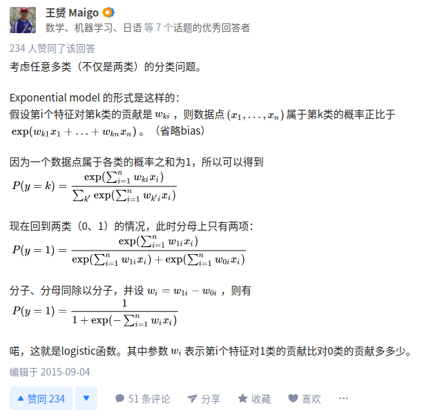

# LogisticRegression为什么使用sigmoid函数
下面的说法是从网上摘抄的。

## 角度一
知乎上的一个回答，感觉相对好理解。
`https://www.zhihu.com/question/35322351`

考虑任意多类（不仅是两类）的分类问题。

Exponential model 的形式是这样的：
假设第i个特征对第k类的贡献是，则数据点属于第k类的概率正比于。（省略bias）

因为一个数据点属于各类的概率之和为1，所以可以得到

现在回到两类（0、1）的情况，此时分母上只有两项：

分子、分母同除以分子，并设，则有

喏，这就是logistic函数。其中参数表示第i个特征对1类的贡献比对0类的贡献多多少。

整个回答的截图：

## 角度二
这个回答也是从结果反推说明为啥这个函数好的。

设计一个分类模型，首先要给它设定一个学习目标。在支持向量机中，这个目标是max-margin；在adaboost中，目标是优化一个指数损失函数。那么在logistic regression （LR）中，这个目标是什么呢？最大化条件似然度。考虑一个二值分类问题，训练数据是一堆（特征，标记）组合，（x1,y1), (x2,y2), .... 其中x是特征向量，y是类标记（y=1表示正类，y=0表示反类）。LR首先定义一个条件概率p(y|x；w）。 p(y|x；w）表示给定特征x，类标记y的概率分布，其中w是LR的模型参数（一个超平面）。有了这个条件概率，就可以在训练数据上定义一个似然函数，然后通过最大似然来学习w。这是LR模型的基本原理。

那么接下来的问题是如何定义这个条件概率呢？sigmoid函数就派上用场了。我们知道，对于大多数（或者说所有）线性分类器，response value(响应值) <w,x> （w和x的内积） 代表了数据x属于正类（y=1)的confidence (置信度）。<w,x>越大，这个数据属于正类的可能性越大；<w,x>越小，属于反类的可能性越大。<w,x>在整个实数范围内取值。现在我们需要用一个函数把<w,x>从实数空间映射到条件概率p(y=1|x，w)，并且希望<w,x>越大，p(y=1|x，w)越大；<w,x>越小，p(y=1|x，w)越小（等同于p(y=0|x，w)越大），而sigmoid函数恰好能实现这一功能（参见sigmoid的函数形状）：首先，它的值域是（0,1），满足概率的要求；其次，它是一个单调上升函数。最终，p(y=1|x，w)=sigmoid (<w,x>). 

综上，LR通过最大化类标记的条件似然度来学习一个线性分类器。为了定义这个条件概率，使用sigmoid 函数将线性分类器的响应值<w,x>映射到一个概率上。sigmoid的值域为（0,1），满足概率的要求；而且是一个单调上升函数，可将较大的<w,x>映射到较大的概率p(y=1|x，w）。sigmoid的这些良好性质恰好能满足LR的需求。

