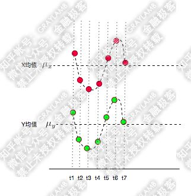
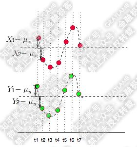
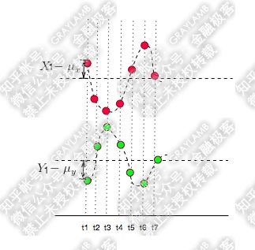
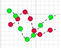
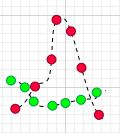
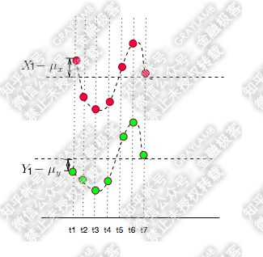
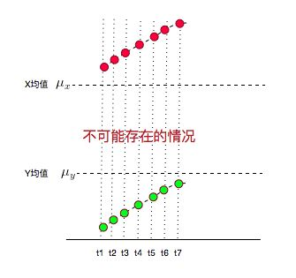
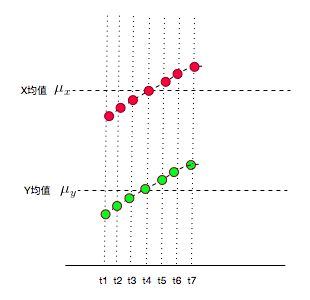
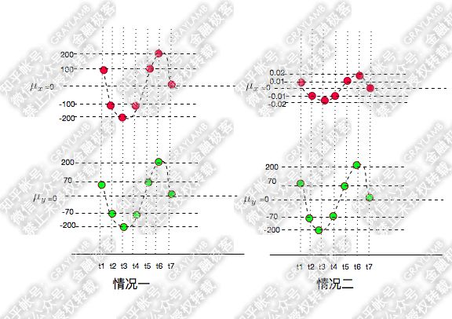
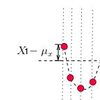

# 通俗地解释协方差与相关系数
`https://www.zhihu.com/question/20852004/answer/134902061`

## 一、协方差：

可以通俗的理解为：两个变量在变化过程中是同方向变化？还是反方向变化？同向或反向程度如何？

你变大，同时我也变大，说明两个变量是同向变化的，这时协方差就是正的。

你变大，同时我变小，说明两个变量是反向变化的，这时协方差就是负的。

从数值来看，协方差的数值越大，两个变量同向程度也就越大。反之亦然。

咱们从公式出发来理解一下：

$Cov(X,Y)=E[(X-\mu _{x})(Y-\mu _{y})]$

公式简单翻译一下是：如果有X,Y两个变量，每个时刻的“X值与其均值之差”乘以“Y值与其均值之差”得到一个乘积，再对这每时刻的乘积求和并求出均值（其实是求“期望”，但就不引申太多新概念了，简单认为就是求均值了）。

下面举个例子来说明吧：

比如有两个变量X,Y，观察t1-t7（7个时刻）他们的变化情况。

简单做了个图：分别用红点和绿点表示X、Y，横轴是时间。可以看到X，Y均围绕各自的均值运动，并且很明显是同向变化的。

这时，我们发现每一时刻$X-\mu _{x}$的值与$Y-\mu _{y}$的值的“正负号”一定相同（如下图：比如t1时刻，他们同为正，t2时刻他们同为负）：

所以，像上图那样，当他们同向变化时，$X-\mu _{x}$与$Y-\mu _{y}$的乘积为正。这样，当你把t1-t7时刻$X-\mu _{x}$与$Y-\mu _{y}$的乘积加在一起，求平均后也就是正数了。

如果反向运动呢？

很明显，$X-\mu _{x}$的值与$Y-\mu _{y}$的值的“正负号”一定相反，于是$X-\mu _{x}$与$Y-\mu _{y}$的乘积就是负值了。这样当你把t1-t7时刻$X-\mu _{x}$与$Y-\mu _{y}$的乘积加在一起，求平均的时候也就是负数了。

当然上面说的是两种特殊情况，很多时候X，Y的运动是不规律的，比如：

这时，很可能某一时刻$X-\mu _{x}$的值与$Y-\mu _{y}$的值乘积为正，另外一个时刻$X-\mu _{x}$的值与$Y-\mu _{y}$的值乘积为负。

将每一时刻$X-\mu _{x}$与$Y-\mu _{y}$的乘积加在一起，其中的正负项就会抵消掉，最后求平均得出的值就是协方差，通过协方差的数值大小，就可以判断这两个变量同向或反向的程度了。

所以，t1-t7时刻中，$X-\mu _{x}$与$Y-\mu _{y}$的乘积为正的越多，说明同向变化的次数越多，也即同向程度越高。反之亦然。

总结一下，如果协方差为正，说明X，Y同向变化，协方差越大说明同向程度越高；如果协方差为负，说明X，Y反向运动，协方差越小说明反向程度越高。

－－－－－－－－LINE－－－－－－－－－

一般的同学看到above the line的内容就ok了。但有一些爱钻研的同学，可能会进一步提问：

那如果X，Y同向变化，但X大于均值，Y小于均值，那$X-\mu _{x}$与$Y-\mu _{y}$的乘积为负值啊？这不是矛盾了吗？

那就继续往下看……

这种情况是有可能出现的，比如：

可以看到，t1时刻，$X-\mu _{x}$与$Y-\mu _{y}$的符号相反，他们的乘积为负值。

但是，总体看，这两个变量的协方差仍然是正的，因为你还要计算t2，t3……t7时刻$X-\mu _{x}$与$Y-\mu _{y}$的乘积，然后再把这7个时刻的乘积求和做均值，才是最后X，Y的协方差。1个负、6个正，显然最后协方差很大可能性是正的。

所以t1时刻$X-\mu _{x}$与$Y-\mu _{y}$的乘积为负值，并不能说明他们反向运动，要结合整体的情况来判断。

那么你可能又要问了，既然都是同向变化，那t1时刻$X-\mu _{x}$与$Y-\mu _{y}$的乘积为负值、其他时刻乘积为正的这种情况，与，t1-t7时刻$X-\mu _{x}$与$Y-\mu _{y}$的乘积均为正值的情况，到底有什么差异呢？这点其实前面也解释过了，差异就是：第一种情况的同向程度不如第二种情况的同向程度大（第一种情况6正1负，第二种情况7正，所以第一种情况的协方差小于第二种情况的协方差，第一种情况X，Y变化的同向程度要小于第二种情况）。

另外，如果你还钻牛角尖，说如果t1，t2，t3……t7时刻X，Y都在增大，而且X都比均值大，Y都比均值小，这种情况协方差不就是负的了？7个负值求平均肯定是负值啊？但是X，Y都是增大的，都是同向变化的，这不就矛盾了？

这个更好解释了：这种情况不可能出现！

因为，你的均值算错了……

X，Y的值应该均匀的分布在均值两侧才对，不可能都比均值大，或都比均值小。

所以，实际它的图应该是下面这样的：

发现没有，又变成$X-\mu _{x}$与$Y-\mu _{y}$的符号相同的情况了～有没有种被大自然打败的感觉～

好了，现在，对于协方差应该有点感觉了吧？

## 二、相关系数：

对于相关系数，我们从它的公式入手。一般情况下，相关系数的公式为：

翻译一下：就是用X、Y的协方差除以X的标准差和Y的标准差。

所以，相关系数也可以看成协方差：一种剔除了两个变量量纲影响、标准化后的特殊协方差。

既然是一种特殊的协方差，那它：

1、也可以反映两个变量变化时是同向还是反向，如果同向变化就为正，反向变化就为负。

2、由于它是标准化后的协方差，因此更重要的特性来了：它消除了两个变量变化幅度的影响，而只是单纯反应两个变量每单位变化时的相似程度。

比较抽象，下面还是举个例子来说明：

首先，还是承接上文中的变量X、Y变化的示意图（X为红点，Y为绿点），来看两种情况：

很容易就可以看出以上两种情况X，Y都是同向变化的，而这个“同向变化”，有个非常显著特征：**X、Y同向变化的过程，具有极高的相似度**！无论第一还是第二种情况下，都是：t1时刻X、Y都大于均值，t2时刻X、Y都变小且小于均值，t3时刻X、Y继续变小且小于均值，t4时刻X、Y变大但仍小于均值，t5时刻X、Y变大且大于均值……

可是，计算一下他们的协方差，

第一种情况下：

$[(100-0)\times (70-0) +( -100-0)\times ( -70-0)+(-200-0)\times (-200-0)...]\div 7\approx 15428.57$

第二种情况下：

$[(0.01-0)\times (70-0) +( -0.01-0)\times ( -70-0)+(-0.02-0)\times (-200-0)...]\div 7\approx 1.542857$

协方差差出了一万倍，只能从两个协方差都是正数判断出两种情况下X、Y都是同向变化，但是，一点也看不出两种情况下X、Y的变化都具有相似性这一特点。

这是为什么呢？

因为以上两种情况下，在X、Y两个变量同向变化时，X变化的幅度不同，这样，两种情况的协方差更多的被变量的变化幅度所影响了。

所以，为了能准确的研究两个变量在变化过程中的相似程度，我们就要把变化幅度对协方差的影响，从协方差中剔除掉。于是，相关系数就横空出世了，就有了最开始相关系数的公式：

那么为什么要通过除以标准差的方式来剔除变化幅度的影响呢？咱们简单从标准差公式看一下：

从公式可以看出，标准差计算方法为，每一时刻变量值与变量均值之差再平方，求得一个数值，再将每一时刻这个数值相加后求平均，再开方。

“变量值与变量均值之差”$X-\mu _{x}$是什么呢？就是偏离均值的幅度：

那为何要对它做平方呢？因为有时候变量值与均值是反向偏离的（见下图），$X-\mu _{x}$是个负数，平方后，就可以把负号消除了。这样在后面求平均时，每一项数值才不会被正负抵消掉，最后求出的平均值才能更好的体现出每次变化偏离均值的情况。

当然，最后求出平均值后并没有结束，因为刚才为了消除负号，把$X-\mu _{x}$进行了平方，那最后肯定要把求出的均值开方，将这个偏离均值的幅度还原回原来的量级。于是就有了下面标准差的公式：

所以标准差描述了变量在整体变化过程中偏离均值的幅度。协方差除以标准差，也就是把协方差中变量变化幅度对协方差的影响剔除掉，这样协方差也就标准化了，它反应的就是两个变量每单位变化时的情况。这也就是相关系数的公式含义了。

同时，你可以反过来想象一下：既然相关系数是协方差除以标准差，那么，当X或Y的波动幅度变大的时候，它们的协方差会变大，标准差也会变大，这样相关系数的分子分母都变大，其实变大的趋势会被抵消掉，变小时也亦然。于是，很明显的，相关系数不像协方差一样可以在＋$\infty $到－$\infty $间变化，它只能在＋1到－1之间变化（相关系数的取值范围在＋1到－1之间变化可以通过施瓦茨不等式来证明，有些复杂，这里就不赘述了，有兴趣的可以google下）。

总结一下，对于两个变量X、Y，

当他们的相关系数为1时，说明两个变量变化时的正向相似度最大，即，你变大一倍，我也变大一倍；你变小一倍，我也变小一倍。也即是完全正相关（以X、Y为横纵坐标轴，可以画出一条斜率为正数的直线，所以X、Y是线性关系的）。

随着他们相关系数减小，两个变量变化时的相似度也变小，当相关系数为0时，两个变量的变化过程没有任何相似度，也即两个变量无关。

当相关系数继续变小，小于0时，两个变量开始出现反向的相似度，随着相关系数继续变小，反向相似度会逐渐变大。

当相关系数为－1时，说明两个变量变化的反向相似度最大，即，你变大一倍，我变小一倍；你变小一倍，我变大一倍。也即是完全负相关（以X、Y为横纵坐标轴，可以画出一条斜率为负数的直线，所以X、Y也是线性关系的）。

有了上面的背景，我们再回到最初的变量X、Y的例子中，可以先看一下第一种情况的相关系数：

X的标准差为

$\sigma _{X} =\sqrt{E((X-\mu _{x})^{2} )} =\sqrt{[(100-0)^{2}+ (-100-0)^{2}...]\div 7} \approx 130.9307$

Y的标准差为

$\sigma _{Y} =\sqrt{E((Y-\mu _{y})^{2} )} =\sqrt{[(70-0)^{2}+ (-70-0)^{2}...]\div 7} \approx 119.2836$

于是相关系数为

$\rho =15428.57\div (130.9307\times 119.2836)\approx 0.9879$

说明第一种情况下，X的变化与Y的变化具有很高的相似度，而且已经接近完全正相关了，X、Y几乎就是线性变化的。

那第二种情况呢？

X的标准差为

$\sigma _{X} =\sqrt{E((X-\mu _{x})^{2} )} =\sqrt{[(0.01-0)^{2}+ (-0.01-0)^{2}...]\div 7} \approx 0.01309307$

Y的标准差为

$\sigma _{Y} =\sqrt{E((Y-\mu _{y})^{2} )} =\sqrt{[(70-0)^{2}+ (-70-0)^{2}...]\div 7}\approx 119.2836$

于是相关系数为

$\rho =1.542857\div (0.01309307\times 119.2836)\approx 0.9879$

说明第二种情况下，虽然X的变化幅度比第一种情况X的变化幅度小了10000倍，但是丝毫没有改变“X的变化与Y的变化具有很高的相似度”这一结论。同时，由于第一种、第二种情况的相关系数是相等的，因此在这两种情况下，X、Y的变化过程有着同样的相似度。

好了，讲了这么多，不知你看完是否对相关系数也有了一些感觉？

## 三、写在最后

本文主要还是想给非理工专业、入门级的各位朋友看的，自己也曾在茫茫公式海中痛苦过，但后来发现对一个公式的原理有了一个感觉后，它也就变得好记很多了，而且也愿意深入研究它了。这篇文章也就是培养你对于协方差、相关系数的这种感觉。但是，为了通俗易懂，有些地方也不够全面、严谨。也许你看完本文，经过自己的学习研究，也会有自己的一些想法，那你可以继续研究一下本题目下其他答主的答案，通过引入向量、内积等定义，会把协方差、相关系数说明得更加严谨和透彻。总之学习是一个循序渐进的过程，不要觉得彻底明白了什么，那往往是你踏入一个领域的第一步。

（完）

其他一些推荐的通俗易懂类答案，感兴趣的朋友可以阅读：

[作为一个非金融从业者怎样才能看懂电影《大空头》？ - GRAYLAMB 的回答 - 知乎](https://www.zhihu.com/question/42382394/answer/94321879 "作为一个非金融从业者怎样才能看懂电影《大空头》？ - GRAYLAMB 的回答 - 知乎")

[关于外汇标价方法的定义，直接标价法到底是什么？ - GRAYLAMB 的回答 - 知乎](https://www.zhihu.com/question/27027897/answer/118119135 "关于外汇标价方法的定义，直接标价法到底是什么？ - GRAYLAMB 的回答 - 知乎")

[如何浅显易懂地解说 Paxos 的算法？](https://www.zhihu.com/question/19787937/answer/107750652 "如何浅显易懂地解说 Paxos 的算法？")

未来计划继续通俗易懂解读ApplePay、区块链、机器学习，欢迎关注。

——2017.2.25

关于比特币与区块链的文章写好了，有兴趣的可以来瞅瞅～

[GRAYLAMB：比特币 (Bitcoin) 系统是如何运行的？](https://www.zhihu.com/question/20941124/answer/208563599 "GRAYLAMB：比特币 (Bitcoin) 系统是如何运行的？")

——2017.8.4
