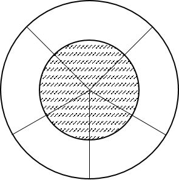

# NaiveBayes(朴素贝叶斯)

## 条件概率 全概率 贝叶斯

### 条件概率
条件概率的定义：
$$P(A|B)=P(AB)=\frac{P(A,B)}{P(B)}$$

由定义可以引申得到：
* $P(A,B)=P(AB)=P(A|B) \cdot P(B)$   
* $P(A,B|C)=P(A|B,C) \cdot P(B|C)$(不是很理解)   

### 贝叶斯公式
由条件概率可得：
$$P(A,B)=P(AB)=P(A|B) \cdot P(B) = P(B|A) \cdot P(A)$$

由此得到贝叶斯公式的常规形式：
$$P(A|B) = \frac{P(B|A)P(A)}{P(B)}$$

### 全概率公式
若事件$B_1,B_2,...,B_n$ 是样本空间 $\Omega$ 的一个划分，则：

$P(A) = \sum_{i=1}^n P(A, B_i)$

又因为条件概率公式，可进一步得：

$P(A) = \sum_{i=1}^n P(A|B_i)P(B_i)$

可以使用图1帮助理解，整个大圆为样本空间，中间阴影面积为事件 $A$ 。大圆的每一个切分代表每一个 $B_i$ 。

全概率公式的意义在于，当某一事件的概率难以求得时，可转化为在一系列条件下发生概率的和。

### 全概率公式和贝叶斯公式的结合
$$P(A|B) = \frac{P(B|A)P(A)}{\sum_{i=1}^n P(B|A_i)P(A_i)}$$

贝叶斯公式：$P(A|B) = \frac{P(B|A)*P(A)}{P(B)} $，分母部分的$P(B)$其实就是全概率公式

根据全概率公式，$P(B)$可以写成 $\sum_{1}^{n}{P(B|A_{n} )*P(A_{n} )} $

**所以，贝叶斯公式最终可以写成：**$P(A|B) = \frac{P(B|A)*P(A)}{\sum_{1}^{n}{P(B|A_{n} )*P(A_{n} )} } $

