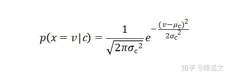
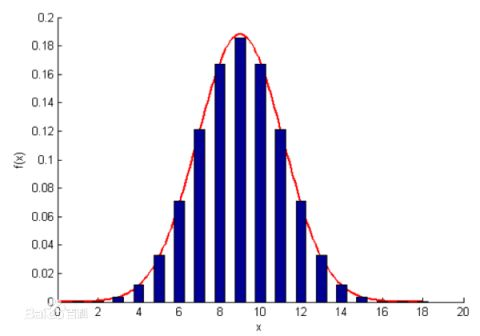

# 一文详解朴素贝叶斯(Naive Bayes)原理
摘抄自知乎上的一片文章`https://zhuanlan.zhihu.com/p/37575364`

## 一、历史背景解读

18世纪英国业余(一点都不业余好吗)数学家托马斯·贝叶斯(Thomas Bayes，1702～1761)提出过一种看似显而易见的观点：

**“用客观的新信息更新我们最初关于某个事物的信念后，我们就会得到一个新的、改进了的信念。”**

这个研究成果由于简单显得平淡无奇，直至他死后两年才于1763年由他的朋友理查德·普莱斯帮助发表。它的数学原理很容易理解，简单说就是，如果你看到一个人总是做一些好事，则会推断那个人多半会是一个好人。这就是说，**当你不能准确知悉一个事物的本质时，你可以依靠与事物特定本质相关的事件出现的多少去判断其本质属性的概率**。

用数学语言表达就是：**支持某项属性的事件发生得愈多，则该属性成立的可能性就愈大**。

与其他统计学方法不同，贝叶斯方法建立在主观判断的基础上，你可以先估计一个值，然后根据客观事实不断修正。

1774年，法国数学家皮埃尔-西蒙·拉普拉斯(Pierre-Simon Laplace，1749-1827)独立地再次发现了贝叶斯公式。拉普拉斯关心的问题是：当存在着大量数据，但数据又可能有各种各样的错误和遗漏的时候，我们如何才能从中找到真实的规律。拉普拉斯研究了男孩和女孩的生育比例。有人观察到，似乎男孩的出生数量比女孩更高。

**这一假说到底成立不成立呢?**

拉普拉斯不断地搜集新增的出生记录，并用之推断原有的概率是否准确。每一个新的记录都减少了不确定性的范围。拉普拉斯给出了我们现在所用的贝叶斯公式的表达：

$P(A/B)=P(B/A)*P(A)/P(B)$

该公式表示在B事件发生的条件下A事件发生的条件概率，等于A事件发生条件下B事件发生的条件概率乘以A事件的概率，再除以B事件发生的概率。公式中，P(A)也叫做先验概率，P(A/B)叫做后验概率。严格地讲，贝叶斯公式至少应被称为“贝叶斯-拉普拉斯公式”。

## 二、原理推导

理论上，概率模型分类器是一个条件概率模型：

$p(C|F1,...,Fn)$

独立变量C有若干类别，条件依赖于若干特征变量,但问题在于如果特征数量n的维度较大或者每个特征能取大量值时，基于概率模型列出概率表变得不现实。所以我们修改这个模型使之变得可行。 根据贝叶斯公式有以下式子：

$p(C|F1,...,Fn)= \frac{p(C)*p(F1,...Fn|C)}{p(F1,...,Fn)}$

或者，这样表达比较简洁明了：

$p(类别|特征)=\frac{p(类别)*p(类别|特征)}{p(特征)}$

其中， $p(C)$ 为先验概率， $p(C|F1,...,Fn)$ 为后验概率；可以这么理解，再不知道需要预测的样本任何特征的时候，先判断该样本为某个类别的概率为 $p(C)$ 为，再知道样本的特征之后，乘上 $\frac{p(F1,...Fn|C)}{p(F1,...Fn)}$ 之后，得到该样本再知道 $F1=f1,...,Fn=fn$ 之后，样本属于这个类别的条件概率。

这个乘上去的因子可能是起到促进的作用（当该因子大于1），也可能起到抑制的作用（当该因子小于1）。这个比较容易理解，比如没有任何信息的时候，可以判断一个官为贪官的概率为0.5，再知道该官员财产大于一千万后，则根据常理判断该官员为贪官的概率为0.8。

实际中，我们只关心分式中的分子部分 $p(C)*p(F1,...Fn|C)$ ，因为分母不依赖于C,而且特征的值也是给定的，于是分母可以认为是一个常数。这样分子就等价于[联合分布](https://zh.wikipedia.org/wiki/%E8%81%94%E5%90%88%E5%88%86%E5%B8%83%22%20%5Co%20%22%E8%81%94%E5%90%88%E5%88%86%E5%B8%83 "联合分布")模型。

$p(C,F1,...Fn)$

现在，“朴素”的条件独立假设开始发挥作用了：假设每个特征,对于其他特征,是独立的，即特征之间相互独立，就有：

$p(Fi|C,Fj)=p(Fi|C)$

这里还要再解释一下为什么要假设特征之间相互独立。

我们这么想，假如没有这个假设，在数据量很大的情况下，那么我们对右边这些概率的估计其实是不可做的，这么说，假设一个分类器有4个特征，每个特征有10个特征值，则这四个特征的联合概率分布是4维的，可能的情况就有 $10^{4}=10000$ 种。

计算机扫描统计还可以，但是现实生活中，往往有非常多的特征，每一个特征的取值也是非常之多，那么通过统计来估计后面概率的值，变得几乎不可做，这也是为什么需要假设特征之间独立的原因，朴素贝叶斯法对条件概率分布做了条件独立性的假设，由于这是一个较强的假设，朴素贝叶斯也由此得名！这一假设使得朴素贝叶斯法变得简单，但有时会牺牲一定的分类准确率。

有了特征相互独立的条件以后，对于,联合分布模型可表达为：

这就意味着，变量C的条件分布可以表达为：

其中，Z只依赖 $F1,...,Fn$ ,当特征变量已知时Z是个常数。

至此，我们我们可以从概率模型中构造分类器，朴素贝叶斯[分类器](https://zh.wikipedia.org/w/index.php?title=%E5%88%86%E7%B1%BB%E5%99%A8&action=edit&redlink=1%22%20%5Co%20%22%E5%88%86%E7%B1%BB%E5%99%A8%EF%BC%88%E9%A1%B5%E9%9D%A2%E4%B8%8D%E5%AD%98%E5%9C%A8%EF%BC%89 "分类器")包括了这种模型和相应的决策规则。一个普通的规则就是选出最有可能的那个：这就是大家熟知的[最大后验概率](https://zh.wikipedia.org/wiki/%E6%9C%80%E5%A4%A7%E5%90%8E%E9%AA%8C%E6%A6%82%E7%8E%87%22%20%5Co%20%22%E6%9C%80%E5%A4%A7%E5%90%8E%E9%AA%8C%E6%A6%82%E7%8E%87 "最大后验概率")（MAP）决策准则。

相应的分类器便是如下定义的公式：

**当特征值为离散型时**：

类的先验概率可以通过训练集的各类样本的出现次数来估计，例如：

类的先验概率 $p(C=c1)=\frac{1}{样本总数}$

类条件概率= $p(Fi=fi|C=c1)=\frac{Fi=fi的样本总量}{样本总数}$

即可求得类的条件概率，最后比较各个类别的概率值的大小判断该测试样本应该属于哪个类别。

**当特征值为连续型时**：

通常的假设这些连续数值为高斯分布。例如，假设训练集中某个连续特征 $x$ 。首先我们对数据类别分类，然后计算每个类别中的 $x$ 均值和方差。令 $\mu _{c}$ 表示为 $x$ 在c类上的均值， $\sigma _{c}^{2}$ 表示为 $x$ 在c类上的方差。在给定类中某个值的概率 $p=（x=v|c）$，可以通过将 $v$ 表示为均值为 $\mu _{c}$ 方差为 $\sigma _{c}^{2}$ 的正态分布计算出来。如下，

处理连续数值问题的另一种常用的技术是通过离散化连续数值的方法，通常，当训练样本数量较少或者是精确的分布已知时，通过概率分布的方法是一种更好的选择。

在大量样本的情形下离散化的方法表现更优，因为大量的样本可以学习到数据的分布。由于朴素贝叶斯是一种典型的用到大量样本的方法（越大计算量的模型可以产生越高的分类精确度），所以朴素贝叶斯方法都用到离散化方法，而不是概率分布估计的方法。

## 三、实例（举个栗子）

这里举两个例子，一个离散型的，一个连续型的。

**离散型实例**，给定如下数据：

根据以上数据，现在有一堆男女朋友，男生向女生求婚，男生的四个特点分别是不帅，性格不好，身高矮，不上进，请判断女生是嫁还是不嫁?

该问题转换为数学问题就是比较

$p（嫁|不帅，性格不好，身高矮，不上进）$

与

$p（不嫁|不帅，性格不好，身高矮，不上进）$ 的概率。

由贝叶斯公式得：

$p（嫁丨不帅，性格不好，身高矮，不上进）=\frac{p（不帅，性格不好，身高矮，不上进丨嫁）*p(嫁)}{p（嫁丨不帅，性格不好，身高矮，不上进)}$

假设各个特征相互独立，即：

$p（嫁丨不帅，性格不好，身高矮，不上进）=\frac{p(不帅丨嫁)*p(性格不好丨嫁)*p(身高矮丨嫁)*p(不上进丨嫁)*p(嫁)}{p（不帅，性格不好，身高矮，不上进）}$

首先我们整理训练数据中：

嫁的样本数总共有6个，则 $p(嫁)=\frac{6}{12}=\frac{1}{2}$ ；

不帅，也嫁了的样本数总共有6个，则 $p(嫁)=\frac{3}{6}=\frac{1}{2}$ ；

性格不好，也嫁了的样本数总共有1个，则 $p(嫁)=\frac{1}{6}$ ；

矮，也嫁了的样本数总共有1个，则 $p(嫁)=\frac{1}{6}$ ；

不上进，也嫁了的样本数总共有1个，则 $p(嫁)=\frac{1}{6}$ ；

同理：

不嫁的样本数总共有6个，则 $p(不嫁)=\frac{6}{12}=\frac{1}{2}$ ；

不帅，就不嫁的样本数总共有1个，则 $p(不帅丨不嫁)=\frac{1}{6}$ ；

性格不好，就不嫁的样本数总共有3个，则 $p(不帅丨不嫁)=\frac{3}{6}=\frac{1}{2}$ ；

矮，就不嫁的样本数总共有6个，则 $p(矮丨不嫁)=\frac{6}{6}=1$ ；

不上进，就不嫁的样本数总共有3个，则 $p(不上进丨不嫁)=\frac{3}{6}=\frac{1}{2}$ ；

由于分母都相同，且分子 $\frac{1}{864}

**连续型实例**，给定训练数据如下：

通过以上人体测量特征，包括身高、体重、脚的尺寸，判断一个人是男性还是女性。

测试样本：

首先，假设人的身高，体重，脚的尺寸都满足高斯分布，分别计算各个特征的均值和方差，得到下表：

其次，我们认为先验概率是男性或者是女性是等概率的，

即 $p(male)=p(female)=0.5$ ，或者通过统计样本中男女比例来作为先验概率也可以，本例得到的结果是一样的。

判断该条测试样本属于男性还是女性，就等价于比较是男性的后验概率和女性的后验概率哪个大。

分母是个常数，只需要比较分子就行，这里给出分母的值：

计算男性的后验概率： $p(male)=0.5$ ，其中

这里大于1是因为是概率密度函数，而不是概率分布函数，所以大于1也是合理的。

由于女性的后验概率分子较大，所以我们预测这个样本的为女性。

## 四、实战运用

达观数据作为在文本智能处理领域的领先企业，在文本挖掘领域有着深厚的技术底蕴。在实际的工作中有大量的文本分类的实际运用场景。下面将举一个常见的例子：广告识别。

这里有一批已经标注好的用户评论数据如下图，我们定义有联系方式的评论为广告，即广告识别等价于识别是否包含联系方式。

首先，将每条评论转换为词向量，这里我们使用python的分词包jieba来进行分词，例如上图中的某条评论：”您好您可以在网贷之家httpshujuwangdaizhijiacomarchives387html看到迷你贷的相关数据哦，其他第三方网站都是不准确的。”

分词结果为：“您好/您/可以/在/网贷/之家/httpshujuwangdaizhijiacomarchives387html/看到/迷你/贷/的/相关/数据/哦/，/其他/第三方/网站/都/是/不/准确/的/。”

然后，将语料库(corpus)中所有的评论分词后的词语作为一个集合，称为词袋(Bag of words)。计算每条评论中每个词语的TF-IDF值，TF-IDF公式为：

TF-IDF值的意义是：一个词语在评论中出现次数越多, 同时在所有评论中出现次数越少, 越能够代表该评论。每条评论根据词袋构建一个数字向量，向量长度为词袋的词语总数，每个词对应一维特征，如果该词在这条评论中，则这维特征是这个词语的TF-IDF值；如果该词不在评论中，则这维特征为0。这样就将每条评论转换为一个向量。

假设特征之间是相互独立的，该例子就转换为连续型的贝叶斯分类器。当然，这里也可以用这个词语的词频来作为特征，这时该例子为离散型的贝叶斯分类器，这里我们用TF-IDF值。

本例子使用scikit-learn中的Naive Bayes模块，这个模块中有三个训练模块：GaussianNB、MultinomialNB、BernoulliNB，分别是高斯朴素贝叶斯、多项式分布朴素贝叶斯和伯努利朴素贝叶斯。多项式分布是将重复词语是为其重复多次，伯努利朴素贝叶斯是将重复的词语视为其只出现1次，本例子是连续型的这里我们用高斯朴素贝叶斯。将转换后的数据90%作为训练集，10%作为测试集，部分代码如图：

进行交叉验证后得到的结果如图：

## 五、综述

贝叶斯分类器是一种生成式模型，通过计算概率来进行分类，可以用来处理多分类问题，对于小规模的数据预测，同样表现良好。

贝叶斯分类器适合多分类任务，适合增量式训练，对于大规模数据，计算复杂度较低，同时算法原理比较简单易懂。但缺点是，对输入数据比较敏感，而且贝叶斯分类器是假设特征之间相互独立，而往往实际例子中特征之间都有相互联系，所以对于特征之间相关性较强的运用场景，准确率上会有一定损失；并且连续型的特征是假设该特征满足高斯分布，同样会带来一定准确率上的损失。

所以在实际运用当中，充分考虑特征之间的相关性和特征的分布情况是至关重要的。

**References**

**作者简介：**

孟礼斌，达观数据算法工程师，负责达观数据个性化推荐系统的研发、优化，以及推荐系统中机器学习算法的具体应用，对各种机器学习算法有浓厚兴趣。

