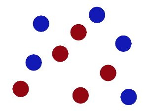

# 什么是SVM

## 什么是SVM
一下解释摘抄自知乎上某一回答，解释的非常好。`https://www.zhihu.com/question/21094489/answer/86273196`

**什么是SVM?**

当然首先看一下wiki.
Support Vector Machines are learning models used for classification: which individuals in a population belong where? So… how do SVM and the mysterious “kernel” work?

好吧，故事是这样子的：在很久以前的情人节，大侠要去救他的爱人，但魔鬼和他玩了一个游戏。

魔鬼在桌子上似乎有规律放了两种颜色的球，说：“你用一根棍分开它们？**要求：尽量在放更多球之后，仍然适用**。”


于是大侠这样放，干的不错？ 


然后魔鬼，又在桌上放了更多的球，似乎有一个球站错了阵营。 


**SVM就是试图把棍放在最佳位置，好让在棍的两边有尽可能大的间隙。**


现在即使魔鬼放了更多的球，棍仍然是一个好的分界线。 


然后，在SVM 工具箱中有另一个更加重要的 trick。 魔鬼看到大侠已经学会了一个trick，于是魔鬼给了大侠一个新的挑战。 


现在，大侠没有棍可以很好帮他分开两种球了，现在怎么办呢？当然像所有武侠片中一样大侠桌子一拍，球飞到空中。然后，凭借大侠的轻功，大侠抓起一张纸，插到了两种球的中间。


现在，从魔鬼的角度看这些球，这些球看起来像是被一条曲线分开了。

再之后，无聊的大人们，把这些球叫做 「**data**」，把棍子 叫做 「**classifier**」, 最大间隙trick 叫做「**optimization**」， 拍桌子叫做「**kernelling**」, 那张纸叫做「**hyperplane**」。

```
optimization:最佳（优）化；优选法；（使）最恰当（适宜，适合）;最佳条件选择；求最佳参数
kernel:核
hyperplane：超平面
```

直观感受看：https://www.youtube.com/watch?v=3liCbRZPrZA


