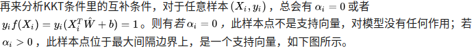
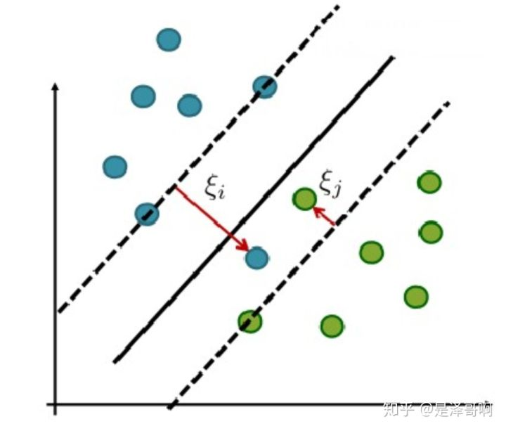

# SVM


```
https://www.cnblogs.com/further-further-further/p/9596898.html
https://zhuanlan.zhihu.com/p/49331510
https://zhuanlan.zhihu.com/p/76946313
https://zhuanlan.zhihu.com/p/77750026
https://blog.csdn.net/b285795298/article/details/81977271
```

[toc]

## 简单概括一下SVM

### 解决什么问题？
最基本的应用是数据分类，特别是对于非线性不可分数据集。支持向量机不仅能对非线性可分数据集进行分类，对于非线性不可分数据集的也可以分类（我认为这才是支持向量机的真正魅力所在，因为现实场景中，样本数据往往是线性不可分的）。

现实场景一 ：样本数据大部分是线性可分的，但是只是在样本中含有少量噪声或特异点，去掉这些噪声或特异点后线性可分 => 用支持向量机的软间隔方法进行分类；

现实场景二：样本数据完全线性不可分 => 引入核函数，将低维不可分的非线性数据集转化为高维可分的数据集，用支持向量机的软间隔方法进行分类；


一定要明白一点：**对分类器准确性有影响只是样本中的支持向量**，因此，其他样本在计算分类器的权重矩阵时可以直接过滤掉，大大节省运行时间。

目标：**获取离边界最近样本点到超平面最远距离**


### 直观理解
我们先来看看下面这个图:

图中有分别属于两类的一些二维数据点和三条直线。如果三条直线分别代表三个分类器的话，请问哪一个分类器比较好？

我们凭直观感受应该觉得答案是H3。首先H1不能把类别分开，这个分类器肯定是不行的；H2可以，但分割线与最近的数据点只有很小的间隔，如果测试数据有一些噪声的话可能就会被H2错误分类(即对噪声敏感、泛化能力弱)。H3以较大间隔将它们分开，这样就能容忍测试数据的一些噪声而正确分类，是一个泛化能力不错的分类器。

对于支持向量机来说，数据点若是 p 维向量，我们用 p-1 维的超平面来分开这些点。但是可能有许多超平面可以把数据分类。最佳超平面的一个合理选择就是以最大间隔把两个类分开的超平面。因此，SVM选择能够使离超平面最近的数据点的到超平面距离最大的超平面。

**以上介绍的SVM只能解决线性可分的问题，为了解决更加复杂的问题，支持向量机学习方法有一些由简至繁的模型**:

* 线性可分SVM
```
当训练数据线性可分时，通过硬间隔(hard margin，什么是硬、软间隔下面会讲)最大化可以学习得到一个线性分类器，即硬间隔SVM，如上图的的H3。
```
* 线性SVM
```
当训练数据不能线性可分但是可以近似线性可分时，通过软间隔(soft margin)最大化也可以学习到一个线性分类器，即软间隔SVM。
```
* 非线性SVM
```
当训练数据线性不可分时，通过使用核技巧(kernel trick)和软间隔最大化，可以学习到一个非线性SVM。
```

### SVM为什么采用间隔最大化（与感知机的区别）
SVM 为什么采用间隔最大化（与感知机的区别）：

当训练数据线性可分时，存在无穷个分离超平面可以将两类数据正确分开。感知机利用误分类最小策略，求得分离超平面，不过此时的解有无穷多个。线性可分支持向量机利用间隔最大化求得最优分离超平面，这时，解是唯一的。另一方面，此时的分隔超平面所产生的分类结果是最鲁棒的，对未知实例的泛化能力最强。

### 简单概括一下SVM
**简单概括一下SVM：**

SVM 是一种二类分类模型。它的基本思想是在特征空间中寻找间隔最大的分离超平面使数据得到高效的二分类，具体来讲，有三种情况（不加核函数的话就是个线性模型，加了之后才会升级为一个非线性模型）：

* 当训练样本线性可分时，通过硬间隔最大化，学习一个线性分类器，即线性可分支持向量机；    
* 当训练数据近似线性可分时，引入松弛变量，通过软间隔最大化，学习一个线性分类器，即线性支持向量机；    
* 当训练数据线性不可分时，通过使用核技巧及软间隔最大化，学习非线性支持向量机。  

## 优缺点
### 优点
* 有严格的数学理论支持，可解释性强，不依靠统计方法，从而简化了通常的分类和回归问题；    
* 能找出对任务至关重要的关键样本（即：支持向量）；    
* 采用核技巧之后，可以处理非线性分类/回归任务；    
* 最终决策函数只由少数的支持向量所确定，计算的复杂性取决于支持向量的数目，而不是样本空间的维数，这在某种意义上避免了“维数灾难”。  

### 缺点
* 训练时间长。当采用 SMO 算法时，由于每次都需要挑选一对参数，因此时间复杂度为 O(N^2) ，其中 N 为训练样本的数量；    
* 当采用核技巧时，如果需要存储核矩阵，则空间复杂度为 O(N^2) ；    
* 模型预测时，预测时间与支持向量的个数成正比。当支持向量的数量较大时，预测计算复杂度较高。

## 三种支持向量机
我们先来体味一下支持向量机的分类吧。一般支持向量机可以分为三类：线性可分支持向量机（support vector machine in linearly separable case）、线性支持向量机（linear support vector machine ）以及非线性支持向量机（non-linear support vector machine）这三个由简至繁的模型分别解决训练数据的三个不同情况。当训练数据线性可分时，训练一个线性可分支持向量机，也称硬间隔支持向量机，当训练数据近似线性可分时，通过软间隔最大化（什么是软间隔最大化？后面会讲的），训练一个线性支持向量机，当数据线性不可分，我们通过核技巧（核技巧由Boser,Guyon等引入。什么是核技巧？后面会讲到）及软间隔最大化学习非线性支持向量机。

在这里引入一张图片，近距离体会上述三种数据类型。


## 几个概念

### 线性可分
首先我们先来了解下什么是线性可分。


在二维空间上，两类点被一条直线完全分开叫做线性可分。

严格的数学定义是：


### 最大间隔超平面
从二维扩展到多维空间中时，将 D0 和 D1 完全正确地划分开的 wx + b = 0 就成了一个超平面。

为了使这个超平面更具鲁棒性，我们会去找最佳超平面，以最大间隔把两类样本分开的超平面，也称之为最大间隔超平面。

* 两类样本分别分割在该超平面的两侧；    
* 两侧距离超平面最近的样本点到超平面的距离被最大化了。

### 支持向量
样本中距离超平面最近的一些点，这些点叫做支持向量。**在决定最佳超平面时只有支持向量起作用，而其他数据点并不起作用**。


## 线性可分SVM——硬间隔

### SVM的目标（硬间隔）
#### 结论
有两个目标：第一个是**使间隔最大化**，第二个是**使样本正确分类**，由此推出目标函数：


稍微解释一下，w是超平面参数，目标一是从点到面的距离公式化简来的，具体不展开，目标二就相当于感知机，只是把大于等于0进行缩放变成了大于等于1，为了后面的推导方便。有了两个目标，写在一起，就变成了svm的终极目标：


#### 推导过程
SVM 想要的就是找到各类样本点到超平面的距离最远，也就是找到最大间隔超平面。任意超平面可以用下面这个线性方程来描述：


二维空间点 (x,y) 到直线 Ax+By+C=0 的距离公式是：


如图所示，根据支持向量的定义我们知道，支持向量到超平面的距离为 d，其他点到超平面的距离大于 d。


于是我们有这样的一个公式：


是正数，我们暂且令它为 1（之所以令它等于 1，是为了方便推导和优化，且这样做对目标函数的优化没有影响），故：


将两个方程合并，我们可以简写为：


至此我们就可以得到最大间隔超平面的上下两个超平面：


每个支持向量到超平面的距离可以写为：


最大化这个距离：


这里乘上 2 倍也是为了后面推导，对目标函数没有影响。刚刚我们得到支持向量  ，所以我们得到：


再做一个转换：


为了方便计算（去除根号），我们有：


所以得到的最优化问题是：


### 求解目标（硬间隔）
从上面的公式看出，这是一个有约束条件的最优化问题，用拉格朗日函数来解决。

上式的拉格朗日函数为：


在满足Slater定理的时候，且过程满足KKT条件的时候，原问题转换成对偶问题：


先求内部最小值，对 w 和 b 求偏导并令其等于 0 可得：


将其代入到上式中去可得到


将其代入到上式中去可得到


此时需要求解  ，利用SMO（序列最小优化）算法：

SMO算法的基本思路是每次选择两个变量，选取的两个变量所对应的样本之间间隔要尽可能大，因为这样更新会带给目标函数值更大的变化。SMO算法之所以高效，是因为仅优化两个参数的过程实际上仅有一个约束条件，其中一个可由另一个表示，这样的二次规划问题具有闭式解。

### 怎么求b和判别函数?
可以随便找个支持向量，然后带入 求出 b 即可。





**通过这些公式可以看到不必求出具体的w和b，就能求得f(x)，这样后面的高斯核函数才能求解，不用求得w，不然无限维的时候怎么求w呢？**

## 线性SVM——软间隔
在前面的讨论中，我们一直假定训练数据是严格线性可分的，即存在一个超平面能完全将两类数据分开。但是现实任务这个假设往往不成立。

不管直接在原特征空间，还是在映射的高维空间，我们都假设样本是线性可分的。虽然理论上我们总能找到一个高维映射使数据线性可分，但在实际任务中，寻找一个合适的核函数核很困难。此外，由于数据通常有噪声存在，一味追求数据线性可分可能会使模型陷入过拟合，因此，我们**放宽对样本的要求，允许少量样本分类错误**。

于是我们就有了软间隔，相比于硬间隔的苛刻条件，我们允许个别样本点出现在间隔带里面，比如：




### 优化目标
增加软间隔后我们的优化目标变成了：


其中 C 是一个大于 0 的常数，可以理解为错误样本的惩罚程度，若 C 为无穷大，  必然无穷小，如此一来线性 SVM 就又变成了线性可分 SVM；当 C 为有限值的时候，才会允许部分样本不遵循约束条件。

### 优化目标详细说明
我们放宽对样本的要求，允许少量样本分类错误。这样的想法就意味着对目标函数的改变，之前推导的目标函数里不允许任何错误，并且让间隔最大，现在给之前的目标函数加上一个误差，就相当于允许原先的目标出错，引入松弛变量  ，公式变为：


那么这个松弛变量怎么计算呢，最开始试图用0，1损失去计算，但0，1损失函数并不连续，求最值时求导的时候不好求，所以引入合页损失（hinge loss）：


函数图张这样：


理解起来就是，原先制约条件是保证所有样本分类正确，  ，现在出现错误的时候，一定是这个式子不被满足了，即  ，衡量一下错了多少呢？因为左边一定小于1，那就跟1比较，因为1是边界，所以用1减去  来衡量错误了多少，所以目标变为（正确分类的话损失为0，错误的话付出代价）：


但这个代价需要一个控制的因子，引入C>0，惩罚参数，即：


**可以想象，C越大说明把错误放的越大，说明对错误的容忍度就小，反之亦然。当C无穷大时，就变成一点错误都不能容忍，即变成硬间隔。实际应用时我们要合理选取C，C越小越容易欠拟合，C越大越容易过拟合。**

**所以软间隔的目标函数为**：

其中：


### 软间隔求解
与硬间隔类似：
上式的拉格朗日函数为：


在满足Slater定理的时候，且过程满足KKT条件的时候，原问题转换成对偶问题：


将其代入到上式中去可得到，注意  被消掉了：


此时需要求解  ，同样利用SMO（序列最小优化）算法。


### 支持向量
这边要注意一个问题，在间隔内的那部分样本点是不是支持向量？

我们可以由求参数 w 的那个式子可看出，只要  的点都能够影响我们的超平面，因此都是支持向量。最优超平面只与支持向量有关而与非支持向量无关。


### 惩罚参数C
对于不同惩罚参数C，SVM结果如下图所示


再来看看我们的原始目标函数:


对于更加一般化的问题，可将上述式子抽象成：


前一项可以理解为“结构风险(structural risk)”，用来描述所求模型的某些性质(SVM就是要求间隔最大)；第二项称为“经验风险(empirical risk)”，用来描述模型与训练数据的契合程度(即误差)。而参数C就是用于对二者的折中,即我们一方面要求模型要满足某种性质另一方面又想使模型与训练数据很契合。

从正则化角度来讲，称为正则化项，C称为惩罚参数，C越大即对误分类的惩罚越大(要求模型对训练模型更契合)，这可能会存在过拟合；C越小即相对更加看重正则化项，此时可能存在欠拟合。

### 谈谈SVM的损失函数
此处说的是软间隔：
先看软间隔的基本型形式：


稍微做一点变化：


这样写是为了符合标准的**损失函数+正则化**的样子，其中, 第一项称为经验风险, 度量了模型对训练数据的拟合程度; 第二项称为结构风险, 也称为正则化项, 度量 了模型自身的复杂度. 正则化项削减了假设空间, 从而 降低过拟合风险. λ 是个可调节的超参数, 用于权衡经验风险和结构风险.

其中：


这样的话给上式乘以mc，就会变成上上式了。


## 非线性SVM——核技巧
前面介绍的都是线性问题，但是我们经常会遇到非线性的问题(例如异或问题)，此时就需要用到核技巧(kernel trick)将线性支持向量机推广到非线性支持向量机。需要注意的是，不仅仅是SVM，很多线性模型都可以用核技巧推广到非线性模型，例如核线性判别分析(KLDA)。

### 线性不可分
我们刚刚讨论的硬间隔和软间隔都是在说样本的完全线性可分或者大部分样本点的线性可分。

但我们可能会碰到的一种情况是样本点不是线性可分的，比如：


这种情况的解决方法就是：将二维线性不可分样本映射到高维空间中，让样本点在高维空间线性可分，比如：


对于在有限维度向量空间中线性不可分的样本，我们将其映射到更高维度的向量空间里，再通过间隔最大化的方式，学习得到支持向量机，就是非线性 SVM。


### 核函数
如下图所示，核技巧的基本思路分为两步:使用一个变换将原空间的数据映射到新空间(例如更高维甚至无穷维的空间)；然后在新空间里用线性方法从训练数据中学习得到模型。


怎样映射到特征空间？
先来看看核函数的定义，


用自己的话说就是，在SVM不论是硬间隔还是软间隔在计算过程中，都有X转置点积X，若X的维度低一点还好算，但当我们想把X从低维映射到高维的时候（让数据变得线性可分时），这一步计算很困难，等于说在计算时，需要先计算把X映射到高维的的ϕ(x)，再计算ϕ(x1)和ϕ(x2)的点积，这一步计算起来开销很大，难度也很大，此时引入核函数，这两步的计算便成了一步计算，即只需把两个x带入核函数，计算核函数，举个列子一目了然（图片来自：从零推导支持向量机）：


**个人对核函数的理解**：核函数就是一个函数，接收两个变量，这两个变量是在低维空间中的变量，而**核函数求的值**等于**将两个低维空间中的向量映射到高维空间后的内积**。

**可见核函数的引入一方面减少了我们计算量，另一方面也减少了我们存储数据的内存使用量**。

### 如何确定一个函数是核函数
验证正定核啥的，咱也不太懂，给出：


所以不懂，就用人家确定好的常见核函数及其优缺点：


### 非线性支持向量机
利用核技巧可以很简单地把线性支持向量机扩展到非线性支持向量机，只需将线性支持向量机中的內积换成核函数即可。下面简述非线性支持向量机学习算法。


### 如何选择核函数
我们常用核函数有：

线性核函数

多项式核函数

高斯核函数


这三个常用的核函数中只有高斯核函数是需要调参的，包含惩罚系数C。

如何选择核函数：

* 当特征维数 d 超过样本数 m 时 (文本分类问题通常是这种情况), 使用线性核;    
* 当特征维数 d 比较小. 样本数 m 中等时, 使用RBF核;    
* 当特征维数 d 比较小. 样本数 m 特别大时, 支持向量机性能通常不如深度神经网络  

### 高斯核gamma参数
C是惩罚系数，即对误差的宽容度。c越高，说明越不能容忍出现误差,容易过拟合。C越小，容易欠拟合。

* gamma越大，σ会越小，高斯图形越窄，模型复杂度越高，容易导致过拟合。  
* gamma越小，σ会越大，高斯图形越宽，模型复杂度越低，容易导致欠拟合。

此外注意RBF公式里面的sigma和gamma的关系如下：


这里面大家需要注意的就是gamma的物理意义，大家提到很多的RBF的幅宽，它会**影响每个支持向量对应的高斯的作用范围**，从而影响泛化性能。我的理解：**如果gamma设的太大，σ会很小，σ很小的高斯分布长得又高又瘦**， 会造成只会作用于支持向量样本附近，**对于未知样本分类效果很差**，存在训练准确率可以很高，(**如果让σ无穷小，则理论上，高斯核的SVM可以拟合任何非线性数据，但容易过拟合**)而测试准确率不高的可能，就是通常说的过训练；而如果如果gamma设的太的过小，σ会很大，则会造成平滑效应太大，无法在训练集上得到特别高的准确率，也会影响测试集的准确率。

看图：
线性和高斯核(网上的)


只有高斯核的(自己写的鸢尾花的数据)：

clf_params = itertools.product([0.1, 1, 1e1, 1e2], [0.01, 0.1, 1, 10])：


clf_params = itertools.product([1, 5, 1e1, 1e2], [0.1, 1, 10, 100])：


## LR与SVM的异同
### 相同点
* LR和SVM都是**分类算法**    
* LR和SVM都是**监督学习**算法。    
* LR和SVM都是**判别模型**。    
* 如果**不考虑核函数**，LR和SVM都是**线性分类算法**，也就是说他们的分类决策面都是线性的。

说明:LR也是可以用核函数的.但LR通常不采用核函数的方法.(计算量太大)

### LR和SVM不同点
**1、LR采用log损失，SVM采用合页(hinge)损失。**

逻辑回归的损失函数：


支持向量机的目标函数:


逻辑回归方法基于**概率理论**，假设样本为1的概率可以用sigmoid函数来表示，然后通过**极大似然估计**的方法估计出参数的值(基于统计的,其损失函数是人为设定的凸函数) 。支持向量机​基于**几何间隔最大化**原理，认为存在最大几何间隔的分类面为最优分类面.(有严格的推导)

**2、LR对异常值敏感，SVM对异常值不敏感(抗燥能力,SVM要强)**(https://www.jianshu.com/p/1a41a1567b87)。支持向量机只考虑局部的边界线附近的点，而逻辑回归考虑全局（远离的点对边界线的确定也起作用，虽然作用会相对小一些）。LR模型找到的那个超平面，是尽量让所有点都远离他，而SVM寻找的那个超平面，是只让最靠近中间分割线的那些点尽量远离，即只用到那些支持向量的样本。

支持向量机改变非支持向量样本并不会引起决策面的变化：


逻辑回归中改变任何样本都会引起决策面的变化：


LR则受所有数据点的影响，如果数据不同类别**strongly unbalance**，一般需要先对数据做**balancing**。​（引自http://www.zhihu.com/question/26768865/answer/34078149）

**3、计算复杂度不同。对于海量数据，SVM的效率较低，LR效率比较高**。 对于两者在feature和样本数量不同的情况下的效率问题,可以参考:https://blog.csdn.net/a244659184/article/details/81122521。该文章说明了:

<p><strong>当样本较少，特征维数较低</strong>时，SVM和LR的运行时间均比较短，<strong>SVM较短一些。准确率的话，LR明显比SVM要高</strong>。当样本<strong>稍微增加些时，SVM运行时间开始增长，但是准确率赶超了LR</strong>。SVM时间虽长，但在接收范围内。当数据量增长到20000时，特征维数增长到200时，<strong>SVM的运行时间剧烈增加</strong>，远远超过了LR的运行时间。<strong>但是准确率却和LR相差无几</strong>。(这其中主要原因是大量非支持向量参与计算,造成SVM的二次规划问题)</p>

**4、对非线性问题的处理方式不同，LR主要靠特征构造，必须组合交叉特征，特征离散化。SVM也可以这样，还可以通过kernel(因为只有支持向量参与核计算,计算复杂度不高)**。(由于可以利用核函数,。SVM则可以通过对偶求解高效处理。LR则在特征空间维度很高时，表现较差。)

**5、SVM的损失函数就自带正则！！！（损失函数中的1/2||w||^2项），这就是为什么SVM是结构风险最小化算法的原因！！！而LR必须另外在损失函数上添加正则项！！！**


**关于正则化:**

给定一个数据集，一旦完成Linear SVM的求解，所有数据点可以被归成两类
1）一类是落在对应分界平面外并被正确分类的点，比如落在正分界左侧的正样本或落在负分界右侧的负样本
2）第二类是落在gap里或被错误分类的点。


假设一个数据集已经被Linear SVM求解，那么往这个数据集里面增加或者删除更多的一类点**并不会改变重新求解的Linear SVM平面**。这就是它区分与LR的特点，下面我们在看看LR。

值得一提的是求解LR模型过程中，**每一个数据点对分类平面都是有影响的**，它的影响力远离它到分类平面的距离指数递减。换句话说，LR的解是受数据本身分布影响的。在实际应用中，如果数据维度很高，LR模型都会配合参数的L1 regularization。
关于l1,l2正则化的深入介绍，推荐：https://blog.csdn.net/weixin_41481113/article/details/84304035

要说有什么本质区别，那就是两个模型对数据和参数的敏感程度不同，Linear SVM比较依赖penalty的系数和数据表达空间的测度，而（带正则项的）LR比较依赖对参数做L1 regularization的系数。但是由于他们或多或少都是线性分类器，所以实际上对低维度数据overfitting的能力都比较有限，相比之下对高维度数据，LR的表现会更加稳定，为什么呢？
因为Linear SVM在计算margin有多“宽”的时候是依赖数据表达上的距离测度(可以理解为度量标准,即在什么样的标准上计算gap的大小)的，换句话说如果这个测度不好（badly scaled，这种情况在高维数据尤为显著），所求得的所谓Large margin就没有意义了，这个问题即使换用kernel trick（比如用Gaussian kernel）也无法完全避免。**所以使用Linear SVM之前一般都需要先对数据做normalization，(这里的normalization是对数据的归一化,注意区分之前的LR在类别不平衡的时候做的balancing)而求解LR（without regularization）时则不需要或者结果不敏感**。

**同时会有：feature scaling会使得gradient descent的收敛更好**。
如果不归一化，各维特征的跨度差距很大，目标函数就会是“扁”的：


（图中椭圆表示目标函数的等高线，两个坐标轴代表两个特征）这样feature scaling之后，在进行梯度下降的时候，梯度的方向就会偏离最小值的方向，走很多弯路。
如果归一化了，那么目标函数就“圆”了：


每一步梯度的方向都基本指向最小值，可以大踏步地前进。（引自https://www.zhihu.com/question/37129350）

