# 从SVM到SVR
摘抄自:
`https://www.cnblogs.com/Belter/p/8975606.html`

<link rel="stylesheet" type="text/css" href="assets/base.css">


<div id="cnblogs_post_body" class="blogpost-body ">
    <p><span style="color: #000000; background-color: #ff6600;">注</span>：最近在工作中，高频率的接触到了SVM模型，而且还有使用SVM模型做回归的情况，即SVR。另外考虑到自己从第一次知道这个模型到现在也差不多两年时间了，从最开始的腾云驾雾到现在有了一点直观的认识，花费了不少时间。因此在这里做个总结，比较一下使用同一个模型做分类和回归之间的差别，也纪念一下与SVM相遇的两周年！这篇总结，不会涉及太多公式，只是希望通过可视化的方法对SVM有一个比较直观的认识。</p>
<p>由于代码比较多，没有放到正文中，所有代码都可以在github中：<a href="https://github.com/OnlyBelter/jupyter-note/blob/master/machine_learning/SVM/04_how%20SVM%20becomes%20to%20SVR.ipynb" target="_blank">link</a></p>
<p>&nbsp;</p>
<h3><span style="color: #99cc00;">0. 支持向量机（support vector machine, SVM）</span></h3>
<hr>
<blockquote>
<p>原始SVM算法是由弗拉基米尔·万普尼克和亚历克塞·泽范兰杰斯于1963年发明的。1992年，Bernhard E. Boser、Isabelle M. Guyon和弗拉基米尔·万普尼克提出了一种通过将核技巧应用于最大间隔超平面来创建非线性分类器的方法。当前标准的前身（软间隔）由Corinna Cortes和Vapnik于1993年提出，并于1995年发表。</p>
</blockquote>
<p>上个世纪90年代，由于人工神经网络(RNN)的衰落，SVM在很长一段时间里都是当时的明星算法。被认为是一种理论优美且非常实用的机器学习算法。</p>
<p>在理论方面，SVM算法涉及到了非常多的概念：间隔(margin)、支持向量(support vector)、核函数(kernel)、对偶(duality)、凸优化等。有些概念理解起来比较困难，例如kernel trick和对偶问题。在应用方法，SVM除了可以当做有监督的分类和回归模型来使用外，还可以用在无监督的聚类及异常检测。相对于现在比较流行的深度学习（适用于解决大规模非线性问题），SVM非常擅长解决复杂的具有中小规模训练集的非线性问题，甚至在特征多于训练样本时也能有非常好的表现（深度学习此时容易过拟合）。但是随着样本量<span class="MathJax_Preview" style="color: inherit;"></span><span class="MathJax" id="MathJax-Element-1-Frame" tabindex="0" data-mathml="<math xmlns=&quot;http://www.w3.org/1998/Math/MathML&quot;><mi>m</mi></math>" role="presentation" style="position: relative;"><nobr aria-hidden="true"><span class="math" id="MathJax-Span-1" style="width: 1.115em; display: inline-block;"><span style="display: inline-block; position: relative; width: 0.881em; height: 0px; font-size: 122%;"><span style="position: absolute; clip: rect(1.525em, 1000.88em, 2.345em, -999.997em); top: -2.163em; left: 0em;"><span class="mrow" id="MathJax-Span-2"><span class="mi" id="MathJax-Span-3" style="font-family: MathJax_Math-italic;">m</span></span><span style="display: inline-block; width: 0px; height: 2.169em;"></span></span></span><span style="display: inline-block; overflow: hidden; vertical-align: -0.068em; border-left: 0px solid; width: 0px; height: 0.718em;"></span></span></nobr><span class="MJX_Assistive_MathML" role="presentation"><math xmlns="http://www.w3.org/1998/Math/MathML"><mi>m</mi></math></span></span><script type="math/tex" id="MathJax-Element-1">m</script>的增加，SVM模型的计算复杂度会呈<span class="MathJax_Preview" style="color: inherit;"></span><span class="MathJax" id="MathJax-Element-2-Frame" tabindex="0" data-mathml="<math xmlns=&quot;http://www.w3.org/1998/Math/MathML&quot;><msup><mi>m</mi><mn>2</mn></msup></math>" role="presentation" style="position: relative;"><nobr aria-hidden="true"><span class="math" id="MathJax-Span-4" style="width: 1.584em; display: inline-block;"><span style="display: inline-block; position: relative; width: 1.291em; height: 0px; font-size: 122%;"><span style="position: absolute; clip: rect(1.174em, 1001.29em, 2.345em, -999.997em); top: -2.163em; left: 0em;"><span class="mrow" id="MathJax-Span-5"><span class="msubsup" id="MathJax-Span-6"><span style="display: inline-block; position: relative; width: 1.291em; height: 0px;"><span style="position: absolute; clip: rect(3.34em, 1000.88em, 4.16em, -999.997em); top: -3.978em; left: 0em;"><span class="mi" id="MathJax-Span-7" style="font-family: MathJax_Math-italic;">m</span><span style="display: inline-block; width: 0px; height: 3.984em;"></span></span><span style="position: absolute; top: -4.33em; left: 0.881em;"><span class="mn" id="MathJax-Span-8" style="font-size: 70.7%; font-family: MathJax_Main;">2</span><span style="display: inline-block; width: 0px; height: 3.984em;"></span></span></span></span></span><span style="display: inline-block; width: 0px; height: 2.169em;"></span></span></span><span style="display: inline-block; overflow: hidden; vertical-align: -0.068em; border-left: 0px solid; width: 0px; height: 1.146em;"></span></span></nobr><span class="MJX_Assistive_MathML" role="presentation"><math xmlns="http://www.w3.org/1998/Math/MathML"><msup><mi>m</mi><mn>2</mn></msup></math></span></span><script type="math/tex" id="MathJax-Element-2">m^2</script>或<span class="MathJax_Preview" style="color: inherit;"></span><span class="MathJax" id="MathJax-Element-3-Frame" tabindex="0" data-mathml="<math xmlns=&quot;http://www.w3.org/1998/Math/MathML&quot;><msup><mi>m</mi><mn>3</mn></msup></math>" role="presentation" style="position: relative;"><nobr aria-hidden="true"><span class="math" id="MathJax-Span-9" style="width: 1.584em; display: inline-block;"><span style="display: inline-block; position: relative; width: 1.291em; height: 0px; font-size: 122%;"><span style="position: absolute; clip: rect(1.174em, 1001.29em, 2.345em, -999.997em); top: -2.163em; left: 0em;"><span class="mrow" id="MathJax-Span-10"><span class="msubsup" id="MathJax-Span-11"><span style="display: inline-block; position: relative; width: 1.291em; height: 0px;"><span style="position: absolute; clip: rect(3.34em, 1000.88em, 4.16em, -999.997em); top: -3.978em; left: 0em;"><span class="mi" id="MathJax-Span-12" style="font-family: MathJax_Math-italic;">m</span><span style="display: inline-block; width: 0px; height: 3.984em;"></span></span><span style="position: absolute; top: -4.33em; left: 0.881em;"><span class="mn" id="MathJax-Span-13" style="font-size: 70.7%; font-family: MathJax_Main;">3</span><span style="display: inline-block; width: 0px; height: 3.984em;"></span></span></span></span></span><span style="display: inline-block; width: 0px; height: 2.169em;"></span></span></span><span style="display: inline-block; overflow: hidden; vertical-align: -0.068em; border-left: 0px solid; width: 0px; height: 1.146em;"></span></span></nobr><span class="MJX_Assistive_MathML" role="presentation"><math xmlns="http://www.w3.org/1998/Math/MathML"><msup><mi>m</mi><mn>3</mn></msup></math></span></span><script type="math/tex" id="MathJax-Element-3">m^3</script>增加。</p>
<p>在下面的例子中，均使用上一篇博客中提到的<a href="http://www.cnblogs.com/Belter/p/8831216.html" target="_blank">鸢尾属植物数据集</a>。</p>
<p>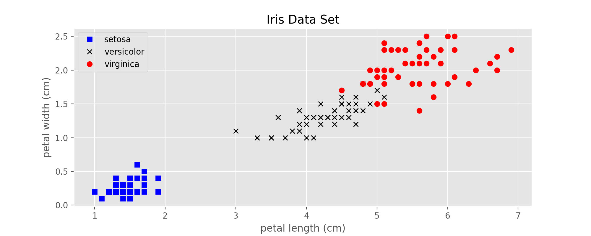</p>
<p><span style="font-family: 'courier new', courier;">图1：Iris data set</span></p>
<p>&nbsp;</p>
<h3><span style="color: #99cc00;">1. SVM的前身：感知机（Perceptron）</span></h3>
<hr>
<p>感知机可以看做是低配版的线性SVM，从数学上可以证明：</p>
<p style="margin-left: 30px;">在线性可分的两类数据中，感知机可以在有限步骤中计算出一条直线（或超平面）将这两类完全分开。</p>
<p>如果这两类距离越近，所需的步骤就越多。此时，感知机只保证给出一个解，但是解不唯一，如下图所示：</p>
<p>&nbsp;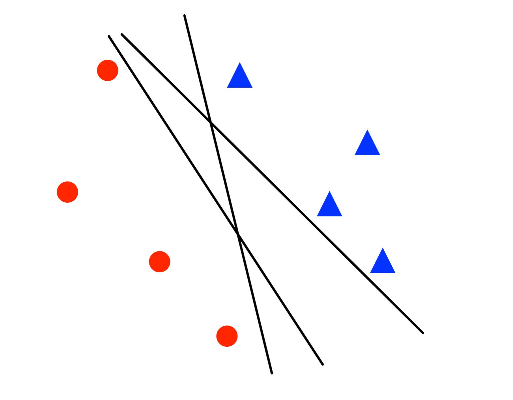</p>
<p>&nbsp;<span style="font-family: 'courier new', courier;">图2：感知机训练出来的3个不同的线性分类器</span></p>
<p>&nbsp;</p>
<h4><strong>1.1 对二分类问题的具体描述</strong></h4>
<p>训练样本<span class="MathJax_Preview" style="color: inherit;"></span><span class="MathJax" id="MathJax-Element-4-Frame" tabindex="0" data-mathml="<math xmlns=&quot;http://www.w3.org/1998/Math/MathML&quot;><mi>x</mi><mo>&amp;#x2208;</mo><msup><mrow class=&quot;MJX-TeXAtom-ORD&quot;><mi mathvariant=&quot;double-struck&quot;>R</mi></mrow><mrow class=&quot;MJX-TeXAtom-ORD&quot;><mi>n</mi></mrow></msup></math>" role="presentation" style="position: relative;"><nobr aria-hidden="true"><span class="math" id="MathJax-Span-14" style="width: 3.75em; display: inline-block;"><span style="display: inline-block; position: relative; width: 3.047em; height: 0px; font-size: 122%;"><span style="position: absolute; clip: rect(1.291em, 1003.05em, 2.403em, -999.997em); top: -2.163em; left: 0em;"><span class="mrow" id="MathJax-Span-15"><span class="mi" id="MathJax-Span-16" style="font-family: MathJax_Math-italic;">x</span><span class="mo" id="MathJax-Span-17" style="font-family: MathJax_Main; padding-left: 0.296em;">∈</span><span class="msubsup" id="MathJax-Span-18" style="padding-left: 0.296em;"><span style="display: inline-block; position: relative; width: 1.232em; height: 0px;"><span style="position: absolute; clip: rect(3.106em, 1000.71em, 4.16em, -999.997em); top: -3.978em; left: 0em;"><span class="texatom" id="MathJax-Span-19"><span class="mrow" id="MathJax-Span-20"><span class="mi" id="MathJax-Span-21" style="font-family: MathJax_AMS;">R</span></span></span><span style="display: inline-block; width: 0px; height: 3.984em;"></span></span><span style="position: absolute; top: -4.388em; left: 0.706em;"><span class="texatom" id="MathJax-Span-22"><span class="mrow" id="MathJax-Span-23"><span class="mi" id="MathJax-Span-24" style="font-size: 70.7%; font-family: MathJax_Math-italic;">n</span></span></span><span style="display: inline-block; width: 0px; height: 3.984em;"></span></span></span></span></span><span style="display: inline-block; width: 0px; height: 2.169em;"></span></span></span><span style="display: inline-block; overflow: hidden; vertical-align: -0.139em; border-left: 0px solid; width: 0px; height: 1.075em;"></span></span></nobr><span class="MJX_Assistive_MathML" role="presentation"><math xmlns="http://www.w3.org/1998/Math/MathML"><mi>x</mi><mo>∈</mo><msup><mrow class="MJX-TeXAtom-ORD"><mi mathvariant="double-struck">R</mi></mrow><mrow class="MJX-TeXAtom-ORD"><mi>n</mi></mrow></msup></math></span></span><script type="math/tex" id="MathJax-Element-4">x \in \mathbb{ R }^{n}</script>，标签<span class="MathJax_Preview" style="color: inherit;"></span><span class="MathJax" id="MathJax-Element-5-Frame" tabindex="0" data-mathml="<math xmlns=&quot;http://www.w3.org/1998/Math/MathML&quot;><mi>y</mi><mo>&amp;#x2208;</mo><mrow class=&quot;MJX-TeXAtom-ORD&quot;><mo>&amp;#x2212;</mo><mn>1</mn><mo>,</mo><mn>1</mn></mrow></math>" role="presentation" style="position: relative;"><nobr aria-hidden="true"><span class="math" id="MathJax-Span-25" style="width: 4.862em; display: inline-block;"><span style="display: inline-block; position: relative; width: 3.984em; height: 0px; font-size: 122%;"><span style="position: absolute; clip: rect(1.35em, 1003.93em, 2.579em, -999.997em); top: -2.163em; left: 0em;"><span class="mrow" id="MathJax-Span-26"><span class="mi" id="MathJax-Span-27" style="font-family: MathJax_Math-italic;">y<span style="display: inline-block; overflow: hidden; height: 1px; width: 0.003em;"></span></span><span class="mo" id="MathJax-Span-28" style="font-family: MathJax_Main; padding-left: 0.296em;">∈</span><span class="texatom" id="MathJax-Span-29" style="padding-left: 0.296em;"><span class="mrow" id="MathJax-Span-30"><span class="mo" id="MathJax-Span-31" style="font-family: MathJax_Main;">−</span><span class="mn" id="MathJax-Span-32" style="font-family: MathJax_Main;">1</span><span class="mo" id="MathJax-Span-33" style="font-family: MathJax_Main;">,</span><span class="mn" id="MathJax-Span-34" style="font-family: MathJax_Main; padding-left: 0.179em;">1</span></span></span></span><span style="display: inline-block; width: 0px; height: 2.169em;"></span></span></span><span style="display: inline-block; overflow: hidden; vertical-align: -0.354em; border-left: 0px solid; width: 0px; height: 1.218em;"></span></span></nobr><span class="MJX_Assistive_MathML" role="presentation"><math xmlns="http://www.w3.org/1998/Math/MathML"><mi>y</mi><mo>∈</mo><mrow class="MJX-TeXAtom-ORD"><mo>−</mo><mn>1</mn><mo>,</mo><mn>1</mn></mrow></math></span></span><script type="math/tex" id="MathJax-Element-5">y \in {-1, 1}</script>，对于线性分类器来说：</p>
<ul>
<li>参数: <span class="MathJax_Preview" style="color: inherit;"></span><span class="MathJax" id="MathJax-Element-6-Frame" tabindex="0" data-mathml="<math xmlns=&quot;http://www.w3.org/1998/Math/MathML&quot;><mi>w</mi><mo>&amp;#x2208;</mo><msup><mrow class=&quot;MJX-TeXAtom-ORD&quot;><mi mathvariant=&quot;double-struck&quot;>R</mi></mrow><mi>n</mi></msup></math>" role="presentation" style="position: relative;"><nobr aria-hidden="true"><span class="math" id="MathJax-Span-35" style="width: 3.926em; display: inline-block;"><span style="display: inline-block; position: relative; width: 3.223em; height: 0px; font-size: 122%;"><span style="position: absolute; clip: rect(1.291em, 1003.22em, 2.403em, -999.997em); top: -2.163em; left: 0em;"><span class="mrow" id="MathJax-Span-36"><span class="mi" id="MathJax-Span-37" style="font-family: MathJax_Math-italic;">w</span><span class="mo" id="MathJax-Span-38" style="font-family: MathJax_Main; padding-left: 0.296em;">∈</span><span class="msubsup" id="MathJax-Span-39" style="padding-left: 0.296em;"><span style="display: inline-block; position: relative; width: 1.232em; height: 0px;"><span style="position: absolute; clip: rect(3.106em, 1000.71em, 4.16em, -999.997em); top: -3.978em; left: 0em;"><span class="texatom" id="MathJax-Span-40"><span class="mrow" id="MathJax-Span-41"><span class="mi" id="MathJax-Span-42" style="font-family: MathJax_AMS;">R</span></span></span><span style="display: inline-block; width: 0px; height: 3.984em;"></span></span><span style="position: absolute; top: -4.388em; left: 0.706em;"><span class="mi" id="MathJax-Span-43" style="font-size: 70.7%; font-family: MathJax_Math-italic;">n</span><span style="display: inline-block; width: 0px; height: 3.984em;"></span></span></span></span></span><span style="display: inline-block; width: 0px; height: 2.169em;"></span></span></span><span style="display: inline-block; overflow: hidden; vertical-align: -0.139em; border-left: 0px solid; width: 0px; height: 1.075em;"></span></span></nobr><span class="MJX_Assistive_MathML" role="presentation"><math xmlns="http://www.w3.org/1998/Math/MathML"><mi>w</mi><mo>∈</mo><msup><mrow class="MJX-TeXAtom-ORD"><mi mathvariant="double-struck">R</mi></mrow><mi>n</mi></msup></math></span></span><script type="math/tex" id="MathJax-Element-6">w \in \mathbb{ R }^n</script> and <span class="MathJax_Preview" style="color: inherit;"></span><span class="MathJax" id="MathJax-Element-7-Frame" tabindex="0" data-mathml="<math xmlns=&quot;http://www.w3.org/1998/Math/MathML&quot;><mi>b</mi><mo>&amp;#x2208;</mo><mrow class=&quot;MJX-TeXAtom-ORD&quot;><mi mathvariant=&quot;double-struck&quot;>R</mi></mrow></math>" role="presentation" style="position: relative;"><nobr aria-hidden="true"><span class="math" id="MathJax-Span-44" style="width: 2.93em; display: inline-block;"><span style="display: inline-block; position: relative; width: 2.403em; height: 0px; font-size: 122%;"><span style="position: absolute; clip: rect(1.584em, 1002.4em, 2.696em, -999.997em); top: -2.456em; left: 0em;"><span class="mrow" id="MathJax-Span-45"><span class="mi" id="MathJax-Span-46" style="font-family: MathJax_Math-italic;">b</span><span class="mo" id="MathJax-Span-47" style="font-family: MathJax_Main; padding-left: 0.296em;">∈</span><span class="texatom" id="MathJax-Span-48" style="padding-left: 0.296em;"><span class="mrow" id="MathJax-Span-49"><span class="mi" id="MathJax-Span-50" style="font-family: MathJax_AMS;">R</span></span></span></span><span style="display: inline-block; width: 0px; height: 2.462em;"></span></span></span><span style="display: inline-block; overflow: hidden; vertical-align: -0.139em; border-left: 0px solid; width: 0px; height: 1.075em;"></span></span></nobr><span class="MJX_Assistive_MathML" role="presentation"><math xmlns="http://www.w3.org/1998/Math/MathML"><mi>b</mi><mo>∈</mo><mrow class="MJX-TeXAtom-ORD"><mi mathvariant="double-struck">R</mi></mrow></math></span></span><script type="math/tex" id="MathJax-Element-7">b \in \mathbb{ R }</script></li>
<li>决策边界（Decision boundary）：<span class="MathJax_Preview" style="color: inherit;"></span><span class="MathJax" id="MathJax-Element-8-Frame" tabindex="0" data-mathml="<math xmlns=&quot;http://www.w3.org/1998/Math/MathML&quot;><mi>w</mi><mo>&amp;#x22C5;</mo><mi>x</mi><mo>+</mo><mi>b</mi><mo>=</mo><mn>0</mn></math>" role="presentation" style="position: relative;"><nobr aria-hidden="true"><span class="math" id="MathJax-Span-51" style="width: 6.794em; display: inline-block;"><span style="display: inline-block; position: relative; width: 5.565em; height: 0px; font-size: 122%;"><span style="position: absolute; clip: rect(1.291em, 1005.51em, 2.403em, -999.997em); top: -2.163em; left: 0em;"><span class="mrow" id="MathJax-Span-52"><span class="mi" id="MathJax-Span-53" style="font-family: MathJax_Math-italic;">w</span><span class="mo" id="MathJax-Span-54" style="font-family: MathJax_Main; padding-left: 0.237em;">⋅</span><span class="mi" id="MathJax-Span-55" style="font-family: MathJax_Math-italic; padding-left: 0.237em;">x</span><span class="mo" id="MathJax-Span-56" style="font-family: MathJax_Main; padding-left: 0.237em;">+</span><span class="mi" id="MathJax-Span-57" style="font-family: MathJax_Math-italic; padding-left: 0.237em;">b</span><span class="mo" id="MathJax-Span-58" style="font-family: MathJax_Main; padding-left: 0.296em;">=</span><span class="mn" id="MathJax-Span-59" style="font-family: MathJax_Main; padding-left: 0.296em;">0</span></span><span style="display: inline-block; width: 0px; height: 2.169em;"></span></span></span><span style="display: inline-block; overflow: hidden; vertical-align: -0.139em; border-left: 0px solid; width: 0px; height: 1.075em;"></span></span></nobr><span class="MJX_Assistive_MathML" role="presentation"><math xmlns="http://www.w3.org/1998/Math/MathML"><mi>w</mi><mo>⋅</mo><mi>x</mi><mo>+</mo><mi>b</mi><mo>=</mo><mn>0</mn></math></span></span><script type="math/tex" id="MathJax-Element-8">w \cdot x + b = 0</script></li>
<li>对于一个新的点<span class="MathJax_Preview" style="color: inherit;"></span><span class="MathJax" id="MathJax-Element-9-Frame" tabindex="0" data-mathml="<math xmlns=&quot;http://www.w3.org/1998/Math/MathML&quot;><mi>x</mi></math>" role="presentation" style="position: relative;"><nobr aria-hidden="true"><span class="math" id="MathJax-Span-60" style="width: 0.764em; display: inline-block;"><span style="display: inline-block; position: relative; width: 0.588em; height: 0px; font-size: 122%;"><span style="position: absolute; clip: rect(1.525em, 1000.53em, 2.345em, -999.997em); top: -2.163em; left: 0em;"><span class="mrow" id="MathJax-Span-61"><span class="mi" id="MathJax-Span-62" style="font-family: MathJax_Math-italic;">x</span></span><span style="display: inline-block; width: 0px; height: 2.169em;"></span></span></span><span style="display: inline-block; overflow: hidden; vertical-align: -0.068em; border-left: 0px solid; width: 0px; height: 0.718em;"></span></span></nobr><span class="MJX_Assistive_MathML" role="presentation"><math xmlns="http://www.w3.org/1998/Math/MathML"><mi>x</mi></math></span></span><script type="math/tex" id="MathJax-Element-9">x</script>做分类时，预测标签为<span class="MathJax_Preview" style="color: inherit;"></span><span class="MathJax" id="MathJax-Element-10-Frame" tabindex="0" data-mathml="<math xmlns=&quot;http://www.w3.org/1998/Math/MathML&quot;><mi>s</mi><mi>i</mi><mi>g</mi><mi>n</mi><mo stretchy=&quot;false&quot;>(</mo><mi>w</mi><mo>&amp;#x22C5;</mo><mi>x</mi><mo>+</mo><mi>b</mi><mo stretchy=&quot;false&quot;>)</mo></math>" role="presentation" style="position: relative;"><nobr aria-hidden="true"><span class="math" id="MathJax-Span-63" style="width: 7.79em; display: inline-block;"><span style="display: inline-block; position: relative; width: 6.385em; height: 0px; font-size: 122%;"><span style="position: absolute; clip: rect(1.232em, 1006.27em, 2.579em, -999.997em); top: -2.163em; left: 0em;"><span class="mrow" id="MathJax-Span-64"><span class="mi" id="MathJax-Span-65" style="font-family: MathJax_Math-italic;">s</span><span class="mi" id="MathJax-Span-66" style="font-family: MathJax_Math-italic;">i</span><span class="mi" id="MathJax-Span-67" style="font-family: MathJax_Math-italic;">g<span style="display: inline-block; overflow: hidden; height: 1px; width: 0.003em;"></span></span><span class="mi" id="MathJax-Span-68" style="font-family: MathJax_Math-italic;">n</span><span class="mo" id="MathJax-Span-69" style="font-family: MathJax_Main;">(</span><span class="mi" id="MathJax-Span-70" style="font-family: MathJax_Math-italic;">w</span><span class="mo" id="MathJax-Span-71" style="font-family: MathJax_Main; padding-left: 0.237em;">⋅</span><span class="mi" id="MathJax-Span-72" style="font-family: MathJax_Math-italic; padding-left: 0.237em;">x</span><span class="mo" id="MathJax-Span-73" style="font-family: MathJax_Main; padding-left: 0.237em;">+</span><span class="mi" id="MathJax-Span-74" style="font-family: MathJax_Math-italic; padding-left: 0.237em;">b</span><span class="mo" id="MathJax-Span-75" style="font-family: MathJax_Main;">)</span></span><span style="display: inline-block; width: 0px; height: 2.169em;"></span></span></span><span style="display: inline-block; overflow: hidden; vertical-align: -0.354em; border-left: 0px solid; width: 0px; height: 1.361em;"></span></span></nobr><span class="MJX_Assistive_MathML" role="presentation"><math xmlns="http://www.w3.org/1998/Math/MathML"><mi>s</mi><mi>i</mi><mi>g</mi><mi>n</mi><mo stretchy="false">(</mo><mi>w</mi><mo>⋅</mo><mi>x</mi><mo>+</mo><mi>b</mi><mo stretchy="false">)</mo></math></span></span><script type="math/tex" id="MathJax-Element-10">sign(w \cdot x + b)</script></li>
</ul>
<p>参考上面的描述，在分类正确的情况下，如果一个点<span class="MathJax_Preview" style="color: inherit;"></span><span class="MathJax" id="MathJax-Element-11-Frame" tabindex="0" data-mathml="<math xmlns=&quot;http://www.w3.org/1998/Math/MathML&quot;><mi>x</mi></math>" role="presentation" style="position: relative;"><nobr aria-hidden="true"><span class="math" id="MathJax-Span-76" style="width: 0.764em; display: inline-block;"><span style="display: inline-block; position: relative; width: 0.588em; height: 0px; font-size: 122%;"><span style="position: absolute; clip: rect(1.525em, 1000.53em, 2.345em, -999.997em); top: -2.163em; left: 0em;"><span class="mrow" id="MathJax-Span-77"><span class="mi" id="MathJax-Span-78" style="font-family: MathJax_Math-italic;">x</span></span><span style="display: inline-block; width: 0px; height: 2.169em;"></span></span></span><span style="display: inline-block; overflow: hidden; vertical-align: -0.068em; border-left: 0px solid; width: 0px; height: 0.718em;"></span></span></nobr><span class="MJX_Assistive_MathML" role="presentation"><math xmlns="http://www.w3.org/1998/Math/MathML"><mi>x</mi></math></span></span><script type="math/tex" id="MathJax-Element-11">x</script>的标签为<span class="MathJax_Preview" style="color: inherit;"></span><span class="MathJax" id="MathJax-Element-12-Frame" tabindex="0" data-mathml="<math xmlns=&quot;http://www.w3.org/1998/Math/MathML&quot;><mi>y</mi><mo>=</mo><mn>1</mn></math>" role="presentation" style="position: relative;"><nobr aria-hidden="true"><span class="math" id="MathJax-Span-79" style="width: 2.872em; display: inline-block;"><span style="display: inline-block; position: relative; width: 2.345em; height: 0px; font-size: 122%;"><span style="position: absolute; clip: rect(1.35em, 1002.29em, 2.579em, -999.997em); top: -2.163em; left: 0em;"><span class="mrow" id="MathJax-Span-80"><span class="mi" id="MathJax-Span-81" style="font-family: MathJax_Math-italic;">y<span style="display: inline-block; overflow: hidden; height: 1px; width: 0.003em;"></span></span><span class="mo" id="MathJax-Span-82" style="font-family: MathJax_Main; padding-left: 0.296em;">=</span><span class="mn" id="MathJax-Span-83" style="font-family: MathJax_Main; padding-left: 0.296em;">1</span></span><span style="display: inline-block; width: 0px; height: 2.169em;"></span></span></span><span style="display: inline-block; overflow: hidden; vertical-align: -0.354em; border-left: 0px solid; width: 0px; height: 1.218em;"></span></span></nobr><span class="MJX_Assistive_MathML" role="presentation"><math xmlns="http://www.w3.org/1998/Math/MathML"><mi>y</mi><mo>=</mo><mn>1</mn></math></span></span><script type="math/tex" id="MathJax-Element-12">y = 1</script>，预测值<span class="MathJax_Preview" style="color: inherit;"></span><span class="MathJax" id="MathJax-Element-13-Frame" tabindex="0" data-mathml="<math xmlns=&quot;http://www.w3.org/1998/Math/MathML&quot;><mi>w</mi><mo>&amp;#x22C5;</mo><mi>x</mi><mo>+</mo><mi>b</mi><mo>&amp;gt;</mo><mn>0</mn></math>" role="presentation" style="position: relative;"><nobr aria-hidden="true"><span class="math" id="MathJax-Span-84" style="width: 6.794em; display: inline-block;"><span style="display: inline-block; position: relative; width: 5.565em; height: 0px; font-size: 122%;"><span style="position: absolute; clip: rect(1.291em, 1005.51em, 2.403em, -999.997em); top: -2.163em; left: 0em;"><span class="mrow" id="MathJax-Span-85"><span class="mi" id="MathJax-Span-86" style="font-family: MathJax_Math-italic;">w</span><span class="mo" id="MathJax-Span-87" style="font-family: MathJax_Main; padding-left: 0.237em;">⋅</span><span class="mi" id="MathJax-Span-88" style="font-family: MathJax_Math-italic; padding-left: 0.237em;">x</span><span class="mo" id="MathJax-Span-89" style="font-family: MathJax_Main; padding-left: 0.237em;">+</span><span class="mi" id="MathJax-Span-90" style="font-family: MathJax_Math-italic; padding-left: 0.237em;">b</span><span class="mo" id="MathJax-Span-91" style="font-family: MathJax_Main; padding-left: 0.296em;">&gt;</span><span class="mn" id="MathJax-Span-92" style="font-family: MathJax_Main; padding-left: 0.296em;">0</span></span><span style="display: inline-block; width: 0px; height: 2.169em;"></span></span></span><span style="display: inline-block; overflow: hidden; vertical-align: -0.139em; border-left: 0px solid; width: 0px; height: 1.075em;"></span></span></nobr><span class="MJX_Assistive_MathML" role="presentation"><math xmlns="http://www.w3.org/1998/Math/MathML"><mi>w</mi><mo>⋅</mo><mi>x</mi><mo>+</mo><mi>b</mi><mo>&gt;</mo><mn>0</mn></math></span></span><script type="math/tex" id="MathJax-Element-13">w \cdot x + b > 0</script>，分类为1；标签为-1，预测值小于0，分类为-1. 那么可以使用<span class="MathJax_Preview" style="color: inherit;"></span><span class="MathJax" id="MathJax-Element-14-Frame" tabindex="0" data-mathml="<math xmlns=&quot;http://www.w3.org/1998/Math/MathML&quot;><mi>y</mi><mo stretchy=&quot;false&quot;>(</mo><mi>w</mi><mo>&amp;#x22C5;</mo><mi>x</mi><mo>+</mo><mi>b</mi><mo stretchy=&quot;false&quot;>)</mo><mo>&amp;gt;</mo><mn>0</mn></math>" role="presentation" style="position: relative;"><nobr aria-hidden="true"><span class="math" id="MathJax-Span-93" style="width: 8.375em; display: inline-block;"><span style="display: inline-block; position: relative; width: 6.853em; height: 0px; font-size: 122%;"><span style="position: absolute; clip: rect(1.232em, 1006.79em, 2.579em, -999.997em); top: -2.163em; left: 0em;"><span class="mrow" id="MathJax-Span-94"><span class="mi" id="MathJax-Span-95" style="font-family: MathJax_Math-italic;">y<span style="display: inline-block; overflow: hidden; height: 1px; width: 0.003em;"></span></span><span class="mo" id="MathJax-Span-96" style="font-family: MathJax_Main;">(</span><span class="mi" id="MathJax-Span-97" style="font-family: MathJax_Math-italic;">w</span><span class="mo" id="MathJax-Span-98" style="font-family: MathJax_Main; padding-left: 0.237em;">⋅</span><span class="mi" id="MathJax-Span-99" style="font-family: MathJax_Math-italic; padding-left: 0.237em;">x</span><span class="mo" id="MathJax-Span-100" style="font-family: MathJax_Main; padding-left: 0.237em;">+</span><span class="mi" id="MathJax-Span-101" style="font-family: MathJax_Math-italic; padding-left: 0.237em;">b</span><span class="mo" id="MathJax-Span-102" style="font-family: MathJax_Main;">)</span><span class="mo" id="MathJax-Span-103" style="font-family: MathJax_Main; padding-left: 0.296em;">&gt;</span><span class="mn" id="MathJax-Span-104" style="font-family: MathJax_Main; padding-left: 0.296em;">0</span></span><span style="display: inline-block; width: 0px; height: 2.169em;"></span></span></span><span style="display: inline-block; overflow: hidden; vertical-align: -0.354em; border-left: 0px solid; width: 0px; height: 1.361em;"></span></span></nobr><span class="MJX_Assistive_MathML" role="presentation"><math xmlns="http://www.w3.org/1998/Math/MathML"><mi>y</mi><mo stretchy="false">(</mo><mi>w</mi><mo>⋅</mo><mi>x</mi><mo>+</mo><mi>b</mi><mo stretchy="false">)</mo><mo>&gt;</mo><mn>0</mn></math></span></span><script type="math/tex" id="MathJax-Element-14">y (w \cdot x + b) > 0 </script>来统一表示分类正确的情况，反之可以使用<span class="MathJax_Preview" style="color: inherit;"></span><span class="MathJax" id="MathJax-Element-15-Frame" tabindex="0" data-mathml="<math xmlns=&quot;http://www.w3.org/1998/Math/MathML&quot;><mi>y</mi><mo stretchy=&quot;false&quot;>(</mo><mi>w</mi><mo>&amp;#x22C5;</mo><mi>x</mi><mo>+</mo><mi>b</mi><mo stretchy=&quot;false&quot;>)</mo><mo>&amp;lt;</mo><mn>0</mn></math>" role="presentation" style="position: relative;"><nobr aria-hidden="true"><span class="math" id="MathJax-Span-105" style="width: 8.375em; display: inline-block;"><span style="display: inline-block; position: relative; width: 6.853em; height: 0px; font-size: 122%;"><span style="position: absolute; clip: rect(1.232em, 1006.79em, 2.579em, -999.997em); top: -2.163em; left: 0em;"><span class="mrow" id="MathJax-Span-106"><span class="mi" id="MathJax-Span-107" style="font-family: MathJax_Math-italic;">y<span style="display: inline-block; overflow: hidden; height: 1px; width: 0.003em;"></span></span><span class="mo" id="MathJax-Span-108" style="font-family: MathJax_Main;">(</span><span class="mi" id="MathJax-Span-109" style="font-family: MathJax_Math-italic;">w</span><span class="mo" id="MathJax-Span-110" style="font-family: MathJax_Main; padding-left: 0.237em;">⋅</span><span class="mi" id="MathJax-Span-111" style="font-family: MathJax_Math-italic; padding-left: 0.237em;">x</span><span class="mo" id="MathJax-Span-112" style="font-family: MathJax_Main; padding-left: 0.237em;">+</span><span class="mi" id="MathJax-Span-113" style="font-family: MathJax_Math-italic; padding-left: 0.237em;">b</span><span class="mo" id="MathJax-Span-114" style="font-family: MathJax_Main;">)</span><span class="mo" id="MathJax-Span-115" style="font-family: MathJax_Main; padding-left: 0.296em;">&lt;</span><span class="mn" id="MathJax-Span-116" style="font-family: MathJax_Main; padding-left: 0.296em;">0</span></span><span style="display: inline-block; width: 0px; height: 2.169em;"></span></span></span><span style="display: inline-block; overflow: hidden; vertical-align: -0.354em; border-left: 0px solid; width: 0px; height: 1.361em;"></span></span></nobr><span class="MJX_Assistive_MathML" role="presentation"><math xmlns="http://www.w3.org/1998/Math/MathML"><mi>y</mi><mo stretchy="false">(</mo><mi>w</mi><mo>⋅</mo><mi>x</mi><mo>+</mo><mi>b</mi><mo stretchy="false">)</mo><mo>&lt;</mo><mn>0</mn></math></span></span><script type="math/tex" id="MathJax-Element-15">y(w \cdot x + b) < 0</script>来表示分类错误的情况。</p>
<p><strong>&nbsp;</strong></p>
<h4><strong>1.2 代价函数<br></strong></h4>
<p>在分类正确时，即<span class="MathJax_Preview" style="color: inherit;"></span><span class="MathJax" id="MathJax-Element-16-Frame" tabindex="0" data-mathml="<math xmlns=&quot;http://www.w3.org/1998/Math/MathML&quot;><mi>y</mi><mo stretchy=&quot;false&quot;>(</mo><mi>w</mi><mo>&amp;#x22C5;</mo><mi>x</mi><mo>+</mo><mi>b</mi><mo stretchy=&quot;false&quot;>)</mo><mo>&amp;gt;</mo><mn>0</mn></math>" role="presentation" style="position: relative;"><nobr aria-hidden="true"><span class="math" id="MathJax-Span-117" style="width: 8.375em; display: inline-block;"><span style="display: inline-block; position: relative; width: 6.853em; height: 0px; font-size: 122%;"><span style="position: absolute; clip: rect(1.232em, 1006.79em, 2.579em, -999.997em); top: -2.163em; left: 0em;"><span class="mrow" id="MathJax-Span-118"><span class="mi" id="MathJax-Span-119" style="font-family: MathJax_Math-italic;">y<span style="display: inline-block; overflow: hidden; height: 1px; width: 0.003em;"></span></span><span class="mo" id="MathJax-Span-120" style="font-family: MathJax_Main;">(</span><span class="mi" id="MathJax-Span-121" style="font-family: MathJax_Math-italic;">w</span><span class="mo" id="MathJax-Span-122" style="font-family: MathJax_Main; padding-left: 0.237em;">⋅</span><span class="mi" id="MathJax-Span-123" style="font-family: MathJax_Math-italic; padding-left: 0.237em;">x</span><span class="mo" id="MathJax-Span-124" style="font-family: MathJax_Main; padding-left: 0.237em;">+</span><span class="mi" id="MathJax-Span-125" style="font-family: MathJax_Math-italic; padding-left: 0.237em;">b</span><span class="mo" id="MathJax-Span-126" style="font-family: MathJax_Main;">)</span><span class="mo" id="MathJax-Span-127" style="font-family: MathJax_Main; padding-left: 0.296em;">&gt;</span><span class="mn" id="MathJax-Span-128" style="font-family: MathJax_Main; padding-left: 0.296em;">0</span></span><span style="display: inline-block; width: 0px; height: 2.169em;"></span></span></span><span style="display: inline-block; overflow: hidden; vertical-align: -0.354em; border-left: 0px solid; width: 0px; height: 1.361em;"></span></span></nobr><span class="MJX_Assistive_MathML" role="presentation"><math xmlns="http://www.w3.org/1998/Math/MathML"><mi>y</mi><mo stretchy="false">(</mo><mi>w</mi><mo>⋅</mo><mi>x</mi><mo>+</mo><mi>b</mi><mo stretchy="false">)</mo><mo>&gt;</mo><mn>0</mn></math></span></span><script type="math/tex" id="MathJax-Element-16">y (w \cdot x + b) > 0</script>，<span class="MathJax_Preview" style="color: inherit;"></span><span class="MathJax" id="MathJax-Element-17-Frame" tabindex="0" data-mathml="<math xmlns=&quot;http://www.w3.org/1998/Math/MathML&quot;><mi>l</mi><mi>o</mi><mi>s</mi><mi>s</mi><mo>=</mo><mn>0</mn></math>" role="presentation" style="position: relative;"><nobr aria-hidden="true"><span class="math" id="MathJax-Span-129" style="width: 4.394em; display: inline-block;"><span style="display: inline-block; position: relative; width: 3.574em; height: 0px; font-size: 122%;"><span style="position: absolute; clip: rect(1.291em, 1003.52em, 2.345em, -999.997em); top: -2.163em; left: 0em;"><span class="mrow" id="MathJax-Span-130"><span class="mi" id="MathJax-Span-131" style="font-family: MathJax_Math-italic;">l</span><span class="mi" id="MathJax-Span-132" style="font-family: MathJax_Math-italic;">o</span><span class="mi" id="MathJax-Span-133" style="font-family: MathJax_Math-italic;">s</span><span class="mi" id="MathJax-Span-134" style="font-family: MathJax_Math-italic;">s</span><span class="mo" id="MathJax-Span-135" style="font-family: MathJax_Main; padding-left: 0.296em;">=</span><span class="mn" id="MathJax-Span-136" style="font-family: MathJax_Main; padding-left: 0.296em;">0</span></span><span style="display: inline-block; width: 0px; height: 2.169em;"></span></span></span><span style="display: inline-block; overflow: hidden; vertical-align: -0.068em; border-left: 0px solid; width: 0px; height: 1.004em;"></span></span></nobr><span class="MJX_Assistive_MathML" role="presentation"><math xmlns="http://www.w3.org/1998/Math/MathML"><mi>l</mi><mi>o</mi><mi>s</mi><mi>s</mi><mo>=</mo><mn>0</mn></math></span></span><script type="math/tex" id="MathJax-Element-17">loss = 0</script>;</p>
<p>在分类错误时，即<span class="MathJax_Preview" style="color: inherit;"></span><span class="MathJax" id="MathJax-Element-18-Frame" tabindex="0" data-mathml="<math xmlns=&quot;http://www.w3.org/1998/Math/MathML&quot;><mi>y</mi><mo stretchy=&quot;false&quot;>(</mo><mi>w</mi><mo>&amp;#x22C5;</mo><mi>x</mi><mo>+</mo><mi>b</mi><mo stretchy=&quot;false&quot;>)</mo><mo>&amp;#x2264;</mo><mn>0</mn></math>" role="presentation" style="position: relative;"><nobr aria-hidden="true"><span class="math" id="MathJax-Span-137" style="width: 8.375em; display: inline-block;"><span style="display: inline-block; position: relative; width: 6.853em; height: 0px; font-size: 122%;"><span style="position: absolute; clip: rect(1.232em, 1006.79em, 2.579em, -999.997em); top: -2.163em; left: 0em;"><span class="mrow" id="MathJax-Span-138"><span class="mi" id="MathJax-Span-139" style="font-family: MathJax_Math-italic;">y<span style="display: inline-block; overflow: hidden; height: 1px; width: 0.003em;"></span></span><span class="mo" id="MathJax-Span-140" style="font-family: MathJax_Main;">(</span><span class="mi" id="MathJax-Span-141" style="font-family: MathJax_Math-italic;">w</span><span class="mo" id="MathJax-Span-142" style="font-family: MathJax_Main; padding-left: 0.237em;">⋅</span><span class="mi" id="MathJax-Span-143" style="font-family: MathJax_Math-italic; padding-left: 0.237em;">x</span><span class="mo" id="MathJax-Span-144" style="font-family: MathJax_Main; padding-left: 0.237em;">+</span><span class="mi" id="MathJax-Span-145" style="font-family: MathJax_Math-italic; padding-left: 0.237em;">b</span><span class="mo" id="MathJax-Span-146" style="font-family: MathJax_Main;">)</span><span class="mo" id="MathJax-Span-147" style="font-family: MathJax_Main; padding-left: 0.296em;">≤</span><span class="mn" id="MathJax-Span-148" style="font-family: MathJax_Main; padding-left: 0.296em;">0</span></span><span style="display: inline-block; width: 0px; height: 2.169em;"></span></span></span><span style="display: inline-block; overflow: hidden; vertical-align: -0.354em; border-left: 0px solid; width: 0px; height: 1.361em;"></span></span></nobr><span class="MJX_Assistive_MathML" role="presentation"><math xmlns="http://www.w3.org/1998/Math/MathML"><mi>y</mi><mo stretchy="false">(</mo><mi>w</mi><mo>⋅</mo><mi>x</mi><mo>+</mo><mi>b</mi><mo stretchy="false">)</mo><mo>≤</mo><mn>0</mn></math></span></span><script type="math/tex" id="MathJax-Element-18">y (w \cdot x + b) \leq 0</script>，<span class="MathJax_Preview" style="color: inherit;"></span><span class="MathJax" id="MathJax-Element-19-Frame" tabindex="0" data-mathml="<math xmlns=&quot;http://www.w3.org/1998/Math/MathML&quot;><mi>l</mi><mi>o</mi><mi>s</mi><mi>s</mi><mo>=</mo><mo>&amp;#x2212;</mo><mi>y</mi><mo stretchy=&quot;false&quot;>(</mo><mi>w</mi><mo>&amp;#x22C5;</mo><mi>x</mi><mo>+</mo><mi>b</mi><mo stretchy=&quot;false&quot;>)</mo></math>" role="presentation" style="position: relative;"><nobr aria-hidden="true"><span class="math" id="MathJax-Span-149" style="width: 10.834em; display: inline-block;"><span style="display: inline-block; position: relative; width: 8.844em; height: 0px; font-size: 122%;"><span style="position: absolute; clip: rect(1.232em, 1008.73em, 2.579em, -999.997em); top: -2.163em; left: 0em;"><span class="mrow" id="MathJax-Span-150"><span class="mi" id="MathJax-Span-151" style="font-family: MathJax_Math-italic;">l</span><span class="mi" id="MathJax-Span-152" style="font-family: MathJax_Math-italic;">o</span><span class="mi" id="MathJax-Span-153" style="font-family: MathJax_Math-italic;">s</span><span class="mi" id="MathJax-Span-154" style="font-family: MathJax_Math-italic;">s</span><span class="mo" id="MathJax-Span-155" style="font-family: MathJax_Main; padding-left: 0.296em;">=</span><span class="mo" id="MathJax-Span-156" style="font-family: MathJax_Main; padding-left: 0.296em;">−</span><span class="mi" id="MathJax-Span-157" style="font-family: MathJax_Math-italic;">y<span style="display: inline-block; overflow: hidden; height: 1px; width: 0.003em;"></span></span><span class="mo" id="MathJax-Span-158" style="font-family: MathJax_Main;">(</span><span class="mi" id="MathJax-Span-159" style="font-family: MathJax_Math-italic;">w</span><span class="mo" id="MathJax-Span-160" style="font-family: MathJax_Main; padding-left: 0.237em;">⋅</span><span class="mi" id="MathJax-Span-161" style="font-family: MathJax_Math-italic; padding-left: 0.237em;">x</span><span class="mo" id="MathJax-Span-162" style="font-family: MathJax_Main; padding-left: 0.237em;">+</span><span class="mi" id="MathJax-Span-163" style="font-family: MathJax_Math-italic; padding-left: 0.237em;">b</span><span class="mo" id="MathJax-Span-164" style="font-family: MathJax_Main;">)</span></span><span style="display: inline-block; width: 0px; height: 2.169em;"></span></span></span><span style="display: inline-block; overflow: hidden; vertical-align: -0.354em; border-left: 0px solid; width: 0px; height: 1.361em;"></span></span></nobr><span class="MJX_Assistive_MathML" role="presentation"><math xmlns="http://www.w3.org/1998/Math/MathML"><mi>l</mi><mi>o</mi><mi>s</mi><mi>s</mi><mo>=</mo><mo>−</mo><mi>y</mi><mo stretchy="false">(</mo><mi>w</mi><mo>⋅</mo><mi>x</mi><mo>+</mo><mi>b</mi><mo stretchy="false">)</mo></math></span></span><script type="math/tex" id="MathJax-Element-19">loss = -y (w \cdot x + b)</script>.</p>
<p>&nbsp;</p>
<h4>1.3 算法的流程</h4>
<p>利用随机梯度下降的方式训练模型，每次只使用一个样本，根据代价函数的梯度更新参数，</p>
<p>step1: 初始化<span class="MathJax_Preview" style="color: inherit;"></span><span class="MathJax" id="MathJax-Element-20-Frame" tabindex="0" data-mathml="<math xmlns=&quot;http://www.w3.org/1998/Math/MathML&quot;><mi>w</mi><mo>=</mo><mn>0</mn><mo>,</mo><mi>b</mi><mo>=</mo><mn>0</mn></math>" role="presentation" style="position: relative;"><nobr aria-hidden="true"><span class="math" id="MathJax-Span-165" style="width: 6.502em; display: inline-block;"><span style="display: inline-block; position: relative; width: 5.331em; height: 0px; font-size: 122%;"><span style="position: absolute; clip: rect(1.291em, 1005.27em, 2.52em, -999.997em); top: -2.163em; left: 0em;"><span class="mrow" id="MathJax-Span-166"><span class="mi" id="MathJax-Span-167" style="font-family: MathJax_Math-italic;">w</span><span class="mo" id="MathJax-Span-168" style="font-family: MathJax_Main; padding-left: 0.296em;">=</span><span class="mn" id="MathJax-Span-169" style="font-family: MathJax_Main; padding-left: 0.296em;">0</span><span class="mo" id="MathJax-Span-170" style="font-family: MathJax_Main;">,</span><span class="mi" id="MathJax-Span-171" style="font-family: MathJax_Math-italic; padding-left: 0.179em;">b</span><span class="mo" id="MathJax-Span-172" style="font-family: MathJax_Main; padding-left: 0.296em;">=</span><span class="mn" id="MathJax-Span-173" style="font-family: MathJax_Main; padding-left: 0.296em;">0</span></span><span style="display: inline-block; width: 0px; height: 2.169em;"></span></span></span><span style="display: inline-block; overflow: hidden; vertical-align: -0.282em; border-left: 0px solid; width: 0px; height: 1.218em;"></span></span></nobr><span class="MJX_Assistive_MathML" role="presentation"><math xmlns="http://www.w3.org/1998/Math/MathML"><mi>w</mi><mo>=</mo><mn>0</mn><mo>,</mo><mi>b</mi><mo>=</mo><mn>0</mn></math></span></span><script type="math/tex" id="MathJax-Element-20">w = 0, b = 0</script>;</p>
<p>step2: 循环从训练集取样本，每次一个</p>
<p>&nbsp; &nbsp; &nbsp; &nbsp; &nbsp; &nbsp;if <span class="MathJax_Preview" style="color: inherit;"></span><span class="MathJax" id="MathJax-Element-21-Frame" tabindex="0" data-mathml="<math xmlns=&quot;http://www.w3.org/1998/Math/MathML&quot;><mi>y</mi><mo stretchy=&quot;false&quot;>(</mo><mi>w</mi><mo>&amp;#x22C5;</mo><mi>x</mi><mo>+</mo><mi>b</mi><mo stretchy=&quot;false&quot;>)</mo><mo>&amp;#x2264;</mo><mn>0</mn></math>" role="presentation" style="position: relative;"><nobr aria-hidden="true"><span class="math" id="MathJax-Span-174" style="width: 8.375em; display: inline-block;"><span style="display: inline-block; position: relative; width: 6.853em; height: 0px; font-size: 122%;"><span style="position: absolute; clip: rect(1.232em, 1006.79em, 2.579em, -999.997em); top: -2.163em; left: 0em;"><span class="mrow" id="MathJax-Span-175"><span class="mi" id="MathJax-Span-176" style="font-family: MathJax_Math-italic;">y<span style="display: inline-block; overflow: hidden; height: 1px; width: 0.003em;"></span></span><span class="mo" id="MathJax-Span-177" style="font-family: MathJax_Main;">(</span><span class="mi" id="MathJax-Span-178" style="font-family: MathJax_Math-italic;">w</span><span class="mo" id="MathJax-Span-179" style="font-family: MathJax_Main; padding-left: 0.237em;">⋅</span><span class="mi" id="MathJax-Span-180" style="font-family: MathJax_Math-italic; padding-left: 0.237em;">x</span><span class="mo" id="MathJax-Span-181" style="font-family: MathJax_Main; padding-left: 0.237em;">+</span><span class="mi" id="MathJax-Span-182" style="font-family: MathJax_Math-italic; padding-left: 0.237em;">b</span><span class="mo" id="MathJax-Span-183" style="font-family: MathJax_Main;">)</span><span class="mo" id="MathJax-Span-184" style="font-family: MathJax_Main; padding-left: 0.296em;">≤</span><span class="mn" id="MathJax-Span-185" style="font-family: MathJax_Main; padding-left: 0.296em;">0</span></span><span style="display: inline-block; width: 0px; height: 2.169em;"></span></span></span><span style="display: inline-block; overflow: hidden; vertical-align: -0.354em; border-left: 0px solid; width: 0px; height: 1.361em;"></span></span></nobr><span class="MJX_Assistive_MathML" role="presentation"><math xmlns="http://www.w3.org/1998/Math/MathML"><mi>y</mi><mo stretchy="false">(</mo><mi>w</mi><mo>⋅</mo><mi>x</mi><mo>+</mo><mi>b</mi><mo stretchy="false">)</mo><mo>≤</mo><mn>0</mn></math></span></span><script type="math/tex" id="MathJax-Element-21">y (w \cdot x + b) \leq 0</script>（该样本分类错误）:</p>
<p>&nbsp; &nbsp; &nbsp; &nbsp; &nbsp; &nbsp; &nbsp; &nbsp;w = w + yx</p>
<p>&nbsp; &nbsp; &nbsp; &nbsp; &nbsp; &nbsp; &nbsp; &nbsp;b = b + y</p>
<p>从流程上来看，每次取出一个样本点训练模型，而且只在分错的情况下更新参数，最终所有样本都分类正确时，模型训练过程结束。</p>
<p>&nbsp;</p>
<h3><span style="color: #99cc00;">2. SVM - 线性可分</span></h3>
<hr>
<p>在两类样本线性可分的情况下，感知机可以保证找到一个解，完全正确的区分这两类样本。但是解不唯一，而且这些决策边界的质量也不相同，直观上来看这条线两边的间隔越大越好。那么有没有一种方法可以直接找到这个最优解呢？这就是线性SVM所做的事情。</p>
<p>从直观上来看，约束条件越多对模型的限制也就越大，因此解的个数也就越少。感知机的解不唯一，那么给感知机的代价函数加上更强的约束条件好像就可以减少解的个数。事实上也是这样的。</p>
<h4>2.1 SVM的代价函数</h4>
<p>在分类正确时，即<span class="MathJax_Preview" style="color: inherit;"></span><span class="MathJax" id="MathJax-Element-22-Frame" tabindex="0" data-mathml="<math xmlns=&quot;http://www.w3.org/1998/Math/MathML&quot;><mi>y</mi><mo stretchy=&quot;false&quot;>(</mo><mi>w</mi><mo>&amp;#x22C5;</mo><mi>x</mi><mo>+</mo><mi>b</mi><mo stretchy=&quot;false&quot;>)</mo><mo>&amp;gt;</mo><mn>1</mn></math>" role="presentation" style="position: relative;"><nobr aria-hidden="true"><span class="math" id="MathJax-Span-186" style="width: 8.375em; display: inline-block;"><span style="display: inline-block; position: relative; width: 6.853em; height: 0px; font-size: 122%;"><span style="position: absolute; clip: rect(1.232em, 1006.79em, 2.579em, -999.997em); top: -2.163em; left: 0em;"><span class="mrow" id="MathJax-Span-187"><span class="mi" id="MathJax-Span-188" style="font-family: MathJax_Math-italic;">y<span style="display: inline-block; overflow: hidden; height: 1px; width: 0.003em;"></span></span><span class="mo" id="MathJax-Span-189" style="font-family: MathJax_Main;">(</span><span class="mi" id="MathJax-Span-190" style="font-family: MathJax_Math-italic;">w</span><span class="mo" id="MathJax-Span-191" style="font-family: MathJax_Main; padding-left: 0.237em;">⋅</span><span class="mi" id="MathJax-Span-192" style="font-family: MathJax_Math-italic; padding-left: 0.237em;">x</span><span class="mo" id="MathJax-Span-193" style="font-family: MathJax_Main; padding-left: 0.237em;">+</span><span class="mi" id="MathJax-Span-194" style="font-family: MathJax_Math-italic; padding-left: 0.237em;">b</span><span class="mo" id="MathJax-Span-195" style="font-family: MathJax_Main;">)</span><span class="mo" id="MathJax-Span-196" style="font-family: MathJax_Main; padding-left: 0.296em;">&gt;</span><span class="mn" id="MathJax-Span-197" style="font-family: MathJax_Main; padding-left: 0.296em;">1</span></span><span style="display: inline-block; width: 0px; height: 2.169em;"></span></span></span><span style="display: inline-block; overflow: hidden; vertical-align: -0.354em; border-left: 0px solid; width: 0px; height: 1.361em;"></span></span></nobr><span class="MJX_Assistive_MathML" role="presentation"><math xmlns="http://www.w3.org/1998/Math/MathML"><mi>y</mi><mo stretchy="false">(</mo><mi>w</mi><mo>⋅</mo><mi>x</mi><mo>+</mo><mi>b</mi><mo stretchy="false">)</mo><mo>&gt;</mo><mn>1</mn></math></span></span><script type="math/tex" id="MathJax-Element-22">y (w \cdot x + b) > 1</script>，<span class="MathJax_Preview" style="color: inherit;"></span><span class="MathJax" id="MathJax-Element-23-Frame" tabindex="0" data-mathml="<math xmlns=&quot;http://www.w3.org/1998/Math/MathML&quot;><mi>l</mi><mi>o</mi><mi>s</mi><mi>s</mi><mo>=</mo><mn>0</mn></math>" role="presentation" style="position: relative;"><nobr aria-hidden="true"><span class="math" id="MathJax-Span-198" style="width: 4.394em; display: inline-block;"><span style="display: inline-block; position: relative; width: 3.574em; height: 0px; font-size: 122%;"><span style="position: absolute; clip: rect(1.291em, 1003.52em, 2.345em, -999.997em); top: -2.163em; left: 0em;"><span class="mrow" id="MathJax-Span-199"><span class="mi" id="MathJax-Span-200" style="font-family: MathJax_Math-italic;">l</span><span class="mi" id="MathJax-Span-201" style="font-family: MathJax_Math-italic;">o</span><span class="mi" id="MathJax-Span-202" style="font-family: MathJax_Math-italic;">s</span><span class="mi" id="MathJax-Span-203" style="font-family: MathJax_Math-italic;">s</span><span class="mo" id="MathJax-Span-204" style="font-family: MathJax_Main; padding-left: 0.296em;">=</span><span class="mn" id="MathJax-Span-205" style="font-family: MathJax_Main; padding-left: 0.296em;">0</span></span><span style="display: inline-block; width: 0px; height: 2.169em;"></span></span></span><span style="display: inline-block; overflow: hidden; vertical-align: -0.068em; border-left: 0px solid; width: 0px; height: 1.004em;"></span></span></nobr><span class="MJX_Assistive_MathML" role="presentation"><math xmlns="http://www.w3.org/1998/Math/MathML"><mi>l</mi><mi>o</mi><mi>s</mi><mi>s</mi><mo>=</mo><mn>0</mn></math></span></span><script type="math/tex" id="MathJax-Element-23">loss = 0</script>;</p>
<p>在分类错误时，即<span class="MathJax_Preview" style="color: inherit;"></span><span class="MathJax" id="MathJax-Element-24-Frame" tabindex="0" data-mathml="<math xmlns=&quot;http://www.w3.org/1998/Math/MathML&quot;><mi>y</mi><mo stretchy=&quot;false&quot;>(</mo><mi>w</mi><mo>&amp;#x22C5;</mo><mi>x</mi><mo>+</mo><mi>b</mi><mo stretchy=&quot;false&quot;>)</mo><mo>&amp;#x2264;</mo><mn>1</mn></math>" role="presentation" style="position: relative;"><nobr aria-hidden="true"><span class="math" id="MathJax-Span-206" style="width: 8.375em; display: inline-block;"><span style="display: inline-block; position: relative; width: 6.853em; height: 0px; font-size: 122%;"><span style="position: absolute; clip: rect(1.232em, 1006.79em, 2.579em, -999.997em); top: -2.163em; left: 0em;"><span class="mrow" id="MathJax-Span-207"><span class="mi" id="MathJax-Span-208" style="font-family: MathJax_Math-italic;">y<span style="display: inline-block; overflow: hidden; height: 1px; width: 0.003em;"></span></span><span class="mo" id="MathJax-Span-209" style="font-family: MathJax_Main;">(</span><span class="mi" id="MathJax-Span-210" style="font-family: MathJax_Math-italic;">w</span><span class="mo" id="MathJax-Span-211" style="font-family: MathJax_Main; padding-left: 0.237em;">⋅</span><span class="mi" id="MathJax-Span-212" style="font-family: MathJax_Math-italic; padding-left: 0.237em;">x</span><span class="mo" id="MathJax-Span-213" style="font-family: MathJax_Main; padding-left: 0.237em;">+</span><span class="mi" id="MathJax-Span-214" style="font-family: MathJax_Math-italic; padding-left: 0.237em;">b</span><span class="mo" id="MathJax-Span-215" style="font-family: MathJax_Main;">)</span><span class="mo" id="MathJax-Span-216" style="font-family: MathJax_Main; padding-left: 0.296em;">≤</span><span class="mn" id="MathJax-Span-217" style="font-family: MathJax_Main; padding-left: 0.296em;">1</span></span><span style="display: inline-block; width: 0px; height: 2.169em;"></span></span></span><span style="display: inline-block; overflow: hidden; vertical-align: -0.354em; border-left: 0px solid; width: 0px; height: 1.361em;"></span></span></nobr><span class="MJX_Assistive_MathML" role="presentation"><math xmlns="http://www.w3.org/1998/Math/MathML"><mi>y</mi><mo stretchy="false">(</mo><mi>w</mi><mo>⋅</mo><mi>x</mi><mo>+</mo><mi>b</mi><mo stretchy="false">)</mo><mo>≤</mo><mn>1</mn></math></span></span><script type="math/tex" id="MathJax-Element-24">y (w \cdot x + b) \leq 1</script>，<span class="MathJax_Preview" style="color: inherit;"></span><span class="MathJax" id="MathJax-Element-25-Frame" tabindex="0" data-mathml="<math xmlns=&quot;http://www.w3.org/1998/Math/MathML&quot;><mi>l</mi><mi>o</mi><mi>s</mi><mi>s</mi><mo>=</mo><mo>&amp;#x2212;</mo><mi>y</mi><mo stretchy=&quot;false&quot;>(</mo><mi>w</mi><mo>&amp;#x22C5;</mo><mi>x</mi><mo>+</mo><mi>b</mi><mo stretchy=&quot;false&quot;>)</mo></math>" role="presentation" style="position: relative;"><nobr aria-hidden="true"><span class="math" id="MathJax-Span-218" style="width: 10.834em; display: inline-block;"><span style="display: inline-block; position: relative; width: 8.844em; height: 0px; font-size: 122%;"><span style="position: absolute; clip: rect(1.232em, 1008.73em, 2.579em, -999.997em); top: -2.163em; left: 0em;"><span class="mrow" id="MathJax-Span-219"><span class="mi" id="MathJax-Span-220" style="font-family: MathJax_Math-italic;">l</span><span class="mi" id="MathJax-Span-221" style="font-family: MathJax_Math-italic;">o</span><span class="mi" id="MathJax-Span-222" style="font-family: MathJax_Math-italic;">s</span><span class="mi" id="MathJax-Span-223" style="font-family: MathJax_Math-italic;">s</span><span class="mo" id="MathJax-Span-224" style="font-family: MathJax_Main; padding-left: 0.296em;">=</span><span class="mo" id="MathJax-Span-225" style="font-family: MathJax_Main; padding-left: 0.296em;">−</span><span class="mi" id="MathJax-Span-226" style="font-family: MathJax_Math-italic;">y<span style="display: inline-block; overflow: hidden; height: 1px; width: 0.003em;"></span></span><span class="mo" id="MathJax-Span-227" style="font-family: MathJax_Main;">(</span><span class="mi" id="MathJax-Span-228" style="font-family: MathJax_Math-italic;">w</span><span class="mo" id="MathJax-Span-229" style="font-family: MathJax_Main; padding-left: 0.237em;">⋅</span><span class="mi" id="MathJax-Span-230" style="font-family: MathJax_Math-italic; padding-left: 0.237em;">x</span><span class="mo" id="MathJax-Span-231" style="font-family: MathJax_Main; padding-left: 0.237em;">+</span><span class="mi" id="MathJax-Span-232" style="font-family: MathJax_Math-italic; padding-left: 0.237em;">b</span><span class="mo" id="MathJax-Span-233" style="font-family: MathJax_Main;">)</span></span><span style="display: inline-block; width: 0px; height: 2.169em;"></span></span></span><span style="display: inline-block; overflow: hidden; vertical-align: -0.354em; border-left: 0px solid; width: 0px; height: 1.361em;"></span></span></nobr><span class="MJX_Assistive_MathML" role="presentation"><math xmlns="http://www.w3.org/1998/Math/MathML"><mi>l</mi><mi>o</mi><mi>s</mi><mi>s</mi><mo>=</mo><mo>−</mo><mi>y</mi><mo stretchy="false">(</mo><mi>w</mi><mo>⋅</mo><mi>x</mi><mo>+</mo><mi>b</mi><mo stretchy="false">)</mo></math></span></span><script type="math/tex" id="MathJax-Element-25">loss = -y (w \cdot x + b)</script>.</p>
<p>比较一下可以发现，原来<span class="MathJax_Preview" style="color: inherit;"></span><span class="MathJax" id="MathJax-Element-26-Frame" tabindex="0" data-mathml="<math xmlns=&quot;http://www.w3.org/1998/Math/MathML&quot;><mi>w</mi><mo>&amp;#x22C5;</mo><mi>x</mi><mo>+</mo><mi>b</mi></math>" role="presentation" style="position: relative;"><nobr aria-hidden="true"><span class="math" id="MathJax-Span-234" style="width: 4.511em; display: inline-block;"><span style="display: inline-block; position: relative; width: 3.691em; height: 0px; font-size: 122%;"><span style="position: absolute; clip: rect(1.291em, 1003.69em, 2.403em, -999.997em); top: -2.163em; left: 0em;"><span class="mrow" id="MathJax-Span-235"><span class="mi" id="MathJax-Span-236" style="font-family: MathJax_Math-italic;">w</span><span class="mo" id="MathJax-Span-237" style="font-family: MathJax_Main; padding-left: 0.237em;">⋅</span><span class="mi" id="MathJax-Span-238" style="font-family: MathJax_Math-italic; padding-left: 0.237em;">x</span><span class="mo" id="MathJax-Span-239" style="font-family: MathJax_Main; padding-left: 0.237em;">+</span><span class="mi" id="MathJax-Span-240" style="font-family: MathJax_Math-italic; padding-left: 0.237em;">b</span></span><span style="display: inline-block; width: 0px; height: 2.169em;"></span></span></span><span style="display: inline-block; overflow: hidden; vertical-align: -0.139em; border-left: 0px solid; width: 0px; height: 1.075em;"></span></span></nobr><span class="MJX_Assistive_MathML" role="presentation"><math xmlns="http://www.w3.org/1998/Math/MathML"><mi>w</mi><mo>⋅</mo><mi>x</mi><mo>+</mo><mi>b</mi></math></span></span><script type="math/tex" id="MathJax-Element-26">w \cdot x + b</script>只需要大于0或小于0就可以了，但是现在需要大于1或小于1. 在这里为什么选择1我还没有很直观的解释，但是有一点非常重要：原来的决策边界只是一条直线，现在则变成了一条有宽度的条带。原来差异非常小的两个点（例如<span class="MathJax_Preview" style="color: inherit;"></span><span class="MathJax" id="MathJax-Element-27-Frame" tabindex="0" data-mathml="<math xmlns=&quot;http://www.w3.org/1998/Math/MathML&quot;><mi>w</mi><mo>&amp;#x22C5;</mo><mi>x</mi><mo>+</mo><mi>b</mi><mo>=</mo><mn>0</mn></math>" role="presentation" style="position: relative;"><nobr aria-hidden="true"><span class="math" id="MathJax-Span-241" style="width: 6.794em; display: inline-block;"><span style="display: inline-block; position: relative; width: 5.565em; height: 0px; font-size: 122%;"><span style="position: absolute; clip: rect(1.291em, 1005.51em, 2.403em, -999.997em); top: -2.163em; left: 0em;"><span class="mrow" id="MathJax-Span-242"><span class="mi" id="MathJax-Span-243" style="font-family: MathJax_Math-italic;">w</span><span class="mo" id="MathJax-Span-244" style="font-family: MathJax_Main; padding-left: 0.237em;">⋅</span><span class="mi" id="MathJax-Span-245" style="font-family: MathJax_Math-italic; padding-left: 0.237em;">x</span><span class="mo" id="MathJax-Span-246" style="font-family: MathJax_Main; padding-left: 0.237em;">+</span><span class="mi" id="MathJax-Span-247" style="font-family: MathJax_Math-italic; padding-left: 0.237em;">b</span><span class="mo" id="MathJax-Span-248" style="font-family: MathJax_Main; padding-left: 0.296em;">=</span><span class="mn" id="MathJax-Span-249" style="font-family: MathJax_Main; padding-left: 0.296em;">0</span></span><span style="display: inline-block; width: 0px; height: 2.169em;"></span></span></span><span style="display: inline-block; overflow: hidden; vertical-align: -0.139em; border-left: 0px solid; width: 0px; height: 1.075em;"></span></span></nobr><span class="MJX_Assistive_MathML" role="presentation"><math xmlns="http://www.w3.org/1998/Math/MathML"><mi>w</mi><mo>⋅</mo><mi>x</mi><mo>+</mo><mi>b</mi><mo>=</mo><mn>0</mn></math></span></span><script type="math/tex" id="MathJax-Element-27">w \cdot x + b = 0</script>附近的两个点）就可以被分成不同的两类，但是现在至少要相差<span class="MathJax_Preview" style="color: inherit;"></span><span class="MathJax" id="MathJax-Element-28-Frame" tabindex="0" data-mathml="<math xmlns=&quot;http://www.w3.org/1998/Math/MathML&quot;><mfrac><mn>2</mn><mrow><mrow class=&quot;MJX-TeXAtom-ORD&quot;><mo stretchy=&quot;false&quot;>|</mo></mrow><mrow class=&quot;MJX-TeXAtom-ORD&quot;><mo stretchy=&quot;false&quot;>|</mo></mrow><mi>w</mi><mrow class=&quot;MJX-TeXAtom-ORD&quot;><mo stretchy=&quot;false&quot;>|</mo></mrow><mrow class=&quot;MJX-TeXAtom-ORD&quot;><mo stretchy=&quot;false&quot;>|</mo></mrow></mrow></mfrac></math>" role="presentation" style="position: relative;"><nobr aria-hidden="true"><span class="math" id="MathJax-Span-250" style="width: 1.994em; display: inline-block;"><span style="display: inline-block; position: relative; width: 1.642em; height: 0px; font-size: 122%;"><span style="position: absolute; clip: rect(1.115em, 1001.64em, 2.989em, -999.997em); top: -2.163em; left: 0em;"><span class="mrow" id="MathJax-Span-251"><span class="mfrac" id="MathJax-Span-252"><span style="display: inline-block; position: relative; width: 1.408em; height: 0px; margin-right: 0.12em; margin-left: 0.12em;"><span style="position: absolute; clip: rect(3.34em, 1000.3em, 4.16em, -999.997em); top: -4.388em; left: 50%; margin-left: -0.173em;"><span class="mn" id="MathJax-Span-253" style="font-size: 70.7%; font-family: MathJax_Main;">2</span><span style="display: inline-block; width: 0px; height: 3.984em;"></span></span><span style="position: absolute; clip: rect(3.282em, 1001.23em, 4.335em, -999.997em); top: -3.51em; left: 50%; margin-left: -0.641em;"><span class="mrow" id="MathJax-Span-254"><span class="texatom" id="MathJax-Span-255"><span class="mrow" id="MathJax-Span-256"><span class="mo" id="MathJax-Span-257" style="font-size: 70.7%; font-family: MathJax_Main;">|</span></span></span><span class="texatom" id="MathJax-Span-258"><span class="mrow" id="MathJax-Span-259"><span class="mo" id="MathJax-Span-260" style="font-size: 70.7%; font-family: MathJax_Main;">|</span></span></span><span class="mi" id="MathJax-Span-261" style="font-size: 70.7%; font-family: MathJax_Math-italic;">w</span><span class="texatom" id="MathJax-Span-262"><span class="mrow" id="MathJax-Span-263"><span class="mo" id="MathJax-Span-264" style="font-size: 70.7%; font-family: MathJax_Main;">|</span></span></span><span class="texatom" id="MathJax-Span-265"><span class="mrow" id="MathJax-Span-266"><span class="mo" id="MathJax-Span-267" style="font-size: 70.7%; font-family: MathJax_Main;">|</span></span></span></span><span style="display: inline-block; width: 0px; height: 3.984em;"></span></span><span style="position: absolute; clip: rect(0.823em, 1001.41em, 1.232em, -999.997em); top: -1.285em; left: 0em;"><span style="display: inline-block; overflow: hidden; vertical-align: 0em; border-top: 1.3px solid; width: 1.408em; height: 0px;"></span><span style="display: inline-block; width: 0px; height: 1.057em;"></span></span></span></span></span><span style="display: inline-block; width: 0px; height: 2.169em;"></span></span></span><span style="display: inline-block; overflow: hidden; vertical-align: -0.854em; border-left: 0px solid; width: 0px; height: 2.004em;"></span></span></nobr><span class="MJX_Assistive_MathML" role="presentation"><math xmlns="http://www.w3.org/1998/Math/MathML"><mfrac><mn>2</mn><mrow><mrow class="MJX-TeXAtom-ORD"><mo stretchy="false">|</mo></mrow><mrow class="MJX-TeXAtom-ORD"><mo stretchy="false">|</mo></mrow><mi>w</mi><mrow class="MJX-TeXAtom-ORD"><mo stretchy="false">|</mo></mrow><mrow class="MJX-TeXAtom-ORD"><mo stretchy="false">|</mo></mrow></mrow></mfrac></math></span></span><script type="math/tex" id="MathJax-Element-28">\frac{2}{||w||}</script>才可以，如下图所示。</p>
<p>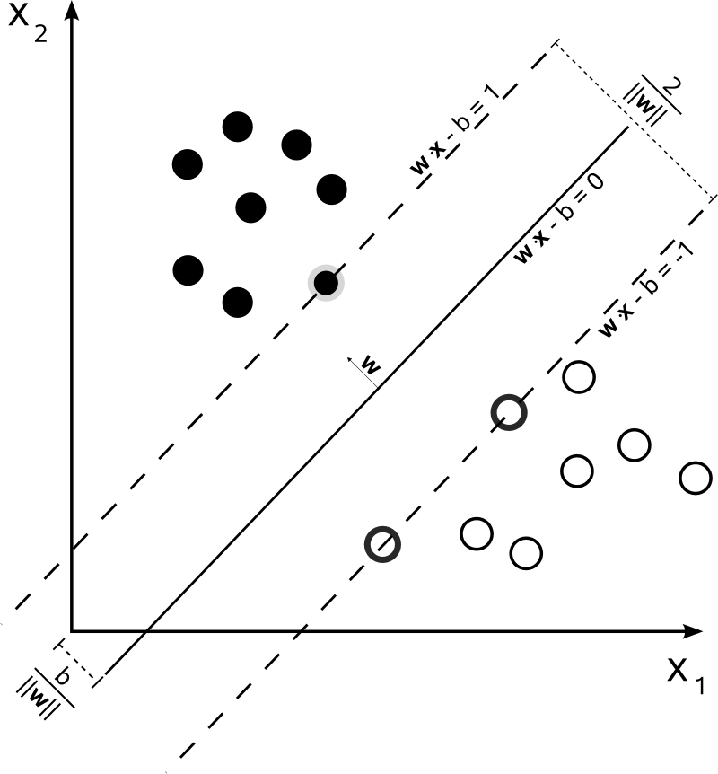</p>
<p><span style="font-family: 'courier new', courier;">图3：设样本属于两个类，用该样本训练SVM得到的最大间隔超平面。在超平面上的样本点也称为支持向量。</span></p>
<h4>2.2 决策边界以及间隔</h4>
<p>图3来自wiki，为了统一起见，下面还是将决策边界定义为<span class="MathJax_Preview" style="color: inherit;"></span><span class="MathJax" id="MathJax-Element-29-Frame" tabindex="0" data-mathml="<math xmlns=&quot;http://www.w3.org/1998/Math/MathML&quot;><mi>w</mi><mo>&amp;#x22C5;</mo><mi>x</mi><mo>+</mo><mi>b</mi><mo>=</mo><mn>0</mn></math>" role="presentation" style="position: relative;"><nobr aria-hidden="true"><span class="math" id="MathJax-Span-268" style="width: 6.794em; display: inline-block;"><span style="display: inline-block; position: relative; width: 5.565em; height: 0px; font-size: 122%;"><span style="position: absolute; clip: rect(1.291em, 1005.51em, 2.403em, -999.997em); top: -2.163em; left: 0em;"><span class="mrow" id="MathJax-Span-269"><span class="mi" id="MathJax-Span-270" style="font-family: MathJax_Math-italic;">w</span><span class="mo" id="MathJax-Span-271" style="font-family: MathJax_Main; padding-left: 0.237em;">⋅</span><span class="mi" id="MathJax-Span-272" style="font-family: MathJax_Math-italic; padding-left: 0.237em;">x</span><span class="mo" id="MathJax-Span-273" style="font-family: MathJax_Main; padding-left: 0.237em;">+</span><span class="mi" id="MathJax-Span-274" style="font-family: MathJax_Math-italic; padding-left: 0.237em;">b</span><span class="mo" id="MathJax-Span-275" style="font-family: MathJax_Main; padding-left: 0.296em;">=</span><span class="mn" id="MathJax-Span-276" style="font-family: MathJax_Main; padding-left: 0.296em;">0</span></span><span style="display: inline-block; width: 0px; height: 2.169em;"></span></span></span><span style="display: inline-block; overflow: hidden; vertical-align: -0.139em; border-left: 0px solid; width: 0px; height: 1.075em;"></span></span></nobr><span class="MJX_Assistive_MathML" role="presentation"><math xmlns="http://www.w3.org/1998/Math/MathML"><mi>w</mi><mo>⋅</mo><mi>x</mi><mo>+</mo><mi>b</mi><mo>=</mo><mn>0</mn></math></span></span><script type="math/tex" id="MathJax-Element-29">w \cdot x + b = 0</script>，两边的边界（两条虚线）分别为<span class="MathJax_Preview" style="color: inherit;"></span><span class="MathJax" id="MathJax-Element-30-Frame" tabindex="0" data-mathml="<math xmlns=&quot;http://www.w3.org/1998/Math/MathML&quot;><mi>w</mi><mo>&amp;#x22C5;</mo><mi>x</mi><mo>+</mo><mi>b</mi><mo>=</mo><mn>1</mn></math>" role="presentation" style="position: relative;"><nobr aria-hidden="true"><span class="math" id="MathJax-Span-277" style="width: 6.794em; display: inline-block;"><span style="display: inline-block; position: relative; width: 5.565em; height: 0px; font-size: 122%;"><span style="position: absolute; clip: rect(1.291em, 1005.51em, 2.403em, -999.997em); top: -2.163em; left: 0em;"><span class="mrow" id="MathJax-Span-278"><span class="mi" id="MathJax-Span-279" style="font-family: MathJax_Math-italic;">w</span><span class="mo" id="MathJax-Span-280" style="font-family: MathJax_Main; padding-left: 0.237em;">⋅</span><span class="mi" id="MathJax-Span-281" style="font-family: MathJax_Math-italic; padding-left: 0.237em;">x</span><span class="mo" id="MathJax-Span-282" style="font-family: MathJax_Main; padding-left: 0.237em;">+</span><span class="mi" id="MathJax-Span-283" style="font-family: MathJax_Math-italic; padding-left: 0.237em;">b</span><span class="mo" id="MathJax-Span-284" style="font-family: MathJax_Main; padding-left: 0.296em;">=</span><span class="mn" id="MathJax-Span-285" style="font-family: MathJax_Main; padding-left: 0.296em;">1</span></span><span style="display: inline-block; width: 0px; height: 2.169em;"></span></span></span><span style="display: inline-block; overflow: hidden; vertical-align: -0.139em; border-left: 0px solid; width: 0px; height: 1.075em;"></span></span></nobr><span class="MJX_Assistive_MathML" role="presentation"><math xmlns="http://www.w3.org/1998/Math/MathML"><mi>w</mi><mo>⋅</mo><mi>x</mi><mo>+</mo><mi>b</mi><mo>=</mo><mn>1</mn></math></span></span><script type="math/tex" id="MathJax-Element-30">w \cdot x + b = 1</script>和<span class="MathJax_Preview" style="color: inherit;"></span><span class="MathJax" id="MathJax-Element-31-Frame" tabindex="0" data-mathml="<math xmlns=&quot;http://www.w3.org/1998/Math/MathML&quot;><mi>w</mi><mo>&amp;#x22C5;</mo><mi>x</mi><mo>+</mo><mi>b</mi><mo>=</mo><mn>1</mn></math>" role="presentation" style="position: relative;"><nobr aria-hidden="true"><span class="math" id="MathJax-Span-286" style="width: 6.794em; display: inline-block;"><span style="display: inline-block; position: relative; width: 5.565em; height: 0px; font-size: 122%;"><span style="position: absolute; clip: rect(1.291em, 1005.51em, 2.403em, -999.997em); top: -2.163em; left: 0em;"><span class="mrow" id="MathJax-Span-287"><span class="mi" id="MathJax-Span-288" style="font-family: MathJax_Math-italic;">w</span><span class="mo" id="MathJax-Span-289" style="font-family: MathJax_Main; padding-left: 0.237em;">⋅</span><span class="mi" id="MathJax-Span-290" style="font-family: MathJax_Math-italic; padding-left: 0.237em;">x</span><span class="mo" id="MathJax-Span-291" style="font-family: MathJax_Main; padding-left: 0.237em;">+</span><span class="mi" id="MathJax-Span-292" style="font-family: MathJax_Math-italic; padding-left: 0.237em;">b</span><span class="mo" id="MathJax-Span-293" style="font-family: MathJax_Main; padding-left: 0.296em;">=</span><span class="mn" id="MathJax-Span-294" style="font-family: MathJax_Main; padding-left: 0.296em;">1</span></span><span style="display: inline-block; width: 0px; height: 2.169em;"></span></span></span><span style="display: inline-block; overflow: hidden; vertical-align: -0.139em; border-left: 0px solid; width: 0px; height: 1.075em;"></span></span></nobr><span class="MJX_Assistive_MathML" role="presentation"><math xmlns="http://www.w3.org/1998/Math/MathML"><mi>w</mi><mo>⋅</mo><mi>x</mi><mo>+</mo><mi>b</mi><mo>=</mo><mn>1</mn></math></span></span><script type="math/tex" id="MathJax-Element-31">w \cdot x + b = 1</script>，此时只是b的符号不同其他性质都相同. 其中<span class="MathJax_Preview" style="color: inherit;"></span><span class="MathJax" id="MathJax-Element-32-Frame" tabindex="0" data-mathml="<math xmlns=&quot;http://www.w3.org/1998/Math/MathML&quot;><mi>w</mi><mo>,</mo><mi>b</mi></math>" role="presentation" style="position: relative;"><nobr aria-hidden="true"><span class="math" id="MathJax-Span-295" style="width: 1.935em; display: inline-block;"><span style="display: inline-block; position: relative; width: 1.584em; height: 0px; font-size: 122%;"><span style="position: absolute; clip: rect(1.291em, 1001.58em, 2.52em, -999.997em); top: -2.163em; left: 0em;"><span class="mrow" id="MathJax-Span-296"><span class="mi" id="MathJax-Span-297" style="font-family: MathJax_Math-italic;">w</span><span class="mo" id="MathJax-Span-298" style="font-family: MathJax_Main;">,</span><span class="mi" id="MathJax-Span-299" style="font-family: MathJax_Math-italic; padding-left: 0.179em;">b</span></span><span style="display: inline-block; width: 0px; height: 2.169em;"></span></span></span><span style="display: inline-block; overflow: hidden; vertical-align: -0.282em; border-left: 0px solid; width: 0px; height: 1.218em;"></span></span></nobr><span class="MJX_Assistive_MathML" role="presentation"><math xmlns="http://www.w3.org/1998/Math/MathML"><mi>w</mi><mo>,</mo><mi>b</mi></math></span></span><script type="math/tex" id="MathJax-Element-32">w, b</script>就是模型训练时需要优化的参数。由上面的示意图可以得到以下信息：</p>
<ul>
<li>两条虚线之间的距离为<span class="MathJax_Preview" style="color: inherit;"></span><span class="MathJax" id="MathJax-Element-33-Frame" tabindex="0" data-mathml="<math xmlns=&quot;http://www.w3.org/1998/Math/MathML&quot;><mfrac><mn>2</mn><mrow><mrow class=&quot;MJX-TeXAtom-ORD&quot;><mo stretchy=&quot;false&quot;>|</mo></mrow><mrow class=&quot;MJX-TeXAtom-ORD&quot;><mo stretchy=&quot;false&quot;>|</mo></mrow><mi>w</mi><mrow class=&quot;MJX-TeXAtom-ORD&quot;><mo stretchy=&quot;false&quot;>|</mo></mrow><mrow class=&quot;MJX-TeXAtom-ORD&quot;><mo stretchy=&quot;false&quot;>|</mo></mrow></mrow></mfrac></math>" role="presentation" style="position: relative;"><nobr aria-hidden="true"><span class="math" id="MathJax-Span-300" style="width: 1.994em; display: inline-block;"><span style="display: inline-block; position: relative; width: 1.642em; height: 0px; font-size: 122%;"><span style="position: absolute; clip: rect(1.115em, 1001.64em, 2.989em, -999.997em); top: -2.163em; left: 0em;"><span class="mrow" id="MathJax-Span-301"><span class="mfrac" id="MathJax-Span-302"><span style="display: inline-block; position: relative; width: 1.408em; height: 0px; margin-right: 0.12em; margin-left: 0.12em;"><span style="position: absolute; clip: rect(3.34em, 1000.3em, 4.16em, -999.997em); top: -4.388em; left: 50%; margin-left: -0.173em;"><span class="mn" id="MathJax-Span-303" style="font-size: 70.7%; font-family: MathJax_Main;">2</span><span style="display: inline-block; width: 0px; height: 3.984em;"></span></span><span style="position: absolute; clip: rect(3.282em, 1001.23em, 4.335em, -999.997em); top: -3.51em; left: 50%; margin-left: -0.641em;"><span class="mrow" id="MathJax-Span-304"><span class="texatom" id="MathJax-Span-305"><span class="mrow" id="MathJax-Span-306"><span class="mo" id="MathJax-Span-307" style="font-size: 70.7%; font-family: MathJax_Main;">|</span></span></span><span class="texatom" id="MathJax-Span-308"><span class="mrow" id="MathJax-Span-309"><span class="mo" id="MathJax-Span-310" style="font-size: 70.7%; font-family: MathJax_Main;">|</span></span></span><span class="mi" id="MathJax-Span-311" style="font-size: 70.7%; font-family: MathJax_Math-italic;">w</span><span class="texatom" id="MathJax-Span-312"><span class="mrow" id="MathJax-Span-313"><span class="mo" id="MathJax-Span-314" style="font-size: 70.7%; font-family: MathJax_Main;">|</span></span></span><span class="texatom" id="MathJax-Span-315"><span class="mrow" id="MathJax-Span-316"><span class="mo" id="MathJax-Span-317" style="font-size: 70.7%; font-family: MathJax_Main;">|</span></span></span></span><span style="display: inline-block; width: 0px; height: 3.984em;"></span></span><span style="position: absolute; clip: rect(0.823em, 1001.41em, 1.232em, -999.997em); top: -1.285em; left: 0em;"><span style="display: inline-block; overflow: hidden; vertical-align: 0em; border-top: 1.3px solid; width: 1.408em; height: 0px;"></span><span style="display: inline-block; width: 0px; height: 1.057em;"></span></span></span></span></span><span style="display: inline-block; width: 0px; height: 2.169em;"></span></span></span><span style="display: inline-block; overflow: hidden; vertical-align: -0.854em; border-left: 0px solid; width: 0px; height: 2.004em;"></span></span></nobr><span class="MJX_Assistive_MathML" role="presentation"><math xmlns="http://www.w3.org/1998/Math/MathML"><mfrac><mn>2</mn><mrow><mrow class="MJX-TeXAtom-ORD"><mo stretchy="false">|</mo></mrow><mrow class="MJX-TeXAtom-ORD"><mo stretchy="false">|</mo></mrow><mi>w</mi><mrow class="MJX-TeXAtom-ORD"><mo stretchy="false">|</mo></mrow><mrow class="MJX-TeXAtom-ORD"><mo stretchy="false">|</mo></mrow></mrow></mfrac></math></span></span><script type="math/tex" id="MathJax-Element-33">\frac{2}{||w||}</script>；</li>
<li>待优化参数<span class="MathJax_Preview" style="color: inherit;"></span><span class="MathJax" id="MathJax-Element-34-Frame" tabindex="0" data-mathml="<math xmlns=&quot;http://www.w3.org/1998/Math/MathML&quot;><mi>w</mi></math>" role="presentation" style="position: relative;"><nobr aria-hidden="true"><span class="math" id="MathJax-Span-318" style="width: 0.881em; display: inline-block;"><span style="display: inline-block; position: relative; width: 0.706em; height: 0px; font-size: 122%;"><span style="position: absolute; clip: rect(1.525em, 1000.71em, 2.345em, -999.997em); top: -2.163em; left: 0em;"><span class="mrow" id="MathJax-Span-319"><span class="mi" id="MathJax-Span-320" style="font-family: MathJax_Math-italic;">w</span></span><span style="display: inline-block; width: 0px; height: 2.169em;"></span></span></span><span style="display: inline-block; overflow: hidden; vertical-align: -0.068em; border-left: 0px solid; width: 0px; height: 0.718em;"></span></span></nobr><span class="MJX_Assistive_MathML" role="presentation"><math xmlns="http://www.w3.org/1998/Math/MathML"><mi>w</mi></math></span></span><script type="math/tex" id="MathJax-Element-34">w</script>的方向就是决策边界的法向量方向（<span class="MathJax_Preview" style="color: inherit;"></span><span class="MathJax" id="MathJax-Element-35-Frame" tabindex="0" data-mathml="<math xmlns=&quot;http://www.w3.org/1998/Math/MathML&quot;><mi>w</mi></math>" role="presentation" style="position: relative;"><nobr aria-hidden="true"><span class="math" id="MathJax-Span-321" style="width: 0.881em; display: inline-block;"><span style="display: inline-block; position: relative; width: 0.706em; height: 0px; font-size: 122%;"><span style="position: absolute; clip: rect(1.525em, 1000.71em, 2.345em, -999.997em); top: -2.163em; left: 0em;"><span class="mrow" id="MathJax-Span-322"><span class="mi" id="MathJax-Span-323" style="font-family: MathJax_Math-italic;">w</span></span><span style="display: inline-block; width: 0px; height: 2.169em;"></span></span></span><span style="display: inline-block; overflow: hidden; vertical-align: -0.068em; border-left: 0px solid; width: 0px; height: 0.718em;"></span></span></nobr><span class="MJX_Assistive_MathML" role="presentation"><math xmlns="http://www.w3.org/1998/Math/MathML"><mi>w</mi></math></span></span><script type="math/tex" id="MathJax-Element-35">w</script>与决策边界垂直）；</li>
<li>此时边界上一共有3个点，这三个点也就是此时的支持向量。</li>


</ul>
<p><strong>下面是计算两条虚线之间距离的过程：</strong></p>
<p>将决策边界的向量表示<span class="MathJax_Preview" style="color: inherit;"></span><span class="MathJax" id="MathJax-Element-36-Frame" tabindex="0" data-mathml="<math xmlns=&quot;http://www.w3.org/1998/Math/MathML&quot;><mi>w</mi><mo>&amp;#xB7;</mo><mi>x</mi><mo>+</mo><mi>b</mi><mo>=</mo><mn>0</mn></math>" role="presentation" style="position: relative;"><nobr aria-hidden="true"><span class="math" id="MathJax-Span-324" style="width: 6.794em; display: inline-block;"><span style="display: inline-block; position: relative; width: 5.565em; height: 0px; font-size: 122%;"><span style="position: absolute; clip: rect(1.291em, 1005.51em, 2.403em, -999.997em); top: -2.163em; left: 0em;"><span class="mrow" id="MathJax-Span-325"><span class="mi" id="MathJax-Span-326" style="font-family: MathJax_Math-italic;">w</span><span class="mo" id="MathJax-Span-327" style="font-family: MathJax_Main; padding-left: 0.237em;">⋅</span><span class="mi" id="MathJax-Span-328" style="font-family: MathJax_Math-italic; padding-left: 0.237em;">x</span><span class="mo" id="MathJax-Span-329" style="font-family: MathJax_Main; padding-left: 0.237em;">+</span><span class="mi" id="MathJax-Span-330" style="font-family: MathJax_Math-italic; padding-left: 0.237em;">b</span><span class="mo" id="MathJax-Span-331" style="font-family: MathJax_Main; padding-left: 0.296em;">=</span><span class="mn" id="MathJax-Span-332" style="font-family: MathJax_Main; padding-left: 0.296em;">0</span></span><span style="display: inline-block; width: 0px; height: 2.169em;"></span></span></span><span style="display: inline-block; overflow: hidden; vertical-align: -0.139em; border-left: 0px solid; width: 0px; height: 1.075em;"></span></span></nobr><span class="MJX_Assistive_MathML" role="presentation"><math xmlns="http://www.w3.org/1998/Math/MathML"><mi>w</mi><mo>·</mo><mi>x</mi><mo>+</mo><mi>b</mi><mo>=</mo><mn>0</mn></math></span></span><script type="math/tex" id="MathJax-Element-36">w·x + b = 0</script>展开后可以得到，<span class="MathJax_Preview" style="color: inherit;"></span><span class="MathJax" id="MathJax-Element-37-Frame" tabindex="0" data-mathml="<math xmlns=&quot;http://www.w3.org/1998/Math/MathML&quot;><mi>w</mi><mn>1</mn><mo>&amp;#x2217;</mo><mi>x</mi><mn>1</mn><mo>+</mo><mi>w</mi><mn>2</mn><mo>&amp;#x2217;</mo><mi>x</mi><mn>2</mn><mo>+</mo><mi>b</mi><mo>=</mo><mn>0</mn></math>" role="presentation" style="position: relative;"><nobr aria-hidden="true"><span class="math" id="MathJax-Span-333" style="width: 13.82em; display: inline-block;"><span style="display: inline-block; position: relative; width: 11.303em; height: 0px; font-size: 122%;"><span style="position: absolute; clip: rect(1.291em, 1011.24em, 2.403em, -999.997em); top: -2.163em; left: 0em;"><span class="mrow" id="MathJax-Span-334"><span class="mi" id="MathJax-Span-335" style="font-family: MathJax_Math-italic;">w</span><span class="mn" id="MathJax-Span-336" style="font-family: MathJax_Main;">1</span><span class="mo" id="MathJax-Span-337" style="font-family: MathJax_Main; padding-left: 0.237em;">∗</span><span class="mi" id="MathJax-Span-338" style="font-family: MathJax_Math-italic; padding-left: 0.237em;">x</span><span class="mn" id="MathJax-Span-339" style="font-family: MathJax_Main;">1</span><span class="mo" id="MathJax-Span-340" style="font-family: MathJax_Main; padding-left: 0.237em;">+</span><span class="mi" id="MathJax-Span-341" style="font-family: MathJax_Math-italic; padding-left: 0.237em;">w</span><span class="mn" id="MathJax-Span-342" style="font-family: MathJax_Main;">2</span><span class="mo" id="MathJax-Span-343" style="font-family: MathJax_Main; padding-left: 0.237em;">∗</span><span class="mi" id="MathJax-Span-344" style="font-family: MathJax_Math-italic; padding-left: 0.237em;">x</span><span class="mn" id="MathJax-Span-345" style="font-family: MathJax_Main;">2</span><span class="mo" id="MathJax-Span-346" style="font-family: MathJax_Main; padding-left: 0.237em;">+</span><span class="mi" id="MathJax-Span-347" style="font-family: MathJax_Math-italic; padding-left: 0.237em;">b</span><span class="mo" id="MathJax-Span-348" style="font-family: MathJax_Main; padding-left: 0.296em;">=</span><span class="mn" id="MathJax-Span-349" style="font-family: MathJax_Main; padding-left: 0.296em;">0</span></span><span style="display: inline-block; width: 0px; height: 2.169em;"></span></span></span><span style="display: inline-block; overflow: hidden; vertical-align: -0.139em; border-left: 0px solid; width: 0px; height: 1.075em;"></span></span></nobr><span class="MJX_Assistive_MathML" role="presentation"><math xmlns="http://www.w3.org/1998/Math/MathML"><mi>w</mi><mn>1</mn><mo>∗</mo><mi>x</mi><mn>1</mn><mo>+</mo><mi>w</mi><mn>2</mn><mo>∗</mo><mi>x</mi><mn>2</mn><mo>+</mo><mi>b</mi><mo>=</mo><mn>0</mn></math></span></span><script type="math/tex" id="MathJax-Element-37">w1*x1 + w2*x2 + b = 0</script>.</p>
<p>转化成截距式可以得到，<span class="MathJax_Preview" style="color: inherit;"></span><span class="MathJax" id="MathJax-Element-38-Frame" tabindex="0" data-mathml="<math xmlns=&quot;http://www.w3.org/1998/Math/MathML&quot;><mi>x</mi><mn>2</mn><mo>=</mo><mo>&amp;#x2212;</mo><mi>w</mi><mn>1</mn><mrow class=&quot;MJX-TeXAtom-ORD&quot;><mo>/</mo></mrow><mi>w</mi><mn>2</mn><mo>&amp;#x2217;</mo><mi>x</mi><mn>1</mn><mo>&amp;#x2212;</mo><mi>b</mi><mrow class=&quot;MJX-TeXAtom-ORD&quot;><mo>/</mo></mrow><mi>w</mi><mn>2</mn></math>" role="presentation" style="position: relative;"><nobr aria-hidden="true"><span class="math" id="MathJax-Span-350" style="width: 14.172em; display: inline-block;"><span style="display: inline-block; position: relative; width: 11.595em; height: 0px; font-size: 122%;"><span style="position: absolute; clip: rect(1.232em, 1011.54em, 2.579em, -999.997em); top: -2.163em; left: 0em;"><span class="mrow" id="MathJax-Span-351"><span class="mi" id="MathJax-Span-352" style="font-family: MathJax_Math-italic;">x</span><span class="mn" id="MathJax-Span-353" style="font-family: MathJax_Main;">2</span><span class="mo" id="MathJax-Span-354" style="font-family: MathJax_Main; padding-left: 0.296em;">=</span><span class="mo" id="MathJax-Span-355" style="font-family: MathJax_Main; padding-left: 0.296em;">−</span><span class="mi" id="MathJax-Span-356" style="font-family: MathJax_Math-italic;">w</span><span class="mn" id="MathJax-Span-357" style="font-family: MathJax_Main;">1</span><span class="texatom" id="MathJax-Span-358"><span class="mrow" id="MathJax-Span-359"><span class="mo" id="MathJax-Span-360" style="font-family: MathJax_Main;">/</span></span></span><span class="mi" id="MathJax-Span-361" style="font-family: MathJax_Math-italic;">w</span><span class="mn" id="MathJax-Span-362" style="font-family: MathJax_Main;">2</span><span class="mo" id="MathJax-Span-363" style="font-family: MathJax_Main; padding-left: 0.237em;">∗</span><span class="mi" id="MathJax-Span-364" style="font-family: MathJax_Math-italic; padding-left: 0.237em;">x</span><span class="mn" id="MathJax-Span-365" style="font-family: MathJax_Main;">1</span><span class="mo" id="MathJax-Span-366" style="font-family: MathJax_Main; padding-left: 0.237em;">−</span><span class="mi" id="MathJax-Span-367" style="font-family: MathJax_Math-italic; padding-left: 0.237em;">b</span><span class="texatom" id="MathJax-Span-368"><span class="mrow" id="MathJax-Span-369"><span class="mo" id="MathJax-Span-370" style="font-family: MathJax_Main;">/</span></span></span><span class="mi" id="MathJax-Span-371" style="font-family: MathJax_Math-italic;">w</span><span class="mn" id="MathJax-Span-372" style="font-family: MathJax_Main;">2</span></span><span style="display: inline-block; width: 0px; height: 2.169em;"></span></span></span><span style="display: inline-block; overflow: hidden; vertical-align: -0.354em; border-left: 0px solid; width: 0px; height: 1.361em;"></span></span></nobr><span class="MJX_Assistive_MathML" role="presentation"><math xmlns="http://www.w3.org/1998/Math/MathML"><mi>x</mi><mn>2</mn><mo>=</mo><mo>−</mo><mi>w</mi><mn>1</mn><mrow class="MJX-TeXAtom-ORD"><mo>/</mo></mrow><mi>w</mi><mn>2</mn><mo>∗</mo><mi>x</mi><mn>1</mn><mo>−</mo><mi>b</mi><mrow class="MJX-TeXAtom-ORD"><mo>/</mo></mrow><mi>w</mi><mn>2</mn></math></span></span><script type="math/tex" id="MathJax-Element-38">x2 = - w1/w2 * x1 - b/w2</script>，因此其斜率为<span class="MathJax_Preview" style="color: inherit;"></span><span class="MathJax" id="MathJax-Element-39-Frame" tabindex="0" data-mathml="<math xmlns=&quot;http://www.w3.org/1998/Math/MathML&quot;><mo>&amp;#x2212;</mo><mi>w</mi><mn>1</mn><mrow class=&quot;MJX-TeXAtom-ORD&quot;><mo>/</mo></mrow><mi>w</mi><mn>2</mn></math>" role="presentation" style="position: relative;"><nobr aria-hidden="true"><span class="math" id="MathJax-Span-373" style="width: 4.511em; display: inline-block;"><span style="display: inline-block; position: relative; width: 3.691em; height: 0px; font-size: 122%;"><span style="position: absolute; clip: rect(1.232em, 1003.63em, 2.579em, -999.997em); top: -2.163em; left: 0em;"><span class="mrow" id="MathJax-Span-374"><span class="mo" id="MathJax-Span-375" style="font-family: MathJax_Main;">−</span><span class="mi" id="MathJax-Span-376" style="font-family: MathJax_Math-italic;">w</span><span class="mn" id="MathJax-Span-377" style="font-family: MathJax_Main;">1</span><span class="texatom" id="MathJax-Span-378"><span class="mrow" id="MathJax-Span-379"><span class="mo" id="MathJax-Span-380" style="font-family: MathJax_Main;">/</span></span></span><span class="mi" id="MathJax-Span-381" style="font-family: MathJax_Math-italic;">w</span><span class="mn" id="MathJax-Span-382" style="font-family: MathJax_Main;">2</span></span><span style="display: inline-block; width: 0px; height: 2.169em;"></span></span></span><span style="display: inline-block; overflow: hidden; vertical-align: -0.354em; border-left: 0px solid; width: 0px; height: 1.361em;"></span></span></nobr><span class="MJX_Assistive_MathML" role="presentation"><math xmlns="http://www.w3.org/1998/Math/MathML"><mo>−</mo><mi>w</mi><mn>1</mn><mrow class="MJX-TeXAtom-ORD"><mo>/</mo></mrow><mi>w</mi><mn>2</mn></math></span></span><script type="math/tex" id="MathJax-Element-39">-w1/w2</script>, 截距为<span class="MathJax_Preview" style="color: inherit;"></span><span class="MathJax" id="MathJax-Element-40-Frame" tabindex="0" data-mathml="<math xmlns=&quot;http://www.w3.org/1998/Math/MathML&quot;><mo>&amp;#x2212;</mo><mi>b</mi><mrow class=&quot;MJX-TeXAtom-ORD&quot;><mo>/</mo></mrow><mi>w</mi><mn>2</mn></math>" role="presentation" style="position: relative;"><nobr aria-hidden="true"><span class="math" id="MathJax-Span-383" style="width: 3.574em; display: inline-block;"><span style="display: inline-block; position: relative; width: 2.93em; height: 0px; font-size: 122%;"><span style="position: absolute; clip: rect(1.232em, 1002.87em, 2.579em, -999.997em); top: -2.163em; left: 0em;"><span class="mrow" id="MathJax-Span-384"><span class="mo" id="MathJax-Span-385" style="font-family: MathJax_Main;">−</span><span class="mi" id="MathJax-Span-386" style="font-family: MathJax_Math-italic;">b</span><span class="texatom" id="MathJax-Span-387"><span class="mrow" id="MathJax-Span-388"><span class="mo" id="MathJax-Span-389" style="font-family: MathJax_Main;">/</span></span></span><span class="mi" id="MathJax-Span-390" style="font-family: MathJax_Math-italic;">w</span><span class="mn" id="MathJax-Span-391" style="font-family: MathJax_Main;">2</span></span><span style="display: inline-block; width: 0px; height: 2.169em;"></span></span></span><span style="display: inline-block; overflow: hidden; vertical-align: -0.354em; border-left: 0px solid; width: 0px; height: 1.361em;"></span></span></nobr><span class="MJX_Assistive_MathML" role="presentation"><math xmlns="http://www.w3.org/1998/Math/MathML"><mo>−</mo><mi>b</mi><mrow class="MJX-TeXAtom-ORD"><mo>/</mo></mrow><mi>w</mi><mn>2</mn></math></span></span><script type="math/tex" id="MathJax-Element-40">-b/w2</script></p>
<p>直线的方向向量为，<span class="MathJax_Preview" style="color: inherit;"></span><span class="MathJax" id="MathJax-Element-41-Frame" tabindex="0" data-mathml="<math xmlns=&quot;http://www.w3.org/1998/Math/MathML&quot;><mo stretchy=&quot;false&quot;>(</mo><mn>1</mn><mo>,</mo><mo>&amp;#x2212;</mo><mi>w</mi><mn>1</mn><mrow class=&quot;MJX-TeXAtom-ORD&quot;><mo>/</mo></mrow><mi>w</mi><mn>2</mn><mo stretchy=&quot;false&quot;>)</mo></math>" role="presentation" style="position: relative;"><nobr aria-hidden="true"><span class="math" id="MathJax-Span-392" style="width: 6.677em; display: inline-block;"><span style="display: inline-block; position: relative; width: 5.448em; height: 0px; font-size: 122%;"><span style="position: absolute; clip: rect(1.232em, 1005.33em, 2.579em, -999.997em); top: -2.163em; left: 0em;"><span class="mrow" id="MathJax-Span-393"><span class="mo" id="MathJax-Span-394" style="font-family: MathJax_Main;">(</span><span class="mn" id="MathJax-Span-395" style="font-family: MathJax_Main;">1</span><span class="mo" id="MathJax-Span-396" style="font-family: MathJax_Main;">,</span><span class="mo" id="MathJax-Span-397" style="font-family: MathJax_Main; padding-left: 0.179em;">−</span><span class="mi" id="MathJax-Span-398" style="font-family: MathJax_Math-italic;">w</span><span class="mn" id="MathJax-Span-399" style="font-family: MathJax_Main;">1</span><span class="texatom" id="MathJax-Span-400"><span class="mrow" id="MathJax-Span-401"><span class="mo" id="MathJax-Span-402" style="font-family: MathJax_Main;">/</span></span></span><span class="mi" id="MathJax-Span-403" style="font-family: MathJax_Math-italic;">w</span><span class="mn" id="MathJax-Span-404" style="font-family: MathJax_Main;">2</span><span class="mo" id="MathJax-Span-405" style="font-family: MathJax_Main;">)</span></span><span style="display: inline-block; width: 0px; height: 2.169em;"></span></span></span><span style="display: inline-block; overflow: hidden; vertical-align: -0.354em; border-left: 0px solid; width: 0px; height: 1.361em;"></span></span></nobr><span class="MJX_Assistive_MathML" role="presentation"><math xmlns="http://www.w3.org/1998/Math/MathML"><mo stretchy="false">(</mo><mn>1</mn><mo>,</mo><mo>−</mo><mi>w</mi><mn>1</mn><mrow class="MJX-TeXAtom-ORD"><mo>/</mo></mrow><mi>w</mi><mn>2</mn><mo stretchy="false">)</mo></math></span></span><script type="math/tex" id="MathJax-Element-41">(1, -w1/w2)</script>（可以取x=1, b=0时，得到y的值）</p>
<p>直线的法向量为<span class="MathJax_Preview" style="color: inherit;"></span><span class="MathJax" id="MathJax-Element-42-Frame" tabindex="0" data-mathml="<math xmlns=&quot;http://www.w3.org/1998/Math/MathML&quot;><mi>w</mi><mo>=</mo><mo stretchy=&quot;false&quot;>(</mo><mi>w</mi><mn>1</mn><mo>,</mo><mi>w</mi><mn>2</mn><mo stretchy=&quot;false&quot;>)</mo></math>" role="presentation" style="position: relative;"><nobr aria-hidden="true"><span class="math" id="MathJax-Span-406" style="width: 7.029em; display: inline-block;"><span style="display: inline-block; position: relative; width: 5.741em; height: 0px; font-size: 122%;"><span style="position: absolute; clip: rect(1.232em, 1005.62em, 2.579em, -999.997em); top: -2.163em; left: 0em;"><span class="mrow" id="MathJax-Span-407"><span class="mi" id="MathJax-Span-408" style="font-family: MathJax_Math-italic;">w</span><span class="mo" id="MathJax-Span-409" style="font-family: MathJax_Main; padding-left: 0.296em;">=</span><span class="mo" id="MathJax-Span-410" style="font-family: MathJax_Main; padding-left: 0.296em;">(</span><span class="mi" id="MathJax-Span-411" style="font-family: MathJax_Math-italic;">w</span><span class="mn" id="MathJax-Span-412" style="font-family: MathJax_Main;">1</span><span class="mo" id="MathJax-Span-413" style="font-family: MathJax_Main;">,</span><span class="mi" id="MathJax-Span-414" style="font-family: MathJax_Math-italic; padding-left: 0.179em;">w</span><span class="mn" id="MathJax-Span-415" style="font-family: MathJax_Main;">2</span><span class="mo" id="MathJax-Span-416" style="font-family: MathJax_Main;">)</span></span><span style="display: inline-block; width: 0px; height: 2.169em;"></span></span></span><span style="display: inline-block; overflow: hidden; vertical-align: -0.354em; border-left: 0px solid; width: 0px; height: 1.361em;"></span></span></nobr><span class="MJX_Assistive_MathML" role="presentation"><math xmlns="http://www.w3.org/1998/Math/MathML"><mi>w</mi><mo>=</mo><mo stretchy="false">(</mo><mi>w</mi><mn>1</mn><mo>,</mo><mi>w</mi><mn>2</mn><mo stretchy="false">)</mo></math></span></span><script type="math/tex" id="MathJax-Element-42">w = (w1, w2)</script></p>
<p>因此，对于直线<span class="MathJax_Preview" style="color: inherit;"></span><span class="MathJax" id="MathJax-Element-43-Frame" tabindex="0" data-mathml="<math xmlns=&quot;http://www.w3.org/1998/Math/MathML&quot;><mi>w</mi><mo>&amp;#x22C5;</mo><mi>x</mi><mo>+</mo><mi>b</mi><mo>=</mo><mn>1</mn></math>" role="presentation" style="position: relative;"><nobr aria-hidden="true"><span class="math" id="MathJax-Span-417" style="width: 6.794em; display: inline-block;"><span style="display: inline-block; position: relative; width: 5.565em; height: 0px; font-size: 122%;"><span style="position: absolute; clip: rect(1.291em, 1005.51em, 2.403em, -999.997em); top: -2.163em; left: 0em;"><span class="mrow" id="MathJax-Span-418"><span class="mi" id="MathJax-Span-419" style="font-family: MathJax_Math-italic;">w</span><span class="mo" id="MathJax-Span-420" style="font-family: MathJax_Main; padding-left: 0.237em;">⋅</span><span class="mi" id="MathJax-Span-421" style="font-family: MathJax_Math-italic; padding-left: 0.237em;">x</span><span class="mo" id="MathJax-Span-422" style="font-family: MathJax_Main; padding-left: 0.237em;">+</span><span class="mi" id="MathJax-Span-423" style="font-family: MathJax_Math-italic; padding-left: 0.237em;">b</span><span class="mo" id="MathJax-Span-424" style="font-family: MathJax_Main; padding-left: 0.296em;">=</span><span class="mn" id="MathJax-Span-425" style="font-family: MathJax_Main; padding-left: 0.296em;">1</span></span><span style="display: inline-block; width: 0px; height: 2.169em;"></span></span></span><span style="display: inline-block; overflow: hidden; vertical-align: -0.139em; border-left: 0px solid; width: 0px; height: 1.075em;"></span></span></nobr><span class="MJX_Assistive_MathML" role="presentation"><math xmlns="http://www.w3.org/1998/Math/MathML"><mi>w</mi><mo>⋅</mo><mi>x</mi><mo>+</mo><mi>b</mi><mo>=</mo><mn>1</mn></math></span></span><script type="math/tex" id="MathJax-Element-43">w \cdot x + b = 1</script>来说，截距式为<span class="MathJax_Preview" style="color: inherit;"></span><span class="MathJax" id="MathJax-Element-44-Frame" tabindex="0" data-mathml="<math xmlns=&quot;http://www.w3.org/1998/Math/MathML&quot;><mi>x</mi><mn>2</mn><mo>=</mo><mo>&amp;#x2212;</mo><mi>w</mi><mn>1</mn><mrow class=&quot;MJX-TeXAtom-ORD&quot;><mo>/</mo></mrow><mi>w</mi><mn>2</mn><mo>&amp;#x2217;</mo><mi>x</mi><mn>1</mn><mo>+</mo><mo stretchy=&quot;false&quot;>(</mo><mn>1</mn><mo>&amp;#x2212;</mo><mi>b</mi><mo stretchy=&quot;false&quot;>)</mo><mrow class=&quot;MJX-TeXAtom-ORD&quot;><mo>/</mo></mrow><mi>w</mi><mn>2</mn></math>" role="presentation" style="position: relative;"><nobr aria-hidden="true"><span class="math" id="MathJax-Span-426" style="width: 17.216em; display: inline-block;"><span style="display: inline-block; position: relative; width: 14.113em; height: 0px; font-size: 122%;"><span style="position: absolute; clip: rect(1.232em, 1014.05em, 2.579em, -999.997em); top: -2.163em; left: 0em;"><span class="mrow" id="MathJax-Span-427"><span class="mi" id="MathJax-Span-428" style="font-family: MathJax_Math-italic;">x</span><span class="mn" id="MathJax-Span-429" style="font-family: MathJax_Main;">2</span><span class="mo" id="MathJax-Span-430" style="font-family: MathJax_Main; padding-left: 0.296em;">=</span><span class="mo" id="MathJax-Span-431" style="font-family: MathJax_Main; padding-left: 0.296em;">−</span><span class="mi" id="MathJax-Span-432" style="font-family: MathJax_Math-italic;">w</span><span class="mn" id="MathJax-Span-433" style="font-family: MathJax_Main;">1</span><span class="texatom" id="MathJax-Span-434"><span class="mrow" id="MathJax-Span-435"><span class="mo" id="MathJax-Span-436" style="font-family: MathJax_Main;">/</span></span></span><span class="mi" id="MathJax-Span-437" style="font-family: MathJax_Math-italic;">w</span><span class="mn" id="MathJax-Span-438" style="font-family: MathJax_Main;">2</span><span class="mo" id="MathJax-Span-439" style="font-family: MathJax_Main; padding-left: 0.237em;">∗</span><span class="mi" id="MathJax-Span-440" style="font-family: MathJax_Math-italic; padding-left: 0.237em;">x</span><span class="mn" id="MathJax-Span-441" style="font-family: MathJax_Main;">1</span><span class="mo" id="MathJax-Span-442" style="font-family: MathJax_Main; padding-left: 0.237em;">+</span><span class="mo" id="MathJax-Span-443" style="font-family: MathJax_Main; padding-left: 0.237em;">(</span><span class="mn" id="MathJax-Span-444" style="font-family: MathJax_Main;">1</span><span class="mo" id="MathJax-Span-445" style="font-family: MathJax_Main; padding-left: 0.237em;">−</span><span class="mi" id="MathJax-Span-446" style="font-family: MathJax_Math-italic; padding-left: 0.237em;">b</span><span class="mo" id="MathJax-Span-447" style="font-family: MathJax_Main;">)</span><span class="texatom" id="MathJax-Span-448"><span class="mrow" id="MathJax-Span-449"><span class="mo" id="MathJax-Span-450" style="font-family: MathJax_Main;">/</span></span></span><span class="mi" id="MathJax-Span-451" style="font-family: MathJax_Math-italic;">w</span><span class="mn" id="MathJax-Span-452" style="font-family: MathJax_Main;">2</span></span><span style="display: inline-block; width: 0px; height: 2.169em;"></span></span></span><span style="display: inline-block; overflow: hidden; vertical-align: -0.354em; border-left: 0px solid; width: 0px; height: 1.361em;"></span></span></nobr><span class="MJX_Assistive_MathML" role="presentation"><math xmlns="http://www.w3.org/1998/Math/MathML"><mi>x</mi><mn>2</mn><mo>=</mo><mo>−</mo><mi>w</mi><mn>1</mn><mrow class="MJX-TeXAtom-ORD"><mo>/</mo></mrow><mi>w</mi><mn>2</mn><mo>∗</mo><mi>x</mi><mn>1</mn><mo>+</mo><mo stretchy="false">(</mo><mn>1</mn><mo>−</mo><mi>b</mi><mo stretchy="false">)</mo><mrow class="MJX-TeXAtom-ORD"><mo>/</mo></mrow><mi>w</mi><mn>2</mn></math></span></span><script type="math/tex" id="MathJax-Element-44">x2 = - w1/w2 * x1 + (1 - b)/w2</script>，相当于沿着<span class="MathJax_Preview" style="color: inherit;"></span><span class="MathJax" id="MathJax-Element-45-Frame" tabindex="0" data-mathml="<math xmlns=&quot;http://www.w3.org/1998/Math/MathML&quot;><mi>x</mi><mn>2</mn></math>" role="presentation" style="position: relative;"><nobr aria-hidden="true"><span class="math" id="MathJax-Span-453" style="width: 1.291em; display: inline-block;"><span style="display: inline-block; position: relative; width: 1.057em; height: 0px; font-size: 122%;"><span style="position: absolute; clip: rect(1.35em, 1001em, 2.345em, -999.997em); top: -2.163em; left: 0em;"><span class="mrow" id="MathJax-Span-454"><span class="mi" id="MathJax-Span-455" style="font-family: MathJax_Math-italic;">x</span><span class="mn" id="MathJax-Span-456" style="font-family: MathJax_Main;">2</span></span><span style="display: inline-block; width: 0px; height: 2.169em;"></span></span></span><span style="display: inline-block; overflow: hidden; vertical-align: -0.068em; border-left: 0px solid; width: 0px; height: 1.004em;"></span></span></nobr><span class="MJX_Assistive_MathML" role="presentation"><math xmlns="http://www.w3.org/1998/Math/MathML"><mi>x</mi><mn>2</mn></math></span></span><script type="math/tex" id="MathJax-Element-45">x2</script>轴向上平移了<span class="MathJax_Preview" style="color: inherit;"></span><span class="MathJax" id="MathJax-Element-46-Frame" tabindex="0" data-mathml="<math xmlns=&quot;http://www.w3.org/1998/Math/MathML&quot;><mfrac><mn>1</mn><msub><mi>w</mi><mn>2</mn></msub></mfrac></math>" role="presentation" style="position: relative;"><nobr aria-hidden="true"><span class="math" id="MathJax-Span-457" style="width: 1.467em; display: inline-block;"><span style="display: inline-block; position: relative; width: 1.174em; height: 0px; font-size: 122%;"><span style="position: absolute; clip: rect(1.115em, 1001.17em, 2.813em, -999.997em); top: -2.163em; left: 0em;"><span class="mrow" id="MathJax-Span-458"><span class="mfrac" id="MathJax-Span-459"><span style="display: inline-block; position: relative; width: 0.94em; height: 0px; margin-right: 0.12em; margin-left: 0.12em;"><span style="position: absolute; clip: rect(3.34em, 1000.3em, 4.16em, -999.997em); top: -4.388em; left: 50%; margin-left: -0.173em;"><span class="mn" id="MathJax-Span-460" style="font-size: 70.7%; font-family: MathJax_Main;">1</span><span style="display: inline-block; width: 0px; height: 3.984em;"></span></span><span style="position: absolute; clip: rect(3.516em, 1000.82em, 4.277em, -999.997em); top: -3.627em; left: 50%; margin-left: -0.407em;"><span class="msubsup" id="MathJax-Span-461"><span style="display: inline-block; position: relative; width: 0.823em; height: 0px;"><span style="position: absolute; clip: rect(3.516em, 1000.47em, 4.16em, -999.997em); top: -3.978em; left: 0em;"><span class="mi" id="MathJax-Span-462" style="font-size: 70.7%; font-family: MathJax_Math-italic;">w</span><span style="display: inline-block; width: 0px; height: 3.984em;"></span></span><span style="position: absolute; top: -3.861em; left: 0.53em;"><span class="mn" id="MathJax-Span-463" style="font-size: 50%; font-family: MathJax_Main;">2</span><span style="display: inline-block; width: 0px; height: 3.984em;"></span></span></span></span><span style="display: inline-block; width: 0px; height: 3.984em;"></span></span><span style="position: absolute; clip: rect(0.823em, 1000.94em, 1.232em, -999.997em); top: -1.285em; left: 0em;"><span style="display: inline-block; overflow: hidden; vertical-align: 0em; border-top: 1.3px solid; width: 0.94em; height: 0px;"></span><span style="display: inline-block; width: 0px; height: 1.057em;"></span></span></span></span></span><span style="display: inline-block; width: 0px; height: 2.169em;"></span></span></span><span style="display: inline-block; overflow: hidden; vertical-align: -0.639em; border-left: 0px solid; width: 0px; height: 1.789em;"></span></span></nobr><span class="MJX_Assistive_MathML" role="presentation"><math xmlns="http://www.w3.org/1998/Math/MathML"><mfrac><mn>1</mn><msub><mi>w</mi><mn>2</mn></msub></mfrac></math></span></span><script type="math/tex" id="MathJax-Element-46">\frac{1}{w_2}</script>，计算可得该直线与<span class="MathJax_Preview" style="color: inherit;"></span><span class="MathJax" id="MathJax-Element-47-Frame" tabindex="0" data-mathml="<math xmlns=&quot;http://www.w3.org/1998/Math/MathML&quot;><mi>w</mi><mo>&amp;#x22C5;</mo><mi>x</mi><mo>+</mo><mi>b</mi><mo>=</mo><mn>0</mn></math>" role="presentation" style="position: relative;"><nobr aria-hidden="true"><span class="math" id="MathJax-Span-464" style="width: 6.794em; display: inline-block;"><span style="display: inline-block; position: relative; width: 5.565em; height: 0px; font-size: 122%;"><span style="position: absolute; clip: rect(1.291em, 1005.51em, 2.403em, -999.997em); top: -2.163em; left: 0em;"><span class="mrow" id="MathJax-Span-465"><span class="mi" id="MathJax-Span-466" style="font-family: MathJax_Math-italic;">w</span><span class="mo" id="MathJax-Span-467" style="font-family: MathJax_Main; padding-left: 0.237em;">⋅</span><span class="mi" id="MathJax-Span-468" style="font-family: MathJax_Math-italic; padding-left: 0.237em;">x</span><span class="mo" id="MathJax-Span-469" style="font-family: MathJax_Main; padding-left: 0.237em;">+</span><span class="mi" id="MathJax-Span-470" style="font-family: MathJax_Math-italic; padding-left: 0.237em;">b</span><span class="mo" id="MathJax-Span-471" style="font-family: MathJax_Main; padding-left: 0.296em;">=</span><span class="mn" id="MathJax-Span-472" style="font-family: MathJax_Main; padding-left: 0.296em;">0</span></span><span style="display: inline-block; width: 0px; height: 2.169em;"></span></span></span><span style="display: inline-block; overflow: hidden; vertical-align: -0.139em; border-left: 0px solid; width: 0px; height: 1.075em;"></span></span></nobr><span class="MJX_Assistive_MathML" role="presentation"><math xmlns="http://www.w3.org/1998/Math/MathML"><mi>w</mi><mo>⋅</mo><mi>x</mi><mo>+</mo><mi>b</mi><mo>=</mo><mn>0</mn></math></span></span><script type="math/tex" id="MathJax-Element-47">w \cdot x + b = 0</script>沿法向量方向的距离为<span class="MathJax_Preview" style="color: inherit;"></span><span class="MathJax" id="MathJax-Element-48-Frame" tabindex="0" data-mathml="<math xmlns=&quot;http://www.w3.org/1998/Math/MathML&quot;><mi>&amp;#x03B3;</mi><mo>=</mo><msqrt><mfrac><mn>1</mn><mrow><msubsup><mi>w</mi><mn>1</mn><mn>2</mn></msubsup><mo>+</mo><msubsup><mi>w</mi><mn>2</mn><mn>2</mn></msubsup></mrow></mfrac></msqrt><mo>=</mo><mfrac><mn>1</mn><mrow><mrow class=&quot;MJX-TeXAtom-ORD&quot;><mo stretchy=&quot;false&quot;>|</mo></mrow><mrow class=&quot;MJX-TeXAtom-ORD&quot;><mo stretchy=&quot;false&quot;>|</mo></mrow><mi>w</mi><mrow class=&quot;MJX-TeXAtom-ORD&quot;><mo stretchy=&quot;false&quot;>|</mo></mrow><mrow class=&quot;MJX-TeXAtom-ORD&quot;><mo stretchy=&quot;false&quot;>|</mo></mrow></mrow></mfrac></math>" role="presentation" style="position: relative;"><nobr aria-hidden="true"><span class="math" id="MathJax-Span-473" style="width: 10.307em; display: inline-block;"><span style="display: inline-block; position: relative; width: 8.434em; height: 0px; font-size: 122%;"><span style="position: absolute; clip: rect(0.998em, 1008.43em, 3.165em, -999.997em); top: -2.163em; left: 0em;"><span class="mrow" id="MathJax-Span-474"><span class="mi" id="MathJax-Span-475" style="font-family: MathJax_Math-italic;">γ<span style="display: inline-block; overflow: hidden; height: 1px; width: 0.003em;"></span></span><span class="mo" id="MathJax-Span-476" style="font-family: MathJax_Main; padding-left: 0.296em;">=</span><span class="msqrt" id="MathJax-Span-477" style="padding-left: 0.296em;"><span style="display: inline-block; position: relative; width: 3.516em; height: 0px;"><span style="position: absolute; clip: rect(2.93em, 1002.52em, 4.862em, -999.997em); top: -3.978em; left: 0.998em;"><span class="mrow" id="MathJax-Span-478"><span class="mfrac" id="MathJax-Span-479"><span style="display: inline-block; position: relative; width: 2.286em; height: 0px; margin-right: 0.12em; margin-left: 0.12em;"><span style="position: absolute; clip: rect(3.34em, 1000.3em, 4.16em, -999.997em); top: -4.388em; left: 50%; margin-left: -0.173em;"><span class="mn" id="MathJax-Span-480" style="font-size: 70.7%; font-family: MathJax_Main;">1</span><span style="display: inline-block; width: 0px; height: 3.984em;"></span></span><span style="position: absolute; clip: rect(3.223em, 1002.17em, 4.394em, -999.997em); top: -3.51em; left: 50%; margin-left: -1.109em;"><span class="mrow" id="MathJax-Span-481"><span class="msubsup" id="MathJax-Span-482"><span style="display: inline-block; position: relative; width: 0.823em; height: 0px;"><span style="position: absolute; clip: rect(3.516em, 1000.47em, 4.16em, -999.997em); top: -3.978em; left: 0em;"><span class="mi" id="MathJax-Span-483" style="font-size: 70.7%; font-family: MathJax_Math-italic;">w</span><span style="display: inline-block; width: 0px; height: 3.984em;"></span></span><span style="position: absolute; clip: rect(3.457em, 1000.3em, 4.16em, -999.997em); top: -4.213em; left: 0.53em;"><span class="mn" id="MathJax-Span-484" style="font-size: 50%; font-family: MathJax_Main;">2</span><span style="display: inline-block; width: 0px; height: 3.984em;"></span></span><span style="position: absolute; clip: rect(3.457em, 1000.3em, 4.16em, -999.997em); top: -3.744em; left: 0.53em;"><span class="mn" id="MathJax-Span-485" style="font-size: 50%; font-family: MathJax_Main;">1</span><span style="display: inline-block; width: 0px; height: 3.984em;"></span></span></span></span><span class="mo" id="MathJax-Span-486" style="font-size: 70.7%; font-family: MathJax_Main;">+</span><span class="msubsup" id="MathJax-Span-487"><span style="display: inline-block; position: relative; width: 0.823em; height: 0px;"><span style="position: absolute; clip: rect(3.516em, 1000.47em, 4.16em, -999.997em); top: -3.978em; left: 0em;"><span class="mi" id="MathJax-Span-488" style="font-size: 70.7%; font-family: MathJax_Math-italic;">w</span><span style="display: inline-block; width: 0px; height: 3.984em;"></span></span><span style="position: absolute; clip: rect(3.457em, 1000.3em, 4.16em, -999.997em); top: -4.213em; left: 0.53em;"><span class="mn" id="MathJax-Span-489" style="font-size: 50%; font-family: MathJax_Main;">2</span><span style="display: inline-block; width: 0px; height: 3.984em;"></span></span><span style="position: absolute; clip: rect(3.457em, 1000.3em, 4.16em, -999.997em); top: -3.744em; left: 0.53em;"><span class="mn" id="MathJax-Span-490" style="font-size: 50%; font-family: MathJax_Main;">2</span><span style="display: inline-block; width: 0px; height: 3.984em;"></span></span></span></span></span><span style="display: inline-block; width: 0px; height: 3.984em;"></span></span><span style="position: absolute; clip: rect(0.823em, 1002.29em, 1.232em, -999.997em); top: -1.285em; left: 0em;"><span style="display: inline-block; overflow: hidden; vertical-align: 0em; border-top: 1.3px solid; width: 2.286em; height: 0px;"></span><span style="display: inline-block; width: 0px; height: 1.057em;"></span></span></span></span></span><span style="display: inline-block; width: 0px; height: 3.984em;"></span></span><span style="position: absolute; clip: rect(3.516em, 1002.46em, 3.926em, -999.997em); top: -4.681em; left: 0.998em;"><span style="display: inline-block; position: relative; width: 2.462em; height: 0px;"><span style="position: absolute; font-family: MathJax_Main; top: -3.978em; left: -0.056em;">−<span style="display: inline-block; width: 0px; height: 3.984em;"></span></span><span style="position: absolute; font-family: MathJax_Main; top: -3.978em; left: 1.759em;">−<span style="display: inline-block; width: 0px; height: 3.984em;"></span></span><span style="font-family: MathJax_Main; position: absolute; top: -3.978em; left: 0.413em;">−<span style="display: inline-block; width: 0px; height: 3.984em;"></span></span><span style="font-family: MathJax_Main; position: absolute; top: -3.978em; left: 0.881em;">−<span style="display: inline-block; width: 0px; height: 3.984em;"></span></span><span style="font-family: MathJax_Main; position: absolute; top: -3.978em; left: 1.35em;">−<span style="display: inline-block; width: 0px; height: 3.984em;"></span></span></span><span style="display: inline-block; width: 0px; height: 3.984em;"></span></span><span style="position: absolute; clip: rect(2.638em, 1001em, 4.804em, -999.997em); top: -3.803em; left: 0em;"><span style="font-family: MathJax_Size2;">√</span><span style="display: inline-block; width: 0px; height: 3.984em;"></span></span></span></span><span class="mo" id="MathJax-Span-491" style="font-family: MathJax_Main; padding-left: 0.296em;">=</span><span class="mfrac" id="MathJax-Span-492" style="padding-left: 0.296em;"><span style="display: inline-block; position: relative; width: 1.408em; height: 0px; margin-right: 0.12em; margin-left: 0.12em;"><span style="position: absolute; clip: rect(3.34em, 1000.3em, 4.16em, -999.997em); top: -4.388em; left: 50%; margin-left: -0.173em;"><span class="mn" id="MathJax-Span-493" style="font-size: 70.7%; font-family: MathJax_Main;">1</span><span style="display: inline-block; width: 0px; height: 3.984em;"></span></span><span style="position: absolute; clip: rect(3.282em, 1001.23em, 4.335em, -999.997em); top: -3.51em; left: 50%; margin-left: -0.641em;"><span class="mrow" id="MathJax-Span-494"><span class="texatom" id="MathJax-Span-495"><span class="mrow" id="MathJax-Span-496"><span class="mo" id="MathJax-Span-497" style="font-size: 70.7%; font-family: MathJax_Main;">|</span></span></span><span class="texatom" id="MathJax-Span-498"><span class="mrow" id="MathJax-Span-499"><span class="mo" id="MathJax-Span-500" style="font-size: 70.7%; font-family: MathJax_Main;">|</span></span></span><span class="mi" id="MathJax-Span-501" style="font-size: 70.7%; font-family: MathJax_Math-italic;">w</span><span class="texatom" id="MathJax-Span-502"><span class="mrow" id="MathJax-Span-503"><span class="mo" id="MathJax-Span-504" style="font-size: 70.7%; font-family: MathJax_Main;">|</span></span></span><span class="texatom" id="MathJax-Span-505"><span class="mrow" id="MathJax-Span-506"><span class="mo" id="MathJax-Span-507" style="font-size: 70.7%; font-family: MathJax_Main;">|</span></span></span></span><span style="display: inline-block; width: 0px; height: 3.984em;"></span></span><span style="position: absolute; clip: rect(0.823em, 1001.41em, 1.232em, -999.997em); top: -1.285em; left: 0em;"><span style="display: inline-block; overflow: hidden; vertical-align: 0em; border-top: 1.3px solid; width: 1.408em; height: 0px;"></span><span style="display: inline-block; width: 0px; height: 1.057em;"></span></span></span></span></span><span style="display: inline-block; width: 0px; height: 2.169em;"></span></span></span><span style="display: inline-block; overflow: hidden; vertical-align: -1.068em; border-left: 0px solid; width: 0px; height: 2.361em;"></span></span></nobr><span class="MJX_Assistive_MathML" role="presentation"><math xmlns="http://www.w3.org/1998/Math/MathML"><mi>γ</mi><mo>=</mo><msqrt><mfrac><mn>1</mn><mrow><msubsup><mi>w</mi><mn>1</mn><mn>2</mn></msubsup><mo>+</mo><msubsup><mi>w</mi><mn>2</mn><mn>2</mn></msubsup></mrow></mfrac></msqrt><mo>=</mo><mfrac><mn>1</mn><mrow><mrow class="MJX-TeXAtom-ORD"><mo stretchy="false">|</mo></mrow><mrow class="MJX-TeXAtom-ORD"><mo stretchy="false">|</mo></mrow><mi>w</mi><mrow class="MJX-TeXAtom-ORD"><mo stretchy="false">|</mo></mrow><mrow class="MJX-TeXAtom-ORD"><mo stretchy="false">|</mo></mrow></mrow></mfrac></math></span></span><script type="math/tex" id="MathJax-Element-48">\gamma = \sqrt{\frac{1}{w_1^2 + w_2^2}} = \frac{1}{||w||}</script>，参考图4.</p>
<p>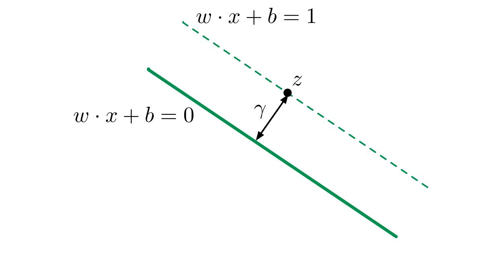</p>
<p><span style="font-family: 'courier new', courier;">图4：margin的宽度<span class="MathJax_Preview" style="color: inherit;"></span><span class="MathJax" id="MathJax-Element-49-Frame" tabindex="0" data-mathml="<math xmlns=&quot;http://www.w3.org/1998/Math/MathML&quot;><mi>&amp;#x03B3;</mi></math>" role="presentation" style="position: relative;"><nobr aria-hidden="true"><span class="math" id="MathJax-Span-508" style="width: 0.647em; display: inline-block;"><span style="display: inline-block; position: relative; width: 0.53em; height: 0px; font-size: 122%;"><span style="position: absolute; clip: rect(1.467em, 1000.53em, 2.52em, -999.997em); top: -2.105em; left: 0em;"><span class="mrow" id="MathJax-Span-509"><span class="mi" id="MathJax-Span-510" style="font-family: MathJax_Math-italic;">γ<span style="display: inline-block; overflow: hidden; height: 1px; width: 0.003em;"></span></span></span><span style="display: inline-block; width: 0px; height: 2.111em;"></span></span></span><span style="display: inline-block; overflow: hidden; vertical-align: -0.354em; border-left: 0px solid; width: 0px; height: 0.932em;"></span></span></nobr><span class="MJX_Assistive_MathML" role="presentation"><math xmlns="http://www.w3.org/1998/Math/MathML"><mi>γ</mi></math></span></span><script type="math/tex" id="MathJax-Element-49">\gamma</script></span></p>
<h4>2.3 优化目标</h4>
<p>在SVM中，优化的目标就是最大化margin的宽度<span class="MathJax_Preview" style="color: inherit;"></span><span class="MathJax" id="MathJax-Element-50-Frame" tabindex="0" data-mathml="<math xmlns=&quot;http://www.w3.org/1998/Math/MathML&quot;><mi>&amp;#x03B3;</mi></math>" role="presentation" style="position: relative;"><nobr aria-hidden="true"><span class="math" id="MathJax-Span-511" style="width: 0.647em; display: inline-block;"><span style="display: inline-block; position: relative; width: 0.53em; height: 0px; font-size: 122%;"><span style="position: absolute; clip: rect(1.525em, 1000.53em, 2.579em, -999.997em); top: -2.163em; left: 0em;"><span class="mrow" id="MathJax-Span-512"><span class="mi" id="MathJax-Span-513" style="font-family: MathJax_Math-italic;">γ<span style="display: inline-block; overflow: hidden; height: 1px; width: 0.003em;"></span></span></span><span style="display: inline-block; width: 0px; height: 2.169em;"></span></span></span><span style="display: inline-block; overflow: hidden; vertical-align: -0.354em; border-left: 0px solid; width: 0px; height: 0.932em;"></span></span></nobr><span class="MJX_Assistive_MathML" role="presentation"><math xmlns="http://www.w3.org/1998/Math/MathML"><mi>γ</mi></math></span></span><script type="math/tex" id="MathJax-Element-50">\gamma</script>，因为<span class="MathJax_Preview" style="color: inherit;"></span><span class="MathJax" id="MathJax-Element-51-Frame" tabindex="0" data-mathml="<math xmlns=&quot;http://www.w3.org/1998/Math/MathML&quot;><mi>&amp;#x03B3;</mi><mo>=</mo><mfrac><mn>1</mn><mrow><mrow class=&quot;MJX-TeXAtom-ORD&quot;><mo stretchy=&quot;false&quot;>|</mo></mrow><mrow class=&quot;MJX-TeXAtom-ORD&quot;><mo stretchy=&quot;false&quot;>|</mo></mrow><mi>w</mi><mrow class=&quot;MJX-TeXAtom-ORD&quot;><mo stretchy=&quot;false&quot;>|</mo></mrow><mrow class=&quot;MJX-TeXAtom-ORD&quot;><mo stretchy=&quot;false&quot;>|</mo></mrow></mrow></mfrac></math>" role="presentation" style="position: relative;"><nobr aria-hidden="true"><span class="math" id="MathJax-Span-514" style="width: 4.335em; display: inline-block;"><span style="display: inline-block; position: relative; width: 3.516em; height: 0px; font-size: 122%;"><span style="position: absolute; clip: rect(1.115em, 1003.52em, 2.989em, -999.997em); top: -2.163em; left: 0em;"><span class="mrow" id="MathJax-Span-515"><span class="mi" id="MathJax-Span-516" style="font-family: MathJax_Math-italic;">γ<span style="display: inline-block; overflow: hidden; height: 1px; width: 0.003em;"></span></span><span class="mo" id="MathJax-Span-517" style="font-family: MathJax_Main; padding-left: 0.296em;">=</span><span class="mfrac" id="MathJax-Span-518" style="padding-left: 0.296em;"><span style="display: inline-block; position: relative; width: 1.408em; height: 0px; margin-right: 0.12em; margin-left: 0.12em;"><span style="position: absolute; clip: rect(3.34em, 1000.3em, 4.16em, -999.997em); top: -4.388em; left: 50%; margin-left: -0.173em;"><span class="mn" id="MathJax-Span-519" style="font-size: 70.7%; font-family: MathJax_Main;">1</span><span style="display: inline-block; width: 0px; height: 3.984em;"></span></span><span style="position: absolute; clip: rect(3.282em, 1001.23em, 4.335em, -999.997em); top: -3.51em; left: 50%; margin-left: -0.641em;"><span class="mrow" id="MathJax-Span-520"><span class="texatom" id="MathJax-Span-521"><span class="mrow" id="MathJax-Span-522"><span class="mo" id="MathJax-Span-523" style="font-size: 70.7%; font-family: MathJax_Main;">|</span></span></span><span class="texatom" id="MathJax-Span-524"><span class="mrow" id="MathJax-Span-525"><span class="mo" id="MathJax-Span-526" style="font-size: 70.7%; font-family: MathJax_Main;">|</span></span></span><span class="mi" id="MathJax-Span-527" style="font-size: 70.7%; font-family: MathJax_Math-italic;">w</span><span class="texatom" id="MathJax-Span-528"><span class="mrow" id="MathJax-Span-529"><span class="mo" id="MathJax-Span-530" style="font-size: 70.7%; font-family: MathJax_Main;">|</span></span></span><span class="texatom" id="MathJax-Span-531"><span class="mrow" id="MathJax-Span-532"><span class="mo" id="MathJax-Span-533" style="font-size: 70.7%; font-family: MathJax_Main;">|</span></span></span></span><span style="display: inline-block; width: 0px; height: 3.984em;"></span></span><span style="position: absolute; clip: rect(0.823em, 1001.41em, 1.232em, -999.997em); top: -1.285em; left: 0em;"><span style="display: inline-block; overflow: hidden; vertical-align: 0em; border-top: 1.3px solid; width: 1.408em; height: 0px;"></span><span style="display: inline-block; width: 0px; height: 1.057em;"></span></span></span></span></span><span style="display: inline-block; width: 0px; height: 2.169em;"></span></span></span><span style="display: inline-block; overflow: hidden; vertical-align: -0.854em; border-left: 0px solid; width: 0px; height: 2.004em;"></span></span></nobr><span class="MJX_Assistive_MathML" role="presentation"><math xmlns="http://www.w3.org/1998/Math/MathML"><mi>γ</mi><mo>=</mo><mfrac><mn>1</mn><mrow><mrow class="MJX-TeXAtom-ORD"><mo stretchy="false">|</mo></mrow><mrow class="MJX-TeXAtom-ORD"><mo stretchy="false">|</mo></mrow><mi>w</mi><mrow class="MJX-TeXAtom-ORD"><mo stretchy="false">|</mo></mrow><mrow class="MJX-TeXAtom-ORD"><mo stretchy="false">|</mo></mrow></mrow></mfrac></math></span></span><script type="math/tex" id="MathJax-Element-51">\gamma = \frac{1}{||w||}</script>，其中<span class="MathJax_Preview" style="color: inherit;"></span><span class="MathJax" id="MathJax-Element-52-Frame" tabindex="0" data-mathml="<math xmlns=&quot;http://www.w3.org/1998/Math/MathML&quot;><mrow class=&quot;MJX-TeXAtom-ORD&quot;><mo stretchy=&quot;false&quot;>|</mo></mrow><mrow class=&quot;MJX-TeXAtom-ORD&quot;><mo stretchy=&quot;false&quot;>|</mo></mrow><mi>w</mi><mrow class=&quot;MJX-TeXAtom-ORD&quot;><mo stretchy=&quot;false&quot;>|</mo></mrow><mrow class=&quot;MJX-TeXAtom-ORD&quot;><mo stretchy=&quot;false&quot;>|</mo></mrow></math>" role="presentation" style="position: relative;"><nobr aria-hidden="true"><span class="math" id="MathJax-Span-534" style="width: 2.228em; display: inline-block;"><span style="display: inline-block; position: relative; width: 1.818em; height: 0px; font-size: 122%;"><span style="position: absolute; clip: rect(1.232em, 1001.7em, 2.579em, -999.997em); top: -2.163em; left: 0em;"><span class="mrow" id="MathJax-Span-535"><span class="texatom" id="MathJax-Span-536"><span class="mrow" id="MathJax-Span-537"><span class="mo" id="MathJax-Span-538" style="font-family: MathJax_Main;">|</span></span></span><span class="texatom" id="MathJax-Span-539"><span class="mrow" id="MathJax-Span-540"><span class="mo" id="MathJax-Span-541" style="font-family: MathJax_Main;">|</span></span></span><span class="mi" id="MathJax-Span-542" style="font-family: MathJax_Math-italic;">w</span><span class="texatom" id="MathJax-Span-543"><span class="mrow" id="MathJax-Span-544"><span class="mo" id="MathJax-Span-545" style="font-family: MathJax_Main;">|</span></span></span><span class="texatom" id="MathJax-Span-546"><span class="mrow" id="MathJax-Span-547"><span class="mo" id="MathJax-Span-548" style="font-family: MathJax_Main;">|</span></span></span></span><span style="display: inline-block; width: 0px; height: 2.169em;"></span></span></span><span style="display: inline-block; overflow: hidden; vertical-align: -0.354em; border-left: 0px solid; width: 0px; height: 1.361em;"></span></span></nobr><span class="MJX_Assistive_MathML" role="presentation"><math xmlns="http://www.w3.org/1998/Math/MathML"><mrow class="MJX-TeXAtom-ORD"><mo stretchy="false">|</mo></mrow><mrow class="MJX-TeXAtom-ORD"><mo stretchy="false">|</mo></mrow><mi>w</mi><mrow class="MJX-TeXAtom-ORD"><mo stretchy="false">|</mo></mrow><mrow class="MJX-TeXAtom-ORD"><mo stretchy="false">|</mo></mrow></math></span></span><script type="math/tex" id="MathJax-Element-52">||w||</script>是待优化参数<span class="MathJax_Preview" style="color: inherit;"></span><span class="MathJax" id="MathJax-Element-53-Frame" tabindex="0" data-mathml="<math xmlns=&quot;http://www.w3.org/1998/Math/MathML&quot;><mi>w</mi></math>" role="presentation" style="position: relative;"><nobr aria-hidden="true"><span class="math" id="MathJax-Span-549" style="width: 0.881em; display: inline-block;"><span style="display: inline-block; position: relative; width: 0.706em; height: 0px; font-size: 122%;"><span style="position: absolute; clip: rect(1.525em, 1000.71em, 2.345em, -999.997em); top: -2.163em; left: 0em;"><span class="mrow" id="MathJax-Span-550"><span class="mi" id="MathJax-Span-551" style="font-family: MathJax_Math-italic;">w</span></span><span style="display: inline-block; width: 0px; height: 2.169em;"></span></span></span><span style="display: inline-block; overflow: hidden; vertical-align: -0.068em; border-left: 0px solid; width: 0px; height: 0.718em;"></span></span></nobr><span class="MJX_Assistive_MathML" role="presentation"><math xmlns="http://www.w3.org/1998/Math/MathML"><mi>w</mi></math></span></span><script type="math/tex" id="MathJax-Element-53">w</script>的模长。因此优化目标等价于最小化<span class="MathJax_Preview" style="color: inherit;"></span><span class="MathJax" id="MathJax-Element-54-Frame" tabindex="0" data-mathml="<math xmlns=&quot;http://www.w3.org/1998/Math/MathML&quot;><mrow class=&quot;MJX-TeXAtom-ORD&quot;><mo stretchy=&quot;false&quot;>|</mo></mrow><mrow class=&quot;MJX-TeXAtom-ORD&quot;><mo stretchy=&quot;false&quot;>|</mo></mrow><mi>w</mi><mrow class=&quot;MJX-TeXAtom-ORD&quot;><mo stretchy=&quot;false&quot;>|</mo></mrow><mrow class=&quot;MJX-TeXAtom-ORD&quot;><mo stretchy=&quot;false&quot;>|</mo></mrow></math>" role="presentation" style="position: relative;"><nobr aria-hidden="true"><span class="math" id="MathJax-Span-552" style="width: 2.228em; display: inline-block;"><span style="display: inline-block; position: relative; width: 1.818em; height: 0px; font-size: 122%;"><span style="position: absolute; clip: rect(1.232em, 1001.7em, 2.579em, -999.997em); top: -2.163em; left: 0em;"><span class="mrow" id="MathJax-Span-553"><span class="texatom" id="MathJax-Span-554"><span class="mrow" id="MathJax-Span-555"><span class="mo" id="MathJax-Span-556" style="font-family: MathJax_Main;">|</span></span></span><span class="texatom" id="MathJax-Span-557"><span class="mrow" id="MathJax-Span-558"><span class="mo" id="MathJax-Span-559" style="font-family: MathJax_Main;">|</span></span></span><span class="mi" id="MathJax-Span-560" style="font-family: MathJax_Math-italic;">w</span><span class="texatom" id="MathJax-Span-561"><span class="mrow" id="MathJax-Span-562"><span class="mo" id="MathJax-Span-563" style="font-family: MathJax_Main;">|</span></span></span><span class="texatom" id="MathJax-Span-564"><span class="mrow" id="MathJax-Span-565"><span class="mo" id="MathJax-Span-566" style="font-family: MathJax_Main;">|</span></span></span></span><span style="display: inline-block; width: 0px; height: 2.169em;"></span></span></span><span style="display: inline-block; overflow: hidden; vertical-align: -0.354em; border-left: 0px solid; width: 0px; height: 1.361em;"></span></span></nobr><span class="MJX_Assistive_MathML" role="presentation"><math xmlns="http://www.w3.org/1998/Math/MathML"><mrow class="MJX-TeXAtom-ORD"><mo stretchy="false">|</mo></mrow><mrow class="MJX-TeXAtom-ORD"><mo stretchy="false">|</mo></mrow><mi>w</mi><mrow class="MJX-TeXAtom-ORD"><mo stretchy="false">|</mo></mrow><mrow class="MJX-TeXAtom-ORD"><mo stretchy="false">|</mo></mrow></math></span></span><script type="math/tex" id="MathJax-Element-54">||w||</script>，可以表示为为：</p>
<p>对于<span class="MathJax_Preview" style="color: inherit;"></span><span class="MathJax" id="MathJax-Element-55-Frame" tabindex="0" data-mathml="<math xmlns=&quot;http://www.w3.org/1998/Math/MathML&quot;><mo stretchy=&quot;false&quot;>(</mo><msup><mi>x</mi><mrow class=&quot;MJX-TeXAtom-ORD&quot;><mo stretchy=&quot;false&quot;>(</mo><mn>1</mn><mo stretchy=&quot;false&quot;>)</mo></mrow></msup><mo>,</mo><msup><mi>y</mi><mrow class=&quot;MJX-TeXAtom-ORD&quot;><mo stretchy=&quot;false&quot;>(</mo><mn>1</mn><mo stretchy=&quot;false&quot;>)</mo></mrow></msup><mo stretchy=&quot;false&quot;>)</mo><mo>,</mo><mtext>&amp;#xA0;</mtext><mo>.</mo><mo>.</mo><mo>.</mo><mo>,</mo><mtext>&amp;#xA0;</mtext><mo stretchy=&quot;false&quot;>(</mo><msup><mi>x</mi><mrow class=&quot;MJX-TeXAtom-ORD&quot;><mo stretchy=&quot;false&quot;>(</mo><mi>m</mi><mo stretchy=&quot;false&quot;>)</mo></mrow></msup><mo>,</mo><msup><mi>y</mi><mrow class=&quot;MJX-TeXAtom-ORD&quot;><mo stretchy=&quot;false&quot;>(</mo><mi>m</mi><mo stretchy=&quot;false&quot;>)</mo></mrow></msup><mo stretchy=&quot;false&quot;>)</mo><mo>&amp;#x2208;</mo><mrow class=&quot;MJX-TeXAtom-ORD&quot;><msup><mi mathvariant=&quot;double-struck&quot;>R</mi><mi mathvariant=&quot;double-struck&quot;>d</mi></msup></mrow><mo>&amp;#x00D7;</mo><mo fence=&quot;false&quot; stretchy=&quot;false&quot;>{</mo><mo>&amp;#x2212;</mo><mn>1</mn><mo>,</mo><mn>1</mn><mo fence=&quot;false&quot; stretchy=&quot;false&quot;>}</mo></math>" role="presentation" style="position: relative;"><nobr aria-hidden="true"><span class="math" id="MathJax-Span-567" style="width: 22.954em; display: inline-block;"><span style="display: inline-block; position: relative; width: 18.797em; height: 0px; font-size: 122%;"><span style="position: absolute; clip: rect(1.115em, 1018.74em, 2.579em, -999.997em); top: -2.163em; left: 0em;"><span class="mrow" id="MathJax-Span-568"><span class="mo" id="MathJax-Span-569" style="font-family: MathJax_Main;">(</span><span class="msubsup" id="MathJax-Span-570"><span style="display: inline-block; position: relative; width: 1.525em; height: 0px;"><span style="position: absolute; clip: rect(3.34em, 1000.53em, 4.16em, -999.997em); top: -3.978em; left: 0em;"><span class="mi" id="MathJax-Span-571" style="font-family: MathJax_Math-italic;">x</span><span style="display: inline-block; width: 0px; height: 3.984em;"></span></span><span style="position: absolute; top: -4.33em; left: 0.588em;"><span class="texatom" id="MathJax-Span-572"><span class="mrow" id="MathJax-Span-573"><span class="mo" id="MathJax-Span-574" style="font-size: 70.7%; font-family: MathJax_Main;">(</span><span class="mn" id="MathJax-Span-575" style="font-size: 70.7%; font-family: MathJax_Main;">1</span><span class="mo" id="MathJax-Span-576" style="font-size: 70.7%; font-family: MathJax_Main;">)</span></span></span><span style="display: inline-block; width: 0px; height: 3.984em;"></span></span></span></span><span class="mo" id="MathJax-Span-577" style="font-family: MathJax_Main;">,</span><span class="msubsup" id="MathJax-Span-578" style="padding-left: 0.179em;"><span style="display: inline-block; position: relative; width: 1.525em; height: 0px;"><span style="position: absolute; clip: rect(3.34em, 1000.47em, 4.394em, -999.997em); top: -3.978em; left: 0em;"><span class="mi" id="MathJax-Span-579" style="font-family: MathJax_Math-italic;">y<span style="display: inline-block; overflow: hidden; height: 1px; width: 0.003em;"></span></span><span style="display: inline-block; width: 0px; height: 3.984em;"></span></span><span style="position: absolute; top: -4.33em; left: 0.53em;"><span class="texatom" id="MathJax-Span-580"><span class="mrow" id="MathJax-Span-581"><span class="mo" id="MathJax-Span-582" style="font-size: 70.7%; font-family: MathJax_Main;">(</span><span class="mn" id="MathJax-Span-583" style="font-size: 70.7%; font-family: MathJax_Main;">1</span><span class="mo" id="MathJax-Span-584" style="font-size: 70.7%; font-family: MathJax_Main;">)</span></span></span><span style="display: inline-block; width: 0px; height: 3.984em;"></span></span></span></span><span class="mo" id="MathJax-Span-585" style="font-family: MathJax_Main;">)</span><span class="mo" id="MathJax-Span-586" style="font-family: MathJax_Main;">,</span><span class="mtext" id="MathJax-Span-587" style="font-family: MathJax_Main; padding-left: 0.179em;">&nbsp;</span><span class="mo" id="MathJax-Span-588" style="font-family: MathJax_Main;">.</span><span class="mo" id="MathJax-Span-589" style="font-family: MathJax_Main; padding-left: 0.179em;">.</span><span class="mo" id="MathJax-Span-590" style="font-family: MathJax_Main; padding-left: 0.179em;">.</span><span class="mo" id="MathJax-Span-591" style="font-family: MathJax_Main; padding-left: 0.179em;">,</span><span class="mtext" id="MathJax-Span-592" style="font-family: MathJax_Main; padding-left: 0.179em;">&nbsp;</span><span class="mo" id="MathJax-Span-593" style="font-family: MathJax_Main;">(</span><span class="msubsup" id="MathJax-Span-594"><span style="display: inline-block; position: relative; width: 1.818em; height: 0px;"><span style="position: absolute; clip: rect(3.34em, 1000.53em, 4.16em, -999.997em); top: -3.978em; left: 0em;"><span class="mi" id="MathJax-Span-595" style="font-family: MathJax_Math-italic;">x</span><span style="display: inline-block; width: 0px; height: 3.984em;"></span></span><span style="position: absolute; top: -4.33em; left: 0.588em;"><span class="texatom" id="MathJax-Span-596"><span class="mrow" id="MathJax-Span-597"><span class="mo" id="MathJax-Span-598" style="font-size: 70.7%; font-family: MathJax_Main;">(</span><span class="mi" id="MathJax-Span-599" style="font-size: 70.7%; font-family: MathJax_Math-italic;">m</span><span class="mo" id="MathJax-Span-600" style="font-size: 70.7%; font-family: MathJax_Main;">)</span></span></span><span style="display: inline-block; width: 0px; height: 3.984em;"></span></span></span></span><span class="mo" id="MathJax-Span-601" style="font-family: MathJax_Main;">,</span><span class="msubsup" id="MathJax-Span-602" style="padding-left: 0.179em;"><span style="display: inline-block; position: relative; width: 1.818em; height: 0px;"><span style="position: absolute; clip: rect(3.34em, 1000.47em, 4.394em, -999.997em); top: -3.978em; left: 0em;"><span class="mi" id="MathJax-Span-603" style="font-family: MathJax_Math-italic;">y<span style="display: inline-block; overflow: hidden; height: 1px; width: 0.003em;"></span></span><span style="display: inline-block; width: 0px; height: 3.984em;"></span></span><span style="position: absolute; top: -4.33em; left: 0.53em;"><span class="texatom" id="MathJax-Span-604"><span class="mrow" id="MathJax-Span-605"><span class="mo" id="MathJax-Span-606" style="font-size: 70.7%; font-family: MathJax_Main;">(</span><span class="mi" id="MathJax-Span-607" style="font-size: 70.7%; font-family: MathJax_Math-italic;">m</span><span class="mo" id="MathJax-Span-608" style="font-size: 70.7%; font-family: MathJax_Main;">)</span></span></span><span style="display: inline-block; width: 0px; height: 3.984em;"></span></span></span></span><span class="mo" id="MathJax-Span-609" style="font-family: MathJax_Main;">)</span><span class="mo" id="MathJax-Span-610" style="font-family: MathJax_Main; padding-left: 0.296em;">∈</span><span class="texatom" id="MathJax-Span-611" style="padding-left: 0.296em;"><span class="mrow" id="MathJax-Span-612"><span class="msubsup" id="MathJax-Span-613"><span style="display: inline-block; position: relative; width: 1.174em; height: 0px;"><span style="position: absolute; clip: rect(3.106em, 1000.71em, 4.16em, -999.997em); top: -3.978em; left: 0em;"><span class="mi" id="MathJax-Span-614" style="font-family: MathJax_AMS;">R</span><span style="display: inline-block; width: 0px; height: 3.984em;"></span></span><span style="position: absolute; top: -4.33em; left: 0.706em;"><span class="mi" id="MathJax-Span-615" style="font-size: 70.7%; font-family: MathJax_Main;">d</span><span style="display: inline-block; width: 0px; height: 3.984em;"></span></span></span></span></span></span><span class="mo" id="MathJax-Span-616" style="font-family: MathJax_Main; padding-left: 0.237em;">×</span><span class="mo" id="MathJax-Span-617" style="font-family: MathJax_Main; padding-left: 0.237em;">{</span><span class="mo" id="MathJax-Span-618" style="font-family: MathJax_Main;">−</span><span class="mn" id="MathJax-Span-619" style="font-family: MathJax_Main;">1</span><span class="mo" id="MathJax-Span-620" style="font-family: MathJax_Main;">,</span><span class="mn" id="MathJax-Span-621" style="font-family: MathJax_Main; padding-left: 0.179em;">1</span><span class="mo" id="MathJax-Span-622" style="font-family: MathJax_Main;">}</span></span><span style="display: inline-block; width: 0px; height: 2.169em;"></span></span></span><span style="display: inline-block; overflow: hidden; vertical-align: -0.354em; border-left: 0px solid; width: 0px; height: 1.575em;"></span></span></nobr><span class="MJX_Assistive_MathML" role="presentation"><math xmlns="http://www.w3.org/1998/Math/MathML"><mo stretchy="false">(</mo><msup><mi>x</mi><mrow class="MJX-TeXAtom-ORD"><mo stretchy="false">(</mo><mn>1</mn><mo stretchy="false">)</mo></mrow></msup><mo>,</mo><msup><mi>y</mi><mrow class="MJX-TeXAtom-ORD"><mo stretchy="false">(</mo><mn>1</mn><mo stretchy="false">)</mo></mrow></msup><mo stretchy="false">)</mo><mo>,</mo><mtext>&nbsp;</mtext><mo>.</mo><mo>.</mo><mo>.</mo><mo>,</mo><mtext>&nbsp;</mtext><mo stretchy="false">(</mo><msup><mi>x</mi><mrow class="MJX-TeXAtom-ORD"><mo stretchy="false">(</mo><mi>m</mi><mo stretchy="false">)</mo></mrow></msup><mo>,</mo><msup><mi>y</mi><mrow class="MJX-TeXAtom-ORD"><mo stretchy="false">(</mo><mi>m</mi><mo stretchy="false">)</mo></mrow></msup><mo stretchy="false">)</mo><mo>∈</mo><mrow class="MJX-TeXAtom-ORD"><msup><mi mathvariant="double-struck">R</mi><mi mathvariant="double-struck">d</mi></msup></mrow><mo>×</mo><mo fence="false" stretchy="false">{</mo><mo>−</mo><mn>1</mn><mo>,</mo><mn>1</mn><mo fence="false" stretchy="false">}</mo></math></span></span><script type="math/tex" id="MathJax-Element-55">(x^{(1)}, y^{(1)}), \ ..., \ (x^{(m)}, y^{(m)}) \in \mathbb{R^d} \times \{-1, 1\}</script>，<span class="MathJax_Preview" style="color: inherit;"></span><span class="MathJax" id="MathJax-Element-56-Frame" tabindex="0" data-mathml="<math xmlns=&quot;http://www.w3.org/1998/Math/MathML&quot;><munder><mo movablelimits=&quot;true&quot; form=&quot;prefix&quot;>min</mo><mrow class=&quot;MJX-TeXAtom-ORD&quot;><mi>w</mi><mo>&amp;#x2208;</mo><msup><mrow class=&quot;MJX-TeXAtom-ORD&quot;><mi mathvariant=&quot;double-struck&quot;>R</mi></mrow><mi>d</mi></msup><mo>,</mo><mi>b</mi><mo>&amp;#x2208;</mo><mrow class=&quot;MJX-TeXAtom-ORD&quot;><mi mathvariant=&quot;double-struck&quot;>R</mi></mrow></mrow></munder><mrow class=&quot;MJX-TeXAtom-ORD&quot;><mo stretchy=&quot;false&quot;>|</mo></mrow><mrow class=&quot;MJX-TeXAtom-ORD&quot;><mo stretchy=&quot;false&quot;>|</mo></mrow><mi>w</mi><mrow class=&quot;MJX-TeXAtom-ORD&quot;><mo stretchy=&quot;false&quot;>|</mo></mrow><msup><mrow class=&quot;MJX-TeXAtom-ORD&quot;><mo stretchy=&quot;false&quot;>|</mo></mrow><mn>2</mn></msup></math>" role="presentation" style="position: relative;"><nobr aria-hidden="true"><span class="math" id="MathJax-Span-623" style="width: 9.136em; display: inline-block;"><span style="display: inline-block; position: relative; width: 7.497em; height: 0px; font-size: 122%;"><span style="position: absolute; clip: rect(1.057em, 1007.5em, 2.755em, -999.997em); top: -2.163em; left: 0em;"><span class="mrow" id="MathJax-Span-624"><span class="munderover" id="MathJax-Span-625"><span style="display: inline-block; position: relative; width: 5.038em; height: 0px;"><span style="position: absolute; clip: rect(3.165em, 1001.64em, 4.16em, -999.997em); top: -3.978em; left: 0em;"><span class="mo" id="MathJax-Span-626" style="font-family: MathJax_Main;">min</span><span style="display: inline-block; width: 0px; height: 3.984em;"></span></span><span style="position: absolute; top: -3.686em; left: 1.642em;"><span class="texatom" id="MathJax-Span-627"><span class="mrow" id="MathJax-Span-628"><span class="mi" id="MathJax-Span-629" style="font-size: 70.7%; font-family: MathJax_Math-italic;">w</span><span class="mo" id="MathJax-Span-630" style="font-size: 70.7%; font-family: MathJax_Main;">∈</span><span class="msubsup" id="MathJax-Span-631"><span style="display: inline-block; position: relative; width: 0.823em; height: 0px;"><span style="position: absolute; clip: rect(3.34em, 1000.53em, 4.16em, -999.997em); top: -3.978em; left: 0em;"><span class="texatom" id="MathJax-Span-632"><span class="mrow" id="MathJax-Span-633"><span class="mi" id="MathJax-Span-634" style="font-size: 70.7%; font-family: MathJax_AMS;">R</span></span></span><span style="display: inline-block; width: 0px; height: 3.984em;"></span></span><span style="position: absolute; top: -4.271em; left: 0.53em;"><span class="mi" id="MathJax-Span-635" style="font-size: 50%; font-family: MathJax_Math-italic;">d<span style="display: inline-block; overflow: hidden; height: 1px; width: 0.003em;"></span></span><span style="display: inline-block; width: 0px; height: 3.984em;"></span></span></span></span><span class="mo" id="MathJax-Span-636" style="font-size: 70.7%; font-family: MathJax_Main;">,</span><span class="mi" id="MathJax-Span-637" style="font-size: 70.7%; font-family: MathJax_Math-italic;">b</span><span class="mo" id="MathJax-Span-638" style="font-size: 70.7%; font-family: MathJax_Main;">∈</span><span class="texatom" id="MathJax-Span-639"><span class="mrow" id="MathJax-Span-640"><span class="mi" id="MathJax-Span-641" style="font-size: 70.7%; font-family: MathJax_AMS;">R</span></span></span></span></span><span style="display: inline-block; width: 0px; height: 3.984em;"></span></span></span></span><span class="texatom" id="MathJax-Span-642" style="padding-left: 0.179em;"><span class="mrow" id="MathJax-Span-643"><span class="mo" id="MathJax-Span-644" style="font-family: MathJax_Main;">|</span></span></span><span class="texatom" id="MathJax-Span-645"><span class="mrow" id="MathJax-Span-646"><span class="mo" id="MathJax-Span-647" style="font-family: MathJax_Main;">|</span></span></span><span class="mi" id="MathJax-Span-648" style="font-family: MathJax_Math-italic;">w</span><span class="texatom" id="MathJax-Span-649"><span class="mrow" id="MathJax-Span-650"><span class="mo" id="MathJax-Span-651" style="font-family: MathJax_Main;">|</span></span></span><span class="msubsup" id="MathJax-Span-652"><span style="display: inline-block; position: relative; width: 0.706em; height: 0px;"><span style="position: absolute; clip: rect(3.047em, 1000.18em, 4.394em, -999.997em); top: -3.978em; left: 0em;"><span class="texatom" id="MathJax-Span-653"><span class="mrow" id="MathJax-Span-654"><span class="mo" id="MathJax-Span-655" style="font-family: MathJax_Main;">|</span></span></span><span style="display: inline-block; width: 0px; height: 3.984em;"></span></span><span style="position: absolute; top: -4.447em; left: 0.296em;"><span class="mn" id="MathJax-Span-656" style="font-size: 70.7%; font-family: MathJax_Main;">2</span><span style="display: inline-block; width: 0px; height: 3.984em;"></span></span></span></span></span><span style="display: inline-block; width: 0px; height: 2.169em;"></span></span></span><span style="display: inline-block; overflow: hidden; vertical-align: -0.568em; border-left: 0px solid; width: 0px; height: 1.861em;"></span></span></nobr><span class="MJX_Assistive_MathML" role="presentation"><math xmlns="http://www.w3.org/1998/Math/MathML"><munder><mo movablelimits="true" form="prefix">min</mo><mrow class="MJX-TeXAtom-ORD"><mi>w</mi><mo>∈</mo><msup><mrow class="MJX-TeXAtom-ORD"><mi mathvariant="double-struck">R</mi></mrow><mi>d</mi></msup><mo>,</mo><mi>b</mi><mo>∈</mo><mrow class="MJX-TeXAtom-ORD"><mi mathvariant="double-struck">R</mi></mrow></mrow></munder><mrow class="MJX-TeXAtom-ORD"><mo stretchy="false">|</mo></mrow><mrow class="MJX-TeXAtom-ORD"><mo stretchy="false">|</mo></mrow><mi>w</mi><mrow class="MJX-TeXAtom-ORD"><mo stretchy="false">|</mo></mrow><msup><mrow class="MJX-TeXAtom-ORD"><mo stretchy="false">|</mo></mrow><mn>2</mn></msup></math></span></span><script type="math/tex" id="MathJax-Element-56">\min_{w \in \mathbb{R}^d, b \in \mathbb{R}}||w||^2</script> </p>
<p>s.t. <span class="MathJax_Preview" style="color: inherit;"></span><span class="MathJax" id="MathJax-Element-57-Frame" tabindex="0" data-mathml="<math xmlns=&quot;http://www.w3.org/1998/Math/MathML&quot;><msup><mi>y</mi><mrow class=&quot;MJX-TeXAtom-ORD&quot;><mo stretchy=&quot;false&quot;>(</mo><mi>i</mi><mo stretchy=&quot;false&quot;>)</mo></mrow></msup><mo stretchy=&quot;false&quot;>(</mo><mi>w</mi><mo>&amp;#x22C5;</mo><msup><mi>x</mi><mrow class=&quot;MJX-TeXAtom-ORD&quot;><mo stretchy=&quot;false&quot;>(</mo><mi>i</mi><mo stretchy=&quot;false&quot;>)</mo></mrow></msup><mo>+</mo><mi>b</mi><mo stretchy=&quot;false&quot;>)</mo><mo>&amp;#x2265;</mo><mn>1</mn></math>" role="presentation" style="position: relative;"><nobr aria-hidden="true"><span class="math" id="MathJax-Span-657" style="width: 10.6em; display: inline-block;"><span style="display: inline-block; position: relative; width: 8.668em; height: 0px; font-size: 122%;"><span style="position: absolute; clip: rect(1.115em, 1008.61em, 2.579em, -999.997em); top: -2.163em; left: 0em;"><span class="mrow" id="MathJax-Span-658"><span class="msubsup" id="MathJax-Span-659"><span style="display: inline-block; position: relative; width: 1.408em; height: 0px;"><span style="position: absolute; clip: rect(3.34em, 1000.47em, 4.394em, -999.997em); top: -3.978em; left: 0em;"><span class="mi" id="MathJax-Span-660" style="font-family: MathJax_Math-italic;">y<span style="display: inline-block; overflow: hidden; height: 1px; width: 0.003em;"></span></span><span style="display: inline-block; width: 0px; height: 3.984em;"></span></span><span style="position: absolute; top: -4.33em; left: 0.53em;"><span class="texatom" id="MathJax-Span-661"><span class="mrow" id="MathJax-Span-662"><span class="mo" id="MathJax-Span-663" style="font-size: 70.7%; font-family: MathJax_Main;">(</span><span class="mi" id="MathJax-Span-664" style="font-size: 70.7%; font-family: MathJax_Math-italic;">i</span><span class="mo" id="MathJax-Span-665" style="font-size: 70.7%; font-family: MathJax_Main;">)</span></span></span><span style="display: inline-block; width: 0px; height: 3.984em;"></span></span></span></span><span class="mo" id="MathJax-Span-666" style="font-family: MathJax_Main;">(</span><span class="mi" id="MathJax-Span-667" style="font-family: MathJax_Math-italic;">w</span><span class="mo" id="MathJax-Span-668" style="font-family: MathJax_Main; padding-left: 0.237em;">⋅</span><span class="msubsup" id="MathJax-Span-669" style="padding-left: 0.237em;"><span style="display: inline-block; position: relative; width: 1.467em; height: 0px;"><span style="position: absolute; clip: rect(3.34em, 1000.53em, 4.16em, -999.997em); top: -3.978em; left: 0em;"><span class="mi" id="MathJax-Span-670" style="font-family: MathJax_Math-italic;">x</span><span style="display: inline-block; width: 0px; height: 3.984em;"></span></span><span style="position: absolute; top: -4.33em; left: 0.588em;"><span class="texatom" id="MathJax-Span-671"><span class="mrow" id="MathJax-Span-672"><span class="mo" id="MathJax-Span-673" style="font-size: 70.7%; font-family: MathJax_Main;">(</span><span class="mi" id="MathJax-Span-674" style="font-size: 70.7%; font-family: MathJax_Math-italic;">i</span><span class="mo" id="MathJax-Span-675" style="font-size: 70.7%; font-family: MathJax_Main;">)</span></span></span><span style="display: inline-block; width: 0px; height: 3.984em;"></span></span></span></span><span class="mo" id="MathJax-Span-676" style="font-family: MathJax_Main; padding-left: 0.237em;">+</span><span class="mi" id="MathJax-Span-677" style="font-family: MathJax_Math-italic; padding-left: 0.237em;">b</span><span class="mo" id="MathJax-Span-678" style="font-family: MathJax_Main;">)</span><span class="mo" id="MathJax-Span-679" style="font-family: MathJax_Main; padding-left: 0.296em;">≥</span><span class="mn" id="MathJax-Span-680" style="font-family: MathJax_Main; padding-left: 0.296em;">1</span></span><span style="display: inline-block; width: 0px; height: 2.169em;"></span></span></span><span style="display: inline-block; overflow: hidden; vertical-align: -0.354em; border-left: 0px solid; width: 0px; height: 1.575em;"></span></span></nobr><span class="MJX_Assistive_MathML" role="presentation"><math xmlns="http://www.w3.org/1998/Math/MathML"><msup><mi>y</mi><mrow class="MJX-TeXAtom-ORD"><mo stretchy="false">(</mo><mi>i</mi><mo stretchy="false">)</mo></mrow></msup><mo stretchy="false">(</mo><mi>w</mi><mo>⋅</mo><msup><mi>x</mi><mrow class="MJX-TeXAtom-ORD"><mo stretchy="false">(</mo><mi>i</mi><mo stretchy="false">)</mo></mrow></msup><mo>+</mo><mi>b</mi><mo stretchy="false">)</mo><mo>≥</mo><mn>1</mn></math></span></span><script type="math/tex" id="MathJax-Element-57">y^{(i)}(w \cdot x^{(i)} + b) ≥ 1</script>对于所有的<span class="MathJax_Preview" style="color: inherit;"></span><span class="MathJax" id="MathJax-Element-58-Frame" tabindex="0" data-mathml="<math xmlns=&quot;http://www.w3.org/1998/Math/MathML&quot;><mi>i</mi><mo>=</mo><mn>1</mn><mo>,</mo><mn>2</mn><mo>,</mo><mo>.</mo><mo>.</mo><mo>.</mo><mo>,</mo><mi>m</mi></math>" role="presentation" style="position: relative;"><nobr aria-hidden="true"><span class="math" id="MathJax-Span-681" style="width: 7.731em; display: inline-block;"><span style="display: inline-block; position: relative; width: 6.326em; height: 0px; font-size: 122%;"><span style="position: absolute; clip: rect(1.35em, 1006.33em, 2.52em, -999.997em); top: -2.163em; left: 0em;"><span class="mrow" id="MathJax-Span-682"><span class="mi" id="MathJax-Span-683" style="font-family: MathJax_Math-italic;">i</span><span class="mo" id="MathJax-Span-684" style="font-family: MathJax_Main; padding-left: 0.296em;">=</span><span class="mn" id="MathJax-Span-685" style="font-family: MathJax_Main; padding-left: 0.296em;">1</span><span class="mo" id="MathJax-Span-686" style="font-family: MathJax_Main;">,</span><span class="mn" id="MathJax-Span-687" style="font-family: MathJax_Main; padding-left: 0.179em;">2</span><span class="mo" id="MathJax-Span-688" style="font-family: MathJax_Main;">,</span><span class="mo" id="MathJax-Span-689" style="font-family: MathJax_Main; padding-left: 0.179em;">.</span><span class="mo" id="MathJax-Span-690" style="font-family: MathJax_Main; padding-left: 0.179em;">.</span><span class="mo" id="MathJax-Span-691" style="font-family: MathJax_Main; padding-left: 0.179em;">.</span><span class="mo" id="MathJax-Span-692" style="font-family: MathJax_Main; padding-left: 0.179em;">,</span><span class="mi" id="MathJax-Span-693" style="font-family: MathJax_Math-italic; padding-left: 0.179em;">m</span></span><span style="display: inline-block; width: 0px; height: 2.169em;"></span></span></span><span style="display: inline-block; overflow: hidden; vertical-align: -0.282em; border-left: 0px solid; width: 0px; height: 1.218em;"></span></span></nobr><span class="MJX_Assistive_MathML" role="presentation"><math xmlns="http://www.w3.org/1998/Math/MathML"><mi>i</mi><mo>=</mo><mn>1</mn><mo>,</mo><mn>2</mn><mo>,</mo><mo>.</mo><mo>.</mo><mo>.</mo><mo>,</mo><mi>m</mi></math></span></span><script type="math/tex" id="MathJax-Element-58">i = 1, 2, ..., m</script>成立</p>
<p>&nbsp;</p>
<p>下面是分别使用感知机和SVM对鸢尾属数据集中setosa这一类和非setosa进行分类的效果比较：</p>
<p>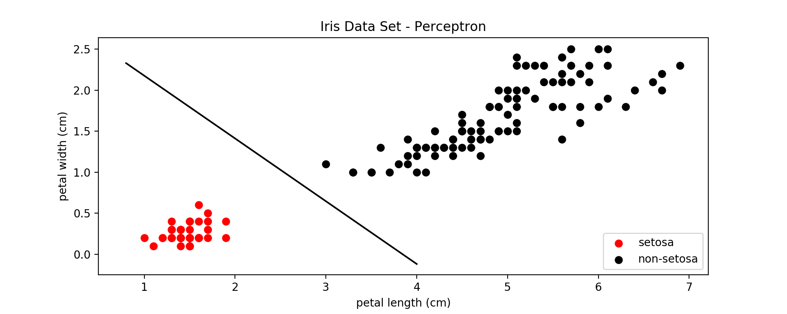</p>
<p><span style="font-family: 'courier new', courier;">图5：感知机线性分类器</span></p>
<p>&nbsp;</p>
<p>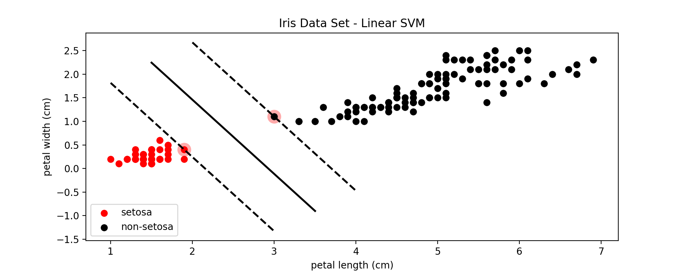</p>
<p><span style="font-family: 'courier new', courier;">图6：线性SVM的分类效果</span></p>
<p>比较图5和图6可以看到，SVM确定的决策边界周围的margin更大一些，因此对更多未知的样本进行分类时，在边界上的一些点可以得到更准确的分类结果。</p>
<p>&nbsp;</p>
<h3><span style="color: #99cc00;">3. SVM - 线性不可分</span></h3>
<hr>
<p>在图1中可以看到，setosa这一类与其他两类是线性可分的，但是virginica这一类与与之相邻的versicolor有一些点是重合的，也就是说是线性不可分的。此时仍然可以使用SVM来进行分类，原理是在代价函数中加入了一个松弛变量(slack) <span class="MathJax_Preview" style="color: inherit;"></span><span class="MathJax" id="MathJax-Element-59-Frame" tabindex="0" data-mathml="<math xmlns=&quot;http://www.w3.org/1998/Math/MathML&quot;><mi>&amp;#x03BE;</mi></math>" role="presentation" style="position: relative;"><nobr aria-hidden="true"><span class="math" id="MathJax-Span-694" style="width: 0.588em; display: inline-block;"><span style="display: inline-block; position: relative; width: 0.471em; height: 0px; font-size: 122%;"><span style="position: absolute; clip: rect(1.291em, 1000.47em, 2.579em, -999.997em); top: -2.163em; left: 0em;"><span class="mrow" id="MathJax-Span-695"><span class="mi" id="MathJax-Span-696" style="font-family: MathJax_Math-italic;">ξ<span style="display: inline-block; overflow: hidden; height: 1px; width: 0.003em;"></span></span></span><span style="display: inline-block; width: 0px; height: 2.169em;"></span></span></span><span style="display: inline-block; overflow: hidden; vertical-align: -0.354em; border-left: 0px solid; width: 0px; height: 1.289em;"></span></span></nobr><span class="MJX_Assistive_MathML" role="presentation"><math xmlns="http://www.w3.org/1998/Math/MathML"><mi>ξ</mi></math></span></span><script type="math/tex" id="MathJax-Element-59">\xi</script>，</p>
<p>对于<span class="MathJax_Preview" style="color: inherit;"></span><span class="MathJax" id="MathJax-Element-60-Frame" tabindex="0" data-mathml="<math xmlns=&quot;http://www.w3.org/1998/Math/MathML&quot;><mo stretchy=&quot;false&quot;>(</mo><msup><mi>x</mi><mrow class=&quot;MJX-TeXAtom-ORD&quot;><mo stretchy=&quot;false&quot;>(</mo><mn>1</mn><mo stretchy=&quot;false&quot;>)</mo></mrow></msup><mo>,</mo><msup><mi>y</mi><mrow class=&quot;MJX-TeXAtom-ORD&quot;><mo stretchy=&quot;false&quot;>(</mo><mn>1</mn><mo stretchy=&quot;false&quot;>)</mo></mrow></msup><mo stretchy=&quot;false&quot;>)</mo><mo>,</mo><mtext>&amp;#xA0;</mtext><mo>.</mo><mo>.</mo><mo>.</mo><mo>,</mo><mtext>&amp;#xA0;</mtext><mo stretchy=&quot;false&quot;>(</mo><msup><mi>x</mi><mrow class=&quot;MJX-TeXAtom-ORD&quot;><mo stretchy=&quot;false&quot;>(</mo><mi>m</mi><mo stretchy=&quot;false&quot;>)</mo></mrow></msup><mo>,</mo><msup><mi>y</mi><mrow class=&quot;MJX-TeXAtom-ORD&quot;><mo stretchy=&quot;false&quot;>(</mo><mi>m</mi><mo stretchy=&quot;false&quot;>)</mo></mrow></msup><mo stretchy=&quot;false&quot;>)</mo><mo>&amp;#x2208;</mo><mrow class=&quot;MJX-TeXAtom-ORD&quot;><msup><mi mathvariant=&quot;double-struck&quot;>R</mi><mi mathvariant=&quot;double-struck&quot;>d</mi></msup></mrow><mo>&amp;#x00D7;</mo><mo fence=&quot;false&quot; stretchy=&quot;false&quot;>{</mo><mo>&amp;#x2212;</mo><mn>1</mn><mo>,</mo><mn>1</mn><mo fence=&quot;false&quot; stretchy=&quot;false&quot;>}</mo></math>" role="presentation" style="position: relative;"><nobr aria-hidden="true"><span class="math" id="MathJax-Span-697" style="width: 22.954em; display: inline-block;"><span style="display: inline-block; position: relative; width: 18.797em; height: 0px; font-size: 122%;"><span style="position: absolute; clip: rect(1.115em, 1018.74em, 2.579em, -999.997em); top: -2.163em; left: 0em;"><span class="mrow" id="MathJax-Span-698"><span class="mo" id="MathJax-Span-699" style="font-family: MathJax_Main;">(</span><span class="msubsup" id="MathJax-Span-700"><span style="display: inline-block; position: relative; width: 1.525em; height: 0px;"><span style="position: absolute; clip: rect(3.34em, 1000.53em, 4.16em, -999.997em); top: -3.978em; left: 0em;"><span class="mi" id="MathJax-Span-701" style="font-family: MathJax_Math-italic;">x</span><span style="display: inline-block; width: 0px; height: 3.984em;"></span></span><span style="position: absolute; top: -4.33em; left: 0.588em;"><span class="texatom" id="MathJax-Span-702"><span class="mrow" id="MathJax-Span-703"><span class="mo" id="MathJax-Span-704" style="font-size: 70.7%; font-family: MathJax_Main;">(</span><span class="mn" id="MathJax-Span-705" style="font-size: 70.7%; font-family: MathJax_Main;">1</span><span class="mo" id="MathJax-Span-706" style="font-size: 70.7%; font-family: MathJax_Main;">)</span></span></span><span style="display: inline-block; width: 0px; height: 3.984em;"></span></span></span></span><span class="mo" id="MathJax-Span-707" style="font-family: MathJax_Main;">,</span><span class="msubsup" id="MathJax-Span-708" style="padding-left: 0.179em;"><span style="display: inline-block; position: relative; width: 1.525em; height: 0px;"><span style="position: absolute; clip: rect(3.34em, 1000.47em, 4.394em, -999.997em); top: -3.978em; left: 0em;"><span class="mi" id="MathJax-Span-709" style="font-family: MathJax_Math-italic;">y<span style="display: inline-block; overflow: hidden; height: 1px; width: 0.003em;"></span></span><span style="display: inline-block; width: 0px; height: 3.984em;"></span></span><span style="position: absolute; top: -4.33em; left: 0.53em;"><span class="texatom" id="MathJax-Span-710"><span class="mrow" id="MathJax-Span-711"><span class="mo" id="MathJax-Span-712" style="font-size: 70.7%; font-family: MathJax_Main;">(</span><span class="mn" id="MathJax-Span-713" style="font-size: 70.7%; font-family: MathJax_Main;">1</span><span class="mo" id="MathJax-Span-714" style="font-size: 70.7%; font-family: MathJax_Main;">)</span></span></span><span style="display: inline-block; width: 0px; height: 3.984em;"></span></span></span></span><span class="mo" id="MathJax-Span-715" style="font-family: MathJax_Main;">)</span><span class="mo" id="MathJax-Span-716" style="font-family: MathJax_Main;">,</span><span class="mtext" id="MathJax-Span-717" style="font-family: MathJax_Main; padding-left: 0.179em;">&nbsp;</span><span class="mo" id="MathJax-Span-718" style="font-family: MathJax_Main;">.</span><span class="mo" id="MathJax-Span-719" style="font-family: MathJax_Main; padding-left: 0.179em;">.</span><span class="mo" id="MathJax-Span-720" style="font-family: MathJax_Main; padding-left: 0.179em;">.</span><span class="mo" id="MathJax-Span-721" style="font-family: MathJax_Main; padding-left: 0.179em;">,</span><span class="mtext" id="MathJax-Span-722" style="font-family: MathJax_Main; padding-left: 0.179em;">&nbsp;</span><span class="mo" id="MathJax-Span-723" style="font-family: MathJax_Main;">(</span><span class="msubsup" id="MathJax-Span-724"><span style="display: inline-block; position: relative; width: 1.818em; height: 0px;"><span style="position: absolute; clip: rect(3.34em, 1000.53em, 4.16em, -999.997em); top: -3.978em; left: 0em;"><span class="mi" id="MathJax-Span-725" style="font-family: MathJax_Math-italic;">x</span><span style="display: inline-block; width: 0px; height: 3.984em;"></span></span><span style="position: absolute; top: -4.33em; left: 0.588em;"><span class="texatom" id="MathJax-Span-726"><span class="mrow" id="MathJax-Span-727"><span class="mo" id="MathJax-Span-728" style="font-size: 70.7%; font-family: MathJax_Main;">(</span><span class="mi" id="MathJax-Span-729" style="font-size: 70.7%; font-family: MathJax_Math-italic;">m</span><span class="mo" id="MathJax-Span-730" style="font-size: 70.7%; font-family: MathJax_Main;">)</span></span></span><span style="display: inline-block; width: 0px; height: 3.984em;"></span></span></span></span><span class="mo" id="MathJax-Span-731" style="font-family: MathJax_Main;">,</span><span class="msubsup" id="MathJax-Span-732" style="padding-left: 0.179em;"><span style="display: inline-block; position: relative; width: 1.818em; height: 0px;"><span style="position: absolute; clip: rect(3.34em, 1000.47em, 4.394em, -999.997em); top: -3.978em; left: 0em;"><span class="mi" id="MathJax-Span-733" style="font-family: MathJax_Math-italic;">y<span style="display: inline-block; overflow: hidden; height: 1px; width: 0.003em;"></span></span><span style="display: inline-block; width: 0px; height: 3.984em;"></span></span><span style="position: absolute; top: -4.33em; left: 0.53em;"><span class="texatom" id="MathJax-Span-734"><span class="mrow" id="MathJax-Span-735"><span class="mo" id="MathJax-Span-736" style="font-size: 70.7%; font-family: MathJax_Main;">(</span><span class="mi" id="MathJax-Span-737" style="font-size: 70.7%; font-family: MathJax_Math-italic;">m</span><span class="mo" id="MathJax-Span-738" style="font-size: 70.7%; font-family: MathJax_Main;">)</span></span></span><span style="display: inline-block; width: 0px; height: 3.984em;"></span></span></span></span><span class="mo" id="MathJax-Span-739" style="font-family: MathJax_Main;">)</span><span class="mo" id="MathJax-Span-740" style="font-family: MathJax_Main; padding-left: 0.296em;">∈</span><span class="texatom" id="MathJax-Span-741" style="padding-left: 0.296em;"><span class="mrow" id="MathJax-Span-742"><span class="msubsup" id="MathJax-Span-743"><span style="display: inline-block; position: relative; width: 1.174em; height: 0px;"><span style="position: absolute; clip: rect(3.106em, 1000.71em, 4.16em, -999.997em); top: -3.978em; left: 0em;"><span class="mi" id="MathJax-Span-744" style="font-family: MathJax_AMS;">R</span><span style="display: inline-block; width: 0px; height: 3.984em;"></span></span><span style="position: absolute; top: -4.33em; left: 0.706em;"><span class="mi" id="MathJax-Span-745" style="font-size: 70.7%; font-family: MathJax_Main;">d</span><span style="display: inline-block; width: 0px; height: 3.984em;"></span></span></span></span></span></span><span class="mo" id="MathJax-Span-746" style="font-family: MathJax_Main; padding-left: 0.237em;">×</span><span class="mo" id="MathJax-Span-747" style="font-family: MathJax_Main; padding-left: 0.237em;">{</span><span class="mo" id="MathJax-Span-748" style="font-family: MathJax_Main;">−</span><span class="mn" id="MathJax-Span-749" style="font-family: MathJax_Main;">1</span><span class="mo" id="MathJax-Span-750" style="font-family: MathJax_Main;">,</span><span class="mn" id="MathJax-Span-751" style="font-family: MathJax_Main; padding-left: 0.179em;">1</span><span class="mo" id="MathJax-Span-752" style="font-family: MathJax_Main;">}</span></span><span style="display: inline-block; width: 0px; height: 2.169em;"></span></span></span><span style="display: inline-block; overflow: hidden; vertical-align: -0.354em; border-left: 0px solid; width: 0px; height: 1.575em;"></span></span></nobr><span class="MJX_Assistive_MathML" role="presentation"><math xmlns="http://www.w3.org/1998/Math/MathML"><mo stretchy="false">(</mo><msup><mi>x</mi><mrow class="MJX-TeXAtom-ORD"><mo stretchy="false">(</mo><mn>1</mn><mo stretchy="false">)</mo></mrow></msup><mo>,</mo><msup><mi>y</mi><mrow class="MJX-TeXAtom-ORD"><mo stretchy="false">(</mo><mn>1</mn><mo stretchy="false">)</mo></mrow></msup><mo stretchy="false">)</mo><mo>,</mo><mtext>&nbsp;</mtext><mo>.</mo><mo>.</mo><mo>.</mo><mo>,</mo><mtext>&nbsp;</mtext><mo stretchy="false">(</mo><msup><mi>x</mi><mrow class="MJX-TeXAtom-ORD"><mo stretchy="false">(</mo><mi>m</mi><mo stretchy="false">)</mo></mrow></msup><mo>,</mo><msup><mi>y</mi><mrow class="MJX-TeXAtom-ORD"><mo stretchy="false">(</mo><mi>m</mi><mo stretchy="false">)</mo></mrow></msup><mo stretchy="false">)</mo><mo>∈</mo><mrow class="MJX-TeXAtom-ORD"><msup><mi mathvariant="double-struck">R</mi><mi mathvariant="double-struck">d</mi></msup></mrow><mo>×</mo><mo fence="false" stretchy="false">{</mo><mo>−</mo><mn>1</mn><mo>,</mo><mn>1</mn><mo fence="false" stretchy="false">}</mo></math></span></span><script type="math/tex" id="MathJax-Element-60">(x^{(1)}, y^{(1)}), \ ..., \ (x^{(m)}, y^{(m)}) \in \mathbb{R^d} \times \{-1, 1\}</script>，<span class="MathJax_Preview" style="color: inherit;"></span><span class="MathJax" id="MathJax-Element-61-Frame" tabindex="0" data-mathml="<math xmlns=&quot;http://www.w3.org/1998/Math/MathML&quot;><munder><mo movablelimits=&quot;true&quot; form=&quot;prefix&quot;>min</mo><mrow class=&quot;MJX-TeXAtom-ORD&quot;><mi>w</mi><mo>&amp;#x2208;</mo><msup><mrow class=&quot;MJX-TeXAtom-ORD&quot;><mi mathvariant=&quot;double-struck&quot;>R</mi></mrow><mi>d</mi></msup><mo>,</mo><mi>b</mi><mo>&amp;#x2208;</mo><mrow class=&quot;MJX-TeXAtom-ORD&quot;><mi mathvariant=&quot;double-struck&quot;>R</mi></mrow></mrow></munder><mrow class=&quot;MJX-TeXAtom-ORD&quot;><mo stretchy=&quot;false&quot;>|</mo></mrow><mrow class=&quot;MJX-TeXAtom-ORD&quot;><mo stretchy=&quot;false&quot;>|</mo></mrow><mi>w</mi><mrow class=&quot;MJX-TeXAtom-ORD&quot;><mo stretchy=&quot;false&quot;>|</mo></mrow><msup><mrow class=&quot;MJX-TeXAtom-ORD&quot;><mo stretchy=&quot;false&quot;>|</mo></mrow><mn>2</mn></msup><mo>+</mo><mi>C</mi><munderover><mo>&amp;#x2211;</mo><mrow class=&quot;MJX-TeXAtom-ORD&quot;><mi>i</mi><mo>=</mo><mn>1</mn></mrow><mrow class=&quot;MJX-TeXAtom-ORD&quot;><mi>m</mi></mrow></munderover><mrow class=&quot;MJX-TeXAtom-ORD&quot;><msup><mi>&amp;#x03BE;</mi><mi>i</mi></msup></mrow></math>" role="presentation" style="position: relative;"><nobr aria-hidden="true"><span class="math" id="MathJax-Span-753" style="width: 15.811em; display: inline-block;"><span style="display: inline-block; position: relative; width: 12.942em; height: 0px; font-size: 122%;"><span style="position: absolute; clip: rect(1.057em, 1012.94em, 2.755em, -999.997em); top: -2.163em; left: 0em;"><span class="mrow" id="MathJax-Span-754"><span class="munderover" id="MathJax-Span-755"><span style="display: inline-block; position: relative; width: 5.038em; height: 0px;"><span style="position: absolute; clip: rect(3.165em, 1001.64em, 4.16em, -999.997em); top: -3.978em; left: 0em;"><span class="mo" id="MathJax-Span-756" style="font-family: MathJax_Main;">min</span><span style="display: inline-block; width: 0px; height: 3.984em;"></span></span><span style="position: absolute; top: -3.686em; left: 1.642em;"><span class="texatom" id="MathJax-Span-757"><span class="mrow" id="MathJax-Span-758"><span class="mi" id="MathJax-Span-759" style="font-size: 70.7%; font-family: MathJax_Math-italic;">w</span><span class="mo" id="MathJax-Span-760" style="font-size: 70.7%; font-family: MathJax_Main;">∈</span><span class="msubsup" id="MathJax-Span-761"><span style="display: inline-block; position: relative; width: 0.823em; height: 0px;"><span style="position: absolute; clip: rect(3.34em, 1000.53em, 4.16em, -999.997em); top: -3.978em; left: 0em;"><span class="texatom" id="MathJax-Span-762"><span class="mrow" id="MathJax-Span-763"><span class="mi" id="MathJax-Span-764" style="font-size: 70.7%; font-family: MathJax_AMS;">R</span></span></span><span style="display: inline-block; width: 0px; height: 3.984em;"></span></span><span style="position: absolute; top: -4.271em; left: 0.53em;"><span class="mi" id="MathJax-Span-765" style="font-size: 50%; font-family: MathJax_Math-italic;">d<span style="display: inline-block; overflow: hidden; height: 1px; width: 0.003em;"></span></span><span style="display: inline-block; width: 0px; height: 3.984em;"></span></span></span></span><span class="mo" id="MathJax-Span-766" style="font-size: 70.7%; font-family: MathJax_Main;">,</span><span class="mi" id="MathJax-Span-767" style="font-size: 70.7%; font-family: MathJax_Math-italic;">b</span><span class="mo" id="MathJax-Span-768" style="font-size: 70.7%; font-family: MathJax_Main;">∈</span><span class="texatom" id="MathJax-Span-769"><span class="mrow" id="MathJax-Span-770"><span class="mi" id="MathJax-Span-771" style="font-size: 70.7%; font-family: MathJax_AMS;">R</span></span></span></span></span><span style="display: inline-block; width: 0px; height: 3.984em;"></span></span></span></span><span class="texatom" id="MathJax-Span-772" style="padding-left: 0.179em;"><span class="mrow" id="MathJax-Span-773"><span class="mo" id="MathJax-Span-774" style="font-family: MathJax_Main;">|</span></span></span><span class="texatom" id="MathJax-Span-775"><span class="mrow" id="MathJax-Span-776"><span class="mo" id="MathJax-Span-777" style="font-family: MathJax_Main;">|</span></span></span><span class="mi" id="MathJax-Span-778" style="font-family: MathJax_Math-italic;">w</span><span class="texatom" id="MathJax-Span-779"><span class="mrow" id="MathJax-Span-780"><span class="mo" id="MathJax-Span-781" style="font-family: MathJax_Main;">|</span></span></span><span class="msubsup" id="MathJax-Span-782"><span style="display: inline-block; position: relative; width: 0.706em; height: 0px;"><span style="position: absolute; clip: rect(3.047em, 1000.18em, 4.394em, -999.997em); top: -3.978em; left: 0em;"><span class="texatom" id="MathJax-Span-783"><span class="mrow" id="MathJax-Span-784"><span class="mo" id="MathJax-Span-785" style="font-family: MathJax_Main;">|</span></span></span><span style="display: inline-block; width: 0px; height: 3.984em;"></span></span><span style="position: absolute; top: -4.447em; left: 0.296em;"><span class="mn" id="MathJax-Span-786" style="font-size: 70.7%; font-family: MathJax_Main;">2</span><span style="display: inline-block; width: 0px; height: 3.984em;"></span></span></span></span><span class="mo" id="MathJax-Span-787" style="font-family: MathJax_Main; padding-left: 0.237em;">+</span><span class="mi" id="MathJax-Span-788" style="font-family: MathJax_Math-italic; padding-left: 0.237em;">C<span style="display: inline-block; overflow: hidden; height: 1px; width: 0.061em;"></span></span><span class="munderover" id="MathJax-Span-789" style="padding-left: 0.179em;"><span style="display: inline-block; position: relative; width: 2.286em; height: 0px;"><span style="position: absolute; clip: rect(3.047em, 1001em, 4.394em, -999.997em); top: -3.978em; left: 0em;"><span class="mo" id="MathJax-Span-790" style="font-family: MathJax_Size1; vertical-align: 0em;">∑</span><span style="display: inline-block; width: 0px; height: 3.984em;"></span></span><span style="position: absolute; clip: rect(3.516em, 1000.71em, 4.16em, -999.997em); top: -4.447em; left: 1.057em;"><span class="texatom" id="MathJax-Span-791"><span class="mrow" id="MathJax-Span-792"><span class="mi" id="MathJax-Span-793" style="font-size: 70.7%; font-family: MathJax_Math-italic;">m</span></span></span><span style="display: inline-block; width: 0px; height: 3.984em;"></span></span><span style="position: absolute; clip: rect(3.34em, 1001.23em, 4.16em, -999.997em); top: -3.686em; left: 1.057em;"><span class="texatom" id="MathJax-Span-794"><span class="mrow" id="MathJax-Span-795"><span class="mi" id="MathJax-Span-796" style="font-size: 70.7%; font-family: MathJax_Math-italic;">i</span><span class="mo" id="MathJax-Span-797" style="font-size: 70.7%; font-family: MathJax_Main;">=</span><span class="mn" id="MathJax-Span-798" style="font-size: 70.7%; font-family: MathJax_Main;">1</span></span></span><span style="display: inline-block; width: 0px; height: 3.984em;"></span></span></span></span><span class="texatom" id="MathJax-Span-799" style="padding-left: 0.179em;"><span class="mrow" id="MathJax-Span-800"><span class="msubsup" id="MathJax-Span-801"><span style="display: inline-block; position: relative; width: 0.823em; height: 0px;"><span style="position: absolute; clip: rect(3.106em, 1000.47em, 4.394em, -999.997em); top: -3.978em; left: 0em;"><span class="mi" id="MathJax-Span-802" style="font-family: MathJax_Math-italic;">ξ<span style="display: inline-block; overflow: hidden; height: 1px; width: 0.003em;"></span></span><span style="display: inline-block; width: 0px; height: 3.984em;"></span></span><span style="position: absolute; top: -4.33em; left: 0.471em;"><span class="mi" id="MathJax-Span-803" style="font-size: 70.7%; font-family: MathJax_Math-italic;">i</span><span style="display: inline-block; width: 0px; height: 3.984em;"></span></span></span></span></span></span></span><span style="display: inline-block; width: 0px; height: 2.169em;"></span></span></span><span style="display: inline-block; overflow: hidden; vertical-align: -0.568em; border-left: 0px solid; width: 0px; height: 1.861em;"></span></span></nobr><span class="MJX_Assistive_MathML" role="presentation"><math xmlns="http://www.w3.org/1998/Math/MathML"><munder><mo movablelimits="true" form="prefix">min</mo><mrow class="MJX-TeXAtom-ORD"><mi>w</mi><mo>∈</mo><msup><mrow class="MJX-TeXAtom-ORD"><mi mathvariant="double-struck">R</mi></mrow><mi>d</mi></msup><mo>,</mo><mi>b</mi><mo>∈</mo><mrow class="MJX-TeXAtom-ORD"><mi mathvariant="double-struck">R</mi></mrow></mrow></munder><mrow class="MJX-TeXAtom-ORD"><mo stretchy="false">|</mo></mrow><mrow class="MJX-TeXAtom-ORD"><mo stretchy="false">|</mo></mrow><mi>w</mi><mrow class="MJX-TeXAtom-ORD"><mo stretchy="false">|</mo></mrow><msup><mrow class="MJX-TeXAtom-ORD"><mo stretchy="false">|</mo></mrow><mn>2</mn></msup><mo>+</mo><mi>C</mi><munderover><mo>∑</mo><mrow class="MJX-TeXAtom-ORD"><mi>i</mi><mo>=</mo><mn>1</mn></mrow><mrow class="MJX-TeXAtom-ORD"><mi>m</mi></mrow></munderover><mrow class="MJX-TeXAtom-ORD"><msup><mi>ξ</mi><mi>i</mi></msup></mrow></math></span></span><script type="math/tex" id="MathJax-Element-61">\min_{w \in \mathbb{R}^d, b \in \mathbb{R}}||w||^2 + C\sum_{i=1}^{m}{\xi^i} </script></p>
<p>s.t. <span class="MathJax_Preview" style="color: inherit;"></span><span class="MathJax" id="MathJax-Element-62-Frame" tabindex="0" data-mathml="<math xmlns=&quot;http://www.w3.org/1998/Math/MathML&quot;><msup><mi>y</mi><mrow class=&quot;MJX-TeXAtom-ORD&quot;><mo stretchy=&quot;false&quot;>(</mo><mi>i</mi><mo stretchy=&quot;false&quot;>)</mo></mrow></msup><mo stretchy=&quot;false&quot;>(</mo><mi>w</mi><mo>&amp;#x22C5;</mo><msup><mi>x</mi><mrow class=&quot;MJX-TeXAtom-ORD&quot;><mo stretchy=&quot;false&quot;>(</mo><mi>i</mi><mo stretchy=&quot;false&quot;>)</mo></mrow></msup><mo>+</mo><mi>b</mi><mo stretchy=&quot;false&quot;>)</mo><mo>&amp;#x2265;</mo><mn>1</mn><mo>&amp;#x2212;</mo><msub><mi>&amp;#x03BE;</mi><mi>i</mi></msub></math>" role="presentation" style="position: relative;"><nobr aria-hidden="true"><span class="math" id="MathJax-Span-804" style="width: 13.001em; display: inline-block;"><span style="display: inline-block; position: relative; width: 10.659em; height: 0px; font-size: 122%;"><span style="position: absolute; clip: rect(1.115em, 1010.66em, 2.579em, -999.997em); top: -2.163em; left: 0em;"><span class="mrow" id="MathJax-Span-805"><span class="msubsup" id="MathJax-Span-806"><span style="display: inline-block; position: relative; width: 1.408em; height: 0px;"><span style="position: absolute; clip: rect(3.34em, 1000.47em, 4.394em, -999.997em); top: -3.978em; left: 0em;"><span class="mi" id="MathJax-Span-807" style="font-family: MathJax_Math-italic;">y<span style="display: inline-block; overflow: hidden; height: 1px; width: 0.003em;"></span></span><span style="display: inline-block; width: 0px; height: 3.984em;"></span></span><span style="position: absolute; top: -4.33em; left: 0.53em;"><span class="texatom" id="MathJax-Span-808"><span class="mrow" id="MathJax-Span-809"><span class="mo" id="MathJax-Span-810" style="font-size: 70.7%; font-family: MathJax_Main;">(</span><span class="mi" id="MathJax-Span-811" style="font-size: 70.7%; font-family: MathJax_Math-italic;">i</span><span class="mo" id="MathJax-Span-812" style="font-size: 70.7%; font-family: MathJax_Main;">)</span></span></span><span style="display: inline-block; width: 0px; height: 3.984em;"></span></span></span></span><span class="mo" id="MathJax-Span-813" style="font-family: MathJax_Main;">(</span><span class="mi" id="MathJax-Span-814" style="font-family: MathJax_Math-italic;">w</span><span class="mo" id="MathJax-Span-815" style="font-family: MathJax_Main; padding-left: 0.237em;">⋅</span><span class="msubsup" id="MathJax-Span-816" style="padding-left: 0.237em;"><span style="display: inline-block; position: relative; width: 1.467em; height: 0px;"><span style="position: absolute; clip: rect(3.34em, 1000.53em, 4.16em, -999.997em); top: -3.978em; left: 0em;"><span class="mi" id="MathJax-Span-817" style="font-family: MathJax_Math-italic;">x</span><span style="display: inline-block; width: 0px; height: 3.984em;"></span></span><span style="position: absolute; top: -4.33em; left: 0.588em;"><span class="texatom" id="MathJax-Span-818"><span class="mrow" id="MathJax-Span-819"><span class="mo" id="MathJax-Span-820" style="font-size: 70.7%; font-family: MathJax_Main;">(</span><span class="mi" id="MathJax-Span-821" style="font-size: 70.7%; font-family: MathJax_Math-italic;">i</span><span class="mo" id="MathJax-Span-822" style="font-size: 70.7%; font-family: MathJax_Main;">)</span></span></span><span style="display: inline-block; width: 0px; height: 3.984em;"></span></span></span></span><span class="mo" id="MathJax-Span-823" style="font-family: MathJax_Main; padding-left: 0.237em;">+</span><span class="mi" id="MathJax-Span-824" style="font-family: MathJax_Math-italic; padding-left: 0.237em;">b</span><span class="mo" id="MathJax-Span-825" style="font-family: MathJax_Main;">)</span><span class="mo" id="MathJax-Span-826" style="font-family: MathJax_Main; padding-left: 0.296em;">≥</span><span class="mn" id="MathJax-Span-827" style="font-family: MathJax_Main; padding-left: 0.296em;">1</span><span class="mo" id="MathJax-Span-828" style="font-family: MathJax_Main; padding-left: 0.237em;">−</span><span class="msubsup" id="MathJax-Span-829" style="padding-left: 0.237em;"><span style="display: inline-block; position: relative; width: 0.764em; height: 0px;"><span style="position: absolute; clip: rect(3.106em, 1000.47em, 4.394em, -999.997em); top: -3.978em; left: 0em;"><span class="mi" id="MathJax-Span-830" style="font-family: MathJax_Math-italic;">ξ<span style="display: inline-block; overflow: hidden; height: 1px; width: 0.003em;"></span></span><span style="display: inline-block; width: 0px; height: 3.984em;"></span></span><span style="position: absolute; top: -3.803em; left: 0.413em;"><span class="mi" id="MathJax-Span-831" style="font-size: 70.7%; font-family: MathJax_Math-italic;">i</span><span style="display: inline-block; width: 0px; height: 3.984em;"></span></span></span></span></span><span style="display: inline-block; width: 0px; height: 2.169em;"></span></span></span><span style="display: inline-block; overflow: hidden; vertical-align: -0.354em; border-left: 0px solid; width: 0px; height: 1.575em;"></span></span></nobr><span class="MJX_Assistive_MathML" role="presentation"><math xmlns="http://www.w3.org/1998/Math/MathML"><msup><mi>y</mi><mrow class="MJX-TeXAtom-ORD"><mo stretchy="false">(</mo><mi>i</mi><mo stretchy="false">)</mo></mrow></msup><mo stretchy="false">(</mo><mi>w</mi><mo>⋅</mo><msup><mi>x</mi><mrow class="MJX-TeXAtom-ORD"><mo stretchy="false">(</mo><mi>i</mi><mo stretchy="false">)</mo></mrow></msup><mo>+</mo><mi>b</mi><mo stretchy="false">)</mo><mo>≥</mo><mn>1</mn><mo>−</mo><msub><mi>ξ</mi><mi>i</mi></msub></math></span></span><script type="math/tex" id="MathJax-Element-62">y^{(i)}(w \cdot x^{(i)} + b) ≥ 1 - \xi_i</script>对于所有的<span class="MathJax_Preview" style="color: inherit;"></span><span class="MathJax" id="MathJax-Element-63-Frame" tabindex="0" data-mathml="<math xmlns=&quot;http://www.w3.org/1998/Math/MathML&quot;><mi>i</mi><mo>=</mo><mn>1</mn><mo>,</mo><mn>2</mn><mo>,</mo><mo>.</mo><mo>.</mo><mo>.</mo><mo>,</mo><mi>m</mi></math>" role="presentation" style="position: relative;"><nobr aria-hidden="true"><span class="math" id="MathJax-Span-832" style="width: 7.731em; display: inline-block;"><span style="display: inline-block; position: relative; width: 6.326em; height: 0px; font-size: 122%;"><span style="position: absolute; clip: rect(1.35em, 1006.33em, 2.52em, -999.997em); top: -2.163em; left: 0em;"><span class="mrow" id="MathJax-Span-833"><span class="mi" id="MathJax-Span-834" style="font-family: MathJax_Math-italic;">i</span><span class="mo" id="MathJax-Span-835" style="font-family: MathJax_Main; padding-left: 0.296em;">=</span><span class="mn" id="MathJax-Span-836" style="font-family: MathJax_Main; padding-left: 0.296em;">1</span><span class="mo" id="MathJax-Span-837" style="font-family: MathJax_Main;">,</span><span class="mn" id="MathJax-Span-838" style="font-family: MathJax_Main; padding-left: 0.179em;">2</span><span class="mo" id="MathJax-Span-839" style="font-family: MathJax_Main;">,</span><span class="mo" id="MathJax-Span-840" style="font-family: MathJax_Main; padding-left: 0.179em;">.</span><span class="mo" id="MathJax-Span-841" style="font-family: MathJax_Main; padding-left: 0.179em;">.</span><span class="mo" id="MathJax-Span-842" style="font-family: MathJax_Main; padding-left: 0.179em;">.</span><span class="mo" id="MathJax-Span-843" style="font-family: MathJax_Main; padding-left: 0.179em;">,</span><span class="mi" id="MathJax-Span-844" style="font-family: MathJax_Math-italic; padding-left: 0.179em;">m</span></span><span style="display: inline-block; width: 0px; height: 2.169em;"></span></span></span><span style="display: inline-block; overflow: hidden; vertical-align: -0.282em; border-left: 0px solid; width: 0px; height: 1.218em;"></span></span></nobr><span class="MJX_Assistive_MathML" role="presentation"><math xmlns="http://www.w3.org/1998/Math/MathML"><mi>i</mi><mo>=</mo><mn>1</mn><mo>,</mo><mn>2</mn><mo>,</mo><mo>.</mo><mo>.</mo><mo>.</mo><mo>,</mo><mi>m</mi></math></span></span><script type="math/tex" id="MathJax-Element-63">i = 1, 2, ..., m</script>成立</p>
<p>上面的优化目标加入松弛变量后，就可以允许一定程度的违反两边的边界（由上式中的C来控制），允许一定的错误分类，从而将两类原来线性不可分的两类数据分开。</p>
<p>下面是<span class="MathJax_Preview" style="color: inherit;"></span><span class="MathJax" id="MathJax-Element-64-Frame" tabindex="0" data-mathml="<math xmlns=&quot;http://www.w3.org/1998/Math/MathML&quot;><mi>C</mi><mo>=</mo><mn>1000</mn></math>" role="presentation" style="position: relative;"><nobr aria-hidden="true"><span class="math" id="MathJax-Span-845" style="width: 5.097em; display: inline-block;"><span style="display: inline-block; position: relative; width: 4.16em; height: 0px; font-size: 122%;"><span style="position: absolute; clip: rect(1.291em, 1004.1em, 2.345em, -999.997em); top: -2.163em; left: 0em;"><span class="mrow" id="MathJax-Span-846"><span class="mi" id="MathJax-Span-847" style="font-family: MathJax_Math-italic;">C<span style="display: inline-block; overflow: hidden; height: 1px; width: 0.061em;"></span></span><span class="mo" id="MathJax-Span-848" style="font-family: MathJax_Main; padding-left: 0.296em;">=</span><span class="mn" id="MathJax-Span-849" style="font-family: MathJax_Main; padding-left: 0.296em;">1000</span></span><span style="display: inline-block; width: 0px; height: 2.169em;"></span></span></span><span style="display: inline-block; overflow: hidden; vertical-align: -0.068em; border-left: 0px solid; width: 0px; height: 1.004em;"></span></span></nobr><span class="MJX_Assistive_MathML" role="presentation"><math xmlns="http://www.w3.org/1998/Math/MathML"><mi>C</mi><mo>=</mo><mn>1000</mn></math></span></span><script type="math/tex" id="MathJax-Element-64">C=1000</script>时，对virginica和非virginica的分类效果：</p>
<p>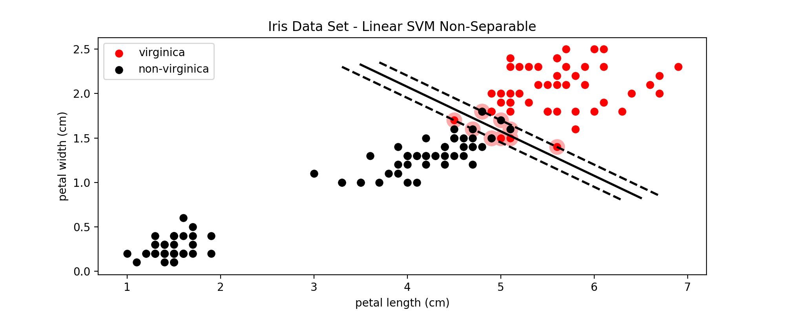</p>
<p><span style="font-family: 'courier new', courier;">图8：加入松弛变量后的SVM分类效果</span></p>
<p>C作为SVM模型的超参数之一，需要从一个较大的范围中一步一步的筛选，直到找到最适合的C。C值越大，表示错误分类的代价越大，就越趋于拒绝错误分类，即hard margin；C值越小，表示错误分类的代价越小，就越能容忍错误分类，即soft margin。即使是在线性可分的情况下，如果C设置的非常小，也可能导致错误分类的出现；在线性不可分的情况下，设置过大的C值会导致训练无法收敛。</p>
<p>&nbsp;</p>
<h3><span style="color: #99cc00;">4. SVR - 利用SVM做回归分析</span></h3>
<hr>
<p>支持向量回归模型（Support Vector Regression， SVR）是使用SVM来拟合曲线，做回归分析。分类和回归问题是有监督机器学习中最重要的两类任务。与分类的输出是有限个离散的值（例如上面的<span class="MathJax_Preview" style="color: inherit;"></span><span class="MathJax" id="MathJax-Element-65-Frame" tabindex="0" data-mathml="<math xmlns=&quot;http://www.w3.org/1998/Math/MathML&quot;><mo fence=&quot;false&quot; stretchy=&quot;false&quot;>{</mo><mo>&amp;#x2212;</mo><mn>1</mn><mo>,</mo><mn>1</mn><mo fence=&quot;false&quot; stretchy=&quot;false&quot;>}</mo></math>" role="presentation" style="position: relative;"><nobr aria-hidden="true"><span class="math" id="MathJax-Span-850" style="width: 3.926em; display: inline-block;"><span style="display: inline-block; position: relative; width: 3.223em; height: 0px; font-size: 122%;"><span style="position: absolute; clip: rect(1.232em, 1003.16em, 2.579em, -999.997em); top: -2.163em; left: 0em;"><span class="mrow" id="MathJax-Span-851"><span class="mo" id="MathJax-Span-852" style="font-family: MathJax_Main;">{</span><span class="mo" id="MathJax-Span-853" style="font-family: MathJax_Main;">−</span><span class="mn" id="MathJax-Span-854" style="font-family: MathJax_Main;">1</span><span class="mo" id="MathJax-Span-855" style="font-family: MathJax_Main;">,</span><span class="mn" id="MathJax-Span-856" style="font-family: MathJax_Main; padding-left: 0.179em;">1</span><span class="mo" id="MathJax-Span-857" style="font-family: MathJax_Main;">}</span></span><span style="display: inline-block; width: 0px; height: 2.169em;"></span></span></span><span style="display: inline-block; overflow: hidden; vertical-align: -0.354em; border-left: 0px solid; width: 0px; height: 1.361em;"></span></span></nobr><span class="MJX_Assistive_MathML" role="presentation"><math xmlns="http://www.w3.org/1998/Math/MathML"><mo fence="false" stretchy="false">{</mo><mo>−</mo><mn>1</mn><mo>,</mo><mn>1</mn><mo fence="false" stretchy="false">}</mo></math></span></span><script type="math/tex" id="MathJax-Element-65">\{-1, 1\}</script>）不同的是，回归模型的输出在一定范围内是连续的。下面不再考虑不同鸢尾花的类型，而是使用花瓣的长度（相当于自变量x）来预测花瓣的宽度（相当于因变量y）。</p>
<p>下图中从所有150个样本中，随机取出了80%作为训练集：</p>
<p>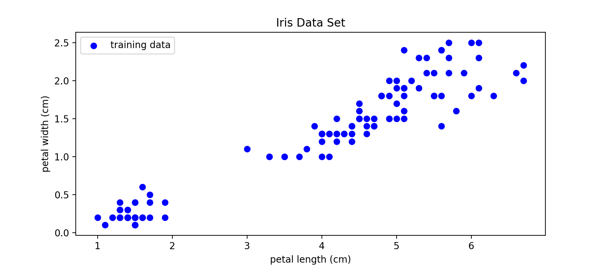</p>
<p><span style="font-family: 'courier new', courier;">图9：训练SVR模型的训练样本</span></p>
<p>下面是使用线性SVR训练出来的回归线：</p>
<p>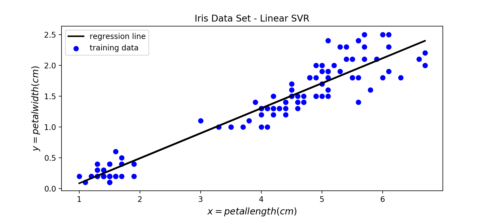</p>
<p><span style="font-family: 'courier new', courier;">图10：SVR模型训练出来的回归线</span></p>
<p>与SVM是使用一个条带来进行分类一样，SVR也是使用一个条带来拟合数据。这个条带的宽度可以自己设置，利用参数<span class="MathJax_Preview" style="color: inherit;"></span><span class="MathJax" id="MathJax-Element-66-Frame" tabindex="0" data-mathml="<math xmlns=&quot;http://www.w3.org/1998/Math/MathML&quot;><mi>&amp;#x03F5;</mi></math>" role="presentation" style="position: relative;"><nobr aria-hidden="true"><span class="math" id="MathJax-Span-858" style="width: 0.53em; display: inline-block;"><span style="display: inline-block; position: relative; width: 0.413em; height: 0px; font-size: 122%;"><span style="position: absolute; clip: rect(1.584em, 1000.41em, 2.345em, -999.997em); top: -2.163em; left: 0em;"><span class="mrow" id="MathJax-Span-859"><span class="mi" id="MathJax-Span-860" style="font-family: MathJax_Math-italic;">ϵ</span></span><span style="display: inline-block; width: 0px; height: 2.169em;"></span></span></span><span style="display: inline-block; overflow: hidden; vertical-align: -0.068em; border-left: 0px solid; width: 0px; height: 0.718em;"></span></span></nobr><span class="MJX_Assistive_MathML" role="presentation"><math xmlns="http://www.w3.org/1998/Math/MathML"><mi>ϵ</mi></math></span></span><script type="math/tex" id="MathJax-Element-66">\epsilon</script>来控制：</p>
<p>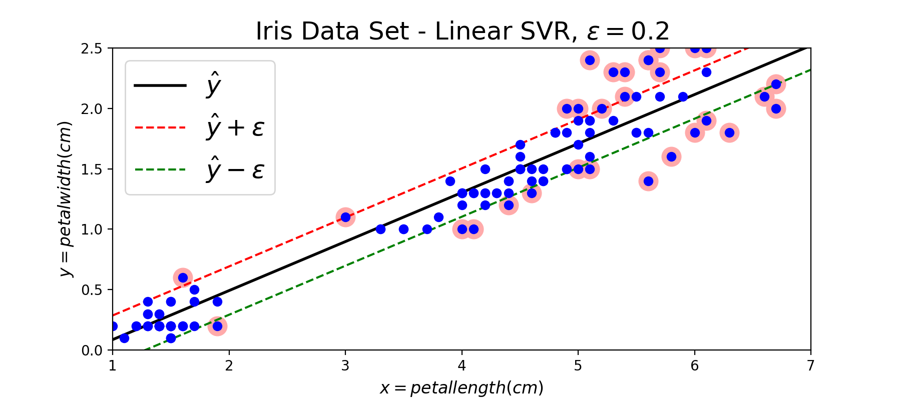</p>
<p><span style="font-family: 'courier new', courier;">图11：SVR模型回归效果示意图，其中带红色环的点表示支持向量</span></p>
<p>在SVM模型中边界上的点以及两条边界内部违反margin的点被当做支持向量，并且在后续的预测中起作用；在SVR模型中边界上的点以及两条边界以外的点被当做支持向量，在预测中起作用。按照对偶形式的表示，最终的模型是所有训练样本的线性组合，其他不是支持向量的点的权重为0. 下面补充SVR模型的代价函数的图形：</p>
<p>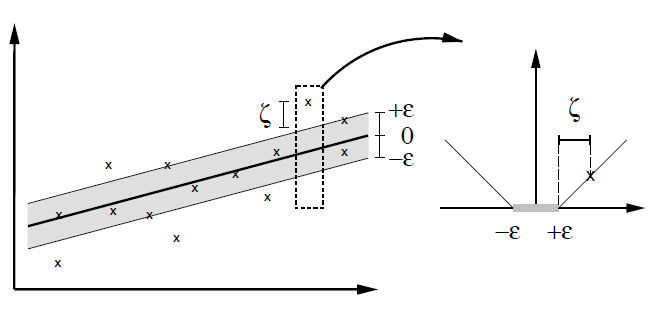</p>
<p><span style="font-family: 'courier new', courier;">图12：soft margin SVR的代价函数</span></p>
<p>从图12中可以看到，在margin内部的这些点的error都为0，只有超出了margin的点才会计算error。因此SVR的任务就是利用一条固定宽度的条带(宽度由参数<span class="MathJax_Preview" style="color: inherit;"></span><span class="MathJax" id="MathJax-Element-67-Frame" tabindex="0" data-mathml="<math xmlns=&quot;http://www.w3.org/1998/Math/MathML&quot;><mi>&amp;#x03F5;</mi></math>" role="presentation" style="position: relative;"><nobr aria-hidden="true"><span class="math" id="MathJax-Span-861" style="width: 0.53em; display: inline-block;"><span style="display: inline-block; position: relative; width: 0.413em; height: 0px; font-size: 122%;"><span style="position: absolute; clip: rect(1.584em, 1000.41em, 2.345em, -999.997em); top: -2.163em; left: 0em;"><span class="mrow" id="MathJax-Span-862"><span class="mi" id="MathJax-Span-863" style="font-family: MathJax_Math-italic;">ϵ</span></span><span style="display: inline-block; width: 0px; height: 2.169em;"></span></span></span><span style="display: inline-block; overflow: hidden; vertical-align: -0.068em; border-left: 0px solid; width: 0px; height: 0.718em;"></span></span></nobr><span class="MJX_Assistive_MathML" role="presentation"><math xmlns="http://www.w3.org/1998/Math/MathML"><mi>ϵ</mi></math></span></span><script type="math/tex" id="MathJax-Element-67">\epsilon</script>来控制)覆盖尽可能多的样本点，从而使得总误差尽可能的小。</p>
<p>&nbsp;</p>
<p>&nbsp;</p>
<h3><span style="color: #99cc00;">Reference</span></h3>
<hr>
<p>https://zh.wikipedia.org/wiki/%E6%94%AF%E6%8C%81%E5%90%91%E9%87%8F%E6%9C%BA</p>
<p>https://zhuanlan.zhihu.com/p/26263309,&nbsp;直线方程的各种形式</p>
<p>https://github.com/ageron/handson-ml/blob/master/05_support_vector_machines.ipynb</p>
<p>http://www.svms.org/regression/SmSc98.pdf</p>
<p>http://www.robots.ox.ac.uk/~az/lectures/ml/</p>
<p>edx: UCSanDiegoX - DSE220x&nbsp;Machine Learning Fundamentals</p>
<p>https://github.com/OnlyBelter/jupyter-note/blob/master/machine_learning/SVM/04_how%20SVM%20becomes%20to%20SVR.ipynb, 文中代码</p>
<p>&nbsp;</p>
<p><audio controls="controls" style="display: none;"></audio></p>
</div>


网络图片转本地：
```


```

