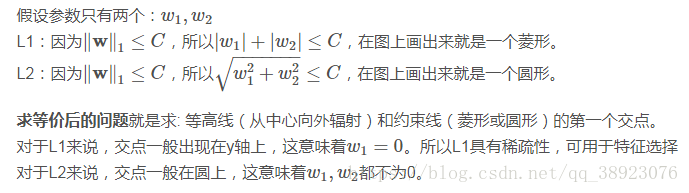

# 为什么L1稀疏，L2平滑？
使用机器学习方法解决实际问题时，我们通常要用L1或L2范数做正则化（regularization），从而限制权值大小，减少过拟合风险。特别是在使用梯度下降来做目标函数优化时，很常见的说法是,  **L1正则化产生稀疏的权值, L2正则化产生平滑的权值**。

为什么会这样？这里面的本质原因是什么呢？下面我们从多个角度来解释这个问题。

```
https://www.zhihu.com/question/37096933
https://www.cnblogs.com/tianqizhi/p/9703796.html
```

## 用图解释
总结：L2正则相当于用圆去逼近目标，而L1正则相当于用菱形去逼近目标，所以更容易引起交点在坐标轴上即得到稀疏解。

这个角度从几何位置关系来看权值的取值情况。

目标是把 w 的解限制在黄色区域内，同时使得经验损失尽可能小。





高维我们无法想象，简化到2维的情形，如上图所示。其中，左边是L1图示，右边是L2图示，左边的方形线上是L1中w1/w2取值区间，右边得圆形线上是L2中w1/w2的取值区间，绿色的圆圈表示w1/w2取不同值时整个正则化项的值的等高线（凸函数），从等高线和w1/w2取值区间的交点可以看到，L1中两个权值倾向于一个较大另一个为0，L2中两个权值倾向于均为非零的较小数。这也就是L1稀疏，L2平滑的效果。

## 从加入正则项后函数图像及导数角度

### 函数图像

假设费用函数 L 与某个参数 x 的关系如图所示：


则最优的 x 在绿点处，x 非零。

现在施加 L2 regularization，新的费用函数（）如图中蓝线所示：


最优的 x 在黄点处，x 的绝对值减小了，但依然非零。

而如果施加 L1 regularization，则新的费用函数（L + C|x|）如图中粉线所示：


最优的 x 就变成了 0。这里利用的就是绝对值函数的尖峰。

两种 regularization 能不能把最优的 x 变成 0，取决于原先的费用函数在 0 点处的导数。如果本来导数不为 0，那么施加 L2 regularization 后导数依然不为 0，最优的 x 也不会变成 0。而施加 L1 regularization 时，只要 regularization 项的系数 C 大于原先费用函数在 0 点处的导数的绝对值，x = 0 就会变成一个极小值点。

上面只分析了一个参数 x。事实上 L1 regularization 会使得许多参数的最优值变成 0，这样模型就稀疏了。

### 理论层次
假设只有一个参数为ww，损失函数为L(w)，分别加上L1正则项和L2正则项后有：


假设L(w)在0处的倒数为d0，即 


则可以推导使用L1正则和L2正则时的导数。

引入L2正则项，在0处的导数 


引入L1正则项，在0处的导数 


可见，引入L2正则时，代价函数在0处的导数仍是d0，无变化。而引入L1正则后，代价函数在0处的导数有一个突变。从d0+λ到d0−λ，若d0+λ和d0−λ异号，则在0处会是一个极小值点。因此，优化时，很可能优化到该极小值点上，即w=0处。


这里只解释了有一个参数的情况，如果有更多的参数，也是类似的。因此，用L1正则更容易产生稀疏解。

## 梯度下降角度
### 解释一
假设原先损失函数是C0，那么在L2和L1正则条件下对参数求导分别是：


可以想象用梯度下降的方法，当w小于1的时候，L2正则项的惩罚效果越来越小，L1正则项惩罚效果依然很大，L1可以惩罚到0，而L2很难。

### 解释二
看二者的区别：


我们可以看到，L2正则化的损失函数在参数更新时，参数是按固定的比例减少的（一塔与拉姆达的乘积接近于0，图中标识有误），也就是说，假如w很大，则每次更新会减少较大的值；假如w较小，则每次减少较小的值。因此，L2正则化曲线较平滑。

再看L1正则化：


从图中可以看出，参数是按固定的量减少的（即一塔与拉姆达之积），如果w是正的，则减少一个固定量；如果w是负的，则加上一个固定量。因此，如果w本来比较小的话，那么就很容易会被更新为0。

### 解释三
这个角度从权值的更新公式来看权值的收敛结果。

首先来看看L1和L2的梯度(导数的反方向）：


所以(不失一般性，我们假定：wi等于不为0的某个正的浮点数，学习速率η 为0.5)：

L1的权值更新公式为wi = wi - η * 1  = wi - 0.5 * 1，也就是说**权值每次更新都固定减少一个特定的值(比如0.5)，那么经过若干次迭代之后，权值就有可能减少到0**。

L2的权值更新公式为wi = wi - η * wi = wi - 0.5 * wi，也就是说**权值每次都等于上一次的1/2，那么，虽然权值不断变小，但是因为每次都等于上一次的一半，所以很快会收敛到较小的值但不为0**。

下面的图很直观的说明了这个变化趋势：


总结：

* **L1能产生等于0的权值，即能够剔除某些特征在模型中的作用（特征选择），即产生稀疏的效果。**

* **L2可以得迅速得到比较小的权值，但是难以收敛到0，所以产生的不是稀疏而是平滑的效果。**

## 一个大神的总结笔记
ps：概率的角度我没看懂，上面就没写。


